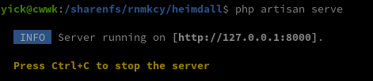
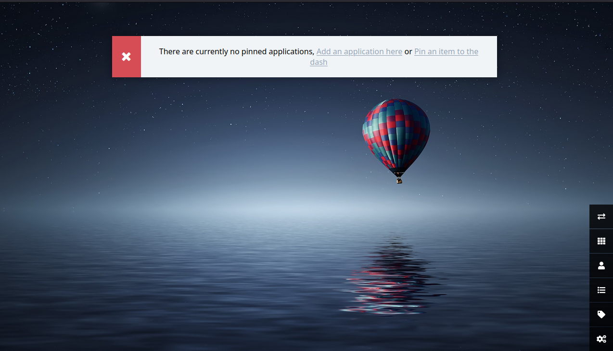
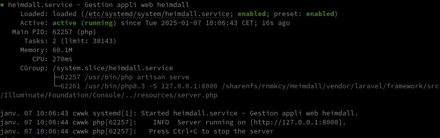
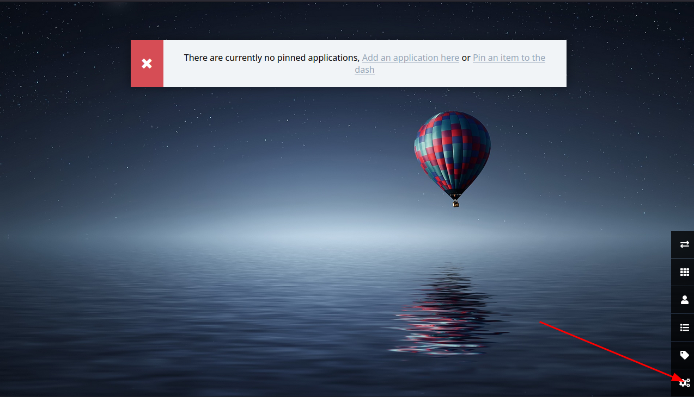
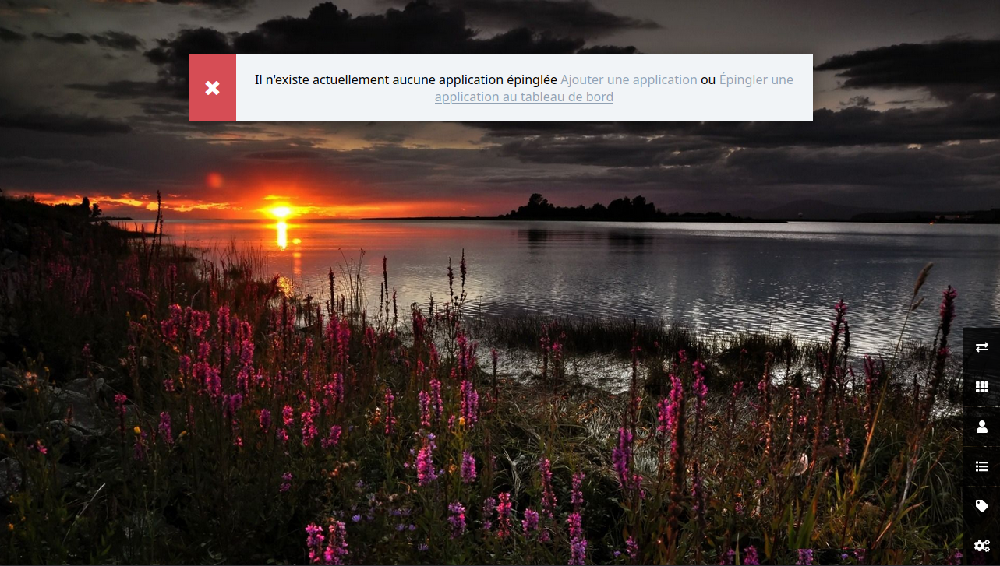

+++
title = 'CWWK Serveur Debian 12 - Heimdall'
date = 2025-01-07 00:00:00 +0100
categories = ['application']
+++
*Heimdall est une solution open-source pour centraliser les applications*  


### Applications prises en charge

Vous pouvez utiliser l'application pour lier à n'importe quel site ou application, mais les applications Foundation rempliront automatiquement l'icône de l'application et fourniront une couleur par défaut pour la tuile. En outre, les applications améliorées vous permettent de fournir des détails à une API d'applications, vous permettant de voir les statistiques en direct directement sur le tableau de bord. Par exemple, les applications NZBGet et Sabnzbd Enhanced afficheront la taille de la file d'attente et la vitesse pendant le téléchargement.

Les demandes appuyées sont reconnues par le titre de la demande tel qu'il est entré dans le champ Titre lors de l'ajout d'une demande. Par exemple, pour ajouter un lien à pfSense, commencez par taper "p" dans le champ titre, puis sélectionnez "pfSense" dans la liste des applications supportées.

### Installation

Outre les dépendances de Laravel 10, à savoir PHP >= 8.1, Extension Ctype PHP, Extension CURL PHP, Extension DOM PHP, Extension Fileinfo PHP, Extension Filtre PHP, Extension Hash PHP, Extension Mbstring PHP, Extension OpenSSL PHP, Extension PCRE PHP, Extension PDO PHP, Extension Session PHP, Extension Tokenizer PHP, PHP XML Extension, la seule autre chose dont Heimdall a besoin est le support squlite et le support zip (php-zip).

Si vous ne pouvez pas changer l'arrière-plan assurez-vous que **php_fileinfo** est activé dans votre **php.ini**. 

Téléchargement et extraction du zip/tar 

```bash
wget https://github.com/linuxserver/Heimdall/archive/refs/tags/v2.6.3.tar.gz
tar xzvf v2.6.3.tar.gz 
mv Heimdall-2.6.3/ /sharenfs/rnmkcy/heimdall/
```

### Configuration

création du fichier .env et génération d'une clé de chiffrement 

```bash
cd /sharenfs/rnmkcy/heimdall/
#php --version
cp .env.example .env
nano .env
php artisan key:generate
```

Tester l'application

```
cd /sharenfs/rnmkcy/heimdall/
php artisan serve
```

  

Sur un poste du réseau detenant un accès SSH au serveur cwwk , lancer la commande

    ssh -L 9500:127.0.0.1:8000 yick@192.168.0.205 -p 55205 -i /home/yann/.ssh/yick-ed25519

Sur ce même poste ouvrir un navigateur sur le lien localhost:9500  
  


### Exécuter un script PHP en tant que service Systemd

Créer un service heimdall pour lancer le serveur et ajouter les informations suivantes

    sudo nano /etc/systemd/system/heimdall.service

```
[Unit]
Description=Gestion appli web heimdall
After=network.target

[Service]
User=yick
Group=yick
Restart=always
WorkingDirectory=/sharenfs/rnmkcy/heimdall
ExecStart=/usr/bin/php artisan serve

[Install]
WantedBy=multi-user.target
```

Recharger le daemon système pour que le nouveau service soit reconnu.

    sudo systemctl daemon-reload

Activer et lancer le nouveau service.

    sudo systemctl enable heimdall.service --now

Vérifiez l'état du service 

    systemctl status heimdall

  
Si vous voyez le feu vert, alors vous avez configuré avec succès votre php script comme un service système.

### VHost reverse proxy nginx

Création site portail pour heimdall   
Fichier de configuration nginx `/etc/nginx/conf.d/portail.rnmkcy.eu.conf`

```
server {
    listen 80;
    listen [::]:80;
    server_name  portail.rnmkcy.eu;

    # redirect all plain HTTP requests to HTTPS
    return 301 https://portail.rnmkcy.eu$request_uri;
}

server {
    # ipv4 listening port/protocol
    listen       443 ssl http2;
    # ipv6 listening port/protocol
    listen           [::]:443 ssl http2;
    server_name  portail.rnmkcy.eu;

    include /etc/nginx/conf.d/security.conf.inc;

  location / { 
    # proxy_set_header. Modifie ou ajoute des en-têtes à la requête envoyée par le serveur d’origine
    # en veillant à ce qu’il reçoive toutes les informations nécessaires sur la requête originale 
    proxy_pass http://127.0.0.1:8000;
    proxy_set_header Host $host;
    proxy_set_header X-Real-IP $remote_addr;
    proxy_set_header X-Forwarded-For $proxy_add_x_forwarded_for;
    proxy_set_header X-Forwarded-Proto $scheme;
  } 

}
```

Recharger nginx

    sudo systemctl reload nginx

### Paramétrage

Ouvrir le lien https://portail.rnmkcy.eu

On arrive sur la page d'accueil  
  
Modifier la langue, l'image arrière plan et ouverture nouvel onglet  
  
