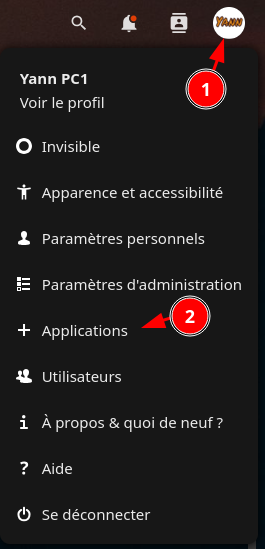
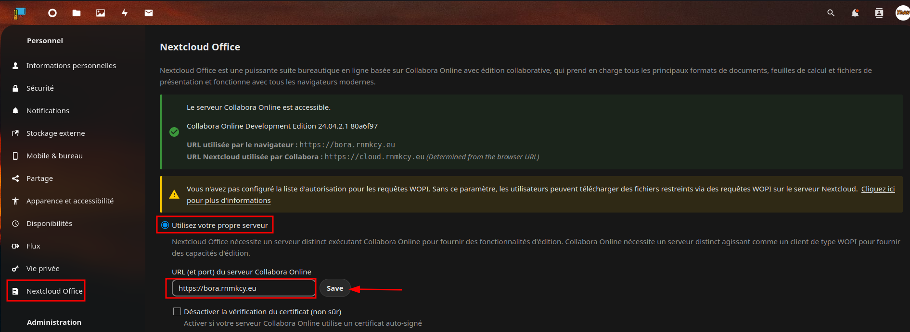
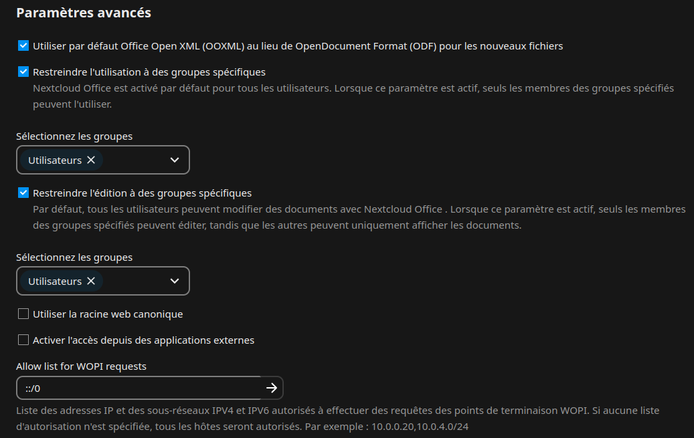
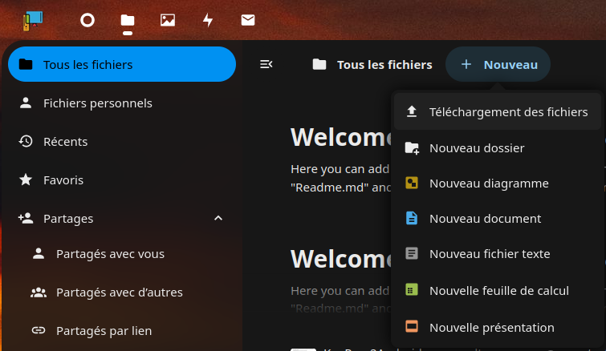
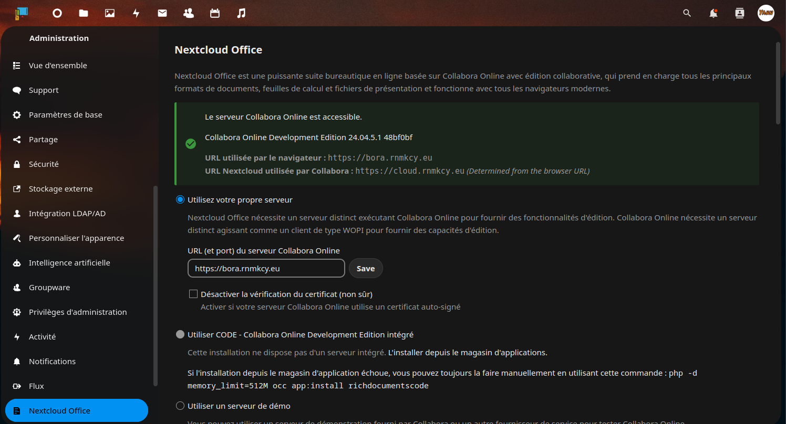
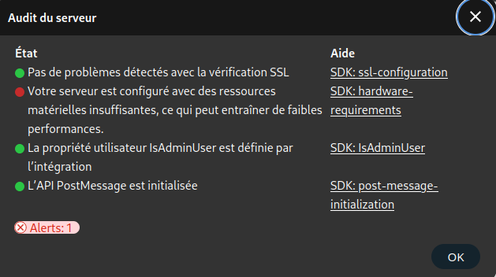

+++
title = 'Collabora'
date = 2025-01-15 00:00:00 +0100
categories = application debian nextcloud
+++
*[Collabora Online](https://www.collaboraoffice.com/) est une solution complète de bureautique en ligne qui permet l’édition simultanée de  documents texte, tableur et présentation.*

{:width="100"}

## Serveur Collabora

*Installation et configuration des packages CODE natifs sous Linux. Collabora fournit des packages Linux natifs aux formats deb et rpm. Pour le format deb, 3 plates-formes sont prises en charge : amd64, ppc64 et arm64. Pour le format rpm, seul amd64 est pris en charge.*  

(en mode su)

### Importez la clé de signature

Les packages CODE sont signés numériquement par Collabora Productivity Ltd. La première étape consiste à importer la clé de signature.

Sur les distributions basées sur Deb, utilisez la commande suivante :

```bash
cd /usr/share/keyrings
sudo wget https://collaboraoffice.com/downloads/gpg/collaboraonline-release-keyring.gpg
```

### Ajouter des référentiels de packages CODE

Sur les distributions basées sur Deb, créez /etc/apt/sources.list.d/collaboraonline.source 

```bash
cat << EOF > /etc/apt/sources.list.d/collaboraonline.sources
Types: deb
URIs: https://www.collaboraoffice.com/repos/CollaboraOnline/CODE-debian11
Suites: ./
Signed-By: /usr/share/keyrings/collaboraonline-release-keyring.gpg
EOF
```

### Installer les paquets

Sur les distributions basées sur Deb, utilisez la commande suivante :

```bash
apt update && apt install coolwsd code-brand
```

Pour une localisation complète de l'interface utilisateur, vous devez installer les ressources linguistiques de Collabora Office. Elles ne dépendent pas directement de coolwsd. Par exemple pour les dialogues en français sur Debian/Ubuntu :

```bash
apt install collaboraoffice*fr
```

### Configuration

Modifier /etc/coolwsd/coolwsd.xml 

Avec la configuration actuelle, le service coolwsd continue d'échouer et de redémarrer. Ceci est dû au fait que Collabora ne peut pas établir de connexion HTTPS avec l'hôte local. Utilisez l'outil coolconfig pour désactiver HTTPS sur la connexion.

```bash
sudo coolconfig set ssl.enable false
sudo coolconfig set ssl.termination true
```

Seuls certains hôtes désignés sont autorisés à accéder au serveur Collabora. Pour désigner Nextcloud comme client de confiance, définir storage.wopi.host avec le domaine Nextcloud, par exemple, cloud.rnmkcy.eu.

```bash
sudo coolconfig set storage.wopi.host cloud.rnmkcy.eu
```

Créez un compte d'administration et fournissez un mot de passe pour le compte. Lorsque vous y êtes invité, entrez le nom d'utilisateur **admin**. Ensuite, entrez deux fois le mot de passe admin.

```bash
sudo coolconfig set-admin-password
```

[Performance](https://sdk.collaboraonline.com/docs/installation/Configuration.html#performance)

Le service Collabora Online (coolwsd) fonctionne via systemd. Redémarrez le service coolwsd et vérifiez l'état du service.

```bash
sudo systemctl restart coolwsd
sudo systemctl status coolwsd
```

Collabora Online se connecte au journal systemd par défaut. Vous pouvez consulter le journal avec :

```bash
sudo journalctl -u coolwsd
```

### CWWK - Proxy inverse Nginx

La directive client_max_body_size attribue la taille maximale acceptée pour le corps de la requête du client, indiquée par la ligne Content-Length dans l'en-tête de la requête. Si la taille est supérieure à celle indiquée, le client obtient l'erreur « Request Entity Too Large » (413)
{: .prompt-warning }

Créez un fichier d'hôte virtuel NGINX pour collabora.

```bash
sudo nano /etc/nginx/conf.d/bora.rnmkcy.eu.conf
```

Ajoutez la configuration suivante au fichier.  

* Adapter la valeur de **server_name**
* Adapter IP 127.0.0.1 si différente

```
server {
    listen 80;
    listen [::]:80;
    server_name  bora.rnmkcy.eu;

  # redirect all plain HTTP requests to HTTPS
  return 301 https://bora.rnmkcy.eu$request_uri;
}

server {
    listen 443 ssl http2;
    listen [::]:443 ssl http2;
    server_name bora.rnmkcy.eu;

    # Sécurité + https
    include /etc/nginx/conf.d/security.conf.inc;

    error_log /var/log/nginx/bora.error;

    # increase the maximum file upload size if needed: by default nginx limits file upload to 1MB (413 Entity Too Large error)
    client_max_body_size 1G;

    # static files
    location ^~ /browser {
    proxy_pass http://127.0.0.1:9980;
    proxy_set_header Host $http_host;
    }

    # WOPI discovery URL
    location ^~ /hosting/discovery {
    proxy_pass http://127.0.0.1:9980;
    proxy_set_header Host $http_host;
    }

    # Capabilities
    location ^~ /hosting/capabilities {
    proxy_pass http://127.0.0.1:9980;
    proxy_set_header Host $http_host;
    }

    # main websocket
    location ~ ^/cool/(.*)/ws$ {
    proxy_pass http://127.0.0.1:9980;
    proxy_set_header Upgrade $http_upgrade;
    proxy_set_header Connection "Upgrade";
    proxy_set_header Host $http_host;
    proxy_read_timeout 36000s;
    }

    # download, presentation and image upload
    location ~ ^/(c|l)ool {
    proxy_pass http://127.0.0.1:9980;
    proxy_set_header Host $http_host;
    }

    # Admin Console websocket
    location ^~ /cool/adminws {
    proxy_pass http://127.0.0.1:9980;
    proxy_set_header Upgrade $http_upgrade;
    proxy_set_header Connection "Upgrade";
    proxy_set_header Host $http_host;
    proxy_read_timeout 36000s;
    }
}
```

Testez la syntaxe du fichier pour vous assurer qu'il ne contient pas d'erreurs.

```bash
sudo nginx -t
```

Redémarrez NGINX et vérifiez son état.

```bash
sudo systemctl reload nginx
sudo systemctl status nginx
```

Administration serveur <https://bora.rnmkcy.eu/browser/dist/admin/admin.html>

## Nextcloud Collabora

### Paramétrage

Pour utiliser Collabora en tant qu'application Nextcloud, connectez le serveur Collabora à Nextcloud via le Nextcloud Hub. Dans le contexte Nextcloud, Collabora CODE est nommé "Nextcloud Office". 

1. Naviguez vers l'adresse du domaine Nextcloud et connectez-vous à NextCloud à l'aide de vos identifiants.
2. Cliquez sur le profil administrateur, représenté par un cercle dans le coin supérieur droit de la fenêtre et choisissez **+ Applications** pour afficher le panneau des applications.  
{:height="300"}  
3. Dans le panneau des applications, cliquez sur le lien **Bureautique & texte** dans le panneau de navigation de gauche.  
4. La page suivante affiche toutes les applications de bureautique et de gestion de documents. Faites défiler la liste ou utilisez la fonction de recherche pour trouver l'application **Nextcloud Office**. Cliquez sur le bouton Télécharger et activer à côté de l'application.
5. Ouvrez le profil d'administrateur en cliquant à nouveau sur le cercle en haut à droite de l'écran. Sélectionnez le lien **Paramètres d'administration**.
6. Dans le panneau de navigation de gauche, faites défiler vers le bas jusqu'à ce que le paramètre **Nextcloud Office** apparaisse et cliquez sur l'étiquette.
7. Nextcloud affiche les paramètres de Nextcloud Office. Activez le paramètre **Utiliser votre propre serveur** en cliquant sur le bouton radio. Ceci fait apparaître une boîte de texte pour entrer l'URL (et le Port) du serveur Collabora Online. Saisissez ici le sous-domaine de Collabora, par exemple, https://collabora.example.com et cliquez sur Enregistrer. Si la connexion est réussie, Nextcloud confirme que le serveur Collabora Online est accessible.   
  
8. Repérez la section Paramètres avancés en bas de la page. Assurez-vous que la case **Utiliser Office Open XML (OOXML) au lieu d'OpenDocument Format par défaut pour les prochains fichiers** est cochée. Cela permet de s'assurer que tous les fichiers sont compatibles avec Microsoft Office. Pour plus de sécurité, entrez le nom du domaine Collabora à côté de **Autoriser la liste pour les requêtes WOPI**.  

9. Pour créer un nouveau fichier, cliquez sur l'icône du dossier de fichiers dans la barre de menu supérieure. L'écran Tous les fichiers s'affiche. Cliquez sur le symbole + à droite de l'icône d'accueil et sur le symbole >. Une liste des options de fichiers possibles s'affiche.  
{:width="300"}
10. Donnez un nom au fichier et cliquez sur l'icône de la flèche droite pour le créer. Vous pouvez baser le fichier sur un modèle ou commencer avec un fichier vierge. Saisissez le contenu du nouveau fichier. Nextcloud enregistre automatiquement le fichier chaque fois qu'il est modifié. Fermez le fichier en utilisant le bouton X en haut à droite lorsque vous avez terminé.

Paramétrage final accessible par administration Nextcloud  
  
  


### Avertissements

A l'ouverture d'un document ODT sur nextcloud , message d'avertissement  
{:width="400"}

**Correction en désactivant le messsage**

Ouvrir le fichier de configuration `/etc/coolwsd/coolwsd.xml` et modifier la ligne 

```xml
<disable_server_audit default="false" desc="Disabled server audit dialog and notification. Admin will no longer see warnings in the application user interface. This doesn't affect log file." type="bool">true</disable_server_audit>
```

Redémarer le service

```shell
sudo systemctl restart coolwsd.service