+++
title = 'NordVPN fournisseur de services de réseau privé virtuel (VPN)'
date = 2025-01-22 00:00:00 +0100
categories = vpn
+++
*NordVPN est un fournisseur de services de réseau privé virtuel personnel. NordVPN est basé au Panama. Le pays n'a pas de lois obligatoires sur la conservation des données et ne participe pas aux alliances Five Eyes ou Fourteen Eyes. Sous Linux, NordVPN fonctionne via un outil de ligne de commande.*

  
<mark>NordVPN propose à ses utilisateurs d’installer son application VPN sur 10 appareils différents</mark>

## Compte NordVPN

### Créer un compte

Pour utiliser NordVPN, vous devez créer votre propre compte sur le site officiel de NordVPN. https://nordvpn.com

### Autorisation multi facteur (double authentification)

Se connecter sur le compte et ouvrir "Paramètres du compte"  
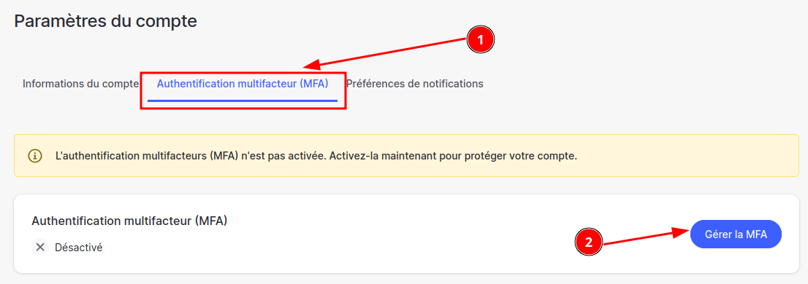{: .normal}  

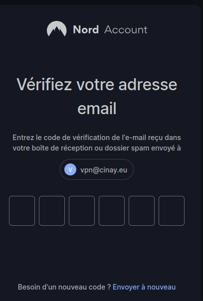{:width="300" .normal}  
Saisir le code envoyé par messagerie  

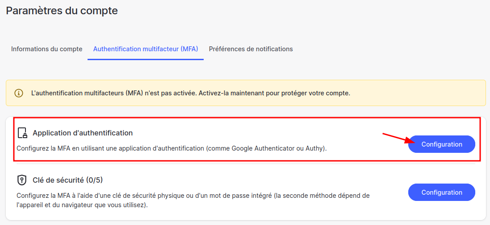{: .normal}  
Suivre la procédure pour paramétrer le mobile avec le qrcode et l'application KeepassXC  
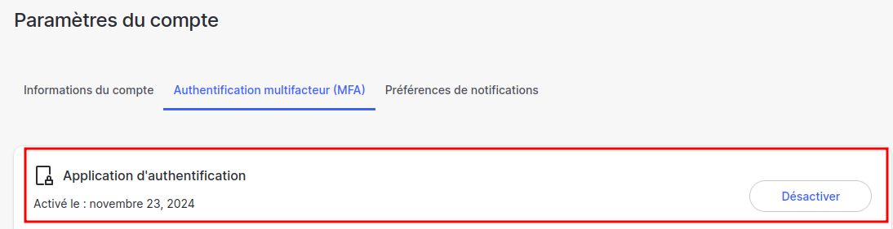{: .normal}  

## Linux NordVPN

* [Support NordVPN](https://support.nordvpn.com/hc/fr/articles/20196094470929-NordVPN-sur-Debian-Ubuntu-Raspberry-Pi-Elementary-OS-Linux-Mint)
* [How to use NordVPN command-line utility](https://sleeplessbeastie.eu/2019/02/04/how-to-use-nordvpn-command-line-utility/)

### Installation

1-NordVPN peut être installé avec le package nordvpn-bin AUR

    yay -S nordvpn-bin

2-Méthode manuelle

Ouvrir un terminal. Puis saisir les commandes suivantes pour installer NordVPN  

```bash
sudo apt intall curl
sh <(curl -sSf https://downloads.nordcdn.com/apps/linux/install.sh)
```

3-séquence de commandes bash utilisée pour configurer votre environnement

```bash
sudo groupadd nordvpn
sudo usermod -aG nordvpn $USER
```

Obligation de se reconnecter pour prise en comte

### Service systemd

Pour utiliser NordVPN, vous devez activer et démarrer **nordvpnd.service** 

    sudo systemctl enable nordvpnd.service --now

### Première connexion

Se connecter au compte NordVPN

    nordvpn login

Vous recevez la réponse suivante

    Continue in the browser: https://api.nordvpn.com/v1/users/oauth/login-redirect?attempt=83b07c63-339d-44ce-8c31-c56f26f85e21

Ouvrir le lien dans le navigateur et après saisie   
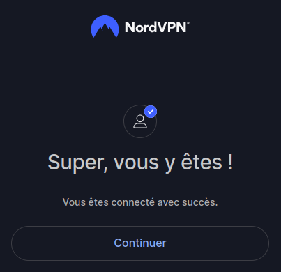{:width="300" .normal}   
Vous pouvez fermer le navigateur

## nordvpn - Liste des commandes      

* `nordvpn login` : s'identifier.
* `nordvpn connect` ou `nordvpn c` : se connecter au VPN. Pour se connecter à des serveurs spécifiques, utilisez country_code server_number> (par exemple : nordvpn connect uk715).
* `nordvpn disconnect` ou `nordvpn d` : se déconnecter du VPN.
* `nordvpn c double_vpn` : se connecter au serveur Double VPN le plus proche.
* `nordvpn connect --group double_vpn <country_code>` : se connecter à un pays spécifique via les serveurs Double VPN.
* `nordvpn connect --group p2p <country_code>` : se connecter à un pays spécifique via les serveurs P2P.
* `nordvpn connect P2P` : se connecter à un serveur P2P.
* `nordvpn connect The_Americas` : se connecter à un serveur situé en Amérique.
* `nordvpn connect Dedicated_IP` : se connecter à un serveur avec IP dédiée.
* `nordvpn set` ou `nordvpn s` : définir une option de configuration.

* `nordvpn set threatprotectionlite on / off` : activer ou désactiver Protection Anti-menaces Lite.
* `nordvpn set killswitch on / off` : activer ou désactiver le Kill Switch.
* `nordvpn set autoconnect on / off` : activer ou désactiver la connexion automatique. Vous pouvez définir un serveur spécifique pour la connexion automatique en utilisant `nordvpn set autoconnect on country_code+server_number`. Exemple : `nordvpn set autoconnect on us2435`
* `nordvpn set notify on / off` : activer ou désactiver les notifications.
* `nordvpn set dns 1.1.1.1 1.0.0.1` : configurer un DNS personnalisé (vous pouvez configurer un DNS unique ou deux, comme indiqué dans cette commande)..
* `nordvpn set protocol udp / tcp` : basculer entre les protocoles UDP et TCP.
* `nordvpn set obfuscate on / off` : activer ou désactiver les serveurs obfusqués.
* `nordvpn set technology` : définir la technologie de connexion (OpenVPN ou NordLynx.)
* `nordvpn set meshnet on` : activer Réseau Mesh sur votre appareil.
* `nordvpn set lan-discovery enable / disable` : activer ou désactiver la découverte du réseau local.
* `nordvpn set lan-discovery --help` : obtenir plus d'informations sur la découverte du réseau local.
* `nordvpn whitelist add port 22` : ajouter une règle pour autoriser un port entrant spécifié. Vous pouvez autoriser plusieurs ports : il vous suffit de séparer leurs numéros avec un espace
* `nordvpn whitelist remove port 22` : retirer la règle pour autoriser un port entrant spécifié.
* `nordvpn whitelist add subnet 192.168.0.0/16` : ajouter une règle pour autoriser un sous-réseau spécifié.
* `nordvpn whitelist remove subnet 192.168.0.0/16` : retirer la règle pour autoriser un sous-réseau spécifié.

* `nordvpn account` : voir les informations sur le compte.
* `nordvpn register` : créer un nouveau compte utilisateur.
* `nordvpn rate` : noter la qualité de votre dernière connexion (de 1 à 5).
* `nordvpn settings` : voir les paramètres actuels.
* `nordvpn status` : afficher l'état de la connexion.
* `nordvpn countries` : voir la liste des pays.
* `nordvpn cities` : voir la liste des villes. Exemple : nordvpn cities united_states
* `nordvpn groups` : afficher une liste de groupes de serveurs disponibles.
* `nordvpn logout` : se déconnecter.
* `nordvpn help` ou `nordvpn h` : voir la liste des commandes disponibles ou obtenir de l'aide pour une commande spécifique.

Vous pouvez obtenir une explication détaillée de toutes les commandes en utilisant la commande man nordvpn dans Terminal.

Connexion au compte NordVPN

```bash
nordvpn login
```

Vous connecte à votre compte NordVPN.

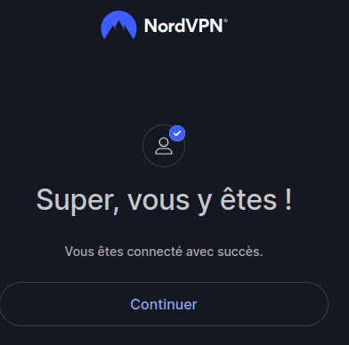{:width="300" .normal}  
clic droit sur « Continuer » dans votre navigateur après la connexion)  
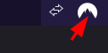{: .normal}  

Accédez à des imprimantes, des téléviseurs et d'autres appareils sur votre réseau local tout en étant connecté à un VPN.

    nordvpn set lan-discovery on

{: .normal}  

Vérification : <https://ipleak.net/>  
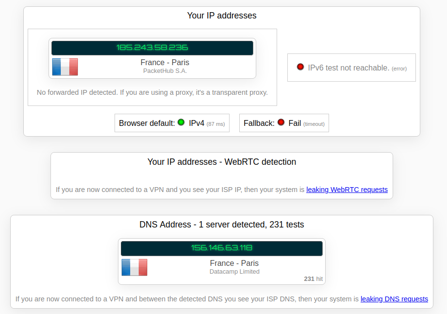{: .normal}  

Définir la connexion automatique

    nordvpn set autoconnect on Dedicated_IP

{: .normal}  

Lister le paramétrage

    nordvpn settings

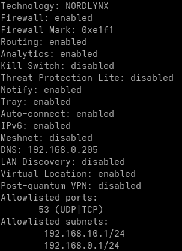{: .normal}  

Connexion vpn ip dédiée

```bash
nordvpn connect Dedicated_IP
```

{: .normal}  

Déconnexion

    nordvpn d

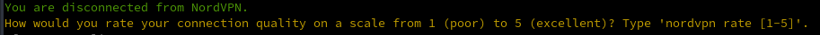{: .normal}  


Connexion France Paris

    nordvpn connect France Paris

Définir la connexion automatique France Paris

    nordvpn set autoconnect on France Paris


## NordVPN - Firefox 

Extension de proxy VPN pour Firefox : l'une des extensions proxy les plus rapides

* Naviguez en toute sécurité avec une extension VPN pour Mozilla Firefox.
* Choisissez les pages à sécuriser grâce au split tunneling.
* Activez la connexion automatique et naviguez en toute sérénité.
* Bloquez les publicités et les sites Web malveillants avec Protection Anti-menaces. 

[Extension NordVPN Mozilla Firefox](https://addons.mozilla.org/en-US/firefox/addon/nordvpn-proxy-extension/)

Paramètres  

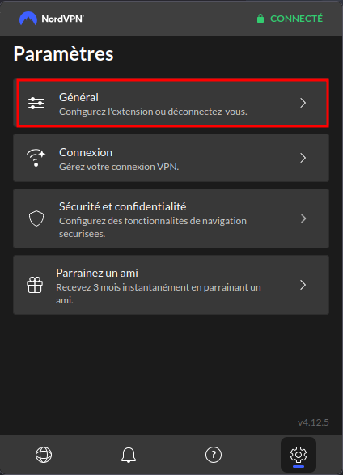{:width="200" .normal} 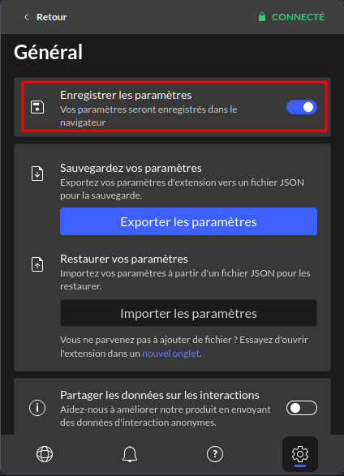{:width="200" .normal} 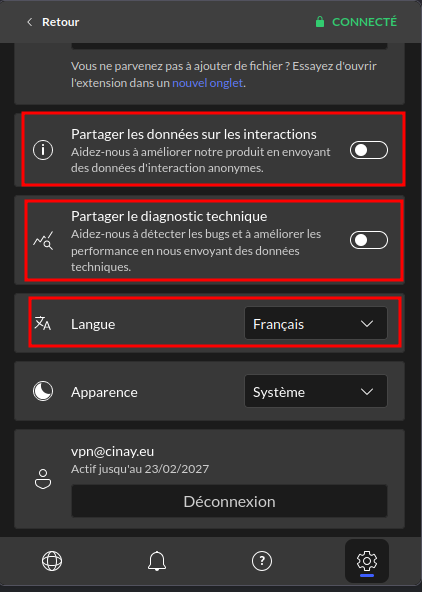{:width="200" .normal}

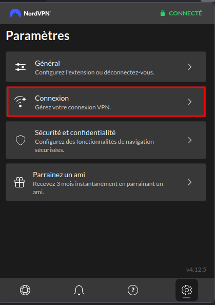{:width="200" .normal} 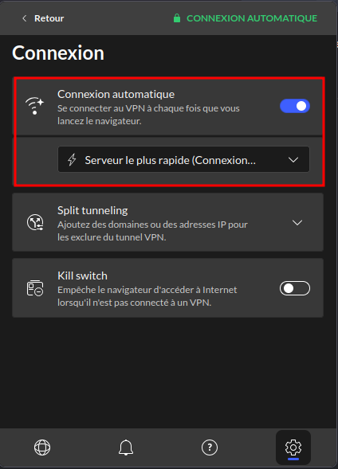{:width="200" .normal} 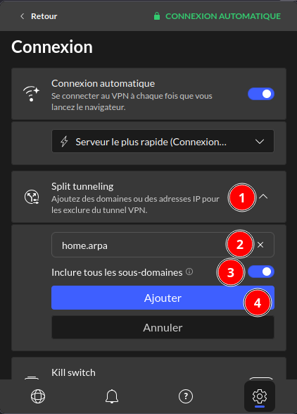{:width="200" .normal}

## NordVPN - Android 

### Application NordVPN

Comment télécharger et installer NordVPN sur Android

Tout d’abord, téléchargez NordVPN pour Android, puis installez l'application sur votre appareil Android.

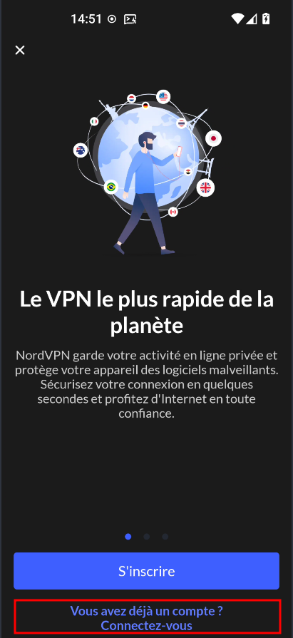{:width="200" .normal} 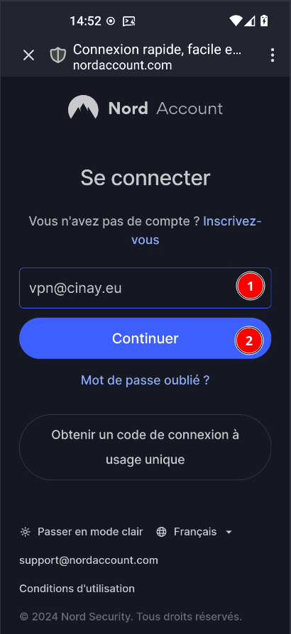{:width="200" .normal} 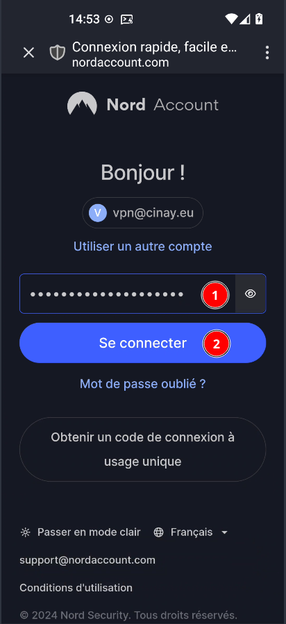{:width="200" .normal}  

{:width="200" .normal} 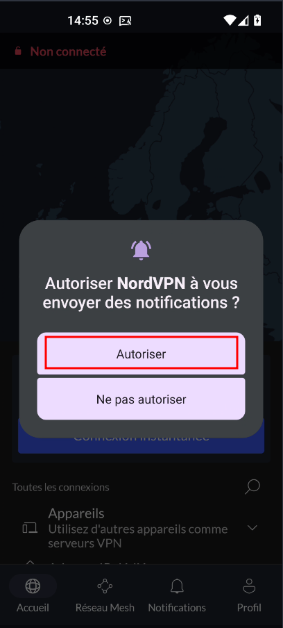{:width="200" .normal} 

**Pour une connexion à Internet sécurisée et confidentielle**, connectez-vous à un serveur de NordVPN. Ceci peut être effectué de plusieurs façons : 

* en appuyant sur le bouton CONNEXION INSTANTANÉE
* en cliquant sur le nom d'un pays dans la liste des pays
* en tapant dans la barre de recherche pour trouver un serveur.

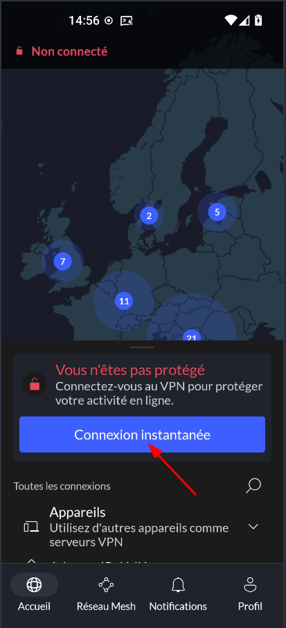{:width="200" .normal} 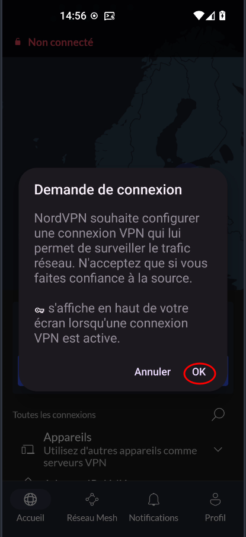{:width="200" .normal} 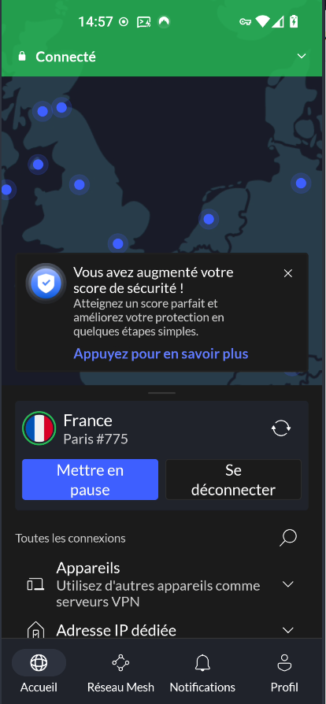{:width="200" .normal} 


Sur l'écran principal, faites glisser vers le haut pour afficher toutes les options et fonctionnalités des serveurs.  
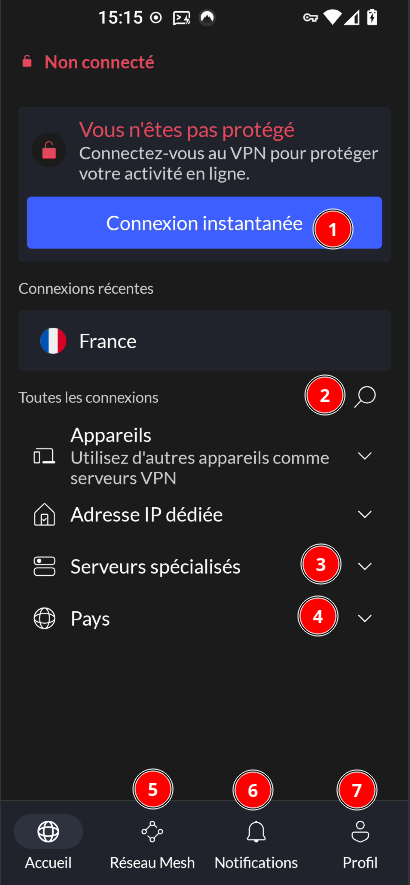{:width="200" .normal}  


1.    **Connexion instantanée** : connectez-vous au serveur le plus proche et le moins chargé. Cette méthode de connexion est utile si les particularités comme l'emplacement du serveur ou d'autres paramètres ne sont pas aussi importantes que d'accéder à un service ultra-rapide.
2.    **Barre de recherche** : utilisez-la pour trouver des serveurs spécifiques. Vous pouvez saisir un pays, une ville, un numéro de serveur ou encore la catégorie de spécialité.
3.    **Serveurs spécialisés** : NordVPN propose divers types de serveurs, chacun présentant des avantages uniques. Découvrez-en plus à ce sujet dans notre article dédié : À quoi correspondent les différentes catégories de serveurs ? 
4.    **Liste de tous les pays** : il s’agit d’une autre méthode de connexion. Il vous suffit de faire défiler la liste pour trouver le pays auquel vous souhaitez vous connecter, puis de cliquer sur celui-ci.
5.    **Réseau Mesh** : cette fonctionnalité vous permet de créer un réseau privé et sécurisé pour de nombreux appareils à travers le monde, d'y accéder à distance et d'acheminer toute votre activité en ligne par un autre appareil. 
7.    **Notifications** : vous y trouverez toute l’actualité sur les dernières mises à jour et des conseils de sécurité.
8.    **Statistiques et paramètres** : cliquez ici pour retrouver vos statistiques de connexion et appuyez sur l’icône en forme de roue dentée pour afficher le menu des paramètres. La section ci-dessous décrit toutes les options que vous y trouverez.

### Choisir parmi différents serveurs

**Connexion à un pays spécifique** : faites glisser vers le haut pour afficher la liste des pays. Dans celle-ci, appuyez sur le pays souhaité et vous serez automatiquement connecté à un serveur à cet emplacement.  
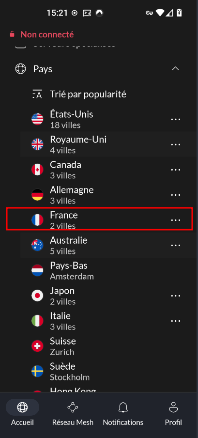{:width="200" .normal}  

Par ailleurs, les épingles sur la carte du monde indiquent où nous disposons de serveurs et leur nombre dans ce pays. Appuyez dessus pour afficher les villes où nous disposons de serveurs.  
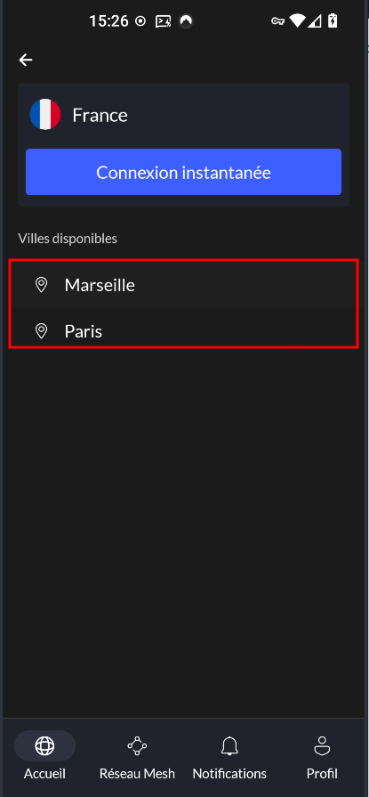{:width="200" .normal}  

Vous pouvez appuyer sur les épingles ne présentant pas de numéro et vous connecter à la ville de votre choix.   
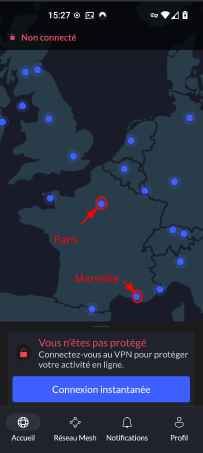{:width="200" .normal}  

**cliquer sur la barre de recherche** et y saisir le nom du pays souhaité.  
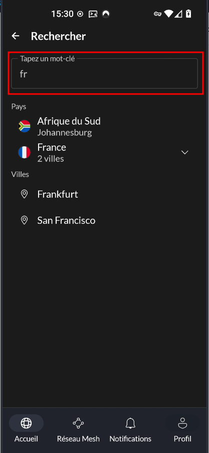{:width="200" .normal}  

**Connexion à une ville spécifique** : vous pouvez appuyer sur les trois points à côté d'un pays pour sélectionner une ville spécifique.  
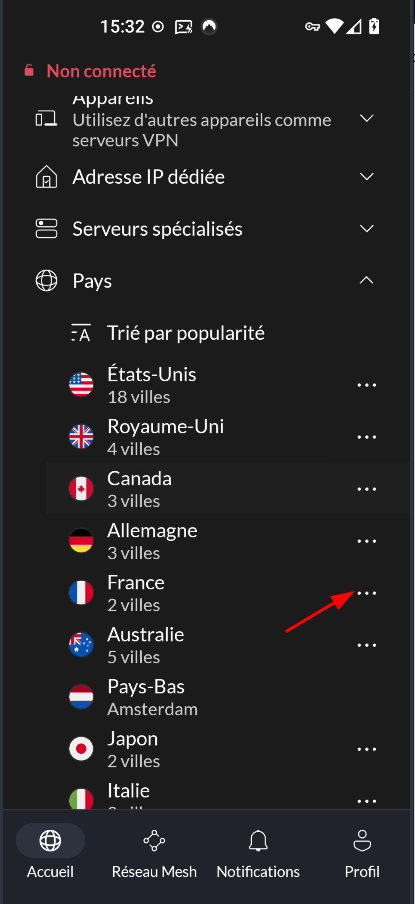{:width="200" .normal} 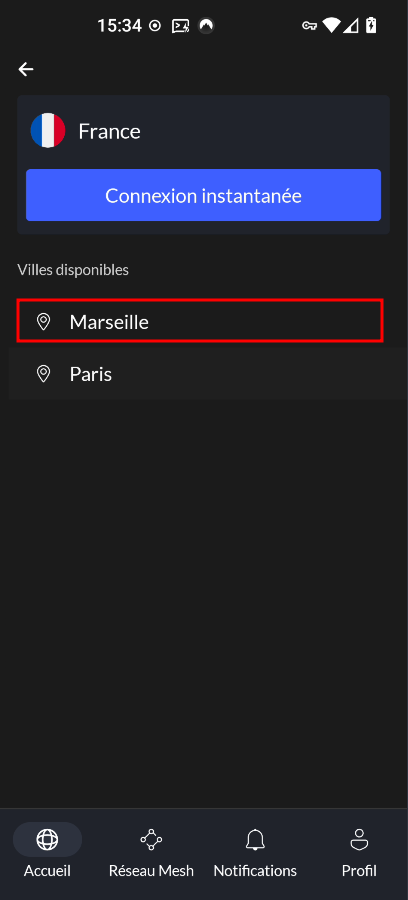{:width="200" .normal}

**Connexion à un serveur spécifique** : vous connaissez le numéro d’un serveur que vous souhaitez utiliser à nouveau ? Saisissez-le dans la barre de recherche et vous le trouverez  
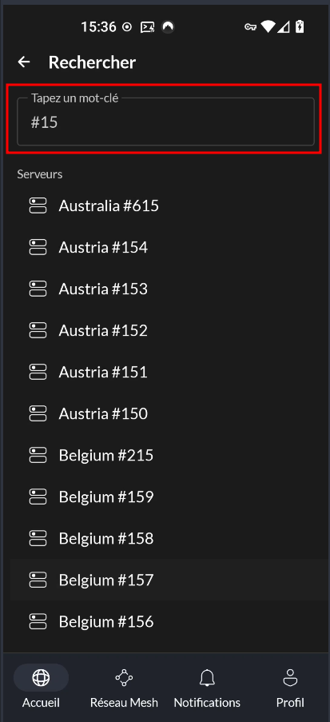{:width="200" .normal}  

### Configurer les paramètres du VPN

Sur l'écran de la carte, appuyez sur l'icône du **profil utilisateur** dans le coin inférieur droit pour accéder aux Statistiques et paramètres du compte.  
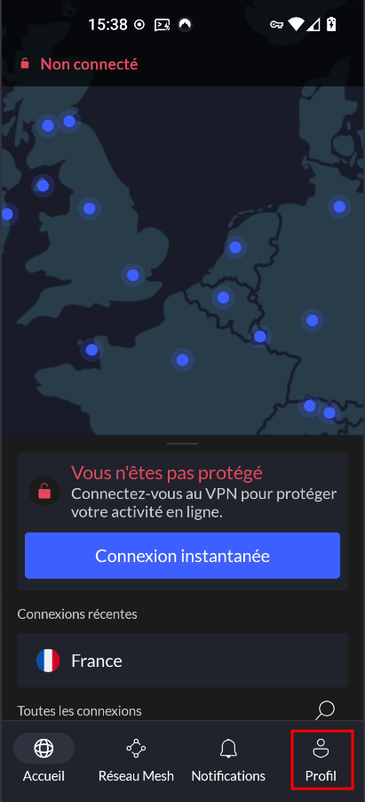{:width="200" .normal} 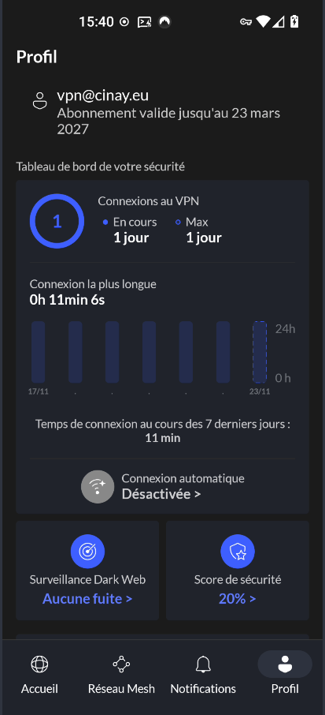{:width="200" .normal}   
Faire défiler vers le hau et appuyez sur l’icône en forme d'engrenage **Réglages** dans le coin supérieur droit pour accéder à tous les paramètres de l'application.  
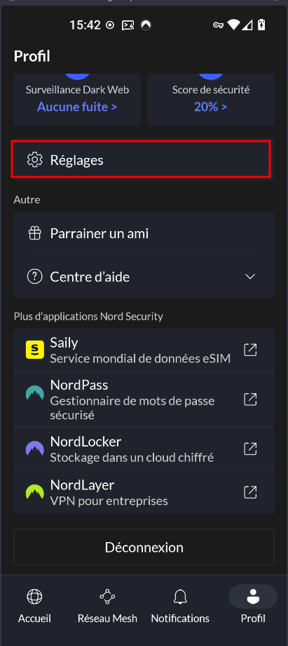{:width="200" .normal}  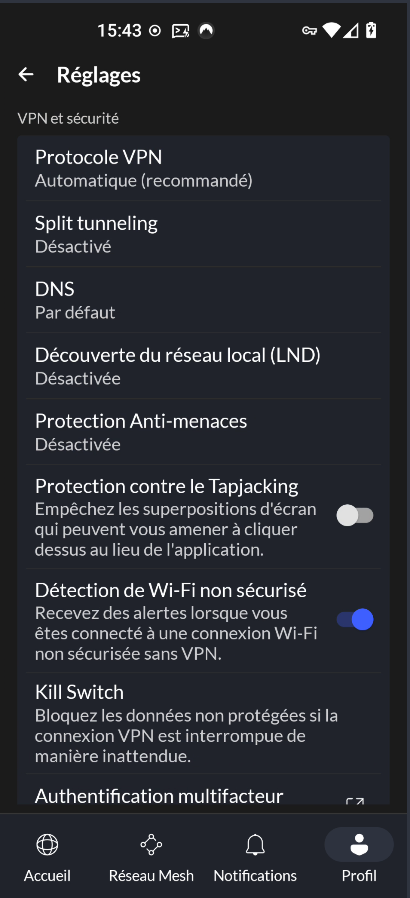{:width="200" .normal}

Désactiver  
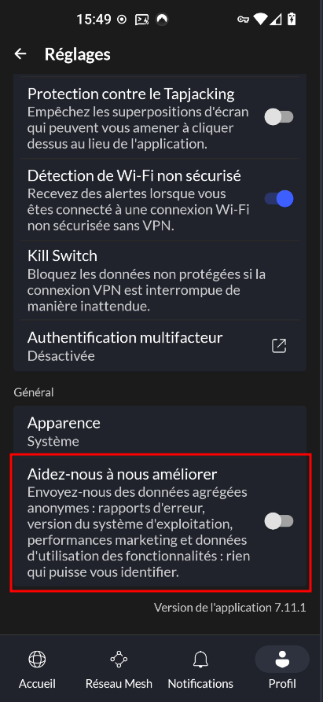{:width="200" .normal} 

## AndroidTV NordVPN

Application spécifique androidtv <https://nordvpn.com/fr/download/android-tv/>  
Après installation et connexion au compte  
On se connecte sur le VPN le plus rapide  
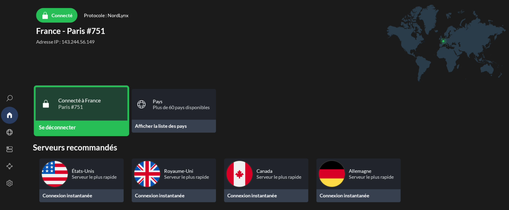{: .normal}

Paramétrage, activer la connexion automatique  
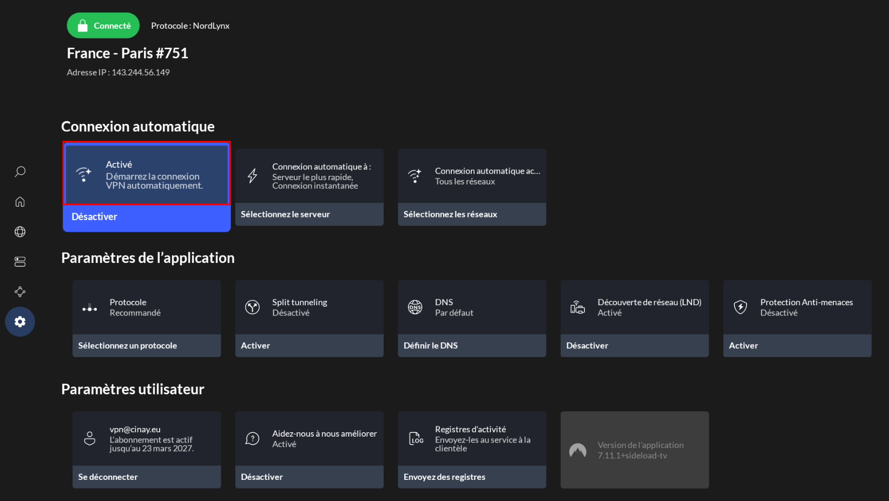{: .normal}

Désactiver le suivi  
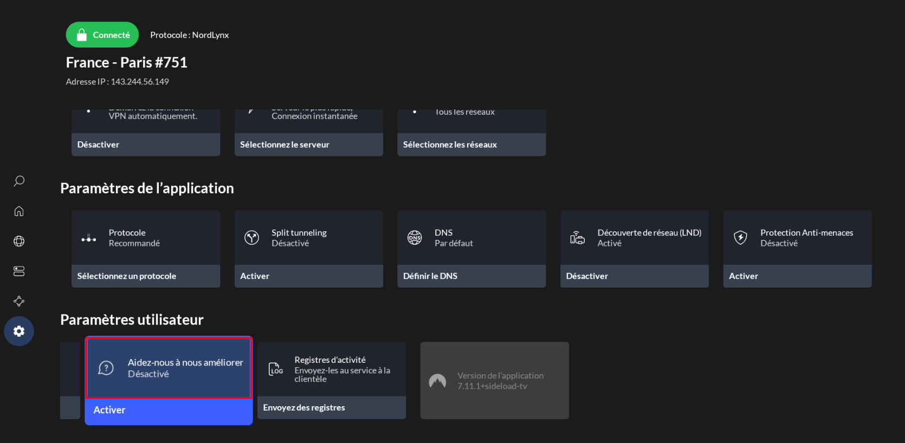{: .normal}


## NordVPN MeshNet

*Avec MeshNet, NordVPN permet à ses clients de mettre en place un réseau privé entre leurs appareils sans passer par les serveurs de la société. De quoi renforcer la confidentialité.*

<iframe width="640" height="480" src="https://www.youtube.com/embed/fsUF6TKdM68?rel=0&amp;showinfo=0" frameborder="0" scrolling="no" allowfullscreen=""></iframe>


## ERREURS

### libxml2.so.2

Mai 2025, erreur au lancement du service

```
mai 06 06:41:44 PC1 systemd[1]: Started NordVPN Daemon.
mai 06 06:41:44 PC1 nordvpnd[4822]: /usr/sbin/nordvpnd: error while loading shared libraries: libxml2.so.2: cannot open shared object file: No such file or directory
mai 06 06:41:44 PC1 systemd[1]: nordvpnd.service: Main process exited, code=exited, status=127/n/a
mai 06 06:41:44 PC1 systemd[1]: nordvpnd.service: Failed with result 'exit-code'.
mai 06 06:41:49 PC1 systemd[1]: nordvpnd.service: Scheduled restart job, restart counter is at 1.
mai 06 06:41:49 PC1 systemd[1]: Stopped NordVPN Daemon.
```

Librairie libxml2.so.2 introuvable , confirmé avec commande  `ldd /usr/bin/nordvpnd | grep xml2`

```
	libxml2.so.2 => not found
```

Attention pour les utilisateurs d'arch ou endeavour. Depuis la dernière mise à jour, libxml2 a été supprimé et libxml2.so.2 est manquant.

créer un nouveau dossier appelé  libxml2-compat

```shell
mkdir ~/libxml2-compat
```

Créer, dans le dossier libxml2-compat, le fichier PKGBUILD pour corriger le problème :

```
pkgname=libxml2-so.2-compat
pkgver=2.13.8
pkgrel=1
pkgdesc="Legacy libxml2.so.2.13.8 symlinked as libxml2.so.2 for Unity compatibility"
arch=('x86_64')
url=
license=('MIT')
provides=('libxml2.so.2')
conflicts=()
options=(!strip)
source=("https://archive.archlinux.org/packages/l/libxml2/libxml2-${pkgver}-1-x86_64.pkg.tar.zst")
noextract=("libxml2-${pkgver}-1-x86_64.pkg.tar.zst")
sha256sums=('SKIP')
 
package() {
  mkdir -p "$pkgdir/usr/lib"
  bsdtar -xf "${srcdir}/libxml2-${pkgver}-1-x86_64.pkg.tar.zst" -C "${srcdir}" $"usr/lib/libxml2.so.${pkgver}"
  install -m 755 "${srcdir}/usr/lib/libxml2.so.${pkgver}" "$pkgdir/usr/lib/libxml2.so.${pkgver}"
  ln -sf $"libxml2.so.${pkgver}" "$pkgdir/usr/lib/libxml2.so.2"
}
```


dans le dossier libxml2-compat, exécuter

```shell
makepkg -si
```

Procéder à l'installation et vérifier

```shell
ls -la /usr/lib | grep libxml2
```

2 nouveaux fichiers 

```
libxml2.so.2.13.8
libxml2.so.2 -> libxml2.so.2.13.8 (le lien symbolique)
```

## NordVPN - Configuration PC1 Archlinux/Endeavour

### En ligne de comande

Liste des commandes pour une utilisation sur Archlinux/Endeavour

```shell
# Accédez à des imprimantes, des téléviseurs et d'autres appareils 
# sur votre réseau local tout en étant connecté à un VPN.
nordvpn set lan-discovery enabled 
# ajouter une règle pour autoriser un sous-réseau spécifié.
# Il faut désactiver lan-discovery
nordvpn set lan-discovery disabled
# Dans les processus de sécurité, une whitelist 
# est une liste de personnes et d'appareils qui peuvent accéder au réseau.
# Si quelqu'un ne peut pas prouver qu'il est sur la liste, il ne peut pas entrer.
nordvpn whitelist add subnet 192.168.0.0/16
nordvpn whitelist add subnet 192.168.10.0/16
# Autoriser le DNS local
nordvpn whitelist add port 53
# Connexion au démarrage
nordvpn set autoconnect enabled
# Activation barre des tâches
nordvpn set tray enabled
# Pas de notification
nordvpn set notify disabled
# Activer IPV6
nordvpn set ipv6 enabled
# Connexion rapide
nordvpn c
# Déconnexion
nordvpn d
```

### Graphique

Installation

    yay -S nordvpn-gui

Paramétrage

{:width="500" .normal}  

{:width="500" .normal}  

**Settings - Security and privacy**  
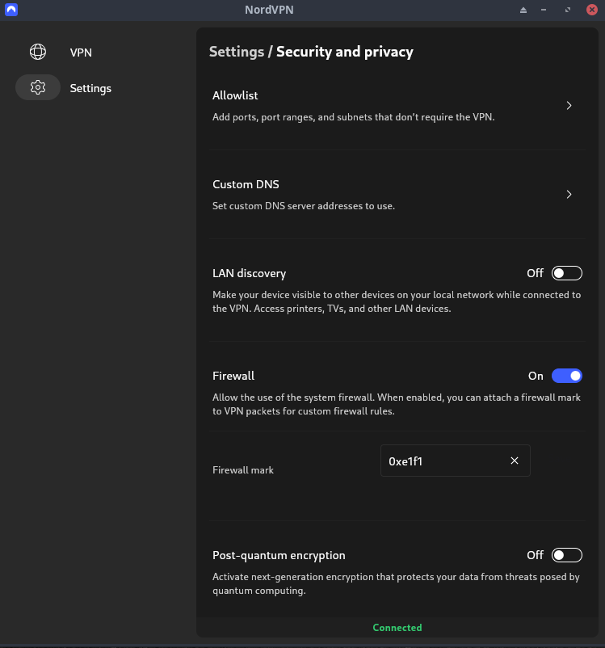{:width="500" .normal}  

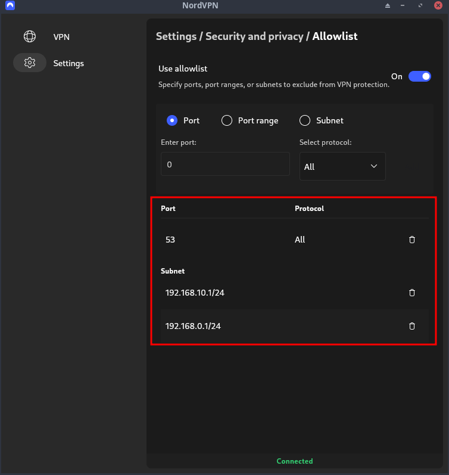{:width="500" .normal}  

**Settings - Threat Protection**  
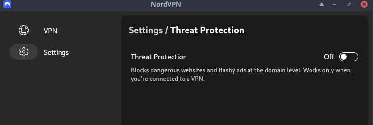{:width="500" .normal}  

**Settings - General**  
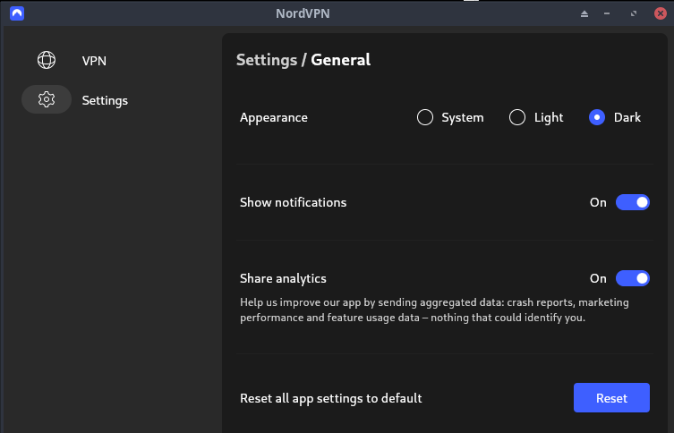{:width="500" .normal}  

Activer en ligne de commande , l'icône dans la barre des tâches

```shell
nordvpn set tray enable  # --> Tray set to 'enabled' successfully.
```

### Configuration 04/06/2025 

```
Technology: NORDLYNX
Firewall: enabled
Firewall Mark: 0xe1f1
Routing: enabled
Analytics: enabled
Kill Switch: disabled
Threat Protection Lite: disabled
Notify: enabled
Tray: enabled
Auto-connect: enabled
IPv6: enabled
Meshnet: disabled
DNS: 192.168.0.205
LAN Discovery: disabled
Virtual Location: enabled
Post-quantum VPN: disabled
Allowlisted ports:
       53 (UDP|TCP)
Allowlisted subnets:
	192.168.10.1/24
	192.168.0.1/24
```

### NetworkManager IPv6 avertissements 

* [Why does NetworkManager report IPv6 related warnings when IPv6 is disabled in the kernel?](https://access.redhat.com/solutions/6967304)
* [Disable IPv6 using Network Manager](https://linux.fernandocejas.com/docs/troubleshooting/disable-ipv6-using-network-manager)

Messages d'avertissement à répétition dans le journal

```
NetworkManager[1397]: <warn>  [1749015457.9533] platform-linux: do-add-ip6-address[2: 2a01:e0a:9c8:2080:6064:2cc9:83ac:273d]: failure 13 (Permission non accordée - ipv6: IPv6 is disabled on this device)
```

**Résolution**  
Désactiver IPv6 sur la connexion NetworkManager

En mode su

Liste des connexions: `nmcli connection show`

```
NAME                 UUID                                  TYPE       DEVICE   
bridge0              c7ad9048-b11d-49cb-b4a3-96231de7417c  bridge     bridge0  
Ethernet enp2s0      b7a50bde-890f-396a-97d3-9c98af7e29e0  ethernet   enp2s0   
bridge0-enp3s0f1     435b879b-0337-4402-bc8b-32322400345d  ethernet   enp3s0f1 
lo                   5f8efafe-208f-40ce-818f-e4724417333f  loopback   lo       
nordlynx             fa745d28-b269-48f5-b3e6-260e519b29f5  wireguard  nordlynx 
Connexion filaire 1  311401b7-a1c0-3515-ac22-5e7cf2927ef7  ethernet   --       
nordlynx             e68740a9-c2e7-4b20-b660-ced2b3dbb4dd  wireguard  --       
```

La connexion utilisée par NordVPN : "Ethernet enp2s0"

Définir le paramètre `ipv6.method` de la connexion à "disabled"

```shell
nmcli connection modify "Ethernet enp2s0" ipv6.method "disabled"
```

Redémarrer à la fois NetworkManager et la connexion elle-même:

```shell
systemctl restart NetworkManager
```
