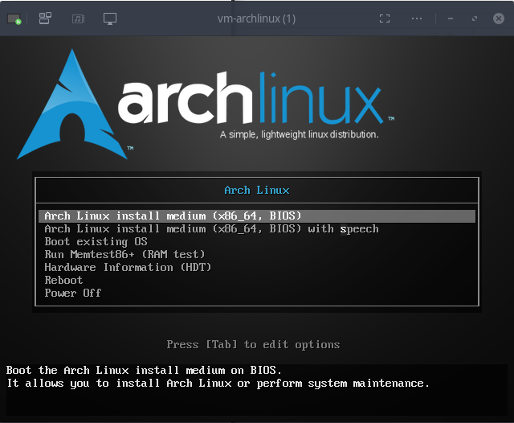
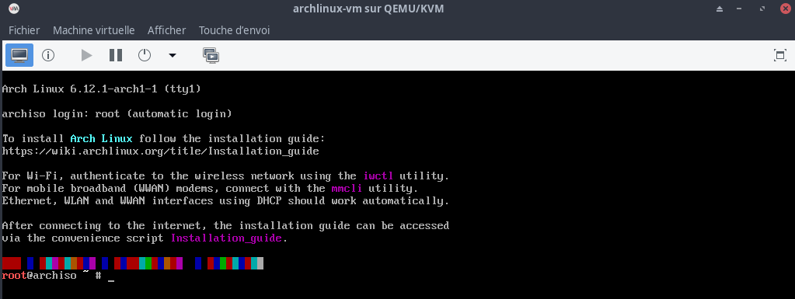
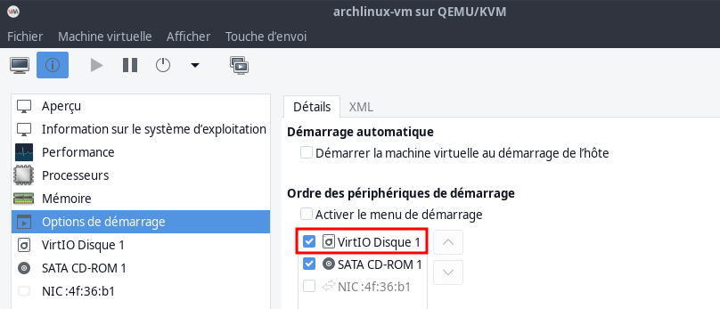
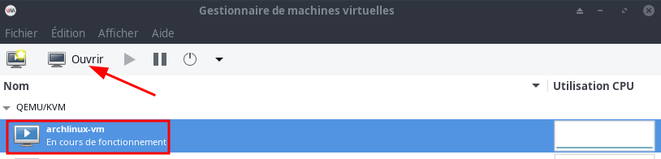
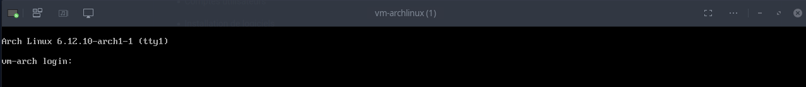

+++
title = 'PC1 KVM - Archlinux KDE'
date = 2025-02-02 00:00:00 +0100
categories = ['archlinux']
+++
## Machine virtuelle Archlinux

Installer virt-viewer

    yay -S virt-viewer

### ISO archlinux

*L'image peut être gravée sur un DVD, montée comme un fichier ISO, ou écrite directement sur une clé USB. Elle est destinée aux nouvelles installations uniquement ; un système Arch Linux existant peut toujours être mis à jour avec pacman -Syu*

Les images pour l'installation d'Arch peuvent être téléchargées via BitTorrent ou ici même dans votre navigateur depuis l'un des miroirs Arch HTTP(S) (<https://archlinux.org/download/>)

### Créer machine virtuelle avec image ISO

Vérifier si "archlinux" présent dans la liste  
`sudo virt-install --osinfo list |grep archlinux` --> archlinux

Installer en utilisant une image iso 

```bash
sudo virt-install \
--osinfo archlinux \
--name vm-archlinux \
--memory 4096 \
--vcpus 2 \
--cpu host \
--hvm \
--disk path=/virtuel/KVM/vm-archlinux.qcow2,format=qcow2,size=20 \
--cdrom /home/yann/FreeUSB2To/iso/archlinux-2024.12.01-x86_64.iso \
--network bridge=bridge0 \
--graphics vnc  
```

Après exécution dans un terminal de la commande ci dessus, on arrive sur l’écran suivant

{:width="350"}  

On arrive sur le terminal  
{:width="600"}  

Clavier en français

```bash
loadkeys fr # en est en qwerty , il faut saisir 'loqdkeys'
```

Valider SSH pour la suite de l’installation:

1. Modifier le mot de passe root : `passwd` --> rtyuiop
2. Relever l’adresse IP : `ip addr` --> 192.168.10.126
3. Lancer sshd : `systemctl start sshd`
4. Depuis un poste distant : `ssh root@adresseIP` --> `ssh root@192.168.10.126`

Vérifier version "archinstall" (version 3.x.x)

```bash
pacman -Syy
pacman -Sy archinstall archlinux-keyring python python-pyparted python-simple-term-menu python-annotated-types python-pydantic python-pydantic-core python-typing_extensions
```

Lancer installation avec outil "archinstall" qui permet de définir tous les paramètres de l'installation

    archinstall

A la fin de l'installation  


on éteint la machine virtuelle

    power off

On change la séquence de démarrage de la machine virtuelle  
{:width="550"}   
On ouvre la console graphique  
{:width="550"}  

{:width="550"} 
Se connecter utilisateur "yarch/yarch49600"  

### Openssh

Installation et lancement

    sudo pacman -S openssh 

Validation et lancement SSH

    sudo systemctl enable sshd --now

Relever adresse ip : 192.168.10.127

On peut se connecter en utilisateur d’un autre poste

    ssh yarch@192.168.10.127

### Utilisateur

Droits root

echo "yarch     ALL=(ALL) NOPASSWD: ALL" |sudo tee /etc/sudoers.d/10-yarch

### Installer yay

Prérequis

    sudo pacman -S --needed base-devel git

Avec l'option `--needed`, il ne réinstallera PAS les paquets déjà installés.  

Cloner le dépôt git de Yay et y basculer

*Utilisez la commande git pour « cloner » le dépôt de Yay. Vous pouvez le faire n'importe où dans le système, que ce soit dans votre répertoire personnel ou autre.*

    git clone https://aur.archlinux.org/yay.git

Installer yay

En fait, vous êtes en train de le construire. Vous verrez un fichier PKGBUILD ici. Utilisez la commande suivante pour construire le paquet à partir de ce fichier :

```bash
cd yay
makepkg -si
```

Une fois le processus terminé, vérifiez que yay a été installé avec succès en contrôlant sa version.

```bash
yay --version   # --> yay v12.4.2 - libalpm v15.0.0
```

### Paquets extra

Installer nano

    yay -S nano


### Historique de la ligne de commande

Ajoutez la recherche d’historique de la ligne de commande au terminal.
Tapez un début de commande précédent, puis utilisez shift + up (flèche haut) pour rechercher l’historique filtré avec le début de la commande.

```bash
# Global, tout utilisateur
echo '"\e[1;2A": history-search-backward' | sudo tee -a /etc/inputrc
echo '"\e[1;2B": history-search-forward' | sudo tee -a /etc/inputrc
```

## KDE

Installation de KDE Bureau plasma

Pour exécuter le bureau de KDE, vous avez besoin des paquets suivants :

* Groupe Xorg
* KDE Environnement de bureau plasma
* Session Wayland pour KDE Plasma
* Groupe d'applications KDE (composé d'applications spécifiques KDE incluant le gestionnaire Dolphin et d'autres applications utiles)

Vous pouvez installer ce qui précède en utilisant la commande suivante

    sudo pacman -S xorg plasma kwayland plasma-wayland-protocols kde-applications

Une fois installé, activez les services Display Manager et Network Manager

    sudo systemctl enable sddm.service
    sudo systemctl enable NetworkManager.service