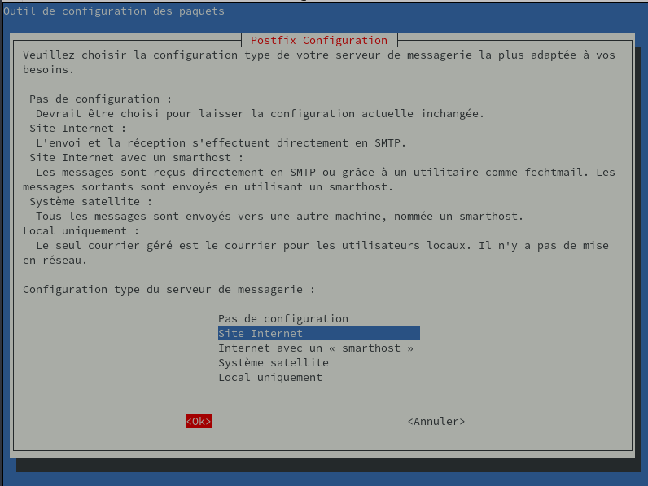
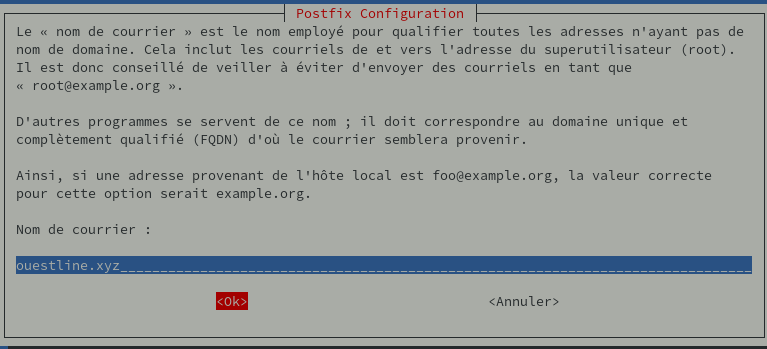

+++
title = 'Envoi de message - Installer et configurer Postfix comme serveur SMTP d'envoi uniquement'
date = 2025-02-07 00:00:00 +0100
categories = ['messagerie']
+++
*Postfix est un agent de transfert de courrier (MTA), une application utilisée pour envoyer et recevoir des e-mails. On va configurer Postfix afin qu'il puisse être utilisé pour envoyer des notifications par e-mail uniquement par les applications locales installées sur le même serveur que Postfix.*  

Articles de référence :  

- [How To Install and Configure Postfix as a Send-Only SMTP Server on Debian 10](https://www.digitalocean.com/community/tutorials/how-to-install-and-configure-postfix-as-a-send-only-smtp-server-on-debian-10)  
- [Comment installer et configurer Postfix en tant que serveur SMTP à émission seule sur Ubuntu 18.04](https://www.digitalocean.com/community/tutorials/how-to-install-and-configure-postfix-as-a-send-only-smtp-server-on-ubuntu-18-04-fr)   
- [Enable TLS for Postfix on Ubuntu](https://blog.matrixpost.net/enable-tls-for-postfix-on-ubuntu/) 

## Postfix SMTP 

Conditions préalables

*    Un serveur Debian fonctionnel avec un utilisateur non root avec les privilèges sudo.
*    Un nom de domaine valide qui pointe vers le serveur.

Le nom d'hôte de votre serveur doit correspondre à votre domaine ou sous-domaine. Vous pouvez vérifier le nom d'hôte du serveur en tapant `hostname` à l'invite de commande. La sortie doit correspondre au nom que vous avez donné au serveur lors de sa création.
{: .prompt-info }

### Installation de Postfix

Deux packages : mailutils, qui inclut les programmes nécessaires au fonctionnement de Postfix, et postfix lui-même.

Mise à jour la base de données des packages

    sudo apt update 

Ensuite, installer mailtuils 

    sudo apt install mailutils 

Enfin, installer postfix 

    sudo apt install postfix 

Suivre la procédure  
{:width="600"}  

fenêtre pour définir le nom de messagerie système  
{:width="600"}  
Le nom de messagerie système doit être le même que le nom que vous avez attribué au serveur lors de sa création.

### Configuration de Postfix

Dans cette étape, vous allez configurer Postfix pour qu'il traite les demandes d'envoi d'e-mails uniquement à partir du serveur sur lequel il s'exécute, c'est-à-dire à partir de localhost.

Pour cela, Postfix doit être configuré pour n'écouter que sur l' interface loopback , l'interface réseau virtuelle que le serveur utilise pour communiquer en interne. Pour effectuer le changement, ouvrez le fichier de configuration principal de Postfix à l'aide de nano 

    sudo nano /etc/postfix/main.cf 

Avec le fichier ouvert, faites défiler jusqu'à ce que vous voyiez la section suivante :

```
. . .
mailbox_size_limit = 0
recipient_delimiter = +
inet_interfaces = all
. . .
```

Changez la ligne qui se lit `inet_interfaces = all` avec `inet_interfaces = loopback-only` 

```
. . .
mailbox_size_limit = 0
recipient_delimiter = +
inet_interfaces = loopback-only
. . .
```

Une autre directive que vous devrez modifier est `mydestination`, qui est utilisée pour spécifier la liste des domaines qui sont livrés via le local_transporttransport de distribution de courrier. Par défaut, les valeurs ressemblent à celles-ci :

```
. . .
mydestination = $myhostname, ouestline.xyz, xyz.xyz, localhost.xyz, localhost
. . .
```

Les valeurs par défaut recommandées pour cette directive sont données dans le bloc de code ci-dessous, alors modifiez les vôtres pour qu'elles correspondent :

```
. . .
mydestination = $myhostname, localhost.$mydomain, $mydomain
. . .
```

Si votre domaine est en fait un sous-domaine, et que vous souhaitez que les messages électroniques aient l’air d’avoir été envoyés depuis le domaine principal, vous pouvez ajouter la ligne suivante à la fin de main.cf:

```
...
masquerade_domains = your_main_domain
```

Le paramètre facultatif `masquerade_domains` spécifie pour quels domaines la partie de sous-domaine sera supprimée dans l’adresse e-mail.

Lorsque vous avez terminé, enregistrez et fermez le fichier.

Note : Si vous hébergez plusieurs domaines sur un seul serveur, les autres domaines peuvent également être transmis à Postfix en utilisant la directive `mydestination`.
{: .prompt-info }

redémarrez Postfix.

    sudo systemctl restart postfix 

### Test du serveur SMTP

Tester si Postfix peut envoyer des e-mails à un compte de messagerie externe à l'aide de la commande `mail`, qui fait partie du package **mailutils** 

Pour envoyer un e-mail de test, saisissez :

    echo "Test envoi via postfix smtp" | mail -s "serveur debian" votre_adresse_mail 

Lorsque vous effectuez vos propres tests, vous pouvez utiliser le corps et le texte de la ligne d'objet tels quels ou les modifier à votre guise. Cependant, à la place de **votre_adresse_mail**, utilisez une <u>adresse e-mail valide</u>. Le domaine peut être gmail.com, fastmail.com, yahoo.comou tout autre fournisseur de services de messagerie que vous utilisez.

Maintenant, vérifiez l’adresse électronique à laquelle vous avez envoyé ce message. Vous devriez voir le message dans votre boîte de réception. S’il n’y est pas, vérifiez votre dossier de courrier indésirable. À ce stade, tous les courriers électroniques que vous envoyez ne sont pas cryptés, ce qui fait penser aux fournisseurs de services qu’il s’agit probablement de spam. Vous mettrez en place le cryptage plus tard, à l’étape 5.

Notez qu'avec cette configuration, l'adresse dans le champ **De** pour les e-mails de test que vous envoyez sera , où sammy est votre nom d'utilisateur Linux non root et le domaine est le nom d'hôte du serveur. Si vous modifiez votre nom d'utilisateur, l' adresse De changera également.

### Transfert du courrier système

La dernière chose que nous voulons configurer est le transfert, vous recevrez donc des e-mails envoyés à root sur le système à votre adresse e-mail externe personnelle.

Pour configurer Postfix afin que les e-mails générés par le système soient envoyés à votre adresse e-mail, vous devez modifier le /etc/aliasesfichier. Ouvrez ce fichier maintenant :

    sudo nano /etc/aliases 

Le contenu complet du fichier sur une installation par défaut de Debian 11 est le suivant :

```
# See man 5 aliases for format
postmaster:    root
```

Le paramètre `postmaster: root` garantit que les e-mails générés par le système sont envoyés à l' utilisateur racine . Vous souhaitez modifier ces paramètres afin que ces e-mails soient redirigés vers votre adresse e-mail. Pour ce faire, ajoutez la ligne suivante sous le paramètre `postmaster: root` 

```
mailer-daemon: postmaster
postmaster:    root
root: votre_adresse_mail
. . .
```

Remplacez **votre_adresse_mail** par l'adresse e-mail souhaitée . Lorsque vous avez terminé, enregistrez et fermez le fichier.  
Pour que la modification prenne effet, exécutez la commande suivante 

    sudo newaliases 

Vous pouvez tester que cela fonctionne en envoyant un e-mail au compte root en utilisant :

    echo "Voici le corps de l'email" | mail -s "Voici l'objet du message" root 

Vous devriez recevoir l'e-mail sur votre adresse e-mail. Si ce n'est pas le cas, vérifiez votre dossier courrier indésirable.

### Activation chiffrement SMTP

En utilisant un certificat Lets'encrypt pour le domaine concerné , par exemple rnmkcy.eu  
Les certicicats sont générés par acme voir le tuto [Serveur , installer et renouveler les certificats SSL Let's encrypt via Acme](/posts/Acme-Certficats-Serveurs/)  

Les certificats sont disponibles dans le dossier `/etc/ssl/private`:  
rnmkcy.eu-fullchain.pem  rnmkcy.eu-key.pem

Modifier le fichier `/etc/postfix/main.cf`  
Chercher la section suivante :

```
# TLS parameters
smtpd_tls_cert_file=/etc/ssl/certs/ssl-cert-snakeoil.pem
smtpd_tls_key_file=/etc/ssl/private/ssl-cert-snakeoil.key
smtpd_tls_security_level=may

smtp_tls_CApath=/etc/ssl/certs
smtp_tls_security_level=may
smtp_tls_session_cache_database = btree:${data_directory}/smtp_scache
```

Après modification

```
# TLS parameters
smtpd_tls_cert_file=/etc/ssl/private/rnmkcy.eu-fullchain.pem
smtpd_tls_key_file=/etc/ssl/private/rnmkcy.eu-key.pem
smtp_use_tls=yes
#smtpd_tls_security_level=may
```

Pour appliquer les changements, redémarrer Postfix

    sudo systemctl restart postfix

envoyer à nouveau un courriel

        echo "This is the body of an encrypted email" | mail -s "This is the subject line" your_email_address

Ensuite, vérifiez l’adresse électronique que vous avez fournie. Il est possible que vous voyiez le message dans votre boîte de réception immédiatement car les fournisseurs de messagerie électronique sont beaucoup plus susceptibles de marquer les messages non chiffrés comme étant du spam.

## Postfix en tant que relay

* [Postfix en tant que relay](http://wiki.csnu.org/index.php/Postfix_en_tant_que_relay)

### Prérequis

Installer les paquets

```bash
sudo apt install postfix libsasl2-modules 
```

Configuez le en tant que "internet with smarthost". Dans SMTP Relay Host, entrez l'hostname:port que vous souhaitez utiliser comme smtp sortant.

Nous allons utiliser les informations suivantes :

*    serveur de relais mail : relay.domain.tld sur le port 587 (submission)
*    utilisateur permettant d'envoyer le mail via le serveur relay.domain.tld : test@otherdomain.tld
*    mot de passe de l'utilisateur sur le serveur relay.domain.tld : password
*    en forçant le chiffrement TLS sans vérifier la chaîne de certification

### Configuration simple 

relayer tous les mails via un seul relay et un seul compte

Dans /etc/postfix/main.cf :

```
relayhost = [relay.domain.tld]:587
smtp_use_tls=yes
smtp_tls_security_level = encrypt
smtp_sasl_auth_enable = yes
smtp_sasl_password_maps = hash:/etc/postfix/smarthost_passwd
smtp_sasl_security_options = noanonymous
```

Dans /etc/postfix/smarthost_passwd :

```
# Destination           credentials
[relay.domain.tld]:587     test@otherdomain.tld:password 
```

Appliquez la configuration :

```bash
chown root:root /etc/postfix/smarthost_passwd
postmap /etc/postfix/smarthost_passwd
chmod 600 /etc/postfix/smarthost_passwd*
```

Redémarrez postfix pour appliquer les modifications

```bash
sudo systemctl restart postfix
```
