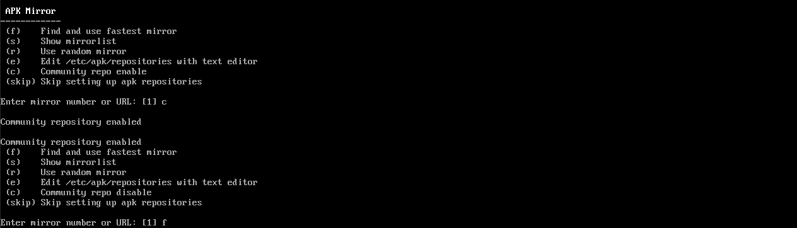
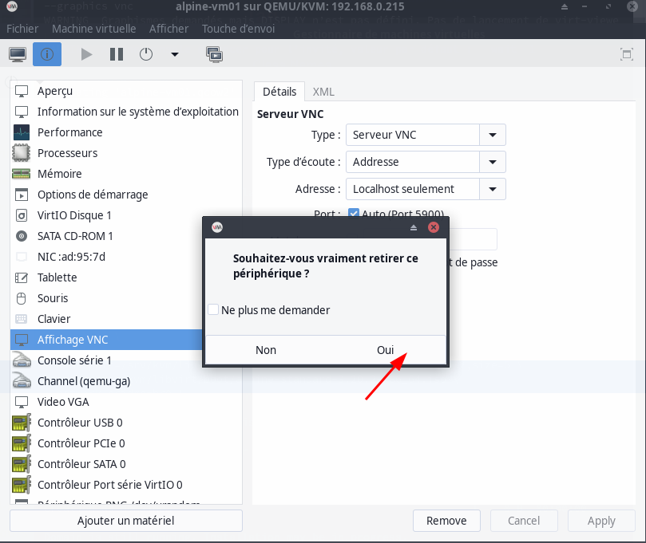

+++
title = 'Machine virtuelle Alpine Linux (vm-alpine02)'
date = 2025-02-18 00:00:00 +0100
categories = ['virtuel']
+++
*Alpine Linux est une distribution Linux ultra-légère*

{:width="300"}  

## Alpine Linux

*Création machine virtuelle Alpine  de type KVM avec 2 Go de RAM, 1 cœur de processeur et 5 Go de disque dur.*

### Créer vm-alpine sur un serveur

[Les dernières images Alpine Linux](https://alpinelinux.org/downloads/)  

Création d'une image virtuelle **vm-alpine02** sous le serveur Lenovo rnmkcy.eu  
On se connecte sur le serveur Lenovo en SSH, puis on exécute la commande suivante pour créer  une machine virtuelle Alpine avec 2 Go de RAM, 1 cœur de processeur et 5 Go de disque dur

```shell
sudo virt-install \sudo virt-install \
--osinfo alpinelinux3.17 \
--name vm-alpine02 \
--memory 2048 \
--vcpus 1 \
--cpu host \
--hvm \
--disk path=/srv/kvm/libvirt/images/vm-alpine02.qcow2,format=qcow2,size=5 \
--cdrom /home/yick/FreeUSB2To/iso/alpine-standard-3.21.0-x86_64.iso \
--network bridge=nat \
--graphics vnc  
```

Note: La dernière version Alpine Linux est alpinelinux3.20  au 10/07/2024 mais KVM ne connait que alpinelinux3.17 (`sudo virt-install --osinfo list |grep alpine`)

Après exécution dans un terminal de la commande ci dessus, on arrive sur *En attente de fin d'installation*

### Configurer vm-alpine

`ATTENTION: Désactiver "Affichage VNC" des autres machines`{: .prompt-warning }

Le serveur Lenovo n'a pas d'affichage, il faut créer un tunnel ssh depuis un terminal d'un poste client

    ssh -L 5900:127.0.0.1:5900 yick@192.168.0.205 -p 55205 -i /home/yann/.ssh/yick-ed25519

Puis lancer de ce même poste un client VNC  
{:width="300"}  
la console s'affiche   
  

Une fois l'image ISO lancée, on arrive à un invite de connexion.   
Indiquez `root` comme nom d'utilisateur, aucun mot de passe ne vous sera demandé à cette étape.   

Le système est utilisable, mais on veut l'installer, ce qui passe par la commande suivante (clavier qwerty)

```
setup-alpine # saisir setup)qlpine
```

Une suite de questions :  
  
mot de passe root (rtyuiop)  
  
APK mirror...  
  

Utilisateur alpi/alpi49 et suite...   
  

Relever l'adresse ip allouée : `ip a` --> 192.168.100.12  
Puis redémarrer : `reboot`  
La fenêtre vnc se ferme  

On n'a plus besoin de VNC, en mode graphique   
{:width="400"}  
{:width="400"}  
{:width="400"}  
Eteindre puis redémarrer la machine virtuelle 

### Explications sur la procédure

*Normalement, vous n'avez rien à faire, les paramètres par défaut doivent convenir. Mais si vous le désirez, vous pouvez les modifier pour utiliser une interface particulière, une IP fixe, un serveur proxy, etc.  
Une soixantaine de serveurs mirroir vous seront proposés pour télécharger les paquets. Choisissez un numéro dans la liste ou demandez au système de les tester et de sélectionner le plus rapide. Vous pouvez aussi modifier le fichier des sources. Il vous faudra ensuite choisir votre serveur SSH : OpenSSH, Dropbear ou aucun.* 

On termine par la méthode d'installation. Il en existe quatre : 

*    none : le système et ses données sont placés en RAM et seront perdus après le redémarrage
*    sys : le système et ses données sont placés sur un HDD/SSD
*    data : le système est placé en RAM, les données sur un HDD/SSD
*    lvm : utilisation de Logical Volume Manager, les deux choix précédents seront proposés (lvmsys, lvmdata)

Si vous stockez le système en mémoire, il faudra trouver un moyen de sauvegarder la configuration. Vous pourrez le faire uniquement depuis un lecteur de disquettes (!) ou une clé USB. Une fois le système installé, vous pourrez l'utiliser directement s'il est placé en mémoire ou redémarrer si vous avez opté pour un stockage classique.

Il n'est pas conseillé d'utiliser directement le compte root pour les actions du quotidien.  
Si utilisateur non créé dans la procédure d'installation, le créer avec son propre espace dans /home/ 

    adduser alpi

Vous pouvez utiliser l'utilisateur pour vous connecter via SSH (impossible avec le compte root)  

### Connexion vm-alpine via SSH

Sur un poste linux du réseau

    ssh alpi@192.168.100.12

Une fois connecté ,vous pouvez accéder au "root" de manière classique avec la commande :

    su -

Mise à jour

```shell
apk update
apk upgrade 
# Vous pouvez fusionner les deux lignes avec 
apk -U upgrade
```

Editeur nano (Vous pouvez aussi opter pour vi qui est nativement présent sur le système)

    apk add nano

### Réseau IPV4 statique

[How to configure static IP address on Alpine Linux](https://www.cyberciti.biz/faq/how-to-configure-static-ip-address-on-alpine-linux/)

Le fichier de configuration `/etc/network/interfaces`

    /etc/network/interfaces

```shell
auto lo
iface lo inet loopback

auto eth0
iface eth0 inet static
  address 192.168.70.115/24
  gateway 192.168.100.1
```

Fichier de résolution dns

    /etc/resolv.conf

```
nameserver 1.1.1.1
nameserver 9.9.9.9
```

Les modifications apportées à /etc/network/interfaces peuvent être activées en exécutant

```shell
service networking restart 
```

`ATTENTION: Déconnexion SSH car changement adresse IP`{: .prompt-warning }

Connexion SSH avec IP 192.168.70.115

    ssh alpi@192.168.70.115

Message à la connexion SSH, `/etc/motd`

```
    _    _        _              _     _                 
   /_\  | | _ __ (_) _ _   ___  | |   (_) _ _  _  _ __ __
  / _ \ | || '_ \| || ' \ / -_) | |__ | || ' \| || |\ \ /
 /_/ \_\|_|| .__/|_||_||_|\___| |____||_||_||_|\_,_|/_\_\
           |_|          _        _              __  ___  
 __ __ _ __  ___  __ _ | | _ __ (_) _ _   ___  /  \|_  ) 
 \ V /| '  \|___|/ _` || || '_ \| || ' \ / -_)| () |/ /  
  \_/ |_|_|_|    \__,_||_|| .__/|_||_||_|\___| \__//___| 
                          |_|                            
  _  ___  ___     _   __  ___    ____  __     _  _  ___  
 / |/ _ \|_  )   / | / / ( _ )  |__  |/  \   / |/ || __| 
 | |\_, / / /  _ | |/ _ \/ _ \ _  / /| () |_ | || ||__ \ 
 |_| /_/ /___|(_)|_|\___/\___/(_)/_/  \__/(_)|_||_||___/ 
```

### OpenSSH avec clés

*Connexion ssh sur un autre port avec un jeu de clés*

Générer une paire de clé sur l'ordinateur de bureau PC1  
Générer une paire de clé curve25519-sha256 (ECDH avec Curve25519 et SHA2) pour une liaison SSH avec la machine virtuelle vm-alpine02

    ssh-keygen -t ed25519 -o -a 100 -f ~/.ssh/vm-alpine02
    chmod 600 ~/.ssh/vm-alpine02

Copier la clé publique `cat ~/.ssh/vm-alpine02.pub` dans le presse-papier

	ssh-ed25519 AAAAC3NzaC1lZDI1NTE5AAAAIHJXXXPhNI7WD1q9AJ70fnoI2OyNjReheLKR/hFhWaiz yann@PC1

On se connecte sur la machine virtuelle alpine linux "vm-alpine02" en proxy avec le serveur cwwk (192.168.0.205)

```bash
ssh -o ProxyCommand="ssh -W %h:%p -p 55205 -i /home/yann/.ssh/yick-ed25519 yick@192.168.0.205" alpi@192.168.70.115 -p 55110 -i /home/yann/.ssh/vm-alpine02
```

Créer le répertoire et ouvrir nouveau fichier

    mkdir -p $HOME/.ssh/
    nano $HOME/.ssh/authorized_keys

Coller le contenu du presse-papier , sauver le fichier et sortir

Modifier les droits

    chmod 600 $HOME/.ssh/authorized_keys

Passer en mode su

    su -

Modifier la configuration serveur SSH

    nano /etc/ssh/sshd_config

Modifier

```
Port = 55110
PasswordAuthentication no
```

Relancer le serveur

    service sshd restart

Test connexion

```bash
ssh -o ProxyCommand="ssh -W %h:%p -p 55205 -i /home/yann/.ssh/yick-ed25519 yick@192.168.0.205" alpi@192.168.70.115 -p 55110 -i /home/yann/.ssh/vm-alpine02
```

### sudo

Passer en root

    su -

**Ajout dépôt communauté**  
Editer la configuration des dépôts

    nano /etc/apk/repositories

Trouvez maintenant la ligne qui se termine dans **/community**  
Ensuite, retirez le `#` au début de la ligne.  
Le fichier résultant devrait ressembler à ceci

```
#/media/cdrom/apks
http://mirrors.ircam.fr/pub/alpine/v3.20/main
http://mirrors.ircam.fr/pub/alpine/v3.20/community
```

Installer sudo 

```bash
apk update
apk add sudo
```

Ajouter un utilisateur avec les privlèges root

```bash
echo "alpi     ALL=(ALL) NOPASSWD: ALL" >> /etc/sudoers.d/20-alpi
```

### Activer réseau IPV6 (INACTIF)

Pour le nexthop IPV6 FreeBox

    **Activer IPV6**

Pour le nexthop IPV6 FreeBox

    ip a |grep "inet6 fe80"

*inet6 fe80::5054:ff:fe84:294a/64 scope link*

Paramètres de la Freebox, Configuration IPV6 &rarr; Délégation de préfixe  
Préfixe : 2a01:e0a:9c8:2083::/64  
Next Hop : fe80::5054:ff:fe84:294a  
Adresse IPv- lien local : fe80::8e97:eaff:fe39:66d6

[Alpine Linux, ajout IPV6](https://wiki.alpinelinux.org/wiki/Configure_Networking#IPv6_Static_Address_Configuration) 

    /etc/network/interfaces 

```
iface eth0 inet6 static
        address 2a01:e0a:9c8:2083::1
        netmask 64
        post-up ip -6 route add default via fe80::8e97:eaff:fe39:66d6 eth0
        pre-up echo 0 > /proc/sys/net/ipv6/conf/eth0/accept_ra
```

Relancer le service réseau

    rc-service networking restart
