+++
title = 'RustDesk'
date = 2025-03-06 00:00:00 +0100
categories = ['application']
+++
*RustDesk propose une solution de bureau à distance open source avec des options de serveur auto-hébergé. Alternative parfaite à TeamViewer pour un accès à distance sécurisé, privé et personnalisable.*

{: .normal}

**Comment fonctionnent les clients Rustdesk et Teamviewer ?**  
*Les clients Rustdesk et Teamviewer fonctionnent de la même manière.* 

Admettons que vous êtes sur un ordinateur "A" et que vous voulez afficher le bureau distant de l'ordinateur "B" : 

* On met le client Teamviewer ou le client Rustdesk sur l'ordinateur "A"
* On met le client Teamviewer ou le client Rustdesk sur l'ordinateur "B" 
* On met les informations de connexion de "B" dans le client de "A" et on se connecte. L'application demande le mot de passe et hop, on est connecté à "B". 

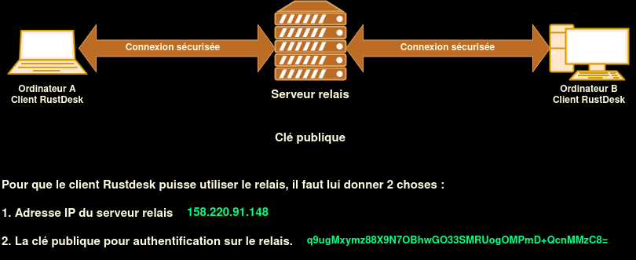{: .normal}

D'un point de vue réseau, la connexion n'est pas directe de "A" vers "B". Elle passe par un ordinateur tiers qui héberge Rustdesk. On appelle cet ordinateur intermédiaire : un **relais**.
{: .prompt-info }


## Serveur relais Rustdesk auto hébergé

*Il est conseillé de mettre le relais Rustdesk sur un serveur VPS. Officiellement, les prérequis sont tellement faibles pour le serveur que n'importe quel VPS bon marché fera l'affaire. Même un Raspberry Pi serait assez puissant pour faire tourner le relais.*

### Avantages serveur relais Rustdesk

* **Connexion privée** : Si tous les ordinateurs passent par un relais privé, alors l'identifiant (ID) de chaque ordinateur n'est pas rendu public ! L'ID est connu du serveur relais. Quelqu'un d'extérieur ne peut pas se connecter à un de vos ordinateurs, même s'il possède son ID et son mot de passe puisqu'il doit se connecter au relais pour que ça fonctionne. <u>Les connections qui passent par le relais sont donc privées</u>. 
* **Maîtrise de votre périmètre** : Le serveur relais fait partie de votre périmètre, de votre architecture. Vous avez la main sur sa maintenance, sa mise à jour, sa sécurité. 
* **Indépendance** : vous ne dépendez de personne.
* Rustdesk est open source donc vous pouvez contrôler à tout moment la sécurité du logiciel. Ceci est impossible avec Teamviewer. 
* C'est gratuit. Alors que Rustdesk pro et Teamviewer ont des offres payantes pour ce type de service. 

Pour que la connexion soit établie, il faut une machine qui héberge les fonctionnalités suivantes :

*    hbbs (signaling server)
*    hbbr (relay server)

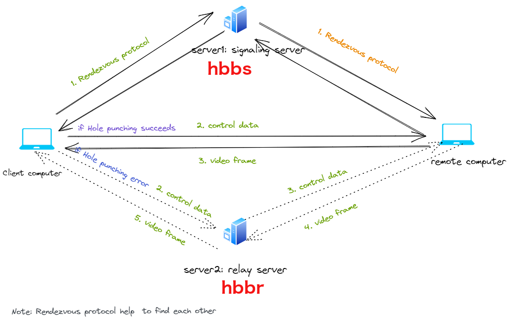{: .normal}

### Installation serveur relais Rustdesk

Il y a 2 packages à installer. Les 2 sont disponibles sur le github officiel. Il s'agit de :

1. hbbr (RustDesk ID/Rendezvous server) : rustdesk-server-hbbr_amd64.deb  
* hbbs (RustDesk Relay server) : rustdesk-server-hbbs_amd64.deb  

Donc avec la version 1.1.12, cela donne :

```shell
wget "https://github.com/rustdesk/rustdesk-server/releases/download/1.1.12/rustdesk-server-hbbr_1.1.12_amd64.deb"
wget "https://github.com/rustdesk/rustdesk-server/releases/download/1.1.12/rustdesk-server-hbbs_1.1.12_amd64.deb"
sudo dpkg -i rustdesk-server-hbbr_1.1.12_amd64.deb
sudo dpkg -i rustdesk-server-hbbs_1.1.12_amd64.deb
```

Les deux services sont activés lors de l'installation

```shell
systemctl status rustdesk-hbbs && systemctl status rustdesk-hbbr
```

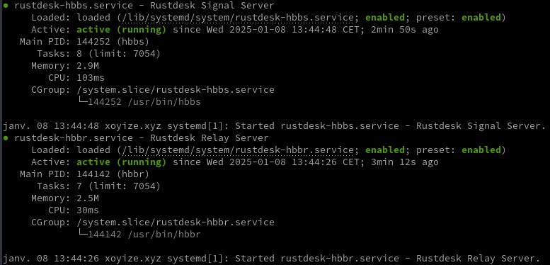

Les logs sont situés dans `/var/log/rustdesk-server/` 

### Ouvrir les ports sur le parefeu

Par défaut, hbbs écoute sur 21115(tcp) et 21116(tcp/udp), 21118(tcp),et hbbr écoute sur 21117(tcp), 21119(tcp). Assurez-vous d’ouvrir ces ports dans le pare-feu. Veuillez noter que 21116 doit être activé à la fois pour TCP et UDP.
Le port 21115 est utilisé pour le test de type NAT, le port 21116/UDP est utilisé pour l’enregistrement de l’ID et le service Heartbeat, le port 21116/TCP est utilisé pour le service de perforation et de connexion TCP, le port 21117 est utilisé pour les services de relais, et les ports 21118 et 21119 sont utilisés pour supporter les clients Web.
Si vous n’avez pas besoin du support des clients web (21118, 21119), les ports correspondants peuvent être désactivés.

Résumé ouverture des ports du parefeu:

* TCP : de 21115 à 21119
* UDP : 21116


Pour autoriser le serveur RustDesk sur ufw :

```shell
sudo ufw allow 21115:21119/tcp
sudo ufw allow 8000/tcp
sudo ufw allow 21116/udp
```

### Désinstallation serveur relais

Il faut supprimer les paquets et services  installés 

```bash
sudo dpkg -r rustdesk-server-hbbr
sudo dpkg -r rustdesk-server-hbbs
```

Supprimer les règlesdu parefeu ufw

```bash
# 1 - Lister les règles avec un numéro
sudo ufw status numbered
# 2 - Effacer une règle par son numéro
# Exemple règle N° 5
sudo ufw delete 5
# Reprendre en 1 pour effacer d'autres règles
```

### Serveur Relais RustDesk sur VPS webdock 

*Relais Rustdesk sur VPS websock Danemark*

[VPS webdock (Relais RustDesk)](URL)

* Adresse IP relais Rustdesk : <mark>92.113.144.37</mark>
* Clé publique : <mark>hYy75QpoJ1oBYAxwyZB14mA4axNUwuvIfF7kVyUMr5I=</mark>

## Client Rustdesk Linux  

Page de téléchargement application Rustdesk <https://github.com/rustdesk/rustdesk/releases/> 

### Installation client RustDesk Archlinux

**Paquet archlinux .zst**  
Télécharger le fichier

    wget https://github.com/rustdesk/rustdesk/releases/download/1.3.8/rustdesk-1.3.8-0-x86_64.pkg.tar.zst 

Installer le paquet

    yay -U rustdesk-1.3.8-0-x86_64.pkg.tar.zst

Ignorer les mises à jour rustdesk, edition `/etc/pacman.conf`

    IgnorePkg   = rustdesk

Effacer le zst

    rm rustdesk-1.3.7-0-x86_64.pkg.tar.zst

### Installation client RustDesk Linux AppImage

Sur des systèmes linux, télécharger le fichier AppImage

    wget https://github.com/rustdesk/rustdesk/releases/download/1.3.8/rustdesk-1.3.8-x86_64.AppImage

Déplacement et droit en exécution

```bash
sudo mv rustdesk-1.3.8-x86_64.AppImage /usr/local/bin/rustdesk
sudo chmod +x /usr/local/bin/rustdesk
```

Le fichier desktop `/usr/share/applications/rustdesk.desktop`

```
[Desktop Entry]
Name=RustDesk
GenericName=Remote Desktop
Comment=Remote Desktop
Exec=rustdesk %u
Icon=rustdesk
Terminal=false
Type=Application
StartupNotify=true
Categories=Network;RemoteAccess;GTK;
Keywords=internet;
Actions=new-window;

X-Desktop-File-Install-Version=0.23

[Desktop Action new-window]
Name=Open a New Window
Exec=rustdesk %u
```

### Client Linux pour utiliser serveur relais

Une fois que les deux postes ont installé RustDesk (télécharger ici : <https://github.com/rustdesk/rustdesk/releases>), il faut le configurer pour rediriger le trafic vers une instance autohébergée

>Configuration à faire sur les deux postes
{: .prompt-warning }

Pour que le client Rustdesk puisse utiliser le relais, il faut lui donner 2 choses :

1. Adresse IP du serveur relais: <mark>92.113.144.37</mark>   
2. La clé publique qui permet l'authentification sur le relais. Cette clé est enregistrée dans le fichier **id_ed25519.pub** qui est, sous Debian, dans le répertoire `/var/lib/rustdesk-server/`  
Un simple **cat** permet de récupérer la clé publique  
La clé publique : <mark>hYy75QpoJ1oBYAxwyZB14mA4axNUwuvIfF7kVyUMr5I=</mark>

Attention : Cette clé publique ne sert que pour la connexion **client -> relais**.  
Ce n'est pas pour s'authentifier sur un ordinateur à distance, c'est le rôle du mot de passe que vous avez paramétré dans la configuration du client
{: .prompt-warning }

Une fois que vous avez la clé publique, il faut paramétrer le client.  
Ouvrir l'application 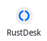  
ATTENTION: Lancer le service si demandé  
Les paramètres du clients : Cliquez sur les trois points  à droite de l’ID  
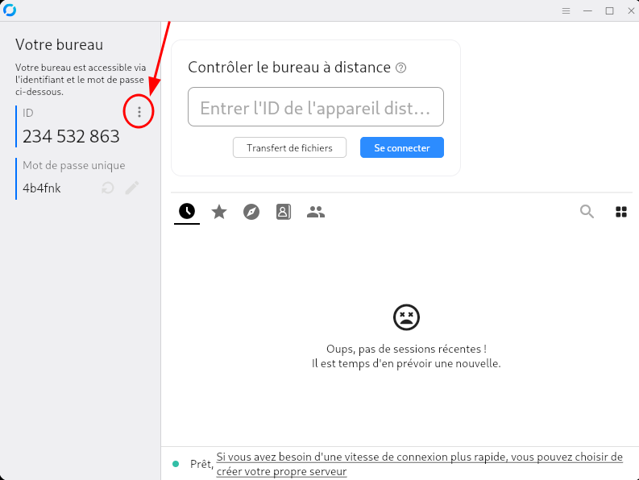   
Puis Réseau et ID/Serveur Relais  
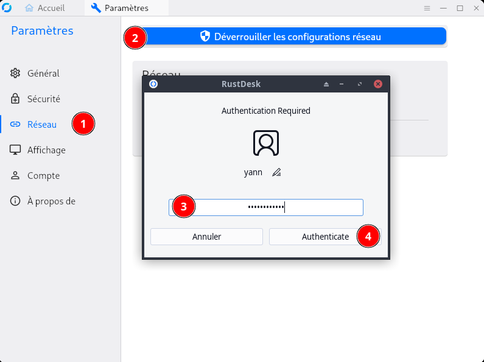  

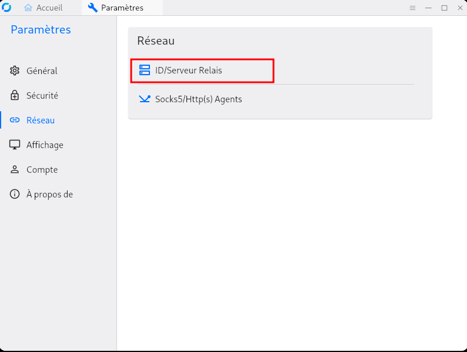   
Dans la configuration, on va donc dans "Réseau" et on "déverrouille les configurations réseau (si demandé)".  
Puis on met l'IP du serveur relais dans "Serveur relais" et la clé secrète (clé du serveur présente dans id_ed2559.pub) dans "Key".   
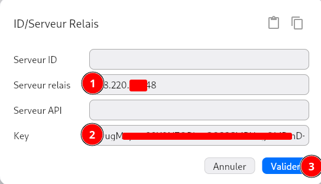  

Retour sur "Acceuil", le client est paramétré !  
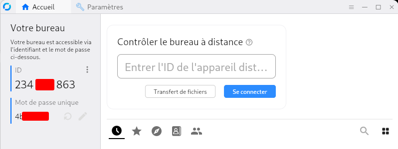  

## Client Rustdesk Windows

### Installation client RustDesk windows

Téléchargez le client RustDesk pour Windows depuis ce lien <https://github.com/rustdesk/rustdesk/releases/tag/1.3.6>   
  
Et installer  
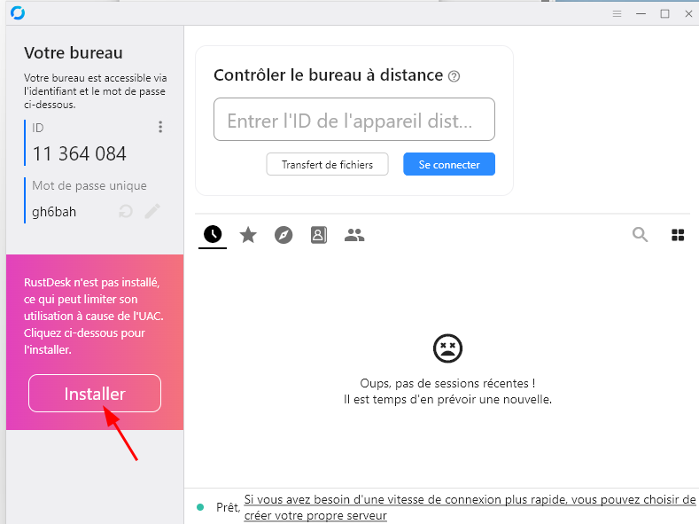  
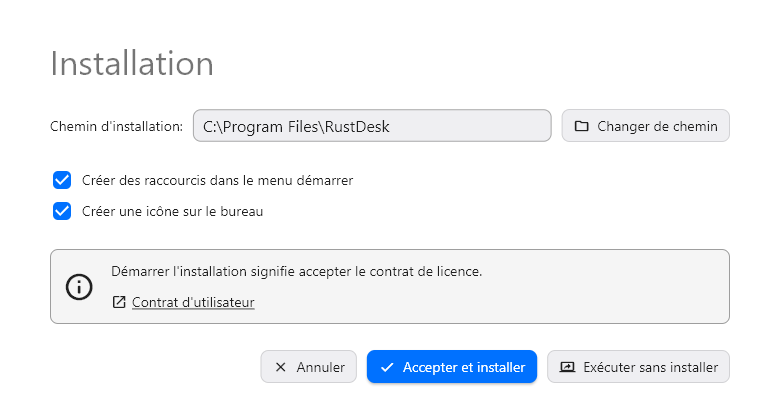  
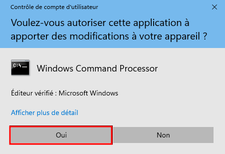  

### Client Windows pour utiliser serveur relais


*Comment prendre la main sur un PC à distance avec Rustdesk sur Windows*

Les paramètres du clients : Cliquez sur les trois points  à droite de l’ID  
  
Puis Réseau et ID/Serveur Relais  
  
  
Dans la configuration, on va donc dans "Réseau" et on "déverrouille les configurations réseau".
Puis on met l'IP du serveur relais dans "Serveur relais" et la clé secrète (clé du serveur présente dans id_ed2559.pub) dans "Key".  
  

## Client Rustdesk Android

*Prendre la main à distance sur des téléphones de type Android.  
Doc officielle: <https://rustdesk.com/docs/fr/client/android/>*

[Prise de main à distance de téléphone Android](https://www.aukfood.fr/prise-de-main-a-distance-de-telephone-android/)

