+++
title = 'Nginx PHP MariaDB Nextcloud Hub'
date = 2025-03-07 00:00:00 +0100
categories = ['nextcloud']
+++
*Nextcloud est une suite de logiciels client-serveur permettant de créer et d'utiliser des services d'hébergement de fichiers.*  
{:width="150" .normal}


# Nginx Php MariaDb et Domaine

{:width="150" .normal} {:width="60" .normal}  {:width="60" .normal}  {:width="60" .normal}

## Nginx

<https://techexpert.tips/fr/nginx-fr/>

### Paquet nginx-extras

Nginx extras

    sudo apt install nginx-extras

Si installation après compilation  
[Archivage de mon script de build NGINX (et comment repasser sous nginx-extras)](https://www.abyssproject.net/2022/05/archivage-de-mon-script-de-build-nginx-et-comment-repasser-sous-nginx-extras/)

```
# en mode su
apt -o Dpkg::Options::="--force-confnew" install nginx-extras -y
rm /usr/local/lib/x86_64-linux-gnu/perl/5.36.0/nginx.pm
systemctl restart nginx
```

Dans le cas d'une installation correcte, voici la structure

```
/etc/nginx/
├── conf.d
├── fastcgi.conf
├── fastcgi_params
├── koi-utf
├── koi-win
├── mime.types
├── modules-available
├── modules-enabled
│   ├── 10-mod-http-ndk.conf -> /usr/share/nginx/modules-available/mod-http-ndk.conf
│   ├── 50-mod-http-auth-pam.conf -> /usr/share/nginx/modules-available/mod-http-auth-pam.conf
│   ├── 50-mod-http-cache-purge.conf -> /usr/share/nginx/modules-available/mod-http-cache-purge.conf
│   ├── 50-mod-http-dav-ext.conf -> /usr/share/nginx/modules-available/mod-http-dav-ext.conf
│   ├── 50-mod-http-echo.conf -> /usr/share/nginx/modules-available/mod-http-echo.conf
│   ├── 50-mod-http-fancyindex.conf -> /usr/share/nginx/modules-available/mod-http-fancyindex.conf
│   ├── 50-mod-http-geoip2.conf -> /usr/share/nginx/modules-available/mod-http-geoip2.conf
│   ├── 50-mod-http-geoip.conf -> /usr/share/nginx/modules-available/mod-http-geoip.conf
│   ├── 50-mod-http-headers-more-filter.conf -> /usr/share/nginx/modules-available/mod-http-headers-more-filter.conf
│   ├── 50-mod-http-image-filter.conf -> /usr/share/nginx/modules-available/mod-http-image-filter.conf
│   ├── 50-mod-http-lua.conf -> /usr/share/nginx/modules-available/mod-http-lua.conf
│   ├── 50-mod-http-perl.conf -> /usr/share/nginx/modules-available/mod-http-perl.conf
│   ├── 50-mod-http-subs-filter.conf -> /usr/share/nginx/modules-available/mod-http-subs-filter.conf
│   ├── 50-mod-http-uploadprogress.conf -> /usr/share/nginx/modules-available/mod-http-uploadprogress.conf
│   ├── 50-mod-http-upstream-fair.conf -> /usr/share/nginx/modules-available/mod-http-upstream-fair.conf
│   ├── 50-mod-http-xslt-filter.conf -> /usr/share/nginx/modules-available/mod-http-xslt-filter.conf
│   ├── 50-mod-mail.conf -> /usr/share/nginx/modules-available/mod-mail.conf
│   ├── 50-mod-nchan.conf -> /usr/share/nginx/modules-available/mod-nchan.conf
│   ├── 50-mod-stream.conf -> /usr/share/nginx/modules-available/mod-stream.conf
│   ├── 70-mod-stream-geoip2.conf -> /usr/share/nginx/modules-available/mod-stream-geoip2.conf
│   └── 70-mod-stream-geoip.conf -> /usr/share/nginx/modules-available/mod-stream-geoip.conf
├── nginx.conf
├── proxy_params
├── scgi_params
├── sites-available
│   └── default
├── sites-enabled
│   └── default -> /etc/nginx/sites-available/default
├── snippets
│   ├── fastcgi-php.conf
│   └── snakeoil.conf
├── uwsgi_params
└── win-utf
```

Modifier fichier /etc/nginx/nginx.conf

```
    types_hash_max_size 2048;
    variables_hash_max_size 2048;

	##
	# Virtual Host Configs
	##

	include /etc/nginx/conf.d/*.conf;
	#include /etc/nginx/sites-enabled/*;

```

Supprimer la configuration active par défaut et recharger nginx

    sudo rm -r /etc/nginx/sites-*
    sudo rm -r /var/www/
    sudo systemctl reload nginx

Fichier de configuration final 

```
user www-data;
worker_processes auto;
pid /run/nginx.pid;
error_log /var/log/nginx/error.log;
include /etc/nginx/modules-enabled/*.conf;

events {
	worker_connections 768;
	# multi_accept on;
}

http {

	##
	# Basic Settings
	##

	sendfile on;
	tcp_nopush on;
	types_hash_max_size 2048;
        variables_hash_max_size 2048;
	# server_tokens off;

	# server_names_hash_bucket_size 64;
	# server_name_in_redirect off;

	include /etc/nginx/mime.types;
	default_type application/octet-stream;

	##
	# SSL Settings
	##

	ssl_protocols TLSv1.2 TLSv1.3;
	ssl_prefer_server_ciphers on;

	##
	# Logging Settings
	##

	access_log /var/log/nginx/access.log;

	##
	# Gzip Settings
	##

	gzip on;

	# gzip_vary on;
	# gzip_proxied any;
	# gzip_comp_level 6;
	# gzip_buffers 16 8k;
	# gzip_http_version 1.1;
	# gzip_types text/plain text/css application/json application/javascript text/xml application/xml application/xml+rss text/javascript;

	##
	# Virtual Host Configs
	##

	include /etc/nginx/conf.d/*.conf;
	#include /etc/nginx/sites-enabled/*;
}

```

### nginx traitement demande


#### Serveurs virtuels basés sur le nom

nginx décide d'abord quel serveur doit traiter la requête. Commençons par une configuration simple où les trois serveurs virtuels écoutent sur le port *:80 :

```
server {
    listen      80;
    server_name example.org www.example.org;
    ...
}

server {
    listen      80;
    server_name example.net www.example.net;
    ...
}

server {
    listen      80;
    server_name example.com www.example.com;
    ...
}
```

Dans cette configuration, nginx teste uniquement le champ d'en-tête « Host » de la requête pour déterminer vers quel serveur la requête doit être acheminée.  
Si sa valeur ne correspond à aucun nom de serveur ou si la requête ne contient pas du tout ce champ d'en-tête, alors nginx acheminera la requête vers le serveur par défaut pour ce port.  
Dans la configuration ci-dessus, le serveur par défaut est le premier, ce qui correspond au comportement par défaut standard de nginx. Il peut également être défini explicitement quel serveur doit être par défaut, avec le paramètre `default_server` dans la directive d'écoute :

```
server {
    listen      80 default_server;
    server_name example.net www.example.net;
    ...
}
```

>Notez que le serveur par défaut est une propriété du port d'écoute et non du nom du serveur.

#### Comment empêcher le traitement des demandes avec des noms de serveur non définis

Si les requêtes sans le champ d'en-tête «Hosts» ne doivent pas être autorisées, un serveur qui supprime simplement les requêtes peut être défini :

```
server {
    listen      80;
    server_name "";
    return      444;
}
```

Ici, le nom du serveur est défini sur une chaîne vide qui correspondra aux requêtes sans le champ d'en-tête « Host », et un code non standard spécial nginx 444 est renvoyé pour fermer la connexion.

> Depuis la version 0.8.48, il s'agit du paramètre par défaut pour le nom du serveur, donc le server_name "" peut être omis. Dans les versions antérieures, le nom d'hôte de la machine était utilisé comme nom de serveur par défaut.
{: .prompt-info }

**Un code d'état 444** indique généralement que le serveur n'a pas renvoyé de réponse au client et a fermé la connexion. Cela peut se produire pour plusieurs raisons, notamment

*    Le serveur ou le réseau peut rencontrer un problème temporaire ou permanent qui l'empêche de répondre à la demande du client.
*    Le client peut avoir fait une demande que le serveur n'est pas en mesure de traiter ou qui enfreint les règles du serveur, ce qui amène ce dernier à mettre fin à la connexion.
*    Un pare-feu ou un logiciel de sécurité peut bloquer la demande ou la réponse, ce qui entraîne la fermeture de la connexion sans réponse.

#### Serveurs virtuels mixtes basés sur le nom et basés sur IP

Regardons une configuration plus complexe où certains serveurs virtuels écoutent sur différentes adresses :

```
server {
    listen      192.168.1.1:80;
    server_name example.org www.example.org;
    ...
}

server {
    listen      192.168.1.1:80;
    server_name example.net www.example.net;
    ...
}

server {
    listen      192.168.1.2:80;
    server_name example.com www.example.com;
    ...
}
```

Dans cette configuration, nginx teste d'abord l'adresse IP et le port de la requête par rapport aux directives d'écoute des blocs serveur . Il teste ensuite le champ d'en-tête « Host » de la requête par rapport aux entrées server_name des blocs de serveur qui correspondent à l'adresse IP et au port. Si le nom du serveur n'est pas trouvé, la requête sera traitée par le serveur par défaut. Par exemple, une requête www.example.com reçue sur le port 192.168.1.1:80 sera traitée par le serveur par défaut du port 192.168.1.1:80, c'est à dire par le premier serveur, puisqu'il n'y a pas de définition www.example.com pour ce port.

Comme déjà indiqué, un serveur par défaut est une propriété du port d'écoute, et différents serveurs par défaut peuvent être définis pour différents ports :

```
server {
    listen      192.168.1.1:80;
    server_name example.org www.example.org;
    ...
}

server {
    listen      192.168.1.1:80 default_server;
    server_name example.net www.example.net;
    ...
}

server {
    listen      192.168.1.2:80 default_server;
    server_name example.com www.example.com;
    ...
}
```

#### Une configuration simple de site PHP

Voyons maintenant comment nginx choisit un emplacement pour traiter une demande pour un site PHP simple et typique :

```
server {
    listen      80;
    server_name example.org www.example.org;
    root        /data/www;

    location / {
        index   index/ index.php;
    }

    location ~* \.(gif|jpg|png)$ {
        expires 30d;
    }

    location ~ \.php$ {
        fastcgi_pass  localhost:9000;
        fastcgi_param SCRIPT_FILENAME
                      $document_root$fastcgi_script_name;
        include       fastcgi_params;
    }
}
```

nginx recherche d'abord l'emplacement de préfixe le plus spécifique donné par les chaînes littérales, quel que soit l'ordre indiqué. Dans la configuration ci-dessus, le seul emplacement du préfixe est «/ » et comme il correspond à toute demande, il sera utilisé en dernier recours. Ensuite, nginx vérifie les emplacements donnés par l'expression régulière dans l'ordre indiqué dans le fichier de configuration. La première expression correspondante arrête la recherche et nginx utilisera cet emplacement. Si aucune expression régulière ne correspond à une requête, nginx utilise l'emplacement de préfixe le plus spécifique trouvé précédemment.

Notez que les emplacements de tous types testent uniquement une partie URI de la ligne de requête sans arguments. Cela est dû au fait que les arguments dans la chaîne de requête peuvent être donnés de plusieurs manières, par exemple :

```
/index.php?user=john&page=1
/index.php?page=1&user=john
```

De plus, n'importe qui peut demander n'importe quoi dans la chaîne de requête :

```
/index.php?page=1&something+else&user=john
```

Voyons maintenant comment les requêtes seraient traitées dans la configuration ci-dessus :

*    Une requête «/logo.gif » correspond /d'abord à l'emplacement du préfixe « », puis à l'expression régulière «\.(gif|jpg|png)$ », elle est donc traitée par ce dernier emplacement. À l'aide de la directive «root /data/www », la demande est mappée au fichier /data/www/logo.gifet le fichier est envoyé au client.
*    Une requête «/index.php » correspond également /d'abord à l'emplacement du préfixe « », puis à l'expression régulière «\.(php)$ ». Par conséquent, elle est gérée par ce dernier emplacement et la requête est transmise à un serveur FastCGI écoutant sur localhost:9000. La directive fastcgi_param définit le paramètre FastCGI SCRIPT_FILENAMEsur «/data/www/index.php » et le serveur FastCGI exécute le fichier. La variable $document_rootest égale à la valeur de la directive racine et la variable $fastcgi_script_nameest égale à l'URI de la requête, c'est à dire «/index.php ».
*   Une requête «/about/ » correspond /uniquement à l'emplacement du préfixe « » ; elle est donc traitée à cet emplacement. À l'aide de la directive «root /data/www », la demande est mappée au fichier /data/www/about/et le fichier est envoyé au client.
*    Le traitement d'une requête «/ » est plus complexe. Il correspond uniquement au préfixe d'emplacement «/ » et est donc géré par cet emplacement. Ensuite, la directive index teste l'existence de fichiers d'index en fonction de ses paramètres et de la root /data/wwwdirective « ». Si le fichier /data/www/index/n'existe pas et que le fichier /data/www/index.phpexiste, alors la directive effectue une redirection interne vers «/index.php » et nginx recherche à nouveau les emplacements comme si la demande avait été envoyée par un client. Comme nous l'avons vu précédemment, la requête redirigée sera finalement traitée par le serveur FastCGI.


## PHP

Pour installer la version de 8 de php, ajouter le dépôt sury.

```shell
sudo apt install -y lsb-release apt-transport-https ca-certificates wget
sudo wget -O /etc/apt/trusted.gpg.d/php.gpg https://packages.sury.org/php/apt.gpg
echo "deb https://packages.sury.org/php/ $(lsb_release -sc) main" |sudo tee /etc/apt/sources.list.d/php.list
```

Mise à jour des dépôts :

```shell
sudo apt update && sudo apt upgrade -y
```

### PHP8.3

Installation PHP8.3 + Modules nécessaires à Nextcloud

```bash
sudo apt -y install \
   php8.3 \
   php8.3-fpm \
   php8.3-sqlite3 \
   php8.3-cli \
   php8.3-gd \
   php8.3-imap \
   php8.3-mysql \
   php8.3-soap \
   php8.3-apcu \
   php8.3-common \
   php8.3-gmp  \
   php8.3-intl \
   php8.3-opcache \
   php8.3-xml \
   php8.3-curl \
   php8.3-igbinary \
   php8.3-readline  \
   php8.3-zip \
   php8.3-bcmath \
   php8.3-imagick \
   php8.3-mbstring \
   php8.3-redis \
   php8.3-bz2 \
   php8.3-smbclient \
   imagemagick libmagickcore-6.q16-6-extra \
   #redis-server 
```

<u>Le fichier php.ini CLI (Command Line Interface) est la configuration PHP qui s'applique lorsque vous exécutez des scripts PHP en ligne de commande</u>.([Nextcloud : Corriger l'erreur Memcache \OC\Memcache\APCu not available for local cache](https://www.larevuegeek.com/articles/actualites-nextcloud-corrigier-lerreur-memcache-oc-memcache-apcu-not-available-for-local-cache-article643/))  
Pour assurer le fonctionnement optimal de Nextcloud, il peut être nécessaire d'activer l'extension APCu dans ce fichier.(en mode su)

    echo "apc.enable_cli = 1" >> /etc/php/8.3/cli/php.ini

### Valkey en remplacement de Redis pour Nextcloud (OPTION)

[Valkey as Redis replacement for Nextcloud](https://fstln.de/en/posts/nextcloud/valkey/)

*Le 20 mars 2024, la société Redis Inc. a annoncé un changement de modèle de licence dans un article de blog . Jusqu'à l'annonce mentionnée ci-dessus, Redis était publié sous la licence BSD-3-Clause . Toutes les versions plus récentes (à partir de la version 7.4) seront publiées sous un modèle de licence double Redis Source Available License 2.0 (RSALv2) et Server Side Public License (SSPL)*  
Extrait du billet de blog Redis :  

* Puis-je héberger Redis en tant que service interne à mon organisation ?  
    * Oui. Les termes de la RSALv2 ou de la SSPLv1 autorisent toute utilisation hors production et en production, à l'exception de la fourniture d'offres concurrentielles à des tiers qui intègrent ou hébergent nos logiciels.  
    * L'hébergement des produits pour l'utilisation interne de votre organisation est autorisé. 
    * Une organisation comprend ses sociétés affiliées et filiales. 

Cela signifie qu'une division peut héberger Redis pour une utilisation par une autre division interne

Dans cet article, nous nous intéressons à Valkey. Valkey est soutenu par la Linux Foundation , ainsi que par d'anciens responsables de Redis qui travaillent pour de grands fournisseurs de cloud.  
Au moment de la rédaction de cet article, il n'existe pas de variantes packagées de Valkey. Par conséquent, l'installation n'est possible qu'en compilant le code source. Les étapes suivantes ont été réalisées et testées avec Debian 12.5.

## MariaDB

Installer MariaDB :

```shell
sudo apt install mariadb-server
sudo mysql_secure_installation # Y à tout et nouveau mot de passe n
```
Base 'nextcloud' , en mode su

```shell
MOTPASSEDB="Mot_passe_base_bextcloud"
mysql -uroot -e "CREATE DATABASE nextcloud CHARACTER SET utf8mb4 COLLATE utf8mb4_general_ci; \
   CREATE USER 'nextcloud'@'localhost' IDENTIFIED BY '$MOTPASSEDB'; \
   GRANT ALL PRIVILEGES ON nextcloud.* TO 'nextcloud'@'localhost' IDENTIFIED BY '$MOTPASSEDB'; FLUSH PRIVILEGES;"
```

Pour info  
Effacer une base : `mysql -uroot -e 'DROP DATABASE nextcloud'`  
Effacer un utilisateur : `mysql -uroot -e 'DROP USER "nextcloud"@"localhost";'`  

## Sous-Domaine et certificats

[Serveur , installer et renouveler les certificats SSL Let's encrypt via Acme](/posts/Acme-Certficats-Serveurs/)  
Disposer d'un sous-domaine (ici cloud.rnmkcy.eu) avec des certficats SSL valides (Let's Encrypt)  

## Nextcloud Hub

{: .normal}  
[Manuel utilisateur Nextcloud](https://docs.nextcloud.com/server/latest/user_manual/fr/)

*Référence: [Nextcloud Install](https://nextcloud.com/install/)*

### Dernière version Nextcloud

en mode super utilisateur

Lien des versions Nextcloud server <https://download.nextcloud.com/server/releases/>  
On choisit "latest" dans la version  
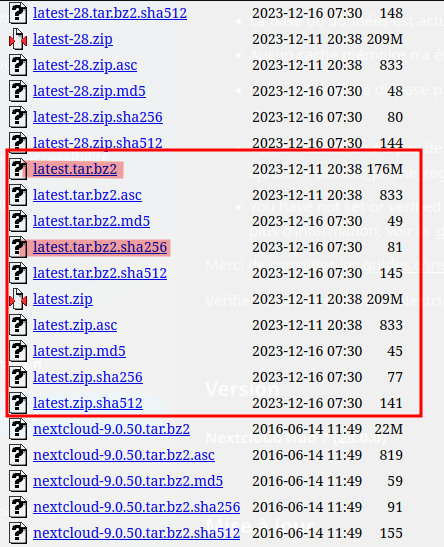

Installer 

```shell
# mode su
wget https://download.nextcloud.com/server/releases/latest.tar.bz2
# checksum et vérification
#wget https://download.nextcloud.com/server/releases/latest.tar.bz2.sha256
#sha256sum -c latest.tar.bz2.sha256 < latest.tar.bz2 
# Décompression, déplacement et effacement
tar -xvf latest.tar.bz2
mv nextcloud /var/www/
rm latest.tar.bz2
# Utilisateur nextcloud et droits
useradd -r nextcloud
chown -R nextcloud:www-data /var/www/nextcloud
chmod -R o-rwx /var/www/nextcloud
# Nextcloud data
mkdir -p /srv/nextcloud-data/
chown -R nextcloud:nextcloud /srv/nextcloud-data/
chmod -R o-rwx /srv/nextcloud-data/
```

### Pool PHP-FPM Nextcloud

<u>Pool PHP-FPM 8.3</u> Nextcloud : `/etc/php/8.3/fpm/pool.d/nextcloud.conf`  
en mode su

```shell
cat > /etc/php/8.3/fpm/pool.d/nextcloud.conf << EOF
[nextcloud]

user = nextcloud
group = nextcloud

chdir = /var/www/nextcloud

listen = /var/run/php/php8.3-fpm-nextcloud.sock
listen.owner = www-data
listen.group = www-data

pm = dynamic
pm.max_children = 16
pm.max_requests = 500
request_terminate_timeout = 1d


pm.start_servers = 6
pm.min_spare_servers = 5
pm.max_spare_servers = 8


; Additional php.ini defines, specific to this pool of workers.
env[PATH] = /usr/local/sbin:/usr/local/bin:/usr/sbin:/usr/bin:/sbin:/bin
php_admin_value[memory_limit] = 512M
php_value[upload_max_filesize] = 10G
php_value[post_max_size] = 10G
php_value[default_charset] = UTF-8
php_value[opcache.enable_cli]=1
php_value[opcache.memory_consumption]=256
php_value[opcache.interned_strings_buffer]=128
php_value[opcache.max_accelerated_files]=32530
php_value[opcache.save_comments]=1
php_value[opcache.revalidate_freq]=60
php_value[opcache.jit]=1255
php_value[opcache.jit_buffer_size]=128M
php_value[apc.enabled]=1
php_value[apc.enable_cli]=1
EOF
```

Avec ldap

    apt install php8.3-ldap

Relancer le service 

    systemctl restart php8.3-fpm

Liste des paquets php8.3 installés: `dpkg -l |grep php8.3`

```
ii  php8.3                                8.3.21-1+0~20250509.62+debian12~1.gbpd2ac5c all          server-side, HTML-embedded scripting language (metapackage)
ii  php8.3-apcu                           5.1.24-1+0~20250407.42+debian12~1.gbp5f79ec amd64        APC User Cache for PHP
ii  php8.3-bcmath                         8.3.21-1+0~20250509.62+debian12~1.gbpd2ac5c amd64        Bcmath module for PHP
ii  php8.3-bz2                            8.3.21-1+0~20250509.62+debian12~1.gbpd2ac5c amd64        bzip2 module for PHP
ii  php8.3-cli                            8.3.21-1+0~20250509.62+debian12~1.gbpd2ac5c amd64        command-line interpreter for the PHP scripting language
ii  php8.3-common                         8.3.21-1+0~20250509.62+debian12~1.gbpd2ac5c amd64        documentation, examples and common module for PHP
ii  php8.3-curl                           8.3.21-1+0~20250509.62+debian12~1.gbpd2ac5c amd64        CURL module for PHP
ii  php8.3-fpm                            8.3.21-1+0~20250509.62+debian12~1.gbpd2ac5c amd64        server-side, HTML-embedded scripting language (FPM-CGI binary)
ii  php8.3-gd                             8.3.21-1+0~20250509.62+debian12~1.gbpd2ac5c amd64        GD module for PHP
ii  php8.3-gmp                            8.3.21-1+0~20250509.62+debian12~1.gbpd2ac5c amd64        GMP module for PHP
ii  php8.3-igbinary                       3.2.16-4+0~20250408.53+debian12~1.gbpef518d amd64        igbinary PHP serializer
ii  php8.3-imagick                        3.8.0-1+0~20250418.51+debian12~1.gbpab6fa0  amd64        Provides a wrapper to the ImageMagick library
ii  php8.3-imap                           8.3.21-1+0~20250509.62+debian12~1.gbpd2ac5c amd64        IMAP module for PHP
ii  php8.3-intl                           8.3.21-1+0~20250509.62+debian12~1.gbpd2ac5c amd64        Internationalisation module for PHP
ii  php8.3-ldap                           8.3.21-1+0~20250509.62+debian12~1.gbpd2ac5c amd64        LDAP module for PHP
ii  php8.3-mbstring                       8.3.21-1+0~20250509.62+debian12~1.gbpd2ac5c amd64        MBSTRING module for PHP
ii  php8.3-mysql                          8.3.21-1+0~20250509.62+debian12~1.gbpd2ac5c amd64        MySQL module for PHP
ii  php8.3-opcache                        8.3.21-1+0~20250509.62+debian12~1.gbpd2ac5c amd64        Zend OpCache module for PHP
ii  php8.3-readline                       8.3.21-1+0~20250509.62+debian12~1.gbpd2ac5c amd64        readline module for PHP
ii  php8.3-redis                          6.2.0-1+0~20250408.63+debian12~1.gbp272b23  amd64        PHP extension for interfacing with Redis
ii  php8.3-smbclient                      1.1.2-3+0~20250508.31+debian12~1.gbp8bc992  amd64        PHP wrapper for libsmbclient
ii  php8.3-soap                           8.3.21-1+0~20250509.62+debian12~1.gbpd2ac5c amd64        SOAP module for PHP
ii  php8.3-sqlite3                        8.3.21-1+0~20250509.62+debian12~1.gbpd2ac5c amd64        SQLite3 module for PHP
ii  php8.3-xml                            8.3.21-1+0~20250509.62+debian12~1.gbpd2ac5c amd64        DOM, SimpleXML, XML, and XSL module for PHP
ii  php8.3-yaml                           2.2.4-1+0~20250508.39+debian12~1.gbpa284cd  amd64        YAML-1.1 parser and emitter for PHP
ii  php8.3-zip                            8.3.21-1+0~20250509.62+debian12~1.gbpd2ac5c amd64        Zip module for PHP
```

### Nextcloud Nginx headers,SSL,HSTS,OCSP

[Nginx headers,SSL,HSTS,OCSP](/posts/Nginx_headers_SSL_HSTS_OCSP/)

Versions  
`nginx -v` : nginx version: nginx/1.22.1  
`openssl version` : OpenSSL 3.0.13 30 Jan 2024 (Library: OpenSSL 3.0.15 3 Sep 2024)  
[SSL Configuration Generator](https://ssl-config.mozilla.org/#server=nginx&version=1.24.0&config=modern&openssl=1.1.1n&guideline=5.7)  

Créer en conséquence le fichier le fichier `/etc/nginx/conf.d/security.conf.inc` ci-dessous suivant le résultat de la requête précédente 

```
    ssl_certificate /etc/ssl/private/rnmkcy.eu-fullchain.pem;
    ssl_certificate_key /etc/ssl/private/rnmkcy.eu-key.pem;
    ssl_session_timeout 1d;
    ssl_session_cache shared:MozSSL:10m;  # about 40000 sessions
    ssl_session_tickets off;

    # modern configuration
    ssl_protocols TLSv1.3;
    ssl_ecdh_curve X25519:prime256v1:secp384r1;
    ssl_prefer_server_ciphers off;

    # Options
    #add_header Strict-Transport-Security "max-age=15768000; includeSubDomains";
    #add_header Content-Security-Policy "default-src 'self'";
    #add_header X-Frame-Options "SAMEORIGIN" ;
    #add_header X-XSS-Protection "1 ; mode=block" ;

    # OCSP stapling
    ssl_stapling on;
    ssl_stapling_verify on;

    # verify chain of trust of OCSP response using Root CA and Intermediate certs
    ssl_trusted_certificate /etc/ssl/private/rnmkcy.eu-fullchain.pem;

    # replace with the IP address of your resolver
    resolver 1.1.1.1 9.9.9.9 valid=300s;
    resolver_timeout 5s;
```

Si vous avez installé un résolveur en local , remplacer `1.1.1.1 9.9.9.9` par `127.0.0.1`  
Remplacer rnmkcy.eu par le nom du domaine souhaité

### Nextcloud Vhost nginx

Exemple avec domaine **cloud.rnmkcy.eu**

Nexcloud sur le domaine cloud.rnmkcy.eu avec certificats Let’s Encrypt

> `ATTENTION !!! Remplacer rnmkcy.eu par le nom de votre domaine`
{: .prompt-warning }

Le fichier de configuration web cloud.rnmkcy.eu.conf `/etc/nginx/conf.d/cloud.rnmkcy.eu.conf`

<details>
<summary><b>Etendre Réduire cloud.rnmkcy.eu.conf</b></summary>

  
upstream php-handler {
    server unix:/var/run/php/php8.3-fpm-nextcloud.sock;
}

server {
    listen 80;
    listen [::]:80;
    server_name cloud.rnmkcy.eu;
    # enforce https
    return 301 https://$server_name:443$request_uri;
}

server {
    listen 443 ssl http2;
    listen [::]:443 ssl http2;
    server_name cloud.rnmkcy.eu;

    include /etc/nginx/conf.d/security.conf.inc;
    more_set_headers "Strict-Transport-Security : max-age=63072000; includeSubDomains; preload";


#    include snippets/authelia-location.conf; # Authelia auth endpoint

  
location ^~ /.well-known {
  # The following 6 rules are borrowed from `.htaccess`

  # The following 2 rules are only needed for the user_webfinger app.
  # Uncomment it if you're planning to use this app.
  #rewrite ^/\.well-known/host-meta\.json  /public.php?service=host-meta-json  last;
  #rewrite ^/\.well-known/host-meta        /public.php?service=host-meta       last;

  location = /.well-known/carddav     { return 301 /remote.php/dav/; }
  location = /.well-known/caldav      { return 301 /remote.php/dav/; }

  location = /.well-known/webfinger     { return 301 /index.php$uri; }
  location = /.well-known/nodeinfo      { return 301 /index.php$uri; }

  try_files $uri $uri/ =404;
}

#sub_path_only rewrite ^/$ / permanent;
location ^~ / {

  # Path to source
  alias /var/www/nextcloud/;

  # Set max upload size
  client_max_body_size 10G;
  fastcgi_buffers 64 4K;

  # Enable gzip but do not remove ETag headers
  gzip on;
  gzip_vary on;
  gzip_comp_level 4;
  gzip_min_length 256;
  gzip_proxied expired no-cache no-store private no_last_modified no_etag auth;
  gzip_types application/atom+xml application/javascript application/json application/ld+json application/manifest+json application/rss+xml application/vnd.geo+json application/vnd.ms-fontobject application/x-font-ttf application/x-web-app-manifest+json application//+xml application/xml font/opentype image/bmp image/svg+xml image/x-icon text/cache-manifest text/css text/plain text/vcard text/vnd.rim.location.xloc text/vtt text/x-component text/x-cross-domain-policy;

  # Pagespeed is not supported by Nextcloud, so if your server is built
  # with the `ngx_pagespeed` module, uncomment this line to disable it.
  #pagespeed off;

  # The settings allows you to optimize the HTTP2 bandwitdth.
  # See https://blog.cloudflare.com/delivering-http-2-upload-speed-improvements/
  # for tunning hints
  client_body_buffer_size 512k;

  # HTTP response headers borrowed from Nextcloud `.htaccess`
  #more_set_headers "Strict-Transport-Security: max-age=15768000; includeSubDomains; preload;";
  more_set_headers "Referrer-Policy: no-referrer";
  more_set_headers "X-Content-Type-Options: nosniff";
  more_set_headers "X-Download-Options: noopen";
  more_set_headers "X-Frame-Options: SAMEORIGIN";
  more_set_headers "X-Permitted-Cross-Domain-Policies: none";
  more_set_headers "X-Robots-Tag: noindex, nofollow";
  more_set_headers "X-XSS-Protection: 1; mode=block";

  # Remove X-Powered-By, which is an information leak
  fastcgi_hide_header X-Powered-By;

  # Specify how to handle directories -- specifying `/nextcloud/index.php$request_uri`
  # here as the fallback means that Nginx always exhibits the desired behaviour
  # when a client requests a path that corresponds to a directory that exists
  # on the server. In particular, if that directory contains an index.php file,
  # that file is correctly served; if it doesn't, then the request is passed to
  # the front-end controller. This consistent behaviour means that we don't need
  # to specify custom rules for certain paths (e.g. images and other assets,
  # `/updater`, `/ocm-provider`, `/ocs-provider`), and thus
  # `try_files $uri $uri/ /nextcloud/index.php$request_uri`
  # always provides the desired behaviour.
  index index.php index/ /index.php$request_uri;

  # Rule borrowed from `.htaccess` to handle Microsoft DAV clients
  location = / {
      if ( $http_user_agent ~ ^DavClnt ) {
          return 302 /remote.php/webdav/$is_args$args;
      }
  }

  location = /robots.txt {
    allow all;
    log_not_found off;
    access_log off;
  }

  # Rules borrowed from `.htaccess` to hide certain paths from clients
  location ~ ^/(?:build|tests|config|lib|3rdparty|templates|data)(?:$|/)    { return 404; }
  location ~ ^/(?:\.|autotest|occ|issue|indie|db_|console)                  { return 404; }

  # Ensure this block, which passes PHP files to the PHP process, is above the blocks
  # which handle static assets (as seen below). If this block is not declared first,
  # then Nginx will encounter an infinite rewriting loop when it prepends
  # `/nextcloud/index.php` to the URI, resulting in a HTTP 500 error response.
  location ~ \.php(?:$|/) {
    # Required for legacy support
    rewrite ^/(?!index|remote|public|cron|core\/ajax\/update|status|ocs\/v[12]|updater\/.+|ocs-provider\/.+|.+\/richdocumentscode\/proxy|.+\/richdocumentscode_arm64\/proxy) /index.php$request_uri;
    
    fastcgi_split_path_info ^(.+?\.php)(/.*)$;
    set $path_info $fastcgi_path_info;
    
    try_files $fastcgi_script_name =404;
    
    include fastcgi_params;
    fastcgi_param SCRIPT_FILENAME $request_filename;
    fastcgi_split_path_info ^(.+\.php)(/.+)$;
    fastcgi_param HTTPS on;

    fastcgi_param modHeadersAvailable true;         # Avoid sending the security headers twice
    fastcgi_param front_controller_active true;     # Enable pretty urls
    fastcgi_param HTTP_ACCEPT_ENCODING "";          # Disable encoding of nextcloud response to inject ynh scripts
    fastcgi_pass php-handler;

    fastcgi_intercept_errors on;
    fastcgi_request_buffering off;

    fastcgi_read_timeout 600;
    fastcgi_send_timeout 600;
    fastcgi_connect_timeout 600;
    proxy_connect_timeout 600;
    proxy_send_timeout 600;
    proxy_read_timeout 600;
    send_timeout 600;
  }

  location ~ ^/(?:updater|ocs-provider)(?:$|/) {
       try_files $uri/ =404;
       index index.php;
  }

  # Serve static files
  location ~ \.(?:css|js|mjs|svg|gif|png|jpg|ico|wasm|tflite|map)$ {
    try_files $uri / /index.php$request_uri;
    expires 6M;         # Cache-Control policy borrowed from `.htaccess`
    access_log off;     # Optional: Don't log access to assets

    location ~ \.wasm$ {
            default_type application/wasm;
    }
  }

  location ~ \.woff2?$ {
    try_files $uri / /index.php$request_uri;
    expires 7d;         # Cache-Control policy borrowed from `.htaccess`
    access_log off;     # Optional: Don't log access to assets
  }

  # Rule borrowed from `.htaccess`
    location /remote {
      return 301 /remote.php$request_uri;
    }

  location ~ / {
    if ($request_method ~ ^(PUT|DELETE|PATCH|PROPFIND|PROPPATCH)$) {
        rewrite ^ /index.php$request_uri last;
    }
    try_files $uri / /index.php$request_uri;
  }
# include snippets/authelia-authrequest.conf; # Protect this endpoint
}


    access_log /var/log/nginx/cloud.rnmkcy.eu-access.log;
    error_log /var/log/nginx/cloud.rnmkcy.eu-error.log;
}




</details>


Vérifier et recharger nginx : `nginx -t && systemctl reload nginx`

### Nextcloud Nginx mimes

> `Les sections Activité et Logging dans le cadre de l’administration affiche des pages vierges`
{: .prompt-warning }

C’est une indication que votre serveur web n’est pas configuré pour gérer correctement les fichiers mjs. 

Il faut modifier le fichier “mime.types” situé dans `/etc/nginx/`, remplaçer la ligne suivante:

    application/javascript js;

par

    application/javascript js mjs;

Puis redémarrer Nginx et php-fpm.

## Paramétrage Nextcloud

### Finaliser installation Nextcloud

> `Tout est paramétré avec le domaine ouestyan.fr qu'il faut remplacer par votre domaine`
{: .prompt-warning }  

Ouvrir le lien <https://cloud.rnmkcy.eu>  
Créer un compte administrateur et son mot de passe  
Renseigner les éléments de la base mysql  
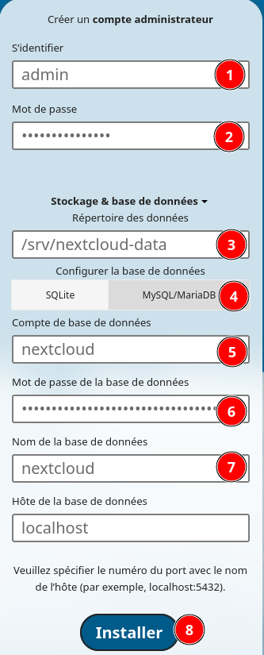{:width="200"}  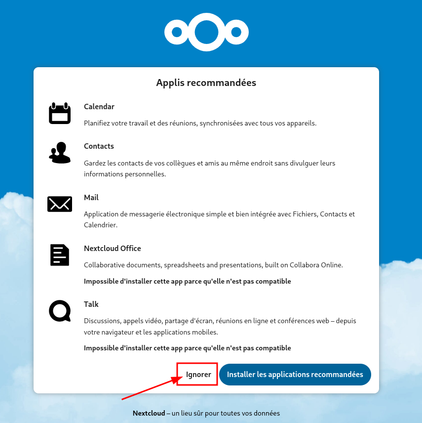{:width="400"}  
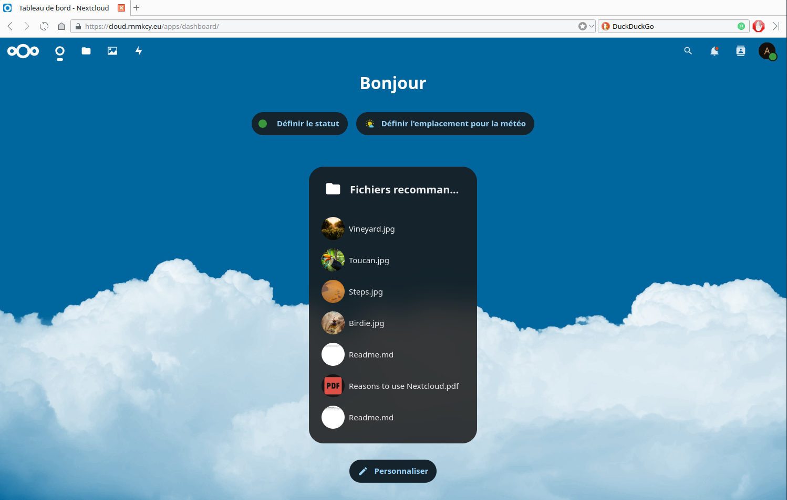  

Se déconnecter...  
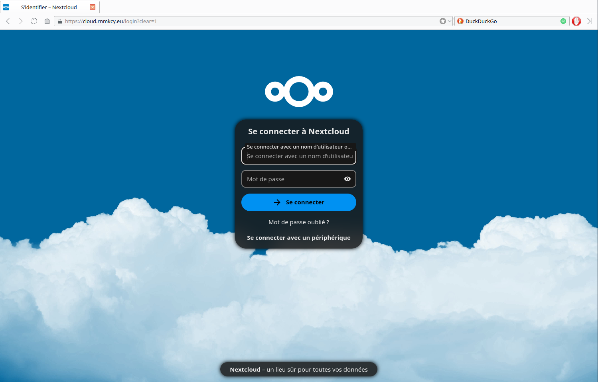  

**Modifier le fichier /var/www/nextcloud/config/config.php**  
Ajouter `'default_phone_region' => 'FR',` et  les lignes suivantes dans le fichier `/var/www/nextcloud/config/config.php` avant le tag de fin de fichier  `);`  

```
  'default_locale' => 'fr_FR',
  'default_phone_region' => 'FR',
  'filelocking.enabled' => true,
  'memcache.locking' => '\OC\Memcache\Redis',
  'memcache.local' => '\\OC\\Memcache\\APCu',
  'redis' => array(
    'host' => 'localhost',
    'port' => 6379,
    'timeout' => 0.0,
    'password' => '',
  ),
```

Messagerie pour notifications

Serveur de messagerie, ajouter les lignes dans le fichier `/var/www/nextcloud/config/config.php` avant le tag de fin de fichier  `);`   

```
  'mail_from_address' => 'yack',
  'mail_smtpmode' => 'smtp',
  'mail_sendmailmode' => 'smtp',
  'mail_domain' => 'cinay.eu',
  'mail_smtphost' => 'cinay.eu',
  'mail_smtpport' => '587',
  'mail_smtpauth' => 1,
  'mail_smtpname' => 'yack',
  'mail_smtppassword' => 'mot_passe_yann',
```

**Nextcloud Travaux cron**  
Vous pouvez programmer des tâches cron de trois façons : en utilisant **AJAX**, **Webcron** ou **cron**.  
La méthode recommandée est **cron**</u>.  

> Note : Il n'est pas obligatoire de sélectionner l'option Cron dans le menu d'administration pour les travaux en arrière-plan, car une fois que cron.php est exécuté à partir de la ligne de commande ou du service cron, il sera automatiquement réglé sur Cron.  
{:width="600"}
{: .prompt-tip }

Vérifier ou créer la tâche cron.php exécutée par utilisateur "nextcloud"

```bash
sudo -u nextcloud crontab -l  # affiche la tâche
sudo -u nextcloud crontab -"  #mode création tâche
```

La tâche est exécutée tous les 5 minutes

```
# m h  dom mon dow   command
*/5  *  *  *  * php -f /var/www/nextcloud/cron.php
```

**Nextcloud maintenance_window_start**

> Le paramètre `maintenance_window_start` n'est pris en compte qu'en mode cron.
{: .prompt-warning }

Dans le fichier config/config.php, vous pouvez spécifier cette configuration. Certaines tâches de fond ne s'exécutent qu'une fois par jour. Lorsqu'une heure est définie (le fuseau horaire est UTC) pour cette configuration, les tâches d'arrière-plan qui s'annoncent comme non sensibles au temps seront retardées pendant les heures "ouvrables" et ne s'exécuteront que dans les 4 heures suivant l'heure donnée. Ceci est par exemple utilisé pour l'expiration des activités, la formation aux connexions suspectes et les vérifications de mise à jour.

> Une valeur de 1, par exemple, n'exécutera ces tâches d'arrière-plan qu'entre 01h00 UTC et 05h00 UTC.
{: .prompt-info }

Ajouter le paramètre au fichier `/var/www/nextcloud/config/config.php`

```
  'maintenance_window_start' => 1,
```


**Journal level**

Les niveaux de journalisation vont de DEBUG, qui enregistre toutes les activités, à FATAL, qui n'enregistre que les erreurs fatales.

*    0 : DEBUG : Toutes les activités ; la journalisation la plus détaillée.
*    1 : INFO : Activités telles que les connexions d'utilisateurs et les activités de fichiers, ainsi que les avertissements, les erreurs et les erreurs fatales.
*    2 : WARN : Les opérations réussissent, mais avec des avertissements sur les problèmes potentiels, ainsi que des erreurs et des erreurs fatales.
*    3 : ERROR : Une opération échoue, mais d'autres services et opérations se poursuivent, ainsi que des erreurs fatales.
*    4 : FATAL : Le serveur s'arrête.

Par défaut, le niveau de journalisation est fixé à 2 (WARN). Utilisez DEBUG lorsque vous avez un problème à diagnostiquer, puis réinitialisez votre niveau de journalisation à un niveau moins verbeux, car DEBUG produit beaucoup d'informations et peut affecter les performances de votre serveur.

Les paramètres du niveau de journalisation sont définis dans le fichier `config/config.php`

```
  'loglevel' => 3,
```

### Récapitulatifs des ajouts au fichier config.php

Tout ce qui suit est ajouté au fichier avant la balise finale 

```
  'default_locale' => 'fr_FR',
  'default_phone_region' => 'FR',
  'filelocking.enabled' => true,
  'memcache.locking' => '\OC\Memcache\Redis',
  'memcache.local' => '\\OC\\Memcache\\APCu',
  'redis' => array(
    'host' => 'localhost',
    'port' => 6379,
    'timeout' => 0.0,
    'password' => '',
  ),
  'mail_from_address' => 'yack',
  'mail_smtpmode' => 'smtp',
  'mail_sendmailmode' => 'smtp',
  'mail_domain' => 'cinay.eu',
  'mail_smtphost' => 'cinay.eu',
  'mail_smtpport' => '587',
  'mail_smtpauth' => 1,
  'mail_smtpname' => 'yack',
  'mail_smtppassword' => 'mot_passe_yann',
  'maintenance_window_start' => 1,
  'loglevel' => 3,

```

### LLDAP - Gestion des utilisateurs

[Clients LLDAP](/posts/Light_LDAP_simple_serveur_authentification/#clients-lldap)

Préalable, le module php8.x-ldap doit être installé  
Ouvrir nextcloud avec "admin", "Applications mises en avant" et Activer LDAP puis Télécharger et activer pour que l'application apparaisse dans les "Applications actives"  
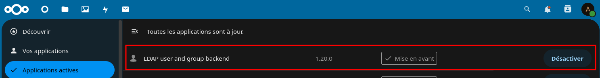  
Ensuite ouvrir "Paramètres d'administration" , "Intégration LDAP/AD"  
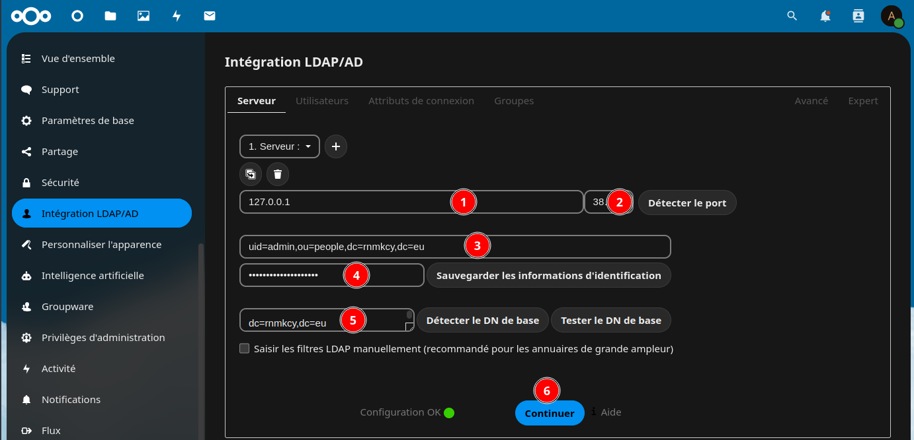   

1. Host: 127.0.0.1  
2. Port: 3890  
3. Utilisateur DN : uid=admin,ou=people,dc=rnmkcy,dc=eu  
4. Mot de passe admin LLDAP
5. DN de base: dc=rnmkcy,dc=eu   
6. Clic Continuer


On va modifier la requête en ajoutant  
`(|(objectclass=inetOrgPerson) (memberOf=cn=nextcloud_users,ou=groups,dc=rnmkcy,dc=eu))`  
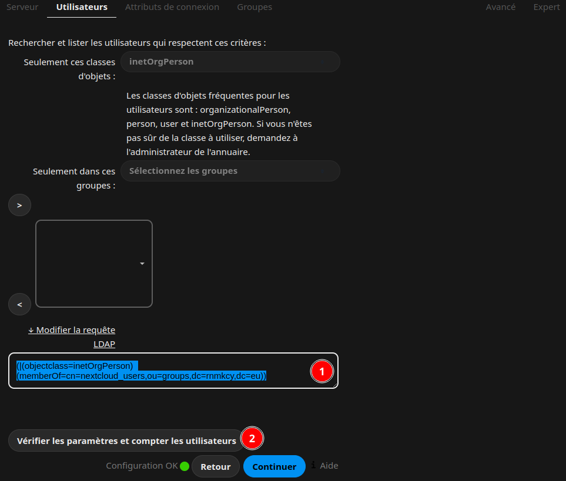   
Il s'affiche "9 utilisateurs trouvés"  
La configuration LLDAP est terminée

Gestion des utilisateurs, ouvrir nextcloud avec admin , puis "Utilisateurs"  
Créer un groupe Utilisateurs et y affecter les comptes concernés , désactiver les autres comptes 
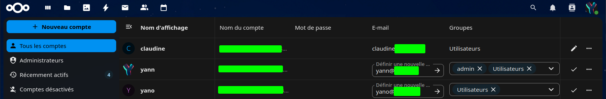   

Se déconnecter, puis se reconnecter avec le nouvel administrateur "yann" et supprimer "admin" , l'utilisateur qui a servi à l'installation de nextcloud  
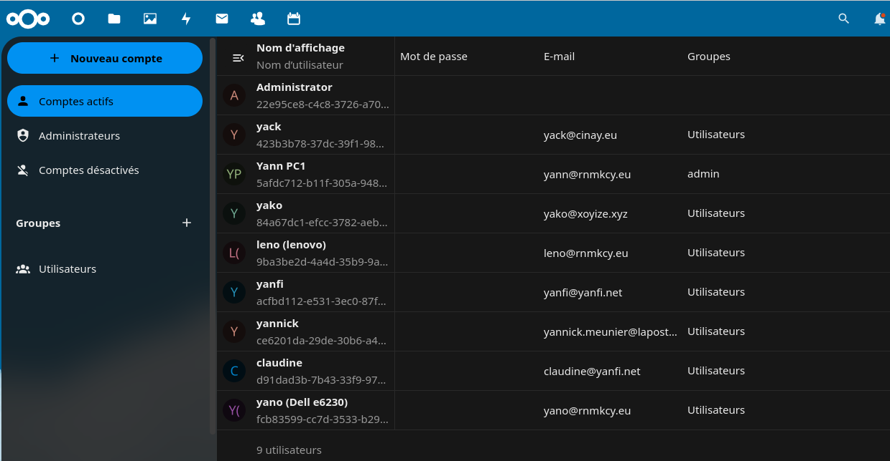   

## Applications Nextcloud

### Messagerie

#### Mail

Si vous avez installé un serveur mail, installer at activer l'application **mail** de nextcloud  


#### SnappyMail (INACTIF)

[SnappyMail Nextcloud](/posts/SnappyMail/#snappymail-nextcloud)

### Contacts et Calendrier

Télécharger et activer les applications   
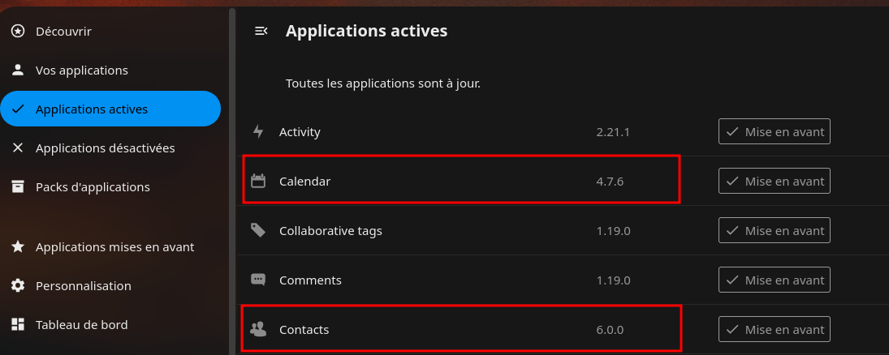

Cliquer sur l'icône "Contact"    
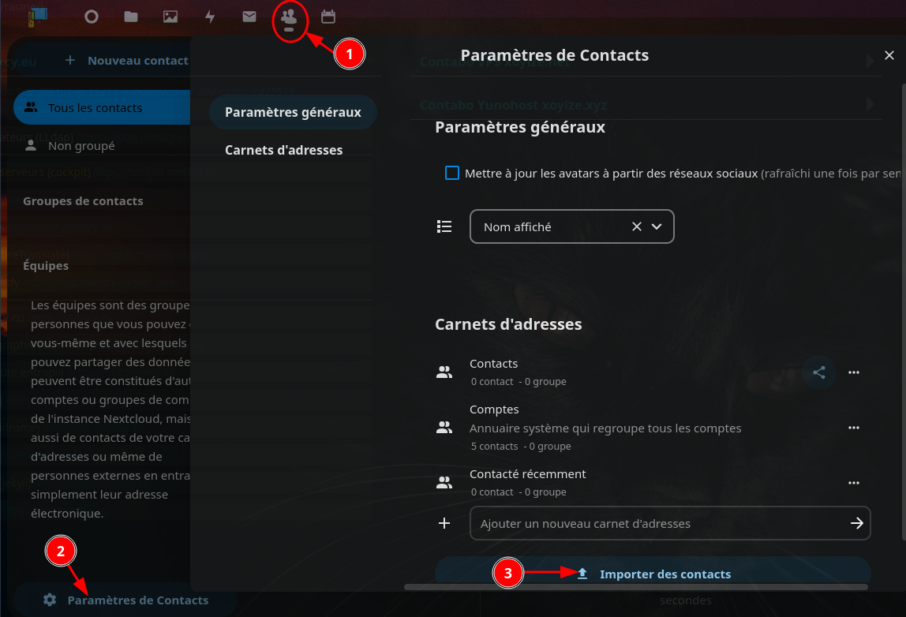{:width="600"}  
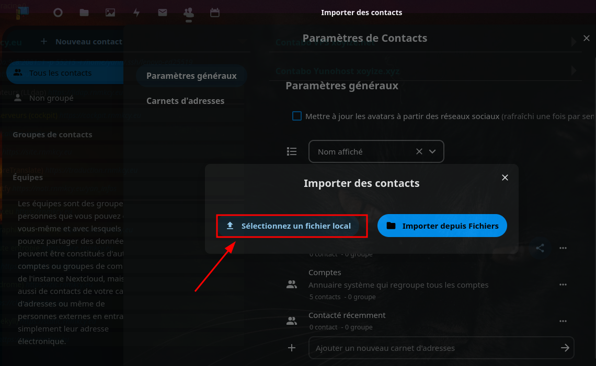{:width="600"}  
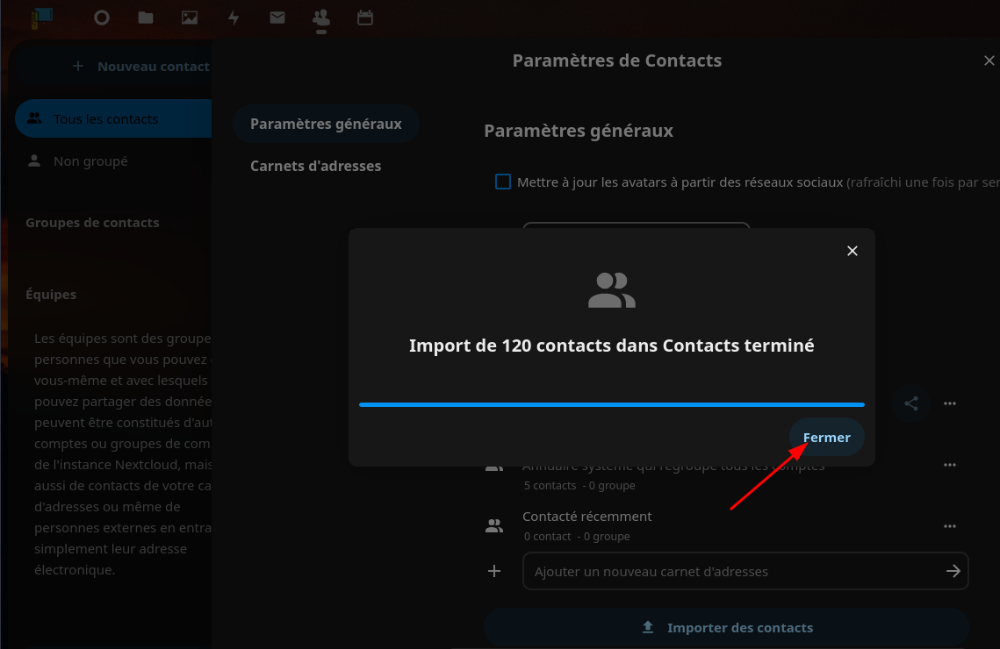{:width="600"}  
Pour le lien  
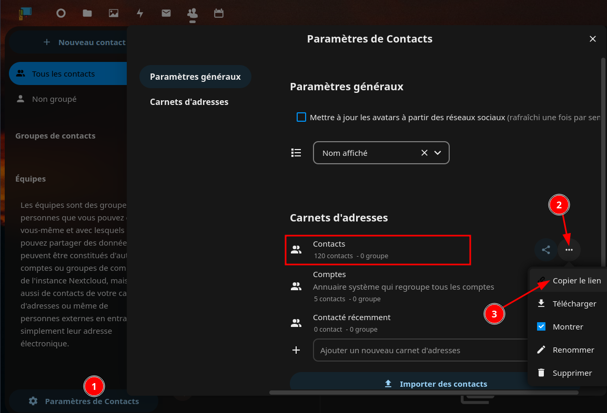{:width="600"}  
Lien interne utilisateur : <https://cloud.rnmkcy.eu/remote.php/dav/addressbooks/users/dentifiant_hexa_utilisateur/contacts/>

Cliquer sur l'icône "Agenda"    
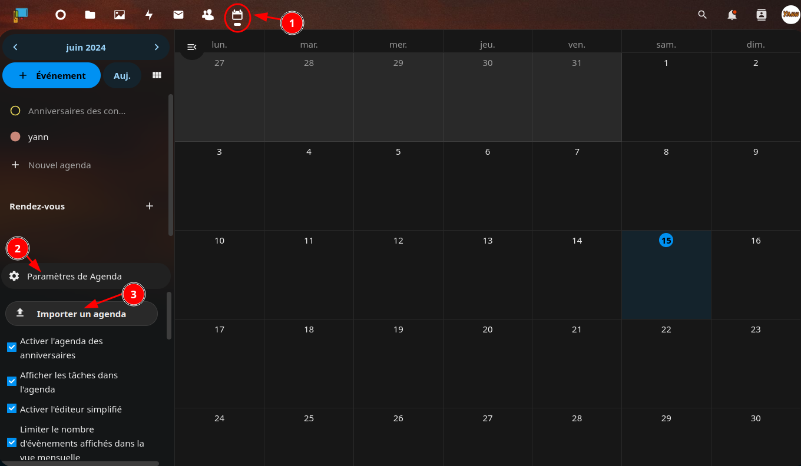{:width="600"}  
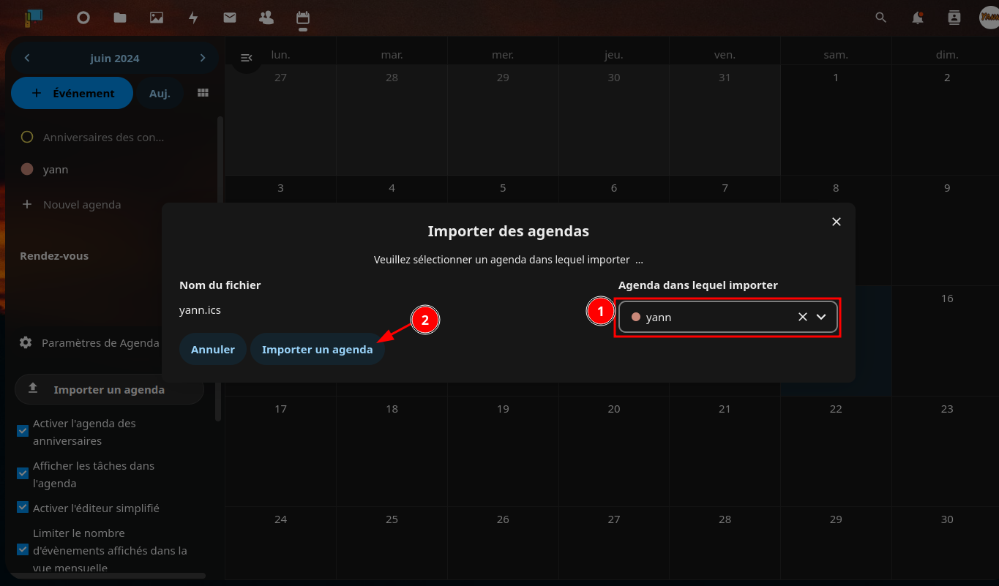{:width="600"}  
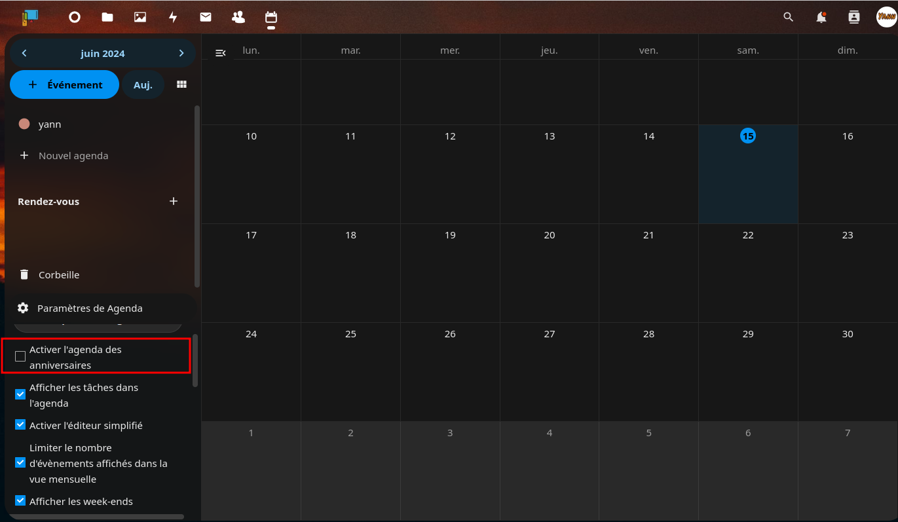{:width="600"}  

Pour les partages  
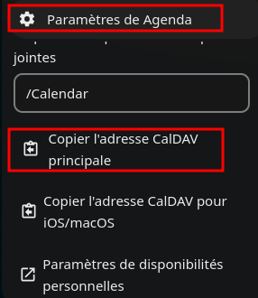{:width="200"}  
Adresse caldav principal : <https://cloud.rnmkcy.eu/remote.php/dav>  

Pour les clients android, thunderbird  
Cliquer sur le lien "Modifier et partager l'agenda" de l'utilisateur yann   
{:width="400"}  
Lien interne utilisateur : <https://cloud.rnmkcy.eu/remote.php/dav/calendars/Identifiant_hexa_utilisateur/personal/>

### Login mot de passe application

Les applications clientes de nextcloud ne peuvent pas se connecter sur nextcloud avec une authentification à 2 facteurs, il faut créer un accès login + mot de passe  
Se connecter à Nextcloud  puis : Personnel → Sécurité → Appareils & sessions  
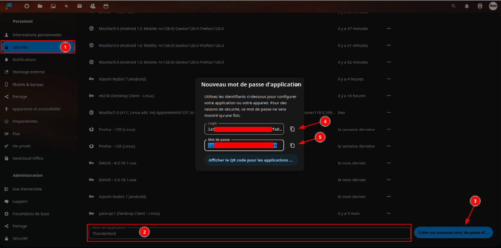   
Sauvegarder les 2 paramètres (utilisateur et mot de passe) pour une utilisation sur les applications clientes...

### Nextcloud Music

« Music » est une application pour OwnCloud et Nextcloud qui joue à la fois le rôle de serveur de musique et celui de client Web.

Les principales fonctionnalités de Nextcloud Music sont :

*    l'indexation de la musique présente sur le stockage Nextcloud,
*    la navigation dans sa bibliothèque et l'écoute de sa musique via une interface Web intégrée à Nextcloud,
*    et la fourniture d'APIs permettant à des applications tierces de s'y connecter.

« Smart playlist » est une sélection (aléatoire ?) de 100 titres que vous pouvez écouter en un clic. Contrairement aux autres playlists, la « Smart playlist » n'est pas accessible en dehors de l'interface Web, mais il est possible de l'enregistrer vers une playlist régulière qui sera alors accessible aux applications tierces.

« Internet radio » et permet d'ajouter et d'écouter des Web radio. Elle fonctionne bien, mais il est important de noter que si votre instance Nextcloud est accessible en HTTPS [elle devrait !], le flux de la radio devra impérativement utiliser ce protocole également. Il s'agit-là d'une limitation liée au navigateur, qui pour des raisons de sécurité empêche d'accéder à des ressources HTTP depuis une page servie en HTTPS.

Et la dernière fonctionnalité permet de s'abonner à des Podcast via des flux RSS.

Activer l'application **Music**  
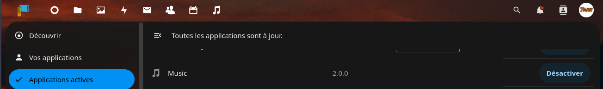

Ouvrir l'application "Music" et cliquer sur Settings  


Pour les applications android, un accès avec mot de passe  
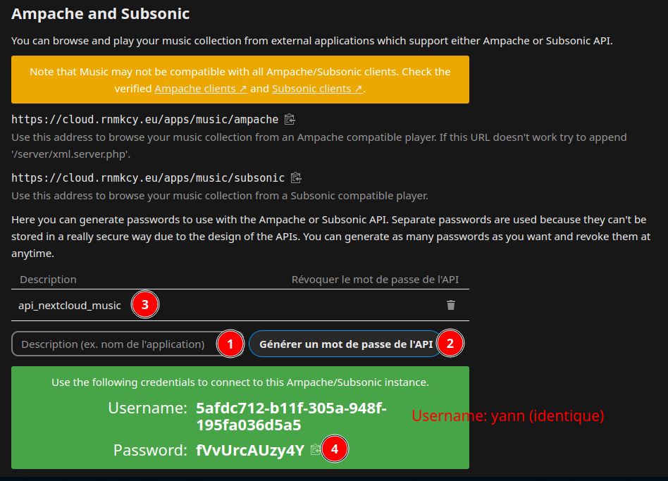

Android **Power Ampache 2** (<https://github.com/icefields/Power-Ampache-2>)  
*Power Ampache 2 est un client musical riche en fonctionnalités conçu pour Ampache, Nextcloud Music et les backends compatibles. Il offre toutes les fonctionnalités des autres lecteurs de musique grand public, tels que Spotify, YouTube Music et Apple Music, et bien plus encore. Avec Power Ampache 2, profitez « réellement » du téléchargement et de l'exportation de fichiers musicaux, de l'accès aux paroles, de la prise en charge de plusieurs comptes et d'une expérience sans publicité et sans suivi.* 

- Listes de lecture générées uniques (smartlists)
- "Spin it!" bouton pour générer une liste de lecture pour vous.
- Mode sombre et clair avec couleurs d'interface adaptatives, ou choisissez/créez votre propre thème.
- Prise en charge des touches multimédias
- Chaque fonctionnalité Bluetooth est disponible dans l'application.
- Notifications de chansons avec commandes de lecture. Également sur l'écran de verrouillage.
- Collections d'albums, d'artistes et de chansons
- Recherche avancée
- Mode hors ligne puissant
- Créez, modifiez et partagez vos listes de lecture

[Télécharger APK](https://f-droid.org/repo/luci.sixsixsix.powerampache2.fdroid_61.apk), [Signature PGP](https://f-droid.org/repo/luci.sixsixsix.powerampache2.fdroid_61.apk.asc)

### Office

#### OnlyOffice (INACTIF)

[OnlyOffice YunoHost, Nextcloud et Archlinux](/posts/OnlyOffice_pour_YunoHost/)

#### Collabora Online (INACTIF)

[Collabora](/posts/Collabora_Debian/)

### Nextcloud WebDAV

*Dans le domaine des réseaux informatiques, davfs2 est un outil Linux permettant de se connecter à des partages WebDAV comme s'il s'agissait de disques locaux. Il s'agit d'un système de fichiers open-source sous licence GPL pour le montage de serveurs WebDAV. Il utilise l'API du système de fichiers FUSE pour communiquer avec le noyau et la bibliothèque neon WebDAV pour communiquer avec le serveur web.*

* [Accès aux fichiers Nextcloud avec WebDAV](https://docs.nextcloud.com/server/latest/user_manual/fr/files/access_webdav/)
* [How to mount WebDAV share using systemd](https://sleeplessbeastie.eu/2017/09/25/how-to-mount-webdav-share-using-systemd/)
* [How to mount WebDAV share](https://sleeplessbeastie.eu/2017/09/04/how-to-mount-webdav-share/)
* [davfs2 archwiki](https://wiki.archlinux.org/title/Davfs2)
* [Linux: Mount WebDav-Share using fstab and davfs2](https://www.hagemann.ws/blog/linux-mount-webdav-share-using-fstab-and-davfs2/)

### Nextcloud Notes

**Notes**  
L'application Notes est une application de prise de notes pour Nextcloud. Elle fournit des catégories pour une meilleure organisation et supporte le formatage en utilisant la syntaxe Markdown. Les notes sont sauvegardées comme des fichiers dans votre Nextcloud, vous pouvez donc les voir et les éditer avec n'importe quel client Nextcloud. De plus, une API REST séparée permet une intégration facile dans des applications tierces (actuellement, il existe des applications de notes pour Android, iOS et la console qui permettent un accès pratique à vos notes Nextcloud). D'autres fonctionnalités permettent de marquer des notes comme favorites.

**QOwnNotesAPI**  

*QOwnNotesAPI est l'API Nextcloud/ownCloud pour QOwnNotes, le bloc-notes open source pour Linux, macOS et Windows, qui fonctionne avec l'application de notes de Nextcloud/ownCloud.*

Le seul but de cette application est de fournir un accès API à votre serveur Nextcloud/ownCloud pour votre installation de bureau QOwnNotes, vous ne pouvez pas utiliser cette application pour autre chose, si vous n'avez pas QOwnNotes installé sur votre ordinateur de bureau !

Archlinux  QOwnNotes

    yay -S qownnotes

## Partage 

### Fédération Nextcloud

Un service est dit fédéré si deux usagers de ce service peuvent interagir sans utiliser le même prestataire de service.

Entre deux comptes sur des Nextcloud différents

*carla (compte cloud.xoyize.xyz) souhaite partager le dossier Camera avec yann (compte cloud.rnmkcy.eu)*

<u>yann (compte cloud.rnmkcy.eu)</u>

Il faut récupérer l'ID de fédération  
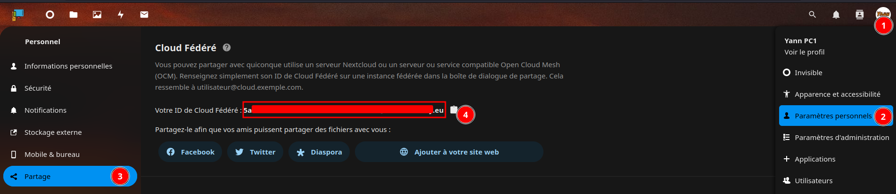  
Du type <5bcd25ef-356abc-a5@cloud.rnmkcy.eu>

<u>carla (compte cloud.xoyize.xyz)</u>  

1. Il faut cliquer sur le symbole de partage en bout de ligne du dossier **Camera**  
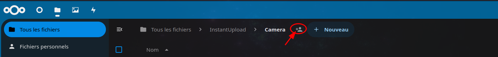  
2. Puis saisir l'identifiant fédération Nextcloud de yann (compte cloud.rnmkcy.eu) <5bcd25ef-356abc-a5@cloud.rnmkcy.eu>  
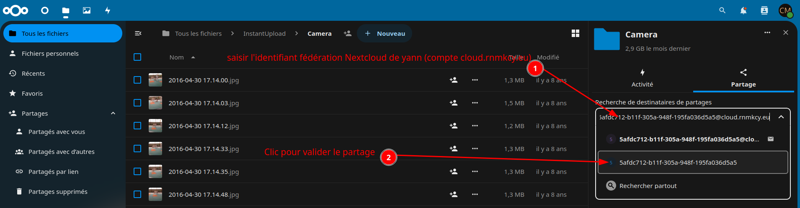  
3. **Autoriser la modification** et **Enregistrer**    
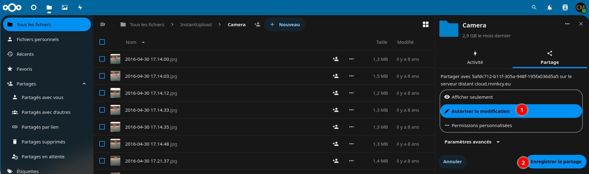  

Le partage est établi avec yann  
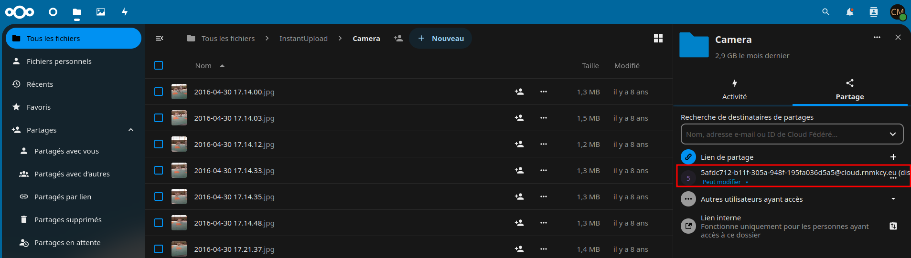  
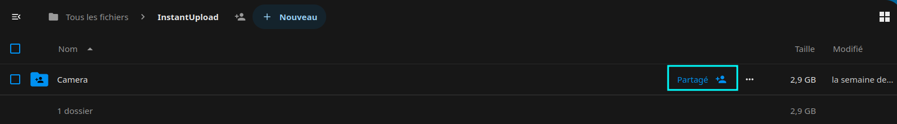  

Vérification sur <u>yann (compte cloud.rnmkcy.eu)</u>  
Il faut aller dans les notifications et accepter le partage  
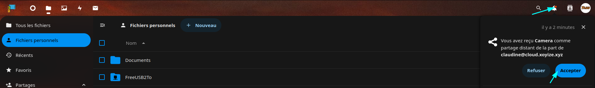  
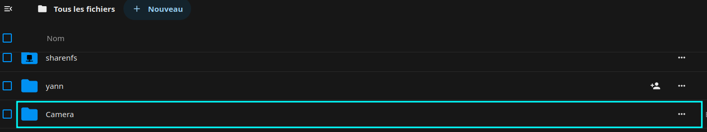  

### Synchroniser deux serveurs Nextcloud 

depuis deux sites différents

La synchronisation de deux serveurs multiples Nextcloud à partir de deux sites différents implique la mise en place d'une fédération de serveur à serveur, qui permet aux deux instances de partager des fichiers, des dossiers et d'autres données. Voici un guide étape par étape sur la façon d'y parvenir :

Conditions requises :

*    Deux instances Nextcloud, chacune installée sur un site différent.
*    URLs accessibles au public pour les deux instances.
*    Connectivité réseau entre les deux sites (accès internet ou connexion directe).

Etapes pour synchroniser deux serveurs Nextcloud :

Activer l'application Federation : Sur les deux instances Nextcloud, s'assurer que l'application "Federation" est activée. Cette application permet aux serveurs de communiquer et de partager des données.

Configurer le serveur de confiance sur la première instance Nextcloud (Site A) :

* Se connecter en tant qu'administrateur.
* Aller dans "Paramètres d'administration" > "Administration" > "Partage".
* Descendez jusqu'à la section "Serveurs de confiance" et cliquez sur "Ajouter un serveur de confiance".
* Entrez l'URL de la deuxième instance Nextcloud (Site B) et générez un jeton.  
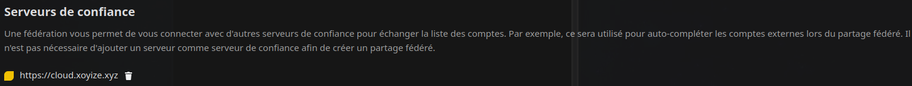

Configurer le serveur de confiance sur la deuxième instance (Site B)

* Se connecter en tant qu'administrateur.
* Aller dans "Paramètres d'administration" > "Administration" > "Partage".
* Descendez jusqu'à la section "Serveurs de confiance" et cliquez sur "Ajouter un serveur de confiance".
* Entrez l'URL de la première instance Nextcloud (Site A)  
* 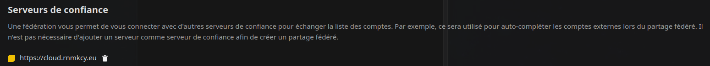

Lancez le partage  
Sur l'une des instances (disons le site A) :

*    Connectez-vous en tant qu'utilisateur.
*    Naviguez jusqu'au fichier ou dossier que vous souhaitez partager avec l'autre instance (Site B).
*    Cliquez sur le bouton "Partager" et entrez l'adresse e-mail d'un utilisateur sur la deuxième instance (Site 

Choisissez les permissions appropriées (lecture seule, lecture/écriture, etc.).

*    Cliquez sur "Partager".

Accepter l'invitation au partage :  
Sur l'autre instance (Site B) :

*    Connectez-vous en tant qu'utilisateur ayant reçu l'invitation de partage.
*    Vous devriez voir une notification ou une invitation de partage entrante. Acceptez le partage.

Synchronisation des données :  
Une fois le partage accepté, les données seront synchronisées entre les deux instances. Les modifications effectuées sur une instance seront répercutées sur l'autre. Notez que la synchronisation peut prendre un certain temps en fonction de la taille des données et de la bande passante disponible sur le réseau.

Surveiller et gérer :  
Vous pouvez surveiller l'état des connexions de serveur à serveur et des fichiers partagés par le biais de l'interface Nextcloud. Toute mise à jour ou modification sera propagée entre les deux instances.

Répéter pour d'autres partages :  
Vous pouvez répéter le processus pour partager d'autres fichiers et dossiers entre les deux instances.

Rappelez-vous que cette configuration nécessite que les deux instances disposent d'une connectivité internet fiable ou d'une connexion réseau dédiée entre les sites. Veillez également à ce que les deux instances soient à jour et correctement sécurisées afin de préserver l'intégrité et la confidentialité des données partagées.

## Nextcloud Authentification 

### Mot de passe d'application

*créer un mot de passe d’application afin de permettre à des applications de se connecter rapidement et de façon sécurisée à votre compte Nextcloud*

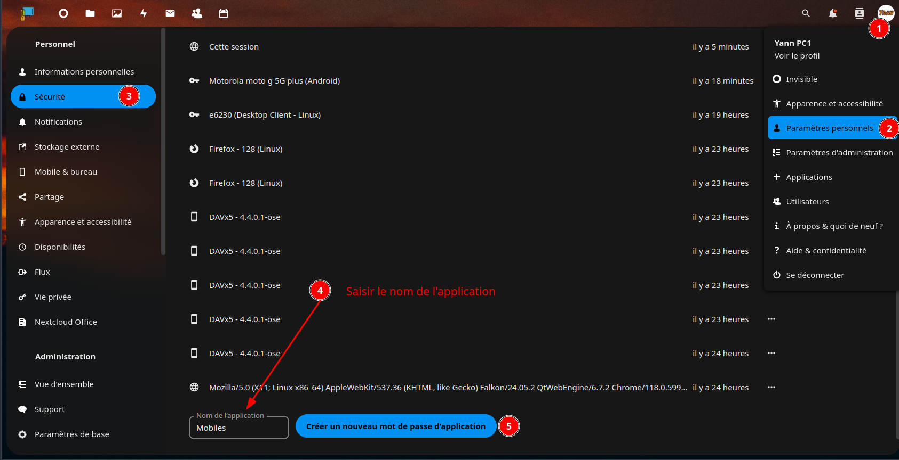  
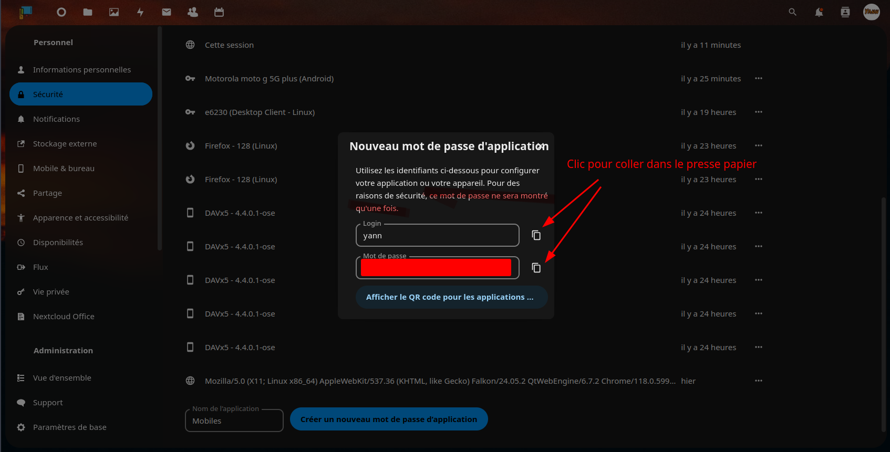  

En cas de problème, vous pouvez notamment en cliquant sur les trois points à côté de votre mot de passe d’application  
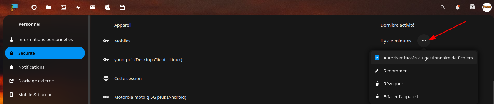  

*  **Effacer l’appareil** commande l’effacement à distance , ce qui ordonne à l’appareil (s’il a été volé par exemple) d’effacer tous les fichiers de votre compte Nextcloud qu’il contient.
*   **Révoquer** le mot de passe, ce qui le désactive et empêche toute connexion ultérieure par ce mot de passe à votre compte Nextcloud, sans aucun impact sur votre mot de passe principal Nextcloud, qui reste sûr.

### Connexion mobile Android à un compte Nextcloud

Créer un mot de passe application, voir ci-dessus. Le mot de passe d'application se nomme "Mobiles"  

Sur votre mobile, installez l’application Nextcloud, disponible sur le [Play Store](https://play.google.com/store/apps/details?id=com.nextcloud.client&gl=US) ou sur [F-Droid](https://f-droid.org/en/packages/com.nextcloud.client/).  
Lancez l’application et cliquez sur Se connecter.  
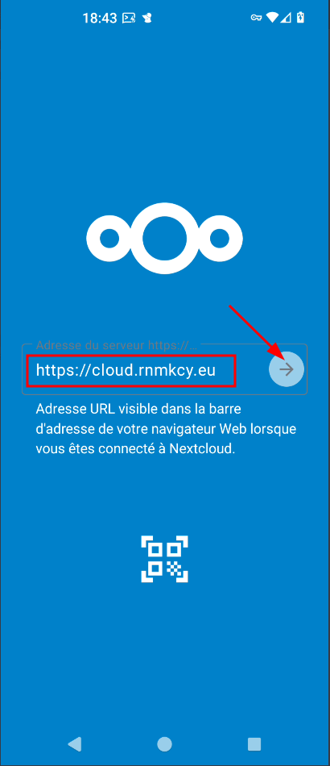{:width="200"}  

L’application lance un navigateur, cliquez sur **Authentification alternative en utilisant un mot de passe d’application.**  
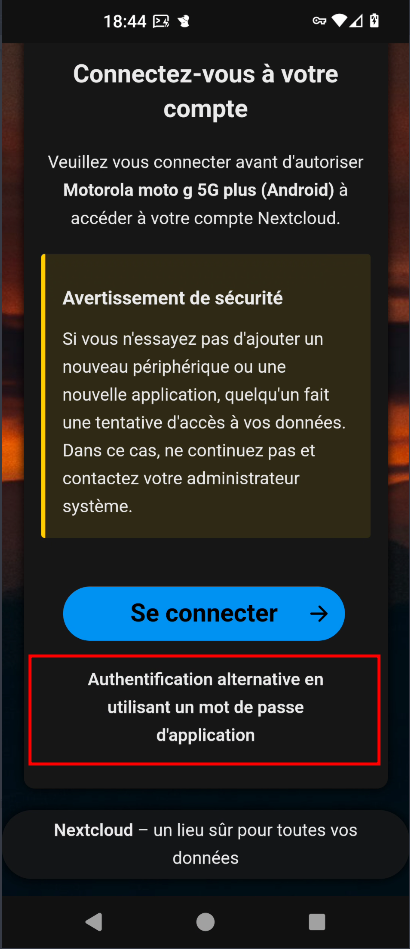{:width="200"} 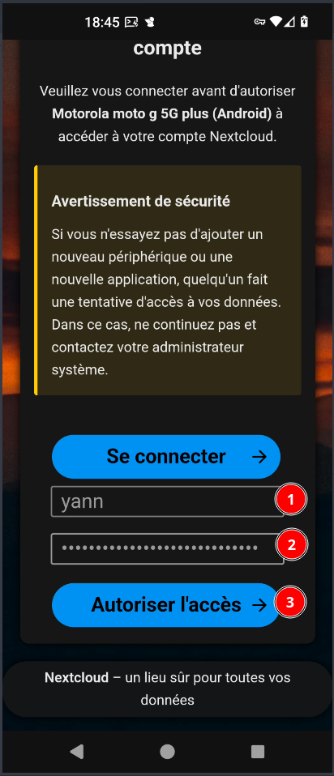{:width="200"}  
Connexion établie  
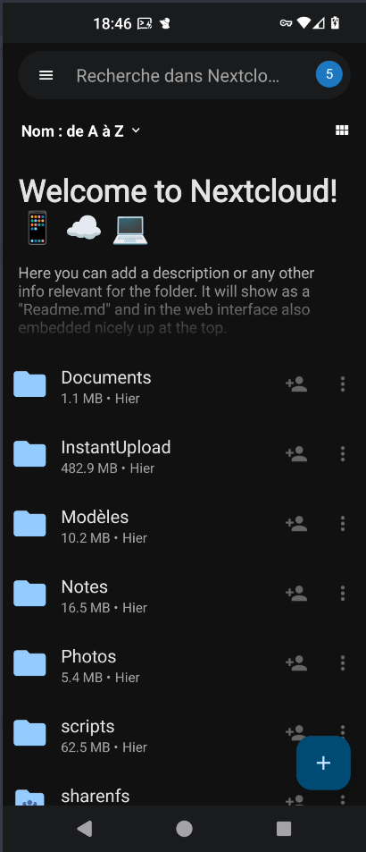{:width="200"}  

### Double facteur - TOTP

Paramètres &rarr; Applications &rarr; Applications mises en avant   
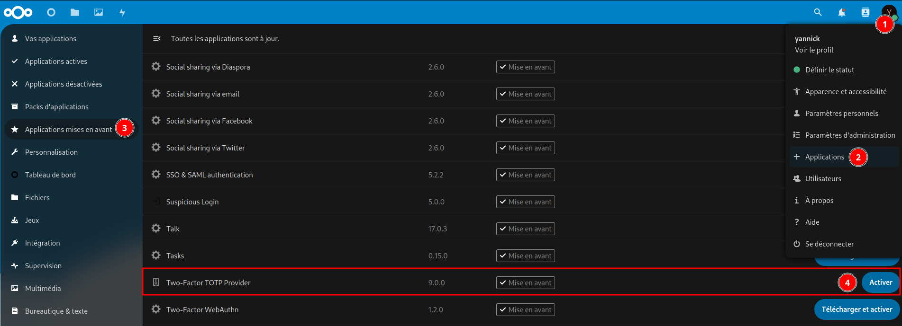  
Activer "Two-Factor TOTP Provider"

Paramètres &rarr; Administration settings &rarr; Sécurité dans la rubrique Administration   
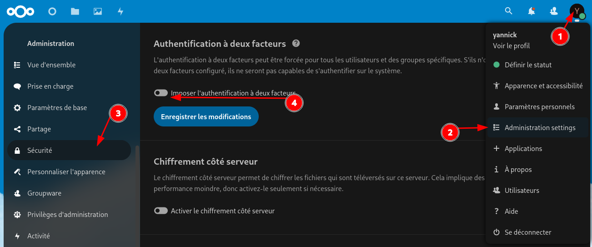   
Puis cliquer sur **Enregistrer les modifications**  

Aller ensuite sur Paramètres personnels &rarr; Sécurité dans la rubrique Personnel
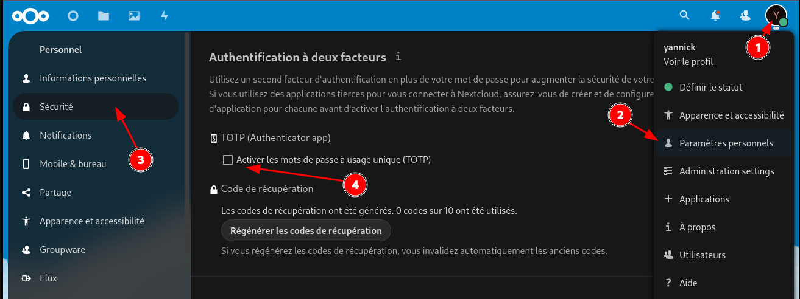   

Après avoir activé authentification TOTP (saisie du mot de passe)  
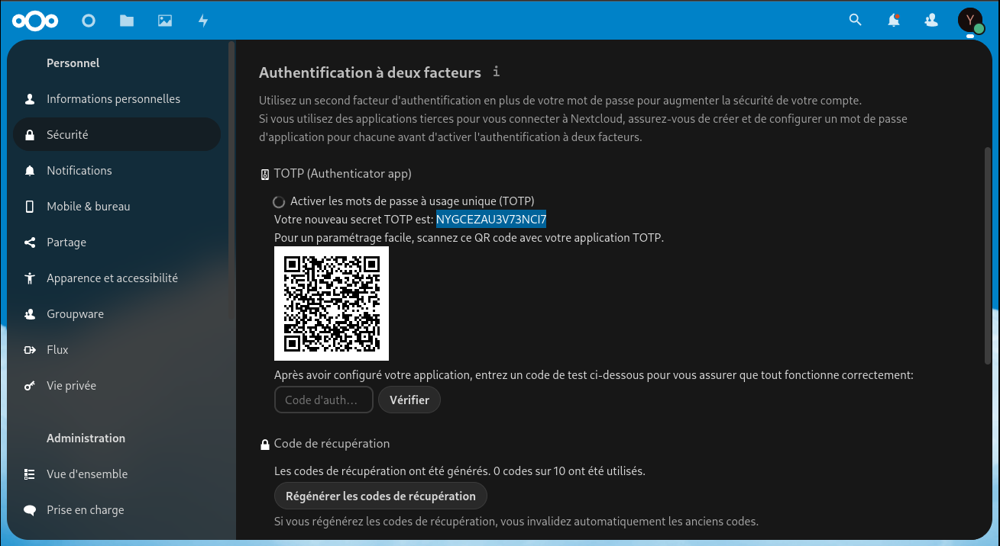   
Enter le **secret TOTP** dans le ou les applications  TOPT   
Saisir le code de vérification générer par votre application et cliquer sur "Vérifier"   
Ensuite cliquer sur "Générer des codes de récupération"  
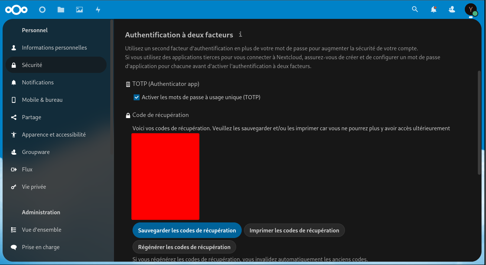   

### Double facteur - Clé de sécurité

*{:width="50" .left}YubiKey 5 Series Une gamme multiprotocole (FIDO2/WebAuthn, U2F, Smart Card, OpenPGP, OTP) qui est le premier choix des entreprises et qui prend en charge la fonction sans mot de passe*

1. La clé "Yubikey 5 NFC" est connectée sur un port USB de l'ordinateur
2. Nextcloud, Paramétrage "Personnel" -> "Sécurité" -> "Authentification à deux facteurs" cliquer sur "Ajouter une clé de sécurité"  
3. Valider la prise en charge 
4. Donner un nom :  
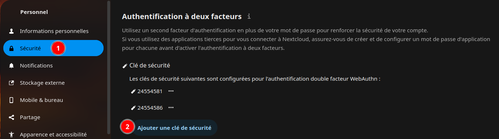  
Faire la même opération avec les autres clés  
Se déconnecter de nextcloud


### Sans mot de passe - WebAuthnn

*{:width="80" .left}YubiKey 5 Series Une gamme multiprotocole (FIDO2/WebAuthn, U2F, Smart Card, OpenPGP, OTP) qui est le premier choix des entreprises et qui prend en charge la fonction sans mot de passe*

> `ATTENTION: Fonctionne uniquement sur les navigateurs Chrome, Firefox et Edge`
{: .prompt-warning }

Paramètres &rarr; Applications &rarr; Applications mises en avant   
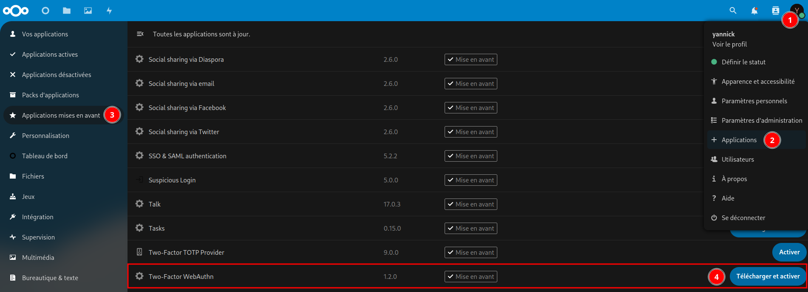  
Télécharger et activer l'application **Two-Factor WebAuthnn**

1. La clé "Yubikey 5 NFC" est connectée sur un port USB de l'ordinateur
2. Nextcloud, Paramétrage "Personnel" -> "Sécurité" -> "Authentification sans mot de passe" cliquer sur "Ajouter un périphérique WebAuthnn"  
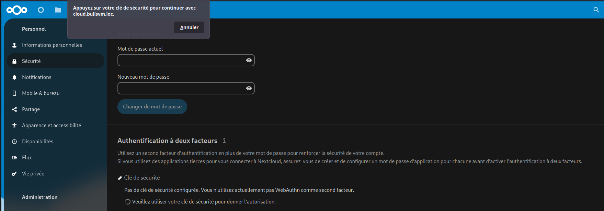  
3. Valider la prise en charge 
4. Donner un nom :  
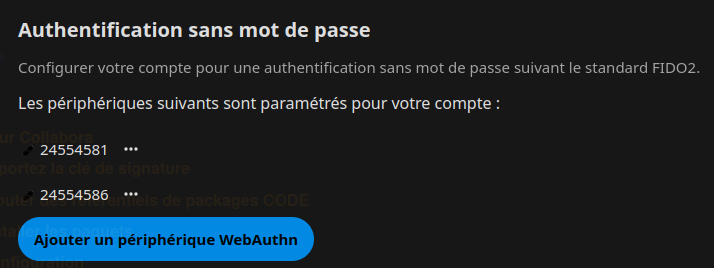  
Faire la même opération avec les autres clés  
Se déconnecter de nextcloud

**Utilisation connexion sans mot de passe**  
Ouvrir Nextcloud  
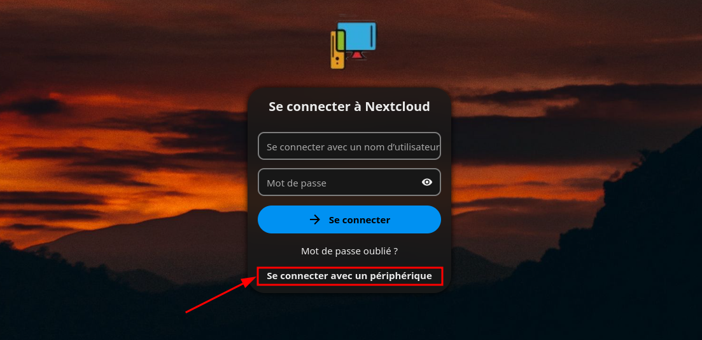   

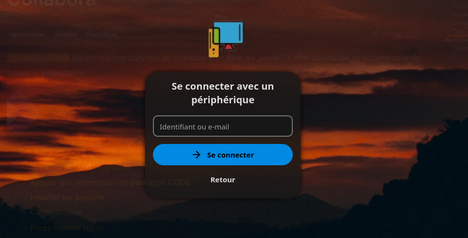  
Saisir le nom utilisateur puis cliquer sur Se connecter  
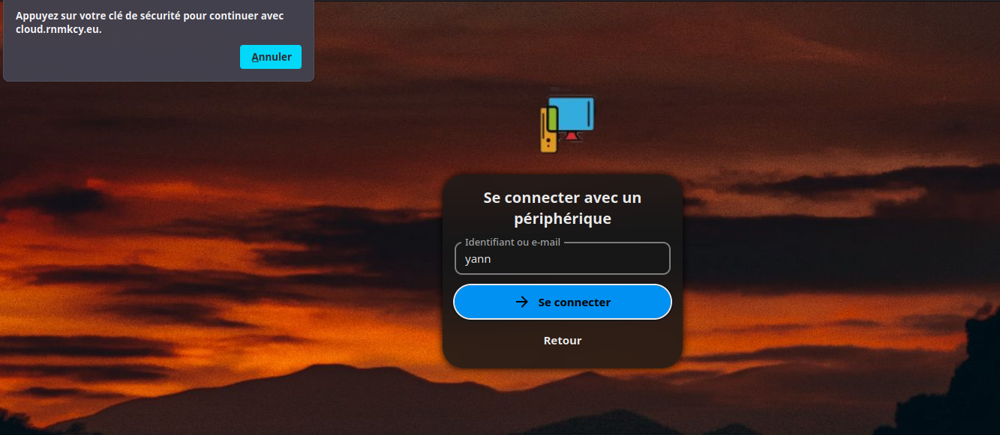  
Ensuite vous aurez le message suivant, cliquer sur "Clé de sécurité"  
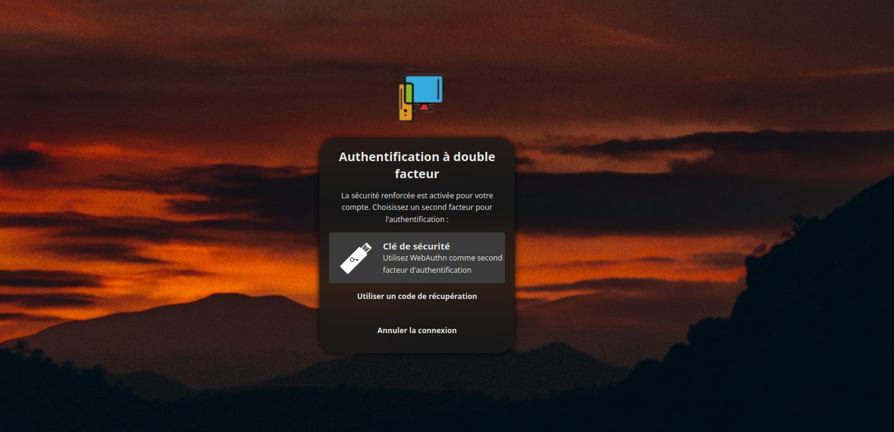  

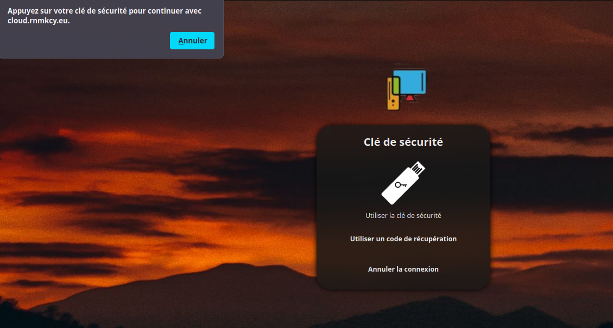  

#### Firefox linux desktop

ouvrir le lien https du cloud  
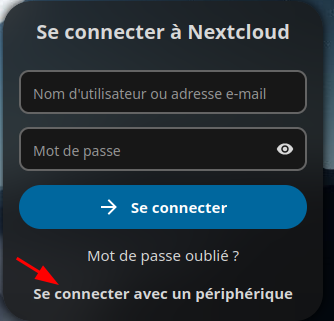  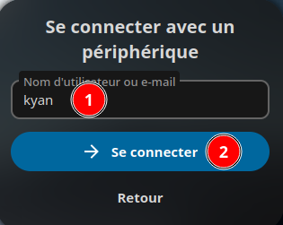  
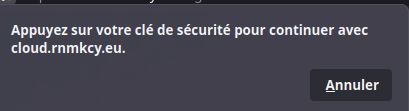  -> 

 

#### Firefox android mobile

*Le fonctionnement de la clé NFC est utilisé*

## Nextcloud Sauvegarde Restauration

### Accès boîte de stockage

Créer un accès à la  boîte de stockage `u326239@u326239.your-storagebox.de` via sftp et un jeu de clé ed25519 

Générer une paire de clé curve25519-sha256 (ECDH avec Curve25519 et SHA2) 

    ssh-keygen -t ed25519 -o -a 100 -f ~/.ssh/bx11-xoyize.net

Ajouter la clé publique `bx11-xoyize.net.pub` au fichier `.ssh/authorized_keys` de la  boîte de stockage

Tester la connexion, créer dossier xoyize.net et sortir

    sftp -P 23 -i ~/.ssh/bx11-xoyize.net u326239@u326239.your-storagebox.de

Première connexion

```
The authenticity of host '[u326239.your-storagebox.de]:23 ([2a01:4f8:261:59d3::2]:23)' can't be established.
ED25519 key fingerprint is SHA256:XqONwb1S0zuj5A1CDxpOSuD2hnAArV1A3wKY7Z3sdgM.
This key is not known by any other names.
Are you sure you want to continue connecting (yes/no/[fingerprint])? yes
Warning: Permanently added '[u326239.your-storagebox.de]:23' (ED25519) to the list of known hosts.
Connected to u326239.your-storagebox.de.
sftp> mkdir backup/xoyize.net
sftp> exit
```

### Sauvegarde nextcloud

En mode su dans le dossier /var/www/nextcloud

    sudo -s
    cd /var/www/nextcloud

[Using the occ command](https://docs.nextcloud.com/server/latest/admin_manual/configuration_server/occ_command/#)

Pour sauvegarder une installation Nextcloud, quatre choses principales 

* Le dossier de configuration
* Le dossier de données **/srv/nextcloud-data/**
* Le dossier thématique
* La base de données

> ATTENTION : Utilisateur **nextcloud** au lieu de **www-data** pour les dossiers  
{: .prompt-warning }

Créer un dossier pour stocker le mot de passe de la base de données

    mkdir -p /home/yani/.local/share/nextcloud
    echo "mot_passe_mysql_nextcloud" > /home/yani/.local/share/nextcloud/dbpassword

**Mode maintenance**  
Le mode maintenance verrouille les sessions des utilisateurs connectés et empêche les nouvelles connexions afin d'éviter les incohérences de vos données. Vous devez exécuter occ comme utilisateur HTTP ou nextcloud

    sudo -u nextcloud php occ maintenance:mode --on

Renvoie **Maintenance mode enabled**

**Sauvegarde dossiers**  
Il suffit de copier vos dossiers de configuration, de données et de thème (ou même votre dossier d'installation et de données de Nextcloud) vers un endroit à l'extérieur de votre environnement Nextcloud 

```
# dossier /var/www/nextcloud
rsync -Aavx --delete --rsync-path='rsync' -e 'ssh -p 23 -i /home/yani/.ssh/bx11-xoyize.net -o StrictHostKeyChecking=no -o UserKnownHostsFile=/dev/null' /var/www/nextcloud u326239@u326239.your-storagebox.de:backup/xoyize.net/nextcloud-dirbkp_`date +"%Y%m%d"`/

# nextcloud data
rsync -Aavx --delete --rsync-path='rsync' -e 'ssh -p 23 -i /home/yani/.ssh/bx11-xoyize.net -o StrictHostKeyChecking=no -o UserKnownHostsFile=/dev/null' /srv/nextcloud-data/ u326239@u326239.your-storagebox.de:backup/xoyize.net/nextcloud-databkp_`date +"%Y%m%d"`/
```

**Sauvegarde base de données MySql**  

Pour un support 4 octets MySQL/MariaDB (Enabling MySQL Support 4 octets, nécessaire pour emoji), vous devrez ajouter `--default-character-set=utf8mb4` 

Syntaxe

    mysqldump --single-transaction --default-character-set=utf8mb4 -h [serveur] -u [nom d'utilisateur] -p[mot de passe] [db_name] > nextcloud-sqlbkp_`date +"%Y%m%d"`.bak

Commande

```
# base mysql
mysqldump --single-transaction --default-character-set=utf8mb4 -h localhost -unextcloud -p`cat /home/yani/.local/share/nextcloud/dbpassword` nextcloud > /home/yani/.local/share/nextcloud/nextcloud-sqlbkp_`date +"%Y%m%d"`.bak

# nextcloud database mariadb
rsync -Aavx --delete --rsync-path='rsync' -e 'ssh -p 23 -i /home/yani/.ssh/bx11-xoyize.net -o StrictHostKeyChecking=no -o UserKnownHostsFile=/dev/null' /home/yani/.local/share/nextcloud/nextcloud-sqlbkp_`date +"%Y%m%d"`.bak u326239@u326239.your-storagebox.de:backup/xoyize.net/nextcloud-databkp_`date +"%Y%m%d"`/
```

### Restauration nextcloud

[Restauration nextcloud](https://docs.nextcloud.com/server/latest/admin_manual/maintenance/restore/)

**Restaurer les dossiers**

Note : Ce guide suppose que votre sauvegarde précédente est appelée "nextcloud-dirbkp"

Il suffit de copier votre dossier de configuration et de données (ou même votre dossier d'installation et de données Nextcloud) dans votre environnement Nextcloud. Vous pouvez utiliser cette commande:

    rsync -Aax nextcloud-dirbkp/ nextcloud/

**Restaurer la base de données** 

Attention  
Avant de restaurer une sauvegarde, vous devez vous assurer de supprimer toutes les tables de base de données existantes.

La manière la plus facile de le faire est de déposer et de recréer la base de données. SQLite le fait automatiquement.

MySQL est le moteur de base de données recommandé. Pour restaurer MySQL:

```
mysql -e "DROP DATABASE nextcloud"
mysql -e "DROP USER 'nextcloud'@'localhost';"
mysql -e "CREATE DATABASE nextcloud"
```

Si vous utilisez UTF8 avec support multioctet (par exemple pour les emojis dans les noms de fichiers), utilisez:

```
mysql -e "DROP DATABASE nextcloud"
mysql -e "CREATE DATABASE nextcloud CHARACTER SET utf8mb4 COLLATE utf8mb4_general_ci"
```

Note Ce guide suppose que votre sauvegarde précédente est appelée «nextcloud-sqlbkp.bak»

MySQL est le moteur de base de données recommandé. Pour restaurer MySQL:

```
mysql -h [serveur] -u [nom d'utilisateur] -p[mot de passe] [db_name]
```

### Synchronisation avec les clients

après la récupération de données

Par défaut, le serveur Nextcloud est considéré comme la source pour les données. Si les données sur le serveur et le client diffèrent, les clients récupèrent par défaut les données sur le serveur.

Si la sauvegarde récupérée est dépassée, l'état des clients peut être plus à jour que l'état du serveur. Dans ce cas également assurez-vous de lancer la commande `maintenance:data-fingerprint` par la suite. Il modifie la logique de l'algorithme de synchronisation pour essayer de récupérer autant de données que possible. Les fichiers manquants sur le serveur sont donc récupérés auprès des clients et en cas de contenu différent les utilisateurs seront demandés.

Note:  
L'utilisation de la maintenance : l'empreinte de données peut provoquer des dialogues de conflit et des difficultés à supprimer des fichiers sur le client. Par conséquent, il est seulement recommandé d'empêcher la perte de données si la sauvegarde a été dépassée.

Si vous exécutez plusieurs serveurs d'applications, vous devrez vous assurer que les fichiers de configuration sont synchronisés entre eux de sorte que l'empreinte de données actualisée est appliquée sur tous les cas.


## Scripts Bash Sauvegarde-Restauration Nextcloud

Scripts Bash pour la sauvegarde/restauration de [Nextcloud](https://nextcloud.com/).

Il est basé sur une installation Nextcloud utilisant nginx et PostgreSQL/MariaDB (voir le tutoriel (allemand) [Nextcloud auf Ubuntu Server 22.04 LTS mit nginx, PostgreSQL/MariaDB, PHP, Let’s Encrypt, Redis und Fail2ban](https://decatec.de/home-server/nextcloud-auf-ubuntu-server-22-04-lts-mit-nginx-postgresql-mariadb-php-lets-encrypt-redis-und-fail2ban/)).  
*Les scripts peuvent également être utilisés lorsqu'Apache est utilisé comme serveur Web.*

### Informations générales

Pour une sauvegarde complète de n'importe quelle instance Nextcloud, vous devrez sauvegarder ces éléments :

*    Le répertoire de fichiers Nextcloud (généralement /var/www/nextcloud )
*    Le répertoire de données de Nextcloud (il est recommandé qu'il ne se trouve pas à la racine Web, donc par exemple /var/nextcloud_data )
*    La base de données Nextcloud
*    Eventuellement un stockage externe local monté dans Nextcloud

Avec ces scripts, tous ces éléments peuvent être inclus dans une sauvegarde.

### Exigences

- *tar*
- *pigz* (https://zlib.net/pigz/) lors de l'utilisation de la compression de sauvegarde. S'il n'est pas déjà installé, il peut être installé avec `apt install pigz` (Debian/Ubuntu).  
S'il n'est pas disponible, vous pouvez utiliser un autre algorithme de compression (par exemple gzip)

### Remarques importantes sur l'utilisation des scripts

- Après avoir cloné ou téléchargé les scripts, ceux-ci doivent être configurés en exécutant le script setup.sh(voir ci-dessous).
- Si vous ne souhaitez pas utiliser l'installation automatisée, vous pouvez également utiliser le fichier `NextcloudBackupRestore.conf.sample` comme point de départ. Assurez-vous simplement de renommer le fichier lorsque vous avez terminé (`cp NextcloudBackupRestore.conf.sample NextcloudBackupRestore.conf`)
- Le fichier de configuration `NextcloudBackupRestore.conf` doit se trouver dans le même répertoire que les scripts de sauvegarde/restauration.
- Les scripts supposent que le <u>répertoire de données de Nextcloud n'est pas un sous-répertoire de l'installation de Nextcloud</u> (répertoire de fichiers). La recommandation générale est que le répertoire de données ne doit pas se trouver quelque part dans le dossier Web de votre serveur Web (généralement */var/www/*), mais dans un dossier différent (par exemple /var/nextcloud_data ). Pour plus d'informations, voir [ici](https://docs.nextcloud.com/server/latest/admin_manual/installation/installation_wizard/#data-directory-location-label).
- Cependant, si votre répertoire de données se trouve sous le répertoire de fichiers Nextcloud, vous devrez modifier la configuration du script (fichier `NextcloudBackupRestore.conf` après exécution  `setup.sh`) afin que le répertoire de données ne fasse pas partie de la sauvegarde/restauration (sinon, il serait copié deux fois)
- Les scripts sauvegardent uniquement le répertoire de données Nextcloud et peuvent sauvegarder un stockage externe local monté dans Nextcloud. Si vous disposez d'un autre stockage externe monté dans Nextcloud (par exemple FTP), ces fichiers doivent être traités séparément.
- Les scripts prennent en charge nginx et Apache comme serveur Web.
- Les scripts prennent en charge MariaDB/MySQL et PostgreSQL comme base de données.
- Vous devriez avoir activé la prise en charge de 4 octets (voir [Nextcloud Administration Manual](https://docs.nextcloud.com/server/latest/admin_manual/configuration_database/mysql_4byte_support/)) sur votre base de données Nextcloud. Sinon, lorsque vous n'avez pas activé le support 4 octets, vous devez éditer le script de restauration, afin que la base de données ne soit pas créée avec le support 4 octets activé (variable `dbNoMultibyte`).
- Les scripts peuvent exclure le répertoire de données Nextcloud de la sauvegarde et de la restauration.
**ATTENTION** : L'exclusion du répertoire de données n'est **PAS RECOMMANDÉE** car cela laisse la sauvegarde dans un état incohérent et peut entraîner une perte de données !

### Installation

1. Clonez le dépôt: `git clone https://codeberg.org/DecaTec/Nextcloud-Backup-Restore.git`
2. Définir les autorisations:
    - `chown -R root Nextcloud-Backup-Restore`
    - `cd Nextcloud-Backup-Restore`
    - `chmod 700 *.sh`
3. Appelez le script (interactif) de configuration automatisée (cela créera un fichier `NextcloudBackupRestore.conf` contenant la configuration souhaitée): `./setup.sh`
4. **Important**: Vérifiez ce fichier de configuration si tout a été configuré correctement (voir TODO dans les commentaires du fichier de configuration)
5. Commencez à utiliser les scripts : voir les sections *Sauvegarde* et *restauration* ci-dessous

Gardez à l'esprit que le fichier de configuration `NextcloudBackupRestore.conf` doit être situé dans le même répertoire que les scripts de sauvegarde/restauration, sinon la configuration ne sera pas trouvée.

Certaines options facultatives ne sont pas configurées à l'aide de `setup.sh`, mais sont définies sur les valeurs par défaut dans `NextcloudBackupRestore.conf`.  Ce sont les options "dangereuses" qui ne doivent généralement pas être modifiées et qui sont marquées comme 'OPTIONAL' dans `NextcloudBackupRestore.conf`

### Sauvegarde

Afin de créer une sauvegarde, appelez simplement le script *NextcloudBackup.sh* sur votre machine Nextcloud. Si ce script est appelé sans paramètre, la sauvegarde est enregistrée dans un répertoire avec l'horodatage actuel dans votre répertoire de sauvegarde principal : à titre d'exemple, ce serait  */media/hdd/nextcloud_backup/20170910_132703*. Le script de sauvegarde peut également être appelé avec un paramètre spécifiant le répertoire de sauvegarde principal, par exemple *./NextcloudBackup.sh /media/hdd/nextcloud_backup*. Dans ce cas, le répertoire spécifié sera utilisé comme répertoire principal de sauvegarde.

Vous pouvez également appeler ce script par cron. Exemple (à 2h du matin tous les soirs, avec sortie de journal) :

`0 2 * * * /path/to/scripts/Nextcloud-Backup-Restore/NextcloudBackup.sh  > /path/to/logs/Nextcloud-Backup-$(date +\%Y\%m\%d\%H\%M\%S).log 2>&1`

### Restauration

Appelez *NextcloudRestore.sh*  afin de restaurer une sauvegarde.  
Lorsque ce script est appelé sans paramètres, il répertorie les sauvegardes disponibles pour la restauration.   
Afin de restaurer une sauvegarde, appelez ce script avec un paramètre précisant le nom (c'est-à-dire l'horodatage) de la sauvegarde à restaurer. Dans cet exemple, ce serait *20170910_132703*. La commande complète pour une restauration serait *./NextcloudRestore.sh 20170910_132703*.
Vous pouvez également spécifier le répertoire de sauvegarde principal avec un deuxième paramètre, par exemple *./NextcloudRestore.sh 20170910_132703 /media/hdd/nextcloud_backup*.

### Mise à jour des scripts

Après avoir mis à jour les scripts vers une version plus récente, il est recommandé d'exécuter (`setup.sh`) à nouveau le script de configuration afin de s'assurer que les dernières modifications sont appliquées au fichier de configuration `NextcloudBackupRestore.conf`. \
Gardez à l’esprit qu’une version déjà existante de `NextcloudBackupRestore.conf` sera écrasée au cours de cette procédure.

Il est également recommandé d'exécuter à nouveau le script de configuration si vous souhaitez modifier certains paramètres de base de sauvegarde/restauration (par exemple activer ou désactiver la compression).

## Authentification double facteur

**Activer application (seul un administrateur est autorisé)**  
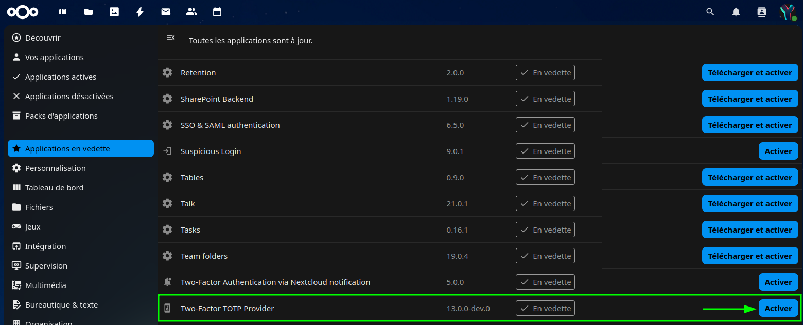


**Les opérations suivantse sont à effectuer sur chaque utilisateur**  
Connexion utlisateur Personnel --> Sécurité  
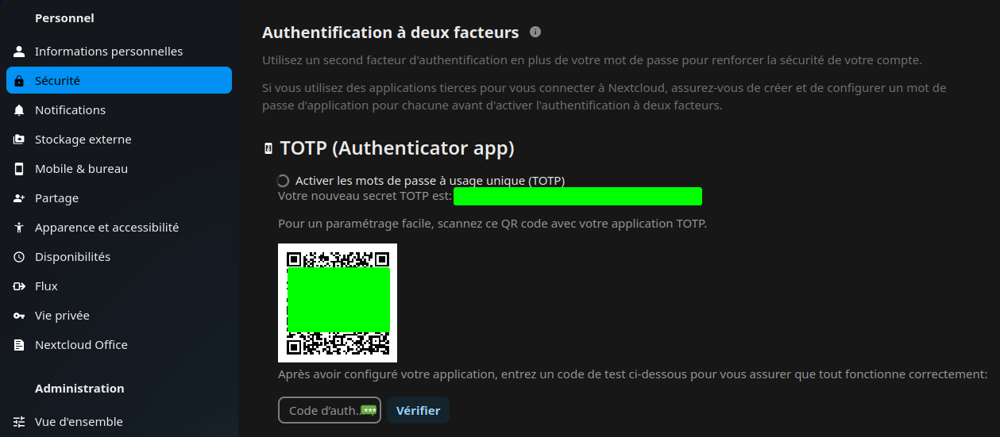  
Il faut rentrer le code secret ou le QR code et vérifier

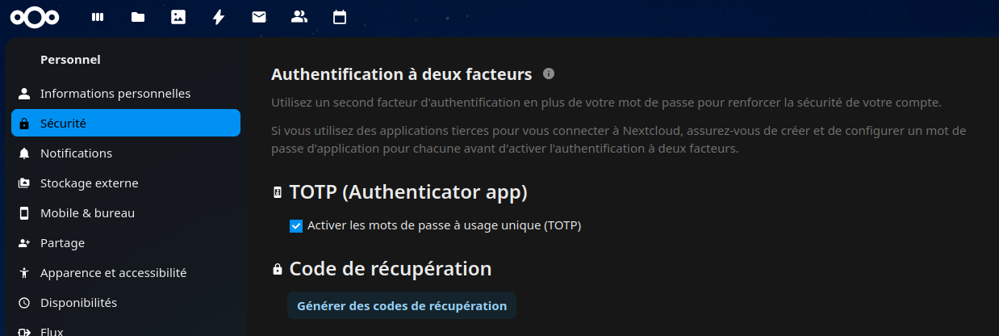  
Générer des codes de récupération

## Maintenance

* [Manuel utilisateur de Nextcloud](https://docs.nextcloud.com/server/latest/user_manual/fr/index.html)
* [Nextcloud Server Administration Guide](https://docs.nextcloud.com/server/latest/admin_manual/)
* [Configuration et administration avec le script OCC](https://www.linuxtricks.fr/wiki/nextcloud-configuration-et-administration-avec-le-script-occ)

### IPV6 mal identifié

> Il y a quelques erreurs concernant votre configuration.
Votre adresse réseau a été identifiée comme « 2a01:e0a:9c8:2080:e4df:3427:584e:b684 » et elle est bridée par le mécanisme anti-intrusion ce qui ralentit la performance de certaines requêtes. Si cette adresse réseau n'est pas la vôtre, cela peut signifier qu'il y a une erreur de configuration d'un proxy.
{: .prompt-danger }

Il faut activer l'application **Brute-force-settings**  
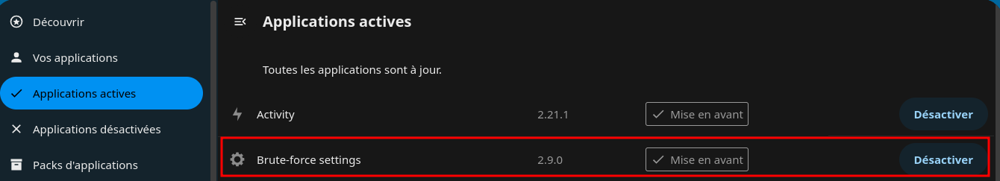   
Puis dans "Paramètres d'administration" , "Sécurité"  
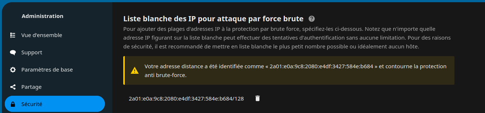   

### Base de données, index manquants

>La base de données a quelques index manquants. L'ajout d'index dans de grandes tables peut prendre un certain temps. Elles ne sont donc pas ajoutées automatiquement. En exécutant "occ db:add-missing-indices", ces index manquants pourront être ajoutés manuellement pendant que l'instance continue de tourner. Une fois les index ajoutés, les requêtes sur ces tables sont généralement beaucoup plus rapides. Index optionnels manquants « mail_messages_strucanalyz_idx » dans la table « mail_messages ». Index optionnels manquants « mail_class_creat_idx » dans la table « mail_classifiers ». Index optionnels manquants « mail_acc_prov_idx » dans la table « mail_accounts ». Index optionnels manquants « mail_alias_accid_idx » dans la table « mail_aliases ».
{: .prompt-warning }

Procédure pour la correction

```bash
sudo -s
cd /var/www/nextcloud
sudo -u nextcloud /usr/bin/php8.2 occ db:add-missing-indices
```

Résultat

```
Adding additional mail_messages_strucanalyz_idx index to the oc_mail_messages table, this can take some time...
oc_mail_messages table updated successfully.
Adding additional mail_class_creat_idx index to the oc_mail_classifiers table, this can take some time...
oc_mail_classifiers table updated successfully.
Adding additional mail_acc_prov_idx index to the oc_mail_accounts table, this can take some time...
oc_mail_accounts table updated successfully.
Adding additional mail_alias_accid_idx index to the oc_mail_aliases table, this can take some time...
oc_mail_aliases table updated successfully.
```

Ouvrir Nextcloud, **Administration &rarr; Vue d'ensemble**  

### Intégrité des fichiers

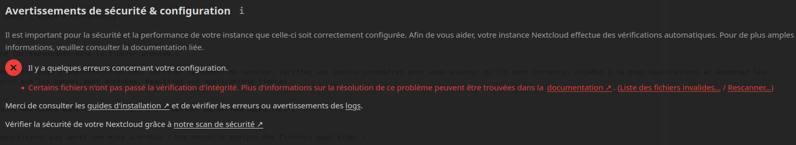  
Liste des fichiers invalides

```
Technical information
=====================
The following list covers which files have failed the integrity check. Please read
the previous linked documentation to learn more about the errors and how to fix
them.

Results
=======
- core
	- EXTRA_FILE
		- nextcloud.log

[...]
```

Supprimer les fichiers nextcloud.log et rescanner

### Fichiers absents après mise à jour

Il arrive parfois que les fichiers n'apparaissent pas après une mise à niveau . Une nouvelle analyse des fichiers peut aider 

```shell
sudo -u www-data php console.php files:scan --all
# si nextcloud propriétaire
sudo -u nextcloud php console.php files:scan --all
```

Parfois, Nextcloud peut rester bloqué lors d'une mise à niveau si le processus de mise à niveau basé sur le Web est utilisé. Cela est généralement dû au fait que le processus prend trop de temps et rencontre un délai d'attente PHP.  

Arrêtez le processus de mise à niveau de cette façon :

    sudo -u www-data php occ maintenance:mode --off

Démarrez ensuite le processus manuel :

    sudo -u www-data php occ upgrade

Si cela ne fonctionne pas correctement, essayez la fonction de réparation :

    sudo -u www-data php occ maintenance:repair

### Entretien de Nextcloud (corbeille, PHP et cache)

En mode sudo : `sudo -s`

**Vider la corbeille**  
Il peut arriver, lorsque la corbeille devient très chargée, qu’il ne soit plus possible de la vider via l’interface graphique. Dans ce cas-ci, il est recommandé d’utiliser la ligne de commande pour effectuer une vidange manuelle. De plus, cette méthode permet d’accomplir le travail pour plusieurs comptes à la fois, ou même pour l’ensemble de l’installation.

Premièrement, on va se positionner dans le répertoire d’installation de Nextcloud, généralement `/var/www/nextcloud` 

    cd /var/www/nextcloud

Si votre installation est native, l’utilisateur sera **www-data**. Si, par contre, vous utilisez Yunohost, votre utilisateur est **nextcloud**, car il crée des utilisateurs pour chaque application.

```bash
nc_user=nextcloud # changer ici au besoin
```

Nous allons exécuter la commande suivante pour nettoyer le système de fichiers et la corbeille

    sudo -u ${nc_user} php occ trashbin:cleanup --all-users

**Limiter la durée de rétention des fichiers**  
On peut limiter la durée de rétention des fichiers. Pour ce faire, il faut modifier le fichier `/var/www/nextcloud/config/config.php`  
À la fin du fichier, après la dernière ligne de paramètres, ajouter la ligne suivante:

```
'trashbin_retention_obligation' => '30, 35',
```

**Maintenance automatique**  
Nextcloud inclus une routine PHP pour effectuer des tâches de maintenance automatique. Nous pouvons augmenter la fréquence d’exécution en ajoutant cette ligne de commande à la table de CRON de l’utilisateur root. Pour modifier, utiliser cette commande:


    sudo crontab -u ${nc_user} -e

Ajouter la ligne suivante:

```
*/15 * * * * php -f /var/www/nextcloud/cron.php
```

**Nettoyer le cache des fichiers**  
Pour nettoyer le cache des fichiers, la commande est similaire à celle utilisée précédemment pour vider la corbeille

```bash
sudo -u ${nc_user} php occ files:scan --all
sudo -u ${nc_user} php occ files:cleanup
```

### Avertissements et Erreurs de mise à jour

**Passage Nextcloud Hub 9 (30.0.0)** septembre 2024

```
    Detected some missing optional indices. Occasionally new indices are added (by Nextcloud or installed applications) to improve database performance. Adding indices can sometimes take awhile and temporarily hurt performance so this is not done automatically during upgrades. Once the indices are added, queries to those tables should be faster. Use the command `occ db:add-missing-indices` to add them. Index manquants : "fs_name_hash" in table "filecache". Pour plus d’information, voir la documentation ↗.

sudo -u nextcloud php occ maintenance:mode --on     # Maintenance mode enabled
sudo -u nextcloud php occ db:add-missing-indices
sudo -u nextcloud php occ maintenance:mode --off     # Maintenance disabled

---
One or more mimetype migrations are available. Occasionally new mimetypes are added to better handle certain file types. Migrating the mimetypes take a long time on larger instances so this is not done automatically during upgrades. Use the command `occ maintenance:repair --include-expensive` to perform the migrations.

sudo -u nextcloud php occ maintenance:repair --include-expensive
```


**BUG** NON RESOLU le 20/09/2024

```
An exception occured while running the setup check: ValueError: The arguments array must contain 3 items, 1 given in /var/www/nextcloud/lib/private/L10N/L10NString.php:68 Stack trace: 
#0 /var/www/nextcloud/lib/private/L10N/L10NString.php(68): vsprintf() 
#1 /var/www/nextcloud/lib/private/L10N/L10N.php(107): OC\L10N\L10NString->__toString() 
#2 /var/www/nextcloud/lib/private/L10N/LazyL10N.php(38): OC\L10N\L10N->n() 
#3 /var/www/nextcloud/apps/user_ldap/lib/SetupChecks/LdapConnection.php(87): OC\L10N\LazyL10N->n() 
#4 /var/www/nextcloud/lib/private/SetupCheck/SetupCheckManager.php(34): OCA\User_LDAP\SetupChecks\LdapConnection->run() 
#5 /var/www/nextcloud/apps/settings/lib/Controller/CheckSetupController.php(147): OC\SetupCheck\SetupCheckManager->runAll() 
#6 /var/www/nextcloud/lib/private/AppFramework/Http/Dispatcher.php(208): OCA\Settings\Controller\CheckSetupController->check() 
#7 /var/www/nextcloud/lib/private/AppFramework/Http/Dispatcher.php(114): OC\AppFramework\Http\Dispatcher->executeController() 
#8 /var/www/nextcloud/lib/private/AppFramework/App.php(161): OC\AppFramework\Http\Dispatcher->dispatch() 
#9 /var/www/nextcloud/lib/private/Route/Router.php(302): OC\AppFramework\App::main() 
#10 /var/www/nextcloud/lib/base.php(1001): OC\Route\Router->match() 
#11 /var/www/nextcloud/index.php(24): OC::handleRequest() 
#12 {main}
```

Le(s) lien(s) 

* [[Bug]: Nextcloud 30 beta 5 shows PHP stacktrace in LDAP config check](https://github.com/nextcloud/server/issues/47144)

**Passage Nextcloud Hub 9 (30.0.2)** novembre 2024

Avertissement sur un problème de cache

> Le module PHP OPcache n'est pas correctement configuré. Le tampon mémoire des chaînes internes OPcache est presque plein. Pour vous assurer que les chaînes répétitives peuvent être mise en cache, il est recommandé de définir la variable "opcache.interned_strings_buffer" de votre fichier de configuration PHP à une valeur supérieure à "16"
{: .prompt-warning }

Correction dans le fichier `/etc/php/8.3/fpm/pool.d/nextcloud.conf`  
`php_value[opcache.interned_strings_buffer]=256`  
Relancer fpm : `sudo systemctl restart php8.3-fpm`


### Upgrade HUB 9 vers HUB 10

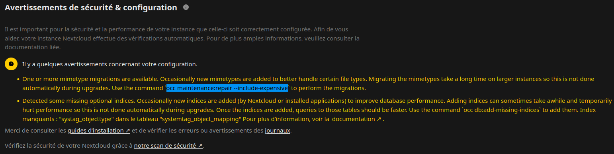

```shell
sudo -s
cd /var/www/nextcloud/
sudo -u nextcloud php occ maintenance:repair --include-expensive
sudo -u nextcloud php occ  db:add-missing-indices
```

Après les opérations de mainenance  
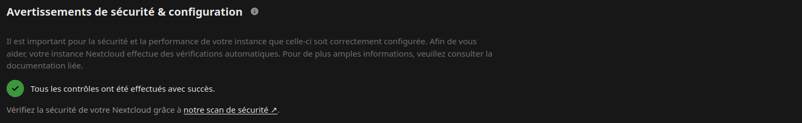

Problème de mémoire
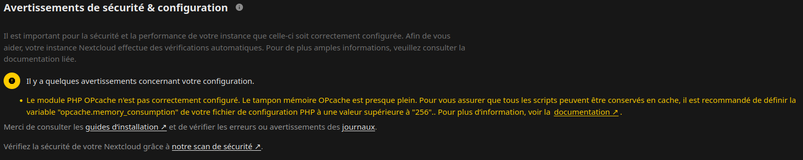

Passer à 512 dans le fichier `/etc/php/8.3/fpm/pool.d/nextcloud.conf`

```
php_value[opcache.memory_consumption]=512
```

Recharger le service php-fpm

```bash
systemctl reload php8.3-fpm
```

## Mise à jour Nextcloud

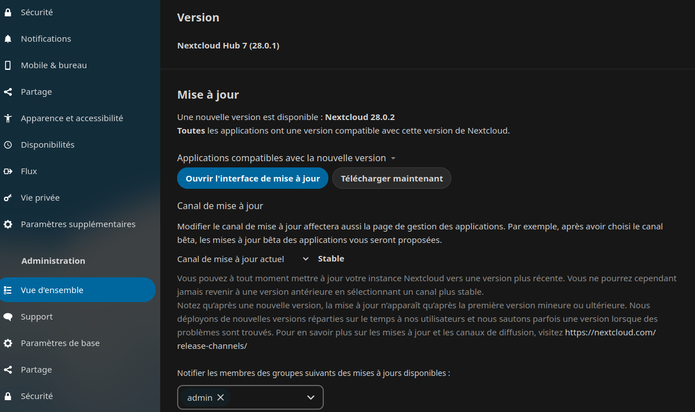{:width="500"}  

### Interface

Cliquer sur **Ouvrir l'interface de mise à jour**  
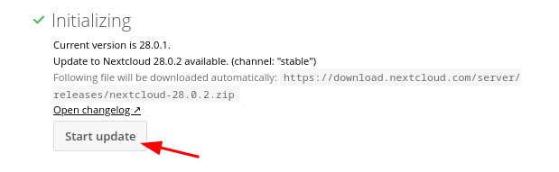{:width="300"}  
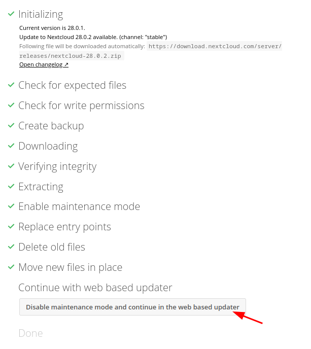{:width="300"}  
Cette dernière action peut occasionner une erreur

**Si aucune erreur**  
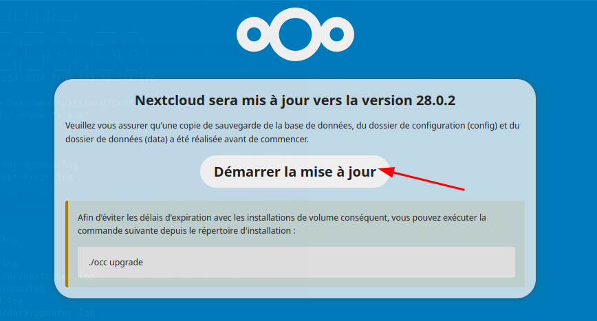{:width="300"}  
Retour sur la page d'accueil à la fin de la mise à jour

**Si erreur**   
Il faut se rendre dans le dossier `/var/www/nextcloud`  
Puis basculer en root : `sudo -s`  
Exécuter la commande : `sudo -u nextcloud php occ upgrade`  
Pour un résultat similaire à ce qui suit  


### Manuellement

> Si vous effectuez une mise à niveau à partir d'une version majeure précédente, veuillez d'abord consulter les [modifications critiques (en)](https://docs.nextcloud.com/server/latest/admin_manual/release_notes/index/#critical-changes)
{: .prompt-warning }

Commencez toujours par effectuer une nouvelle sauvegarde et en désactivant toutes les applications tierces.

1 - Sauvegardez vos fichiers Nextcloud Server existants ,votre base de données, votre répertoire de données et `config.php`. (Voir [Backup](https://docs.nextcloud.com/server/latest/admin_manual/maintenance/backup/) , pour les informations de restauration, voir[ Restoring backup](https://docs.nextcloud.com/server/latest/admin_manual/maintenance/restore/) )

2 - Téléchargez et décompressez la dernière version de Nextcloud Server (fichier d'archive) depuis <https://download.nextcloud.com/server/releases/> dans un répertoire vide en dehors de votre installation actuelle.  
Pour décompresser votre nouvelle archive tar, exécutez : `unzip nextcloud-[version].zip` ou `tar -xjf nextcloud-[version].tar.bz2`

```shell
mkdir -p ~/temp
cd ~/temp
wget https://download.nextcloud.com/server/releases/latest-28.tar.bz2
tar -xjf latest-28.tar.bz2
```

3 - Arrêtez votre serveur Web.  

    sudo systemctl stop nginx

4 - Si vous exécutez une tâche cron pour la gestion interne de nextcloud, désactivez-la en commentant l'entrée dans le fichier crontab.(Le proriétaire du dossier est www-data ou nextcloud (`ls -la /var/www`)

```shell
#sudo crontab -u www-data -e
sudo crontab -u nextcloud -e
# commenter
#*/5  *  *  *  * php -f /var/www/nextcloud/cron.php
```

(Mettez un # au début de la ligne correspondante.)


5 - Renommez votre répertoire Nextcloud actuel, par exemple nextcloud-old.

    sudo mv /var/www/nextcloud /var/www/nextcloud-old

6 - La décompression de la nouvelle archive crée un nouveau répertoire  nextcloud rempli avec vos nouveaux fichiers serveur. Déplacez ce répertoire et son contenu vers l'emplacement d'origine de votre ancien serveur. Par exemple `/var/www/`, pour qu'une fois de plus vous ayez `/var/www/nextcloud` 

```shell
sudo mv ~/temp/nextcloud /var/www/
```

7 - Copiez le config/config.phpfichier de votre ancien répertoire Nextcloud vers votre nouveau répertoire Nextcloud.

    sudo cp /var/www/nextcloud-old/config/config.php /var/www/nextcloud/config/

8 - Si vous conservez votre data/répertoire dans votre nextcloud/répertoire, copiez-le de votre ancienne version de Nextcloud vers votre nouveau nextcloud/. Si vous le conservez à l'extérieur nextcloud/, vous n'avez rien à faire avec, car son emplacement est configuré dans votre fichier d'origine config.phpet aucune des étapes de mise à niveau ne le touche.

9 - Si vous utilisez une application tierce, il se peut qu'elle ne soit pas toujours disponible dans votre instance Nextcloud mise à niveau/nouvelle. Pour vérifier cela, comparez une liste des applications du nouveau nextcloud/apps/dossier à une liste des applications de votre dossier sauvegardé/ancien nextcloud/apps/. Si vous trouvez des applications tierces dans l'ancien dossier qui doivent se trouver dans l'instance nouvelle/mise à niveau, copiez-les simplement et assurez-vous que les autorisations sont configurées comme indiqué ci-dessous.

10 - Si vous avez des dossiers d'applications supplémentaires comme par exemple nextcloud/apps-extras ou nextcloud/apps-external, assurez-vous de les transférer/conserver également dans le dossier mis à niveau.

11 - Si vous utilisez un thème tiers, assurez-vous de le copier de votre themes/répertoire vers votre nouveau. Il est possible que vous deviez y apporter quelques modifications après la mise à niveau.

12 - Ajustez la propriété et les autorisations des fichiers :

```shell
# en mode su
sudo -s
# si propriétaire www-data
chown www-data:www-data -R /var/www/nextcloud
# si propriétaire nextcloud
chown nextcloud:www-data -R /var/www/nextcloud
find /var/www/nextcloud/ -type d -exec chmod 750 {} \;
find /var/www/nextcloud/ -type f -exec chmod 640 {} \;
```

13 - Redémarrez votre serveur Web.

    sudo systemctl start nginx

14 - Lancez maintenant la mise à niveau depuis la ligne de commande en utilisant occ

```shell
sudo -s
cd /var/www/nextcloud
# si propriétaire www-data
sudo -u www-data php occ upgrade
# si propriétaire nextcloud
sudo -u nextcloud php occ upgrade
```

(!) cela DOIT être exécuté à partir de votre répertoire d'installation nextcloud

15 - L'opération de mise à niveau prend de quelques minutes à quelques heures, selon la taille de votre installation. Une fois l'opération terminée, vous verrez un message de réussite ou un message d'erreur qui vous indiquera où l'erreur s'est produite.

16 - Réactivez la tâche cron nextcloud. (Voir l'étape 4 ci-dessus.)

```
# si propriétaire www-data
sudo crontab -u www-data -e
# si propriétaire nextcloud
sudo crontab -u nextcloud -e
```

(Supprimez le # au début de la ligne correspondante dans le fichier crontab.)

**Connectez-vous**

* jetez un œil au bas de votre page d’administration pour vérifier le numéro de version. 
* Vérifiez vos autres paramètres pour vous assurer qu'ils sont corrects. 
* Accédez à la page Applications et examinez les applications principales pour vous assurer que les bonnes sont activées. 
* Réactivez vos applications tierces.
