+++
title = 'PC1 KVM (vm-arch) Archlinux chiffrée LVM/LUKS (XFCE/KDE/GNOME)'
date = 2025-03-10 00:00:00 +0100
categories = ['virtuel']
+++
[Installation guide (Français)](https://wiki.archlinux.org/title/Installation_guide_(Fran%C3%A7ais))

## Archlinux

### Prérequis 

Installer virt-viewer

    yay -S virt-viewer

### ISO archlinux

*L'image peut être gravée sur un DVD, montée comme un fichier ISO, ou écrite directement sur une clé USB. Elle est destinée aux nouvelles installations uniquement ; un système Arch Linux existant peut toujours être mis à jour avec pacman -Syu*

Les images pour l'installation d'Arch peuvent être téléchargées via BitTorrent ou ici même dans votre navigateur depuis l'un des miroirs Arch HTTP(S) (<https://archlinux.org/download/>)

### Créer machine virtuelle avec image ISO

Vérifier si "archlinux" présent dans la liste  
`sudo virt-install --osinfo list |grep archlinux` --> archlinux

Installer en utilisant une image iso 

```bash
sudo virt-install \
--osinfo archlinux \
--name vm-arch \
--memory 4096 \
--vcpus 2 \
--cpu host \
--hvm \
--disk path=/virtuel/KVM/vm-arch.qcow2,format=qcow2,size=40 \
--cdrom /home/yann/FreeUSB2To/iso/archlinux-2024.12.01-x86_64.iso \
--network bridge=bridge0 \
--boot uefi \
--graphics vnc  
```

ATTENTION!!! L'activation du paramètre ``--boot uefi` peut générer une erreur  
`ERROR    erreur interne : Impossible d'exécuter '/usr/bin/swtpm_setup'`  
le contenu du fichier /etc/libvirt/qemu.conf relatif à swtpm, remplacer

```text
swtpm_user = "swtpm"  
swtpm_group = "swtpm"  
```
 par

```text
swtpm_user = "root"  
swtpm_group = "root"  
```

Reedémarrer le service

    sudo systemctl restart libvirtd.service

Après exécution dans un terminal de la commande `virt-install` et suivant le boot direct ou uefi

on arrive sur l’écran suivant en mode **boot direct**  
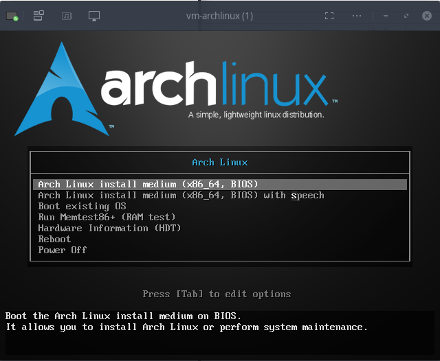{:width="350"}  

On arrive sur le terminal  en mode **boot uefi**  
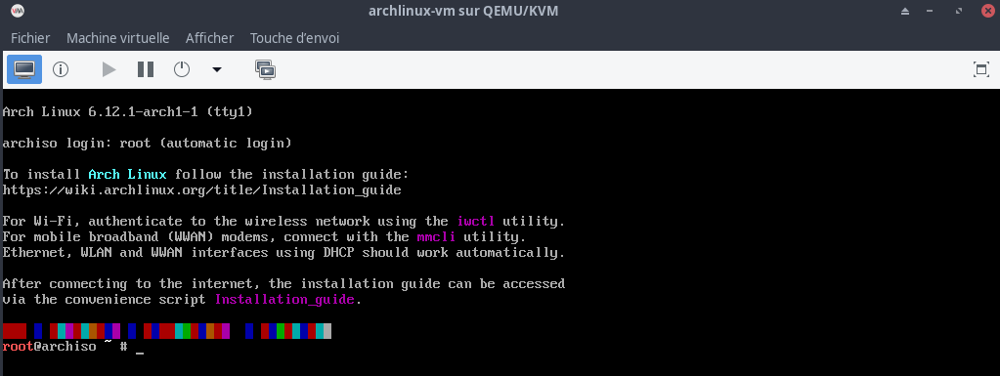{:width="600"}  

Clavier en français

```bash
loadkeys fr # en est en qwerty , il faut saisir 'loqdkeys'
```

Valider SSH pour la suite de l’installation:

1. Modifier le mot de passe root : `passwd` --> rtyuiop
2. Relever l’adresse IP : `ip addr` --> 192.168.10.122
3. Lancer sshd : `systemctl start sshd`
4. Depuis un poste distant : `ssh root@adresseIP` --> `ssh root@192.168.10.122`

### Partitionnement

Obtenir le nom du disque 

```shell
lsblk
```

On a une réponse de du type `/dev/vda`

Effacer le disque à l'aide de l'outil shred ou sgdisk

```shell
shred -v -n1 /dev/vda
# plus rapide
sgdisk --zap-all /dev/vda
```

Partitionner le disque de 40G en utilisant `gdisk` 

```shell
gdisk /dev/vda
```

* La partition 1 doit être une partition de démarrage EFI (code: ef00) de 512 Mo. 
* La partition 2 devrait être une partition Linux LVM (8e00). 

La 2ème partition peut prendre le disque complet ou seulement une partie. N'oubliez pas d'écrire les modifications de la table de partition sur le disque à la fin de la configuration.

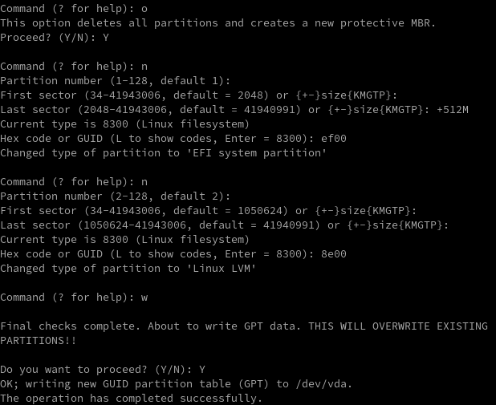

Une fois partitionné vous pouvez formater la partition de démarrage (la partition LVM doit être chiffrée avant qu'elle ne soit formatée)

```shell
mkfs.fat -F32 /dev/vda1
```

Vérification  
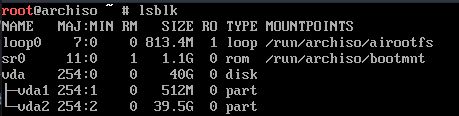

### Chiffrement

Premièrement lancer modprobe pour `dm-crypt`

```shell
modprobe dm-crypt
```

Chiffrer le disque

```shell
cryptsetup luksFormat /dev/vda2 
# saisie d'un mot de passe
SaouleTalonCognac
```

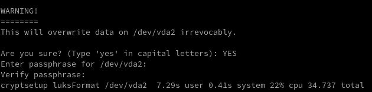

Ouvrez le disque avec le mot de passe défini ci-dessus

```shell
cryptsetup open --type luks /dev/vda2 cryptlvm # saisie du mot de passe
```

Vérifiez que le disque lvm existe 

```shell
ls /dev/mapper/cryptlvm
```

Créer un volume physique

```shell
pvcreate /dev/mapper/cryptlvm  # Physical volume "/dev/mapper/cryptlvm" successfully created.
```

Créer un groupe de volume nommé vg0

```shell
vgcreate vg0 /dev/mapper/cryptlvm # Volume group "vg0" successfully created
```

Créer des partitions logiques

```shell
lvcreate -L4G vg0 -n swap # Logical volume "swap" created.
lvcreate -L18G vg0 -n root # Logical volume "root" created.
lvcreate -l 100%FREE vg0 -n home # Logical volume "home" created.
```

Formater le système de fichiers sur les partitions logiques

```shell
mkfs.ext4 /dev/vg0/root
mkfs.ext4 /dev/vg0/home
mkswap /dev/vg0/swap
```

Monter les volumes et les systèmes de fichiers

```shell
mount /dev/vg0/root /mnt
mkdir -p /mnt/home
mkdir -p /mnt/boot
mount /dev/vg0/home /mnt/home
mount /dev/vda1 /mnt/boot
swapon /dev/vg0/swap
```

### Installation des paquets essentiels

Installer le paquet de base, linux, firmware, lvm2, utilitaires 

```shell
pacstrap /mnt base base-devel linux linux-firmware lvm2 nano 
```
### Fstab

Générer `fstab` 

```shell
genfstab -U /mnt >> /mnt/etc/fstab
```

### Chroot

`chroot` dans le nouveausystème

```shell
arch-chroot /mnt
```

Le passage en chroot est caractérisé par le nouveau prompt  
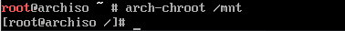

### Heure

Définir l'heure locale (choisir une localité pertinente)

```shell
ln -sf /usr/share/zoneinfo/Europe/Paris /etc/localtime
```

Réglez l'horloge

```shell
hwclock --systohc
```

### Locales  

Décommenter `fr_US.UTF-8 UTF-8` ou toutes les localisations dont vous avez besoin dans `/etc/locale.gen`  
Puis exécuter

```shell
locale-gen
```

Créer le fichier `/etc/locale.conf` et définir la variable LANG correspondante 

```shell
echo "LANG=fr_FR.UTF-8" > /etc/locale.conf
```

*Une keymap persistante peut être définie dans `/etc/vconsole.conf`, qui est lu par systemd au démarrage. La variable KEYMAP est utilisée pour spécifier la keymap.  
 XkbLayout sélectionne la disposition du clavier. Plusieurs dispositions peuvent être spécifiées dans une liste séparée par des virgules*

```shell
echo "KEYMAP=fr
XKBLAYOUT=fr
" > /etc/vconsole.conf
```

### Configuration réseau

Créer le fichier hostname (tout nom d'hôte de votre choix comme une ligne dans le fichier. Par exemple, «archyan») 

```shell
echo "archyan" > /etc/hostname
```

Terminez la configuration du réseau pour le nouvel environnement installé. Cela peut inclure l'installation d'un logiciel de gestion de réseau approprié **NetworkManager**, sa configuration si nécessaire et l'activation de son unité systemd pour son lancement au démarrage de la machine.  

```shell
# Installer NetworkManager
pacman -Syu networkmanager
# Activer NetworkManager
systemctl enable NetworkManager
```

### Initramfs

Parce que notre système de fichiers est sur LVM et chiffré, nous devrons activer les corrects  "hooks" **mkinitcpio**.  
Modifier le `/etc/mkinitcpio.conf`.  

* Remplacer **udev** --> **systemd**
* Remplacer **consolefont** --> **sd-vconsole**
* Ajouter après **block**, **sd-encrypt** et **lvm2**

```text
HOOKS=(base systemd autodetect microcode modconf kms keyboard keymap sd-vconsole block sd-encrypt lvm2 filesystems fsck)
```

Régénérer initramfs 

```shell
mkinitcpio -p linux
```

### Mot de passe administrateur

Mot de passe root (rtyuiop)

```shell
passwd 
```

### Chargeur de démarrage systemd-boot

#### bootctl

En éxécutant bootctl install, systemd-boot essaiera de localiser `ESP` à **/efi**, **/boot**, et **/boot/efi**. Pour définir  **esp** vers un endroit différent, il est requis de rajouter l'option `--esp-path=esp` [(systemd-boot)](https://wiki.archlinux.org/title/Systemd-boot_(Fran%C3%A7ais))  
Installer `systemd-boot` écrira par dessus n'importe quel esp/EFI/BOOT/BOOTX64.EFI (ou esp/EFI/BOOT/BOOTIA32.EFI pour l'UEFI IA32) existant, ex. la version Microsoft du fichier.

Installer un chargeur de démarrage (bootloader)

```shell
bootctl --path=/boot/ install
```

Créer un chargeur de démarrage. Modifier `/boot/loader/loader.conf`.  
Remplacer le contenu du fichier par :

```text
echo "default arch.conf
timeout 3
editor 0
" > /boot/loader/loader.conf
```

`edito 0` garantit que la configuration ne peut pas être modifiée au démarrage.

Afin d'obtenir l'UUID de la partition chiffrée "/dev/vda2", exécuter la commande suivante 

```shell
blkid |grep "/dev/vda2"
# /dev/vda2: UUID="16035587-0b5d-400e-85c3-2d1ac19a6309"
```

Créer une entrée bootloader dans `/boot/loader/entries/arch.conf`

```text
title Arch Linux
linux /vmlinuz-linux
initrd /initramfs-linux.img
options rd.luks.name={UUID}=cryptlvm root=/dev/volume/root rw
```

* Remplacer `{UUID}` par `16035587-0b5d-400e-85c3-2d1ac19a6309`  
* Remplacer `/dev/volume/root` par le volume logique root LVM  `/dev/vg0/root`

Le fichier final `/boot/loader/entries/arch.conf`

```text
echo "title Arch Linux
linux /vmlinuz-linux
initrd /initramfs-linux.img
options rd.luks.name=16035587-0b5d-400e-85c3-2d1ac19a6309=cryptlvm root=/dev/vg0/root rw
" > /boot/loader/entries/arch.conf
```

Le fallback `/boot/loader/entries/arch-fallback.conf`

```text
echo "title Arch Linux (fallback initramfs)
linux /vmlinuz-linux
initrd /initramfs-linux-fallback.img
options rd.luks.name=16035587-0b5d-400e-85c3-2d1ac19a6309=cryptlvm root=/dev/vg0/root rw
" > /boot/loader/entries/arch-fallback.conf
```

Résumé `bootctl`

```
System:
Not booted with EFI

Available Boot Loaders on ESP:
          ESP: /boot
         File: ├─/EFI/systemd/systemd-bootx64.efi (systemd-boot 257.3-1-arch)
               └─/EFI/BOOT/BOOTX64.EFI (systemd-boot 257.3-1-arch)

Boot Loader Entries:
        $BOOT: /boot
        token: arch

Default Boot Loader Entry:
         type: Boot Loader Specification Type #1 (.conf)
        title: Arch Linux
           id: arch.conf
       source: /boot//loader/entries/arch.conf (on the EFI System Partition)
        linux: /boot//vmlinuz-linux
       initrd: /boot//initramfs-linux.img
      options: rd.luks.name=16035587-0b5d-400e-85c3-2d1ac19a6309=cryptlvm root=/dev/vg0/root rw
```

### Paquets supplémentaires

Avant de terminer les étapes d'installation, vous pouvez installer des paquets supplémentaires pour la gestion utilisateur et réseau (ceux-ci sont inclus dans l'installateur mais ne sont normalement pas inclus dans l'installation elle-même)  

```shell
pacman -Syu sudo iw iwd openssh git
```

Activer ssh

```shell
systemctl enable sshd
```

### Utilisateur

Créer un utilisateur

```shell
useradd -m archie
passwd archie # archie49
echo "archie     ALL=(ALL) NOPASSWD: ALL" >> /etc/sudoers.d/10-archie
```

### Sortie chroot et redémarrage

Sortie `chroot` par exit ou ou par le raccourci Ctrl+D

```shell
exit
```

Démonter manuellement toutes les partitions

```shell
umount -R /mnt
```

Redémarrage, toutes les partitions encore montées seront automatiquement démontées par systemd. N'oubliez pas de retirer le support d'installation et vous pourrez vous connecter au nouveau système avec le compte root ou utilisateur

```shell
reboot
```

### Connexion utilisateur

Se connecter utilisateur "archie"  

Relever adresse , `ip a` --> 192.168.10.194

Se connecter ssh

    ssh archie@192.168.10.194

### Hooks - Mise à jour auto gestionnaire amorçe UEFI

*Lorsqu'il y a une nouvelle version de systemd-boot, le gestionnaire d'amorçe UEFI peut optionellement être réinstallé par l'utilisateur. Ceci peut être fait manuellement ou automatiquement*

Créer le dossier hooks

    sudo mkdir -p /etc/pacman.d/hooks

Créer le fichier suivant `/etc/pacman.d/hooks/95-systemd-boot.hook`

```
[Trigger]
Type = Package
Operation = Upgrade
Target = systemd

[Action]
Description = Mise à jour systemd-boot...
When = PostTransaction
Exec = /usr/bin/systemctl restart systemd-boot-update.service
```

### Installer yay

Installer yay

```shell
git clone https://aur.archlinux.org/yay.git
cd yay
makepkg -si
```

Effacer dossier

    sudo rm -r $HOME/yay

### Configurer Wayland 

*Wayland est un protocole moderne et efficace pour l'affichage d'applications graphiques sous Linux. Il offre plusieurs avantages par rapport à l'ancien serveur d'affichage X.Org, comme une sécurité, une stabilité et des performances graphiques améliorées.*

[Guide to Set up Full Wayland with Arch Linux](https://www.debugpoint.com/wayland-arch-linux/)

Idéalement, vous devriez déjà avoir installé le package de base wayland . Ouvrez un terminal et s'il n'est pas installé

    sudo pacman -S --needed wayland

## Bureau XFCE

*XFCE est un environnement de bureau léger et hautement personnalisable pour la plate-forme Linux.*

Installer gestionnaire d'affichage GDM  qui a le support complet de Wayland dans Arch Linux.  

    yay -S --needed gdm

Une fois installé, utilisez la commande ci-dessous pour installer quelques paquets Wayland.

* xorg-xwayland: Pour exécuter xclients sous Wayland
* xorg-xlsclients: Liste des applications client fonctionnant sur un écran (facultatif)
* glfw-wayland: Packages GUI app dev pour Wayland

    yay -S --needed xorg-xwayland xorg-xlsclients glfw-wayland

**Installer le bureau XFCE**  
Avec la fenêtre du terminal ouverte, utilisez la commande pacman ou yay pour installer le package «xfce4». Veillez également à installer le package «xfce4-goodies» pour les bonus supplémentaires avec votre bureau.

    yay -S xfce4 xfce4-goodies

Installer Firefox fr pour tester Wayland  

    yay -S --needed firefox-i18n-fr

Activer le gestionnaire d'affichage  

```shell
sudo systemctl enable gdm
```

Une fois terminé, enregistrez et fermez le fichier. Et redémarre.

    sudo reboot

On arrive sur la page de connexion  
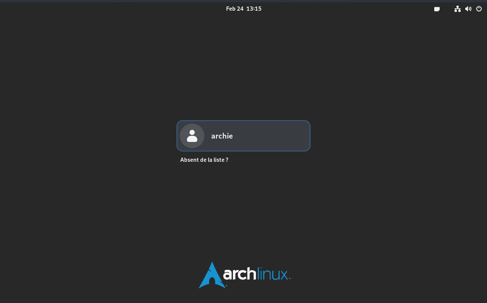{:width="600"}

## Bureau GNOME

Le gestionnaire d'affichage GDM a le support complet de Wayland dans Arch Linux.  
D'abord, installez-le en utilisant la commande ci-dessous :

    pacman -S --needed gdm

Une fois installé, utilisez la commande ci-dessous pour installer quelques paquets Wayland.

* xorg-xwayland: Pour exécuter xclients sous Wayland
* xorg-xlsclients: Liste des applications client fonctionnant sur un écran (facultatif)
* glfw-wayland: Packages GUI app dev pour Wayland

    sudo pacman -S --needed xorg-xwayland xorg-xlsclients glfw-wayland

Ensuite, installez le gnome et les applications associées avec les sessions Wayland en utilisant l'ensemble de commandes ci-dessous.   

```shell
sudo pacman -S --needed gnome gnome-tweaks gnome-nettool gnome-usage gnome-multi-writer adwaita-icon-theme xdg-user-dirs-gtk fwupd arc-gtk-theme
```

Laissez installer Firefox afin que vous puissiez tester Wayland fonctionne correctement avec GNOME.

    sudo pacman -S --needed firefox

Une fois terminé, activez le gestionnaire d'affichage et le service NetworkManager.

```shell
sudo systemctl disable sddm
sudo systemctl enable gdm
sudo systemctl enable NetworkManager  # si non activé
```

Une fois terminé, enregistrez et fermez le fichier. Et redémarre.

    sudo reboot

Et dans l'écran de connexion, vous devriez voir l'option GNOME (Wayland). Sélectionnez et connectez-vous à la session Wayland de GNOME dans Arch Linux.  
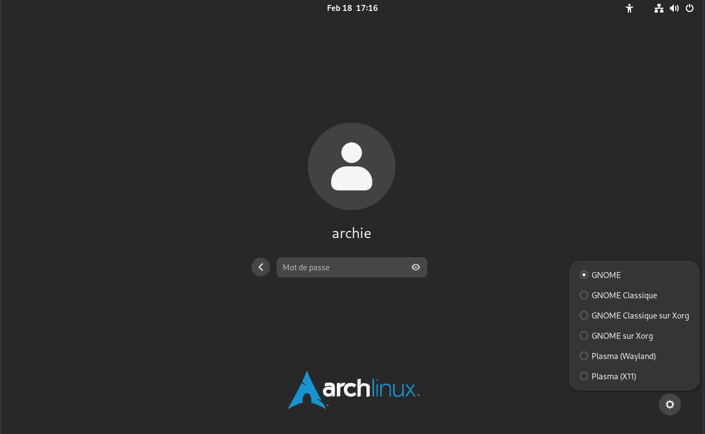  

Paramètres -> Clavier , ajouter français et supprimer anglais US  
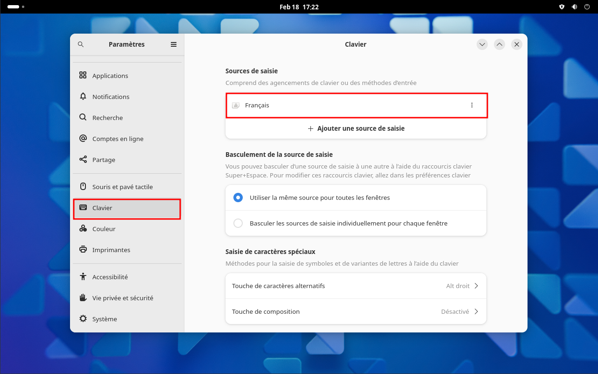  
Vérifier si wayland en terminal  
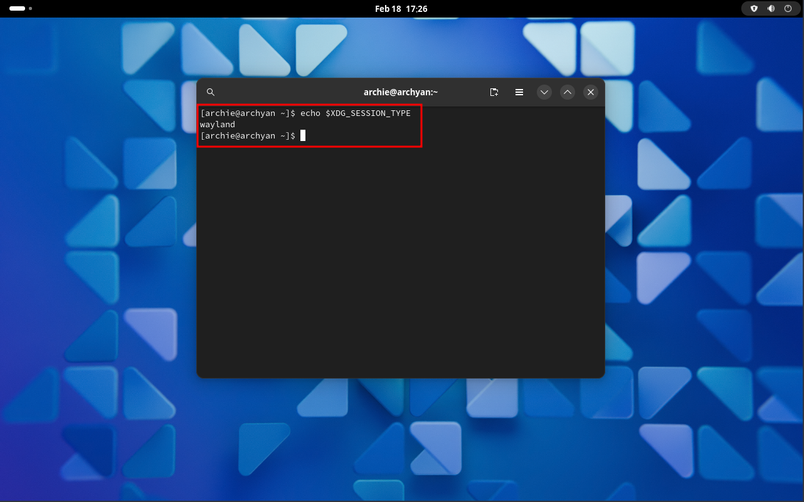  

Si je compare GNOME et KDE Plasma, GNOME a mieux fonctionné avec Wayland dans Arch Linux. Pas de problèmes importants ou d'écran clignotant dans les applications. Cela peut être dû aux changements récents effectués sur GNOME 44 pour Wayland, qui a atterri dans Arch Linux.

Aussi, Firefox fonctionne nativement dans Wayland dans GNOME, sans utiliser xwayland wrapper.  
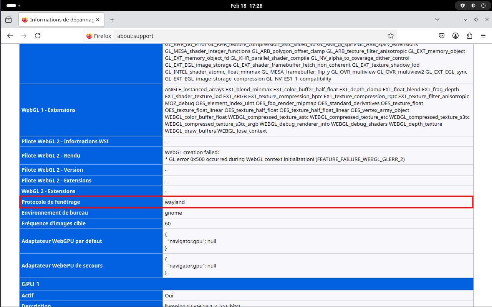  
Firefox avec Wayland dans GNOME

### GDM - Clavier français

*Si non défini dans /etc/vconsole.conf*

Saisie en qwerty sur la page d'authentification utilisateur   
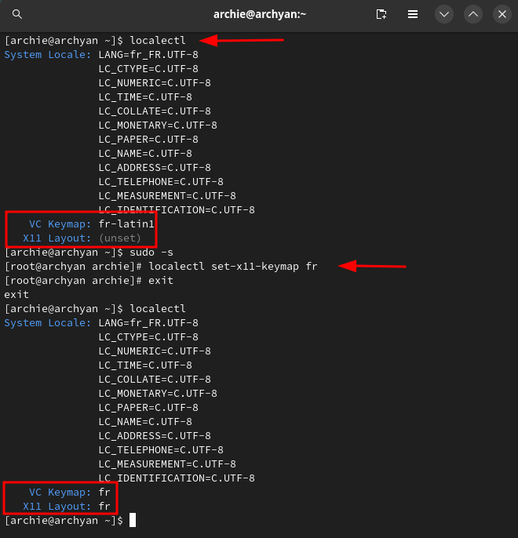 

### Appindicator

Appindicator est une extension assez pratique, et indispensable. Elle permet de rétablir en haut à droite de la barre principale de GNOME la zone de notification.

    yay -S gnome-shell-extension-appindicator gnome-tweak-tool

## vm-arch 

### Connexion utilisateur archie

Se connecter utilisateur "archie"  
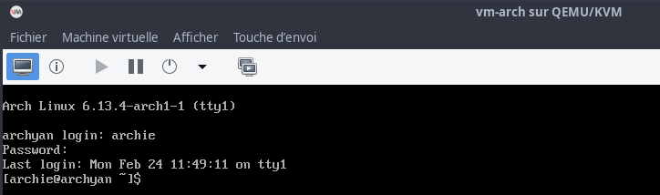


### virt manager

Ajout presse-papier

1. Modifier Affichage, passer de **Serveur VNC** à **Serveur Spice**  
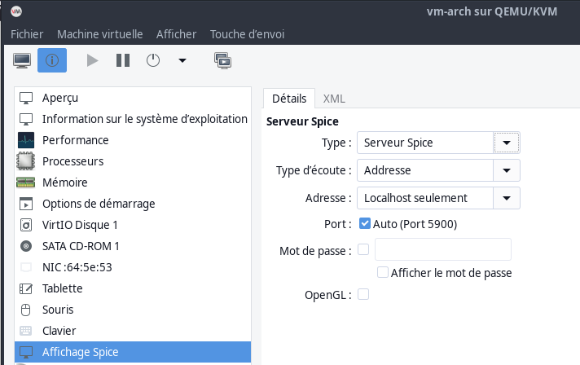
2. Ajouter un matériel --> Canal , **Channel(spice)**  
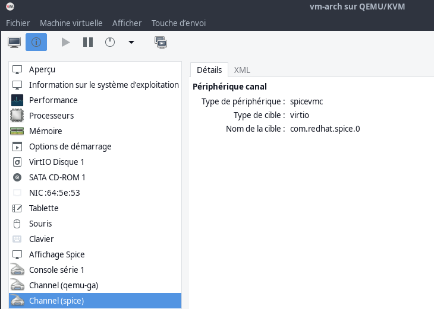

Installer spice-vdagent pour le presse papier

    sudo pacman -S spice-vdagent

## Bureau KDE Plasma

Les étapes suivantes supposent que vous disposez d'une installation de base d'Arch Linux sans environnement de bureau ni gestionnaire de fenêtres. Vous pouvez installer une version de base d'Arch Linux à l'aide du [script archinstall](https://www.debugpoint.com/archinstall-guide/) 

La configuration standard de KDE Plasma dans Arch Linux nécessite quelques modifications pour Wayland. Quelques paquets d'AUR sont nécessaires, assurez-vous donc de [configurer Yay](https://www.debugpoint.com/install-yay-arch/) ou tout autre assistant AUR.

### Gestionnaire graphique de session SDDM 

Tout d'abord, installez un package  sddm Wayland 

    yay -S sddm

Une fois installé, utilisez la commande ci-dessous pour installer quelques packages Wayland.

*    xorg-xwayland : pour exécuter des xclients sous Wayland
*    xorg-xlsclients : répertorier les applications clientes exécutées sur un écran (facultatif)
*    qt5-wayland : API Qt pour Wayland
*    glfw-wayland : packages de développement d'applications GUI pour Wayland (OPTIONNEL)

```shell
sudo pacman -S --needed xorg-xwayland xorg-xlsclients qt5-wayland 
```

### KDE plasma

*KDE est un projet de logiciel libre historiquement centré autour d'un environnement de bureau pour systèmes UNIX. Ce projet a évolué en un ensemble de programmes : KDE Framework, bibliothèques et API fournissant une couche d'abstraction logicielle multiplate-forme*

**Installer KDE plasma avec Wayland (choix par défaut)**  
On valide toutes les options par défaut sauf pour **pipewire**  

```shell
# Simplifié
sudo pacman -S xorg plasma plasma-wayland-protocols
```

**Autres choix pour installer KDE**

```
# minimal
sudo pacman -S plasma-meta ark dolphin firefox git gwenview kcalc kdeconnect kinit konsole krunner kvantum kwrite okular packagekit-qt5 partitionmanager print-manager spectacle vlc xsettingsd
# complète
sudo pacman -S --needed plasma kde-applications
sudo pacman -S --needed plasma-wayland-protocols 
```

Installer Firefox pour tester le bon fonctionnement de Wayland.

    sudo pacman -S --needed firefox 

Une fois terminé, activer le gestionnaire d’affichage et le service NetworkManager.

```shell
sudo systemctl enable sddm
sudo systemctl enable NetworkManager
```

Le gestionnaire d'affichage sddm a besoin d'un peu plus de réglages. 

    sudo nano /usr/lib/sddm/sddm.conf.d/default.conf

```
[Theme]
# current theme name
Current=breeze
```

**Activer le clavier virtuel**  
Installez qt5-virtualkeyboard : `yay -S qt6-virtualkeyboard`  
Créer le fichier `/etc/sddm.conf` avec le contenu suivant

```
[General]
InputMethod=qtvirtualkeyboard
```

Pour une prise en chrge des modifications, redémarrage de la machine

    sudo systemctl reboot

Et dans l'écran de connexion, vous devriez voir l'option Wayland.  
Sélectionnez et connectez-vous à la session Wayland de KDE Plasma dans Arch Linux.  
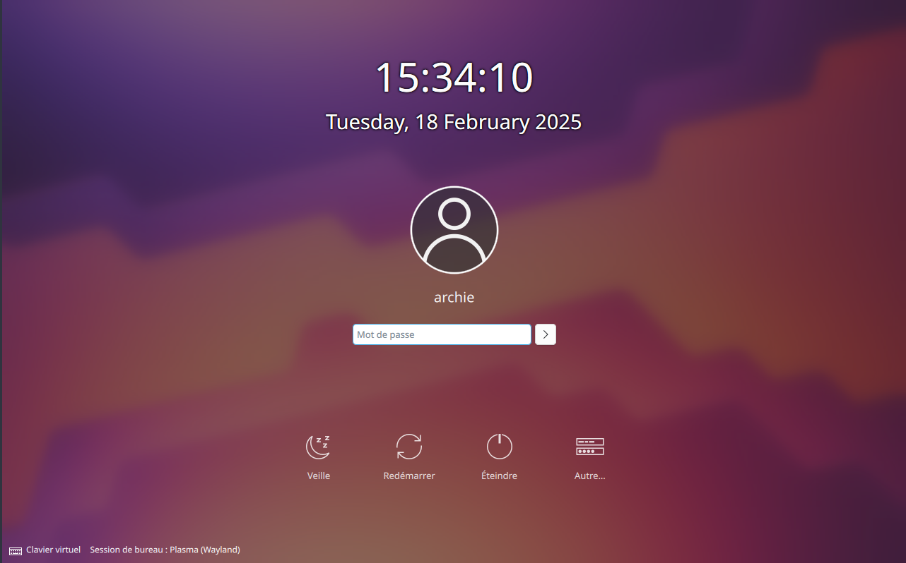

SDDM affiche maintenant un bouton dans le coin inférieur gauche de l'écran de connexion pour ouvrir le clavier virtuel.   
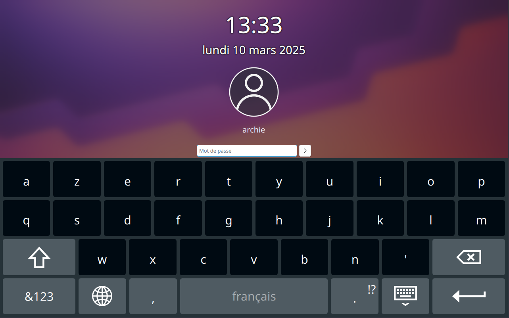

Clavier FR: Système -> Configuration du système -> Clavier  
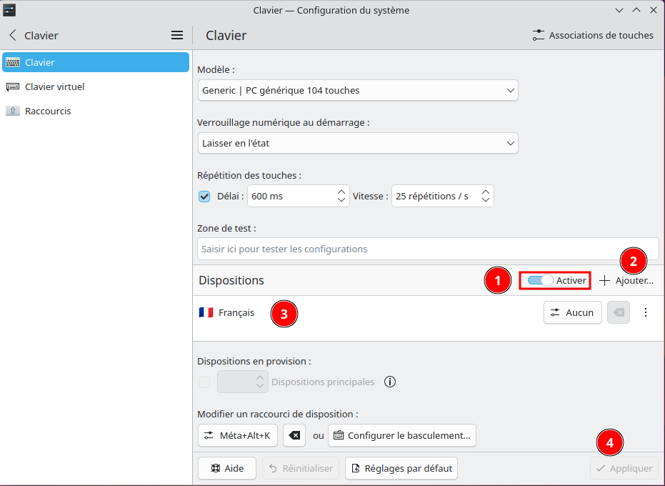{:width="600"}

Pour savoir si wayland ou X11

    echo $XDG_SESSION_TYPE

Si vous voulez forcer Firefox à utiliser Wayland, alors ouvrez `/etc/environment` et ajoutez la ligne suivante.

```text
MOZ_ENABLE_WAYLAND=1
```

Puis, redémarrer ou exécuter commande ci-dessous pour effet immédiat

    source /etc/environnement

Ouvrez Firefox et allez à `about:support` pour vérifier la valeur par rapport au "Protocole de fenêtrage".  
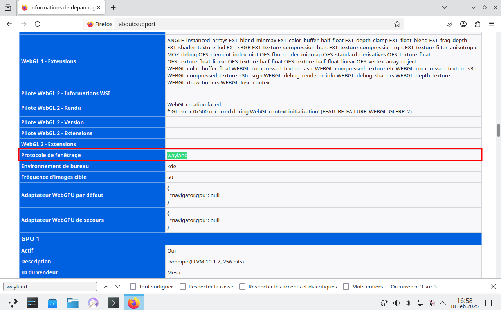{:width="600"}  
Vous pouvez également exécuter `xlsclients` à partir du terminal pour voir quelles applications externes fonctionnent sous Wayland.

Performance de Wayland KDE Session de plasma en Arch  
La consommation de mémoire est autour de 2 Go dans les sessions oisives Wayland avec Arch Linux.

### Plymouth

Plymouth est disponible avec le paquet stable **plymouth**. Pour la version de développement, utilisez **plymouth-git** 

    yay -S plymouth

Par défaut, Plymouth enregistre les messages de démarrage dans `/var/log/boot.log`, et n'affiche pas l'écran de projection graphique.

* Si vous voulez voir l'écran de projection, ajoutez **splash** aux paramètres du noyau.
* Si vous voulez un démarrage silencieux, ajoutez **quiet** aussi.
* Si vous voulez désactiver l'enregistrement, ajoutez `plymouth.boot-log=/dev/null`. Alternativement, ajoutez `plymouth.nolog` qui désactive également la redirection console.

Pour démarrer Plymouth sur le boot , vous devez configurer **initramfs** pour créer des images incluant Plymouth.

**Options des entrées bootloader**   
ajouter quiet splash

/boot/loader/entries/arch.conf

```text
title Arch Linux
linux /vmlinuz-linux
initrd /initramfs-linux.img
options rd.luks.name={UUID}=cryptlvm root=/dev/volume/root rw quiet splash
```

/boot/loader/entries/arch-fallback.conf

```
title Arch Linux (fallback initramfs)
linux /vmlinuz-linux
initrd /initramfs-linux-fallback.img
options rd.luks.name=25a8633d-350a-43aa-9c24-a8ac32a3a2d0=cryptlvm root=/dev/vg0/root rw quiet splash
```

**mkinitcpio**

Ajouter plymouth au tableau HOOKS dans `/etc/mkinitcpio.conf` 

```
HOOKS=(base systemd plymouth autodetect microcode modconf kms keyboard keymap sd-vconsole block sd-encrypt lvm2 filesystems fsck)
```

Si vous utilisez **systemd**, il doit être avant **plymouth**.  
Assurez-vous de placer **plymouth** avant le cryptage **sd-encrypt** si votre système est chiffré avec dm-crypt.

**Régénérer initramfs** 

    sudo mkinitcpio -p linux

Redémarrer la machine  
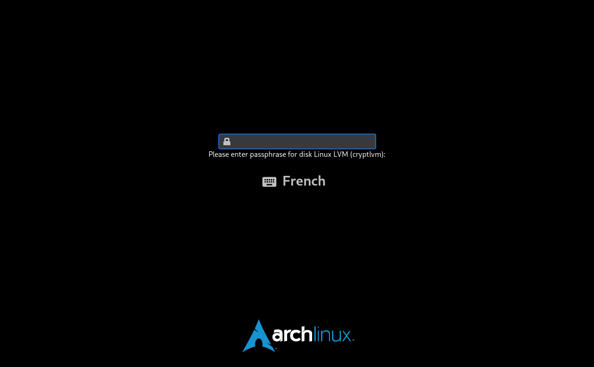

### Installation Paquets

On commence par tout ce qui est graphique : gimp, cups (gestion de l’imprimante) et hplip (si vous avez une imprimante scanner Hewlett Packard). Le paquet python-pyqt5 est indispensable pour l’interface graphique de HPLIP+scan. Webkigtk2 étant indispensable pour la lecture de l’aide en ligne de Gimp. outil rsync, Retext éditeur markdown, firefox fr, thunderbird, libreoffice, gdisk, bluefish, Double Commander , Menulibre pour la gestion des menus , outils android clementine

```
yay -S gimp hplip libreoffice-fresh-fr thunderbird-i18n-fr jq figlet p7zip tmux  calibre retext bluefish doublecmd-qt5 terminator filezilla minicom zenity android-tools yt-dlp qrencode zbar xclip nmap jre-openjdk-headless openbsd-netcat borg python-llfuse tigervnc xournalpp qbittorrent strawberry

# Autres avec compilation
yay -S freetube-bin signal-desktop 

## NON INSTALLE
cups system-config-printer xsane gedit xterm gparted ldns
# Gestion des menus du bureau, construction du paquet avant installation
menulibre 
```
