+++
title = 'PC1 - Endeavour XFCE (partition chiffrée LVM sur LUKS)'
date = 2025-03-17 00:00:00 +0100
categories = ['archlinux', 'chiffrement']
+++
*EndeavourOS est une distribution GNU/Linux basée sur Arch Linux. LVM sur LUKS permet une flexibilité de partitionnement en utilisant LVM à l'intérieur d'une partition chiffrée LUKS.*  

* [Description matériel mini tour PC1](/posts/Description_materiel_minitour_PC1/)  

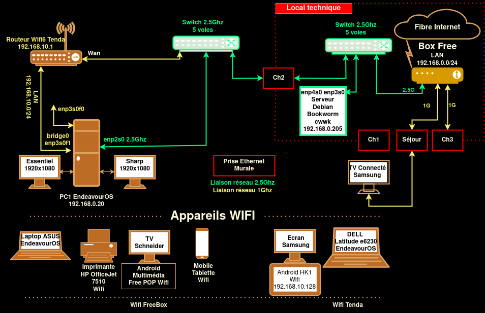

* **LVM/LUKS**, flexibilité de partitionnement en utilisant LVM dans une seule partition cryptée LUKS.
    * <u>Avantages</u>:
        * partitionnement simple avec connaissance de LVM
        * Une seule clé nécessaire pour déverrouiller tous les volumes (p. ex. installation facile de récupération de disque)
        * Mise en page du volume non visible lorsque verrouillé
        * Méthode la plus facile pour permettre la [suspension du disque](https://wiki.archlinux.org/title/Dm-crypt/Swap_encryption#With_suspend-to-disk_support)
    * <u>Inconvénients</u>:
        * LVM ajoute une couche de mappage supplémentaire et un "hook"
        * Moins utile, si un volume doit recevoir une clé séparée

`Installer une distribution EndeavourOS chiffrée sur une partition LVM est impossible avec l'outil "Calamarès"`{: .prompt-warning }

## EndeavourOS temporaire 

*Pour une installation EndavourOS LVM/LUKS, il faut passer par une installation temporaire*

### Création Eos USB Live

*Création d'une clé USB EndeavourOS bootable*

Dans un terminal linux  
Télécharger le dernier fichier iSO : <https://endeavouros.com/latest-release/>  
**EndeavourOS_Endeavour_neo-2024.09.22.iso**

Vérifier checksum

```bash
sha512sum -c EndeavourOS_Endeavour_neo-2024.09.22.iso.sha512sum
```

Résultat de la commande ci dessus après quelques minutes  
*EndeavourOS_Endeavour_neo-2024.09.22.iso: Réussi*

Créer la clé bootable  
Pour savoir sur quel périphérique, connecter la clé sur un port USB d'un ordinateur et lancer la commande `sudo dmesg` ou `lsblk`  
Dans le cas présent , le périphérique USB est **/dev/sdc**

```bash
sudo dd if=EndeavourOS_Endeavour_neo-2024.09.22.iso of=/dev/sdc bs=4M --progress
```

### Démarrer sur Eos USB Live 

Insérer la clé USB EndeavourOS, redémarrer la machine, sur Eos live  
Démarrage avec la clé USB insérée dans le Mini tour PC1 et appui sur F8 pour un accès au menu    
Choisir `UEFI: KingstonDataTraveler 2.0PMAP (3820MB)` 

Vous arrivez sur la page de sélection  
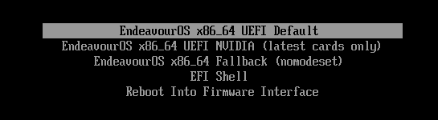{:width="400"}  
Valider le choix par défaut  

1. Ensuite cliquer sur l'icône en bas à gauche -> Settings -> System settings  
Keyboard -> Layouts, add French 
2. ouvrir un terminal

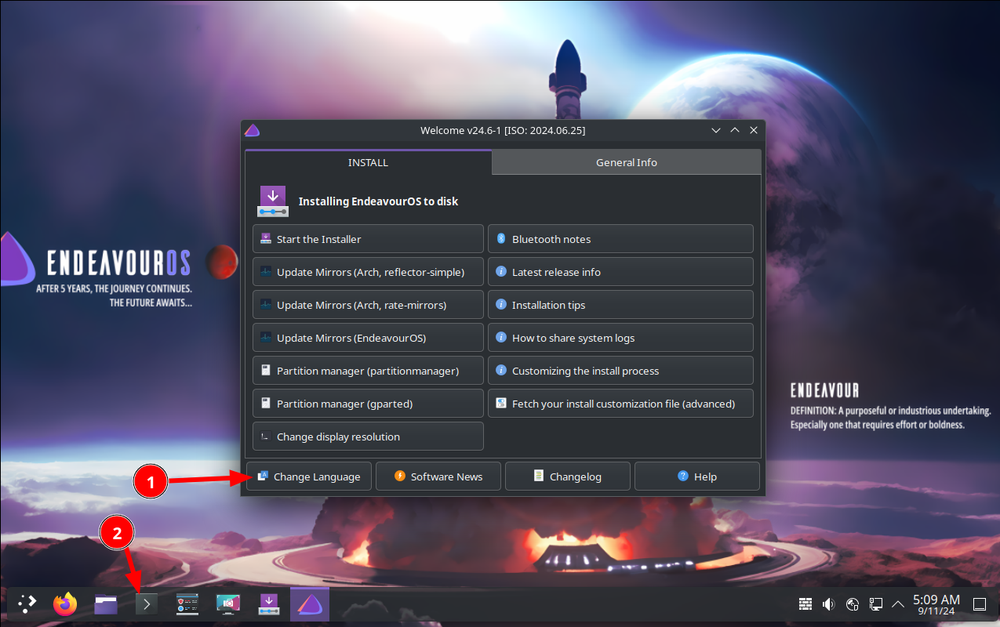{:width="600"}


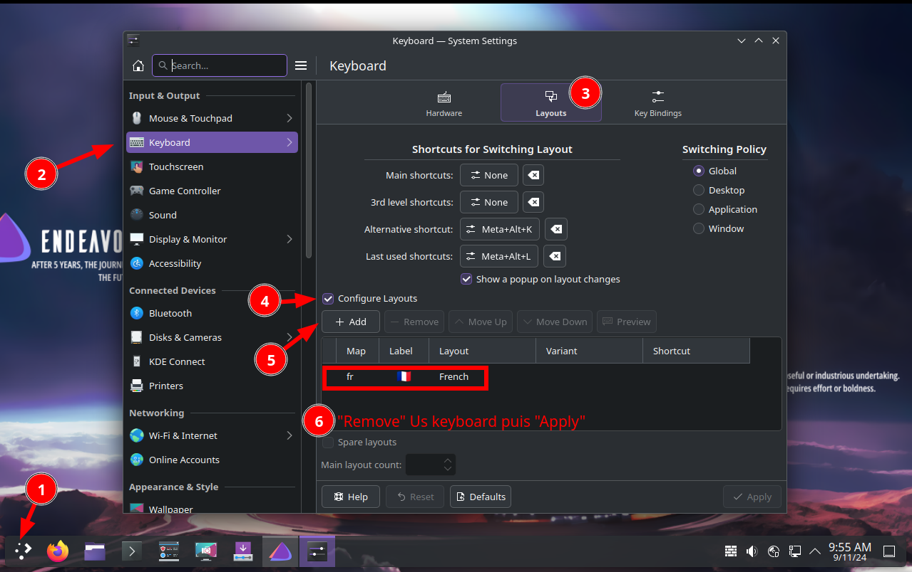{:width="600"}  
1 --> System Settings --> Keyboard  
Remove Us...   
Apply  

On va se connecter en SSH  

```
ip a # relever adresse IP
sudo systemctl start sshd
passwd liveuser  # changer le mot de passe liveuser --> rtyuiop
sudo firewall-cmd --zone=public --add-port=22/tcp
```

Se connecter depuis un poste sur le même réseau: `ssh liveuser@adresse_IP`

### Partionnement

en mode su

    sudo -s

Le disque : `lsblk`

```
nvme0n1               259:0    0 1,9T  0 disk 
```

On partitionne un disque en 3 avec `gdisk`

* Partition 1 : 512M EFI (code ef00) système de fichier FAT32
* Partition 2 : 1895G LVM (code 8e00) système de fichier EXT4
* Partition restante pour Installation temporaire 

Zapper le disque,

(**Attention** Ceci effacera de manière irréversible toutes les données de votre disque, veuillez sauvegarder toutes les données importantes) :

```
sgdisk --zap-all /dev/nvme0n1
```

Partitionnement du disque NVME 2To GPT + LVM  
Créer une table de partition GPT à l'aide de la commande `sgdisk` :

```
sgdisk --clear --new=1:0:+512MiB --typecode=1:ef00 --new=2:0:+1885G --typecode=2:8e00 /dev/nvme0n1
```

Format la partition EFI

    mkfs.fat -F32 /dev/nvme0n1p1

### Installer Eos XFCE

Utilisation de Calamarès, cliquer sur **Démarrer l'installateur**  
Installation "en ligne"  
Bureau: XFCE4  
Paquets : Tout sauf LTS Kernel
Chargeur: systemd-boot  
Partitions:  
{:width="600"}  
Utilisateur: yann  
Ordi: PC1  
mot passe utilisateur identique admin  
Résumé:  
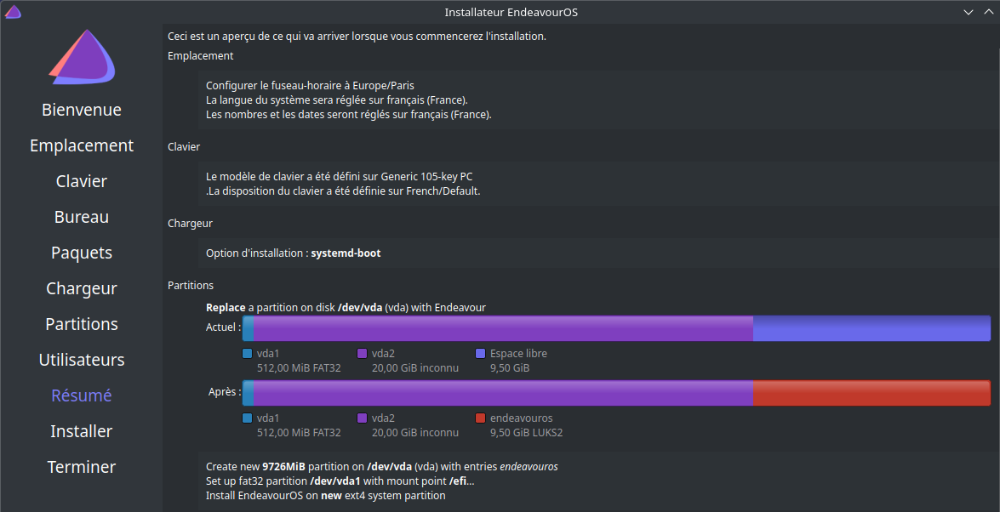{:width="600"}  
Cliquer sur **Installer**  

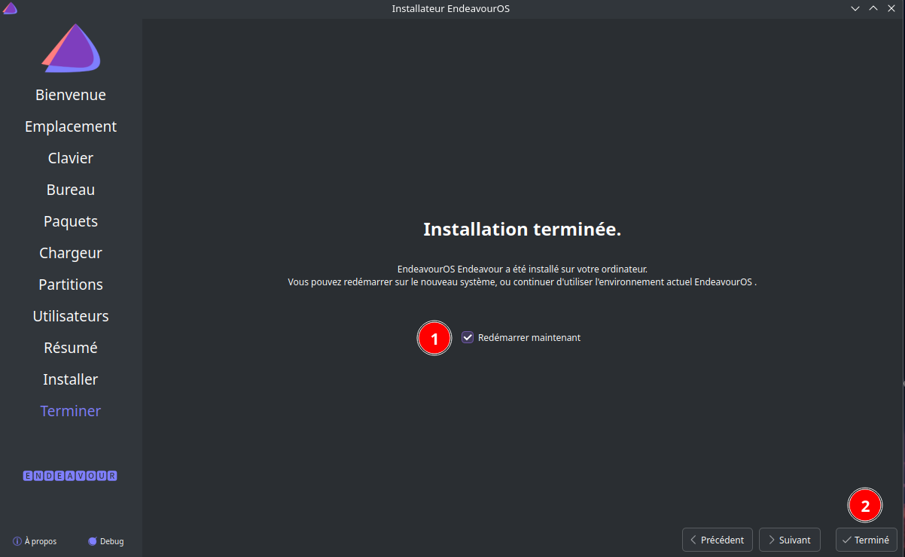{:width="600"}  
L'installation est terminée, cliquer "Redémarrer maintenant" et sur **Terminé**

### Créer nouveau système

`Clé USB Eos Live insérée, redémarrer dans l'environnement Live-Cd`{: .prompt-info }

`Clavier QWERTY!!!`{: .prompt-warning }  
Modifier pour clavier FR  
Ouvrir un terminal  
Créer un accès sur la machine via SSH depuis un poste distant  
Lancer le service : `sudo systemctl start sshd`  
Ouvrir le port 22 firewall: `sudo firewall-cmd --zone=public --add-port=22/tcp`  
Créer un mot de passe à liveuser : `passwd liveuser` --> rtyuiop
Relever l'adresse ip de la machine : `ip a`

**Déchiffrer système temporaire**

Le système temporaire chiffré `/dev/nvme0n1p3`

Passer en mode su

Dans l'environnement live-CD, ouvrez un Terminal ,basculez en mode su et tapez (ou marquez et copiez la ligne avec ctrl-c et collez dans le terminal avec shift-ctrl-v ) …

```shell
cryptsetup luksOpen /dev/nvme0n1p3 crypttemp # saisir la phrase mot de passe de l'installation
mkdir -p /media/crypttemp
mount /dev/mapper/crypttemp /media/crypttemp 
```

Nos données d'installation temporaires sont désormais accessibles sous `/media/crypttemp`   

```
bin  boot  dev	efi  etc  home	lib  lib64  lost+found	mnt  opt  proc	root  run  sbin  srv  sys  tmp	usr  var
```

**Créer nouveau système**

Chiffrer la partition /dev/nvme0n1p2,saisir la passphrase définitive

```shell
cryptsetup luksFormat --type luks2 /dev/nvme0n1p2
```

Une demande de confirmation est exigée

```
WARNING!
========
This will overwrite data on /dev/nvme0n1p2 irrevocably.

Are you sure? (Type 'yes' in capital letters): YES
Enter passphrase for /dev/nvme0n1p2: 
Verify passphrase: 
```

Choisissez un mot de passe sécurisé ( <https://xkcd.com/936/> )

Ouvrir le nouveau système chiffré

```shell
cryptsetup luksOpen /dev/nvme0n1p2 crypt
#    Enter passphrase for /dev/nvme0n1p2:
pvcreate /dev/mapper/crypt
#    Physical volume "/dev/mapper/crypt" successfully created.
vgcreate vg0 /dev/mapper/crypt
#    Volume group "vg0" successfully created
```

Une bonne taille de départ pour le volume racine (lvroot) est d'environ 30 Go. Si vous envisagez d'utiliser ultérieurement un fichier d'échange résidant sur root, vous devez en tenir compte.  
Le redimensionnement ultérieur des volumes est assez facile, alors n'y réfléchissez pas trop.  
Vous pouvez attribuer tout l'espace libre restant au volume d'accueil,  
`lvcreate --extents 100%FREE vg0 -n lvhome`  
mais pour augmenter les volumes plus tard et pour les instantanés , il faut de l'espace vide à l'intérieur du groupe de volumes, donc je choisis généralement une taille pour lvhome qui laisse environ 30 Go d'espace inutilisé global dans le volume groupe (en supposant un lecteur de 500 Go, par exemple 500 – 0,512 – 40 – 430 = 29,488)

```shell
# 40G root dont 8 swapfile
lvcreate -L 40G vg0 -n lvroot   #  Logical volume "lvroot" created.
lvcreate -L 150G vg0 -n lvhome  #  Logical volume "lvhome" created.
lvcreate -L 300G vg0 -n lvmedia  #  Logical volume "lvmedia" created.
#lvcreate -l 100%FREE vg0 -n lvhome  #  Logical volume "lvhome" created.
```

Créez un système de fichiers ext4 sur les volumes logiques.

```shell
mkfs.ext4 -L root /dev/mapper/vg0-lvroot
mkfs.ext4 -L home /dev/mapper/vg0-lvhome
mkfs.ext4 -L home /dev/mapper/vg0-lvmedia
```

### Montage sur "mnt"

Monter le nouveau système sur `/mnt` pour les systèmes UEFI

```shell
mount /dev/mapper/vg0-lvroot /mnt
mkdir -p /mnt/home
mount /dev/mapper/vg0-lvhome /mnt/home
mkdir -p /mnt/efi
mount /dev/nvme0n1p1 /mnt/efi
```

```
lsblk
```

devrait maintenant fournir une sortie similaire à la suivante (ignorez les tailles, celles-ci proviennent d'une installation de test) …

pour les systèmes UEFI :

```
nvme0n1              259:0    0   1.9T  0 disk  
├─nvme0n1p1          259:1    0   512M  0 part  /mnt/efi
├─nvme0n1p2          259:2    0   1.8T  0 part  
│ └─crypt            254:3    0   1.8T  0 crypt 
│   ├─vg0-lvroot     254:4    0    40G  0 lvm   /mnt
│   ├─vg0-lvhome     254:5    0   150G  0 lvm   /mnt/home
│   └─vg0-lvmedia    254:6    0   300G  0 lvm   
└─nvme0n1p3          259:3    0  22.2G  0 part  
  └─crypttemp        254:2    0  22.2G  0 crypt /media/crypttemp
```

### Cloner système temporaire

pour remplir les nouveaux points de montage

```
rsync -avA /media/crypttemp/ /mnt
```

*Veuillez patienter quelques minutes*

### Démonter système temporaire

```shell
umount /media/crypttemp
cryptsetup luksClose crypttemp
```

lsblk

```
nvme0n1              259:0    0   1.9T  0 disk  
├─nvme0n1p1          259:1    0   512M  0 part  /mnt/efi
├─nvme0n1p2          259:2    0   1.8T  0 part  
│ └─crypt            254:3    0   1.8T  0 crypt 
│   ├─vg0-lvroot     254:4    0    40G  0 lvm   /mnt
│   ├─vg0-lvhome     254:5    0   150G  0 lvm   /mnt/home
│   └─vg0-lvmedia    254:6    0   300G  0 lvm   
└─nvme0n1p3          259:3    0  22.2G  0 part  
```

### Configurer "crypttab"

Configuration `/etc/crypttab`

```
cryptsetup luksUUID /dev/nvme0n1p2
```

renvoie **62061a11-24fd-497c-aa20-bf00f103d359**  
Votre UUID sera différent, alors <u>**assurez-vous d'utiliser votre UUID à l'étape suivante !**</u>

```
nano /mnt/etc/crypttab
```

contient une ligne non commentée commençant par `luks-`...  
Remplacez cette ligne par la suivante ; <u>**n'oubliez pas d' utiliser votre UUID**</u>

```
cryptlvm UUID=62061a11-24fd-497c-aa20-bf00f103d359     none luks
```

Sauvegarder et quitter.

### Basculer en chroot

Passer en chroot  

```
arch-chroot /mnt
```

le prompt `[root@EndeavourOS /]#`  

### Configurer "fstab"

Configurer /etc/fstab

```
blkid -s UUID -o value /dev/mapper/vg0-lvroot
```

renvoie l'UUID du volume racine :  **5a88d848-65e3-4f08-801a-146f36830d7b**.

```
blkid -s UUID -o value /dev/mapper/vg0-lvhome
```

renvoie l'UUID du volume d'accueil : **06f12177-66e9-4214-8bd7-7e4fb1478d1a**.

```
nano /etc/fstab
```

contient une ligne commençant par `/dev/mapper/luks-`...  
**Supprimez** cette ligne et ajoutez ce qui suit (<u>**n'oubliez pas d' utiliser vos UUID**</u>)

```
UUID=5a88d848-65e3-4f08-801a-146f36830d7b / ext4 noatime 0 0
UUID=06f12177-66e9-4214-8bd7-7e4fb1478d1a /home ext4 noatime 0 0
```

Sauvegarder et quitter.

### Options du noyau


Dans **systemd-boot**, vous éditez le fichier d'entrée approprié qui se trouve sur votre partition EFI dans le répertoire `loader/entries`  
Chaque entrée est une option de démarrage dans le menu et chacune a une ligne appelée options. Vous pouvez modifier ces entrées directement, mais ces changements peuvent être écrasés lors de l'installation ou de la mise à jour de paquets.

UUID de /dev/nvme0n1p2 : `blkid -s UUID -o value /dev/nvme0n1p2`

Pour effectuer les changements, au lieu de modifier les entrées, modifiez le fichier `/etc/kernel/cmdline` qui est un fichier d'une ligne contenant une liste d'options du noyau.  

    nano /etc/kernel/cmdline

```
nvme_load=YES nowatchdog rw rd.luks.uuid=62061a11-24fd-497c-aa20-bf00f103d359 root=/dev/mapper/vg0-lvroot
```

Exécutez ensuite `reinstall-kernels` qui remplira les entrées et régénérera les initrds.

    reinstall-kernels

### Sortie chroot 

```
exit
umount -R /mnt
```

Oter la clé USB , redémarrer

```
reboot
```

`FINI! Vous devriez maintenant avoir un système LVMonLUKS fonctionnel avec un volume logique séparé pour /home`{: .prompt-info }

## EndeavourOS chiffré LVM/LUKS

### Premier démarrage

La partition est chiffrée  
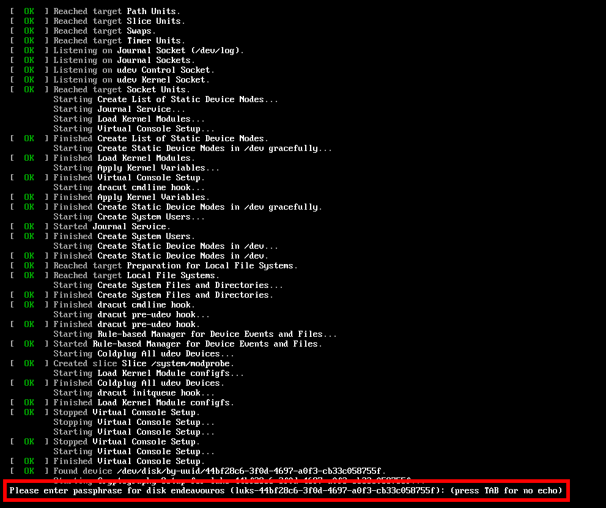  
Au message "Please enter passphrase for disk endeavouros...", saisir la phrase mot de passe pour déchiffrer le disque  

#### Activation SSH

Activer et lancer le service

    sudo systemctl enable sshd --now

Autoriser ssh

```bash
sudo firewall-cmd --zone=public --add-port=22/tcp
```

Relever adresse : `ip a`  --> 192.168.0.37

Se connecter depuis un poste sur le même réseau: `ssh yann@192.168.0.37`


#### Accès sudo

Modifier sudoers pour accès sudo sans mot de passe à l'utilisateur yano

```
su               # mot de passe root identique utilisateur
echo "yann     ALL=(ALL) NOPASSWD: ALL" >> /etc/sudoers.d/20-yann
exit # sortie su
```

#### Historique de la ligne de commande  

Ajoutez la recherche d’historique de la ligne de commande au terminal  
Se connecter en utilisateur  
Tapez un début de commande précédent, puis utilisez shift + up (flèche haut) pour rechercher l’historique filtré avec le début de la commande.

```shell
# Global, tout utilisateur
echo '"\e[1;2A": history-search-backward' | sudo tee -a /etc/inputrc
echo '"\e[1;2B": history-search-forward' | sudo tee -a /etc/inputrc
```

#### Unités disques

Liste : `lsblk`

```
NAME                                          MAJ:MIN RM   SIZE RO TYPE  MOUNTPOINTS
sda                    8:0    0 111,8G  0 disk  
└─sda1                 8:1    0 111,8G  0 part  
  └─ssd--120-lv120   254:1    0 111,8G  0 lvm   
sdb                    8:16   0 476,9G  0 disk  
└─sdb1                 8:17   0 476,9G  0 part  
  └─ssd--512-virtuel 254:0    0 476,9G  0 lvm   
nvme0n1              259:0    0   1,9T  0 disk  
├─nvme0n1p1          259:1    0   512M  0 part  /efi
├─nvme0n1p2          259:2    0   1,8T  0 part  
│ └─cryptlvm         254:2    0   1,8T  0 crypt 
│   ├─vg0-lvroot     254:3    0    40G  0 lvm   /
│   ├─vg0-lvhome     254:4    0   150G  0 lvm   /home
│   └─vg0-lvmedia    254:5    0   300G  0 lvm   
└─nvme0n1p3          259:3    0  22,2G  0 part  
```

Créer les points de montage

```bash
sudo mkdir -p /srv/media
sudo chown $USER:$USER /srv/media
sudo mkdir -p /mnt/{ssd,sharenfs,FreeUSB2To}
sudo chown $USER:$USER /mnt/{ssd,sharenfs,FreeUSB2To}
sudo mkdir -p /virtuel
sudo chown $USER:$USER /virtuel
```


Relever les UUID des unités : `sudo blkid`

```
/dev/mapper/ssd--120-lv120: UUID="6b48e98c-9b85-461b-9371-040765aae682" BLOCK_SIZE="4096" TYPE="ext4"
/dev/nvme0n1p3: UUID="9884d324-fe55-4cf8-9230-4b580086b147" TYPE="crypto_LUKS" PARTLABEL="endeavouros" PARTUUID="314c792a-926d-4129-bf83-c5bc0930168c"
/dev/nvme0n1p1: UUID="2873-8CC1" BLOCK_SIZE="512" TYPE="vfat" PARTUUID="4ff1219a-c3da-4f10-b50a-f5ef9c14da2d"
/dev/nvme0n1p2: UUID="62061a11-24fd-497c-aa20-bf00f103d359" TYPE="crypto_LUKS" PARTUUID="e2a32111-81a6-48b1-861c-c3c085ab7bbc"
/dev/sdb1: UUID="AYko64-7Ysg-IK1P-2hCq-9MUo-VjQl-4NOuWY" TYPE="LVM2_member" PARTUUID="19dd6163-01"
/dev/mapper/vg0-lvhome: LABEL="home" UUID="06f12177-66e9-4214-8bd7-7e4fb1478d1a" BLOCK_SIZE="4096" TYPE="ext4"
/dev/mapper/cryptlvm: UUID="7kpdfv-AeNq-9eos-HO7p-hIOe-Qy2d-pm8dNo" TYPE="LVM2_member"
/dev/mapper/ssd--512-virtuel: UUID="84bc1aa9-23ac-4530-b861-bc33171b7b42" BLOCK_SIZE="4096" TYPE="ext4"
/dev/sda1: UUID="o2NaLz-2Biv-Dx3C-LYJD-vuyp-1Ogl-Oa4Iu2" TYPE="LVM2_member" PARTLABEL="Linux LVM" PARTUUID="3eee16e4-fe68-42bf-861a-cd9e46d22805"
/dev/mapper/vg0-lvmedia: LABEL="home" UUID="0b98f634-c8ca-49b2-8b46-d0e8820b0746" BLOCK_SIZE="4096" TYPE="ext4"
/dev/mapper/vg0-lvroot: LABEL="root" UUID="5a88d848-65e3-4f08-801a-146f36830d7b" BLOCK_SIZE="4096" TYPE="ext4"
```

Ajout au fichier `/etc/fstab`  

```
# /dev/mapper/vg0-lvmedia
UUID=0b98f634-c8ca-49b2-8b46-d0e8820b0746 	/srv/media      ext4            rw,relatime     0 2

# /dev/mapper/ssd--512-virtuel
UUID=84bc1aa9-23ac-4530-b861-bc33171b7b42 	/virtuel    ext4    	defaults	0 2

# /dev/mapper/ssd--120-lv120
UUID=6b48e98c-9b85-461b-9371-040765aae682 	/mnt/ssd    ext4    	defaults	0 2
```

Recharger et monter les unités

    sudo systemctl daemon-reload
    sudo mount -a

**Restauration des données /srv/data**

*Toutes les données sont une cle USB3-Nvme de 1.9To*

Créer un point de montage

    sudo mkdir /mnt/usb

Monter la clé USB3 Nvme

    sudo mount /dev/sdc1 /mnt/usb

Lancer rsync

```bash
sudo -s
rsync -avA /mnt/usb/media/ /srv/media
```

Patienter 20 à 30 minutes...

Le home 

```bash
rsync -avA /mnt/usb/yann/Private $HOME/
rsync -avA /mnt/usb/yann/Musique/* $HOME/Musique/
rsync -avA /mnt/usb/yann/.mozilla $HOME/
rsync -avA /mnt/usb/yann/.thunderbird $HOME/
rsync -avA /mnt/usb/yann/.ssh $HOME/
rsync -avA /mnt/usb/yann/.keepassx $HOME/
```

### Paramètres XFCE

On déplace le **tableau de bord** du bas vers le haut de l'écran  
Gestion des 2 écrans 

* Sharp en primaire

Modification du **tableau de bord** , clic-droit &rarr; Tableau de bord &rarr; Préférences de tableau de bord &rarr; Eléments  

Affichage date et heure  
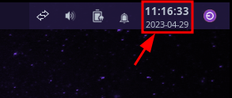  
ou **format personnalisé** dans **Horloge** : `%e %b %Y %R`  

Gestionnaire d'alimentation  
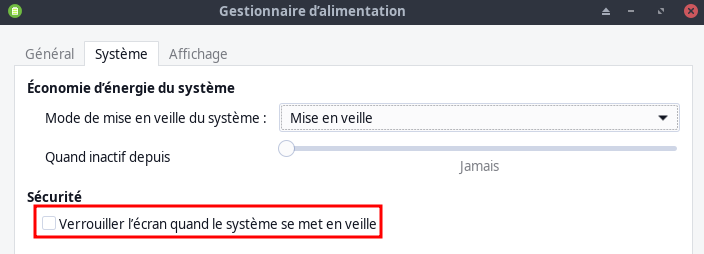{:width="400"}  
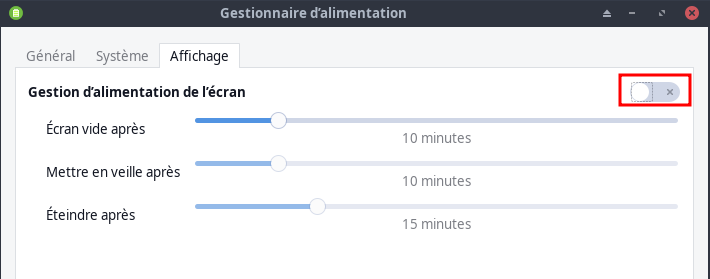{:width="400"}  

Supprimer icône alimentation dans la barre des tâches  
 


Apparence  
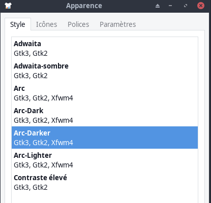{:width="300"}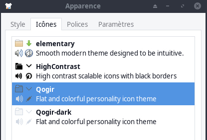{:width="300"}  

Economiseur d'écran  
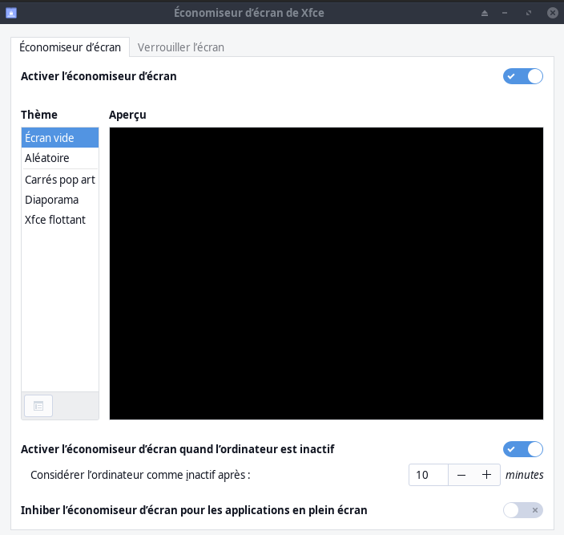{:width="400"}  
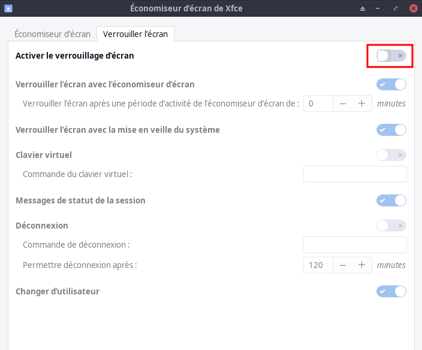{:width="400"}  

Deux cartes réseau sont installés  
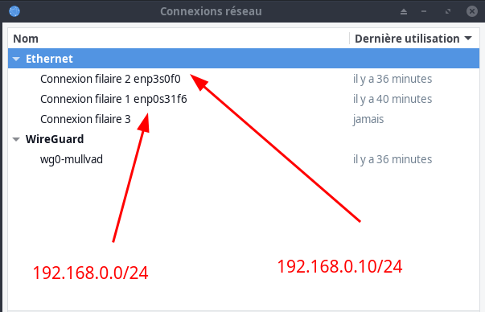{:width="400"}  
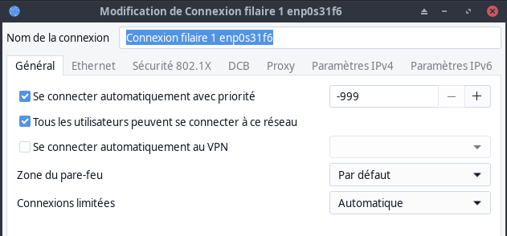{:width="400"}  
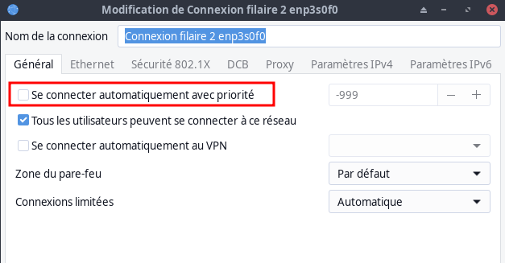{:width="400"}  

### LightDM

*Utilise `lightdm-slick-greeter` Un greeter basé sur GTK plus axé sur l'apparence que `lightdm-gtk-greeter`*

Les paramètres sont dans le fichier `/etc/lightdm/slick-greeter.conf` 

```
[Greeter]
background=/srv/media/dplus/images/Fonds/wp2618258.jpg
draw-user-backgrounds=false
draw-grid=false
theme-name=Arc-Dark
icon-theme-name=Qogir
cursor-theme-name=Qogir
cursor-theme-size=16
show-a11y=false
show-power=false
background-color=#000000
```

Démarre auto ou pas de la session, modifier le fichier `/etc/lightdm/lightdm.conf` ', (début ligne sans ou avec commentaire `#`)

    sudo nano /etc/lightdm/lightdm.conf

```
[Seat:*]
autologin-user=yann
```

Ecran principal pour la fenêtre de connexion : [EndeavourOS XFCE - LightDM sur les systèmes multi-affichages](/posts/EndeavourOS_XFCE_-_Environnements_de_bureau_LightDM/)

Si vous changez l'image de fond, il désactiver draw-grid

```
background=/usr/share/endeavouros/backgrounds/light_sky_stars_85555_1366x768_yano.jpg
draw-grid=false
```

### Mise à jour Système

Mode terminal 

    yay -Syu

Mode graphique  


### Réseau

* [Réseau NetworkManager - nmcli](/posts/NetworkManager-nmcli/)
* Carte réseau pcie 2 ports ethernet 1Ghz
* Carte réseau tp-link pcie 2.5Ghz TX201*  
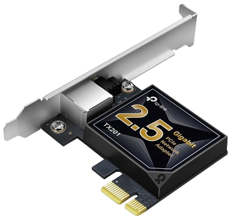{:height="200"}

*Le périphérique réseau interne à la carte mère est désactivé dans le bios*

#### Configuration de base

Les ports ethernet disponibles : `ip link`

```
1: lo: <LOOPBACK,UP,LOWER_UP> mtu 65536 qdisc noqueue state UNKNOWN mode DEFAULT group default qlen 1000
    link/loopback 00:00:00:00:00:00 brd 00:00:00:00:00:00
2: enp2s0: <BROADCAST,MULTICAST,UP,LOWER_UP> mtu 1500 qdisc fq_codel state UP mode DEFAULT group default qlen 1000
    link/ether f0:09:0d:fa:af:ff brd ff:ff:ff:ff:ff:ff
3: enp3s0f0: <BROADCAST,MULTICAST,UP,LOWER_UP> mtu 1500 qdisc mq state UP mode DEFAULT group default qlen 1000
    link/ether 6c:b3:11:32:04:c8 brd ff:ff:ff:ff:ff:ff
4: enp3s0f1: <NO-CARRIER,BROADCAST,MULTICAST,UP> mtu 1500 qdisc mq state DOWN mode DEFAULT group default qlen 1000
    link/ether 6c:b3:11:32:04:c9 brd ff:ff:ff:ff:ff:ff
```

Le statut : `nmcli device status`

```
DEVICE    TYPE      STATE                  CONNECTION          
enp3s0f0  ethernet  connecté               Connexion filaire 2 
enp2s0    ethernet  connecté               Connexion filaire 1 
lo        loopback  connecté (en externe)  lo                  
enp3s0f1  ethernet  indisponible           --                  
```

enp2s0 liaison ethernet 2.5Ghz vers routeur   relié à la box par une liaison ethernet 2.5Ghz  
enp3s0f0 liaison ethernet 1Ghz vers routeur wifi Tenda

#### Configurer un pont réseau

* [Réseau - Doc RedHat](https://docs.redhat.com/fr/documentation/red_hat_enterprise_linux/9//configuring_and_managing_networking/configuring-a-network-bridge_configuring-and-managing-networking#configuring-a-network-bridge-by-using-nmcli_configuring-a-network-bridge)

Passer en mode su

1-Créer une interface de pont 

    nmcli connection add type bridge con-name bridge0 ifname bridge0

Cette commande crée un pont nommé bridge0

2-Affichez les interfaces réseau et notez les noms des interfaces que vous souhaitez ajouter au pont

    nmcli device status

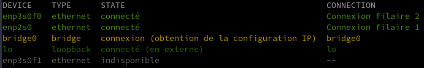

Dans notre cas :

*    enp3s0f1 n'est pas configuré. Pour utiliser ces dispositifs comme ports, ajoutez des profils de connexion à l'étape suivante.
*    enp2s0 et enp3s0f0 ont des profils de connexion existants. Pour utiliser ces dispositifs comme ports, modifiez leurs profils à l'étape suivante. 

3-Attribuer les interfaces au pont.  

3.1-Si l'interface que vous souhaitez affecter au pont n'est pas configuré, créez un nouveau profil de connexion pour elle  

```bash
nmcli connection add type ethernet slave-type bridge con-name bridge0-port1 ifname enp3s0f1 master bridge0
# si autre interface on renouvelle la commande
#nmcli connection add type ethernet slave-type bridge con-name bridge0-port2 ifname enp3s0f2 master bridge0
```

Cette commande crée un profil pour enp3s0f1 et l'ajoute à la connexion bridge0  
Résultat commande : *Connexion « bridge0-port1 » (435b879b-0337-4402-bc8b-32322400345d) ajoutée avec succès.*


3.2-Si vous souhaitez affecter un profil de connexion existant à la passerelle  

Réglez le paramètre master de ces connexions sur bridge0:

```bash
nmcli connection modify 'Connexion filaire 2' master bridge0 # enp3s0f0
#nmcli connection modify 'Connexion filaire 1' master bridge0 # enp2s0
```

Ces commandes affectent les profils de connexion existants nommés enp3s0f0 et enp2s0 à la connexion bridge0.

    Réactiver les connexions :

```bash
nmcli connection up 'Connexion filaire 2' # enp3s0f0
nmcli connection up 'Connexion filaire 1' # enp2s0
```

4-Configurez les paramètres

Pour utiliser le DHCP, aucune action n'est nécessaire

5-Activer la connexion

    nmcli connection up bridge0

6-Vérifications

Utilisez l'utilitaire ip pour afficher l'état des liens des périphériques Ethernet qui sont des ports d'un pont spécifique

     ip link show master bridge0

```
3: enp3s0f0: <BROADCAST,MULTICAST,UP,LOWER_UP> mtu 1500 qdisc mq master bridge0 state UP mode DEFAULT group default qlen 1000
    link/ether 6c:b3:11:32:04:c8 brd ff:ff:ff:ff:ff:ff
```

Utilisez l'utilitaire bridge pour afficher l'état des périphériques Ethernet qui sont des ports de n'importe quel périphérique de pont

    bridge link show

```
3: enp3s0f0: <BROADCAST,MULTICAST,UP,LOWER_UP> mtu 1500 master bridge0 state forwarding priority 32 cost 100 
```

### Partage disque

[Partage disque externe USB sur Freebox](/posts/Partage_disque_externe_USB_sur_Freebox/)

#### Disque freebox partagé FreeUSB2To

**FreeBox**  
HDD Mobile 2To connecté en USB sur la freebox  
Nom de partage : FreeUSB2To + EXT4 + vérification après formatage  
Partage windows activé : yannfreebox + mot de passe

**PC1**  
Partage linux samba : `sudo pacman -S cifs-utils` Installé par défaut   
Point de montage : `sudo mkdir -p /mnt/FreeUSB2To`   
Lien : `sudo ln -s /mnt/FreeUSB2To $HOME/FreeUSB2To`

Credential : `/root/.smbcredentials` avec 2 lignes  
username=XXXXXX  
password=XXXXXX  

Droits

```shell
sudo chown -R root:root /root/.smbcredentials
sudo chmod -R 600 /root/.smbcredentials
```

Les fichiers systèmes

```
# /etc/systemd/system/mnt-FreeUSB2To.mount 
[Unit]
  Description=cifs mount script
  Requires=network-online.target
  After=network-online.service

[Mount]
  What=//192.168.0.254/FreeUSB2To
  Where=/mnt/FreeUSB2To
  Options=credentials=/root/.smbcredentials,rw,uid=1000,gid=1000,vers=3.0
  Type=cifs

[Install]
  WantedBy=multi-user.target

# /etc/systemd/system/mnt-FreeUSB2To.automount 
[Unit]
  Description=cifs mount script
  Requires=network-online.target
  After=network-online.service

[Automount]
  Where=/mnt/FreeUSB2To
  TimeoutIdleSec=10

[Install]
  WantedBy=multi-user.target
```

Activation

    sudo systemctl enable mnt-FreeUSB2To.automount --now

#### Partage avec Lenovo serveur NFS


**PC1**  
Points de montage : `sudo mkdir -p /mnt/sharenfs`   
Lien : `sudo ln -s /mnt/sharenfs $HOME/sharenfs`

Ajouter les points de montage du serveur nfs au fichier `/etc/fstab`

```
# Les montage NFS du serveur lenovo 192.168.0.215
192.168.0.215:/sharenfs	/mnt/sharenfs nfs4 nofail,x-systemd.automount,x-systemd.requires=network-online.target,x-systemd.device-timeout=10s,rsize=8192,wsize=8192 0 0
```

Rechargement et montage

    sudo systemctl daemon-reload && sudo mount -a

Points de montage : `sudo mkdir -p /mnt/nfs-ssd`   
Lien : `sudo ln -s /mnt/nfs-ssd $HOME/nfs-ssd`

Ajouter les points de montage du serveur nfs au fichier `/etc/fstab`

```
192.168.0.215:/mnt/nfs-ssd /mnt/nfs-ssd nfs4 nofail,x-systemd.automount,x-systemd.requires=network-online.target,x-systemd.device-timeout=10s,rsize=8192,wsize=8192 0 0 
```

Rechargement et montage

    sudo systemctl daemon-reload && sudo mount -a

#### Dossiers et Liens

Les dossiers et **Liens sur les autres unités** et les dossiers `.keepassx` , `Notes` , `scripts` `statique/images` et `statique/_posts` 

```
sudo mkdir -p /srv/media/{Notes,statique}  
sudo mkdir -p /srv/media/statique/{images,_posts}
sudo ln -s /srv/media $HOME/media
sudo ln -s /virtuel $HOME/virtuel 
mkdir -p ~/{.ssh,.keepassx}
sudo mkdir -p /mnt/sharenfs/scripts
sudo chown $USER:$USER -R /mnt/sharenfs/scripts
```

Créer liens sharenfs

```bash
ln -s /mnt/sharenfs/pc1/.borg $HOME/Private/.borg
ln -s /mnt/sharenfs/scripts $HOME/scripts
```

**Liens "statique" et "Notes"**  
les liens pour la rédaction des posts markdown et le dossier des fichiers

```bash
# Lien pour affichage des images avec éditeur Retext
sudo ln -s /srv/media/statique/images /images
# Lien pour les fichiers autres
sudo ln -s /srv/media/statique/files /files
```
**Dossiers Documents et Musique**  
Supprimer les dossiers par défaut Documents et Musique et créer des liens 

```
# suppression Documents et Musique
sudo rm -r $HOME/Documents
sudo rm -r $HOME/Musique
#Création des liens
sudo ln -s /srv/media/Documents $HOME/Documents
sudo ln -s /mnt/sharenfs/Musique $HOME/Musique
```

### Installation Paquets 

On commence par tout ce qui est graphique : gimp, cups (gestion de l’imprimante) et hplip (si vous avez une imprimante scanner Hewlett Packard). Le paquet python-pyqt5 est indispensable pour l’interface graphique de HPLIP+scan. Webkigtk2 étant indispensable pour la lecture de l’aide en ligne de Gimp. outil rsync, Retext éditeur markdown, firefox fr, thunderbird, libreoffice, gdisk, bluefish, **Double Commander** , **Menulibre** pour la gestion des menus , outils android clementine    

```bash
yay -S cups system-config-printer gimp hplip libreoffice-fresh-fr thunderbird-i18n-fr jq figlet p7zip tmux  calibre retext bluefish gedit doublecmd-gtk2 terminator filezilla minicom zenity android-tools yt-dlp qrencode zbar xclip nmap jre-openjdk-headless openbsd-netcat borg python-llfuse xterm gparted tigervnc xournalpp qbittorrent ldns strawberry

# Autres avec compilation
yay -S freetube-bin signal-desktop xsane

# Gestion des menus du bureau, construction du paquet avant installation
 yay -S menulibre 
```

* **System-config-printer** est une interface graphique écrite en Python et qui utilise Gtk+ pour configurer un serveur CUPS. Son but premier est de configurer le système d'impression sur l'hôte local, mais il peut également configurer une imprimante distante.  
* **HPLIP** est un ensemble de pilotes pour l'impression sous GNU / Linux des imprimantes Hewlett Packard.
*  **FIGlet** est un logiciel qui crée des bannières textuelles dans différentes polices d'écriture
* **Jq** est un programme qui permet de filtrer, découper, transformer et grouper des données JSON facilement.
* **p7zip** est le portage en ligne de commande Unix de 7-Zip, un archiveur de fichier qui compresse avec des gros ratios de compression. 
* **Tmux** est un outil qui permet d'exploiter plusieurs terminaux au sein d'un seul affichage.
* **calibre** est un logiciel gratuit et open source qui vous permet de gérer, convertir et synchroniser vos livres numériques.
* **ReText** est multiplateforme et écrit en Python. Il permet d’éditer des documents au balisage léger, en particulier le Markdown, et peut afficher le rendu HTML, en écran partagé
*  **Bluefish** est un éditeur de texte dédié à la programmation informatique. Il se distingue notamment par ses nombreux outils et par la longue liste de langages de développement compatibles. 
* **Double Commander** est un gestionnaire de fichiers multiplateforme au source ouvert avec deux panneaux côte à côte.
* **Terminator** est un terminal virtuel qui a la particularité de permettre de partager la fenêtre selon vos envies et ainsi organiser plus simplement vos différentes fenêtres.
* **FileZilla** est un logiciel qui vous permet de transférer des fichiers entre votre ordinateur et un serveur distant. Il est compatible avec Windows, Mac, Linux et les protocoles FTP, FTPS et SFTP.
* **Minicom** est un programme de contrôle de modem et d'émulation de terminal pour les Unix-like. Il permet de configurer des équipements réseaux via leur port console, comme les routeurs Cisco. 
* **Zenity** est un outil qui permet d'afficher des boîtes de dialogue GTK+ depuis la ligne de commandes ou au travers de scripts shell
* **Android SDK Platform-Tools** (ADB) est l'outil officiel de Google qui permet d'utiliser les commandes ADB sur les appareils Android. 
* **yt-dlp**, script écrit en Python, est un logiciel open source qui permet de télécharger des vidéos à partir de plusieurs sites de partage de vidéos, notamment YouTube
* **Qrencode** est une bibliothèque rapide et compacte pour l'encodage de données en QR Code, un symbole 2D qui peut être scanné par un téléphone portable 
* **ZBar** est un logiciel de lecture de codes-barres à partir de diverses sources, telles que les flux vidéo, les fichiers d'images et les capteurs d'intensité brute. Il prend en charge de nombreuses symbologies courantes, dispose d'une mise en œuvre souple et en couches et d'un code de petite taille, et convient à une utilisation embarquée.
* **Xournal** est un outil open source permettant d'annoter des fichiers PDF. Il prend en charge la saisie au stylo, à la souris et au clavier. Il est couramment utilisé, avec Xournal++, pour ajouter des annotations et des signatures électroniques aux fichiers PDF, en particulier sur les ordinateurs de bureau Linux.
* **TigerVNC** (de l'anglais, « Tiger Virtual Network Computing ») est un système pour le partage de bureau graphique vous permettant de contrôler d'autres ordinateurs à distance.
* **Borg Backup** (Borg en abrégé) est un programme de sauvegarde incrémentielle en ligne de commande. 
**python-llfuse** est utilisé avec **borg** pour monter des sauvegardes en tant que système de fichiers FUSE
* **qBittorrent** est un client Bittorrent gratuit et fiable qui vous permet de télécharger et de partager des fichiers via le protocole BitTorrent
* **Xclip** Cette application permet d'utiliser le presse-papier en ligne de commande. Elle permet notamment de rediriger la sortie standard d'une commande directement vers le presse-papier, afin de pouvoir s'en servir immédiatement. 
* **ldns** est une bibliothèque DNS rapide avec le but de simplifier la programmation DNS et pour permettre aux développeurs de facilement créer des programmes qui soient conformes aux RFC actuelles et aux brouillons Internet. 
* **Nmap** (« Network Mapper ») est un outil open source d'exploration réseau et d'audit de sécurité. Il a été conçu pour rapidement scanner de grands réseaux, mais il fonctionne aussi très bien sur une cible unique. 
* **GParted** est une application de gestion et d'organisation de partitions distribuée sous licence libre GPLv2. Elle permet de créer, d'effacer et de modifier les partitions de vos disques durs, clés USB, cartes SD, etc.
* **openbsd-netcat** L'utilitaire nc (ou netcat) est utilisé pour tout ce qui concerne TCP, UDP ou les sockets du domaine UNIX. Il peut ouvrir des connexions TCP, envoyer des paquets UDP, écouter sur des ports TCP et UDP arbitraires, effectuer un balayage des ports et gérer à la fois IPv4 et IPv6. 
* **xterm** est l'émulateur de terminal standard pour l'environnement graphique X Window System. Un utilisateur peut disposer de plusieurs instances de xterm simultanément dans le même écran, chacune d'entre elles offrant des entrées/sorties indépendantes pour les processus qui s'y exécutent
* **Strawberry Music Player** excelle par la richesse de ses fonctionnalités. Outre la lecture de musique, l'utilisateur peut créer et gérer des playlists, organiser aisément sa collection selon divers critères, et même éditer les tags des pistes audio.
* **FreeTube** est un client privé multiplateforme qui vous permet de regarder YouTube sur votre ordinateur en toute tranquillité.
* **Signal**, l'équivalent libre de WhatsApp. Signal est une application de messagerie similaire à WhatsApp, mais étant plus indépendante. Elle permet aux utilisateurs de se transmettre des messages, des photos, des vidéos et des documents. La transmission des messages est chiffrée de bout en bout. 
* **XSane** a été conçu pour l'acquisition d'images avec votre scanner. Vous pouvez scanner un fichier, faire une photocopie, créer un fax, créer un courriel, et enfin démarrer xSane à partir de GIMP avec un greffon spécifique. 
* **MenuLibre** est un éditeur de menu pour les environnements de bureau tels que Budgie, LXDE (Lubuntu), XFCE (Xubuntu), et également GNOME ou Unity.

### ReText

Restauration `cp /mnt/usb/yann/.config/ReText project/ReText.conf ~/.config/ReText project/ReText.conf`  
Fichier de configuration `~/.config/ReText project/ReText.conf`

```conf
[General]
appStyleSheet=/home/yann/.config/ReText project/retext.qss
defaultPreviewState=normal-preview
recentFileList=
styleSheet=/home/yann/.config/ReText project/retext.css
useWebEngine=true
useWebKit=true
```

Les fichiers retext.css et retext.qss

<details>
<summary><b>Etendre Réduire retext.css</b></summary>
  
body {
  font-family: Helvetica, Arial, sans-serif;
  font-size: 15px;
  line-height: 1.3;
  color: #f6e6cc;
  width: 700px;
  margin: auto;
  /*background: #27221a;*/
  background: #121212;
  position: relative;
  padding: 0 30px;
}

body>:first-child
{
  margin-top:0!important;
}

img {
  max-width: 100%;
}

table {
  width: 100%;
  border-collapse: collapse;
}

th {
  background-color: rgba(0, 0, 0, 0.3);
}

table, th, td {
  padding: 5px;
  border: 1px solid rgba(0, 0, 0, 0.3);
  border-radius: 0.4em;
  -moz-border-radius: 0.4em;
  -webkit-border-radius: 0.4em;
}

tr:nth-child(even) {
  background-color: rgba(0, 0, 0, 0.3);
}

p, ul, ol, dl, table, pre {
  margin-bottom: 1em;
}

ul {
  margin-left: 20px;
}

a {
  text-decoration: none;
  cursor: pointer;
  color: #ba832c;
  font-weight: bold;
}

a:focus {
  outline: 1px dotted;
}

a:visited {}

a:hover, a:focus {
  color: #d3a459;
  text-decoration: none;
}

a *, button * {
  cursor: pointer;
}

hr {
  display: none;
}

small {
  font-size: 90%;
}

input, select, button, textarea, option {
  font-family: Arial, "Lucida Grande", "Lucida Sans Unicode", Arial, Verdana, sans-serif;
  font-size: 100%;
}

button, label, select, option, input[type=submit] {
  cursor: pointer;
}

sup {
  font-size: 80%;
  line-height: 1;
  vertical-align: super;
}

h1, h2, h3, h4, h5, h6 {
  line-height: 1.1;
  font-family: Baskerville, "Goudy Old Style", "Palatino", "Book Antiqua", serif;
}

h1 {
  font-size: 24pt;
  margin: 1em 0 0.1em;
}

h2 {
  font-size: 22pt;
}

h3 {
  font-size: 20pt;
}

h4 {
  font-size: 18pt;
}

h5 {
  font-size: 16pt;
}

h6 {
  font-size: 14pt;
}

h1 a, h1 a:hover {
  color: #d7af72;
  font-weight: normal;
  text-decoration: none;
}

::selection {
  background: #745626;
}

::-moz-selection {
  background: #745626;
}

pre {
  background: #1B1812;
  color: #fff;
  padding: 8px 10px;
  overflow-x: hidden;
}

pre code {
  font-size: 10pt;
}

</details>

Fichier retext.qss

```css
QTextEdit {
  color: black;
  background-color: white;
}
```

### Tmux

Fichier de configuration tmux

<details>
<summary><b>Etendre Réduire fichier de configuration "~/.tmux.conf"</b></summary>

 
#Configuration de tmux
#Origine : http://denisrosenkranz.com
#Yannick juin 2017
# Copier/Coller par la souris se fait avec la touche "Shift" appuyée
 
##################################
#Changements des raccourcis claviers
##################################
#On change Control +b par Control +x
#set -g prefix C-x
#unbind C-b
#bind C-x send-prefix
 
#On utilise control + flèches pour naviguer entre les terminaux
bind-key -n C-right next
bind-key -n C-left prev
 
#on utilise alt + flèches our naviguer entre les panels
bind-key -n M-left select-pane -L
bind-key -n M-right select-pane -R
bind-key -n M-up select-pane -U
bind-key -n M-down select-pane -D
 
#On change les raccourcis pour faire du split vertical et horizontal
#On utilise la touche "|" (pipe) pour faire un split vertical
bind | split-window -h
#Et la touche "-" pour faire un split horizontal
bind - split-window -v
 
##################################
#Changements pratiques
##################################
#On permet l'utilisation de la souris pour changer de terminal et de panel
set -g mouse on

# Sélection zone par clic gauche souris (texte sélectionné sur fond jaune)
# Après relachement du clic , le texte sélectionné est copié dans le presse-papier 
# Le fond jaune disparaît
set-option -s set-clipboard off
# For emacs copy mode bindings
# Il faut installer l'utilitaire 'xclip' (sudo pacman -S xclip)
bind-key -T copy-mode MouseDragEnd1Pane send-keys -X copy-pipe-and-cancel "xclip -selection clipboard -i"

#Les fenêtres commencent par 1 et non par 0
set -g base-index 1
 
##################################
#Changements visuels
##################################
#On met les panneaux non actif en gris
#set -g pane-border-fg colour244
#set -g pane-border-bg default
 
#On met le panneau actif en rouge
#set -g pane-active-border-fg colour124
#set -g pane-active-border-bg default
 
#On met la barre de status en gris
set -g status-fg colour235
set -g status-bg colour250
#set -g status-attr dim
 
# On surligne les fenêtres actives dans la barre de status en gris foncés
#set-window-option -g window-status-current-fg colour15
#set-window-option -g window-status-current-bg colour0


</details>

### Client Nextcloud

Installation client nextcloud

    yay -S nextcloud-client libgnome-keyring gnome-keyring  

Démarrer le client nextcloud , après avoir renseigné l'url ,login et mot de passe pour la connexion  

Trousseau de clé avec mot de passe idem connexion utilisateur

Paramétrage

* Menu &rarr; Lancer **Client de synchronisation nextcloud**
* Adresse du serveur : <https://cloud.xoyaz.xyz>  
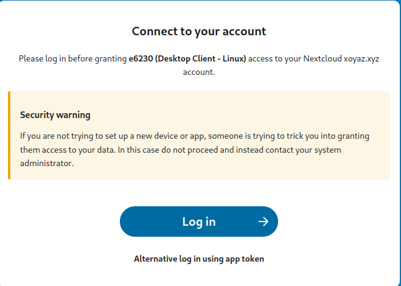{:width="300"}  
* Nom d’utilisateur : yann
* Mot de passe : xxxxx  
{:width="200"}  
{:width="300"}  
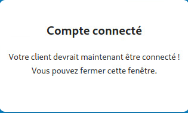{:width="200"}  
* Sauter les dossiers à synchroniser, Ignorer la configuration des dossiers
* Trousseau de clés = mot de passe connexion utilisateur  
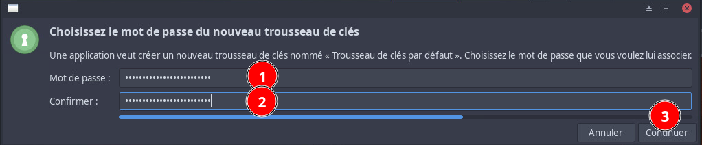{:width="400"}  
* Paramètres nextcloud  
{:width="400"}

Saisir les différents dossiers à synhroniser  
{:width="400"}

Au prochain redémarrage, il faudra confirmer le mot de passe du trousseau

### Gestion mot de passe (keepassxc)

{:width="50"}  
Ajouter une synchronisation de dossier nextcloud : /home/yann/.keepassx (local) &rarr; Home/.keepasx (serveur)  

Installer keepassxc 

    yay -S keepassxc

Ajouter aux favoris "KeepassXC" et lancer l'application &rarr; **Ouvrir une base de données existante**  
Base de données --> Ouvrir une base de données (afficher les fichiers cachés) : **~/.keepassx/yannick_xc.kdbx** --> Ouvrir  
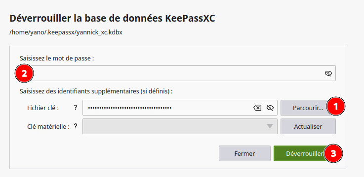{:width="400"}

**Affichage &rarr; Thème** : Sombre  
**Affichage &rarr; Mode compact**  , un redémarrage de l'application est nécessaire  

Déverrouillage avec clé matérielle

### Minicom

Paramétrage de l'application terminale **minicom**

     sudo minicom -s

>Seul les paramètres à modifier sont cités

Configuration du port série  
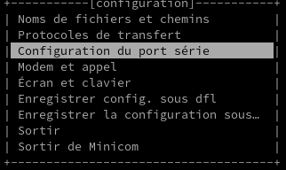  
A -                             Port série : **/dev/ttyUSB0**   
F -              Contrôle de flux matériel : **Non**  
  
Echap  
Enregistrer config. sous dfl  
  
Sortir de Minicom  

### Flameshot (copie écran)

**Copie écran (flameshot)**  
**[Flameshot](https://github.com/lupoDharkael/flameshot)** c’est un peu THE TOOL pour faire des captures d’écrans

    yay -S flameshot

Lancer l'application XFCE Flameshot et l'icône est visible dans la barre des tâches  
{:width="300"}  

Paramétrage de flameshot, clic droit sur icône , Configuration   
{:width="300"}  
Paramétrage de flameshot  
{:width="300"}

### scrpy émulation android

Utilise adb et le port USB

    yay -S scrcpy

### SSHFS (facultatif)

{:width="50"}  
*SSHFS sert à monter sur son système de fichier, un autre système de fichier distant, à travers une connexion SSH, le tout avec des droits utilisateur.*

Installer paquet SSHFS 

	sudo pacman -S sshfs 

sshfs n'est pas installé par défaut sur la distribution EndeavourOS
{: .prompt-warning }


Création des partages utilisés par sshfs (facultatif)

    mkdir -p $HOME/vps/{borgbackup,lxc,vdb,xoyaz.xyz,xoyize.xyz}

Exemple de montage manuel  
`sshfs -oIdentityFile=<clé privée> utilisateur@domaine.tld:<dossier distant> <dossier local> -C -p <port si dfférent de 22>`  

### Gestionnaire de fichiers

*Double Commander est un gestionnaire de fichiers open source multiplateforme avec deux panneaux côte à côte. Il s'inspire de Total Commander*

Application GTK

    yay -S doublecmd-gtk2

Les paramètres sont stockés dans le dossier `~/.config/doublecmd`

### Thunderbird

Lancer thunderbird à l'ouverture de session xfce  
Paramètres &rarr; Session et démarrage &rarr; Démarrage automatique d'application  
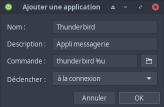{:width="300"}

Ajouter thunderbird aux favoris et lancer

### bashrc alias

Ajouter les alias au fichier `$HOME/.bashrc`   
<details>
<summary><b>Etendre Réduire</b></summary>
  
alias ls='ls --color=auto'
alias grep='grep --color=auto'
alias ll='ls -lav --ignore=..'   # show long listing of all except ".."
alias l='ls -lav --ignore=.?*'   # show long listing but no hidden dotfiles except "."
alias aide='xdg-open https://static.rnmkcy.eu/aide-jekyll-text-theme/#autres-styles'
alias android='$HOME/virtuel/KVM/bliss.sh'
alias audio='yt-dlp --extract-audio --audio-format m4a --audio-quality 0 --output "~/Musique/%(title)s.%(ext)s"'
alias audiomp3='yt-dlp --extract-audio --audio-format mp3 --audio-quality 0 --output "~/Musique/%(title)s.%(ext)s"'
alias borglist='$HOME/scripts/borglist.sh'
alias calibreraz='adb -s CNBT80D20191101145 shell -x rm /sdcard/Document/metadata.calibre'
alias certok='$HOME/scripts/ssl-cert-check'
alias compress='$HOME/scripts/compress'
alias dnsleak='$HOME/scripts/dnsleaktest.py'
alias etat='$HOME/scripts/etat_des_lieux.sh'
alias findh='cat $HOME/scripts/findhelp.txt'
alias homer="ssh bookvm@192.168.0.225 -p 55215 -i $HOME/.ssh/vm-debian12 '/home/bookvm/homer/remoh.py'"
alias iceyanwg="sh /mnt/sharenfs/pc1/scripts/wgiceyan.sh"
alias ipleak='curl https://ipv4.ipleak.net/json/'
alias l='ls -lav --ignore=.?*'
alias ll='ls -lav --ignore=..'
alias ls='ls --color=auto'
alias mediasync='$HOME/scripts/sav-yann-media.sh'
alias mediajour='/usr/bin/journalctl --no-pager -t sauvegardes --since today'
alias nmapl='sudo nmap -T4 -sP 192.168.0.0/24'
alias odt/='$HOME/scripts/_odt/+index'
alias odtprivate='$HOME/scripts/_odt/+index_private'
alias orphelin='sudo pacman -Rsn $(pacman -Qdtq)'
alias otp='$HOME/scripts/generer-code-2fa-vers-presse-papier-toutes-les-30s.sh'
alias ovh="ssh leno@192.168.0.215 -p 55215 -i $HOME/.ssh/lenovo-ed25519 'cd /home/leno/scripts/ovh_api/; /home/leno/scripts/ovh_api/ApiOvh/bin/python domain.py xoyize.xyz cinay.eu xoyaz.xyz ouestline.xyz rnmkcy.eu yanfi.net icevps.xyz xoyize.net iceyan.xyz; cd /home/leno'"
alias rename='$HOME/scripts/remplacer-les-espaces-accents-dans-une-expression.sh'
alias service='systemctl --type=service'
alias sshm='$HOME/scripts/ssh-manager.sh'
alias ssl='$HOME/scripts/ssl-cert-check'
alias static='cd $HOME/media/yannstatic; $HOME/.local/share/gem/ruby/3.3.0/bin/bundle exec jekyll build -d $HOME/media/yannstatic/static; cd ~'
alias status='$HOME/scripts/status.sh'
alias synchro='journalctl --user -u media_yannstatic_site.service --no-pager --since today'
alias toc='$HOME/scripts/toc/toc.sh'
alias tocplus='$HOME/scripts/toc/tocplus.sh'
alias tracesgpx="/srv/media/osm-new/osm_python/OsmScripts/bin/python /srv/media/osm-new/osm_python/OsmScripts/tracesgpxnew.py /srv/media/osm-new/file /run/media/yann/GARMIN/Garmin/GPX; sh /srv/media/osm-new/osm-new-synchro.sh"
alias traduc='/usr/local/bin/trans'
alias ttrss="bash $HOME/scripts/articles_remarquables_ttrss"
alias vncasus='sh $HOME/scripts/vncasus.sh'
alias vncdell='sh $HOME/scripts/vncdell.sh'
alias vncmarina='sh $HOME/scripts/vncmarina.sh'
alias wgiceyan='sh $HOME/scripts/wgiceyan.sh'
alias x96='adb connect 192.168.0.22:5555'
alias youtube='yt-dlp -f "bestvideo[ext=mp4]+bestaudio[ext=m4a]/best[ext=mp4]/best" --output "~/Vidéos/%(title)s.%(ext)s" --ignore-errors'

</details>

Recharger le fichier pour appliquer les modifications 

    source ~/.bashrc

Pour afficher les alias dans un terminal

    alias

### Imprimante et scanner

Prérequis , paquets **cups cups-filters cups-pdf system-config-printer hplip installés** (Pilotes HP pour DeskJet, OfficeJet, Photosmart, Business Inkjet et quelques modèles de LaserJet aussi bien qu'un certain nombre d'imprimantes Brother)...   


Installer graphiquement l'imprimante  
{:width="300"}  
  
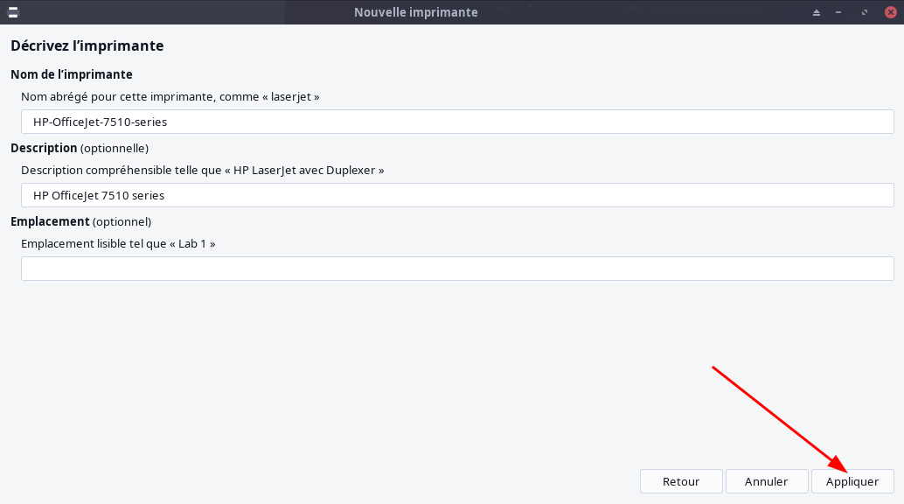  

{:width="300"}  
Pour contourner le problème , éditer le fichier `/etc/nsswitch.conf`  
Ajouter `mdns_minimal [NOTFOUND=return]` avant `resolve`   
`hosts: mymachines mdns_minimal [NOTFOUND=return] resolve [!UNAVAIL=return] files myhostname dns`
{: .prompt-warning }

Après correctif  
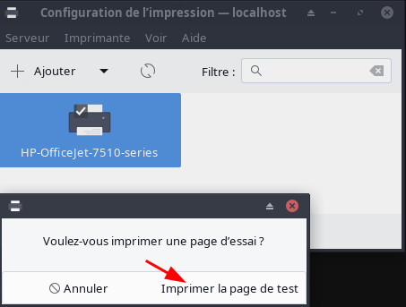{:width="300"}  

Avec cups : http://localhost:631/  
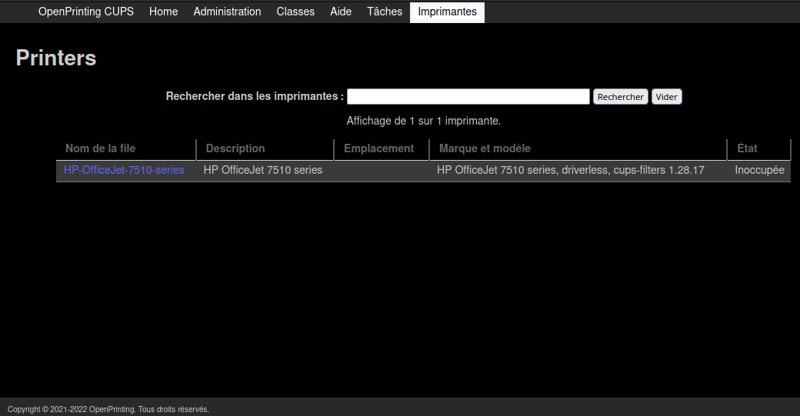

Installation du scanner  
Coté logiciel il vous faudra **sane** et son interface graphique **xsane**, ainsi qu’éventuellement xsane-gimp le plugin pour gimp.

	yay -S xsane xsane-gimp 

Vérifier si le scaner est reconnu : `sudo scanimage -L`

```
device `escl:https://192.168.0.24:443' is a HP OfficeJet 7510 series [C22036] platen,adf scanner
device `hpaio:/net/officejet_7510_series?ip=192.168.0.24&queue=false' is a Hewlett-Packard officejet_7510_series all-in-one
```

Test scan, placer un original pour photocopie

    scanimage --device hpaio:/net/officejet_7510_series?ip=192.168.0.24 --format=png > test.png

### Navigateur Floorp

*Floorp est un navigateur basé sur Firefox qui bloque les traceurs malveillants, offre une mise en page flexible et personnalisable, et ne collecte pas les données des utilisateurs. Découvrez ses fonctionnalités, ses thèmes, ses mises à jour et son code source ouvert.* 

    yay -S floorp-bin

### Générateur site statique

*Ensemble d'applications basé sur ruby et jekyll qui permet la génération de site statique à partir de fichiers markdown*

[Ruby jekyll yannstatic - générateur site statique](/posts/Archlinux_Ruby_Jekyll_site_statique/#option-b---ruby-choix-par-defaut)

### Pacman Hooks 

* [Pacman hooks for setting up certain system identification files of EndeavourOS (eos-hooks)](https://github.com/endeavouros-team/PKGBUILDS/tree/master/eos-hooks)
* [Pacman hooks](https://github.com/Strykar/pacman-hooks)

**Liste paquets installés**  
*Ce hook sauvegardera une liste de vos paquets natifs et étrangers (AUR) installés. Cela garantit que vous aurez toujours une liste à jour de tous vos paquets que vous pourrez réinstaller.*

Prérequis pour la création du hook et des scripts, créez des sous-répertoires

    sudo mkdir -p /etc/pacman.d/hooks

Créez le hook

    sudo nano /etc/pacman.d/hooks/50-pacman-list.hook

```
#/etc/pacman.d/hooks/50-pacman-list.hook
[Trigger]
Type = Package
Operation = Install
Operation = Upgrade
Operation = Remove
Target = *

[Action]
Description = Création liste des paquets installés
When = PostTransaction
Exec = /bin/sh -c '/usr/bin/pacman -Qqe > /mnt/sharenfs/pc1/PC1_eos_pkg_list.txt'
```

Pour installer des paquets depuis une sauvegarde antérieure de la liste des paquets, tout en ne réinstallant pas ceux qui sont déjà installés et à jour, lancer:

    sudo pacman -S --needed - < PC1_eos_pkg_list.txt
    sudo pacman -S --needed $(comm -12 <(pacman -Slq | sort) <(sort pkglist.txt))

### Synchro serveurs

**Dossier "BiblioCalibre"**

Le but est de synchroniser le dossier **/srv/media/BiblioCalibre** avec le(s) serveur(s) web distant(s)  
Avec les unités de chemin, vous pouvez surveiller les fichiers et les répertoires pour certains événements. Si un événement spécifique se produit, une unité de service est exécutée, et elle porte généralement le même nom que l'unité de chemin
{: .prompt-info }


Nous allons surveiller dans le dossier */srv/media/BiblioCalibre/* toute modification du fichier **metadata.db** qui entrainera l'exécution d'un script

Dans le répertoire systemd utilisateur nous créons une unité de cheminement **media_BiblioCalibre_site.path**

    nano ~/.config/systemd/user/media_BiblioCalibre_site.path

```ini
[Unit]
Description=Surveiller metadata.db pour les changements

[Path]
PathChanged=/srv/media/BiblioCalibre/metadata.db
Unit=media_BiblioCalibre_site.service

[Install]
WantedBy=default.target
```

Dans la section `[Path]`, `PathChanged=` indique le chemin absolu du fichier à surveiller, tandis que `Unit=` indique l'unité de service à exécuter si le fichier change. Cette unité (**media_BiblioCalibre_site.path**) doit être lancée lorsque le système est en mode multi-utilisateur.

Ensuite, nous créons l'unité de service correspondante, **media_BiblioCalibre_site.service**, dans le répertoire `~/.config/systemd/user/`    
Si le fichier **metadata.db** change (c'est-à-dire qu'il est à la fois écrit et fermé), l'unité de service suivante sera appelée pour exécuter le script spécifié :

    nano ~/.config/systemd/user/media_BiblioCalibre_site.service

```ini
[Unit] 
Description="Exécute le script si metadata.db a été modifié."

[Service]
ExecStart=/mnt/sharenfs/scripts/media_BiblioCalibre_site.sh

[Install]
WantedBy=default.target
```

Le script `media_BiblioCalibre_site.sh` lance une synchronisation locale distante via rsync ssh 
<details>
<summary><b>Etendre Réduire media_BiblioCalibre_site.sh</b></summary>  

#!/bin/bash

#++++++++++++++++++++++++++++++++++++++++++++++++++++++++++++++++++++++++++++++++++++++++++++++++++++++++++++++++++++++++++
# Modification mode rsync suivant serveur distant
#
# Chaque modification du fichier metadata.db dans le dossier local /srv/media/BiblioCalibre 
# déclenche une synchronisation du dossier local  avec le dossier distant '/sharenfs/multimedia/eBook/BiblioCalibre' 
# des serveurs VPS Yunohost
# le dossier local est également sauvegardé dans le dossier 'backup/datayan/static' de la boîte de stockage
#++++++++++++++++++++++++++++++++++++++++++++++++++++++++++++++++++++++++++++++++++++++++++++++++++++++++++++++++++++++++++

# Fonction pour tester si le serveur est présent
# Host=$1 et Port=$2
# Réponse $?=0 -> OK  $?=1 -> NOK
host_ok () {
 nc -4 -d -z -w 1 $1 $2 &> /dev/null
}

synchro () {
# Synchronisation locale distante du dossier _site
host_ok $SERVER $PORT 
if [[ $? == 0 ]]
then


echo 'rsync -avz --progress --stats --human-readable --delete -e "ssh -p '$PORT' -i '$PRIVKEY'" '$REPLOC' '$USERDIS':'$REPDIS'/eBook/'
rsync -avz --progress --stats --human-readable --delete --rsync-path="$RSYNCMOD" -e "ssh -p $PORT -i $PRIVKEY" $REPLOC $USERDIS:$REPDIS/eBook/ > /dev/null

	 # Analyse résultat de la commande rsync
	 if [ ! $? -eq 0 ]; then 
		 #echo "Synchro $REPLOC avec $SERVER -> OK" | systemd-cat -t BiblioCalibre -p info 
		 #echo "Synchro $REPLOC avec $SERVER -> OK"
	 #else 
		 echo "Synchro $REPLOC avec $SERVER -> ERREUR" | systemd-cat -t BiblioCalibre -p emerg 
		 #echo "Synchro $REPLOC avec $SERVER -> ERREUR"
	 fi
else
    echo "Site $SERVER port $PORT Inaccessible !" | systemd-cat -t BiblioCalibre -p emerg
    #echo "Site $SERVER port $PORT Inaccessible !"
fi

}

#*******************************************************************
#
# DEPART SCRIPT
#
#*******************************************************************

# Tester la présence du fichier des serveurs distants
if [ ! -f /home/yann/scripts/serveurs.csv ]; then
    echo "Fichier serveurs.csv inexistant!" | systemd-cat -t BiblioCalibre -p emerg
    exit 1
fi

# Mesure temps exécution
begin=$(date +"%s")
echo "***DEPART*** Exécution script $0"
echo "***DEPART*** Exécution script $0" | systemd-cat -t BiblioCalibre -p info
#echo "Exécution script $0"

# Dossier local
REPLOC="/srv/media/BiblioCalibre" 

# Synchro serveurs
while IFS="," read -r SERVER REPDIS USERDIS PORT PRIVKEY RSYNCMOD LOCAL
do
  #echo " $SERVER $REPDIS $USERDIS $PORT $PRIVKEY $RSYNCMOD $LOCAL"
 
   if [[ "$SERVER" = "rnmkcy.eu" ]]; then
  	synchro
        echo "ssh $USERDIS -p $PORT -i $PRIVKEY 'sudo systemctl restart calibreweb'"
  	ssh $USERDIS -p $PORT -i $PRIVKEY 'sudo systemctl restart calibreweb'  
   fi
done < <(tail -n +2 /home/yann/scripts/serveurs.csv)

# Calcul et affichage temps exécution
termin=$(date +"%s")
difftimelps=$(($termin-$begin))
echo "***FIN*** $0 exécuté en $(($difftimelps / 60)) mn $(($difftimelps % 60)) s" | systemd-cat -t BiblioCalibre -p info
echo "***FIN*** $0 exécuté en $(($difftimelps / 60)) mn $(($difftimelps % 60)) s"

exit 0

</details>

Activer et lancer

    systemctl --user enable media_BiblioCalibre_site.path --now

Voir le fichier journal

    journalctl --user -f -u media_BiblioCalibre_site.service

```
juin 06 09:39:32 yann-pc1 systemd[1537]: Started "Exécute le script si metadata.db a été modifié.".
juin 06 09:39:32 yann-pc1 media_BiblioCalibre_site.sh[11100]: ***DEPART*** Exécution script /home/yann/scripts/media_BiblioCalibre_site.sh
juin 06 09:39:32 yann-pc1 media_BiblioCalibre_site.sh[11100]: rsync -avz --progress --stats --human-readable --delete -e "ssh -p 55215 -i /home/yann/.ssh/lenovo-ed25519" /srv/media/BiblioCalibre leno@192.168.0.215:/sharenfs/multimedia/Divers/
juin 06 09:39:33 yann-pc1 media_BiblioCalibre_site.sh[11100]: ***FIN*** /home/yann/scripts/media_BiblioCalibre_site.sh exécuté en 0 mn 1 s
juin 06 09:44:40 yann-pc1 systemd[1537]: Started "Exécute le script si metadata.db a été modifié.".
juin 06 09:44:40 yann-pc1 media_BiblioCalibre_site.sh[11278]: ***DEPART*** Exécution script /home/yann/scripts/media_BiblioCalibre_site.sh
juin 06 09:44:40 yann-pc1 media_BiblioCalibre_site.sh[11278]: rsync -avz --progress --stats --human-readable --delete -e "ssh -p 55215 -i /home/yann/.ssh/lenovo-ed25519" /srv/media/BiblioCalibre leno@192.168.0.215:/sharenfs/multimedia/Divers/
juin 06 09:44:41 yann-pc1 media_BiblioCalibre_site.sh[11278]: ssh leno@192.168.0.215 -p 55215 -i /home/yann/.ssh/lenovo-ed25519 'sudo systemctl restart calibreweb'
juin 06 09:44:42 yann-pc1 media_BiblioCalibre_site.sh[11278]: ***FIN*** /home/yann/scripts/media_BiblioCalibre_site.sh exécuté en 0 mn 2 s
```

On peut créer un accès graphique sur le poste archlinux 

    ~/.local/share/applications/suivi_BiblioCalibre_site.desktop

```
[Desktop Entry]
Version=1.1
Type=Application
Name=Synchro BiblioCalibre
Comment=synchro site rnmkcy.eu
Icon=xterm-color_48x48
Exec=xterm -rv -geometry 250x30+10+50 -T suivi_BiblioCalibre_site -e 'journalctl --user -u media_BiblioCalibre_site.service --no-pager; read -p "Touche Entrée pour sortir..."'
Actions=
Categories=Utility;
Path=
Terminal=false
StartupNotify=false
```

### Déverrouillage des volumes LUKS2 avec clé matérielle

Installer librairie libfido2 pour la prise en charge des clés Yubico et SoloKeys

    sudo pacman -S libfido2

#### Enroler clé USB YubiKey 5 NFC

{:height="150"}

Vérifier que la YubiKey est insérée dans un port USB

Lister et enroler la yubikey

    sudo systemd-cryptenroll --fido2-device=list

```
PATH         MANUFACTURER PRODUCT              
/dev/hidraw6 Yubico       YubiKey OTP+FIDO+CCID
```

Enroler la clé pour le déverrouillage du disque chiffré nvme0n1p2

    sudo systemd-cryptenroll --fido2-device=auto /dev/nvme0n1p2

```
🔐 Please enter current passphrase for disk /dev/nvme0n1p2: *********************   
Requested to lock with PIN, but FIDO2 device /dev/hidraw5 does not support it, disabling.
Initializing FIDO2 credential on security token.
👆 (Hint: This might require confirmation of user presence on security token.)
Generating secret key on FIDO2 security token.
👆 In order to allow secret key generation, please confirm presence on security token.
New FIDO2 token enrolled as key slot 1.
```

Le **Y** de la clé se met à clignoter , il suffit de poser son doigt sur l'emplacement du **Y** pour le déverrouillage
{: .prompt-info }

Retirer la première clé et répéter l'opération ci-dessus pour les autres clés

#### Enroler une passphrase de recouvrement 

Les jetons et puces de sécurité FIDO2, PKCS#11 et TPM2 s'associent bien avec les clés de recouvrement : puisque vous n'avez plus besoin de taper votre mot de passe tous les jours, il est logique de vous en débarrasser et d'enregistrer à la place une clé de recouvrement à forte entropie que vous imprimez ou scannez hors écran et conservez dans un endroit physique sûr.  
Voici comment procéder :

    sudo systemd-cryptenroll --recovery-key /dev/nvme0n1p2

```
🔐 Please enter current passphrase for disk /dev/nvme0n1p2: ***********             
A secret recovery key has been generated for this volume:

    🔐 vbcrnbjn-vkrkihte-rctbufne-nlihihjl-tegudteu-rkjthcgd-hvhuvgik-rugeregh

Please save this secret recovery key at a secure location. It may be used to
regain access to the volume if the other configured access credentials have
been lost or forgotten. The recovery key may be entered in place of a password
whenever authentication is requested.
New recovery key enrolled as key slot 4.
```

Cette opération génère une clé, l'enregistre dans le volume LUKS2, l'affiche à l'écran et génère un code QR que vous pouvez scanner en dehors de l'écran si vous le souhaitez.  
La clé possède la plus grande entropie et peut être saisie partout où vous pouvez saisir une phrase d'authentification.  
C'est pourquoi il n'est pas nécessaire de modifier le fichier /etc/crypttab pour que la clé de récupération fonctionne.

#### Enroler une clé USB SoloKeys (OPTIONNEL)


Lister la clé

    systemd-cryptenroll --fido2-device=list

```
PATH         MANUFACTURER PRODUCT   
/dev/hidraw4 SoloKeys     Solo 4.1.5
```

Ajout de la solokeys

    sudo systemd-cryptenroll --fido2-device=auto /dev/nvme0n1p2

```
🔐 Please enter current passphrase for disk /dev/nvme0n1p2: ***********             
Requested to lock with PIN, but FIDO2 device /dev/hidraw1 does not support it, disabling.
Initializing FIDO2 credential on security token.
👆 (Hint: This might require confirmation of user presence on security token.)
Generating secret key on FIDO2 security token.
👆 In order to allow secret key generation, please confirm presence on security token.
New FIDO2 token enrolled as key slot 3.
```

Lors du boot , le **S** de la SoloKeys passe au ROUGE et il suffit d'appuyer sur le voyant pour qu'il repasse  au vert afin de lancer le processus de déchiffrement et finir le démarrage
{: .prompt-info }

#### Prise en charge YubiKey et SoloKey

Les options timeout de [crypttab](https://www.man7.org/linux/man-pages/man5/crypttab.5/)

```
timeout=
           Spécifie le délai d'attente pour la demande d'un mot de passe. Si aucune unité
           n'est spécifiée, l'unité utilisée est la seconde. Les unités prises en charge sont s, ms, us,
           min, h, d. Un délai de 0 permet d'attendre indéfiniment (valeur par défaut).

token-timeout=
           Spécifie le temps d'attente maximum pour que les dispositifs de sécurité configurés (c'est-à-dire FIDO2, PKCS#11, TPM2) apparaissent.Prend une valeur
           en secondes (mais d'autres unités de temps peuvent être spécifiées,
           voir systemd.time(7) pour les formats supportés). La valeur par défaut est 30s.
           Une fois le délai spécifié écoulé, l'authentification par
           mot de passe est tentée. Notez que ce délai s'applique à
           l'attente de l'apparition du dispositif de sécurité - 
           Il ne s'applique pas à la demande de code PIN pour le dispositif (le cas échéant)
           ou autre. Passez 0 pour désactiver le délai et attendre indéfiniment.
```

Configurer /etc/crypttab pour la prise en charge des clés

    sudo nano /etc/crypttab

```
# <name>               <device>                         <password> <options>
#cryptlvm UUID=62061a11-24fd-497c-aa20-bf00f103d359 /crypto_keyfile.bin luks
cryptlvm UUID=62061a11-24fd-497c-aa20-bf00f103d359 - fido2-device=auto,token-timeout=10s
```

`token-timeout=20s` --> Si aucune clé n'est connectée , le mot de passe devra être saisi après 10 secondes de délai
 
Réinitialiser le kernel

    sudo reinstall-kernels

`Redémarrer la machine`{: .prompt-info }

#### Plymouth - Processus de démarrage graphique

[Plymouth - Processus de démarrage graphique](/posts/Plymouth_Processus_de_demarrage_graphique/)

Plymouth de base

    yay -S plymouth plymouth-theme-endeavouros

Ajouter le paramètre kernel “splash” dans le fichier `/etc/kernel/cmdline` pour que Plymouth soit affiché au démarrage

    nvme_load=YES splash nowatchdog rw rd.luks.uuid=62061a11-24fd-497c-aa20-bf00f103d359 root=/dev/mapper/vg0-lvroot

Réinitialiser le kernel

    sudo reinstall-kernels

`Redémarrer la machine`{: .prompt-info }

### Ntfy

*Ntfy, qui se prononce “notify”, est un service de notification ultra léger, permettant d’envoyer des messages vers un smartphone ou un ordinateur via de simples scripts, sans besoin de compte et totalement gratuitement !*

[Ntfy service de notification](/posts/Ntfy/)

    yay -S ntfysh-bin

Exemples

* [How to Use the Command 'ntfy' (with examples)](https://commandmasters.com/commands/ntfy-common/)
* [Ntfy - Recevez des alertes sur le bureau ou le téléphone lorsque la commande de longue durée se termine](https://fr.linux-console.net/?p=685)

### FreeTuxTv

*FreetuxTV est une application qui permet de regarder et enregistrer facilement les chaînes de télévision sous GNU/Linux et les chaînes de télévision de votre fournisseur d'accès internet.*

Pour la freebox

    echo "192.168.0.254 mafreebox.freebox.fr" | sudo tee -a /etc/hosts

Installation

    yay -S freetuxtv

Paramétrage du parefeu firewalld ([Configuration de firewalld pour le multicast VLC freebox](https://forums.fedora-fr.org/d/59161-configuration-de-firewalld-pour-le-multicast-vlc-freebox-de-chez-free))

Créer les services **/etc/firewalld/services/mafreebox.xml** et **/etc/firewalld/services//vlc.xml** pour firewalld

**mafreebox.xml**

```xml
<?xml version="1.0" encoding="utf-8"?>
<service>
  <short>mafreebox</short>
  <description>Permission pour mafreebox et vlc</description>
  <port protocol="udp" port=""/>
</service>
```

**vlc.xml**

```xml
<?xml version="1.0" encoding="utf-8"?>
<service>
  <short>vlc2</short>
  <description>Permission pour mafreebox et vlc</description>
  <port protocol="udp" port="15947"/>
  <destination ipv4="228.67.43.91"/>
</service>
```

Ajouter à la **zone public** , fichier `/etc/firewalld/zones/public.xml`

```xml
  <service name="mafreebox"/>
  <service name="vlc"/>
```

pour rendre ces règles permanentes

```xml
<?xml version="1.0" encoding="utf-8"?>
<zone>
  <short>Public</short>
  <description>For use in public areas. You do not trust the other computers on networks to not harm your computer. Only selected incoming connections are accepted.</description>
  <service name="ssh"/>
  <service name="dhcpv6-client"/>
  <service name="ipp-client"/>
  <service name="mdns"/>
  <service name="ipp"/>
  <service name="mafreebox"/>
  <service name="vlc"/>
  <forward/>
</zone>
```

Recharger le parefeu

    sudo firewall-cmd --reload

## VPN

### NordVPN

* [NordVPN fournisseur de services de réseau privé virtuel (VPN)](/posts/NordVPN/)
* [NordVPN systray](https://gitea.rnmkcy.eu/yann/nordvpntray)

**Désactiver NordVPN**

```bash
sudo systemctl stop nordvpnd.service
sudo systemctl disable nordvpnd.service
```

Décocher **nordvpntray (NordVPN Graphique)** dans **Paramètres -> Session et démarrage Démarrage automatique de session**  


### Mullvad

* [Archlinux Mullvad](/posts/Mullvad-2024/#archlinux-mullvad)
* [Utilisation application VPN Mullvad](/doc/Utilisation application VPN Mullvad/)

**Paramètres à modifier après installation**  
Pour le réseau local   
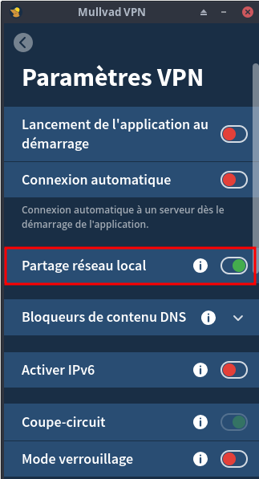{:height="300"}  
IPV6  
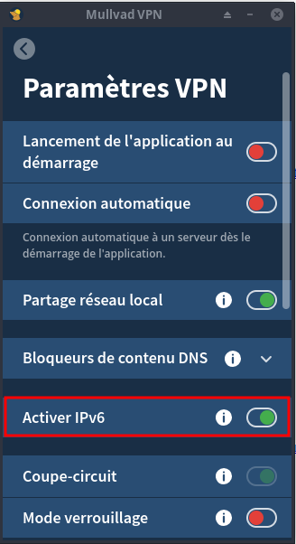{:height="300"}  
Appli au démarrage   
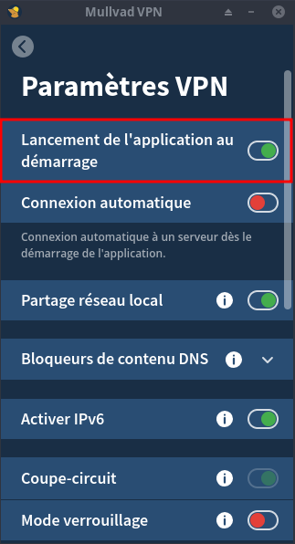{:height="300"}  


## Virtuel QEMU KVM VMM

### Virt-Manager

1. [Virt-Manager Complete Edition - Installation simplifiée](/posts/EndeavourOS-Virt-Manager_Complete_Edition/#installation-simplifiée)
2. [Accés aux machines virtuelles KVM distantes via virt-manager](/posts/Installer_KVM_Kernel_Virtual_Machine_sur_un_serveur/#accés-aux-machines-virtuelles-kvm-distantes-via-virt-manager)
3. [Pont réseau virtuel “host-bridge”](/posts/EndeavourOS-Virt-Manager_Complete_Edition/#pont-réseau-virtuel-host-bridge)  
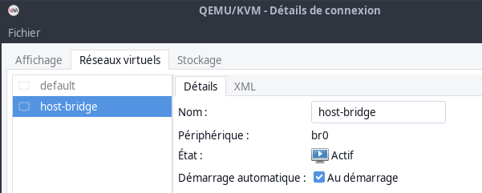{:width="400"}
4. Gestionnaire de machine virtuelles, activer "xml editing"  
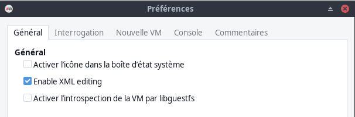{:width="400"}
5. Restaurer les configurations de VM  
`sudo cp ~/virtuel/etc-libvirt-qemu/*.xml /etc/libvirt/qemu/`

Résumé - Installation complète avec outis

    sudo pacman -Syu --needed virt-manager qemu-desktop libvirt edk2-ovmf dnsmasq vde2 bridge-utils iptables-nft dmidecode swtpm libguestfs guestfs-tools

Activer "Enable XML editing" dans Préférences , Général  
Créer un pool "yannick"  
Désactiver au démarrage le pool default  


**Déclarer le pont (bridge) à KVM**
Créer un fichier de définition de réseau au format XML : `nano router-tenda.xml`

```xml
<network>
  <name>router-tenda</name>
  <forward mode="bridge"/>
  <bridge name="bridge0" />
</network>
```

Appliquer la configuration :

```bash
sudo virsh net-define router-tenda.xml # -> Réseau host-tenda défini depuis router-tenda.xml
sudo virsh net-start router-tenda # -> Réseau router-tenda démarré
sudo virsh net-autostart router-tenda # -> Réseau router-tenda marqué en démarrage automatique
```

Vérification

    sudo virsh net-list --all

```
 Nom            État      Démarrage automatique   Persistant
--------------------------------------------------------------
 default        inactif   non                     oui
 router-tenda   actif     oui                     oui
```

La structure libvirt

```
# Les configurations xml
[root@pc1 yann]# tree -L 2 /etc/libvirt/qemu
/etc/libvirt/qemu
├── autostart
│   └── vm-debian12.xml -> /etc/libvirt/qemu/vm-debian12.xml
├── EndeavourOS.xml
├── networks
│   ├── autostart
│   ├── default.xml
│   └── router-tenda.xml
└── win11.xml

# les images sous KVM
[yann@pc1 ~]$ tree -L 2 ~/virtuel/
/home/yann/virtuel/
├── eos
│   └── eos-chiffre_luks_backup.bin
├── KVM
│   ├── eos-lvm-luks-1.qcow2
│   └── wineleven.qcow2
├── KVM_SAV
│   ├── etc-libvirt-qemu
│   └── images_qcow2
└── nspawn
    └── nspbullseye
```

Pour activer la gestion des machines virtuelles distantes  
[KVM: virt-manager to connect to a remote console using qemu+ssh](https://fabianlee.org/2019/02/16/kvm-virt-manager-to-connect-to-a-remote-console-using-qemussh/)  
Saisir la commande suivante

    virt-manager -c 'qemu+ssh://yick@192.168.0.205:55205/system?keyfile=/home/yann/.ssh/yick-ed25519'

Ensuite ouvrir le "Gestionnaire de machines virtuelles"  
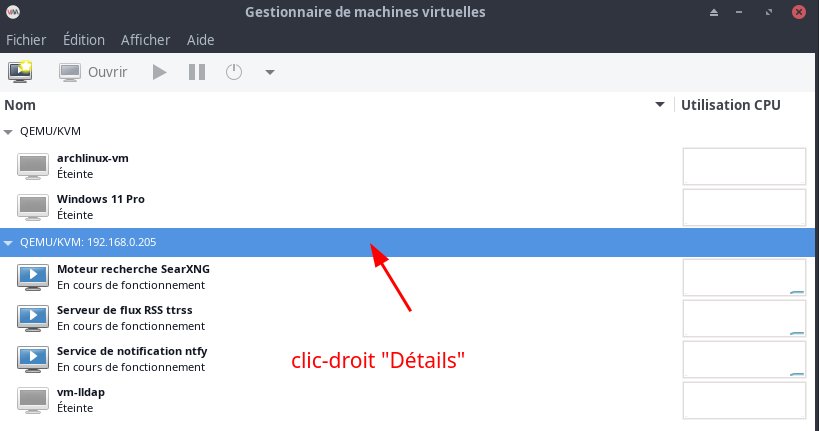  
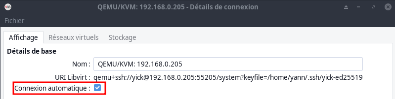  

## Développement

### Wing personal python IDE

**Wing personal python IDE** &rarr; [Téléchargement](https://wingware.com/downloads/wing-personal) 

```
# Décompression de la version téléchargée
tar xjvf wing-personal-10.0.6.0-linux-x64.tar.bz2
# Passage en root
sudo -s
# Lancement procédure installation
cd wing-personal-10.0.6.0-linux-x64
./wing-install.py
```

Déroulement de la commande 

```
Where do you want to install the support files for Wing Personal (default
     = /usr/local/lib/wing-personal9)? 
/usr/local/lib/wing-personal10 does not exist, create it (y/N)? y
Where do you want to install links to the Wing Personal startup scripts
     (default = /usr/local/bin)? 
[...]
Writing file-list.txt
Icon/menu install returned err=0
Done installing.  Make sure that /usr/local/bin is in your path and type
     "wing-personal10" to start Wing Personal.
```

Effacer les fichiers

```
# Suppression dossier et fichier
cd ..
rm -rf wing-personal*
# sortie root
exit
```

Installer python pip pipx

    yay -S python-pip python-pipx

### Go

Archlinux Go

    yay -S go
    go version

*go version go1.23.3 linux/amd64*

### NodeJS et nvm

Archlinux Node.js npm

    yay -S nodejs npm
    node --version && npm --version

v23.1.0  
10.9.0  

NVM, également appelé « Node Version Manager », est un outil utilisé pour installer et gérer plusieurs versions de Node.js sur le système.  
Installer la dernière version de NVM à l'aide de la commande suivante  

    curl -o- https://raw.githubusercontent.com/nvm-sh/nvm/v0.39.2/install.sh | bash
    source ~/.bashrc

Vérifier

    nvm --version

*0.39.2*

**Installer Node.js avec NVM**  
Pour lister toutes les versions disponibles Node.js 

    nvm list-remote

Vous obtiendrez une liste de toutes les versions

```
        v22.9.0
       v22.10.0
       v22.11.0   (Latest LTS: Jod)
        v23.0.0
        v23.1.0
        v23.2.0
        v23.3.0
```

Pour installer la dernière version de Node.js  
`nvm install node`

Pour installer la dernière version stable de Node.js  
`nvm install --lts`

Pour installer une version spécifique de Node.js  
`nvm install 23.2.0`

Pour lister toutes les versions installées de Node.js  
`nvm ls`

Pour modifier la version Node.js par défaut à 19.0.0  
`nvm utilisation 23.2.0`

## Base de données

*Dbeaver gestionnaire de bases de données MariaDB, PostgreSQL et Sqlite*

### Dbeaver 

*DBeaver est basé sur le framework Eclipse, il est open source et il supporte plusieurs types de serveurs de bases de données comme : MySQL, SQLite, DB2, PostgreSQL, Oracle...*

Version java installée : `java --version`

```
openjdk 23 2024-09-17
OpenJDK Runtime Environment (build 23)
OpenJDK 64-Bit Server VM (build 23, mixed mode, sharing)
```

Installation

    yay -S dbeaver

```
Sync Explicit (1): dbeaver-24.2.1-1
résolution des dépendances…
:: Il y a 6 fournisseurs disponibles pour java-runtime>=17 :
:: Dépôt extra
   1) jdk-openjdk  2) jdk17-openjdk  3) jdk21-openjdk  4) jre-openjdk  5) jre17-openjdk  6) jre21-openjdk

Entrer un nombre (par défaut, 1 est sélectionné): 1
```

### MariaDB 

[MariaDB archlinux](/posts/MariaDB-sur-Debian-Stretch/#archlinux)

Résumé des commandes en mode su

```shell
pacman  -S mariadb
mysql_install_db --user=mysql --basedir=/usr --datadir=/var/lib/mysql
systemctl enable mariadb --now
systemctl status --no-pager --full mariadb 
```

Sécuriser

    sudo mysql_secure_installation

`Valider tous les choix par défaut SAUF le changement de mot de passe (n)`{: .prompt-info }

Dbeaver accès refusé  
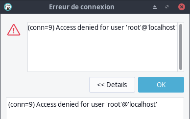{:width="300"}

Correction en mode su

Ouvrir MariaDB

```bash
sudo -s
mysql -u root
```

Exécuter le sql : `SELECT host, user, password FROM mysql.user;`  
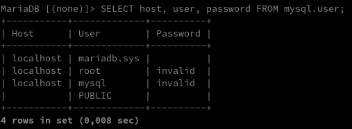  
Si le mot de passe de votre compte root est invalide (ou autre chose que la cellule vide)  
Définir le mot de passe : `ALTER USER 'root'@'localhost' IDENTIFIED BY 'Mot_passe_root_MariaDB';`  
Vérifier : `SELECT host, user, password FROM mysql.user;`  
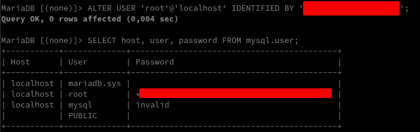  
Sortie : `exit;`

## Sauvegardes

### Sauvegardes locales

[Sauvegardes locales avec systemd utilisateur service et timer](/posts/Sauvegardes_locales_avec_systemd_utilisateur_service_et_timer/)

La sauvegarde démarre 3 minutes après la mise sous tension de PC1

Les logs : `journalctl --user -u savyann.service`  
Liste des timers : `systemctl --user list-timers --all`

### BorgBackup

BorgBackup est installé et fonctionnel en local 

Fichiers contenant les paramètres pour une exécution de borg

Dépôt distant : ~/sharenfs/pc1/.borg/pc1.repository  
Passphrase: ~/sharenfs/pc1/.borg/pc1.passphrase  
Exclusions: ~/sharenfs/pc1/.borg/pc1.exclusions  

Pour une utilisation avec un stockage distant , il faut créer un jeu de clé  

1. [Créer utilisateur borg](/posts/BorgBackup_entre_serveurs/#créer-utilisateur-borg-1)
2. [Clés ssh borg](/posts/BorgBackup_entre_serveurs/#clés-ssh-borg-1)
3. [Ajout clé publique borg à la boîte de stockage](/posts/BorgBackup_entre_serveurs/#ajout-clé-publique-au-serveur-borg)

## Maintenance

### Changer Nvme ou SSD chiffré

Remplacer M.2 2280 NVMe 1To par une 2To  


Boot sur usb live EndeavourOS  

Passer en mode su

Les partitions du disque chiffré nvme0n1

```
nvme0n1              259:0    0 931.5G  0 disk  
├─nvme0n1p1          259:1    0   512M  0 part  
├─nvme0n1p2          259:2    0   920G  0 part  
│ └─crypttemp        254:3    0   920G  0 crypt 
│   ├─vg0-lvroot     254:4    0    70G  0 lvm   
│   ├─vg0-lvhome     254:5    0   120G  0 lvm   
│   └─vg0-lvmedia    254:6    0   600G  0 lvm   
└─nvme0n1p3          259:3    0    11G  0 part  
```

Déchiffrer la partition nvme0n1p2

    cryptsetup luksOpen /dev/nvme0n1p2 crypttemp

Créer et monter le système à sauvegarder sur /media

```shell
mkdir -p /media
mkdir -p /media/home
mkdir -p /media/efi
mount /dev/vg0/lvroot /media
mount /dev/vg0/lvhome /media/home
mount /dev/nvme0n1p1 /media/efi
```

Monter le système qui va recevoir la sauvegarde

```shell
mount /dev/vg-nas-one/sav /mnt
mkdir -p /mnt/pc1
mkdir -p /mnt/pc1/efi
mkdir -p /mnt/pc1/home
```

Sauvegarder le système actuel (racine,home et efi)

    rsync -avA /media/ /mnt/pc1

Patienter plusieurs minutes, suivant la taille

Arrêter la machine PC1

Remplacer la carte SSD M2  
Redémarrer la machine sur un USB Live EndeavourOS

Zapper le nouveau disque SSD M.2    

    sgdisk --zap-all /dev/nvme0n1

Partitionnement du disque NVME 2To GPT + LVM

    gdisk /dev/nvme0n1

Créer 2 partitions  
Partition 1 : 512M EFI (code ef00) système de fichier FAT32  
Partition 2 : le reste LVM (code 8e00) système de fichier EXT4  

Formater partition EFI

    mkfs.fat -F32 /dev/nvme0n1p1

Chiffrer la partition /dev/nvme0n1p2

    cryptsetup luksFormat --type luks2 /dev/nvme0n1p2

Ouvrir la partition chiffrée

    cryptsetup luksOpen /dev/nvme0n1p2 crypt

Créer LVM

    pvcreate /dev/mapper/crypt
    vgcreate vg0 /dev/mapper/crypt

Créer les volumes

```shell
lvcreate -L 60G vg0 -n lvroot   #  Logical volume "lvroot" created.
lvcreate -L 120G vg0 -n lvhome  #  Logical volume "lvhome" created.
```

Système de fichier

```shell
mkfs.ext4 -L root /dev/mapper/vg0-lvroot
mkfs.ext4 -L home /dev/mapper/vg0-lvhome
```

Monter le nouveau système sur /mnt 

```shell
mount /dev/mapper/vg0-lvroot /mnt
mkdir -p /mnt/home
mount /dev/mapper/vg0-lvhome /mnt/home
mkdir -p /mnt/efi
mount /dev/nvme0n1p1 /mnt/efi
```

Monter la sauvegarde sur media

    mount /dev/vg-nas-one/sav /media

Restaurer le système

    rsync -avA /media/pc1/ /mnt

Patienter plusieurs minutes, suivant la taille

Création volume logique LVM media et montage

```shell
lvcreate -L 800G vg0 -n lvmedia
mkfs.ext4 -L media /dev/mapper/vg0-lvmedia

mkdir -p /mnt/srv/media
mount /dev/vg0/lvmedia /mnt/srv/media
```

Restaurer la sauvegarde multimedia

    rsync -avA /media/pc1_20240201/media/srv/media/ /mnt/srv/media

Démonter le système de sauvegarde

    umount /media

Ajouter un fichier de clé existant LUKS

    cryptsetup luksAddKey /dev/nvme0n1p2 /mnt/crypto_keyfile.bin  

Il faut saisir le phrase mot de passe

Configuration /etc/crypttab

    cryptsetup luksUUID /dev/nvme0n1p2

Renvoie  UUID  ae37e59d-35f7-4920-8428-be8be8d15243

Modifier /mnt/etc/crypttab

Contenu

```
# <name>               <device>                         <password> <options>
cryptlvm UUID=ae37e59d-35f7-4920-8428-be8be8d15243 /crypto_keyfile.bin luks
```

Passer en chroot

    arch-chroot /mnt

Relever les UUID

    blkid -s UUID -o value /dev/mapper/vg0-lvroot

renvoie l’UUID du volume racine : 2a6cab35-6c52-4382-9aee-06a376a8acc0

    blkid -s UUID -o value /dev/mapper/vg0-lvhome

renvoie l’UUID du volume d’accueil : b4e52069-a8c9-459e-b39f-6ac1b682b0d6

    blkid -s UUID -o value /dev/mapper/vg0-lvmedia

renvoie l’UUID du volume media : 1ca4bfc7-3d31-4859-aeb3-656214fab490

    blkid -s UUID -o value /dev/nvme0n1p1

renvoie l’UUID du volume media : E5E4-A4AE


Configurer /etc/fstab

    nano /etc/fstab

```
UUID=E5E4-A4AE                            /efi           vfat    defaults,noatime 0 2
tmpfs                                     /tmp           tmpfs   defaults,noatime,mode=1777 0 0
UUID=2a6cab35-6c52-4382-9aee-06a376a8acc0 / ext4 defaults,acl,noatime,discard 0 0
UUID=b4e52069-a8c9-459e-b39f-6ac1b682b0d6 /home ext4 defaults,acl,noatime,discard 0 0
/swapfile                                 none  swap defaults,pri=-2 0 0

# /dev/mapper/vg0-lvmedia
UUID=86a7c58c-8f30-42e2-bd39-d1ae7464c837 	/srv/media      ext4            rw,relatime     0 2

# /dev/mapper/ssd--512-virtuel
UUID=84bc1aa9-23ac-4530-b861-bc33171b7b42       /virtuel    ext4        defaults        0 2

# /dev/mapper/vg--nas--one-sav
UUID=c5b9eefc-1daa-4a0d-8a72-6169b3c8c91f       /sauvegardes    ext4            defaults        0 2

# /dev/vg-nas-one/iso - Volume logique 200G du disque 4To
UUID=58f4b6c7-3811-41d5-9964-f47ac32375f6           /iso        ext4            defaults        0 2
```

options du noyau

```shell
blkid -s UUID -o value /dev/nvme0n1p2 # --> ae37e59d-35f7-4920-8428-be8be8d15243
```

Modifier /etc/kernel/cmdline 

    nano /etc/kernel/cmdline

```
nvme_load=YES nowatchdog rw rd.luks.uuid=ae37e59d-35f7-4920-8428-be8be8d15243 root=/dev/mapper/vg0-lvroot
```

Réinstaller noyau

    reinstall-kernels

Sortie du chroot , retirer la clé USB Live et reboot de la machine 

### Mise à jour , si erreur de paquet ou signature PGP

En cas d'erreur de paquet ou signature PGP 

    sudo pacman -S endeavouros-keyring archlinux-keyring

Mise à jour impossible avec des erreurs de téléchargement

    sudo rm -r /var/cache/pacman/pkg/*

### Etat des lieux

Ajouter un alias dans le fichier `~/.bashrc`

    alias etat='$HOME/scripts/etat_des_lieux.sh'

Recharger et exécuter

    source ~/.bashrc
    etat

### Ajout disque LVM

Exemple disque SSD 120Go

Disque sda

    lsblk

```
NAME                 MAJ:MIN RM   SIZE RO TYPE  MOUNTPOINTS
sda                    8:0    0 111,8G  0 disk  
```

**gdisk**

    sudo gdisk /dev/sda

o : nouvelle partion dos  
n : nouvelle partition typt LVM 8e00  

Format fichier ext4 

    sudo mkfs.ext4 /dev/sda1

**LVM** (Logical Volume Manager, ou gestionnaire de volumes logiques en français) permet la création et la gestion de volumes logiques sous Linux. L'utilisation de volumes logiques remplace en quelque sorte le partitionnement des disques.

Volume physique : `sudo pvcreate /dev/sda1`  
GroupevVolumes  : `sudo vgcreate ssd-120 /dev/sda1`  
Volume logique  : `sudo lvcreate -n lv120 -l +100%FREE ssd-120`  
Fichier ext4    : `sudo mkfs.ext4 /dev/ssd-120/lv120`  

Relever UUID `sudo blkid |grep lv120`

```
/dev/mapper/ssd--120-lv120: UUID="6b48e98c-9b85-461b-9371-040765aae682" BLOCK_SIZE="4096" TYPE="ext4"
```

Création point de montage

    sudo mkdir -p /mnt/ssd

Ajouter les lignes suivantes au fichier **/etc/fstab**  

```
# /dev/mapper/ssd--120-lv120
UUID=6b48e98c-9b85-461b-9371-040765aae682 	/mnt/ssd    ext4    	defaults	0 2
```

Rechargement et montage

    sudo systemctl daemon-reload
    sudo mount -a

Vérification : `df -h /mnt/ssd/`

```
Sys. de fichiers           Taille Utilisé Dispo Uti% Monté sur
/dev/mapper/ssd--120-lv120   110G    2,1M  104G   1% /mnt/ssd
```

Droits en écriture à l'utilisateur

    sudo chown $USER:$USER /mnt/ssd/

### Outil cockpit

[Administrer sa machine avec Cockpit (Fedora, Red Hat et dérivées)](https://www.linuxtricks.fr/wiki/administrer-sa-machine-avec-cockpit-fedora-red-hat-et-derivees)

Installation

    yay -S cockpit cockpit-storaged cockpit-machines

Gestion par interface web <https://cockpit.rnmkcy.eu>  
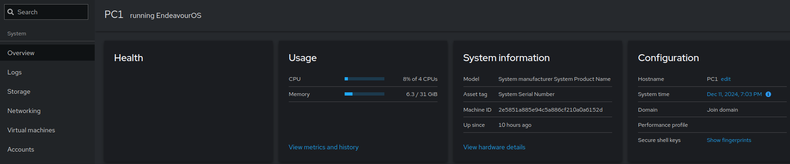

`Liaison SSH avec clés entre le interface web cockpit et la machine PC1`{: .prompt-info }

### DNS - Configuration manuelle du fichier /etc/resolv.conf

*Un serveur DNS Unbound est en service sur le serveur cwwk debian 12 à l'adresse 192.168.0.205*

Par défaut, NetworkManager met à jour dynamiquement le fichier /etc/resolv.conf avec les paramètres DNS à partir des profils de connexion NetworkManager actifs. Cependant, vous pouvez désactiver ce comportement et configurer manuellement les paramètres DNS dans /etc/resolv.conf.

Procédure

En tant qu'utilisateur racine, créez le fichier `/etc/NetworkManager/conf.d/90-dns-none.conf` avec le contenu suivant en utilisant un éditeur de texte 

```
[main]
dns=none
```

Redémarrer le service 

    sudo systemctl restart NetworkManager

Supprimer le commentaire généré par NetworkManager de `/etc/resolv.conf` pour éviter toute confusion

```
nameserver 192.168.0.205
nameserver 1.1.1.1
nameserver 9.9.9.9
```

Rechargez le service NetworkManager :

    sudo systemctl reload NetworkManager

Affiche le fichier /etc/resolv.conf 

    cat /etc/resolv.conf

*Si vous avez désactivé le traitement DNS avec succès, NetworkManager n'a pas remplacé les paramètres configurés manuellement.*

Vérifier si le serveur DNS est pris en compte: `dig xoyize.xyz`  


Le réseau local cwwk.home.arpa: `dig cwwk.home.arpa`  
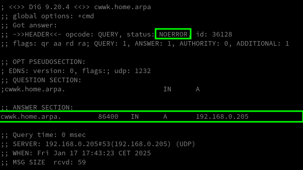

### Connexion réseau 192.168.70.0/24

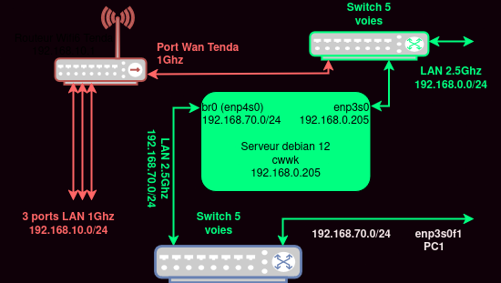  

Modifier le réseau via NetworkManager le port ethernet **enp3s0f0**   
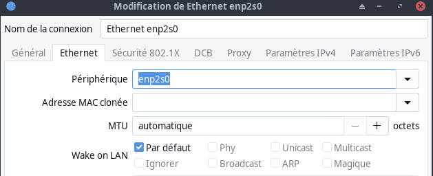{:width="300"}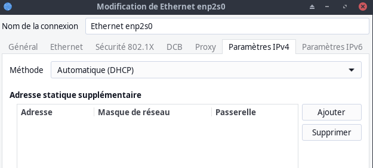{:width="300"}

Les routes: `ip a`

```
default via 192.168.0.254 dev enp2s0 proto dhcp src 192.168.0.20 metric 101 
default via 192.168.70.1 dev enp3s0f0 proto dhcp src 192.168.70.13 metric 102 
default via 192.168.10.1 dev bridge0 proto dhcp src 192.168.10.70 metric 425 
192.168.0.0/24 dev enp2s0 proto kernel scope link src 192.168.0.20 metric 101 
192.168.10.0/24 dev bridge0 proto kernel scope link src 192.168.10.70 metric 425 
192.168.70.0/24 dev enp3s0f0 proto kernel scope link src 192.168.70.13 metric 102 
```

### Liens issus de la VM ttrss

Dans la machine virtuelle ttrss, création d'un fichier markdown de liens remarquables [(Liens - ttrss.md)](/posts/KVM-Alpine-Linux/#liens---ttrssmd)

Importation du fichier ttrss.md dans le générateur statique   
Script `$HOME/scripts/articles_remarquables_ttrss`

<details>
<summary><b>Etendre Réduire</b></summary>
  
#!/bin/bash
set -euo pipefail
trap 'echo "Une erreur est survenue."; exit 1' ERR

echo "Connexion SSH VM Alpine ttrss"
echo "Importation fichier ttrss.md dans /tmp/"
scp -o ProxyCommand="ssh -W %h:%p -p 55205 -i /home/yann/.ssh/yick-ed25519 yick@192.168.0.205" -i /home/yann/.ssh/ttrss_alpine-vm  -P 55217 aluser@192.168.100.60:/home/aluser/ttrss.md /tmp/
LIENS_TTRSS="/tmp/liens_ttrss.md"
echo "Création fichier $LIENS_TTRSS"
cat << EOF > $LIENS_TTRSS
---
layout: article
titles: Liens ttrss au format HTML
---

/ lang="fr">
  <body>
<head>
  <meta charset="utf-8">
  <title>Doc Html</title>
</head>
    <div class="search-bar">
      <div class="search-box js-search-box">
        <input type="text" id="saisie-recherche" onkeyup="rechercheFonction()" placeholder="Rechercher..." title="Saisir" autofocus>
      </div>
    </div>
<ul id="articlesTTRSS">
EOF
echo "Ajout des liens /tmp/ttrss.md"
cat /tmp/ttrss.md >> $LIENS_TTRSS
echo "Ajout Javascript"
cat << EOF >> $LIENS_TTRSS
</ul>

  <button onclick="topFunction()" id="myBtn" title="Haut de page">&uarr;</button>
	<script>
	//Get the button
	var mybutton = document.getElementById("myBtn");
	
	// When the user scrolls down 20px from the top of the document, show the button
	window.onscroll = function() {scrollFunction()};

	function scrollFunction() {
	  if (document.body.scrollTop > 20 || document.documentElement.scrollTop > 20) {
	    mybutton.style.display = "block";
	  } else {
	    mybutton.style.display = "none";
	  }
	}
	
	// When the user clicks on the button, scroll to the top of the document
	function topFunction() {
	  document.body.scrollTop = 0;
	  document.documentElement.scrollTop = 0;
	}


	function rechercheFonction() {
	    var input, filter, ul, li, a, i, txtValue;
	    input = document.getElementById("saisie-recherche");
	    filter = input.value.toUpperCase();
	    ul = document.getElementById("articlesTTRSS");
	    li = ul.getElementsByTagName("li");
	    for (i = 0; i < li.length; i++) {
	        a = li[i].getElementsByTagName("a")[0];
	        txtValue = a.textContent || a.innerText;
	        if (txtValue.toUpperCase().indexOf(filter) > -1) {
	            li[i].style.display = "";
	        } else {
	            li[i].style.display = "none";
	        }
	    }
	}
	// Cacher le champ de recherche
	var mysearchbox = document.getElementById("searchbox");
	mysearchbox.style.visibility = "hidden";
	</script>
  </body>
</>
EOF
echo "Copier le fichier liens_ttrss.md dans le dossier yannstatic"
echo "cp $LIENS_TTRSS /srv/media/yannstatic/liens_ttrss.md"
cp $LIENS_TTRSS /srv/media/yannstatic/liens_ttrss.md


</details>


Créer un alias **ttrss** dans le fichier `$HOME/.bashrc`

```bash
alias ttrss='bash /home/yann/scripts/articles_remarquables_ttrss'
```

Activer

    source $HOME/.bashrc

### Navigateur LibreWolf

[Navigateur LibreWolf](/posts/Navigateur_LibreWolf/)
