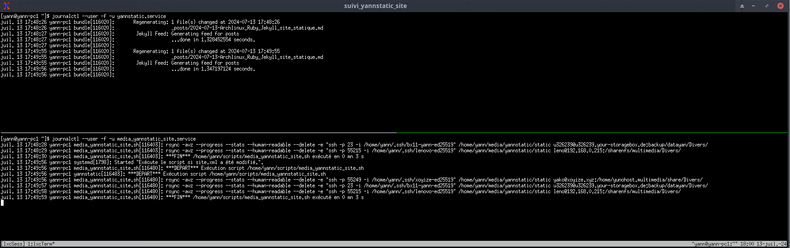

+++
title = 'Archlinux Ruby + Jekyll + générateur site statique (yannstatic, chirpy)'
date = 2025-06-25
categories = jekyll
+++
*Jekyll  est un générateur de sites statiques (Static Site Generators - SSG) open source gratuit qui s’appuie sur le langage de programmation Ruby.*

## Site statique

{:height="50" .normal}  

### Option A - Ruby (CHOIX PAR DEFAUT)

#### Installation ruby

Utilisez le gestionnaire de packages Arch Linux pacman pour mettre à jour votre système 

    sudo pacman -Syu

Ensuite, utilisez pacman à nouveau pour installer les packages rubyet base-devel 

```bash
sudo pacman -S ruby ruby-erb # base-devel installé par défaut
```
{: .nolineno }

Ruby et Gem sont installés 

```
[yann@PC1 ~]$ ruby -v
ruby 3.3.5 (2024-09-03 revision ef084cc8f4) [x86_64-linux]
[yann@PC1 ~]$ gem -v
3.5.16
```

#### Installation des gemmes 

Lorsqu'il s'agit d'installer des gemmes, il existe au moins les trois manières suivantes d'installer des gemmes sur Arch Linux :

*    `bundle install` stocke des versions spécifiques de gemmes pour chaque projet Ruby on Rails.
*   `gem install` stocke les versions spécifiques de Ruby des gemmes stockées sur votre machine locale.
*    `pacman -S ruby-GEM_NAME` stocke les gemmes dans tout le système, pour tous les utilisateurs.

Installer Jekyll et Bundler

    gem install jekyll bundler

Résultat

```
WARNING:  You don't have /home/yann/.local/share/gem/ruby/3.3.0/bin in your PATH,
	  gem executables will not run.

Successfully installed bundler-2.5.23
31 gems installed
```

On ajoute le path .bashrc

```bash
export PATH="$HOME/.local/share/gem/ruby/3.3.0/bin:$PATH"
export GEM_HOME="$HOME/.local/share/gem/ruby/3.3.0/gems"
```
{: .nolineno }

Valider

    source $HOME/.bashrc

Les versions installées : `ruby -v && gem -v && bundle -v && jekyll -v`  

```
[yann@PC1 ~]$ ruby -v
ruby 3.3.5 (2024-09-03 revision ef084cc8f4) [x86_64-linux]
[yann@PC1 ~]$ gem -v
3.5.16
[yann@PC1 ~]$ bundle -v
Bundler version 2.5.23
[yann@PC1 ~]$ jekyll -v
jekyll 4.3.4
```

Environnement gem: `gem env`

```
RubyGems Environment:
  - RUBYGEMS VERSION: 3.5.16
  - RUBY VERSION: 3.3.5 (2024-09-03 patchlevel 100) [x86_64-linux]
  - INSTALLATION DIRECTORY: /home/yann/.local/share/gem/ruby/3.3.0/gems
  - USER INSTALLATION DIRECTORY: /home/yann/.local/share/gem/ruby/3.3.0
  - RUBY EXECUTABLE: /usr/bin/ruby
  - GIT EXECUTABLE: /usr/bin/git
  - EXECUTABLE DIRECTORY: /home/yann/.local/share/gem/ruby/3.3.0/gems/bin
  - SPEC CACHE DIRECTORY: /home/yann/.cache/gem/specs
  - SYSTEM CONFIGURATION DIRECTORY: /etc
  - RUBYGEMS PLATFORMS:
     - ruby
     - x86_64-linux
  - GEM PATHS:
     - /home/yann/.local/share/gem/ruby/3.3.0/gems
     - /home/yann/.local/share/gem/ruby/3.3.0
     - /usr/lib/ruby/gems/3.3.0
  - GEM CONFIGURATION:
     - :update_sources => true
     - :verbose => true
     - :backtrace => true
     - :bulk_threshold => 1000
     - "gem" => "--user-install"
  - REMOTE SOURCES:
     - https://rubygems.org/
  - SHELL PATH:
     - /home/yann/.local/share/gem/ruby/3.3.0/bin
     - /usr/local/bin
     - /usr/bin
     - /bin
     - /usr/local/sbin
     - /usr/lib/jvm/default/bin
     - /usr/bin/site_perl
     - /usr/bin/vendor_perl
     - /usr/bin/core_perl
```

### Option B - Ruby rbenv

Cela vous permettra d'utiliser la dernière version de rbenv sans avoir besoin d'une installation sur l'ensemble du système.

Clonez rbenv dans ~/.rbenv.

```shell
git clone https://github.com/rbenv/rbenv.git ~/.rbenv
```
{: .nolineno }

Ajouter `eval "$(rbenv init -)"` à la fin du fichier `~/.bashrc`

```shell
echo 'export PATH="$HOME/.rbenv/bin:$PATH"' >> ~/.bashrc
echo 'eval "$(rbenv init - --no-rehash bash)"' >> ~/.bashrc
source ~/.bashrc
```
{: .nolineno }

rbenv peut être étendu via un système de plugins, et le wiki de rbenv inclut une liste de plugins utiles. Le plugin ruby-build est particulièrement utile, car il vous permet d'installer des versions de Ruby avec la commande rbenv install. Vous pouvez installer ruby-build depuis l'AUR.

```shell
yay -S ruby-build
```
{: .nolineno }

Les versions `rbenv install -l`

```
3.0.6
3.1.4
3.2.2
jruby-9.4.2.0
mruby-3.2.0
picoruby-3.0.0
truffleruby-22.3.1
truffleruby+graalvm-22.3.1

Only latest stable releases for each Ruby implementation are shown.
Use 'rbenv install --list-all / -L' to show all local versions.
```

`Ne pas installer de version ruby 3.2.x et + car incompatible avec Jekyll`{: .prompt-warning }

On installe la 3.1.4

```shell
rbenv install 3.1.4
```
{: .nolineno }

Patienter quelques minutes...

```
==> Installed ruby-3.1.4 to /home/yann/.rbenv/versions/3.1.4

NOTE: to activate this Ruby version as the new default, run: rbenv global 3.1.4
```

Activation

```shell
rbenv global 3.1.4
```
{: .nolineno }

#### Jekyll

{: .normal}   
[Tutoriel Jekyll : Comment créer un site web statique](https://kinsta.com/fr/blog/site-statique-jekyll/) 

Évitez d'installer les paquets RubyGems (appelés gems) en tant qu'utilisateur root. A la place, mettez en place un répertoire d'installation des gems pour votre compte utilisateur. Les commandes suivantes ajouteront des variables d'environnement à votre fichier ~/.bashrc pour configurer le chemin d'installation des gems 

```bash
echo '# Install Ruby Gems to ~/gems' >> ~/.bashrc
echo 'export GEM_HOME="$HOME/gems"' >> ~/.bashrc
echo 'export PATH="$HOME/gems/bin:$PATH"' >> ~/.bashrc
source ~/.bashrc
```
{: .nolineno }

Enfin, installez Jekyll et Bundler :

    gem install jekyll bundler

Vérification

    jekyll -v

jekyll 4.3.3

## Jekyll - yannstatic

### yannstatic

Se positionner dans le dossier

    cd ~/media/yannstatic

Le fichier **_config.yml**

<details>
<summary>(Afficher/Cacher) <b>_config.yml</b></summary>


# Bienvenue à Jekyll !
#
# Ce fichier de configuration est destiné aux paramètres qui affectent l'ensemble de votre blog, des valeurs
# que vous êtes censé configurer une fois et rarement besoin de modifier par la suite.
# Pour des raisons techniques, ce fichier n'est *PAS* rechargé automatiquement lorsque vous utilisez
# 'jekyll serve'. Si vous modifiez ce fichier, veuillez redémarrer le processus de serveur.
#
# Modification octobre 2024

## => Paramètres du site
##############################
theme             : jekyll-text-theme
text_skin         : dark                          # "default" (par défaut), "dark", "forest", "ocean", "chocolate", "orange".
highlight_theme   : tomorrow-night-bright         # "default" (par défaut), "tomorrow", "tomorrow-night", "tomorrow-night-eighties", "tomorrow-night-blue", "tomorrow-night-bright".
url               : https://static.rnmkcy.eu      # le nom d'hôte et le protocole de base pour votre site, par exemple https://www.someone.com
baseurl           :                               # ne comprend pas le nom d'hôte
title             : YannStatic
description       : >                             # cela signifie qu'il faut ignorer les nouvelles lignes jusqu'à "Language & timezone".
  Expérimentations et tests

## => Language and Timezone
##############################
lang        : fr               # le language du site, par défaut "en"
timezone    : Europe/Paris     # voir https://en.wikipedia.org/wiki/List_of_tz_database_time_zones


## => Chemins
##############################
paths:
  root    : # title link url, "/" (default)
  home    : # home layout url, "/" (default)
  archive : # "/archive.html" (default)
  rss     : # "/feed.xml" (default)


## => Post
##############################
## excerpt
excerpt_separator: 

## license
license: # "CC-BY-4.0", "CC-BY-SA-4.0", "CC-BY-NC-4.0", "CC-BY-ND-4.0"

## TOC
toc:
  selectors: h1,h2,h3 # "h1,h2,h3" (default)


## => Paginate
##############################
paginate: 10
## paginate_path: /page:num # don't change this unless for special need


## => Sources
##############################
sources:            # bootcdn (default), unpkg


## => Recherche
##############################
search:
  provider: "custom" # "default" (default), false, "custom"

## => Build
##############################
markdown    : kramdown
highlighter : rouge
permalink   : date

# http://jekyllrb.com/docs/configuration/options/
exclude: [LISEZMOI.md,.jekyll-cache/,.git/,Gemfile,Gemfile.lock,static]
include: [search.json]

defaults:
  - scope:
      path: ""
      type: posts
    values:
      layout: article
      sharing: true
      license: false # true
      aside:
        toc: true
      show_edit_on_github: true
      show_subscribe: true
      pageview: true
 

## => Plugins
##############################
plugins:
  - jekyll-feed
  - jekyll-paginate
  - jekyll-sitemap
  - jemoji



</details>

Le fichier **Gemfile** `$HOME/media/yannstatic/Gemfile`

```
source "https://rubygems.org"

# gem "github-pages", group: :jekyll_plugins
gem "jekyll-text-theme"
gem "html-pipeline"
gem "sass-embedded", "1.85.1"
```

Supprimer , si existant, le fichier Gemfile.lock

Bundle lit le fichier **Gemfile**

    bundle install # Patientez ...

```
Bundle complete! 3 Gemfile dependencies, 51 gems now installed.
Use `bundle info [gemname]` to see where a bundled gem is installed.
```

Info sur jekyll et créer un lien

    bundle info jekyll

```
  * jekyll (4.3.4)
	Summary: A simple, blog aware, static site generator.
	Homepage: https://jekyllrb.com
	Source Code: https://github.com/jekyll/jekyll
	Changelog: https://github.com/jekyll/jekyll/releases
	Bug Tracker: https://github.com/jekyll/jekyll/issues
	Path: /home/yann/.local/share/gem/ruby/3.3.0/gems/jekyll-4.3.4
	Reverse Dependencies: 
		jekyll-feed (0.17.0) depends on jekyll (>= 3.7, < 5.0)
		jekyll-sitemap (1.4.0) depends on jekyll (>= 3.7, < 5.0)
		jekyll-text-theme (2.2.6) depends on jekyll (>= 3.6, < 5.0)
		jemoji (0.13.0) depends on jekyll (>= 3.0, < 5.0)
```

Création des liens sur les dossiers **files** , **images** , **_posts** et **htmldoc**

```bash
ln -s /srv/media/statique/images /srv/media/yannstatic/images
ln -s /srv/media/statique/files /srv/media/yannstatic/files
ln -s /srv/media/statique/_posts /srv/media/yannstatic/_posts
ln -s /srv/media/statique/htmldoc /srv/media/yannstatic/htmldoc
ln -s /srv/media/statique/htmldoc/htmldoc.md /srv/media/yannstatic/htmldoc.md
```

La structure  des liens : `ls -l $HOME/media/yannstatic/ |grep ^l`

```
lrwxrwxrwx   1 yann yann    25 21 nov.  11:55 files -> /srv/media/statique/files
lrwxrwxrwx   1 yann yann    27 21 nov.  11:55 htmldoc -> /srv/media/statique/htmldoc
lrwxrwxrwx   1 yann yann    38 21 nov.  11:55 htmldoc.md -> /srv/media/statique/htmldoc/htmldoc.md
lrwxrwxrwx   1 yann yann    26 21 nov.  11:55 images -> /srv/media/statique/images
lrwxrwxrwx   1 yann yann    26 21 nov.  11:55 _posts -> /srv/media/statique/_posts
```

### Génération dossier "static"

Création du dossier  **static** , par défaut c'est **_site**

    cd ~/media/yannstatic
    bundle exec jekyll build --source "/srv/media/yannstatic" --destination "/srv/media/yannstatic/static"

```
Configuration file: /srv/media/yannstatic/_config.yml
            Source: /srv/media/yannstatic
       Destination: /srv/media/yannstatic/static
 Incremental build: disabled. Enable with --incremental
      Generating... 
       Jekyll Feed: Generating feed for posts
                    done in 16.146 seconds.
 Auto-regeneration: disabled. Use --watch to enable.
```

**Service yannstatic**  

`On veut générer un dossier nommé 'static'`{: .prompt-tip }

PATH Jekyll : `which bundle` &rarr; `/home/yann/.local/share/gem/ruby/3.3.0/bin/bundle`  

Pour lancer le serveur **yannstatic** au démarrage, utilisation d'un <u>service systemd utilisateur</u>  

Les variables environnement, générer le fichier

    env > /srv/media/yannstatic/.env_file

Création d'un service utilisateur "yannstatic" sous systemd

    mkdir -p ~/.config/systemd/user
    nano ~/.config/systemd/user/yannstatic.service

Contenu du fichier `yannstatic.service`

```ini
[Unit]
Description=service yannstatic

[Service]
EnvironmentFile=/srv/media/yannstatic/.env_file
WorkingDirectory=/srv/media/yannstatic
ExecStart=/home/yann/.local/share/gem/ruby/3.3.0/bin/bundle exec jekyll build --watch --incremental --source "/srv/media/yannstatic" --destination "/srv/media/yannstatic/static"
Restart=on-abort

[Install]
WantedBy=default.target
```
{: .nolineno }

Lancer le service  **yannstatic** :

```bash
systemctl --user daemon-reload
systemctl --user start yannstatic
```
{: .nolineno }

Vérifier

    systemctl --user status yannstatic

```bash
● yannstatic.service - service yannstatic
     Loaded: loaded (/home/yann/.config/systemd/user/yannstatic.service; disabled; preset: enabled)
     Active: active (running) since Sat 2024-07-13 17:41:11 CEST; 5s ago
 Invocation: 3ca89242aa6c4c3ab221b4f44a7d9cc1
   Main PID: 116020 (bundle)
      Tasks: 1 (limit: 38321)
     Memory: 144.2M (peak: 144.2M)
        CPU: 5.638s
     CGroup: /user.slice/user-1000.slice/user@1000.service/app.slice/yannstatic.service
             └─116020 "/home/yann/gems/bin/jekyll build --watch --incremental --source /srv/media/yannstatic --destination /srv/media/yannstatic/static"

juil. 13 17:41:11 yann-pc1 systemd[1798]: Started service yannstatic.
juil. 13 17:41:12 yann-pc1 bundle[116020]: Configuration file: /srv/media/yannstatic/_config.yml
juil. 13 17:41:12 yann-pc1 bundle[116020]:             Source: /srv/media/yannstatic
juil. 13 17:41:12 yann-pc1 bundle[116020]:        Destination: /srv/media/yannstatic/static
juil. 13 17:41:12 yann-pc1 bundle[116020]:  Incremental build: enabled
juil. 13 17:41:12 yann-pc1 bundle[116020]:       Generating...
juil. 13 17:41:12 yann-pc1 bundle[116020]:        Jekyll Feed: Generating feed for posts
```

Activation

    systemctl --user enable yannstatic

dire à systemd que l’instance d’un utilisateur soit tout le temps présente, du boot au shutdown, ce qui permet d’avoir des processus (services) utilisateurs qui tournent sans avoir de session ouverte.

    sudo loginctl enable-linger $USER

Pour observer le fonctionnement du service yannstatic depuis la machine virtuelle debian

    journalctl -f --user-unit yannstatic.service

```shell
nov. 21 15:15:22 PC1 bundle[2647]: csv was loaded from the standard library, but will no longer be part of the default gems starting from Ruby 3.4.0.
nov. 21 15:15:22 PC1 bundle[2647]: You can add csv to your Gemfile or gemspec to silence this warning.
nov. 21 15:15:22 PC1 bundle[2647]: /usr/lib/ruby/3.3.0/json/common.rb:3: warning: ostruct was loaded from the standard library, but will no longer be part of the default gems starting from Ruby 3.5.0.
nov. 21 15:15:22 PC1 bundle[2647]: You can add ostruct to your Gemfile or gemspec to silence this warning.
nov. 21 15:15:23 PC1 bundle[2647]: Configuration file: /srv/media/yannstatic/_config.yml
nov. 21 15:15:23 PC1 bundle[2647]:             Source: /srv/media/yannstatic
nov. 21 15:15:23 PC1 bundle[2647]:        Destination: /srv/media/yannstatic/static
nov. 21 15:15:23 PC1 bundle[2647]:  Incremental build: enabled
nov. 21 15:15:23 PC1 bundle[2647]:       Generating...
nov. 21 15:15:23 PC1 bundle[2647]:        Jekyll Feed: Generating feed for posts
```

### Synchro serveur dossier "static"

Le but est de synchroniser le dossier **~/media/yannstatic/static** avec le(s) serveur(s) web distant(s)  
A chaque création, modification ou suppression d'un POST mardown le sous-dossier **static/** est reconstruit (`jekyll build`)  
Avec les unités de chemin, vous pouvez surveiller les fichiers et les répertoires pour certains événements. Si un événement spécifique se produit, une unité de service est exécutée, et elle porte généralement le même nom que l'unité de chemin
{: .prompt-info }

Nous allons surveiller dansle dossier */srv/media/statique/_posts/* toute modification du fichier **sitemap.xml** qui entrainera l'exécution d'un script

Dans le répertoire systemd utilisateur nous créons une unité de cheminement **media_yannstatic_site.path**

    nano ~/.config/systemd/user/media_yannstatic_site.path

```ini
[Unit]
Description=Surveiller sitemap.xml pour les changements

[Path]
PathChanged=/home/yann/media/yannstatic/static/sitemap.xml
Unit=media_yannstatic_site.service

[Install]
WantedBy=default.target
```
{: .nolineno }

Dans la section `[Path]`, `PathChanged=` indique le chemin absolu du fichier à surveiller, tandis que `Unit=` indique l'unité de service à exécuter si le fichier change. Cette unité (**media_yannstatic_site.path**) doit être lancée lorsque le système est en mode multi-utilisateur.

Ensuite, nous créons l'unité de service correspondante, **media_yannstatic_site.service**, dans le répertoire `~/.config/systemd/user/`    
Si le fichier **sitemap.xml** change (c'est-à-dire qu'il est à la fois écrit et fermé), l'unité de service suivante sera appelée pour exécuter le script spécifié :

    nano ~/.config/systemd/user/media_yannstatic_site.service

```ini
[Unit] 
Description="Exécute le script si site.xml a été modifié."

[Service]
ExecStart=/home/yann/scripts/media_yannstatic_site.sh
```
{: .nolineno }

Le script `media_yannstatic_site.sh` lance une synchronisation locale distante via rsync ssh 
<details>
<summary><b>Etendre Réduire media_yannstatic_site.sh</b></summary>  


#!/bin/bash

#++++++++++++++++++++++++++++++++++++++++++++++++++++++++++++++++++++++++++++++++++++++++++++++++++++++++++++++++++++++++++
# Modification mode rsync suivant serveur distant
# 2023-09-21 suppression ligne suivante dans fichier /home/yann/scripts/serveurs.csv
# xoyaz.xyz,/home/yunohost.multimedia/share,yann@xoyaz.xyz,55156,/home/yann/.ssh/time4vps,sudo rsync 
# 
# 2023-09-16 Liste des serveurs dans un fichier /home/yann/scripts/serveurs.csv
#
# Chaque modification du fichier site.xml dans le dossier local /home/yann/media/yannstatic/_site
# déclenche une synchronisation du dossier local  avec le dossier distant '/home/yunohost.multimedia/share/Divers/static' 
# des serveurs VPS Yunohost
# le dossier local est également sauvegardé dans le dossier 'backup/datayan/static' de la boîte de stockage
#++++++++++++++++++++++++++++++++++++++++++++++++++++++++++++++++++++++++++++++++++++++++++++++++++++++++++++++++++++++++++

# Fonction pour tester si le serveur est présent
# Host=$1 et Port=$2
# Réponse $?=0 -> OK  $?=1 -> NOK
host_ok () {
 nc -4 -d -z -w 1 $1 $2 &> /dev/null
}

synchro () {
# Synchronisation locale distante du dossier _site
host_ok $SERVER $PORT 
if [[ $? == 0 ]]
then


echo 'rsync -avz --progress --stats --human-readable --delete -e "ssh -p '$PORT' -i '$PRIVKEY'" '$REPLOC' '$USERDIS':'$REPDIS'/Divers/'
rsync -avz --progress --stats --human-readable --delete --rsync-path="$RSYNCMOD" -e "ssh -p $PORT -i $PRIVKEY" $REPLOC $USERDIS:$REPDIS/Divers/ > /dev/null

	 # Analyse résultat de la commande rsync
	 if [ ! $? -eq 0 ]; then 
		 #echo "Synchro $REPLOC avec $SERVER -> OK" | systemd-cat -t yannstatic -p info 
		 #echo "Synchro $REPLOC avec $SERVER -> OK"
	 #else 
		 echo "Synchro $REPLOC avec $SERVER -> ERREUR" | systemd-cat -t yannstatic -p emerg 
		 #echo "Synchro $REPLOC avec $SERVER -> ERREUR"
	 fi
else
    echo "Site $SERVER port $PORT Inaccessible !" | systemd-cat -t yannstatic -p emerg
    #echo "Site $SERVER port $PORT Inaccessible !"
fi

}

#*******************************************************************
#
# DEPART SCRIPT
#
#*******************************************************************

# Tester la présence du fichier
if [ ! -f /home/yann/scripts/serveurs.csv ]; then
    echo "Fichier serveurs.csv inexistant!" | systemd-cat -t yannstatic -p emerg
    exit 1
fi

# Mesure temps exécution
begin=$(date +"%s")
echo "***DEPART*** Exécution script $0"
echo "***DEPART*** Exécution script $0" | systemd-cat -t yannstatic -p info
#echo "Exécution script $0"

# Dossier local
REPLOC="/home/yann/media/yannstatic/static" 

# Synchro serveurs
while IFS="," read -r SERVER REPDIS USERDIS PORT PRIVKEY RSYNCMOD LOCAL
do
  #echo " $SERVER $REPDIS $USERDIS $PORT $PRIVKEY $RSYNCMOD $LOCAL"
 
   if [[ "$LOCAL" != "oui" ]]; then
     # non --> Opération sur des sites distants
  		synchro
   fi
done < <(tail -n +2 /home/yann/scripts/serveurs.csv)

# Calcul et affichage temps exécution
termin=$(date +"%s")
difftimelps=$(($termin-$begin))
echo "***FIN*** $0 exécuté en $(($difftimelps / 60)) mn $(($difftimelps % 60)) s" | systemd-cat -t yannstatic -p info
echo "***FIN*** $0 exécuté en $(($difftimelps / 60)) mn $(($difftimelps % 60)) s"

exit 0


</details>

Activation et lancement

    systemctl --user enable media_yannstatic_site.path
    systemctl --user start media_yannstatic_site.path

Voir le fichier journal

    journalctl --user -f -u media_yannstatic_site.service

```
nov. 21 15:24:43 PC1 media_yannstatic_site.sh[2794]: rsync -avz --progress --stats --human-readable --delete -e "ssh -p 23 -i /home/yann/.ssh/bx11-yann-ed25519" /home/yann/media/yannstatic/static u326239@u326239.your-storagebox.de:backup/datayan/Divers/
nov. 21 15:24:57 PC1 media_yannstatic_site.sh[2794]: rsync -avz --progress --stats --human-readable --delete -e "ssh -p 55215 -i /home/yann/.ssh/lenovo-ed25519" /home/yann/media/yannstatic/static leno@192.168.0.215:/sharenfs/multimedia/Divers/
nov. 21 15:24:59 PC1 media_yannstatic_site.sh[2794]: ***FIN*** /home/yann/scripts/media_yannstatic_site.sh exécuté en 0 mn 16 s
nov. 21 15:24:59 PC1 systemd[1423]: media_yannstatic_site.service: Consumed 2.193s CPU time, 16.1M memory peak.
```

On peut créer un accès graphique sur le poste archlinux 

    ~/.local/share/applications/suivi_yannstatic_site.desktop

```
[Desktop Entry]
Version=1.1
Type=Application
Name=Synchro modification site
Comment=suivi_yannstatic_site.sh
Icon=xterm-color_48x48
Exec=xterm -rv -geometry 290x40+100+150 -T suivi_yannstatic_site -e '/home/yann/scripts/suivi_yannstatic_site.sh'
Actions=
Categories=Utility;
Path=
Terminal=false
StartupNotify=false
```

Le script 

    ~/scripts/suivi_yannstatic_site.sh

```shell
#!/bin/bash    

# COLUMNSxROWS+X+Y -> xterm -geometry 400x200+100+350
# xterm -rv -geometry 150x40+100+150 -T suivi_yannstatic_site -e '/home/yann/scripts/suivi_yannstatic_site.sh'
# On supprime la session "lxcSess" si existante                         
 
if [[ `tmux list-sessions | grep 'lxcSess' | wc -l` != 0 ]]
   then  
       # On ferme la session active
       tmux kill-session -t lxcSess
fi


# Créer une bannière dans /etc/motd sur chaque serveur
# Nom du domaine en ascii voir lien http://patorjk.com/software/taag/#p=display&h=1&f=Small
echo "fin fi"
# Créer session + terminal 
tmux new  -d -s lxcSess -n lxcTerm
# Séparation horizontale en 2 du terminal
tmux split-window -v -p 50
# | 0         |
# |           |
# |-----------|
# | 1         |
# |           |
# Sélection terminal HAUT
tmux selectp -t 0
# 
tmux send-keys -t lxcSess "journalctl --user -f -u yannstatic.service" C-m
# Sélection terminal BAS
tmux selectp -t 1
#  
tmux send-keys -t lxcSess "journalctl --user -f -u media_yannstatic_site.service" C-m

# Afficher la session 
tmux a -t lxcSess
#
# Tuer la session
# tmux kill-session -t lxcSess
```

Le rendre exécutable

    chmod +x scripts/suivi_yannstatic_site.sh

Aperçu...  


## Jekyll - chirpy

* [chirpy](https://chirpy.cotes.page/)
* [jekyll-theme-chirpy (github)](https://github.com/cotes2020/jekyll-theme-chirpy)

### Configuration native

*recommandée pour les systèmes d'exploitation de type Unix*

Pour les systèmes de type Unix, vous pouvez configurer l'environnement de manière native pour des performances optimales.

1. Suivre le [guide d'installation de Jekyll(en)](https://jekyllrb.com/docs/installation/) pour installer Jekyll et vous assurer que [Git](https://git-scm.com/) est installé.
2. Cloner le dépôt sur votre machine locale: `git clone https://github.com/cotes2020/jekyll-theme-chirpy.git` 
3. Si vous avez forké le thème, installez Node.js et exécutez `bash tools/init.sh` dans le répertoire racine `$HOME/media/jekyll-theme-chirpy` pour initialiser le dépôt.
4. Exécutez la commande `bundle` à la racine de votre dépôt pour installer les dépendances.

**Générer le favicon**  
Préparez une image carrée (PNG, JPG ou SVG) d'une taille de 512x512 ou plus, puis allez à l'outil en ligne [Real Favicon Generator](https://realfavicongenerator.net/) et cliquez sur le bouton **Select your Favicon image** pour télécharger votre fichier image.

Dans la prochaine étape, la page web affichera tous les scénarios d'utilisation. Vous pouvez conserver les options par défaut, faire défiler vers le bas de la page, et cliquez sur le bouton **Generate your Favicons and HTML code** pour générer le favicon.  

**Télécharger et remplacer**  
Télécharger le paquet généré, décompresser et supprimer les deux fichiers suivants  

```
navigateurconfig.xml
site.webmanifest
```

Puis copiez les fichiers d'image restants (.PNG et .ICO) pour couvrir les fichiers originaux dans le répertoire `assets/img/favicons/` du site Jekyll.

Générer les fichiers manquants

```shell
cd assets/img/favicons/
magick web-app-manifest-512x512.png -resize 16x16 favicon-16x16.png
magick web-app-manifest-512x512.png -resize 32x32 favicon-32x32.png
magick web-app-manifest-512x512.png -resize 150x150 mstile-150x150.png
magick web-app-manifest-512x512.png -resize 192x192 android-chrome-512x512.png
cp web-app-manifest-512x512.png android-chrome-512x512.png

# A partir d'un fichier svg
magick favicon.svg -resize 512x512 android-chrome-512x512.png
magick favicon.svg -resize 512x512 web-app-manifest-512x512.png
magick favicon.svg -resize 16x16 favicon-16x16.png
magick favicon.svg -resize 32x32 favicon-32x32.png
magick favicon.svg -resize 150x150 mstile-150x150.png
magick favicon.svg -resize 180x180 apple-touch-icon.png
magick favicon.svg -resize 192x192 android-chrome-512x512.png
magick favicon.svg favicon.ico
magick favicon.svg -resize 192x192 android-chrome-192x192.png
magick favicon.svg -resize 96x96 favicon-96x96.png
```
{: .nolineno }

`La prochaine fois que vous construisez le site, le favicon sera remplacé par une édition personnalisée.`{: .prompt-tip }

### chirpy

Se positionner dans le dossier

    cd ~/media/chirpy

Le fichier **_config.yml**

<details>
<summary>(Afficher/Cacher) <b>_config.yml</b></summary>


# The Site Configuration

# Import the theme
theme: jekyll-theme-chirpy

# The language of the webpage › http://www.lingoes.net/en/translator/langcode.htm
# If it has the same name as one of the files in folder `_data/locales`, the layout language will also be changed,
# otherwise, the layout language will use the default value of 'en'.
lang: fr-FR

# Change to your timezone › https://kevinnovak.github.io/Time-Zone-Picker
timezone: Europe/Paris

# jekyll-seo-tag settings › https://github.com/jekyll/jekyll-seo-tag/blob/master/docs/usage.md
# ↓ --------------------------

title: Yann # the main title

tagline: Un thème Jekyll axé sur le texte # it will display as the subtitle

description: >- # used by seo meta and the atom feed
  Un thème Jekyll minimal, réactif et riche en fonctionnalités pour la rédaction technique.

# Fill in the protocol & hostname for your site.
# E.g. 'https://username.github.io', note that it does not end with a '/'.
url: "https://chirpy.rnmkcy.eu"

github:
  username: github_username # change to your GitHub username

twitter:
  username: twitter_username # change to your Twitter username

social:
  # Change to your full name.
  # It will be displayed as the default author of the posts and the copyright owner in the Footer
  name: Yann
  email: static@rnmkcy.eu # change to your email address
  links:
    # The first element serves as the copyright owner's link
    # - https://twitter.com/username # change to your Twitter homepage
    # - https://github.com/username # change to your GitHub homepage
    # Uncomment below to add more social links
    # - https://www.facebook.com/username
    # - https://www.linkedin.com/in/username

# Site Verification Settings
webmaster_verifications:
  google: # fill in your Google verification code
  bing: # fill in your Bing verification code
  alexa: # fill in your Alexa verification code
  yandex: # fill in your Yandex verification code
  baidu: # fill in your Baidu verification code
  facebook: # fill in your Facebook verification code

# ↑ --------------------------
# The end of `jekyll-seo-tag` settings

# Web Analytics Settings
analytics:
  google:
    id: # fill in your Google Analytics ID
  goatcounter:
    id: # fill in your GoatCounter ID
  umami:
    id: # fill in your Umami ID
    domain: # fill in your Umami domain
  matomo:
    id: # fill in your Matomo ID
    domain: # fill in your Matomo domain
  cloudflare:
    id: # fill in your Cloudflare Web Analytics token
  fathom:
    id: # fill in your Fathom Site ID

# Page views settings
pageviews:
  provider: # now only supports 'goatcounter'

# Prefer color scheme setting.
#
# Note: Keep empty will follow the system prefer color by default,
# and there will be a toggle to switch the theme between dark and light
# on the bottom left of the sidebar.
#
# Available options:
#
#     light — Use the light color scheme
#     dark — Use the dark color scheme
#
theme_mode: dark # [light | dark]

# The CDN endpoint for media resources.
# Notice that once it is assigned, the CDN url
# will be added to all media resources (site avatar, posts' images, audio and video files) paths starting with '/'
#
# e.g. 'https://cdn.com'
cdn:

# the avatar on sidebar, support local or CORS resources
avatar: /assets/img/favicons/favicon-96x96.png

# The URL of the site-wide social preview image used in SEO `og:image` meta tag.
# It can be overridden by a customized `page.image` in front matter.
social_preview_image: # string, local or CORS resources

# boolean type, the global switch for TOC in posts.
toc: true

comments:
  # Global switch for the post-comment system. Keeping it empty means disabled.
  provider: # [disqus | utterances | giscus]
  # The provider options are as follows:
  disqus:
    shortname: # fill with the Disqus shortname. › https://help.disqus.com/en/articles/1717111-what-s-a-shortname
  # utterances settings › https://utteranc.es/
  utterances:
    repo: # <gh-username>/<repo>
    issue_term: # < url | pathname | title | ...>
  # Giscus options › https://giscus.app
  giscus:
    repo: # <gh-username>/<repo>
    repo_id:
    category:
    category_id:
    mapping: # optional, default to 'pathname'
    strict: # optional, default to '0'
    input_position: # optional, default to 'bottom'
    lang: # optional, default to the value of `site.lang`
    reactions_enabled: # optional, default to the value of `1`

# Self-hosted static assets, optional › https://github.com/cotes2020/chirpy-static-assets
assets:
  self_host:
    enabled: # boolean, keep empty means false
    # specify the Jekyll environment, empty means both
    # only works if `assets.self_host.enabled` is 'true'
    env: # [development | production]

pwa:
  enabled: true # The option for PWA feature (installable)
  cache:
    enabled: true # The option for PWA offline cache
    # Paths defined here will be excluded from the PWA cache.
    # Usually its value is the `baseurl` of another website that
    # shares the same domain name as the current website.
    deny_paths:
      # - "/example"  # URLs match `<SITE_URL>/example/*` will not be cached by the PWA

paginate: 10

# The base URL of your site
baseurl: ""

# ------------ The following options are not recommended to be modified ------------------

kramdown:
  footnote_backlink: "&#8617;&#xfe0e;"
  syntax_highlighter: rouge
  syntax_highlighter_opts: # Rouge Options › https://github.com/jneen/rouge#full-options
    css_class: highlight
    # default_lang: console
    span:
      line_numbers: false
    block:
      line_numbers: true
      start_line: 1

collections:
  tabs:
    output: true
    sort_by: order

defaults:
  - scope:
      path: "" # An empty string here means all files in the project
      type: posts
    values:
      layout: post
      comments: true # Enable comments in posts.
      toc: true # Display TOC column in posts.
      # DO NOT modify the following parameter unless you are confident enough
      # to update the code of all other post links in this project.
      permalink: /posts/:title/
  - scope:
      path: _drafts
    values:
      comments: false
  - scope:
      path: ""
      type: tabs # see `site.collections`
    values:
      layout: page
      #permalink: /:title/
      permalink: /:title/

sass:
  style: compressed

compress_html:
  clippings: all
  comments: all
  endings: all
  profile: false
  blanklines: false
  ignore:
    envs: [development]

exclude:
  - "*.gem"
  - "*.gemspec"
  - docs
  - tools
  - README.md
  - Chirpy_theme_fr.md
  - LICENSE
  - purgecss.js
  - rollup.config.js
  - "package*.json"

# enabled: [categories, tags]
jekyll-archives:
  enabled: [categories, tags]
  layouts:
    category: category
    tag: tag
  permalinks:
    tag: /tags/:name/
    category: /categories/:name/

plugins:
  - jemoji


</details>

Le fichier **Gemfile** `$HOME/media/chirpy/Gemfile`

```
# frozen_string_literal: true

source "https://rubygems.org"

gemspec

gem "html-proofer", "~> 5.0", group: :test

platforms :mingw, :x64_mingw, :mswin, :jruby do
  gem "tzinfo", ">= 1", "< 3"
  gem "tzinfo-data"
end

gem "wdm", "~> 0.2.0", :platforms => [:mingw, :x64_mingw, :mswin]
gem 'jemoji'
```

Supprimer , si existant, le fichier Gemfile.lock

Bundle lit le fichier **Gemfile**

    bundle # Patientez ...

```
Bundle complete! 5 Gemfile dependencies, 64 gems now installed.
Use `bundle info [gemname]` to see where a bundled gem is installed.
```

Info sur jekyll et créer un lien

    bundle info jekyll

```
  * jekyll (4.4.1)
	Summary: A simple, blog aware, static site generator.
	Homepage: https://jekyllrb.com
	Source Code: https://github.com/jekyll/jekyll
	Changelog: https://github.com/jekyll/jekyll/releases
	Bug Tracker: https://github.com/jekyll/jekyll/issues
	Path: /home/yann/.local/share/gem/ruby/3.4.0/gems/jekyll-4.4.1
	Reverse Dependencies: 
		jekyll-archives (2.3.0) depends on jekyll (>= 3.6, < 5.0)
		jekyll-include-cache (0.2.1) depends on jekyll (>= 3.7, < 5.0)
		jekyll-redirect-from (0.16.0) depends on jekyll (>= 3.3, < 5.0)
		jekyll-seo-tag (2.8.0) depends on jekyll (>= 3.8, < 5.0)
		jekyll-sitemap (1.4.0) depends on jekyll (>= 3.7, < 5.0)
		jekyll-theme-chirpy (7.2.4) depends on jekyll (~> 4.3)
		jemoji (0.13.0) depends on jekyll (>= 3.0, < 5.0)
```

Création des liens avec les dossiers **files**, **images** et **_posts** pour le générateur de site

```bash
ln -s /srv/media/statique/images /srv/media/chirpy/images
ln -s /srv/media/statique/files /srv/media/chirpy/files
ln -s /srv/media/statique/_posts /srv/media/chirpy/_posts
```
{: .nolineno }

Création des liens pour la rédaction des documents markdown avec "ReText"

```shell
sudo ln -s /srv/media/statique/images /images
sudo ln -s /srv/media/statique/files /files
```
{: .nolineno }

### Génération dossier "_site"

Création du dossier **_site**

    cd ~/media/chirpy
    bundle exec jekyll build 

```
Configuration file: /srv/media/chirpy/_config.yml
 Theme Config file: /srv/media/chirpy/_config.yml
            Source: /srv/media/chirpy
       Destination: /srv/media/chirpy/_site
 Incremental build: disabled. Enable with --incremental
      Generating... 
       Jekyll Feed: Generating feed for posts
                    done in 56.715 seconds.
 Auto-regeneration: disabled. Use --watch to enable.
```

**Service chirpy**  

`On veut générer un dossier nommé '_site'`{: .prompt-tip }

PATH Jekyll : `which bundle` &rarr; `/home/yann/.local/share/gem/ruby/3.3.0/bin/bundle`  

Pour lancer le serveur **chirpy** au démarrage, utilisation d'un <u>service systemd utilisateur</u>  

Les variables environnement, générer le fichier

    env > /srv/media/chirpy/.env_file

Création d'un service utilisateur "chirpy" sous systemd

    mkdir -p ~/.config/systemd/user
    nano ~/.config/systemd/user/chirpy.service

Contenu du fichier `chirpy.service`

```ini
[Unit]
Description=service chirpy

[Service]
EnvironmentFile=/srv/media/chirpy/.env_file
WorkingDirectory=/srv/media/chirpy
ExecStart=/home/yann/.local/share/gem/ruby/3.4.0/bin/bundle exec jekyll build --incremental --watch

[Install]
WantedBy=default.target
```
{: .nolineno }

> ATTENTION: Option `--incremental` ne regénère pas la rubrique **Récemment mis à jour**   
Pour une mise à jour systématique il faut supprimer l'option `--incremental` avec une incidence non négligeable sur le temps de construction (x10) du dossier `_site`
{: .prompt-warning }

Lancer le service  **chirpy** :

```bash
systemctl --user daemon-reload
# lancement et activation
systemctl --user enable chirpy --now
```
{: .nolineno }

Vérifier

    systemctl --user status chirpy

```bash
● chirpy.service - service chirpy
     Loaded: loaded (/home/yann/.config/systemd/user/chirpy.service; enabled; preset: enabled)
     Active: active (running) since Tue 2025-06-24 18:30:11 CEST; 2min 19s ago
 Invocation: eb8a55f3770e45bb9594e2d875c93ce6
   Main PID: 29303 (bundle)
      Tasks: 4 (limit: 38049)
     Memory: 110.8M (peak: 133.1M)
        CPU: 5.681s
     CGroup: /user.slice/user-1000.slice/user@1000.service/app.slice/chirpy.service
             └─29303 "/home/yann/.local/share/gem/ruby/3.4.0/bin/jekyll build --incremental…

juin 24 18:30:11 PC1 systemd[1695]: Started service chirpy.
juin 24 18:30:12 PC1 bundle[29303]: Configuration file: /srv/media/chirpy/_config.yml
juin 24 18:30:12 PC1 bundle[29303]:  Theme Config file: /srv/media/chirpy/_config.yml
juin 24 18:30:12 PC1 bundle[29303]:             Source: /srv/media/chirpy
juin 24 18:30:12 PC1 bundle[29303]:        Destination: /srv/media/chirpy/_site
juin 24 18:30:12 PC1 bundle[29303]:  Incremental build: enabled
juin 24 18:30:12 PC1 bundle[29303]:       Generating...
juin 24 18:30:17 PC1 bundle[29303]:                     done in 4.711 seconds.
juin 24 18:30:17 PC1 bundle[29303]:  Auto-regeneration: enabled for '/srv/media/chirpy'
```

dire à systemd que l’instance d’un utilisateur soit tout le temps présente, du boot au shutdown, ce qui permet d’avoir des processus (services) utilisateurs qui tournent sans avoir de session ouverte.

    sudo loginctl enable-linger $USER

Pour observer le fonctionnement du service chirpy depuis la machine virtuelle debian

    journalctl -f --user-unit chirpy.service

### Synchro serveur dossier "_site"

Le but est de synchroniser le dossier **~/media/chirpy/_site** avec le(s) serveur(s) web distant(s)  
A chaque création, modification ou suppression d'un POST mardown le sous-dossier **_site/** est reconstruit (`jekyll build`)  
Avec les unités de chemin, vous pouvez surveiller les fichiers et les répertoires pour certains événements. Si un événement spécifique se produit, une unité de service est exécutée, et elle porte généralement le même nom que l'unité de chemin
{: .prompt-info }

Nous allons surveiller dans le dossier */home/yann/media/chirpy/_site/* toute modification du fichier **sitemap.xml** qui entrainera l'exécution d'un script

Dans le répertoire systemd utilisateur nous créons une unité de cheminement **media_chirpy_site.path**

    nano ~/.config/systemd/user/media_chirpy_site.path

```ini
[Unit]
Description=Surveiller sitemap.xml pour les changements

[Path]
PathChanged=/home/yann/media/chirpy/_site/sitemap.xml
Unit=media_chirpy_site.service

[Install]
WantedBy=default.target
```
{: .nolineno }

Dans la section `[Path]`, `PathChanged=` indique le chemin absolu du fichier à surveiller, tandis que `Unit=` indique l'unité de service à exécuter si le fichier change. Cette unité (**media_chirpy_site.path**) doit être lancée lorsque le système est en mode multi-utilisateur.

Ensuite, nous créons l'unité de service correspondante, **media_chirpy_site.service**, dans le répertoire `~/.config/systemd/user/`    
Si le fichier **sitemap.xml** change (c'est-à-dire qu'il est à la fois écrit et fermé), l'unité de service suivante sera appelée pour exécuter le script spécifié :

    nano ~/.config/systemd/user/media_chirpy_site.service

```ini
[Unit] 
Description="Exécute le script si site.xml a été modifié."

[Service]
ExecStart=/home/yann/scripts/media_chirpy_site.sh
```
{: .nolineno }

Le script `/home/yann/scripts/media_chirpy_site.sh` lance une synchronisation locale distante via rsync ssh  
<details>
<summary><b>Etendre Réduire media_chirpy_site.sh</b></summary>  

#!/bin/bash

#++++++++++++++++++++++++++++++++++++++++++++++++++++++++++++++++++++++++++++++++++++++++++++++++++++++++++++++++++++++++++
# Chaque modification du fichier site.xml dans le dossier local /home/yann/media/chirpy/_site/
# déclenche une synchronisation du dossier local  avec le dossier distant '/home/yunohost.multimedia/share/Divers/_site' 
# des serveurs VPS Yunohost
#++++++++++++++++++++++++++++++++++++++++++++++++++++++++++++++++++++++++++++++++++++++++++++++++++++++++++++++++++++++++++

# Fonction pour tester si le serveur est présent
# Host=$1 et Port=$2
# Réponse $?=0 -> OK  $?=1 -> NOK
host_ok () {
 nc -4 -d -z -w 1 $1 $2 &> /dev/null
}

synchro () {
# Synchronisation locale distante du dossier _site
host_ok $SERVER $PORT 
if [[ $? == 0 ]]
then


echo 'rsync -avz --progress --stats --human-readable --delete -e "ssh -p '$PORT' -i '$PRIVKEY'" '$REPLOC' '$USERDIS':'$REPDIS'/Divers/'
rsync -avz --progress --stats --human-readable --delete --rsync-path="$RSYNCMOD" -e "ssh -p $PORT -i $PRIVKEY" $REPLOC $USERDIS:$REPDIS/Divers/ > /dev/null

	 # Analyse résultat de la commande rsync
	 if [ ! $? -eq 0 ]; then 
		 #echo "Synchro $REPLOC avec $SERVER -> OK" | systemd-cat -t chirpy -p info 
		 #echo "Synchro $REPLOC avec $SERVER -> OK"
	 #else 
		 echo "Synchro $REPLOC avec $SERVER -> ERREUR" | systemd-cat -t chirpy -p emerg 
		 #echo "Synchro $REPLOC avec $SERVER -> ERREUR"
	 fi
else
    echo "Site $SERVER port $PORT Inaccessible !" | systemd-cat -t chirpy -p emerg
    #echo "Site $SERVER port $PORT Inaccessible !"
fi

}

#*******************************************************************
#
# DEPART SCRIPT
#
#*******************************************************************

# Tester la présence du fichier
if [ ! -f /home/yann/scripts/media_chirpy_site.csv ]; then
    echo "Fichier media_chirpy_site.csv inexistant!" | systemd-cat -t chirpy -p emerg
    exit 1
fi

# Mesure temps exécution
begin=$(date +"%s")
echo "***DEPART*** Exécution script $0"
echo "***DEPART*** Exécution script $0" | systemd-cat -t chirpy -p info
#echo "Exécution script $0"

# Dossier local
REPLOC="/home/yann/media/chirpy/_site" 

# Synchro serveurs
while IFS="," read -r SERVER REPDIS USERDIS PORT PRIVKEY RSYNCMOD LOCAL
do
  #echo " $SERVER $REPDIS $USERDIS $PORT $PRIVKEY $RSYNCMOD $LOCAL"
 
   if [[ "$LOCAL" != "oui" ]]; then
     # non --> Opération sur des sites distants
  		synchro
   fi
done < <(tail -n +2 /home/yann/scripts/media_chirpy_site.csv)

# Calcul et affichage temps exécution
termin=$(date +"%s")
difftimelps=$(($termin-$begin))
echo "***FIN*** $0 exécuté en $(($difftimelps / 60)) mn $(($difftimelps % 60)) s" | systemd-cat -t chirpy -p info
echo "***FIN*** $0 exécuté en $(($difftimelps / 60)) mn $(($difftimelps % 60)) s"
notify-send "Synchronisation chirpy" "Terminée..."

exit 0

</details>

Le rendre exécutable

    chmod +x /home/yann/scripts/media_chirpy_site.sh

Activation et lancement

    systemctl --user enable media_chirpy_site.path --now

Voir le fichier journal

    journalctl --user -f -u media_chirpy_site.service

On peut créer un accès graphique sur le poste archlinux 

    ~/.local/share/applications/suivi_chirpy_site.desktop

```
[Desktop Entry]
Version=1.1
Type=Application
Name=Synchro modification site
Comment=suivi_chirpy_site.sh
Icon=xterm-color_48x48
Exec=xterm -rv -geometry 290x40+100+150 -T suivi_chirpy_site -e '/home/yann/scripts/suivi_chirpy_site.sh'
Actions=
Categories=Utility;
Path=
Terminal=false
StartupNotify=false
```

Le script 

    ~/scripts/suivi_chirpy_site.sh

<details>
<summary><b>Etendre Réduire suivi_chirpy_site.sh</b></summary>  

#!/bin/bash    

# COLUMNSxROWS+X+Y -> xterm -geometry 400x200+100+350
# xterm -rv -geometry 150x40+100+150 -T suivi_chirpy_site -e '/home/yann/scripts/suivi_chirpy_site.sh'
# On supprime la session "lxcSess" si existante                         
 
if [[ `tmux list-sessions | grep 'lxcSess' | wc -l` != 0 ]]
   then  
       # On ferme la session active
       tmux kill-session -t lxcSess
fi


# Créer une bannière dans /etc/motd sur chaque serveur
# Nom du domaine en ascii voir lien http://patorjk.com/software/taag/#p=display&h=1&f=Small
echo "fin fi"
# Créer session + terminal 
tmux new  -d -s lxcSess -n lxcTerm
# Séparation horizontale en 2 du terminal
tmux split-window -v -p 50
# | 0         |
# |           |
# |-----------|
# | 1         |
# |           |
# Sélection terminal HAUT
tmux selectp -t 0
# 
tmux send-keys -t lxcSess "journalctl --user -f -u chirpy.service" C-m
# Sélection terminal BAS
tmux selectp -t 1
#  
tmux send-keys -t lxcSess "journalctl --user -f -u media_chirpy_site.service" C-m

# Afficher la session 
tmux a -t lxcSess
#
# Tuer la session
# tmux kill-session -t lxcSess

</details>

Le rendre exécutable

    chmod +x scripts/suivi_chirpy_site.sh

Aperçu...  


