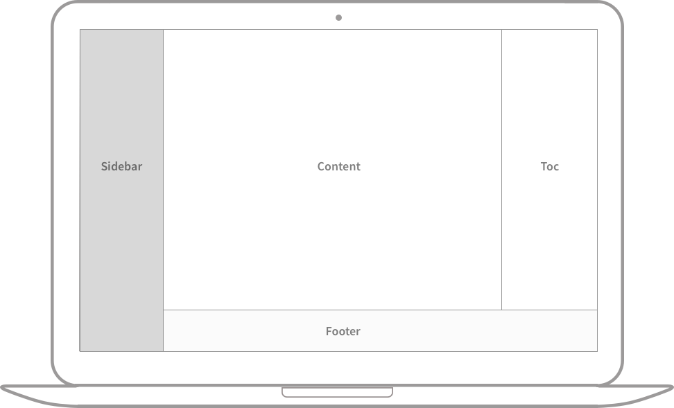
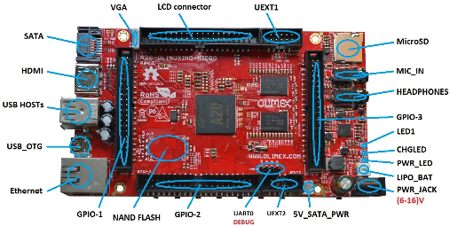
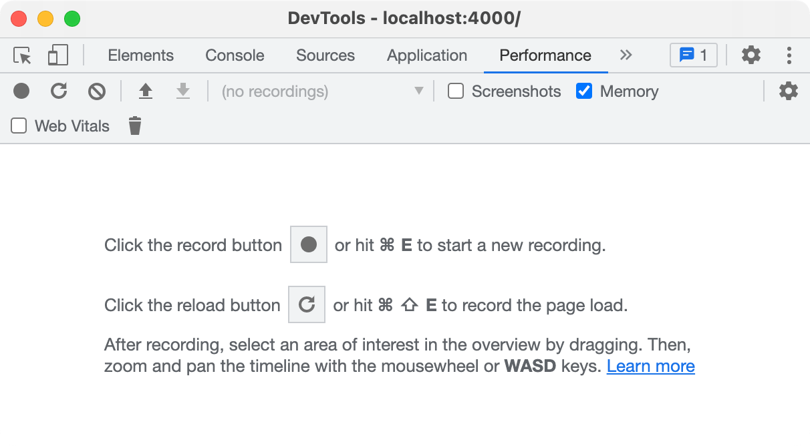
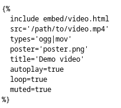
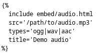
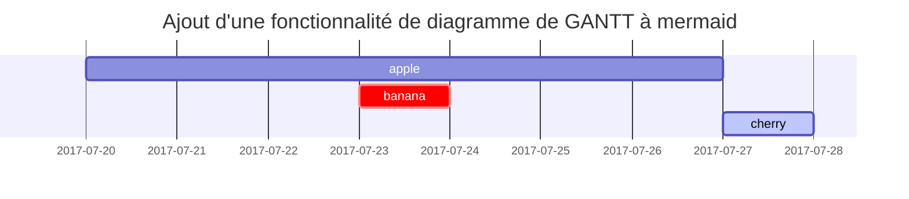
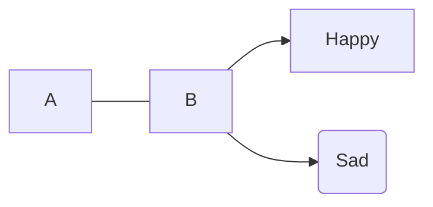
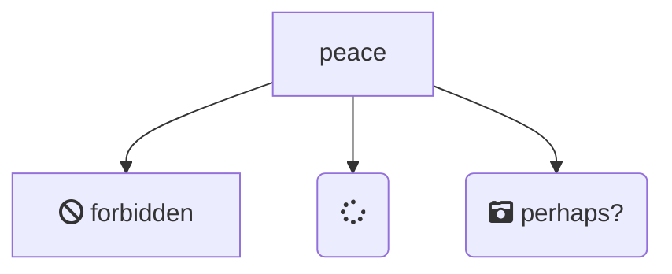
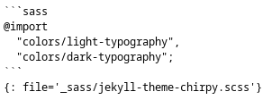

+++
title = 'Rédaction d'un nouvel article'
date = 2025-03-18 00:00:00
categories = ['markdown']
+++
Ce tutoriel vous guidera sur la façon d'écrire un post dans le modèle _Chirpy_, et il vaut la peine de le lire même si vous avez déjà utilisé Jekyll, car de nombreuses fonctionnalités nécessitent des variables spécifiques à définir.

## Dates

Vous pouvez afficher la date de mise à jour du post an joutant ce qui suit au "Front matter" 

```yaml
---
last_modified_at: AAAA-MM-JJ
---
```

**AAAA-MM-JJ** est le format de la date à utiliser

Afficher les dates en utilisant le language liquid


```liquid
Date: {{ page.date | date: "%d/%m/%Y" }}  
Date `last_modified_at`: {{ page.last_modified_at | date: "%d/%m/%Y" }}  
Date et heure actuelle: {{ "now" | date: "%d/%m/%Y %H:%M" }}
```


Date: {{ page.date | date: "%d/%m/%Y" }}  
Date `last_modified_at`: {{ page.last_modified_at | date: "%d/%m/%Y" }}  
Date et heure actuelle: {{ "now" | date: "%d/%m/%Y %H:%M" }}

## Nom et Chemin du post

Créer un nouveau fichier nommé `YYYY-MM-DD-TITLE.EXTENSION`{: .filepath} et mettez-le dans le dossier `_posts`{: .filepath} du répertoire racine. Veuillez noter que `EXTENSION`{: .filepath} doit être `md`{: .filepath} ou `markdown`{: .filepath}. Si vous voulez gagner du temps pour créer des fichiers, veuillez envisager d'utiliser le plugin [`Jekyll-Compose`](https://github.com/jekyll/jekyll-compose) pour y parvenir.

## Entête post (Front Matter)

Fondamentalement, vous devez remplir le [Front Matter](https://jekyllrb.com/docs/front-matter/) comme ci-dessous, en haut du billet:

```yaml
---
title: TITLE
date: YYYY-MM-DD HH:MM:SS +/-TTTT 00:00:00 +0100
categories: [TOP_CATEGORY, SUB_CATEGORY]
tags: [TAG]     # TAG names should always be lowercase
---
```

> Les messages _layout_ ont été définis par défaut à `post` , donc il n'est pas nécessaire d'ajouter la variable _layout_ dans le bloc Front Matter.
{: .prompt-tip }

### Date du post

Pour enregistrer avec précision la date de sortie d'un post, vous devez non seulement configurer la `timezone` de `_config.yml`{: .filepath}, mais aussi fournir le fuseau horaire du message dans la variable `date` de son bloc Front Matter. Format: `+/-TTTT` par exemple `+0800`.

### Catégories et Tags

La `categories` de chaque poste sont conçues pour contenir jusqu'à deux éléments, et le nombre d'éléments dans les `tags` peut être nul à infini. Par exemple:

```yaml
---
categories: [Animal, Insecte]
tags: [abeille]
---
```

### Renseignements sur l'auteur

L'information de l'auteur du message n'a généralement pas besoin d'être remplie dans le _Front Matter_ , ils seront obtenus à partir des variables `social.name` et la première entrée de `social.links` du fichier de configuration par défaut. Mais vous pouvez aussi le remplacer comme suit:

Ajout d'informations sur l'auteur dans `_data/authors.yml` (Si votre site Web n'a pas ce fichier, n'hésitez pas à en créer un).

```yaml
<author_id>:
  name: <full name>
  twitter: <twitter_of_author>
  url: <homepage_of_author>
```
{: file="_data/authors.yml" }

Ensuite, utilisez `author` pour spécifier une seule entrée ou `authors` pour spécifier plusieurs entrées:

```yaml
---
author: <author_id>                     # for single entry
# or
authors: [<author1_id>, <author2_id>]   # for multiple entries
---
```

Cela dit, la clé  `author` peut également identifier plusieurs entrées.

> L'avantage de lire les informations de l'auteur à partir du fichier `_data/authors.yml`{: .filepath } est que la page aura la méta tag `twitter:creator`, qui enrichit les [Twitter Cards](https://developer.twitter.com/en/docs/twitter-for-websites/cards/guides/getting-started#card-and-content-attribution) et est bon pour le référencement.
{: .prompt-info }

### Description du post

Par défaut, les premiers mots du message sont utilisés pour afficher sur la page d'accueil une liste de messages, dans la section _En savoir plus_ et dans le XML du flux RSS. Si vous ne voulez pas afficher la description générée automatiquement pour le message, vous pouvez la personnaliser en utilisant le champ `description` dans la _Front Matter_ comme suit:

```yaml
---
description: Résumé succinct du poste.
---
```

En outre, le texte `description` sera également affiché sous le titre du message sur la page du message.

## Table des matières

Par défaut, la table des matières **T**able **o**f **C**ontents (TOC) est affiché sur le panneau droit du message. Si vous voulez le désactiver globalement, allez dans `_config.yml`{: .filepath} et définissez la valeur de la variable `toc` à `false`. Si vous voulez désactiver TOC pour un post spécifique, ajoutez ce qui suit au  [Front Matter](https://jekyllrb.com/docs/front-matter/) de l'article

```yaml
---
toc: false
---
```

## Commentaires

Le cadre global des commentaires est défini par les commentaires. option de fournisseur dans le fichier `_config.yml`{: .filepath}. Une fois qu'un système de commentaires est sélectionné pour cette variable, les commentaires seront activés pour tous les messages.

Si vous voulez fermer le commentaire pour un post spécifique, ajoutez ce qui suit au **Front Matter** du post:

```yaml
---
comments: false
---
```

## Media

Nous faisons référence aux images, audio et vidéo comme ressources multimédias dans _Chirpy_.

### Préfixe URL

De temps à autre, nous devons définir des préfixes d'URL dupliquées pour plusieurs ressources dans un post, ce qui est une tâche ennuyeuse que vous pouvez éviter en définissant deux paramètres.

- Si vous utilisez un CDN pour héberger des fichiers multimédias, vous pouvez spécifier le `cdn` dans `_config.yml`{: .filepath }. Les URL des ressources multimédias pour l'avatar du site et les messages sont ensuite préfixés avec le nom de domaine CDN.

  ```yaml
  cdn: https://cdn.com
  ```
  {: file='_config.yml' .nolineno }

- Pour spécifier le préfixe de chemin de ressource pour la plage post/page actuelle, définissez `media_subpath` dans le _front matter_ du post:

  ```yaml
  ---
  media_subpath: /path/to/media/
  ---
  ```
  {: .nolineno }

Les options `site.cdn` et `page.media_subpath` peut être utilisé individuellement ou en combinaison pour composer avec souplesse l'URL finale de la ressource: `[site.cdn/][page.media_subpath/]file.ext`

## Images

### Défaut (avec légende)

{: width="972" height="589" }
_Full screen width and center alignment_

```markdown
{: width="972" height="589" }
_Full screen width and center alignment_
```

Par défaut, l'image est centrée, mais vous pouvez spécifier la position en utilisant l'une des classes `normal`, `left` et `right`.

> Une fois la position spécifiée, la légende de l'image ne doit pas être ajoutée.
{: .prompt-warning }

Ajouter l'italique à la ligne suivante d'une image, puis elle deviendra la légende et apparaîtra au bas de l'image :

```markdown

_Image Caption_
```
{: .nolineno}

- **Position normale**

  L'image sera alignée

  ```markdown
  {: .normal }
  ```
  {: .nolineno}


{: width="972" height="589" .w-75 .normal}

`{: width="972" height="589" .w-75 .normal}`

### Flotter vers la gauche

{: width="972" height="589" .w-50 .left}
Praesent maximus aliquam sapien. Sed vel neque in dolor pulvinar auctor. Maecenas pharetra, sem sit amet interdum posuere, tellus lacus eleifend magna, ac lobortis felis ipsum id sapien. Proin ornare rutrum metus, ac convallis diam volutpat sit amet. Phasellus volutpat, elit sit amet tincidunt mollis, felis mi scelerisque mauris, ut facilisis leo magna accumsan sapien. In rutrum vehicula nisl eget tempor. Nullam maximus ullamcorper libero non maximus. Integer ultricies velit id convallis varius. Praesent eu nisl eu urna finibus ultrices id nec ex. Mauris ac mattis quam. Fusce aliquam est nec sapien bibendum, vitae malesuada ligula condimentum.

`{: width="972" height="589" .w-50 .left}`

- **Flotter à gauche**

  ```markdown
  {: .left }
  ```
  {: .nolineno}

### Flotter vers la droite

{: width="972" height="589" .w-50 .right}
Praesent maximus aliquam sapien. Sed vel neque in dolor pulvinar auctor. Maecenas pharetra, sem sit amet interdum posuere, tellus lacus eleifend magna, ac lobortis felis ipsum id sapien. Proin ornare rutrum metus, ac convallis diam volutpat sit amet. Phasellus volutpat, elit sit amet tincidunt mollis, felis mi scelerisque mauris, ut facilisis leo magna accumsan sapien. In rutrum vehicula nisl eget tempor. Nullam maximus ullamcorper libero non maximus. Integer ultricies velit id convallis varius. Praesent eu nisl eu urna finibus ultrices id nec ex. Mauris ac mattis quam. Fusce aliquam est nec sapien bibendum, vitae malesuada ligula condimentum.

`{: width="972" height="589" .w-50 .right}`

- **Flotter à droite**

  ```markdown
  {: .right }
  ```
  {: .nolineno}

### Taille

Pour éviter que le contenu de la page ne se déplace lorsque l'image est chargée, nous devons définir la largeur et la hauteur de chaque image.

```markdown
{: width="700" height="400" }
```
{: .nolineno}

> Pour un SVG, vous devez au moins spécifier son _width_, sinon il ne sera pas rendu.
{: .prompt-info }

À partir de _Chirpy v5.0.0_, `height` et `width` supporte  l'abbreviations (`height` → `h`, `width` → `w`). L'exemple suivant a le même effet que ce qui précède :

```markdown
{: w="700" h="400" }
```
{: .nolineno}


{:width="300" .normal}
*Taille image largeur 300 normal : `{:width="300" .normal}`*


### Mode sombre/clair et ombre

L'image ci-dessous permet de basculer entre le mode sombre et le mode clair en fonction des préférences du thème, vous remarquerez qu'il y a des ombres.

{: .dark .w-75 .shadow .rounded-10 w='1212' h='668' }

`{: .dark .w-75 .shadow .rounded-10 w='1212' h='668' }`

#### Mode noir/léger

Vous pouvez faire des images suivre les préférences du thème en mode sombre/lumière. Cela exige que vous prépariez deux images, une pour le mode sombre et une pour le mode lumineux, puis que vous leur attribuiez une classe spécifique (`dark` ou `light`):

```markdown
{: .light }
{: .dark }
```
{: .nolineno}

#### Ombre (Shadow)

Les captures d'écran de la fenêtre du programme peuvent être considérées comme montrant l'effet d'ombre:

```markdown
{: .shadow }
```
{: .nolineno}

#### Aperçu de l'image

Si vous souhaitez ajouter une image en haut du message, veuillez fournir une image avec une résolution `1200 x 630`. Veuillez noter que si le rapport d'aspect de l'image ne correspond pas à `1,91 : 1`, l'image sera graduée et recadrée.

Connaissant ces prérequis, vous pouvez commencer à définir l'attribut de l'image :

```yaml
---
image:
  path: /path/to/image
  alt: image alternative text
---
```
{: .nolineno}

Notez que le [`media_subpath`](#url-prefix) peut également être passé à l'image de prévisualisation, c'est-à-dire, quand elle a été définie, l'attribut `path` n'a besoin que du nom du fichier image.

Pour une utilisation simple, vous pouvez également utiliser `image` pour définir le chemin.

```yml
---
image: /path/to/image
---
```
{: .nolineno}

#### LQIP

Pour prévisualiser les images :

```yaml
---
image:
  lqip: /path/to/lqip-file # or base64 URI
---
```
{: .nolineno}


> Vous pouvez observer LQIP dans l'image de prévisualisation du post \"[Text and Typography](../text-and-typography/)\".

Pour les images normales:

```markdown
{: lqip="/path/to/lqip-file" }
```
{: .nolineno }

### Video

#### Plateforme des médias

Vous pouvez intégrer des vidéos de plateformes de médias sociaux avec la syntaxe suivante:





Où `Platform` est le nom de la plate-forme en minuscule, et `ID` est l'ID vidéo.

Exemple  


Le tableau suivant montre comment obtenir les deux paramètres dont nous avons besoin dans une URL vidéo donnée, et vous pouvez également connaître les plateformes vidéo actuellement prises en charge.

| Video URL                                                                                          | Platform   | ID             |
| -------------------------------------------------------------------------------------------------- | ---------- | :------------- |
| [https://www.**youtube**.com/watch?v=**H-B46URT4mg**](https://www.youtube.com/watch?v=H-B46URT4mg) | `youtube`  | `H-B46URT4mg`  |
| [https://www.**twitch**.tv/videos/**1634779211**](https://www.twitch.tv/videos/1634779211)         | `twitch`   | `1634779211`   |
| [https://www.**bilibili**.com/video/**BV1Q44y1B7Wf**](https://www.bilibili.com/video/BV1Q44y1B7Wf) | `bilibili` | `BV1Q44y1B7Wf` |

#### Fichier Video 

Si vous voulez intégrer un fichier vidéo directement, utilisez la syntaxe suivante:





Où `URL` est une URL vers un fichier vidéo par exemple `/path/to/sample/video.mp4`.

Vous pouvez également spécifier des attributs supplémentaires pour le fichier vidéo intégré. Voici une liste complète des attributs autorisés.

- `poster='/path/to/poster.png'` — l'image poster  affichée pendant le téléchargement de la vidéo
- `title='Text'` — titre pour une vidéo qui apparaît sous la vidéo et qui ressemble à celle des images
- `autoplay=true` — la vidéo commence automatiquement la lecture dès qu'elle le peut
- `loop=true` — retournez automatiquement au début dès que vous atteignez la fin de la vidéo
- `muted=true` — l'audio sera initialement silencieux
- `types` — spécifiez les extensions de formats vidéo supplémentaires séparés par `|`. Assurez-vous que ces fichiers existent dans le même répertoire que votre fichier vidéo principal.

Exemple:  
{: .normal }

#### Syntaxe directe (balise iframe)

```
<iframe src="https://player.vimeo.com/video/193567768?title=0&byline=0&portrait=0" autostart="false" width="640" height="360" frameborder="0" ></iframe>
```

<iframe src="https://player.vimeo.com/video/193567768?title=0&byline=0&portrait=0" autostart="false" width="640" height="360" frameborder="0" ></iframe>

**codepen**

```
<iframe width="640" height="480" src="https://codepen.io/kitian616/embed/aQmWZG/?theme-id=0&amp;default-tab=html,result" frameborder="0" scrolling="no" allowfullscreen=""></iframe>
```

<iframe width="640" height="480" src="https://codepen.io/kitian616/embed/aQmWZG/?theme-id=0&amp;default-tab=html,result" frameborder="0" scrolling="no" allowfullscreen=""></iframe>

#### HTML brut (balise video)

Vous pouvez toujours écrire du HTML brut dans votre document "de balisage"markdown" :

```
<video width="640" height="480" controls>
  <source src="/files/k-9mail01.mp4" type="video/mp4">
</video>
```

<video width="640" height="480" controls>
  <source src="/files/k-9mail01.mp4" type="video/mp4">
</video>

### Audios

Si vous voulez intégrer un fichier audio directement, utilisez la syntaxe suivante:





Où `URL` est une URL vers un fichier audio par exemple. `/path/to/audio.mp3`.

Vous pouvez également spécifier des attributs supplémentaires pour le fichier audio intégré. Voici une liste complète des attributs autorisés.

- `title='Text'` — titre pour un audio qui apparaît sous l'audio et qui ressemble à celui des images
- `types` — spécifiez les extensions de formats audio supplémentaires séparés par `|`. Assurez-vous que ces fichiers existent dans le même répertoire que votre fichier audio principal.

exemple:  
{: .normal }

## Posts épinglés

Vous pouvez épingler un ou plusieurs messages en haut de la page d'accueil, et les messages fixes sont triés en ordre inverse selon leur date de sortie. Activer par:

```yaml
---
pin: true
---
```

## Syntaxe code fichier et language

### Code en ligne

```md
`inline code part`
```
{: .nolineno }

### Mise en évidence du chemin fichier

```md
`/path/to/a/file.extend`{: .filepath}
```
{: .nolineno }

`/path/to/a/file.extend`{: .filepath}

### Afficher le chemin fichier

Syntaxe

```
{: file='/etc/udev/rules.d/20-yubikey.rules'}
```

exemple

```
ACTION=="remove", ENV{SUBSYSTEM}=="usb", ENV{PRODUCT}=="1050/407/526", RUN+="/usr/local/bin/lockscreen.sh"
```
{: file='/etc/udev/rules.d/20-yubikey.rules'}


### Bloc de code

Les symboles  mardown ```` ``` ```` peuvent facilement créer un bloc de code comme suit:

````md
```
C'est un extrait de code.
```
````

#### Spécifier le langage du code

En utilisant ```` ```{language} ```` vous obtiendrez un bloc de code avec syntaxe:

````markdown
```yaml
key: value
```
````

**Liste des formats du bloc de code Markdown**  
Les langues prises en charge dépendent fortement de l'analyseur Markdown que vous utilisez. Ce qui suit est une liste de plusieurs langues et formats courants que vous pouvez essayer. Si votre langue ne figure pas dans cette liste, je vous suggère d'essayer simplement si elle est supportée. Vous pouvez également consulter la documentation de votre langage Markdown spécifique.

```
    actionscript3
    apache
    applescript
    asp
    brainfuck
    c
    cfm
    clojure
    cmake
    coffee-script, coffeescript, coffee
    cpp – C++
    cs
    csharp
    css
    csv
    bash
    diff
    elixir
    erb – HTML + Embedded Ruby
    go
    haml
    http
    java
    javascript
    json
    jsx
    less
    lolcode
    make – Makefile
    markdown
    matlab
    nginx
    objectivec
    pascal
    PHP
    Perl
    python
    profile – python profiler output
    rust
    salt, saltstate – Salt
    shell, sh, zsh, bash – Shell scripting
    scss
    sql
    svg
    swift
    rb, jruby, ruby – Ruby
    smalltalk
    vim, viml – Vim Script
    volt
    vhdl
    vue
    xml – XML and also used for HTML with inline CSS and Javascript
    yaml
```

#### Numéro de ligne

Par défaut, toutes les langues sauf `plaintext`, `console` et `terminal` afficheront les numéros de ligne. Lorsque vous voulez masquer le numéro de ligne d'un bloc de code, ajoutez la classe `nolineno` à elle:

````markdown
```shell
echo 'Plus de numéros de ligne !'
```
{: .nolineno }
````

Exemple

```shell
echo 'Plus de numéros de ligne !'
```
{: .nolineno }


#### Codes Liquid 

Si vous voulez afficher l'extrait de code **Liquid**, entourez le code liquide de `` et ``:

````markdown

```liquid

  This product's title contains the word Pack.

```

````

Exemple


```liquid

  This product's title contains the word Pack.

```


## Mathématiques

Nous utilisons [**MathJax**][mathjax] pour générer des mathématiques. Pour des raisons de performance du site, la fonction mathématique ne sera pas chargée par défaut. Mais il peut être activé par:

[mathjax]: https://www.mathjax.org/

```yaml
---
math: true
---
```

Après avoir activé la fonctionnalité mathématique, vous pouvez ajouter des équations mathématiques avec la syntaxe suivante:

- **Block math** devraient être ajoutés avec `$$ math $$` avec des lignes blanches **obligatoires** avant et après `$$`
  - **Inserting equation numbering** doit être ajouté avec `$$\begin{equation} math \end{equation}$$`
  - **Referencing equation numbering** doit être ajouté avec `\label{eq:label_name}` dans le bloc d'équation et `\eqref{eq:label_name}` en ligne avec le texte (voir exemple ci-dessous)
- **Inline math** (in lines) doivent être ajoutés avec `$$ math $$` sans aucune ligne blanche avant ou après `$$`
- **Inline math** (in lists) doivent être ajoutés avec `\$$ math $$`

```markdown
<!-- Bloc math, gardez toutes les lignes vides -->

$$
LaTeX_math_expression
$$

<!-- Numérotation de l'équation, garder toutes les lignes blanches  -->

$$
\begin{equation}
  LaTeX_math_expression
  \label{eq:label_name}
\end{equation}
$$

Peut être référencé comme \eqref{eq:label_name}.

<!-- Inline math in lines, NO blank lines -->

"Lorem ipsum dolor sit amet, $$ LaTeX_math_expression $$ consectetur adipiscing elit."

<!-- Inline math in lists, escape the first `$` -->

1. \$$ LaTeX_math_expression $$
2. \$$ LaTeX_math_expression $$
3. \$$ LaTeX_math_expression $$
```

> Depuis `v7.0.0`, les options de configuration pour **MathJax** ont été déplacées dans le fichier `assets/js/data/mathjax.js`{: .filepath }, et vous pouvez modifier les options au besoin, comme ajouter [extensions][mathjax-exts].  
> Si vous construisez le site via `chirpy-starter`, copiez ce fichier à partir du répertoire d'installation de gem (vérifiez avec la commande  `bundle info --path jekyll-theme-chirpy`) dans le même répertoire que votre dépôt.
{: .prompt-tip }

Les mathématiques alimentées par [**MathJax**](https://www.mathjax.org/):

$$
\begin{equation}
  \sum_{n=1}^\infty 1/n^2 = \frac{\pi^2}{6}
  \label{eq:series}
\end{equation}
$$

Nous pouvons référencer l'équation comme suit \eqref{eq:series}.

Quand $a \ne 0$,il y a deus solutions à $ax^2 + bx + c = 0$ qui sont

$$ x = {-b \pm \sqrt{b^2-4ac} \over 2a} $$

## Mermaid

[**Mermaid**](https://github.com/mermaid-js/mermaid) est un excellent outil de génération de diagrammes. Pour l'activer sur votre message, ajoutez ce qui suit au bloc YAML:

```yaml
---
mermaid: true
---
```

Ensuite, vous pouvez l'utiliser comme d'autres langages de balisage: entourez le code graphique avec ```` ```mermaid ```` et ```` ``` ````.

````markdown

````

Exemples




Markdown

        ```mermaid
            graph LR
            A --- B
            B-->C[Happy]
            B-->D(Sad);
        ```




## Rubriques

<!-- markdownlint-capture -->
<!-- markdownlint-disable -->
# H1 — Rubrique
{: .mt-4 .mb-0 }

## H2 — Rubrique
{: data-toc-skip='' .mt-4 .mb-0 }

### H3 — Rubrique
{: data-toc-skip='' .mt-4 .mb-0 }

#### H4 — Rubrique
{: data-toc-skip='' .mt-4 }
<!-- markdownlint-restore -->

```markdown
# H1 — Rubrique

## H2 — Rubrique

### H3 — Rubrique

#### H4 — Rubrique
```

## Paragraphe

Quisque egestas convallis ipsum, ut sollicitudin risus tincidunt a. Maecenas interdum malesuada egestas. Duis consectetur porta risus, sit amet vulputate urna facilisis ac. Phasellus semper dui non purus ultrices sodales. Aliquam ante lorem, ornare a feugiat ac, finibus nec mauris. Vivamus ut tristique nisi. Sed vel leo vulputate, efficitur risus non, posuere mi. Nullam tincidunt bibendum rutrum. Proin commodo ornare sapien. Vivamus interdum diam sed sapien blandit, sit amet aliquam risus mattis. Nullam arcu turpis, mollis quis laoreet at, placerat id nibh. Suspendisse venenatis eros eros.

## Listes

### Liste ordonnée

1. Tout d'abord
2. Deuxièmement
3. Troisièmement

```markdown
1. Tout d'abord
2. Deuxièmement
3. Troisièmement
```

### Liste non ordonnée

- Chapitre
  - Section
    - Paragraphe

```markdown
- Chapitre
  - Section
    - Paragraphe
```

### ToDo list

- [ ] Emploi
  - [x] Echelon 1
  - [x] Echelon 2
  - Étape 3

```markdown
- [ ] Emploi
  - [x] Echelon 1
  - [x] Echelon 2
  - Étape 3
```

### Liste des descriptions

Soleil
: l'étoile autour de laquelle tourne la terre

Lune
: satellite naturel de la terre, visible par la lumière réfléchie du soleil

```markdown
Soleil
: l'étoile autour de laquelle tourne la terre

Lune
: satellite naturel de la terre, visible par la lumière réfléchie du soleil
```

## Citation en bloc

> Cette ligne montre le _block quote_.

```markdown
> Cette ligne montre le _block quote_.
```

## Prompts tip info warning danger

<!-- markdownlint-capture -->
<!-- markdownlint-disable -->

> Un exemple montrant l'invite de type `tip`.
{: .prompt-tip }

> Un exemple montrant l'invite de type `info`.
{: .prompt-info }

> Exemple d'invite de type `avertissement`.
{: .prompt-warning }

> Exemple d'invite de type `danger`.
{: .prompt-danger }
<!-- markdownlint-restore -->

```markdown
> Un exemple montrant l'invite de type `tip`.
{: .prompt-tip }

> Un exemple montrant l'invite de type `info`.
{: .prompt-info }

> Exemple d'invite de type `avertissement`.
{: .prompt-warning }

> Exemple d'invite de type `danger`.
{: .prompt-danger }
<!-- markdownlint-restore -->
```

## Tables

Pour créer un tableau vous devez placer une ligne de tirets (-) sous la ligne d'entête et séparer les colonnes avec des `|`.  
Vous pouvez aussi préciser l'alignement en utilisant des `:. :`

```
| Aligné à gauche  | Centré          | Aligné à droite |
| :--------------- |:---------------:| -----:|
| Aligné à gauche  |   ce texte        |  Aligné à droite |
| Aligné à gauche  | est             |   Aligné à droite |
| Aligné à gauche  | centré          |    Aligné à droite |

Markdown | Less | Pretty
--- | --- | ---
*Still* | `renders` | **nicely**
1 | 2 | 3
```

| Aligné à gauche  | Centré          | Aligné à droite |
| :--------------- |:---------------:| -----:|
| Aligné à gauche  |   ce texte        |  Aligné à droite |
| Aligné à gauche  | est             |   Aligné à droite |
| Aligné à gauche  | centré          |    Aligné à droite |

Markdown | Less | Pretty
--- | --- | ---
*Still* | `renders` | **nicely**
1 | 2 | 3


| Société                      | Contact          | Pays |
| :--------------------------- | :--------------- | ------: |
| Alfreds Futterkiste          | Maria Anders     | Germany |
| Island Trading               | Helen Bennett    |      UK |
| Magazzini Alimentari Riuniti | Giovanni Rovelli |   Italy |

```markdown
| Société                      | Contact          | Pays |
| :--------------------------- | :--------------- | ------: |
| Alfreds Futterkiste          | Maria Anders     | Germany |
| Island Trading               | Helen Bennett    |      UK |
| Magazzini Alimentari Riuniti | Giovanni Rovelli |   Italy |
```

## Liens

<http://127.0.0.1:4000>  
Syntaxe markdown: `<http://127.0.0.1:4000>`

## Fichier

### Mise en avant chemin d'accès

Voici le  `/path/to/the/file.extend`{: .filepath}.

``` `/path/to/the/file.extend`{: .filepath}.```


### Afficher chemin et nom du fichier

Vous avez peut-être remarqué que le langage de code sera affiché en haut du bloc de code. Si vous voulez le remplacer par le nom du fichier, vous pouvez ajouter l'attribut `file` pour y parvenir:

````markdown
```shell
# content
```
{: file="path/to/file" }
````

Exemple

```shell
# content
```
{: file="/chemin/du/fichier" }

## Note de bas de page

Cliquer sur le crochet permet de localiser la note de bas de page[^footnote], et voici une autre note de bas de page[^fn-nth-2]

Syntaxe markdown:  
`Cliquer sur le crochet permet de localiser la note de bas de page[^footnote], et voici une autre note de bas de page[^fn-nth-2]`

## Code en ligne

Voici un exemple de `code en ligne`.

## Blocs de code

### Commun

```text
Il s'agit d'un extrait de code commun, sans coloration syntaxique ni numéro de ligne.
```

### Langue spécifique

```bash
if [ $? -ne 0 ]; then
  echo "The command was not successful.";
  #do the needful / exit
fi;
```

### Nom de fichier spécifique

```sass
@import
  "colors/light-typography",
  "colors/dark-typography";
```
{: file='_sass/jekyll-theme-chirpy.scss'}



## En savoir plus

Pour plus d'informations sur les postes Jekyll, visitez le  [Jekyll Docs: Posts](https://jekyllrb.com/docs/posts/).

## Note de bas de page inversée

````markdown
[^footnote]: La source de la note de bas de page
[^fn-nth-2]: La 2e source de la note de bas de page
````

[^footnote]: La source de la note de bas de page
[^fn-nth-2]: La 2e source de la note de bas de page
