+++
title = 'Yubico - YubiKey 5 NFC'
date = 2025-03-18 00:00:00 +0100
categories = chiffrement
+++
*YubiKey 5 Series Une gamme multiprotocole (FIDO2/WebAuthn, U2F, Smart Card, OpenPGP, OTP) qui est le premier choix des entreprises et qui prend en charge la fonction sans mot de passe (autres liens [Yubikey et KeePassXC](https://notamax.be/yubikey-et-keepassxc/) et [KeePass et Yubikey multiplateforme, article MISC 103](https://geekeries.org/2020/03/keepass-et-yubikey-multiplateforme-article-misc-103/?doing_wp_cron=1688115570.8655300140380859375000))*

## Security Key NFC 

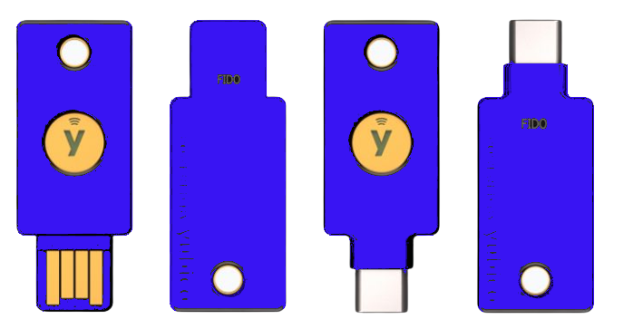

Protégez vos comptes en ligne des pirates informatiques grâce à la clé de sécurité de Yubico. Digne de confiance et facile à utiliser, c'est la clé d'un monde numérique plus sûr.

*    **Pratique et portable** : La *Security Key NFC* s'adapte facilement à votre trousseau de clés, ce qui la rend pratique à transporter et à utiliser partout où vous allez, garantissant un accès sécurisé à vos comptes à tout moment. Il vous suffit de la brancher sur le port USB-A ou d'appuyer sur votre appareil compatible NFC pour vous authentifier.
*    **Compatibilité polyvalente** : Pris en charge par les comptes Google et Microsoft, les gestionnaires de mots de passe et des centaines d'autres services populaires. Il fonctionne avec Windows, macOS, ChromeOS et Linux. La rubrique « Works With YubiKey » répertorie les services compatibles.
*    **Protocoles FIDO uniquement** : Security Key Series est la clé de sécurité la plus abordable prenant en charge uniquement les protocoles d'authentification FIDO2/WebAuthn (hardware bound passkey) et FIDO U2F. Pour une meilleure compatibilité, passez à la YubiKey 5 Series.
*    **Durable et fiable** : Conception de haute qualité et résistance à la falsification, à l'eau et à l'écrasement. Aucune pile ni connectivité réseau n'est requise, ce qui permet une authentification fiable sans interruption de service. Fabriqué en toute sécurité aux États-Unis et en Suède.

## YubiKey 5C NFC

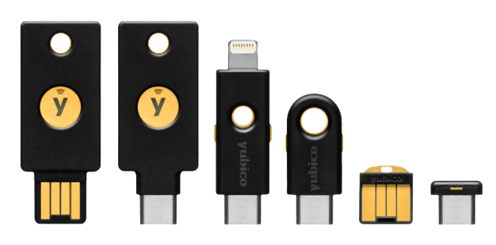

Protégez vos comptes en ligne des pirates informatiques grâce à la YubiKey. Digne de confiance et facile à utiliser, c'est la clé d'un monde numérique plus sûr.

*    **Pratique et portable** : La *YubiKey 5C NFC* s'adapte facilement à votre trousseau de clés, ce qui la rend pratique à transporter et à utiliser partout où vous allez, garantissant un accès sécurisé à vos comptes à tout moment. Il suffit de la brancher via l'USB-C ou de tapoter sur votre appareil compatible NFC pour vous authentifier.
*    **Compatibilité polyvalente** : Pris en charge par les comptes Google et Microsoft, les gestionnaires de mots de passe et des centaines d'autres services populaires. Il fonctionne avec Windows, macOS, ChromeOS et Linux. La rubrique « Works With YubiKey » (fonctionne avec YubiKey) répertorie les services compatibles.
*    **Multi-protocole** : YubiKey 5 Series est la clé de sécurité la plus polyvalente prenant en charge plusieurs protocoles d'authentification, notamment FIDO2/WebAuthn (hardware bound passkey), FIDO U2F, Yubico OTP, OATH-TOTP, OATH-HOTP, carte à puce (PIV) et OpenPGP.
*    **Durable et fiable** : Conception de haute qualité et résistance à la falsification, à l'eau et à l'écrasement. Aucune pile ni connectivité réseau n'est nécessaire, ce qui permet une authentification fiable sans interruption de service. Fabriqué en toute sécurité aux États-Unis et en Suède.

**Yubico Authenticator App** - Compatible avec l'application d'authentification la plus sûre pour les mobiles et les ordinateurs de bureau.

> La clé YubiKey 5 NFC va être utilisée pour déverrouiller le chiffrement du disque au démarrage du PC,  sur Keepass comme clé en plus du mot de passe et en OTP pour une API
{: .prompt-tip }

## Déverrouillage au boot d'un disque entièrement chiffré LUKS2

On peut utiliser une clé avec le protocole FIDO2 pour déverrouiller un disque chiffré sans saisie de mot de passe

Prérequis: Système linux avec systemd-boot et dracut sur un disque entièrement chiffré

Par défaut le disque chiffré est déverrouillé après la saisie de la phrase mot de passe

* Slot 0 pour le déverrouillage du volume par saisie d'une phrase mot de passe. 
* Slot 1 pour le déverrouillage par une clé FIDO2 avec un appui sur une touche. 

Installer librairie **libfido2** pour la prise en charge des clés Yubico 

    pacman -S libfido2

### Enroler clé USB YubiKey 5 NFC

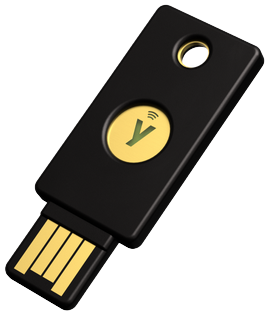{:height="150"}

Vérifier que la YubiKey est insérée dans un port USB

Lister et enroler la yubikey

    systemd-cryptenroll --fido2-device=list

```
PATH         MANUFACTURER PRODUCT              
/dev/hidraw5 Yubico       YubiKey OTP+FIDO+CCID
```

Enroler la clé pour le déverrouillage du disque chiffré nvme0n1p2

    sudo systemd-cryptenroll --fido2-device=auto /dev/nvme0n1p2

```
🔐 Please enter current passphrase for disk /dev/nvme0n1p2: *********************   
Requested to lock with PIN, but FIDO2 device /dev/hidraw5 does not support it, disabling.
Initializing FIDO2 credential on security token.
👆 (Hint: This might require confirmation of user presence on security token.)
Generating secret key on FIDO2 security token.
👆 In order to allow secret key generation, please confirm presence on security token.
New FIDO2 token enrolled as key slot 1.
```

> Le **Y** de la clé se met à clignoter , il suffit de poser son doigt sur l'emplacement du **Y** pour le déverrouillage
{: .prompt-info }

### Prise en charge YubiKey

Configurer /etc/crypttab pour la prise en charge des clés

    sudo nano /etc/crypttab

```
# <name>               <device>                         <password> <options>
#cryptlvm UUID=2c8e7bb4-9286-47e9-8823-12b79bf2810c /crypto_keyfile.bin luks
cryptlvm UUID=2c8e7bb4-9286-47e9-8823-12b79bf2810c - fido2-device=auto
```

Sauvegarder et quitter.

Réinitialiser

    sudo reinstall-kernels

> `Redémarrer la machine`{: .prompt-info }

## Configurer slot 1 et slot 2

### Challenge Response HMAC SHA1 sur le slot 1

Pour que **KeePassXC** détecte correctement votre Yubikey, vous devez configurer l'un de vos deux emplacements pour utiliser un **Challenge-Response HMAC-SHA1**.

Ouvrir application **Yubikey Personalization Tool** et sélectionner **Challenge-Response** puis **HMAC-SHA1**  
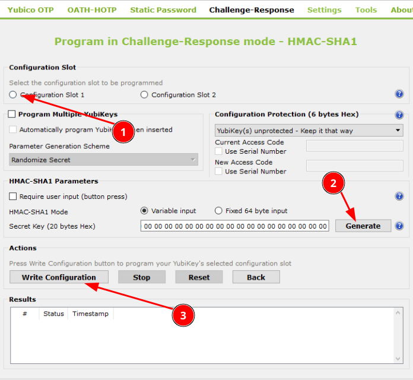{:width="400"}  

Plusieurs options 

* **Configuration Slot** : nous avons deux slots utilisables, on sélectionne le premier (s'il est occupé on prend le second)
* **Require user input** : on peut éventuellement cocher cette case pour que l’utilisateur ait d’abord à appuyer avec son doigt sur la Yubikey pour envoyer la réponse 
* **Secret Key** : ici dépendant de l’application, soit la clé vous sera donnée et vous pouvez l’encoder dans la case à droite, soit vous pouvez en générer une et la donner à l’application. Ici, nous allons générer une clé

Une fois générée, stockez la bien précieusement, faute de quoi vous ne pourrez plus jamais ré-ouvrir votre DB KeePass si vous venez à ne plus avoir votre Yubikey !

On peut ensuite cliquer sur **Write Configuration** :  
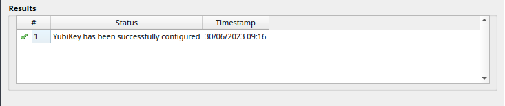{:width="400"}  

### OTP sur slot 2

**Utilisation de l'outil de personnalisation YubiKey**

1.    Téléchargez, installez et lancez l'outil de personnalisation **YubiKey Personalization Tool**
2.    Insérez votre YubiKey et vérifiez que l'outil de personnalisation le détecte (vous devriez voir que **"YubiKey is inserted"** en haut à droite de la fenêtre).
3. Sélectionnez **Yubico OTP** en haut de la fenêtre de l'outil de personnalisation.
4. Sélectionnez **Quick**.
5. Sélectionnez Configuration** Slot 2**, cliquez sur **Regenerate**, puis sur** Write Configuration**  
6. Répondez à toutes les fenêtres contextuelles indiquant où enregistrer le fichier journal/comment l'appeler.  
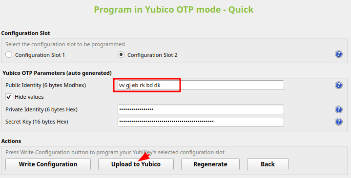{:width="400"}  
7. Cliquez sur **Upload to Yubico**.  
Un navigateur devrait s'ouvrir et naviguer vers https://upload.yubico.com/, avec la majeure partie du formulaire rempli.  
{:width="400"}  
Un navigateur devrait s'ouvrir et naviguer vers https://upload.yubico.com/, avec la majeure partie du formulaire rempli.  
8. Cliquez dans le champ OTP from YubiKey  
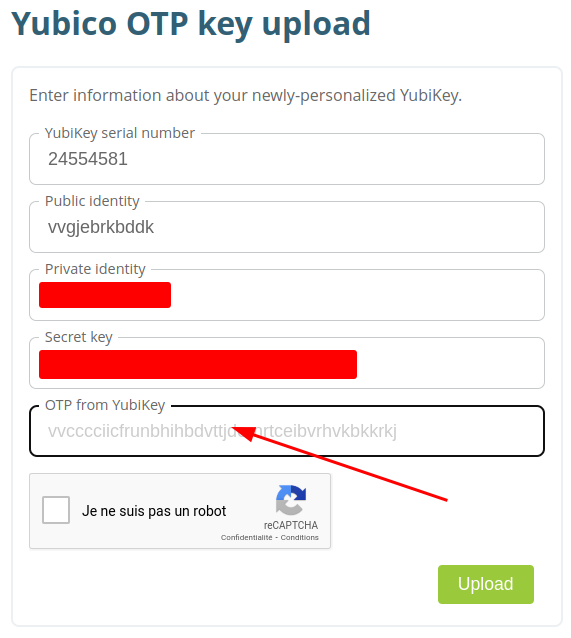{:width="300"}  
puis déclenchez la génération d'un OTP Yubico par la YubiKey en touchant son capteur en or pendant 1 à 2 secondes.
9. Cochez la case Je ne suis pas un robot, répondez à tous les défis CAPTCHA qui vous sont proposés et cliquez sur Télécharger.
10. Attendez que la carte d'identité soit téléchargée et traitée.  
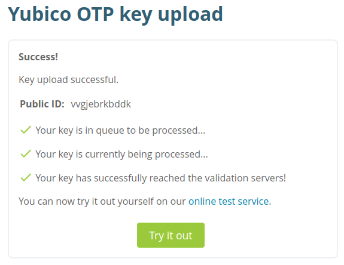{:width="300"}  
11. Une fois le traitement terminé, cliquez sur **Try it out** et suivez les instructions de la page pour tester votre justificatif d'identité. <https://demo.yubico.com/otp/verify>  

Ceci vous permet de faire une démonstration de la YubiKey pour l'authentification à facteur unique avec le Yubico One-Time Password.

1. Insérez votre YubiKey dans un port USB.
2. Cliquez dans le champ YubiKey et touchez le bouton YubiKey.

L'authentification à facteur unique (YubiKey uniquement) n'est pas recommandée pour une utilisation en production, car une YubiKey perdue ou volée suffirait pour s'authentifier en tant qu'utilisateur. Utilisez l'[aire de jeu YubiKey](https://demo.yubico.com/playground) pour tester les OTP en tant que deuxième facteur.


## Ajout d'une clé en plus du mot de passe pour accéder à Keepass

On utilise le mode **Challenge-Response HMAC-SHA1**  
Installer l'outil **Yubikey Personalization Tool** : `yay -S yubikey-personalization`  

### Configurer KeePassXC avec Yubikey

*Instructions pour configurer KeePassXC avec votre Yubikey.*  
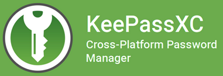  

#### KeepassXC linux

Lancer l'application bureau **KeePassXC** puis accéder à **Base de données** &rarr; **Sécurité de la base de données**  
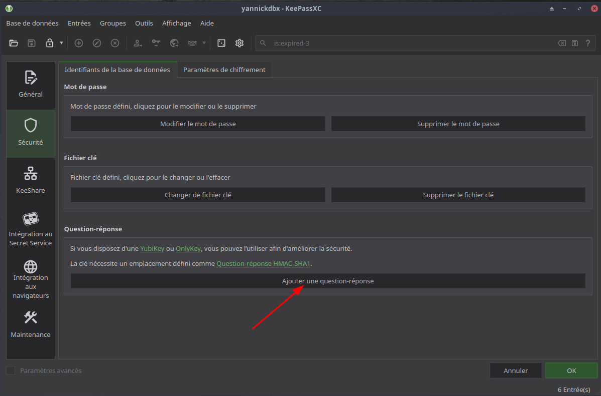{:width="500"}  
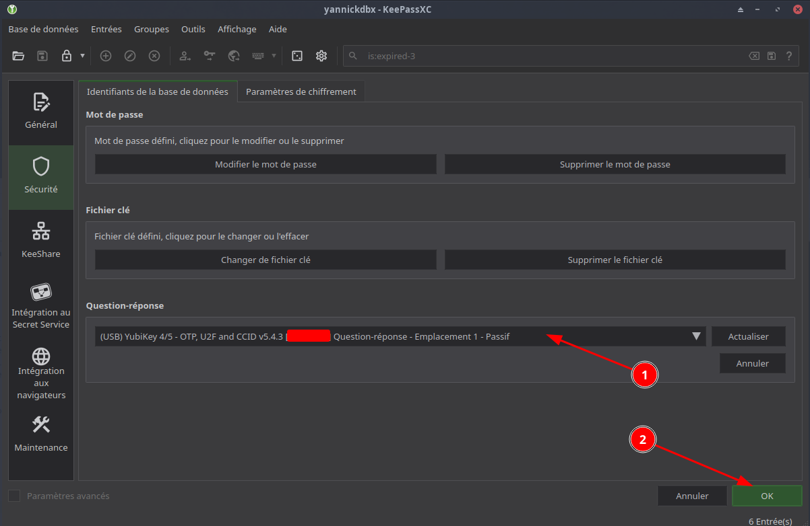{:width="500"}  

La clé yubikey est insérée pour être reconnue lors de l'ouverture de la base de données keepass   
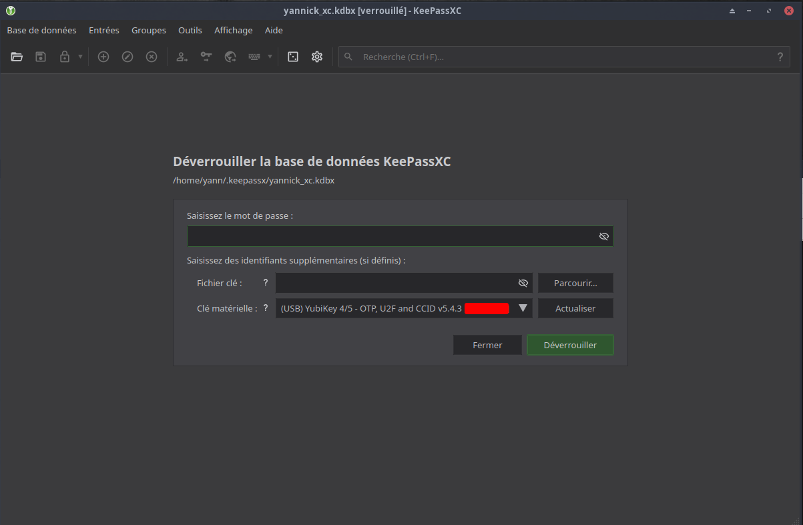{:width="500"}  

#### Keepass2Android

Pour faire une copie d'écran dans l'application keepass2android, il faut modifier un paramètre:  
Aller dans paramètres --> Appli --> Affichage et décocher **Protéger affichage base de données**  
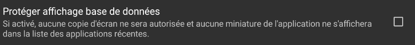  

Sous Android, l’application **Keepass2Android** supporte le mode **challenge-response**, moyennant l’installation de l’application **ykDroid** ([installée depuis F-Droid](https://f-droid.org/packages/net.pp3345.ykdroid/)), un pilote supportant ce mode.

Ouvrir la base de données keepass  

1. **Sélectionner le type de la Clé maître: Mot de passe + Défi réponse pour Keepass...**   
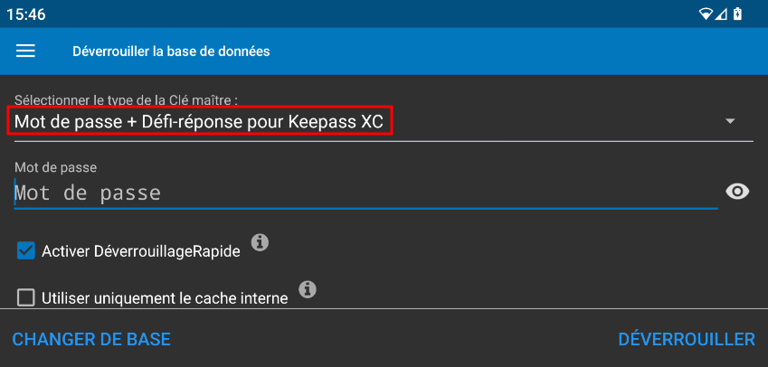  
2. Saisir le mot de passe et cliquer sur **DEVERROUILLER**
3. Puis de présenter votre YubiKey contre le lecteur NFC de votre téléphone  
  

## Obtenir une clé API pour le développement de YubiKey

* [Program and upload a new Yubico OTP credential](https://support.yubico.com/hc/en-us/articles/360013647680-Resetting-the-OTP-Application-on-the-YubiKey)
* [Obtaining an API Key for YubiKey Development](https://support.yubico.com/hc/en-us/articles/360013717560-Obtaining-an-API-Key-for-YubiKey-Development)
* <https://github.com/vrillusions/nginx-auth-yubico>

Pour obtenir votre clé API, lien <https://upgrade.yubico.com/getapikey/> et saisissez une adresse e-mail valide ainsi que l'OTP Yubico de l'une de vos YubiKeys (cliquez dans le champ OTP YubiKey et touchez le capteur tactile capacitif de votre YubiKey), puis cliquez sur **Get API key**.   
Un ID client et une clé secrète sont générés

## Déverrouiller sa session Linux avec une Yubikey

### Introduction

Ce guide explique comment sécuriser une connexion locale à Linux en utilisant la fonction U2F sur les YubiKeys et les Security Keys. Cela ne fonctionne pas avec les connexions à distance via SSH ou d'autres méthodes.. Voir [ici](https://support.yubico.com/en/support/solutions/articles/15000011445-red-hat-linux-family-login-guide-challenge-response) pour un article orienté vers Red Hat et ses dérivés.

### Installation des logiciels requis

Utiliser votre clé YubiKey U2F avec Linux.

```bash
sudo apt install libpam-u2f # debian ubuntu
sudo pacman -S pam-u2f      # eos archlinux
```

Associer la (les) clé(s) U2F à votre compte

Ouvrir un terminal, insérer votre clé U2F

```bash
mkdir -p ~/.config/Yubico
pamu2fcfg > ~/.config/Yubico/u2f_keys
```

> Il se peut que l'on vous demande un code PIN lors de l'exécution de pamu2fcfg. Si c'est le cas, notez qu'il s'agit du code PIN FIDO2 de votre YubiKey que vous devez saisir. Pour plus d'informations, voir [Comprendre les codes PIN YubiKey](https://support.yubico.com/hc/en-us/articles/4402836718866).  
Lorsque votre appareil commence à clignoter, touchez le contact métallique pour confirmer l'association.
{: .prompt-info }

Si vous disposez de <mark>dispositifs de sauvegarde</mark>, suivez les étapes ci-dessous pour les associer à votre compte.(Si vous ne disposez pas encore d'un appareil de sauvegarde, vous pouvez en ajouter un plus tard en suivant les étapes ci-dessous, tant que vous avez toujours accès à votre compte.) 

> Attention : Il est fortement recommandé de disposer d'un périphérique de sauvegarde afin de ne pas être bloqué sur votre ordinateur en cas de perte ou de panne de votre périphérique.
{: .prompt-warning }

Ouvrir un terminal.

    pamu2fcfg -n >> ~/.config/Yubico/u2f_keys

> `Lorsque votre périphérique commence à clignoter, touchez le contact métallique pour confirmer l'association.`
{: .prompt-info }

Si vous souhaitez ajouter une couche de sécurité supplémentaire, vous pouvez modifier la sortie du fichier `u2f_keys` dans une zone du système d'exploitation où vous aurez besoin de l'autorisation sudo pour éditer le fichier ( par exemple, [/etc](URL) ). Après avoir créé un répertoire nommé Yubico ( par exemple `/etc/Yubico` ). Vous pouvez alors déplacer le fichier de `~/.config/Yubico` vers `/etc/Yubico` en exécutant les commandes 

```bash
sudo mv ~/.config/Yubico/u2f_keys /etc/Yubico/u2f_keys
sudo chown root: /etc/Yubico/u2f_keys && sudo chmod 600 /etc/Yubico/u2f_keys
```

Une fois le fichier `u2f_keys` déplacé vers un emplacement plus sûr, le fichier PAM devra être modifié afin que le module u2f PAM puisse trouver le fichier u2f_keys. Pour ce faire, ajoutez `authfile=/etc/Yubico/u2f_keys` à la fin de la ligne du fichier `pam_u2f.so` dans le fichier nécessaire à l'authentification. Celui-ci se trouve normalement dans le chemin `/usr/lib/x86_64-linux-gnu/security/pam_u2f.so`, mais il peut être différent selon la configuration.

> Attention : Veuillez noter qu'une fois que vous avez modifié le fichier `/etc/pam.d/sudo` pour exiger la YubiKey, si vous deviez perdre ou égarer la YubiKey, vous ne pourrez pas modifier ou changer le fichier pour supprimer l'exigence de la YubiKey.
{: .prompt-warning }

> Attention : En activant ce processus, si les fichiers ne sont pas lisibles par les utilisateurs, vous risquez d'être bloqué sur votre système. La cause la plus fréquente est le dossier /home/ crypté qui ne sera pas lisible par l'utilisateur root. Vous serez alors bloqué une fois que vous aurez réinitialisé la machine.
{: .prompt-warning }

### Configuration du système pour l'utilisation des clés U2F

#### Test de configuration avec la commande Sudo

Cette section explique comment demander la clé YubiKey en utilisant la commande sudo, qui devrait être utilisée comme test afin que vous ne vous bloquiez pas sur votre ordinateur.

    sudo nano /etc/pam.d/sudo

Ajoutez la ligne ci-dessous après la ligne `"@include common-auth"` ou en fin de fichier (archlinux).

    auth required pam_u2f.so

> Note : `Si vous avez déplacé le fichier u2f_keys vers /etc/Yubico/u2f_keys`{: .prompt-info } , vous devrez ajouter authfile et un chemin vers la configuration PAM, comme indiqué ci-dessous :

    auth required pam_u2f.so authfile=/etc/Yubico/u2f_keys

Appuyez sur Ctrl+O puis sur Entrée pour enregistrer le fichier.  

1. Veillez à ne pas fermer la fenêtre du terminal, sinon vous ne pourrez pas revenir sur les modifications.
2. Retirez votre clé de l'ordinateur.
3. Ouvrez un nouveau terminal. 
4. Dans le nouveau terminal, exécutez : `sudo echo test`. Lorsque vous y êtes invité, entrez votre mot de passe et appuyez sur Entrée. 
5. <mark>Même avec le bon mot de passe, l'authentification devrait échouer</mark> car la clé U2F n'est pas branchée. Si l'authentification réussit sans la clé U2F, cela indique que le module PAM U2F n'a pas été installé ou qu'il y a une erreur dans les modifications que vous avez apportées au fichier `/etc/pam.d/sudo`. 
6. Insérez votre clé.
7. Ouvrez un nouveau terminal et exécutez à nouveau `sudo echo test`. Lorsque vous y êtes invité, entrez votre mot de passe et appuyez sur Entrée. Ensuite, touchez le contact métallique de votre clé U2F lorsqu'il commence à clignoter.

> `Félicitations ! Si le mot de passe a été accepté cette fois-ci, vous avez configuré le système correctement et vous pouvez passer à la section suivante pour demander la clé U2F pour se connecter`
{: .prompt-tip } 

> `Note : si vous ne voulez pas exiger que la clé U2F exécute la commande sudo, supprimez la ligne que vous avez ajoutée au fichier /etc/pam.d/sudo.`
{: .prompt-info }

#### Ajouter d'autres commandes comme su pour exiger une connexion par YubiKey

Le module PAM différencie les différents états de la commande sudo car ils ont des chemins d'authentification différents. Cela signifie qu'en fonction de votre version, vous devrez peut-être éditer un autre fichier contenant les informations PAM pour les rendre valides. Dans Ubuntu 22.04, les commandes suivantes ont les fichiers suivants que vous pouvez éditer pour ajouter l'authentification :

```
Commande Fichier Emplacement
runuser /etc/pam.d/runuser
runuser -l /etc/pam.d/runuser-l
su /etc/pam.d/su
sudo -i /etc/pam.d/sudo-i
su -l /etc/pam.d/su-l
```

Ajoutez la ligne ci-dessous après la ligne "@include common-auth" dans le fichier de la commande souhaitée

    auth required pam_u2f.so

Si vous avez déplacé le fichier u2f_keys vers /etc/Yubico/u2f_keys comme mentionné dans la section 3, vous devrez ajouter authfile et un chemin vers la configuration PAM, comme indiqué ci-dessous :

    auth required pam_u2f.so authfile=/etc/Yubico/u2f_keys

Après avoir sauvegardé les modifications, vous devriez maintenant avoir besoin de la clé YubiKey pour vous authentifier lors de l'utilisation de la commande sélectionnée.

#### Configurer le système pour qu'il exige la YubiKey pour le terminal TTY 

Ouvrez le terminal.  

```bash
sudo nano /etc/pam.d/login
```
{: .nolineno }


Ajoutez la ligne ci-dessous après la ligne "@include common-auth".

```bash
auth required pam_u2f.so
```
{: .nolineno }

Note : Si vous avez déplacé le fichier u2f_keys vers /etc/Yubico/u2f_keys comme mentionné dans la section 3, vous devrez ajouter authfile et un chemin vers la configuration PAM, comme indiqué ci-dessous :

```bash
auth required pam_u2f.so authfile=/etc/Yubico/u2f_keys
```
{: .nolineno }

Appuyez sur Ctrl+X puis sur Entrée pour enregistrer et fermer le fichier.

Vous avez réussi ! Vous ne pourrez plus vous connecter à l'ordinateur sans le dispositif U2F.

### Lightdm

Ouvrez le terminal.  
Si votre système , exécutez

```bash
sudo nano /etc/pam.d/lightdm   
```
{: .nolineno }

#### Pour utiliser la clé U2F comme second facteur requis (2FA)

Ajoutez la ligne ci-dessous après la ligne `"@include common-auth"`ou en fin de fichier (archlinux).  

```bash
auth required pam_u2f.so
```
{: .nolineno }

Note : Si vous avez déplacé le fichier u2f_keys vers /etc/Yubico/u2f_keys , vous devrez ajouter authfile et un chemin vers la configuration PAM, comme indiqué ci-dessous :

```bash
auth required pam_u2f.so authfile=/etc/Yubico/u2f_keys
```
{: .nolineno }

#### Connexion sans mot de passe en utilisant uniquement la clé U2F

Ajoutez la ligne ci-dessous en première ligne

```bash
auth sufficient pam_u2f.so
```
{: .nolineno }

Note : Si vous avez déplacé le fichier u2f_keys vers /etc/Yubico/u2f_keys , vous devrez ajouter authfile et un chemin vers la configuration PAM, comme indiqué ci-dessous :

```bash
auth sufficient pam_u2f.so authfile=/etc/Yubico/u2f_keys
```
{: .nolineno }

Pour afficher un message

```bash
auth sufficient pam_u2f.so authfile=/etc/Yubico/u2f_keys cue [cue_prompt=Toucher le "Y" de la clé]
```
{: .nolineno }

Appuyez sur Ctrl+X puis sur Entrée pour enregistrer et fermer le fichier.

#### Verrouiller la session quand la Yubikey est débranchée

Le but de la manœuvre est de verrouiller automatiquement la session lorsque la Yubikey est débranchée. De cette manière, dès qu'on part en pause-café, il suffit de prendre sa Yubikey avec soit et plus aucun risque de devoir payer les croissants aux collègues le lendemain 🥐

On va commencer par créer le script de verrouillage `/usr/local/bin/lockscreen.sh`

```bash
#!/bin/sh

# Ce script verrouille la session si la clé yubikey est absente

sleep 2

if ! ykman info >> /dev/null 2>&1
then
 # Clé FIDO absente 
 loginctl lock-sessions
fi
```
{: .nolineno }

script exécutable

```bash
sudo chmod +x /usr/local/bin/lockscreen.sh
```
{: .nolineno }

Ajouter une nouvelle règle UDEV dans le fichier `/etc/udev/rules.d/20-yubikey.rules`

```
ACTION=="remove", ENV{SUBSYSTEM}=="usb", ENV{PRODUCT}=="1050/407/526", RUN+="/usr/local/bin/lockscreen.sh"
```
{: file='/etc/udev/rules.d/20-yubikey.rules'}

Il faut déterminer la valeur du paramètre `ENV{PRODUCT}`  

1. Déconnecter la clé yubikey
2. Dans un terminal exécuter : `udevadm monitor --environment --udev`
3. Reconnecter la clé yubikey puis saisir `Ctrl C` pour stopper monitor

Dans la sortie, repérez un bloc de lignes contenant la ligne ID_VENDOR=Yubico et contenant les entrées ID_VENDOR_ID, ID_MODEL_ID et ID_REVISION. Concaténez ces 3 dernières valeurs, sans les `0` de gauche, séparés par des `/`  

Par exemple, avec les lignes suivantes, vous obtiendrez 1050/407/543

```
ID_USB_MODEL_ENC=YubiKey\x20OTP+FIDO+CCID
ID_USB_MODEL_ID=0407
ID_USB_SERIAL=Yubico_YubiKey_OTP+FIDO+CCID
ID_USB_VENDOR=Yubico
ID_USB_VENDOR_ENC=Yubico
ID_USB_VENDOR_ID=1050
ID_USB_REVISION=0543
```

/etc/udev/rules.d/20-yubikey.rules

```
ACTION=="remove", ENV{SUBSYSTEM}=="usb", ENV{PRODUCT}=="1050/407/543", RUN+="/usr/local/bin/lockscreen.sh"
```
{: file='/etc/udev/rules.d/20-yubikey.rules'}

Recharger la configuration

```bash
sudo udevadm control --reload-rules
```
{: .nolineno }

### Dépannage

Activation du mode débogage

Si vous ne parvenez pas à vous connecter et que vous ne savez pas pourquoi, vous pouvez activer le débogage sur le module Yubico PAM en suivant les étapes ci-dessous. Cela vous permettra de comprendre pourquoi le module n'autorise pas la connexion.

Ouvrez le terminal.

```bash
sudo touch /var/log/pam_u2f.log
```
{: .nolineno }

Exécutez

```bash
sudo nano /etc/pam.d/gdm-password
```
{: .nolineno }

Ajoutez `"debug debug_file=/var/log/pam_u2f.log"` à la fin de la ligne qui contient `pam_u2f.so`.

> À chaque connexion ultérieure, le journal de débogage sera enregistré dans le fichier `/var/log/pam_u2f.log`
{: .prompt-tip }

