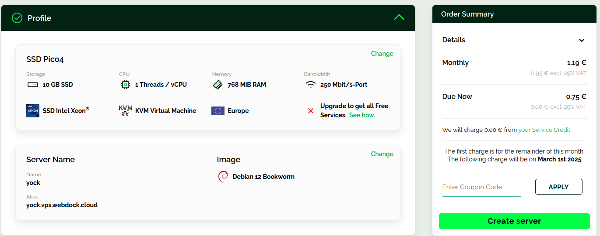
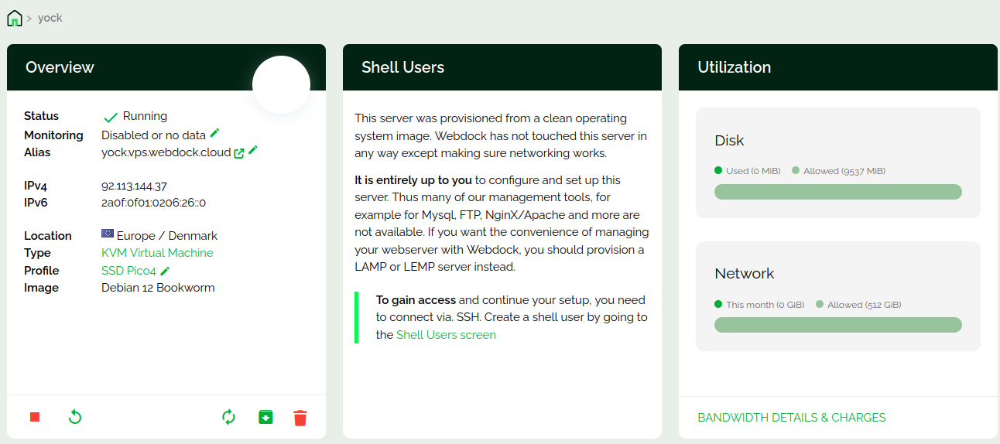
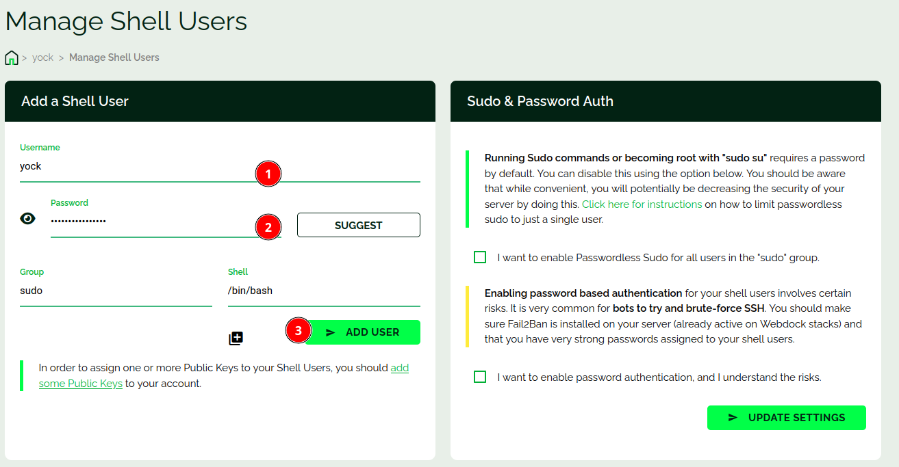
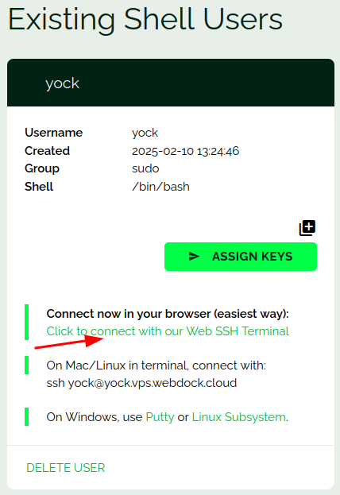
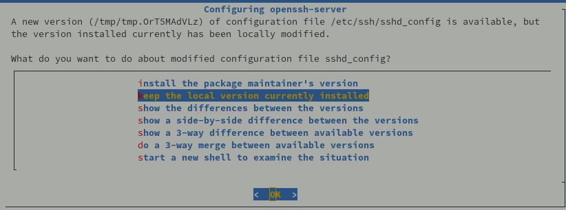

+++
title = 'VPS webdock (Relais RustDesk)'
date = 2025-03-18 00:00:00 +0100
categories = ['vps']
+++
*[Webdock](https://webdock.io/en), des serveurs VPS évolutifs et des services cloud conçus pour répondre à vos besoins à tout moment.* 


### Préalables

* Créer un compte et valider le par confirmation
* Approvisionner son compte d'une somme 
* Créer un profile , choisir le type de service

Sur un poste linux, créer un jeu de clé SSH pour le VPS

```bash
ssh-keygen -t ed25519 -o -a 100  -f ~/.ssh/vps-yock
chmod 600 ~/.ssh/vps-yock
```

### Profile

  
Cliquer sur "Create server"

  
Le serveur VPS est créé  

Cliquer sur  **Shell Users screen**   

### Utilisateur

Créer l'utilisateur yock et son mot de passe  
  

Utilisateur créé, il faut ajouter les clés en se connectant sur un terminal web  
  

### Connexion SSH avec clé

Se connecter sur un terminal web (<https://webdock.io/en/dash/webssh/yock/yock>)  

Ajouter la clé publique `~/.ssh/vps-yock.pub`  

    echo "ssh-ed25519 AAAAC3NzaC1lZDI1NTE5AAAAIJAR+sYfsGTYV6xRahfcL00TdJ/ByN8L43tOI9oq898V yann@PC1" >> .ssh/authorized_keys

Modifier le port sshd  55037

    sudo nano /etc/ssh/sshd_config

Redémarrer le serveur sshd

    sudo systemctl restart sshd

Tester la connexion ssh depuis le poste linux

    ssh -p 55037 -i ~/.ssh/vps-yock yock@92.113.144.37

### Motd

Afficher lors de la connexion SSH , `/etc/motd`

```
 __      __     _        _           _    __   __ ___  ___ 
 \ \    / /___ | |__  __| | ___  __ | |__ \ \ / /| _ \/ __|
  \ \/\/ // -_)| '_ \/ _` |/ _ \/ _|| / /  \ V / |  _/\__ \
   \_/\_/ \___||_.__/\__,_|\___/\__||_\_\   \_/  |_|  |___/
                 _                                         
  _  _  ___  __ | |__                                      
 | || |/ _ \/ _|| / /                                      
  \_, |\___/\__||_\_\                                      
  |__/                                                     
  ___  ___     _  _  ____    _  _ _   _ _     ____ ____    
 / _ \|_  )   / |/ ||__ /   / || | | | | |   |__ /|__  |   
 \_, / / /  _ | || | |_ \ _ | ||_  _||_  _|_  |_ \  / /    
  /_/ /___|(_)|_||_||___/(_)|_|  |_|   |_|(_)|___/ /_/     
```

### Mise à jour

Mise à jour Debian

```bash
sudo apt update
sudo apt upgrade
```



### Parefeu

Installation parefeu UFW  Debian / Ubuntu

    sudo apt install ufw

Les règles

    sudo ufw allow 55037/tcp  # port SSH

Activer le parefeu

    sudo ufw enable

```
Command may disrupt existing ssh connections. Proceed with operation (y|n)? y
Firewall is active and enabled on system startup
```

Vérifier : `sudo ufw status`

```
Status: active

To                         Action      From
--                         ------      ----
55037/tcp                  ALLOW       Anywhere                  
55037/tcp (v6)             ALLOW       Anywhere (v6)             
```

### Relais RustDesk

[Serveur relais Rustdesk](/posts/RustDesk/#serveur-relais-rustdesk)

Les dernières version <https://github.com/rustdesk/rustdesk-server/releases>  
Le script d'installation  

```bash
wget https://github.com/rustdesk/rustdesk-server/releases/download/1.1.14/rustdesk-server-hbbr_1.1.14_amd64.deb
wget https://github.com/rustdesk/rustdesk-server/releases/download/1.1.14/rustdesk-server-hbbs_1.1.14_amd64.deb
sudo dpkg -i rustdesk-server-hbbr_1.1.14_amd64.deb
sudo dpkg -i rustdesk-server-hbbs_1.1.14_amd64.deb
rm rustdesk-server-hbb*
```

Les deux services sont activés lors de l’installation, vérification 

```bash
systemctl status rustdesk-hbbs 
systemctl status rustdesk-hbbr 
```

**Ouvrir les port sur le firewall**  

Par défaut, hbbs écoute sur 21115(tcp) et 21116(tcp/udp), 21118(tcp),et hbbr écoute sur 21117(tcp), 21119(tcp). Assurez-vous d’ouvrir ces ports dans le pare-feu. Veuillez noter que 21116 doit être activé à la fois pour TCP et UDP. Le port 21115 est utilisé pour le test de type NAT, le port 21116/UDP est utilisé pour l’enregistrement de l’ID et le service Heartbeat, le port 21116/TCP est utilisé pour le service de perforation et de connexion TCP, le port 21117 est utilisé pour les services de relais, et les ports 21118 et 21119 sont utilisés pour supporter les clients Web. Si vous n’avez pas besoin du support des clients web (21118, 21119), les ports correspondants peuvent être désactivés.

*    TCP : 21115, 21116, 21117
*    UDP : 21116

Pour autoriser le serveur RustDesk sur ufw :

```bash
sudo ufw allow 21115:21119/tcp
sudo ufw allow 8000/tcp
sudo ufw allow 21116/udp
```

Pour que le client Rustdesk puisse utiliser le relais, il faut lui donner 2 choses :

1. Adresse IP du serveur relais : 92.113.144.37
2. Clé publique contenue dans  `/var/lib/rustdesk-server/id_ed25519.pub`

### Gestion utilisateur

Supprimer utilisateur debian

    sudo userdel debian
    sudo rm -r /home/debian/

Supprimer les droits sudo utilisateur debian

    sudo rm /etc/sudoers.d/90-cloud-init-users

Créer les droits pour l’utilisateur courant

    echo "$USER ALL=(ALL) NOPASSWD:ALL" |sudo tee /etc/sudoers.d/90-utilisateur

### Msmtp

*Le MTA (Mail Transfer Agent) léger msmtp répond parfaitement à ce besoin. Si vous avez plusieurs serveurs et que vous avez sur l'un d'eux configuré un serveur de mail, il sera intéressant de faire en sorte que vos autres serveurs puissent l'utiliser pour acheminer leur courrier. Vous pouvez également vouloir utiliser le serveur de votre FAI, ou ceux d'une plateforme [(Envoyer des mails depuis un serveur avec mSMTP )](https://www.yakati.com/art/envoyer-des-mails-depuis-un-serveur-avec-msmtp/)*

* [Automating Email Notifications on Linux Using curl and msmtp](https://bytegoblin.io/blog/automating-email-notifications-on-linux-using-curl-and-msmtp.mdx)

Installation de msmtp, le programme est dans les dépôts Debian

    sudo apt install msmtp-mta

**Configuration par défaut**

*Une configuration typique consisterait à définir pour tout le serveur un smarthost à utiliser, un utilisateur par défaut pour se connecter à ce smarthost, le port auquel se connecter, l'adresse mail figuant dans l'entête from du mail et l'obligation d'utiliser le chiffrement TLS pour les connexions (ou STARTTLS). Pour tous les utilisateurs n'ayant pas de fichier .msmtprc dans leur /home msmtp utilisera ce fichier par défaut. Toute cette configuration se trouvant dans le fichier /ets/msmtprc*

Fichier de configuration `$HOME/.msmtprc`

```
account default
host mx1.xoyize.xyz
port 587
from yack@cinay.eu
user yack@cinay.eu
password mot_passe_yack
auto_from off
add_missing_from_header on
auth on
logfile ~/.msmtp.log
tls on
tls_starttls on
tls_trust_file /etc/ssl/certs/ca-certificates.crt
```

Envoi de message test

```
echo -e "Subject: VPS Wedock ${HOSTNAME}\r\nMIME-Version: 1.0\nContent-Type: text/; charset=utf-8\r\n\r\nTest du serveur smtp..." |msmtp --from=vps@cinay.eu -t vps@cinay.eu
```

## Maintenance

### Mises à jour automatiques sur debian

[Mises à jour automatiques sur Debian](/posts/Debian_unattended-upgrades_mise_a_jour_auto/)

