+++
title = 'VPS webdock yockbis (xoyaz.xyz)'
date = 2025-03-18 00:00:00 +0100
categories = ['vps']
+++
*[Webdock](https://webdock.io/en), des serveurs VPS évolutifs et des services cloud conçus pour répondre à vos besoins à tout moment.* 


### Préalable

Ce post fait suite à une première création d'un **VPS Pico4**, voir le lien [VPS webdock (Relais RustDesk)](/posts/webdock-relais-rustdesk/) 

Sur un poste linux, créer un jeu de clé SSH pour le VPS à venir

```bash
ssh-keygen -t ed25519 -o -a 100  -f ~/.ssh/vps-yockbis
chmod 600 ~/.ssh/vps-yockbis
```

Se connecter sur son compte à l'adresse <https://webdock.io>

### Profile

Profil existant  
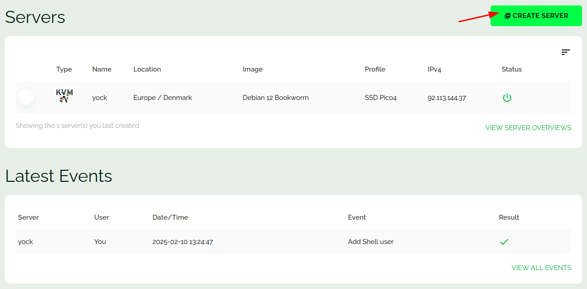  
Cliquer sur "Create server"  
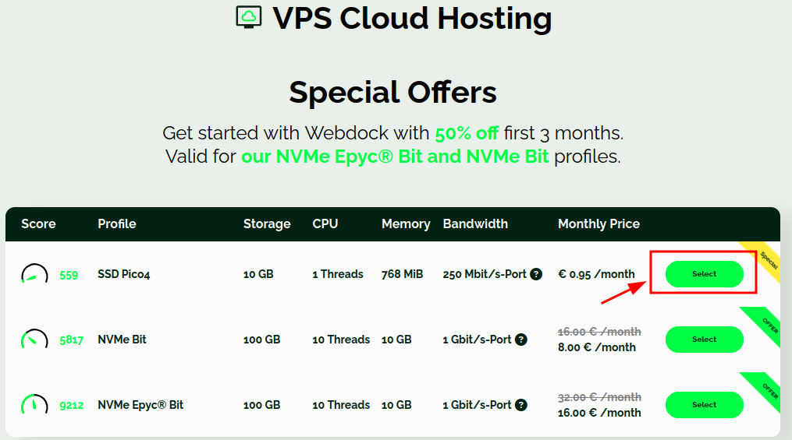  
Etape suivante  
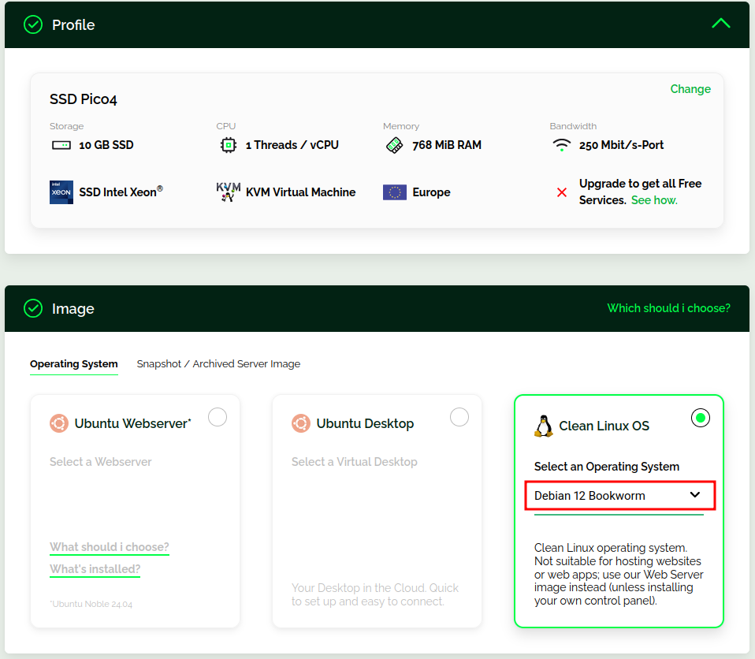  
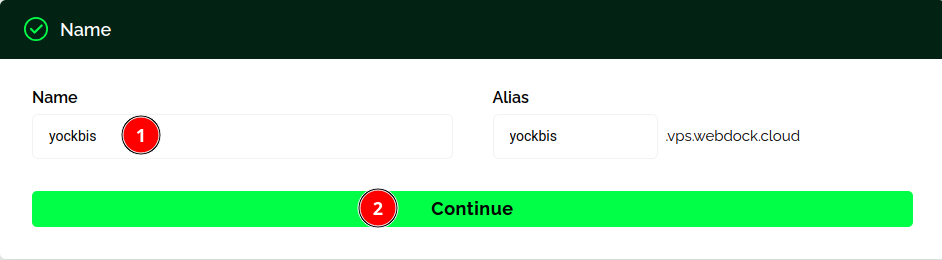  
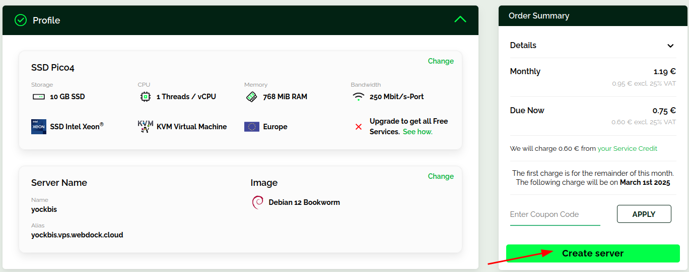  
Le serveur VPS est créé  
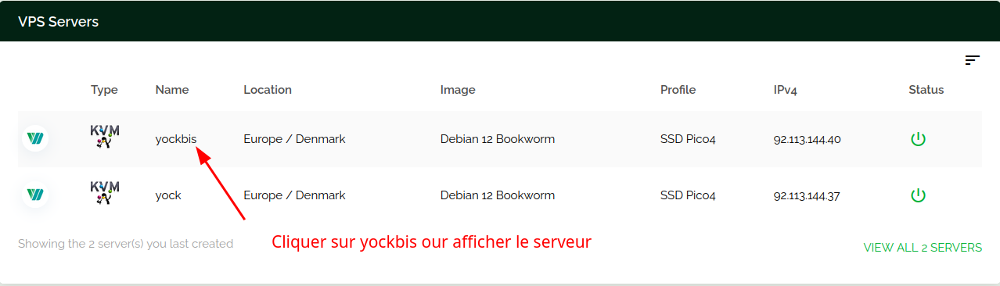  
Créer un shell user avec l'utilisateur yockbis et son mot de passe  
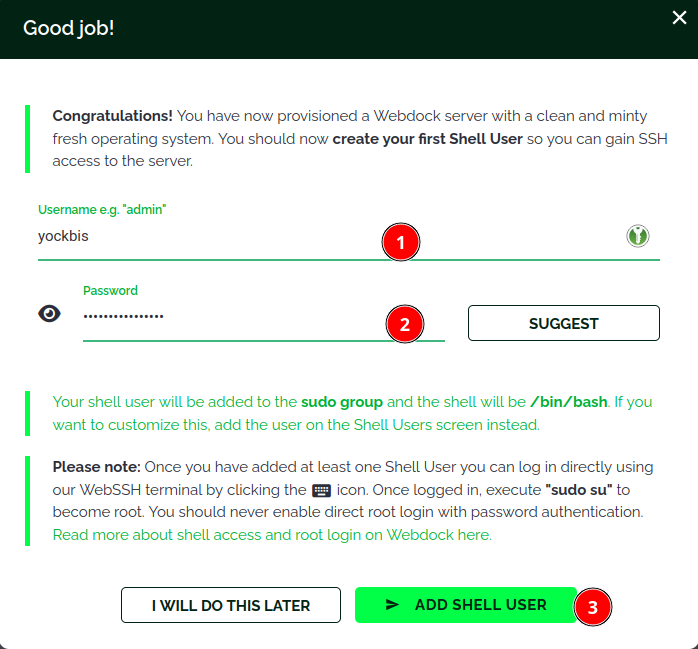{:width="500"}

### Utilisateur

Utilisateur créé, ouvrir le shell  
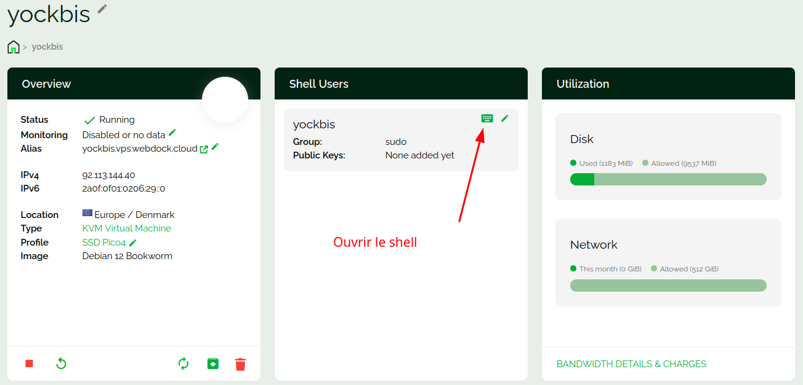  
Après quelques instants...  
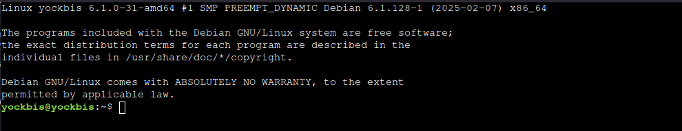  

### Connexion SSH avec clé

Se connecter sur un terminal web (<https://webdock.io/en/dash/webssh/yock/yock>)  

Ajouter la clé publique `~/.ssh/vps-yockbis.pub`  

    echo "ssh-ed25519 AAAAC3NzaC1lZDI1NTE5AAAAIObDm+2vx7qUDuMnJaKH9NcULmT1OgmSAOKXL+G9jKkr yann@PC1" >> .ssh/authorized_keys

Modifier le port sshd  55040

    sudo nano /etc/ssh/sshd_config

Les paramètres pour une connexion SSH avec clé est sans mot de passe

```
Port 55040
# Pour désactiver les mots de passe en texte clair transmis par tunnel, il faut changer pour no ici !
PasswordAuthentication no 
# Positionné à "no" par défaut dans la création des VPS Webdock
```

Redémarrer le serveur sshd

    sudo systemctl restart sshd

### Poste linux appelant

Tester la connexion ssh depuis le poste linux

    ssh -p 55040 -i ~/.ssh/vps-yockbis yockbis@92.113.144.40 

Sur le poste linux, ajout site "yockbis" à  FileZilla 

* Site: yockbis  
* SFTP protocol
    * Hôte: 92.113.144.40
    * Port: 55040
* Authentification: Fichier clef
    * Utilisateur: yockbis
    * Fichier clef: /home/yann/.ssh/vps-yockbis

### Gestion utilisateur

Créer les droits pour l'utilisateur courant

```bash
echo "$USER ALL=(ALL) NOPASSWD:ALL" |sudo tee /etc/sudoers.d/90-utilisateur
```

Supprimer utilisateur debian et ses droits sudo 

```bash
sudo userdel debian
sudo rm -r /home/debian/
sudo rm /etc/sudoers.d/90-cloud-init-users
```

### Mise à jour

Mise à jour Debian

```bash
sudo apt update
sudo apt upgrade
```

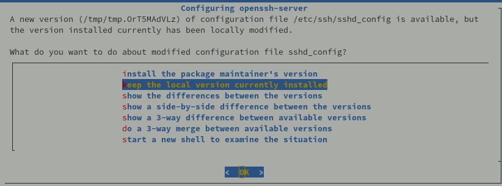

### Motd

Afficher lors de la connexion SSH , `/etc/motd`

```
 __      __     _        _           _    __   __ ___  ___ 
 \ \    / /___ | |__  __| | ___  __ | |__ \ \ / /| _ \/ __|
  \ \/\/ // -_)| '_ \/ _` |/ _ \/ _|| / /  \ V / |  _/\__ \
   \_/\_/ \___||_.__/\__,_|\___/\__||_\_\   \_/  |_|  |___/
                 _    _     _                              
  _  _  ___  __ | |__| |__ (_) ___                         
 | || |/ _ \/ _|| / /| '_ \| |(_-<                         
  \_, |\___/\__||_\_\|_.__/|_|/__/                         
  |__/                                                     
  ___  ___     _  _  ____    _  _ _   _ _    _ _    __     
 / _ \|_  )   / |/ ||__ /   / || | | | | |  | | |  /  \    
 \_, / / /  _ | || | |_ \ _ | ||_  _||_  _|_|_  _|| () |   
  /_/ /___|(_)|_||_||___/(_)|_|  |_|   |_|(_) |_|  \__/    
```

### Parefeu UFW

Installation

    sudo apt install ufw

Les règles

```bash
sudo ufw allow 55040/tcp  # port SSH
sudo ufw allow https      # port 443
```

Activer le parefeu

```bash
sudo ufw enable
```

## Serveur web

Télécharger la dernière version du binaire **Linux amd64** nommé caddy_linux_amd64 depuis un **Ordinateur local linux** (<https://caddyserver.com/download>)     
Transférer le fichier **caddy_linux_amd64** via FileZilla
{: .prompt-info }

### DNS OVH

* VPS yockbis
    * Adresse IPV4: 92.113.144.40
    * Adresse IPV6: 2a0f:0f01:0206:29::0

Renseigner la zone dns domaine **xoyaz.xyz** avec les paramètres du VPS yockbis

```
$TTL 3600
@	IN SOA dns106.ovh.net. tech.ovh.net. (2025030900 86400 3600 3600000 300)
        IN NS     ns106.ovh.net.
        IN NS     dns106.ovh.net.
        IN A     92.113.144.40
        IN AAAA     2a0f:0f01:0206:29::0
        IN CAA     0 issue "letsencrypt.org"
*        IN A     92.113.144.40
*        IN AAAA     2a0f:0f01:0206:29::0
```

### Installer Caddy

*Caddy est un serveur web écrit en Go, open source et disponible avec HTTPS automatiquement*

Prérequis

```bash
sudo apt install libcap2-bin libnss3-tools wget tar rsync 
```

Déplacez le binaire caddy dans votre $PATH, par exemple :

```bash
sudo mv caddy_linux_amd64 /usr/local/bin/caddy
sudo chmod +x /usr/local/bin/caddy
```

Version:  `caddy version`  
`v2.9.1 h1:OEYiZ7DbCzAWVb6TNEkjRcSCRGHVoZsJinoDR/n9oaY=`

Configurer un utilisateur restreint nommé **caddy** avec le répertoire personnel `/etc/caddy` en exécutant la commande suivante

```bash
sudo useradd --shell /bin/false --home-dir /etc/caddy --system caddy
```

Caddy stocke la configuration dans le répertoire `.config`, et les certificats dans le répertoire `.local` 

```bash
sudo mkdir -p /etc/caddy/{.config,.local}
```

Répertoire lié à Caddy pour stocker les logs

```bash
sudo mkdir -p /var/log/caddy
```

Modifier la propriété des répertoires au profit de l’utilisateur caddy

```bash
sudo chown -R caddy: /etc/caddy /var/log/caddy
```

Lorsque vous exécutez un logiciel en tant qu’utilisateur non root, Linux interdit à ces processus d’écouter des numéros de port inférieurs à 1024. Pour contourner cette restriction et exécuter Caddy en toute sécurité en tant qu’utilisateur non root, ajoutez la capacité cap_net_bind_service au binaire caddy :

```bash
sudo setcap cap_net_bind_service+ep /usr/local/bin/caddy
```

Caddy service systemd

*Configurer Caddy comme un service du système qui démarrera automatiquement*

Créer le fichier `/etc/systemd/system/caddy.service`

```
[Unit]
Description=Caddy web server
After=network-online.target

[Service]
User=caddy
Group=caddy
Type=exec
WorkingDirectory=/var/caddy/

ExecStart=/usr/local/bin/caddy run --config /etc/caddy/Caddyfile
ExecReload=/usr/local/bin/caddy reload --config /etc/caddy/Caddyfile
ExecStop=/usr/local/bin/caddy stop

LimitNOFILE=1048576
LimitNPROC=512

PrivateTmp=true
PrivateDevices=true
ProtectHome=true
ProtectSystem=strict
ReadWritePaths=/etc/caddy/.local /etc/caddy/.config /var/log

CapabilityBoundingSet=CAP_NET_BIND_SERVICE
AmbientCapabilities=CAP_NET_BIND_SERVICE
NoNewPrivileges=true

[Install]
WantedBy=multi-user.target
```

Création répertoire par défaut `/var/caddy/` et droits utilisateur

```bash
sudo mkdir -p /var/caddy/
sudo chown -R $USER:caddy /var/caddy/
```

Création d’un Caddyfile, qui indique à Caddy ce qu’il doit faire lorsqu’une requête HTTP arrive.

```bash
echo "xoyaz.xyz {
    root * /var/caddy//
    encode gzip
    file_server
}
" | sudo tee /etc/caddy/Caddyfile
```

Créer un fichier index/

```bash
echo "<h1>Serveur xoyaz.xyz</h1>" |sudo tee /var/caddy//index/
```

Démarrer et activer le service

```bash
sudo systemctl daemon-reload
sudo systemctl enable caddy --now
```

Test page : <https://xoyaz.xyz>  
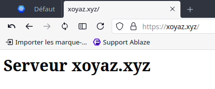

### Site statique

Le site statique et synchronisé depuis l'ordinateur local via rsync après chaque regénération 

Modifier le fichier Caddyfile : `sudo nano /etc/caddy/Caddyfile`

```
static.xoyaz.xyz {
    root * /var/caddy//Divers/static/
    encode gzip
    file_server
}
```

Redémarrer le serveur

    sudo systemctl restart caddy

Voir lien <https://static.xoyaz.xyz>  
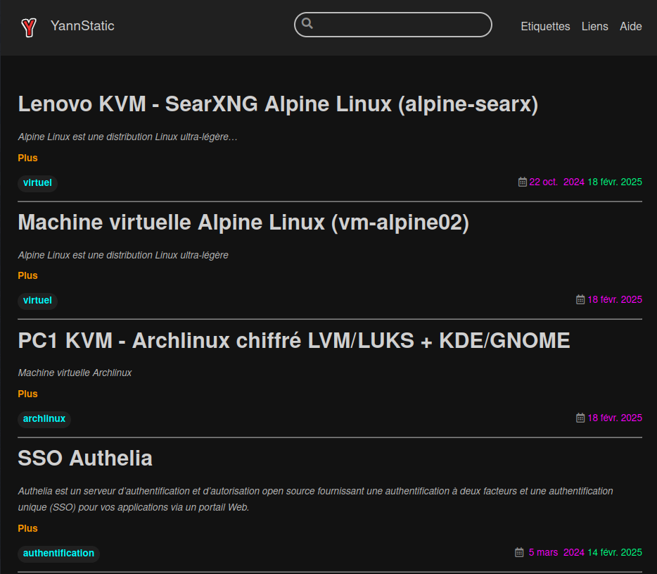

## Maintenance

### Mises à jour automatiques sur debian

[Mises à jour automatiques sur Debian](/posts/Debian_unattended-upgrades_mise_a_jour_auto/)

## Webdock réinstallation yockbis

Se connecter sur l'accompte webdock   
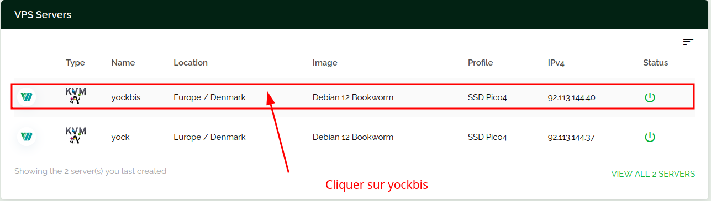  
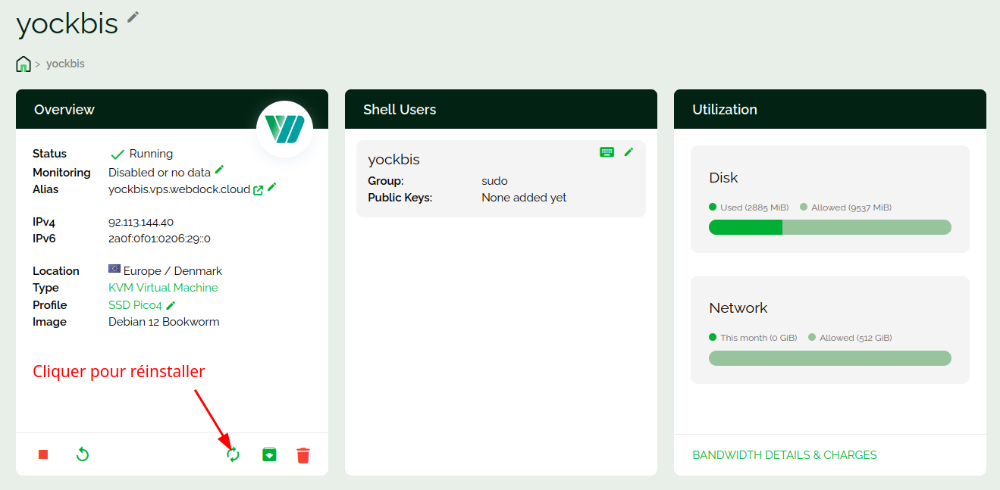  
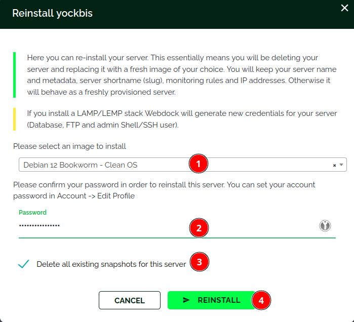{:width="400"}  
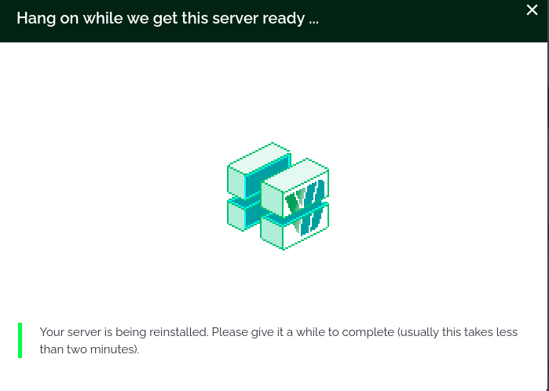{:width="400"}  
Patienter...


