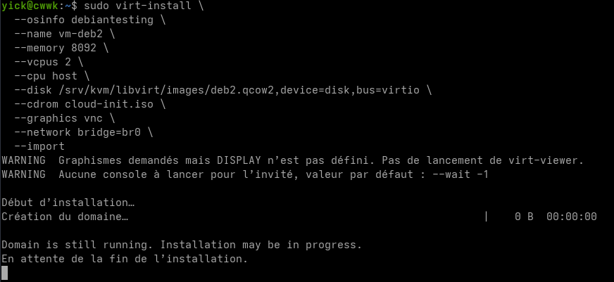
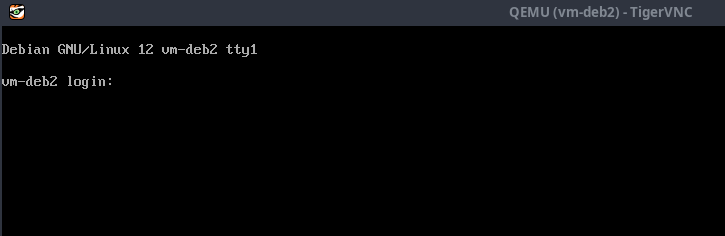
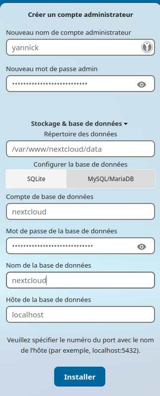

+++
title = 'cwwk KVM - Serveur virtuel Debian 12 (vm-deb2), test nextcloud'
date = 2025-03-27 08:00:00 +0100
categories = ['virtuel']
+++
*Comment installer Debian 12 sur un serveur KVM grâce à l'utilisation de l'une des images cloud officielles de Debian. Se connecter via ssh sur la machine qui héberge QEMU/KVM* 

## Debian cloud images

{:width="80"}  
*Si vous exploitez un nuage privé ou une plateforme de virtualisation fonctionnant avec KVM, comme OpenStack et oVirt. La manière la plus idéale de faire tourner une machine virtuelle Debian 12 est d'utiliser une image de nuage. Dans ce blog, nous vous montrons comment télécharger l'image officielle du nuage Debian 12 et créer une instance de machine virtuelle à partir de celle-ci sur l'hyperviseur KVM.* 

* **generic** : Doit fonctionner dans n'importe quel environnement
* **genericcloud** : devrait fonctionner dans n'importe quel environnement virtualisé. Il est plus petit que generic car il exclut les pilotes pour le matériel physique.
* **nocloud** : Principalement utile pour tester le processus de construction lui-même. N'a pas installé cloud-init, mais permet à l'utilisateur de se connecter en tant que root sans mot de passe.

### Prérequis

Les packages cloud-utils et whois 

    sudo apt update && sudo apt install cloud-utils whois -y

**cloud-utils** est nécessaire pour exécuter la commande **cloud-localds** , pour créer l'image ISO cloud init ultérieurement et valider la configuration cloud-init.  
**whois** pour exécuter la commande **mkpasswd** ultérieurement si nous voulons l'utiliser pour générer la version hachée de notre mot de passe pour la configuration **cloud-init**.

L'extension php8.x-yaml donne accès au standard de sérialisation **YAML Ain't Markup Language (YAML)**.  
L'analyse syntaxique et la production de données sont effectuées par la bibliothèque » LibYAML. 

    sudo apt install php8.3-yaml

Le paquet **libguestfs-tools**, qui contient l'utilitaire **virt-sysprep**

    sudo apt install libguestfs-tools

### Télécharger Image cloud debian

Télécharger la dernière image **debian bookworm generic** dans le dossier `/srv/kvm/libvirt/images/` en la renommant deb2.qcow2

```shell
wget https://cloud.debian.org/images/cloud/bookworm/latest/debian-12-generic-amd64.qcow2 -O /srv/kvm/libvirt/images/deb2.qcow2
```

### Choisir un nom

Tout d'abord, choisissez un nom pour votre nouveau VPS. Je crée toujours un invité « modèle », à partir duquel je le clone ensuite pour créer les autres invités

VM_NAME="vm-deb2"

### Augmenter la taille du disque

L'image qcow2 que nous avons extraite était destinée à une très petite machine virtuelle qui manquera rapidement d'espace si vous commencez à l'utiliser pour quoi que ce soit. Je recommanderais d'augmenter la taille du disque à la taille souhaitée pour la machine virtuelle. Dans ce cas, je règle 20 Go.

```
DESIRED_SIZE=12G
DOSSIER="/srv/kvm/libvirt/images"

sudo qemu-img resize \
  $DOSSIER/deb2.qcow2 \
  $DESIRED_SIZE
```

### Générer une paire de clés SSH

Génération

```shell
ssh-keygen -t ed25519 -o -a 100 -f ~/.ssh/vm-deb2
```
{: .nolineno }

La clé publique

```
ssh-ed25519 AAAAC3NzaC1lZDI1NTE5AAAAIJkwn15syqfLql9YFdZSZzgthj4qyEd65GnoZ+iXgdYc yick@cwwk
```

### Créer un fichier de configuration cloud

Script PHP modifiable pour générer un fichier `cloud-config.cfg`

Télécharger le script 

    wget https://files.programster.org/tutorials/cloud-init/create-debian-12-kvm-guest-from-cloud-image/generate.php -O generate-cloud-cfg.php

Remplissez les paramètres en haut du script `generate-cloud-cfg.php`

```php
<?php

# Fill in these settings as appropriate to you.

# Set the hostname for the guest.
$hostname = "vm-deb2";

# Specify your username and password
$username = "debyan";
$password = "debyan49";

# Set a random salt string here for password hashing
$randomSaltString = '9120794cd6920b7c74d7';

# Specify the public keys of the private-keys you wish to login with.
$sshPublicKeys = [
    'ssh-ed25519 AAAAC3NzaC1lZDI1NTE5AAAAIJkwn15syqfLql9YFdZSZzgthj4qyEd65GnoZ+iXgdYc yick@cwwk',
];

##### End of settings. Do not edit below this line #######
##########################################################
```
{: .nolineno }

Exécutez ensuite le script pour générer votre fichier **cloud-init.cfg** 

    php generate-cloud-cfg.php

> Ce script nécessite que vous ayez installé l'extension PHP YAML
{: .prompt-tip }


### Créer le fichier d'initialisation ISO du cloud

Créez le fichier ISO à partir du fichier de configuration cloud que nous venons de créer :

```bash
sudo cloud-localds \
  cloud-init.iso \
  cloud-init.cfg
```

Dans le dossier courant

```
generate-cloud-cfg.php
cloud-init.cfg
cloud-init.iso
```

> Dans la Liste des types d'image `sudo virt-install --osinfo list |grep debian`, debian 12 n'existe pas donc le type sera **debiantesting**
{: .prompt-tip }

Créer l'invité virtuel en exécutant la commande suivante :

```
sudo virt-install \
  --osinfo debiantesting \
  --name vm-deb2 \
  --memory 8092 \
  --vcpus 2 \
  --cpu host \
  --disk /srv/kvm/libvirt/images/deb2.qcow2,device=disk,bus=virtio \
  --cdrom cloud-init.iso \
  --graphics vnc \
  --network bridge=br0 \
  --import
```

Après avoir exécuté la commande précédente  


Le serveur debian cwwk n’a pas d’affichage, il faut créer un tunnel ssh depuis un poste client

```shell
ssh -L 5900:127.0.0.1:5900 yick@192.168.0.205 -p 55205 -i /home/yann/.ssh/yick-ed25519
```
{: .nolineno }

Puis lancer de ce même poste un client VNC (TigerVNC viewer)    
{:width="300"}  
la console s'affiche    


> ATTENTION **Clavier qwerty**  
Saisir utilisateur/Mot de passe
{: .prompt-warning }

Relever adresse IP : `ip a` --> 192.168.10.16

### Connexion SSH

*Dans un terminal du serveur debian cwwk*

Se connecter SSH avec la clé 

```shell
ssh debyan@192.168.10.16 -i .ssh/vm-deb2
```
{: .nolineno }

Définir un mot de passe root.

```shell
sudo -s
passwd root
```
{: .nolineno }

## KVM debian virtuel vm-deb2 

### Définir le fuseau horaire

Définir le fuseau horaire sur **Europe/Paris** 

    sudo dpkg-reconfigure tzdata

### Réseau (netplan)

*netplan est utilisé comme gestionnaire réseau avec l'image debian cloud*

Basculer en mode root 

Pour désactiver les capacités de configuration réseau de cloud-init, écrire un fichier `/etc/cloud/cloud.cfg.d/99-disable-network-config.cfg` 

    echo "network : {config : disabled}" > /etc/cloud/cloud.cfg.d/99-disable-network-config.cfg

Les périphériques du réseau

    ip link show

```
1: lo: <LOOPBACK,UP,LOWER_UP> mtu 65536 qdisc noqueue state UNKNOWN mode DEFAULT group default qlen 1000
    link/loopback 00:00:00:00:00:00 brd 00:00:00:00:00:00
2: enp1s0: <BROADCAST,MULTICAST,UP,LOWER_UP> mtu 1500 qdisc fq_codel state UP mode DEFAULT group default qlen 1000
    link/ether 52:54:00:52:fe:c0 brd ff:ff:ff:ff:ff:ff
```

*[Netplan](https://netplan.io/) est un utilitaire qui permet de configurer facilement le réseau sous Linux.*

* [Gestion du réseau Linux avec Netplan](https://linux.goffinet.org/administration/configuration-du-reseau/gestion-du-reseau-linux-avec-netplan/)
* [How to configure IPv6 with Netplan](https://www.snel.com/support/how-to-configure-ipv6-with-netplan-on-ubuntu-18-04/)

Les fichiers de configuration sont dans le dossier `/etc/netplan`  
On retire les fichiers de configuration originaux 

```shell
mkdir /etc/backup.netplan
mv /etc/netplan/* /etc/backup.netplan/
```
{: .nolineno }

Configuration statique de l’interface **enp1s0**

```shell
bash -c 'cat << EOF > /etc/netplan/01-enp1s0.yaml
network:
  version: 2
  renderer: networkd
  ethernets:
    enp1s0:
      addresses:
        - 192.168.10.110/24
      nameservers:
        addresses:
        - 1.1.1.1
        - 9.9.9.9
        search: []
      routes:
      - to: default
        via: 192.168.10.1
EOF'
```
{: .nolineno }

Droits

    chmod 600 /etc/netplan/01-enp1s0.yaml

Et on génère la configuration 

```
netplan generate
```

`Cannot call openvswitch: ovsdb-server.service is not running`  
Il s'agit juste d'un avertissement...

Redémarrer la machine virtuelle

### Connexion ssh vm-deb2

**A - Dans un terminal du serveur debian cwwk**

Se connecter SSH avec la clé et la nouvelle adresse

```shell
ssh debyan@192.168.10.110 -i .ssh/vm-deb2
```
{: .nolineno }

**B - Dans un terminal du poste linux PC1**

```shell
ssh-keygen -t ed25519 -o -a 100 -f ~/.ssh/cwwk-vm-deb2
# droits
chmod 600 ~/.ssh/cwwk-vm-deb2
```
{: .nolineno }

Ajouter la clé publique au fichier `~/.ssh/authorized_keys` de la machien virtuelle

```
ssh-ed25519 AAAAC3NzaC1lZDI1NTE5AAAAIHxD7ROqzMsYKG0QseNLNgpltPooT71NvaNxMpcHop8j yann@PC1
```

Utilisation commande proxy pour se connecter depuis PC1 vers la machine virtuelle vm-deb2

```bash
ssh -o ProxyCommand="ssh -W %h:%p -p 55205 -i /home/yann/.ssh/yick-ed25519 yick@192.168.0.205" debyan@192.168.10.110 -p 22 -i /home/yann/.ssh/cwwk-vm-deb2
```

## Domaine local et certificats

*Les opérations suivantes sont à effectuer sur le __[serveur Debian 12 CWWK rnmkcy.eu](/posts/CWWK_X86_P5-Intel_N100/)__*

### Local cloud.home.arpa

[CWWK X86-P5 Intel N100 Serveur Debian 12 - Gérer un domaine local](/posts/CWWK_X86_P5-Intel_N100/#gérer-un-domaine-local-avec-unbound)

En mode su

Création domaine local **cloud.home.arpa**, modidier le fichier `/etc/unbound/unbound.conf.d/cwwk-unbound.conf`  
Ajouter les lignes suivantes et enregitrer

```
    local-data: "cloud.home.arpa 86400 IN A 192.168.10.110"
    local-data-ptr: "192.168.10.110 86400 cloud.home.arpa."
```

Vérifier la configuration

    unbound-checkconf /etc/unbound/unbound.conf.d/cwwk-unbound.conf

Une fois tout configuré et Unbound relancé

    systemctl restart unbound

Tester avec dig

```
yick@cwwk:~$ dig cloud.home.arpa

; <<>> DiG 9.18.33-1~deb12u2-Debian <<>> cloud.home.arpa
;; global options: +cmd
;; Got answer:
;; ->>HEADER<<- opcode: QUERY, status: NOERROR, id: 52984
;; flags: qr aa rd ra; QUERY: 1, ANSWER: 1, AUTHORITY: 0, ADDITIONAL: 1

;; OPT PSEUDOSECTION:
; EDNS: version: 0, flags:; udp: 1232
;; QUESTION SECTION:
;cloud.home.arpa.		IN	A

;; ANSWER SECTION:
cloud.home.arpa.	86400	IN	A	192.168.10.110

;; Query time: 0 msec
;; SERVER: 192.168.0.205#53(192.168.0.205) (UDP)
;; WHEN: Thu Mar 27 12:51:58 CET 2025
;; MSG SIZE  rcvd: 60

yick@cwwk:~$ dig -x 192.168.10.110

; <<>> DiG 9.18.33-1~deb12u2-Debian <<>> -x 192.168.10.110
;; global options: +cmd
;; Got answer:
;; ->>HEADER<<- opcode: QUERY, status: NOERROR, id: 61131
;; flags: qr aa rd ra; QUERY: 1, ANSWER: 1, AUTHORITY: 0, ADDITIONAL: 1

;; OPT PSEUDOSECTION:
; EDNS: version: 0, flags:; udp: 1232
;; QUESTION SECTION:
;110.10.168.192.in-addr.arpa.	IN	PTR

;; ANSWER SECTION:
110.10.168.192.in-addr.arpa. 86400 IN	PTR	cloud.home.arpa.

;; Query time: 0 msec
;; SERVER: 192.168.0.205#53(192.168.0.205) (UDP)
;; WHEN: Thu Mar 27 12:52:15 CET 2025
;; MSG SIZE  rcvd: 81
```

### Certificats mkcert

*Mkcert est un outil simple qui peut être utilisé pour fabriquer des certificats de confiance localement.*

[Générer des certificats SSL auto-signés avec mkcert](/posts/Generer_des_certificats_SSL_auto-signes_avec_mkcert/)

Installer mkcert

```shell
# installer mkcert
sudo apt install mkcert
# Générer autorité de certification CA
mkcert -install
# Localisation
mkcert -CAROOT  # --> /home/yick/.local/share/mkcert
# Contenu 
ls /home/yick/.local/share/mkcert # --> rootCA-key.pem  rootCA.pem
# Validité autorité de certification
openssl x509 -noout -text -in /home/yick/.local/share/mkcert/rootCA.pem  |grep "Not After"
# --> Not After : Mar 27 08:12:19 2035 GMT
```


Générer un certificat local pour le domaine **cloud.home.arpa**

```shell
mkcert cloud.home.arpa
```

Résultat exécution

```
Created a new certificate valid for the following names 📜
 - "cloud.home.arpa"

The certificate is at "./cloud.home.arpa.pem" and the key at "./cloud.home.arpa-key.pem" ✅

It will expire on 27 June 2027 🗓
```

Le certificat se retrouve dans le dossier où vous avez exécuté la commande mkcert

### Copier certificats sur machine virtuelle

Nous disposons du certificat d'une autorité de certification : **rootCA.pem**  et du certificat pour le domaine **cloud.home.arpa**

Copier les fichiers suivants: rootCA.pem cloud.home.arpa-key.pem et cloud.home.arpa.pem sur la machine virtuelle

```shell
# syntaxe : scp -i ~/.ssh/id_rsa.pub FILENAME USER@SERVER:/home/USER/FILENAME
scp -i .ssh/vm-deb2 $(mkcert -CAROOT)/rootCA.pem debyan@192.168.10.110:/home/debyan/rootCA.pem
scp -i .ssh/vm-deb2 cloud.home.arpa-key.pem debyan@192.168.10.110:/home/debyan/cloud.home.arpa-key.pem
scp -i .ssh/vm-deb2 cloud.home.arpa.pem debyan@192.168.10.110:/home/debyan/cloud.home.arpa.pem

``` 

### Sur la machine virtuelle

#### Activer l'autorité de certification

```shell
sudo mv rootCA.pem /usr/local/share/ca-certificates/mkcert.pem
sudo update-ca-certificates
```

#### Tester certificat avec nginx  

Déplacer le certificat et sa clé

```shell
mv cloud.home.arpa* /etc/ssl/private/
```

Créer un fichier de configuration `/etc/nginx/conf.d/cloud.home.arpa.conf`

```shell
cat <<EOF >>/etc/nginx/conf.d/cloud.home.arpa.conf
server {
  listen  80;
  server_name cloud.home.arpa;
  return 301 https://$server_name$request_uri;
  root /var/www/html;
}
server {
  listen *:443 ssl http2;
  server_name cloud.home.arpa;
  ssl_certificate /etc/ssl/private/cloud.home.arpa.pem;
  ssl_certificate_key /etc/ssl/private/cloud.home.arpa-key.pem;
  root /var/www/html;
}
EOF
```

Créer un dossier /var/www/html

```shell
mkdir -p /var/www/html
```

Fichier index.html

```
cat <<EOF >>/var/www/html/index.html
<!DOCTYPE html>
<html>
<head>
<meta charset="UTF-8">
<title>cloud.home.arpa</title>
<style>
html { color-scheme: light dark; }
body { width: 35em; margin: 0 auto;
font-family: Tahoma, Verdana, Arial, sans-serif; }
</style>
</head>
<body>
<h1>cloud.home.arpa</h1>
<p>Test du certificat local généré par mkcert</p>

<p>For online documentation and support please refer to
<a href="http://nginx.org/">nginx.org</a>.<br/>
</p>

<p><em>Page de test</em></p>
</body>
</html>
EOF
```

Recharger nginx:  `sudo systemctl reload nginx`  
Tester le lien <https://cloud.home.arpa>

## Nextcloud

[Nginx PHP MariaDB Nextcloud Hub](/posts/Nginx-PHP-MariaDB-Nextcloud_Hub/)

Installation nginx + PHP8.3 + MariaDB

Installer Nextcloud Hub

```shell
# mode su
# installer bzip2
apt install bzip2
# téléchargement
wget https://download.nextcloud.com/server/releases/latest.tar.bz2
# checksum et vérification
#wget https://download.nextcloud.com/server/releases/latest.tar.bz2.sha256
#sha256sum -c latest.tar.bz2.sha256 < latest.tar.bz2 
# Décompression, déplacement et effacement
tar -xvf latest.tar.bz2
mv nextcloud /var/www/
rm latest.tar.bz2
# Utilisateur nextcloud et droits
useradd -r nextcloud
chown -R nextcloud:www-data /var/www/nextcloud
chmod -R o-rwx /var/www/nextcloud
```

Pool PHP

```shell
cat > /etc/php/8.3/fpm/pool.d/nextcloud.conf << EOF
[nextcloud]

user = nextcloud
group = nextcloud

chdir = /var/www/nextcloud

listen = /var/run/php/php8.3-fpm-nextcloud.sock
listen.owner = www-data
listen.group = www-data

pm = dynamic
pm.max_children = 16
pm.max_requests = 500
request_terminate_timeout = 1d


pm.start_servers = 6
pm.min_spare_servers = 5
pm.max_spare_servers = 8


; Additional php.ini defines, specific to this pool of workers.
env[PATH] = /usr/local/sbin:/usr/local/bin:/usr/sbin:/usr/bin:/sbin:/bin
php_admin_value[memory_limit] = 512M
php_value[upload_max_filesize] = 10G
php_value[post_max_size] = 10G
php_value[default_charset] = UTF-8
php_value[opcache.enable_cli]=1
php_value[opcache.memory_consumption]=256
php_value[opcache.interned_strings_buffer]=128
php_value[opcache.max_accelerated_files]=32530
php_value[opcache.save_comments]=1
php_value[opcache.revalidate_freq]=60
php_value[opcache.jit]=1255
php_value[opcache.jit_buffer_size]=128M
php_value[apc.enabled]=1
php_value[apc.enable_cli]=1
EOF
```

Redémarrer 

    systemctl restart php8.3-fpm

[Configuration ssl](https://ssl-config.mozilla.org/#server=nginx&version=1.24.0&config=modern&openssl=1.1.1n&guideline=5.7): nginx 1.22.1 et OpenSSL 3.0.15

Créer en conséquence le fichier le fichier `/etc/nginx/conf.d/security.conf.inc` ci-dessous suivant le résultat de la requête précédente

```
    ssl_certificate /etc/ssl/private/cloud.home.arpa.pem;
    ssl_certificate_key /etc/ssl/private/cloud.home.arpa-key.pem;
    ssl_session_timeout 1d;
    ssl_session_cache shared:MozSSL:10m;  # about 40000 sessions
    ssl_session_tickets off;

    # modern configuration
    ssl_protocols TLSv1.3;
    ssl_ecdh_curve X25519:prime256v1:secp384r1;
    ssl_prefer_server_ciphers off;

    # OCSP stapling
    ssl_stapling on;
    ssl_stapling_verify on;

    # verify chain of trust of OCSP response using Root CA and Intermediate certs
    ssl_trusted_certificate /etc/ssl/private/cloud.home.arpa.pem;

    # replace with the IP address of your resolver;
    # async 'resolver' is important for proper operation of OCSP stapling
    resolver 1.1.1.1;
```

Le fichier de configuration web cloud.rnmkcy.eu.conf `/etc/nginx/conf.d/cloud.home.arpa.conf`

* Il faut modifier le fichier “mime.types” situé dans /etc/nginx/ : `application/javascript js mjs;`  
* Redémarrer php et nginx : `sudo systemctl restart php8.3-fpm nginx`

Ouvrir le lien <https://cloud.home.arpa>   


ATTENTION: il est possible d'arriver sur un écran noir, touche esc pour retour normal
