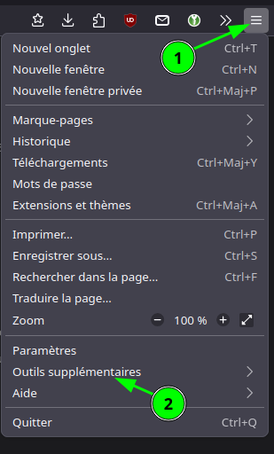
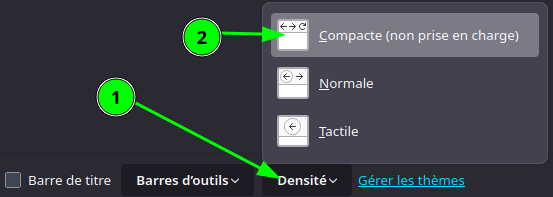
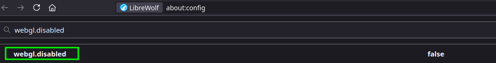
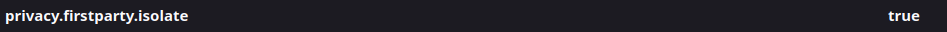
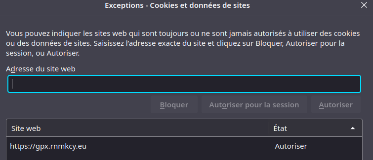
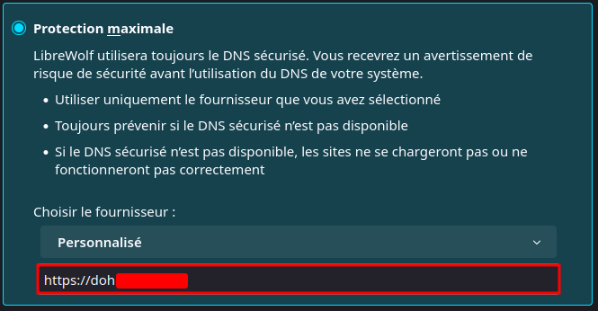
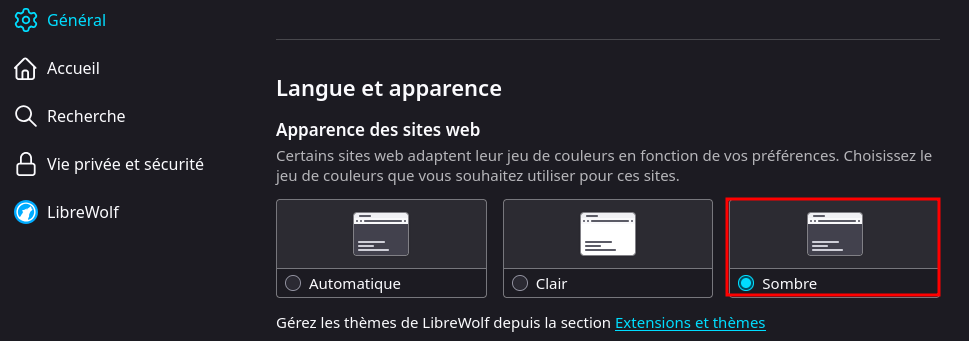

+++
title = 'Navigateur LibreWolf'
date = 2025-03-31 09:00:00 +0200
categories = ['navigateur']
+++
*Si vous recherchez un navigateur qui met un point d’honneur à protéger votre vie privée, [LibreWolf](https://librewolf.net/) est fait pour vous. Basé sur Firefox, il va encore plus loin dans la lutte contre le suivi et le profilage des utilisateurs. Là où Firefox se contente de limiter la collecte de données, LibreWolf la supprime purement et simplement. Fini la télémétrie, les rapports de plantage ou les recommandations personnalisées : avec LibreWolf, aucune information vous concernant ne quitte votre ordinateur.*  
{:width="150" .w-25 .left} Mais LibreWolf ne se contente pas de couper les ponts avec les serveurs de Mozilla. Il intègre nativement l’extension [uBlock Origin](https://www.justgeek.fr/ublock-origin-bloqueur-de-publicite-42417/), qui bloque les traqueurs et les publicités sur tous les sites web, mais aussi des paramètres avancés pour limiter votre empreinte numérique. Vous pouvez ainsi naviguer de manière plus sereine, sans craindre d’être pisté à chaque clic.

En termes de performances, LibreWolf se démarque également. Lors du test [Speedometer](https://browserbench.org/Speedometer3.0/), qui évalue la réactivité des navigateurs, LibreWolf a obtenu le score le plus élevé jamais enregistré : « Infinity ». preuve que LibreWolf offre une expérience de navigation ultra-fluide !

Si la **rapidité de navigation** et la **protection de votre vie privée** sont vos priorités absolues, **LibreWolf** est le navigateur qu’il vous faut.

💻 Plateforme : Windows et Linux  
🌍 Langue de l’interface par défaut : Anglais, mais possibilité de passer en français  
🌐 Moteur de recherche par défaut : DuckDuckGo  
🧩 Extension(s) préinstallée(s) : uBlock Origin  
👀 Télémétrie : Aucune  
⏱️ Speedometer : Infinity  
⚙️ Principales caractéristiques : Confidentialité maximale et performances exceptionnelles  


## Mise en place navigateur LibreWolf

Améliorer la densité de l'affichage des menus  

1.    Saisissez `about:config` dans la barre d’adresse de LibreWolf, puis appuyez sur **Entrée**  
Une page d’avertissement peut apparaître. Cliquez sur Accepter le risque et poursuivre pour accéder à la page `about:config`.
3.    Recherchez la préférence `browser.compactmode.show`
4.    Basculez la préférence à **true** et fermez l’onglet.
5.    Cliquez sur le bouton de menu   

7.    Sélectionner **Personnaliser la barre d'outils…**
8.    En bas du panneau  
  
Sélectionner **Compacte (non prise en charge)** dans le menu d’options.
10.   Cliquez sur Terminé 

Les extensions activées


> ATTENTION: L'extension **keepassxc-browser** nécessite de créer un lien avec le dossier `~/.mozilla/native-messaging-hosts` du navigateur Firefox (obligation d'avoir Firefox installé avec l'extension)
{: .prompt-warning }

Création du lien

```shell
ln -s $HOME/.mozilla/native-messaging-hosts $HOME/.librewolf/native-messaging-hosts
```

## Modification paramétrage LibreWolf

La première chose à faire est de saisir  `about:config` dans la barre d'adresse de **LibreWolf** (Firefox), d'appuyer sur Entrée, puis d'accepter les risques.

### About config

Paramétrageaccessible par saisie de `about:config`

* Paramètres modifiés sur LibreWolf
    * *Webgl est utilisé par le gestionnaire de cartes gpx.rnmkcy.eu et n'est pas activé par défaut sur le navigateur LibreWolf*  
Saisir `webgl.disabled` dans le champ recherche et double-clic sur **webgl.disabled** pour le faire basculer en **false**  

    * `media.peerconnection.enabled` (changer sur false ) – Désactiver WebRTC est une bonne idée, car cela peut révéler votre véritable adresse IP, même avec un bon VPN. Consultez le [guide des fuites WebRTC](https://cyberinsider-com.translate.goog/webrtc-leaks/?_x_tr_sl=auto&_x_tr_tl=fr&_x_tr_hl=fr) pour plus de détails et savoir comment désactiver WebRTC dans d'autres navigateurs. 
    * `geo.enabled` (changer en false ) – Cela désactive le suivi de géolocalisation.

    * `privacy.firstparty.isolate` (changer en true ) – Il s’agit d’une autre excellente mise à jour du projet Tor Uplift qui isole les cookies du domaine propriétaire.  

* Paramètre par défaut sur LibreWolf
    * `privacy.resistFingerprinting`  (à modifier sur  true ) – Modifier cette valeur à true offre une protection de base, mais est loin d'être une solution complète. La préférence privacy.resistFingerprinting a été ajoutée à Firefox dans le cadre du projet Tor Uplift et continue d'être améliorée.  


>Les paramètes **privacy.resistFingerprinting**, **webgl.disabled**, **media.peerconnection.enabled**, **geo.enabled** et **privacy.firstparty.isolate** ont été modifiés pour atténuer l'empreinte digitale du navigateur LibreWolf
{: .prompt-info }

## Vie privée et sécurité

### Cookies et données de sites

{: width="400" .normal}

### DNS

Par défaut LibreWolf active **Protection par défaut** pour le DNS via HTTPS

Utiliser un DNS personnalisée en **Protection maximale**   
{: width="400" .normal}

## Activer le thème sombre dans LibreWolf

LibreWolf, une fourche de Firefox axée sur la vie privée, vise à résister par défaut aux empreintes digitales du navigateur. L'une de ses mesures de protection est l'application d'un thème de lumière pour tous les sites Web afin d'empêcher de révéler la préférence du thème système. Cependant, parfois naviguer avec un thème de lumière forcée peut être un peu ennuyeux, surtout si vous préférez le mode sombre pour une navigation nocturne plus confortable.

Alors, comment pouvez-vous activer un thème sombre tout en maintenant votre vie privée sur Internet?

### FPP sur RFP

En utilisant RFP (Resist Fingerprinting) dans LibreWolf, il est impossible d'appliquer un thème sombre car il verrouille les paramètres du navigateur, y compris les schémas de couleurs, pour éviter de donner des préférences identifiables. Cependant, il ya une solution de rechange! En passant à FPP (Fingerprinting Protection) et en modifiant quelques paramètres, vous pouvez activer le thème sombre sans sacrifier toute votre protection des empreintes digitales.
Comment activer Dark Thème avec FPP

Suivez ces étapes pour la mettre en place :

Ouvrez LibreWolf et saisir `about:config`

Modifier les paramètres de configuration suivants :

```
privacy.resistFingerprinting = false
privacy.fingerprintingProtection = true
privacy.fingerprintingProtection.overrides = +AllTargets,-CSSPrefersColorScheme,-JSDateTimeUTC
```

En désactivant `resistFingerprinting` et en permettant `fingerprintingProtection` avec les correctifs, vous pouvez restaurer les préférences du schéma de couleurs tout en conservant la majorité des fonctionnalités anti-empreinte.

Cette modification vous permet de profiter d'un thème sombre sans perdre toutes les protections contre les empreintes digitales du navigateur.

### Pourquoi ça marche ?

L'option `fingerprintingProtection` dans LibreWolf est plus flexible que `resistFingerprinting`. Il permet aux utilisateurs d'ajuster certains aspects des empreintes digitales tout en maintenant les autres en place. En survolant le CSS prefers-color-scheme, vous permettez aux sites Web de détecter votre préférence pour le thème (light ou dark), tout en protégeant contre d'autres types d'empreintes digitales. De plus, en incluant -JSDateTimeUTC, vous empêchez le navigateur de manipuler le fuseau horaire, ce qui pourrait autrement conduire à des problèmes où les sites Web affichent la mauvaise heure ou date.

### Apparences des sites web

Après les modiciations précédentes, il est possible de changer l'apparence  
{: width="600" .normal}
