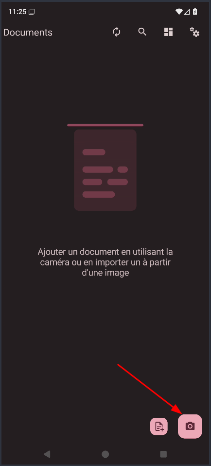
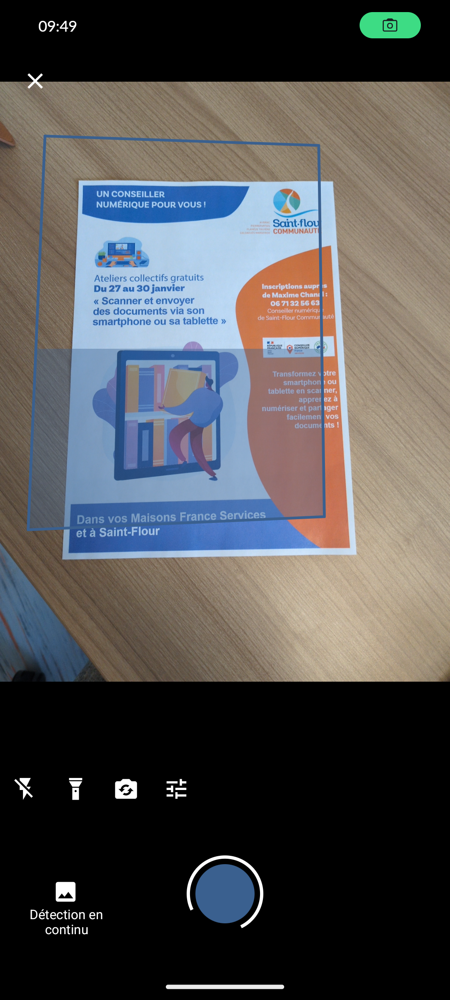
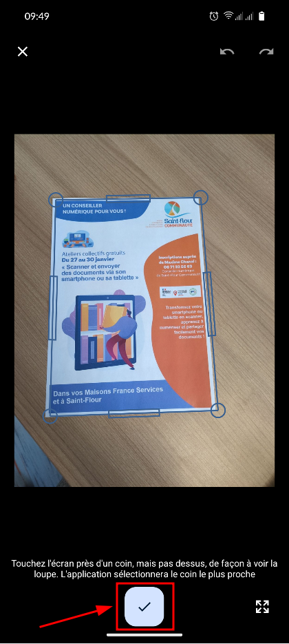
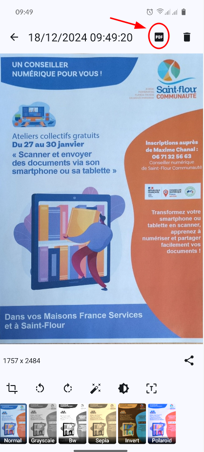
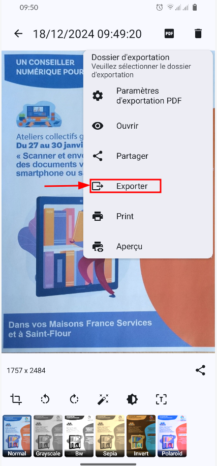
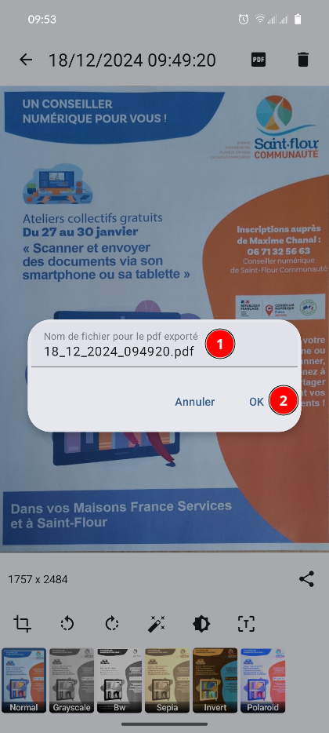

+++
title = 'Numérisation documents - OSS Document Scanner'
date = 2025-04-09 09:30:00
categories = ['android']
+++
*L’OSS Document Scanner est une application android Open Source pour numériser tous vos documents. 
Soit vous numérisez à l’aide de votre appareil photo, soit en important une image. 
L’application détectera automatiquement votre document dans la photo et recadrera l’image. 
Une fois le document créé, vous pouvez détecter le texte dans le document à l’aide de l’OCR. 
Vous pouvez également partager votre document au format PDF. 
Si vous le souhaitez, vous pouvez synchroniser les données de l’application avec un serveur webdav (comme nextloud) pour ne jamais rien perdre !*

1. Ouvrez l’application.  
{:width="100" .normal}
2. Appuyez sur le bouton « Numériser » en bas à droite, qui est en forme d’appareil photo. 
{:width="200" .normal}
3. Mettez votre document à plat sur une table. Plus votre document se détachera du fond, mieux ce sera. Une fois fait, pointez votre appareil sur le document et cadrez-le. L’application va détecter automatiquement le document et le numériser automatiquement (Un rectangle bleu se remplit, comme sur l’image ci-contre).  
{:width="200" .normal}
4. Une fois la photo prise, vous pouvez utiliser les poignées qui s’affichent sur les bords et les angles de votre document pour ajuster le cadrage. Appuyez sur le bouton ✔️ en bas pour valider  
{:width="200" .normal}
5. Nous voici devant la prévisualisation de la numérisation. Appuyez sur « PDF » en haut à droite.
{:width="200" .normal}
6. Appuyez sur « Exporter ».   
{:width="200" .normal} 
7. Tapez le nom que vous souhaitez donner à votre document, puis validez en appuyant sur « OK ».  
{:width="200" .normal}
