+++
title = 'VPS webdock - Serveur de messagerie Stalwart'
date = 2025-04-15 08:00:00
categories = ['vps']
+++
*[Webdock](https://webdock.io/en), des serveurs VPS évolutifs et des services cloud conçus pour répondre à vos besoins à tout moment.* 


### Préalable

Ce post fait suite au post [VPS webdock (VPS webdock yockbis (xoyaz.xyz)](/posts/webdock-yockbis/) 

On va réinstaller le VPS et donc réutiliser les clés SSH `vps-yockbis` et `vps-yockbis.pub`

Se connecter sur son compte à l'adresse <https://webdock.io>

### yockbis

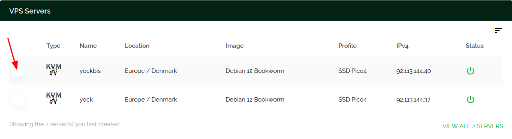{: width="500" .normal}

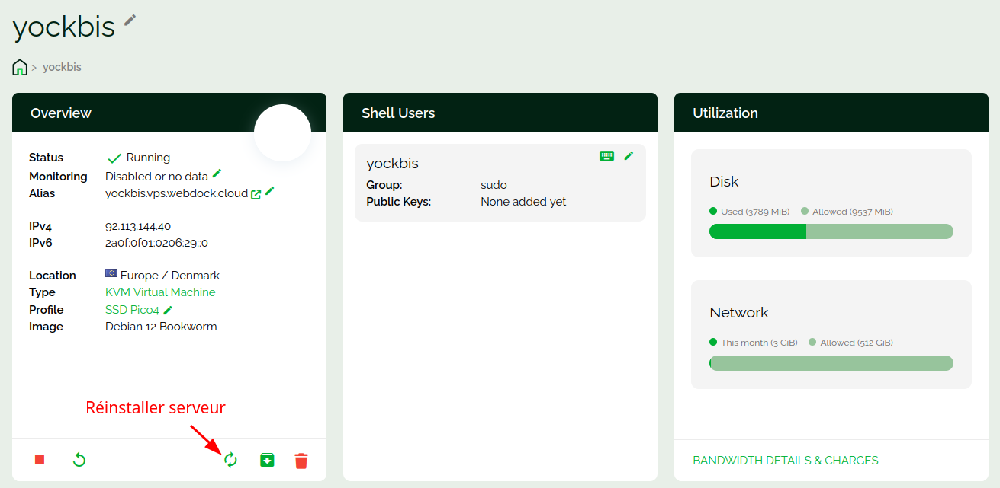{: width="500" .normal}

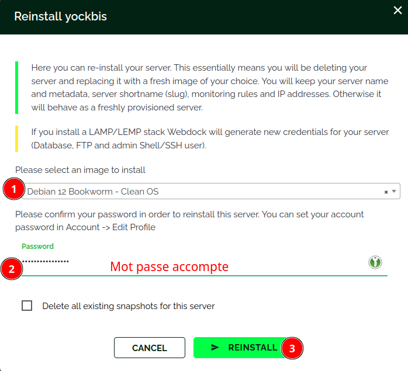{: width="250" .normal}

Après quelques minutes...  
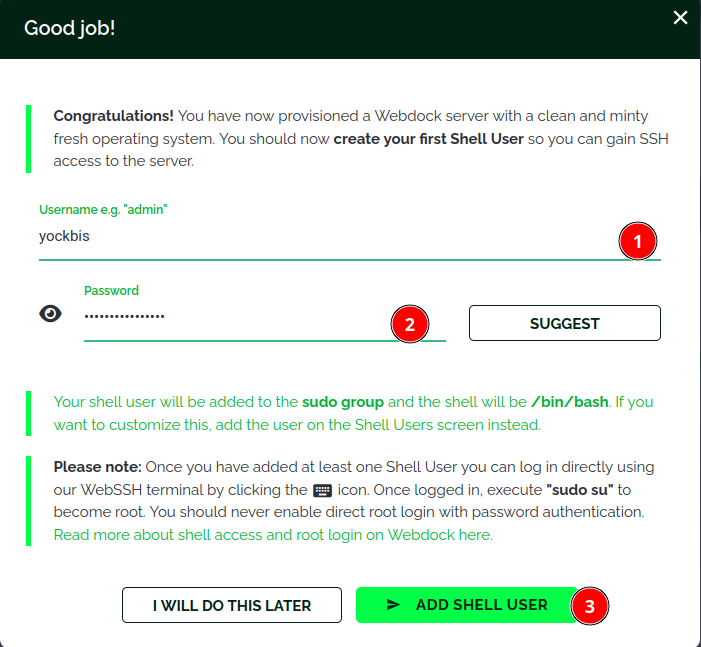{: width="250" .normal}

Le VPS yockbis  
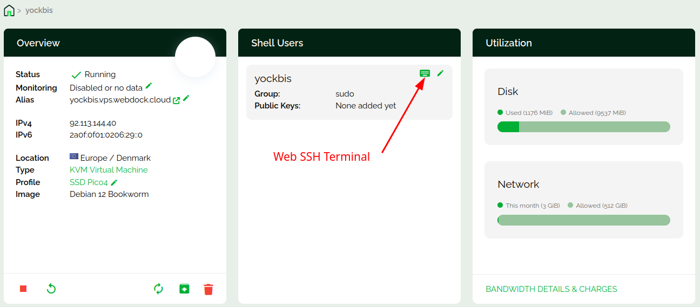{: width="500" .normal}

Ouverture en mode Web Terminal (<https://webdock.io/en/dash/webssh/yockbis/yockbis>) est dépendante du paramétrage navigateur, il peut ne pas fonctionner si la sécutité navigateur est élevée   
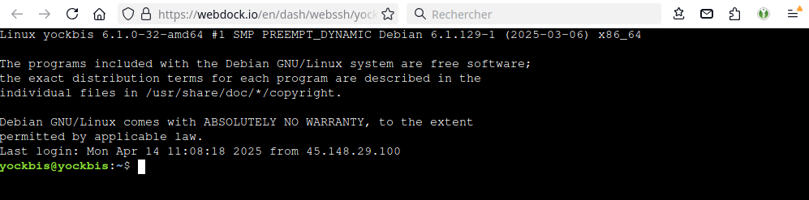{: width="500" .normal}

### Connexion SSH avec clé

Se connecter sur un terminal web (<https://webdock.io/en/dash/webssh/yockbis/yockbis>)  

Ajouter la clé publique `~/.ssh/vps-yockbis.pub`  

    echo "ssh-ed25519 AAAAC3NzaC1lZDI1NTE5AAAAIObDm+2vx7qUDuMnJaKH9NcULmT1OgmSAOKXL+G9jKkr yann@PC1" >> .ssh/authorized_keys

Modifier le port sshd  55040

    sudo nano /etc/ssh/sshd_config

Les paramètres pour une connexion SSH avec clé est sans mot de passe

```
Port 55040
# Pour désactiver les mots de passe en texte clair transmis par tunnel, il faut changer pour no ici !
PasswordAuthentication no 
# Positionné à "no" par défaut dans la création des VPS Webdock
```

Redémarrer le serveur sshd

    sudo systemctl restart sshd

### Poste linux appelant

Tester la connexion ssh depuis le poste linux

    ssh -p 55040 -i ~/.ssh/vps-yockbis yockbis@92.113.144.40 

Sur le poste linux, ajout site "yockbis" à  FileZilla 

* Site: yockbis  
* SFTP protocol
    * Hôte: 92.113.144.40
    * Port: 55040
* Authentification: Fichier clef
    * Utilisateur: yockbis
    * Fichier clef: /home/yann/.ssh/vps-yockbis


### Gestion utilisateur

Créer les droits pour l'utilisateur courant

```bash
echo "$USER ALL=(ALL) NOPASSWD:ALL" |sudo tee /etc/sudoers.d/90-utilisateur
```

Supprimer utilisateur debian et ses droits sudo 

```bash
sudo userdel debian
sudo rm -r /home/debian/
sudo rm /etc/sudoers.d/90-cloud-init-users
```

### Mise à jour

Mise à jour Debian

```bash
sudo apt update
sudo apt upgrade
```

### Motd

Afficher lors de la connexion SSH , `/etc/motd`

```
 __      __     _        _           _    __   __ ___  ___ 
 \ \    / /___ | |__  __| | ___  __ | |__ \ \ / /| _ \/ __|
  \ \/\/ // -_)| '_ \/ _` |/ _ \/ _|| / /  \ V / |  _/\__ \
   \_/\_/ \___||_.__/\__,_|\___/\__||_\_\   \_/  |_|  |___/
                 _    _     _                              
  _  _  ___  __ | |__| |__ (_) ___                         
 | || |/ _ \/ _|| / /| '_ \| |(_-<                         
  \_, |\___/\__||_\_\|_.__/|_|/__/                         
  |__/                                                     
  ___  ___     _  _  ____    _  _ _   _ _    _ _    __     
 / _ \|_  )   / |/ ||__ /   / || | | | | |  | | |  /  \    
 \_, / / /  _ | || | |_ \ _ | ||_  _||_  _|_|_  _|| () |   
  /_/ /___|(_)|_||_||___/(_)|_|  |_|   |_|(_) |_|  \__/    
```

### Hostname serveur

Modification hostname du serveur qui hébergera Stalwart Mail  
Il faut mettre le domaine complet du serveur mail: mail.xoyaz.xyz

Fichier `/etc/hostname`

```
mail.xoyaz.xyz
```

Fichier `/etc/hosts`

```
127.0.1.1	yockbis
127.0.0.1 mail.xoyaz.xyz localhost
::1		localhost ip6-localhost ip6-loopback
ff02::1		ip6-allnodes
ff02::2		ip6-allrouters
```

Vérification : `hostnamectl`

```
 Static hostname: mail.xoyaz.xyz
       Icon name: computer-vm
         Chassis: vm 🖴
      Machine ID: 4a2cf9fef33c498da3e61663731b07e8
         Boot ID: ebc9aa0a467b4ac5a69f784e536fd6ee
  Virtualization: kvm
Operating System: Debian GNU/Linux 12 (bookworm)  
          Kernel: Linux 6.1.0-33-amd64
    Architecture: x86-64
 Hardware Vendor: QEMU
  Hardware Model: Standard PC _Q35 + ICH9, 2009_
Firmware Version: unknown
```

### Parefeu

Installation Debian / Ubuntu
	

```shell
sudo apt install ufw
```

Les règles

```shell
sudo ufw allow 55040/tcp  # port SSH
sudo ufw allow https      # port 443
# Ouvrir les ports 25,587 et 993 pour le serveur messagerie
sudo ufw allow 25
sudo ufw allow 587
sudo ufw allow 993
```

Activer le parefeu


```shell
sudo ufw enable
```

### Certificats xoyaz.xyz

[Serveur , installer et renouveler les certificats SSL Let's encrypt via Acme](/posts/Acme-Certficats-Serveurs/)

Créer les certificats

```shell
acme.sh --dns dns_ovh --server letsencrypt --issue --keylength ec-384 -d 'xoyaz.xyz' -d 'mail.xoyaz.xyz'
```

Les certificats

```
[Tue Apr 15 08:29:33 AM UTC 2025] Your cert is in: /home/yockbis/.acme.sh/mail.xoyaz.xyz_ecc/mail.xoyaz.xyz.cer
[Tue Apr 15 08:29:33 AM UTC 2025] Your cert key is in: /home/yockbis/.acme.sh/mail.xoyaz.xyz_ecc/mail.xoyaz.xyz.key
[Tue Apr 15 08:29:33 AM UTC 2025] The intermediate CA cert is in: /home/yockbis/.acme.sh/mail.xoyaz.xyz_ecc/ca.cer
[Tue Apr 15 08:29:33 AM UTC 2025] And the full-chain cert is in: /home/yockbis/.acme.sh/mail.xoyaz.xyz_ecc/fullchain.cer
```

Le certificat `/home/yockbis/.acme.sh/mail.xoyaz.xyz_ecc/fullchain.cer` et sa clé `/home/yockbis/.acme.sh/mail.xoyaz.xyz_ecc/mail.xoyaz.xyz.key`

### Réseau systemd-network

lister les interfaces: `networkctl list`

```
IDX LINK TYPE     OPERATIONAL SETUP     
  1 lo   loopback carrier     unmanaged
  2 eth0 ether    routable    configured
```

Le fichier de configuration: `/etc/systemd/network/10-cloud-init-eth0.network`

```
[Address]
Address=2a0f:0f01:0206:29::0/124

[Address]
Address=92.113.144.40/32

[Match]
Name=eth0

[Network]
DHCP=no
DNS=8.8.8.8 1.1.1.1 2001:4860:4860::8888 2606:4700:4700::1111


[Route]
Gateway=169.254.255.1
GatewayOnLink=True

[Route]
Gateway=fe80::1
```

### Webdock - Reverse DNS

Aller dans la rubrique **Manage Server Identity**   
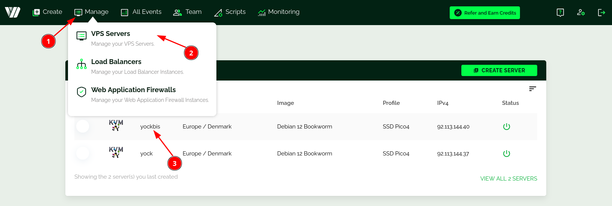{: .normal}  
Cliquer sur **CHECKS DOMAINS** puis sur **SET IDENTITY**

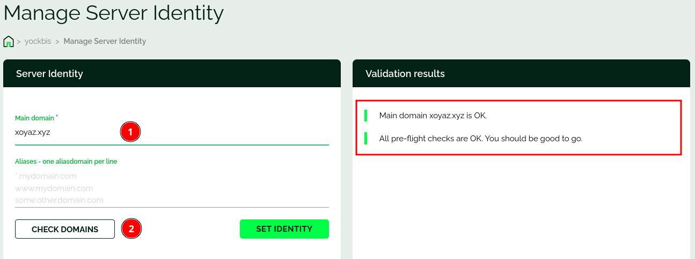{: .normal}  

Outils

```shell
sudo apt install dnsutils
```

Vérification

```shell
dig -x 92.113.144.40 +short            # --> xoyaz.xyz.
dig -x 2a0f:f01:206:29::0 +short       # --> xoyaz.xyz.
```

## Stalwart Mail Server

{: .normal}

* [Stalwart Mail Server- Getting started](https://stalw.art/docs/get-started/)
* [How to Setup and Configure Stalwart Email Server](https://webshanks.com/setup-and-configure-stalwart-email-server/)

Exigences :

*    Un VPS avec un port 25 ouvert : **Webdock yockbis**
*    Un nom de domaine enregistré  : **xoyaz.xyz**
*    Domaine mail:  **mail.xoyaz.xyz**

Outils

```shell
sudo apt install git socat
```

### Enregistrements DNS

Configuration DNS OVH

|Type| Name  | Content             | Priority | TTL |
|:--:|:---- |:--------------------|:--------:|:----:|
|A| xoyaz.xyz  | 92.113.144.40 | | Auto |
|A| mail       | 92.113.144.40 | | Auto |
|MX| xoyaz.xyz  | mail.xoyaz.xyz | 10 | Auto |
|TXT| _dmarc  | v=DMARC1; p=none; | | Auto |
|TXT| xoyaz.xyz  | v=spf1 a mx ip4:92.113.144.40 ip6:92.113.144.40 ~all | | Auto |

### Installer et configurer Stalwart

créer un répertoire pour Stalwart.

```shell
sudo mkdir -p /opt/stalwart-mail
sudo chown $USER -R /opt/stalwart-mail
```

Passer en mode root: `sudo -s`

Pour installer Stalwart Mail Server sous Linux, exécutez la commande suivante dans votre terminal 

```shell
cd /opt/stalwart-mail
curl --proto '=https' --tlsv1.2 -sSf https://get.stalw.art/install.sh -o install.sh
sudo sh install.sh /opt/stalwart-mail/install
```

En utilisant les identifiants fournis, connectez-vous à votre Stalwart

```
⏳ Downloading stalwart-mail for x86_64-unknown-linux-gnu...
stalwart-mail
🖥️  Creating 'stalwart-mail' account...
✅ Configuration file written to /opt/stalwart-mail/install/etc/config.toml
🔑 Your administrator account is 'admin' with password 'jZ2BmPau6i'.
🔐 Setting permissions...
🚀 Starting service...
Created symlink /etc/systemd/system/multi-user.target.wants/stalwart-mail.service → /etc/systemd/system/stalwart-mail.service.
🎉 Installation complete! Continue the setup at http://yockbis:8080/login
```

Le serveur n'a pas de carte graphique, on utlise le proxy ssh

```shell
ssh -L 9500:localhost:8080 -p 55040 -i ~/.ssh/vps-yockbis yockbis@92.113.144.40
```

Ouvrir le lien `localhost:9500` sur le poste appelant    
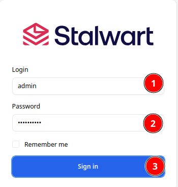{: width="200" .normal}  
Assurez-vous de vérifier les paramètres > Server (1) > Network (2)   
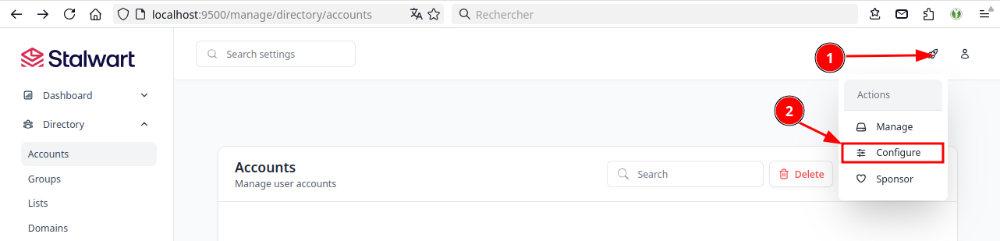{: .normal}  

Modifier votre nom d'hôte   
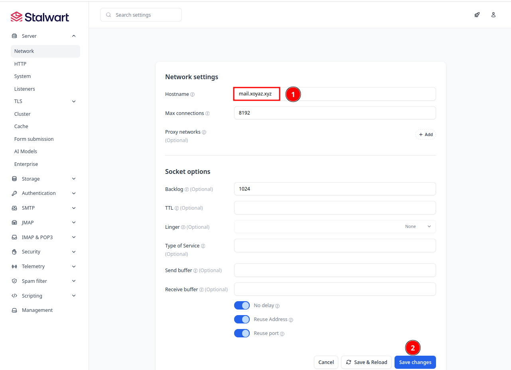{: .normal}  

Revenir en mode manage  
{: .normal}  
 
Ajout domaine to Management > Directory > Domains, Create domain  
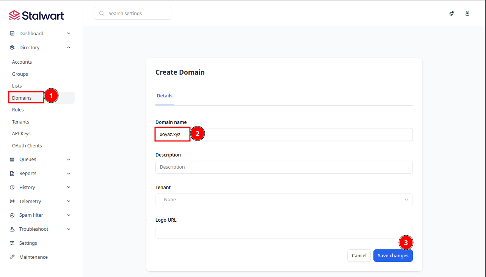{: .normal}  

Ensuite, visualisez les enregistrements DNS afin que nous puissions ajouter notre DKIM à nos enregistrements DNS.  
{: .normal}  

Ajoutez ce DKIM à votre fournisseur DNS pour compléter notre authentification.  
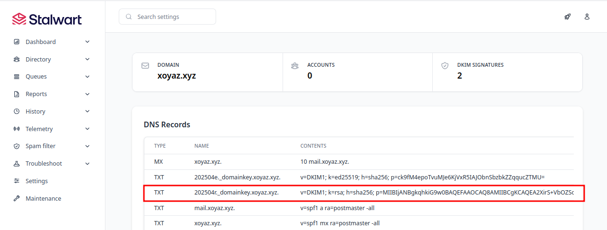{: .normal}  
DNS OVH ajout DKIM: cocher Version, Algorithme -256 et Type de clé    

xxxxxxxxxxxxxxxxxxxxxxxxxxxxxxxxxxxxxxxxxxxxx

Ensuite, nous allons activer TLS afin que nous puissions accéder à notre nom d'hôte ainsi que de nous connecter aux clients en toute sécurité.   

>Impossible d'utiliser les méthodes DNS-01, TLS-ALPN-01 et HTTP-O1 , il manque DNS-OVH
{: .prompt-warning }

On va copier le certificat `/home/yockbis/.acme.sh/xoyaz.xyz_ecc/fullchain.cer` et sa clé `/home/yockbis/.acme.sh/xoyaz.xyz_ecc/xoyaz.xyz.key`


Dans Configure: Settings > Server > TLS > Certificates  

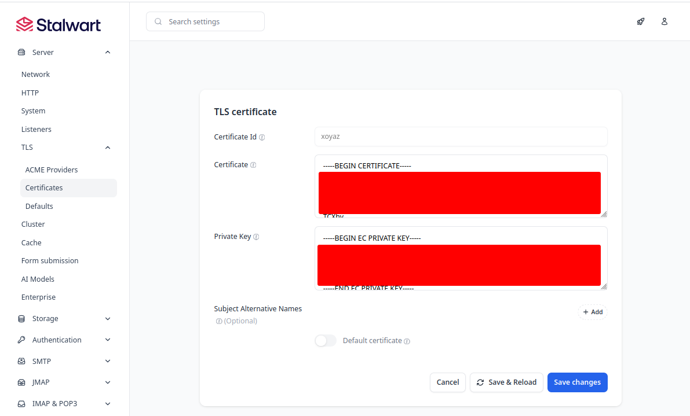{: .normal}  
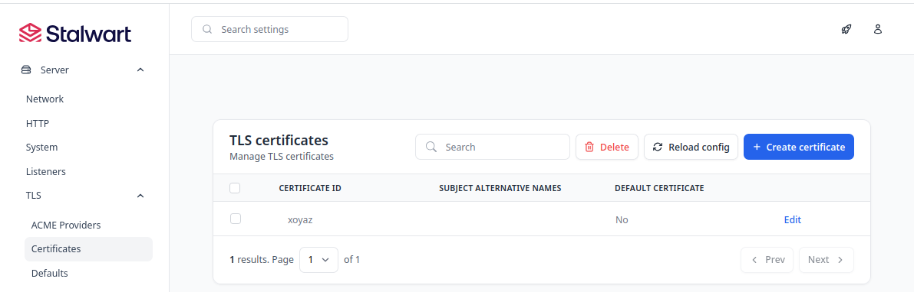{: .normal}  

Il faut redémarrer le service

```shell
sudo systemctl restart stalwart-mail
```

### Créer un compte de messagerie

Nous ajoutons un compte email.

Allez à Manageme > Directory > Accounts , **Create a new accounr**  
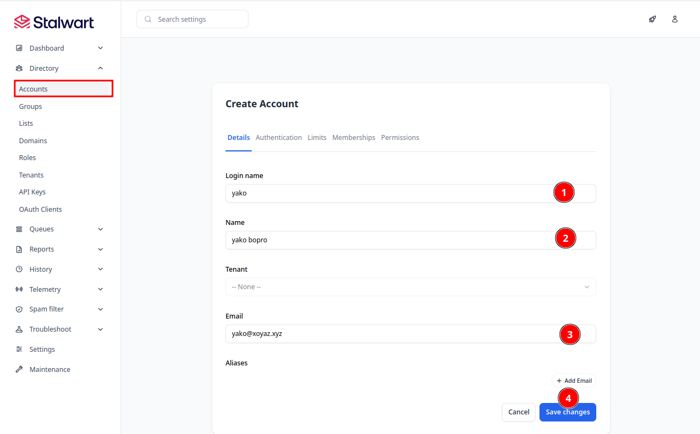{: .normal}  
Ne pas oublier d'ajouter le mot de passe  
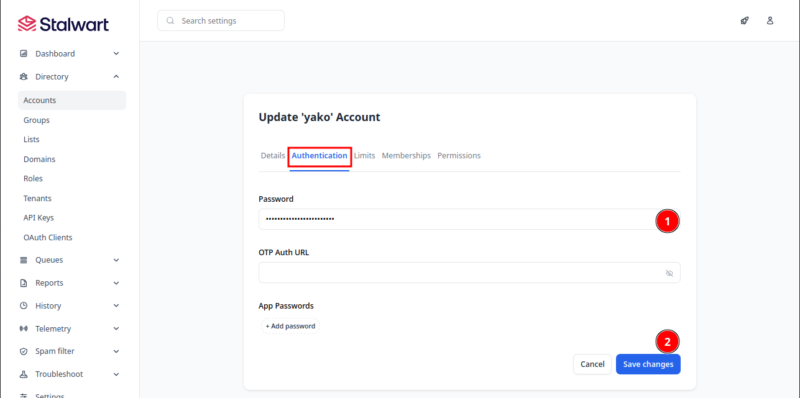{: .normal}  

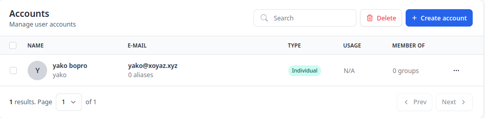{: .normal}  

### Ajouter un nouveau domaine

Cela dépend également du moteur de répertoire que vous utilisez. Si vous utilisez le [répertoire interne](https://stalw.art/docs/auth/backend/internal), vous pouvez créer et gérer des domaines en utilisant l'interface [web-admin](https://stalw.art/docs/management/webadmin/overview). 

L'envoi d'e-mails depuis un nouveau domaine n'exige pas non plus de configuration supplémentaire, mais pour améliorer la livraison, il est recommandé de [créer une nouvelle clé DKIM](https://stalw.art/docs/smtp/authentication/dkim/sign#generating-dkim-keys), de l'ajouter à vos [enregistrements DNS](https://stalw.art/docs/smtp/authentication/dkim/sign#publishing-dkim-keys) et d'[activer la signature DKIM](https://stalw.art/docs/smtp/authentication/dkim/sign#multiple-domains) pour le nouveau domaine.


## Thunderbird

*Stalwart n'a pas d'email web, donc nous devons utiliser un client de messagerie externe.* 

Aller dans Paramètre des comptes et ajouter  

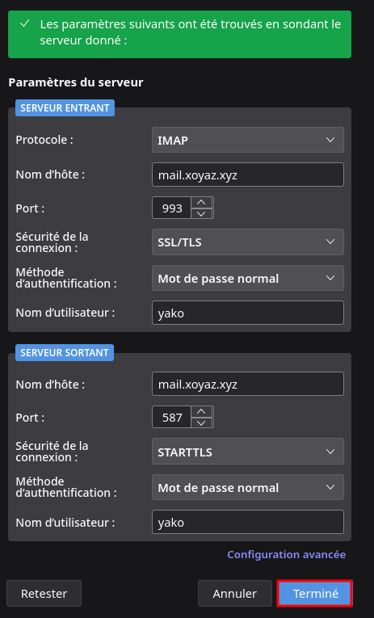{:width="350" .normal}   
Problèmes avec le certificat....

Test messagerie  
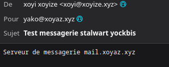{:width="300" .normal}

Maintenant que nous avons connecté notre Stalwart à Thunderbird, laissez-nous tester notre e-mail.

Allez au testeur de courrier <https://www.mail-tester.com/>.

Je vais envoyer un e-mail de test.  
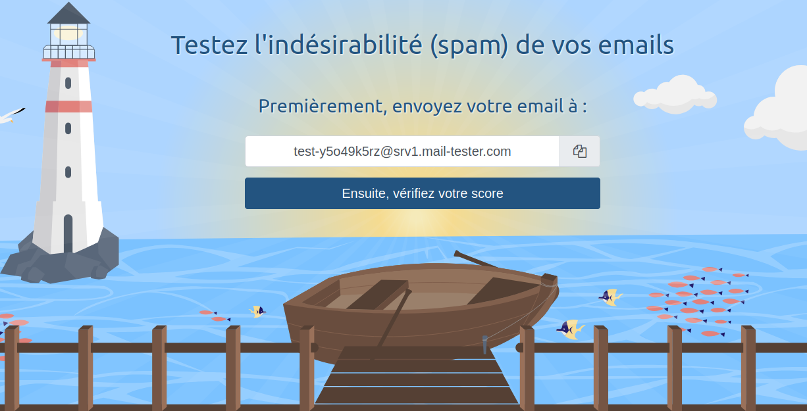{: .normal}

## Management

[(Stalwart Management)](https://stalw.art/docs/management/).

### MTA-STS

MTA-STS, ou Agent de transfert de courrier Strict Transport Security, est un mécanisme de sécurité pour les systèmes de messagerie pour protéger contre l'écoute et la manipulation des courriels pendant la transmission. Il est conçu pour s'assurer que l'email est envoyé et reçu sur des connexions sécurisées, comme TLS.

MTA-STS travaille en publiant une déclaration de politique sous la forme d'un enregistrement TXT DNS bien connu, en spécifiant les domaines de messagerie qui supportent MTA-STS et les exigences pour assurer la transmission de courriel. Le serveur e-mail de réception récupérera l'énoncé de politique MTA-STS et vérifiera que la connexion entrante répond aux exigences de sécurité spécifiées dans la politique. Si la connexion ne répond pas aux exigences, le courriel ne sera pas accepté et sera rejeté. MTA-STS fournit une couche supplémentaire de sécurité pour la transmission des courriels, ce qui rend plus difficile pour les attaquants d'écouter ou de modifier les messages électroniques. Cela peut aider à empêcher que des informations sensibles soient interceptées ou modifiées en transit, et fournir une expérience de courriel plus sécurisée pour les utilisateurs.

#### Outbound Configuration

Indique s'il faut utiliser MTA-STS sur les connexions sortantes peut être configuré avec la propriété `queue.outbound.tls.mta-sts` qui accepte les valeurs suivantes:

- `optional`: Utilisez MTA-STS uniquement si une politique STS pour le domaine a été publiée.
- `require`: Exiger MTA-STS et ne pas livrer à moins qu'une politique STS valide ne soit disponible (non recommandée à moins d'être utilisée en vertu d'une règle personnalisée).
- `disable`: N'utilisez jamais MTA-STS.

Ajouter au fichier `/opt/stalwart-mail/install/etc/config.toml` :

```toml
[queue.outbound.tls]
mta-sts = "optional"
```

#### Édition des politiques

Une politique MTA-STS est un moyen pour les propriétaires de domaine de déclarer que leurs serveurs d'email support TLS, précisant que les messages doivent être envoyés uniquement sur une connexion sécurisée. La politique vise à améliorer la sécurité du transport par courrier électronique en réduisant le risque d'attaques de l'homme dans le milieu et en veillant à ce que le cryptage de la couche de transport soit correctement utilisé.


La politique MTA-STS est publiée sur une URL HTTPS spécifique, sous le chemin `/.well-known/mta-sts.txt` du domaine hébergeant le service SMTP. Le contenu de ce fichier, connu sous le nom de fichier de politique MTA-STS, comprend généralement :

- **version**: Spécifie la version du standard MTA-STS. Actuellement, c'est `STSv1`.
- **mode**: Définit le mode opérationnel de la politique (`none`, `testing`, or `enforce`). Le mode `enforce` nécessite l'envoi de serveurs pour se connecter uniquement sur des connexions sécurisées, tandis que le mode `testing` permet aux propriétaires de domaines de surveiller les défaillances de la politique sans affecter la livraison du courrier.
- **mx**: Liste les serveurs de messagerie autorisés à recevoir des courriels pour le domaine. Seuls ces serveurs sont considérés comme des destinataires valides.
- **max_age**:  Indique la durée, en secondes, que l'expéditeur a pour mettre en cache et appliquer la politique MTA-STS du domaine.


Le serveur de courrier Stalwart peut automatiser la publication des fichiers de politique MTA-STS pour tous les domaines hébergés. Cette fonctionnalité garantit que tous les domaines gérés par le serveur maintiennent une politique à jour, améliorant la sécurité des courriels dans plusieurs domaines sans nécessiter des mises à jour manuelles de la politique. Les options de configuration suivantes sont disponibles pour la publication de la politique MTA-STS:

- `session.mta-sts.mode`:  Le mode opérationnel de la politique MTA-STS (`none`, `testing`, ou `enforce`).
- `session.mta-sts.max-age`: L'âge maximal de la politique MTA-STS en secondes.
- `session.mta-sts.mx`: Surpasser la liste des serveurs de messagerie autorisés à recevoir des courriels pour le domaine. Si ce n'est pas spécifié, les noms d'hôte inclus dans tous les certificats TLS pour le domaine seront utilisés.

>Pour publier automatiquement les politiques MTA-STS, il est essentiel d'ouvrir le port 443 (le port standard pour le trafic HTTPS). Ce port permet à Stalwart Mail Server de servir les fichiers de la politique MTA-STS via HTTPS, en respectant les exigences du protocole et en veillant à ce que les politiques soient accessibles aux autres serveurs de messagerie effectuant des vérifications de politique..
{: .prompt-tip }

Pour le domaine xoyaz.xyz, ajouter au fichier `/opt/stalwart-mail/install/etc/config.toml`:

```toml
[session.mta-sts]
mode = "testing"
max-age = "7d"
mx = ["mail.xoyaz.xyz"]
```

Redémarrer le serveur mail

```
sudo systemctl restart stalwart-mail
```

Le serveur Stalwart Mail peut générer automatiquement les enregistrements DNS MTA-STS pour vos domaines. Pour les obtenir, allez à la `Management` > `Directory` > `Domains` dans la section `Management` > `Directory` > `Domains` [(Webadmin)](https://stalw.art/docs/management/webadmin/overview/).

## Arrêt serveur Stalwart

*En attente d'une évolution pour la mise en place*

Arrêt et désactivation

```shell
sudo systemctl stop stalwart-mail
sudo systemctl disable stalwart-mail
```

## Snapshots - Création manuelle

>Les snapshots sont créés automatiquemnt chaque jour (Daily) et une fois par semaine (Weekly)
{: .prompt-info }

Se connecter sur son compte à l'adresse <https://webdock.io>  
Cliquer sur le VPS yockbis et dans **Server Management** sur **Snapshots**  

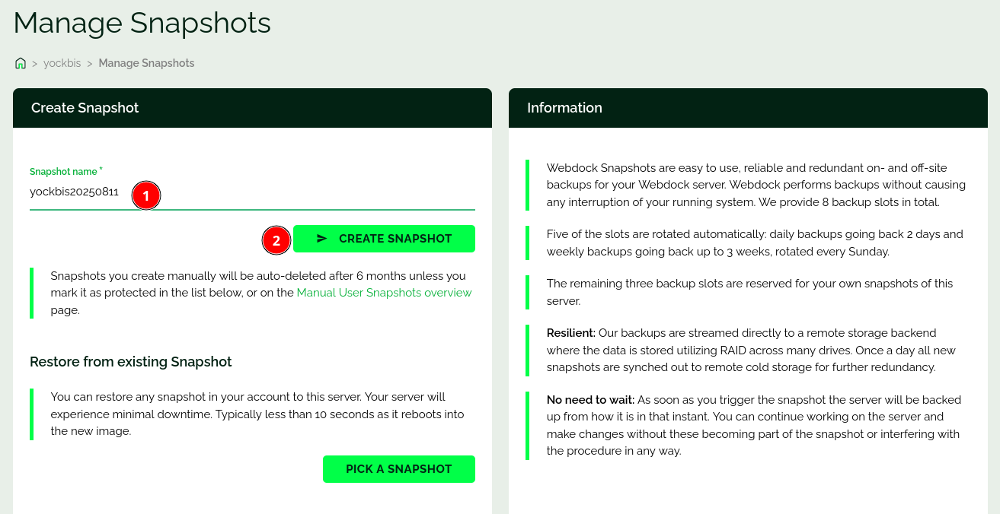{:width="400" .normal}  
Donner un nom au snapshot: **yockbis20250426** puis cliquer sur le bouton `> CREATE SNAPSHOT`  

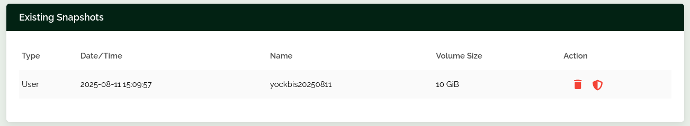{: .normal}  
Après 1 minute, temps de création du snapshot  

>__Les snapshots que vous créez manuellement seront effacés automatiquement après 6 mois__ à moins que vous ne le marquiez comme protégé dans la liste ci-dessous, ou sur la page [Manual User Snapshots overview](https://webdock.io/en/dash/servers/snapshots).
{: .prompt-tip }
