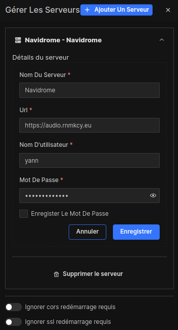
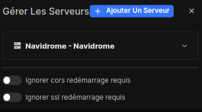
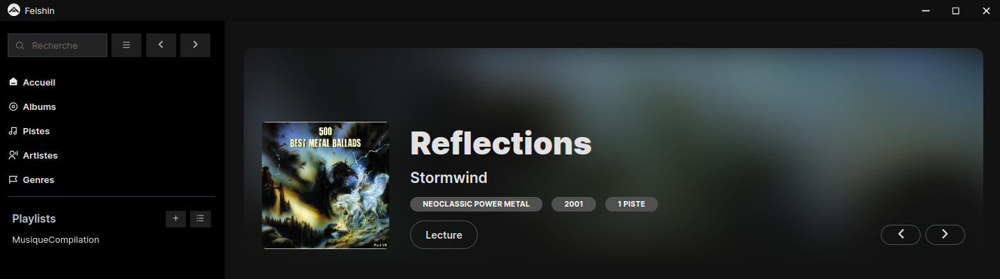
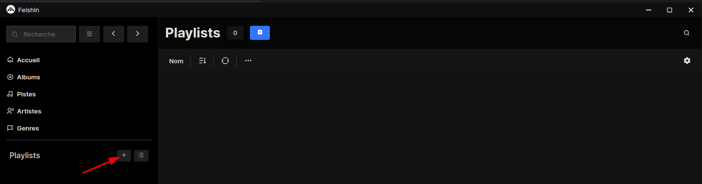
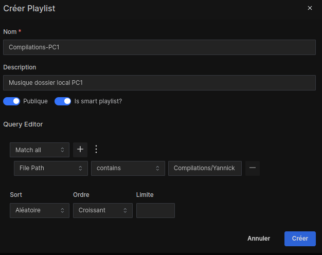
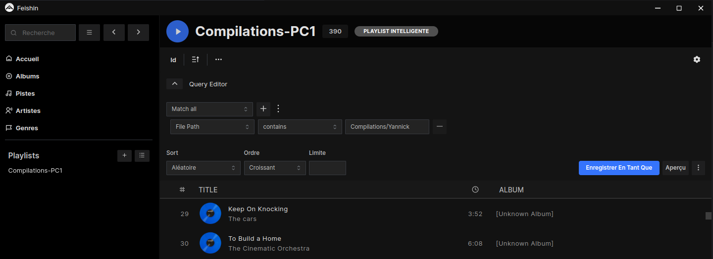

+++
title = 'PC1 Application lecteur de musique Feishin'
date = 2025-04-20 15:00:00
categories = ['application']
+++
*Une façon graphique de créer des playlists avec Feishin, un client de bureau/web pour Navidrome, qui prend en charge la création de listes de lecture intelligentes*

{: .left} Lecteur de musique Feishin pour se connecter à votre serveur de musique Navidrome et lire votre médiathèque, que ce soit sur votre navigateur préféré ou sur l'application de bureau dédiée tournant sous Linux.

* [Feishin – modern self-hosted music player](https://www.linuxlinks.com/feishin-modern-self-hosted-music-player/)
* [Installer Feishin avec Docker ](https://belginux.com/installer-feishin-avec-docker/)

## Archlinux

Installation sur archlinux

```shell
yay -S feishin-bin
```
### Paraméter feishin

Lancer l'application et sélectionner le serveur navidrome  
{:width="300" .left}  

{:width="300" .left}  

La page d'accueil  
{:width="600" .left}  

### Playlist

Créer une playlist nommée **Compilations-PC1** avec le contenu du dossier `Compilations/Yannick`

{: .left}  

{:width="400" .left}

{: .left} 