+++
title = 'Proxmox Lenovo Thinkcentre M700 Tiny'
date = 2025-08-07
categories = ['debian']
+++
*Proxmox VE est une plate-forme open-source complète pour la virtualisation d'entreprise. Grâce à l'interface Web intégrée, vous pouvez facilement gérer les machines virtuelles, le stockage, la mise en réseau, ...*

{: .normal}  

## Proxmox

### Liens


*    Site Officiel de Proxmox VE : <https://www.proxmox.com/proxmox-ve> 
*    Documentation de Proxmox VE : <https://pve.proxmox.com/wiki/>
*    Projet GitHub de Proxmox VE : <https://github.com/proxmox>
* [Débuter avec Proxmox VE : installation et premiers pas](https://www.it-connect.fr/tuto-bien-debuter-avec-proxmox-ve/)

### Installation via ISO

* Installation sur machine [Lenovo ThinkCentre M700 Tiny](/posts/Description_materiel_Lenovo_ThinkCentre_M700_Tiny_et_mise_a_jour_BIOS/)
* [Comment installer Proxmox VE 8 et créer des VMs ?](https://www.oameri.com/comment-installer-proxmox-ve-8-et-creer-des-vms/)
* Proxmox ISO 
    * Fichier **proxmox-ve_8.4-1.iso** 
    * Version 8.4-1  
    * File Size  1.57 GB  
    * Last Updated  April 09, 2025   
    * SHA256SUM    d237d70ca48a9f6eb47f95fd4fd337722c3f69f8106393844d027d28c26523d8

Installer ISO sur clé usb /dev/sdx 

    sudo dd if=proxmox-ve_8.4-1.iso of=/dev/sdx bs=4M

Démarrer la machine Lenovo sur la clé USB et procéder à l'installation de Proxmox

Interface : eno1  
FQDN : pve.home.arpa   
IP address: 192.168.0.215/24  
Gateway: 192.168.0.205  
DNS: 192.168.0.205  

Redémarage à la fin de l'installation et accès lien <https://192.168.0.215:8006>

Pour accéder à l'interface, connectez-vous en tant que root et fournissez le mot de passe que vous définissez lors de l'installation de Proxmox.  
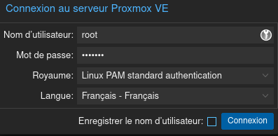{: width="300" .normal}

Une boîte de dialogue apparaît en disant qu'il n'y a pas d'abonnement valide pour le serveur. Proxmox offre un service complémentaire optionnel auquel vous pouvez vous abonner. Pour ignorer le message, cliquez sur OK.  
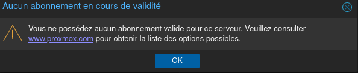{: .normal}


### Accès proxleno via SSH

*SSH activé avec autorisation connexion root*

Accès SSH : `ssh root@192.168.0.215`

#### Créé un second compte administrateur sur PROXMOX

Créé s’il n’existe pas déjà l’utilisateur **leno** sur votre serveur

    adduser leno

Cette commande permet d’ajouter l’utilisateur à la base d’authentification proxmox

    pveum useradd leno@pam

Cette commande change le mot de passe de l’utilisateur attention elle changera aussi le mot de passe du compte associé sur votre serveur. Vous pouvez ne pas l’utiliser si vous avez en tête votre mot de passe.

    pveum passwd leno@pam

Cette commande ajoute les droits Administrateurs sur toute l’interface à l’utilisateur qu’on vient de créer.

    pveum aclmod / -user leno@pam -roles Administrator

Cette commande désactive le compte administrateur root

    pveum usermod root@pam -enable 0

Si lors d’une manipulation vous avez un souci étrange et qu’il réclame le compte root (ajout de certificat par exemple) vous pouvez le réactiver avec l’interface web ou avec la commande.

    pveum usermod root@pam -enable 1

#### Connexion SSH PC1 --> Lenovo

**connexion avec clé**  
<u>sur l'ordinateur de bureau</u>
Générer une paire de clé curve25519-sha256 (ECDH avec Curve25519 et SHA2) pour une liaison SSH avec le serveur.  

    ssh-keygen -t ed25519 -o -a 100 -f ~/.ssh/lenovo-ed25519

Envoyer les clés publiques sur le serveur KVM   

    ssh-copy-id -i ~/.ssh/lenovo-ed25519.pub leno@192.168.0.215

<u>sur le serveur KVM</u>  
On se connecte  

    ssh root@192.168.0.215

Créer une configuration serveur SSH  `/etc/ssh/sshd_config.d/lenovo.conf`

```conf
PermitRootLogin no 
Port = 55215
PasswordAuthentication no
ChallengeResponseAuthentication yes 
```

Relancer le serveur

    systemctl restart sshd

Test connexion

    ssh -p 55215 -i ~/.ssh/lenovo-ed25519 leno@192.168.0.215

### Mises à jour proxmox

On se connecte en utilisateur leno sur proxmox

    ssh -p 55215 -i ~/.ssh/lenovo-ed25519 leno@192.168.0.215

Accés root par commande `su`  

On désactive les dépôts entreprise dans les fichiers `/etc/apt/sources.list.d/pve-enterprise.list` et `/etc/apt/sources.list.d/ceph.list`

```
# /etc/apt/sources.list.d/pve-enterprise.list
#deb https://enterprise.proxmox.com/debian/pve bullseye pve-enterprise
# /etc/apt/sources.list.d/ceph.list 
# deb https://enterprise.proxmox.com/debian/ceph-quincy bookworm enterprise
```

Lancer les mises à jour : `apt update && apt upgrade`  
Installer sudo : `apt install sudo`  

Le fichier `/etc/sudoers`

```shell
#
# This file MUST be edited with the 'visudo' command as root.
#
# Please consider adding local content in /etc/sudoers.d/ instead of
# directly modifying this file.
#
# See the man page for details on how to write a sudoers file.
#
Defaults	env_reset
Defaults	mail_badpass
Defaults	secure_path="/usr/local/sbin:/usr/local/bin:/usr/sbin:/usr/bin:/sbin:/bin"

# This fixes CVE-2005-4890 and possibly breaks some versions of kdesu
# (#1011624, https://bugs.kde.org/show_bug.cgi?id=452532)
Defaults	use_pty

# This preserves proxy settings from user environments of root
# equivalent users (group sudo)
#Defaults:%sudo env_keep += "http_proxy https_proxy ftp_proxy all_proxy no_proxy"

# This allows running arbitrary commands, but so does ALL, and it means
# different sudoers have their choice of editor respected.
#Defaults:%sudo env_keep += "EDITOR"

# Completely harmless preservation of a user preference.
#Defaults:%sudo env_keep += "GREP_COLOR"

# While you shouldn't normally run git as root, you need to with etckeeper
#Defaults:%sudo env_keep += "GIT_AUTHOR_* GIT_COMMITTER_*"

# Per-user preferences; root won't have sensible values for them.
#Defaults:%sudo env_keep += "EMAIL DEBEMAIL DEBFULLNAME"

# "sudo scp" or "sudo rsync" should be able to use your SSH agent.
#Defaults:%sudo env_keep += "SSH_AGENT_PID SSH_AUTH_SOCK"

# Ditto for GPG agent
#Defaults:%sudo env_keep += "GPG_AGENT_INFO"

# Host alias specification

# User alias specification

# Cmnd alias specification

# User privilege specification
root	ALL=(ALL:ALL) ALL

# Allow members of group sudo to execute any command
#%sudo	ALL=(ALL:ALL) ALL

## Read drop-in files from /etc/sudoers.d
@includedir /etc/sudoers.d
```

Donner les droits root à leno : `echo "leno     ALL=(ALL) NOPASSWD: ALL" >> /etc/sudoers.d/leno`  

### Hostname

Les fichiers

```
root@proxleno:/home/leno# cat /etc/hosts
127.0.0.1 localhost.localdomain localhost
192.168.0.215 pve.home.arpa pve

# The following lines are desirable for IPv6 capable hosts

::1     ip6-localhost ip6-loopback
fe00::0 ip6-localnet
ff00::0 ip6-mcastprefix
ff02::1 ip6-allnodes
ff02::2 ip6-allrouters
ff02::3 ip6-allhosts

root@pve:~# cat /etc/hostname
pve.home.arpa

root@pve:/home/leno# hostnamectl
 Static hostname: pve.home.arpa
       Icon name: computer-desktop
         Chassis: desktop 🖥️
      Machine ID: a154e9db532d4b4db188a0bd11563557
         Boot ID: 9195561d41a14df9b4494c4d8223a47a
Operating System: Debian GNU/Linux 12 (bookworm)  
          Kernel: Linux 6.8.12-9-pve
    Architecture: x86-64
 Hardware Vendor: Lenovo
  Hardware Model: ThinkCentre M700
Firmware Version: FWKTBCA
```

### Motd

*On se connecte en utilisateur leno sur proxmox via SSH*

Les outils

```shell
sudo apt install jq figlet
```

Effacer et créer motd

    sudo rm /etc/motd && sudo nano /etc/motd

```
 _ __  _ _  ___ __ __ _ __   ___ __ __                              
| '_ \| '_|/ _ \\ \ /| '  \ / _ \\ \ /                              
| .__/|_|  \___//_\_\|_|_|_|\___//_\_\                              
|_|                 _                                               
 _ __ __ __ ___    | |_   ___  _ __   ___     __ _  _ _  _ __  __ _ 
| '_ \\ V // -_) _ | ' \ / _ \| '  \ / -_) _ / _` || '_|| '_ \/ _` |
| .__/ \_/ \___|(_)|_||_|\___/|_|_|_|\___|(_)\__,_||_|  | .__/\__,_|
|_|                                                     |_|         
 _  ___  ___     _   __  ___     __     ___  _  ___                 
/ |/ _ \|_  )   / | / / ( _ )   /  \   |_  )/ || __|                
| |\_, / / /  _ | |/ _ \/ _ \ _| () |_  / / | ||__ \                
|_| /_/ /___|(_)|_|\___/\___/(_)\__/(_)/___||_||___/                
```

Script ssh_rc_bash

>ATTENTION!!! Les scripts sur connexion peuvent poser des problèmes pour des appels externes autres que ssh

Installer le bash  

```bash
wget https://static.rnmkcy.eu/files/ssh_rc_bash
chmod +x ssh_rc_bash # rendre le bash exécutable
./ssh_rc_bash        # exécution
```

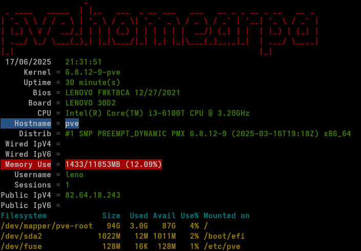

### NFS Client

Configuration du client NFS sur Proxmox

    sudo apt install nfs-common

Point de montage et lien

```shell
sudo mkdir -p /mnt/sharenfs
sudo ln -s /mnt/sharenfs $HOME/sharenfs
```

Ajouter les points de montage du serveur nfs: `sudo nano /etc/fstab`
	
```
192.168.0.205:/sharenfs	/mnt/sharenfs nfs4 nofail,x-systemd.automount,x-systemd.requires=network-online.target,x-systemd.device-timeout=10s,rsize=8192,wsize=8192 0 0
```

Rechargement et montage

```shell
sudo systemctl daemon-reload && sudo mount -a
```

### Désactiver le message "no valid subscription"

Désactiver "no valid subscription" sur Proxmox

1. Se connecter sur le serveur proxmox via SSH
2. Passer en mode su  
3. Saisissez la commande suivante pour désactiver le message d'abonnement et appuyez sur Entrée

```shell
sed -Ezi.bak "s/(Ext.Msg.show\(\{\s+title: gettext\('No valid sub)/void\(\{ \/\/\1/g" /usr/share/javascript/proxmox-widget-toolkit/proxmoxlib.js && systemctl restart pveproxy.service
```

### Clavier et langue

Langue, fichier `/etc/pve/datacenter.cfg`

```shell
keyboard: fr
language: fr
```

### pve.home.arpa

**Ajout autorité certification home.arpa**

```shell
cp /mnt/sharenfs/cwwk/homearpaCA.crt /usr/local/share/ca-certificates/
update-ca-certificates
```

**Nginx web**

Installation

```shell
apt update && apt install nginx
```
**Domaine pve.home.arpa**  
Certificats **pve.home.arpa.crt** **pve.home.arpa.key** dans `/etc/ssl/private/`

Créer un fichier `/etc/nginx/conf.d/pve.home.arpa.conf`

```shell
upstream proxmox {
    server "pve.home.arpa";
}
 
server {
    listen 80 default_server;
    listen [::]:80 default_server;
    rewrite ^(.*) https://$host$1 permanent;
}
 
server {
    listen 443 ssl;
    listen [::]:443 ssl;
    server_name _;
    ssl_certificate      /etc/ssl/private/pve.home.arpa.crt;
    ssl_certificate_key  /etc/ssl/private/pve.home.arpa.key;
    proxy_redirect off;
    location / {
        proxy_http_version 1.1;
        proxy_set_header Upgrade $http_upgrade;
        proxy_set_header Connection "upgrade";
        proxy_pass https://127.0.0.1:8006;
        proxy_buffering off;
        client_max_body_size 0;
        proxy_connect_timeout  3600s;
        proxy_read_timeout  3600s;
        proxy_send_timeout  3600s;
        send_timeout  3600s;
    }
}
```

Vérifier

```shell
nginx -t
```

Redémarrer le serveur

```shell
systemctl restart nginx
```

Accès <https://pve.home.arpa>

### Authentification 2FA

Ajout authentification à 2 facteurs  
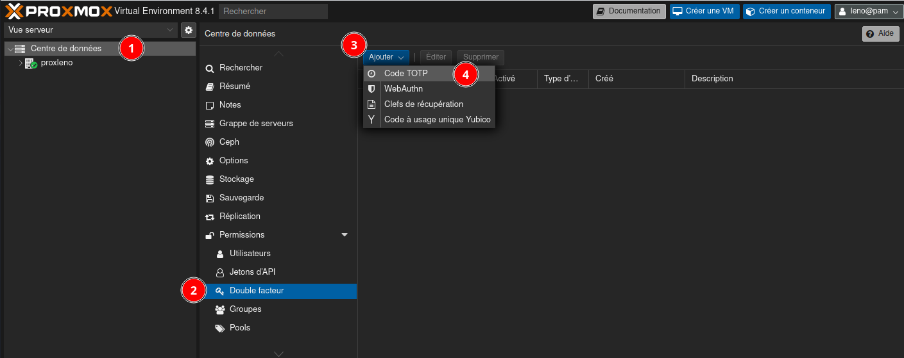 

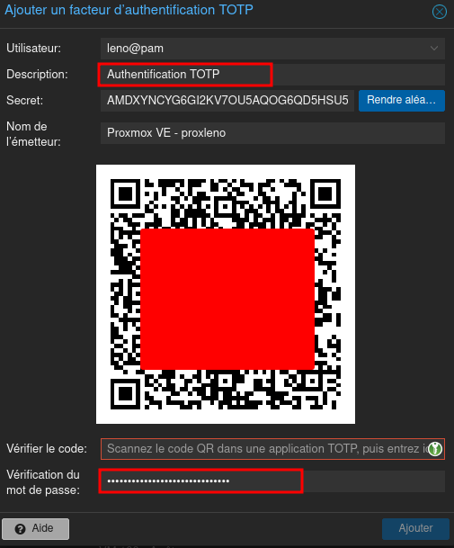{:width="400" .normal}  
Renseigner Description et mot de passe et scanner le code avec application mobile AEGIS   

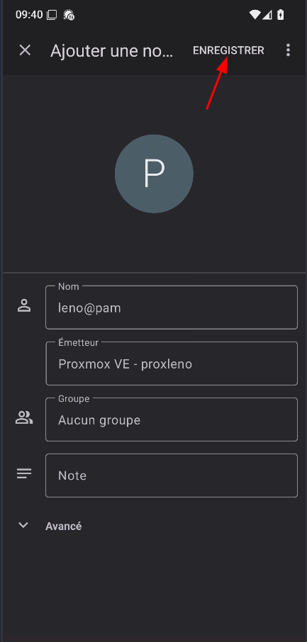{:width="200" .normal}  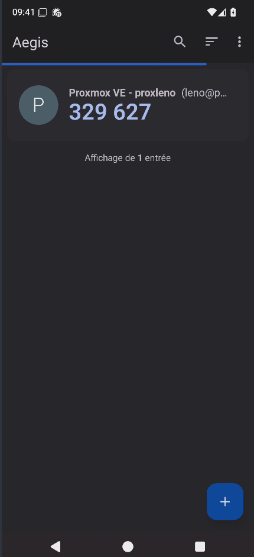{:width="200" .normal}  

{:width="400" .normal}  
Saisir le code **329627** dans **Vérifier le code** puis cliquer sur **Ajouter**

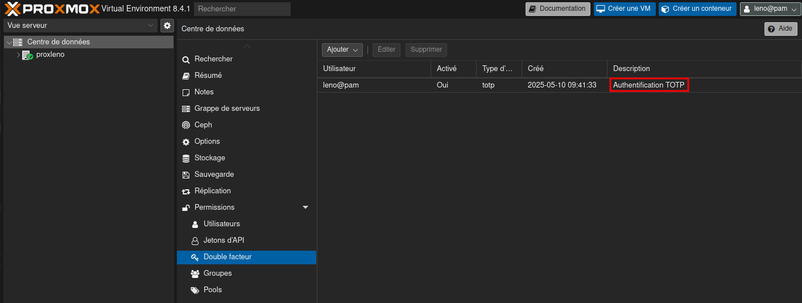  
Authentification TOTP ajouter à l'utilisateur leno

### Connexion Web

Ensuite, vous pouvez accéder à votre serveur Proxmox à partir d'un navigateur et de son adresse IP : 
<https://192.168.0.215:8006> ou <https://pve.home.arpa>

L'accès est possible en ligne de commande directement sur le serveur, mais je vous propose de basculer sur votre poste de travail pour accéder à votre serveur Proxmox et poursuivre ce tutoriel. Authentifiez-vous sur l'interface Web de Proxmox avec le compte "root" et le mot de passe défini lors de l'installation ou le nouvel utilisateur **leno**.  
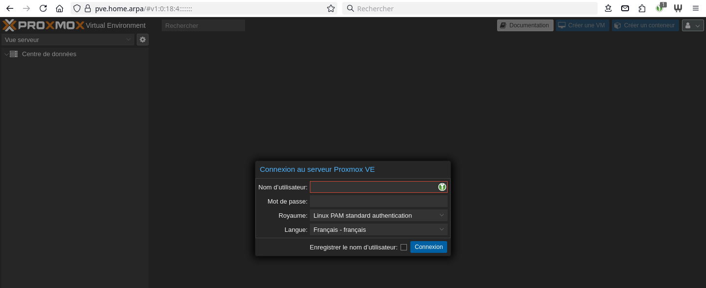{: .normal}  
Précisions concernant l'option "Realm" du formulaire d'authentification :

*    PAM est le module d'authentification enfichable utilisé dans les systèmes d'exploitation Linux/UNIX/BSD pour stocker les informations de l'utilisateur local. Il est stocké au niveau du système et délègue l'autorisation de se connecter à une machine. C'est le module par défaut sous Linux.
*    PVE est une base de données stockée dans Proxmox qui stocke des informations sur les utilisateurs pouvant se connecter à l'interface Web de Proxmox. Elle n'accorde pas d'autorisation pour des choses comme la connexion SSH ou Shell au système d'exploitation sous-jacent, au lieu de cela, il délègue uniquement l'autorisation de se connecter aux interfaces Proxmox, comme la WebGUI ou l'API.

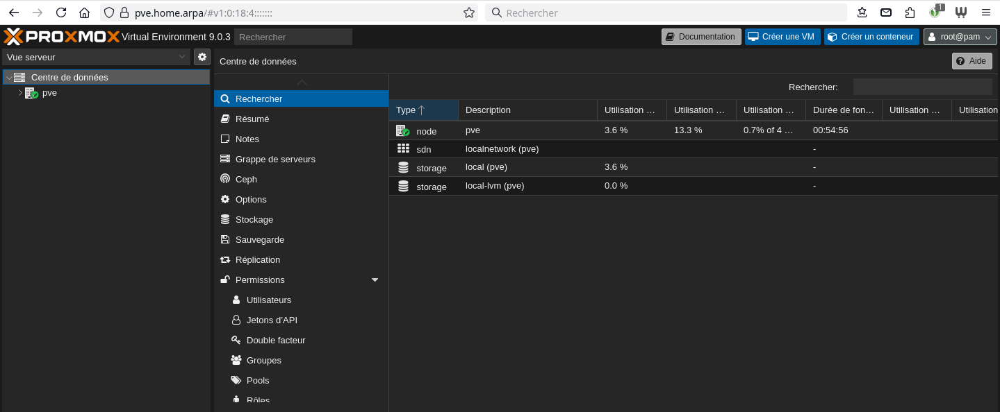  

### Compte admin à Proxmox

Créer le groupe **Administrateur** et modifier l'utilisateur leno  
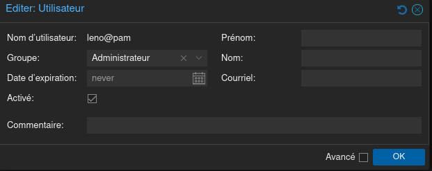{: .normal} 

Puis dans l’onglet Permissions, indiquons qu’il s’agit d’un administrateur par Ajouter / Permissions de l’Utilisateur avec un rôle Administrator et en sélectionnant votre utilisateur précédemment créé

## Proxmox Pare-feu

* [Sécurisation basique de son Proxmox](https://doc.ataxya.net/books/proxmox-ve/page/securisation-basique-de-son-proxmox)

### Pare-feu intégré

Le pare-feu intégré de Proxmox

* Web interface: 8006 (TCP, HTTP/1.1 over TLS)
* VNC Web console: 5900-5999 (TCP, WebSocket)
* SPICE proxy: 3128 (TCP)
* sshd (used for cluster actions): 22 (TCP)
* rpcbind: 111 (UDP)
* sendmail: 25 (TCP, outgoing)
* corosync cluster traffic: 5405-5412 UDP
* live migration (VM memory and local-disk data): 60000-60050 (TCP)

Trois niveaux de pare-feu

1. Pare-feu du "Centre de données" (Datacenter)
2. Pare-feu des nœuds (nodes)
3. Pare-feu des machines virtuelles et conteneurs

### Règles à créer

Créer des règles pour le "Centre de données" (Datacenter) avant d’activer le pare-feu  
Pour ajouter des règles : "Centre de données" (Datacenter) &rarr; Pare-feu &rarr; [Ajouter]   
{: .normal}


Attention ! il y a des règles à créer avant l’activation du pare-feu  

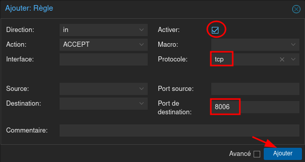{:width="400" .normal}  
Pour autoriser le port 8006 en TCP pour le portail WEB d’administration de Proxmox.  
Ne pas oublier de cocher activer

{:width="400" .normal}  
Pour autoriser le port 55215 (par défaut 22) en TCP pour l’accès en SSH

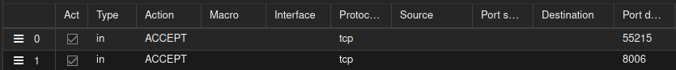{:width="400" .normal}  
Les règles.

### Activation du pare-feu "Centre de données"

Lorsque toutes vos règles sont activées, vous pouvez maintenant activer le pare-feu en vous rendant
dans : "Centre de données" (Datacenter) &rarr; Parefeu   
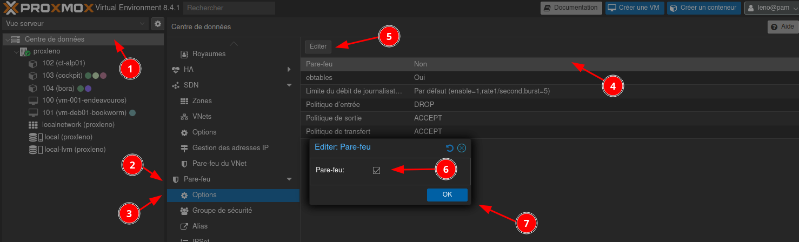{: .normal}  

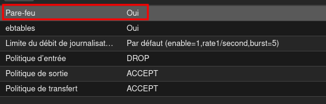{:width="400" .normal}   
Par défaut, tout ce qui entre est rejeté, tout ce qui sort est accepté.

### Création groupe de sécurité

Les groupes de sécurité permettent de regrouper plusieurs règles de pare-feu en une seule règle.  
Ils sont créés uniquement dans la zone "Centre de données" (Datacenter)
Exemple "ServeurWEB" avec les ports (55215, 80, 443, etc.).  
"Centre de données" (Datacenter) &rarr; Parefeu &rarr; Groupe de sécurité  
Cliquez sur Créer, donnez un nom.  
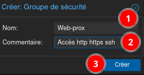{:width="250" .normal}   
Vous pouvez sélectionner ce groupe et cliquez sur [Ajouter] dans la partie droite pour commencer à
ajouter toutes les règles de pare-feu.  
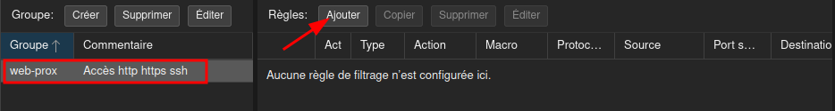{:width="500" .normal}   
Ls règles (in, ACCEPT, tcp, Port destination) pour le port 80 http, port 443 HTTPS et SSH (port 55215) 

Le résultat.  
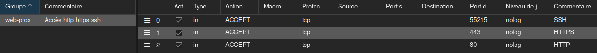{: .normal}   

### Activation groupe de sécurité pour une machine

Pour les règles. Rendez-vous dans la partie Parefeu de votre machine virtuelle et cliquez sur [Insérer: Groupe de
sécurité].  
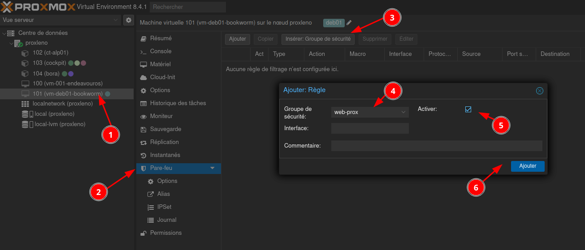{: .normal}   
Choisissez le groupe de sécurité qui vous convient et cochez Activer.  

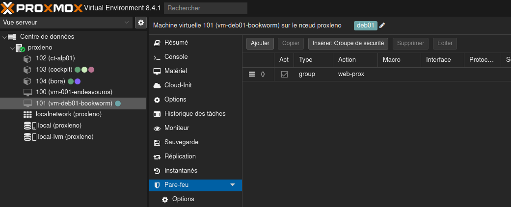{: .normal}   

### Activer le pare-feu d’une machine
Sélectionnez la machine &rarr; Parefeu &rarr; Options &rarr; Sélectionnez Parefeu &rarr; [Éditer]  
Cochez Parefeu &rarr; [OK]  
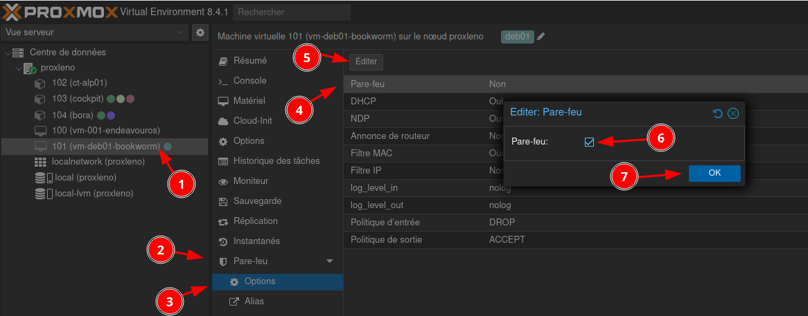{: .normal}   

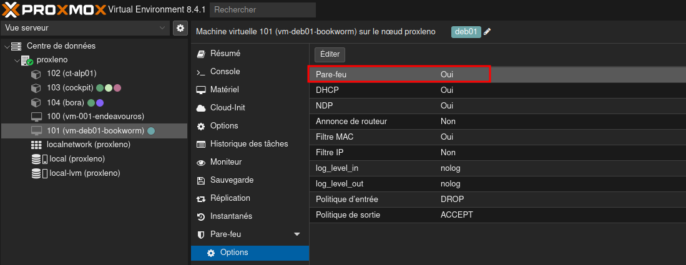{: .normal}   

### Alias "Centre de données" (Datacenter)

Alias va permettre de nommer les IP ou les plages d’IP à utiliser dans le pare-feu.
"Centre de données" (Datacenter) &rarr; Pare-feu &rarr; Alias &rarr; [Ajouter]  
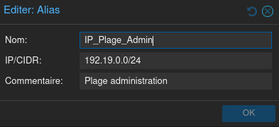{:width="250" .normal}  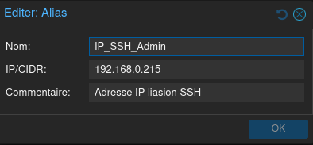{:width="250" .normal}  
On peut ajouter une plage d’adresse IP avec le CIDR (par exemple 192.168.1.0/24).

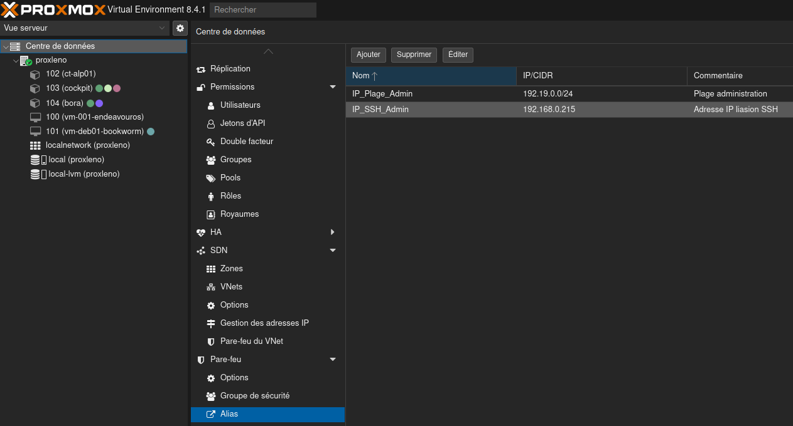{: .normal}   

### IPSet

Règles de pare-feu qui correspondent aux adresse IP ou aux sous-réseaux IP.  
Exemple : IPSet nommé "Admin".  
Peuvent être crées dans les niveaux de pare-feu (Datacenter, VM et conteneurs).  
Permet de créer des listes blanches et des listes noires d’adresses IP.  
"Centre de données" (Datacenter) &rarr; Parefeu &rarr; IPSet &rarr; [Créer]  
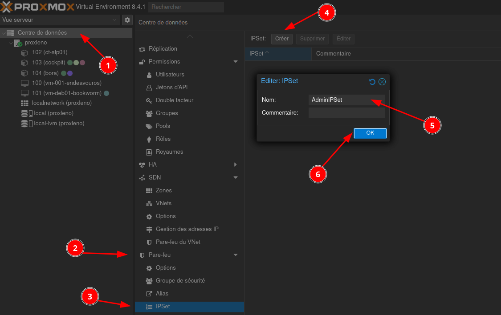{: .normal}  
Nommez l’IPSet &rarr; [OK]

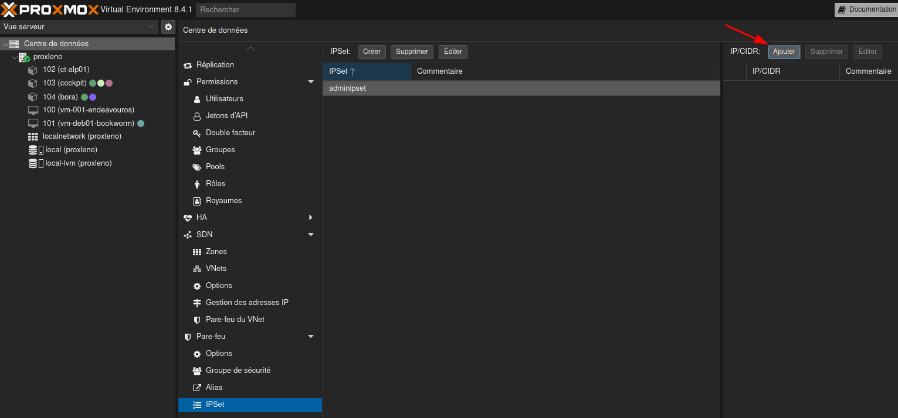{: .normal}  
Cliquez sur l’IPSet &rarr; [Ajouter] à droite.

Au final  
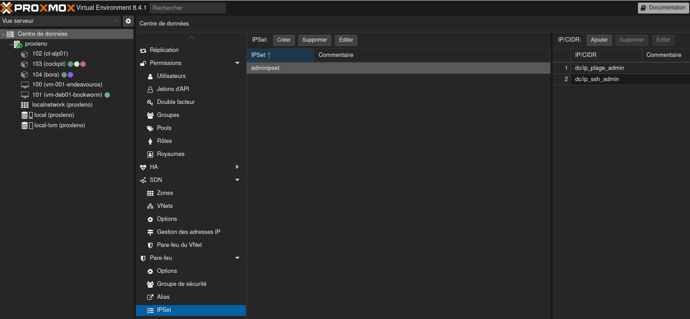{: .normal}  

### Règles pour une machine virtuelle ou un conteneur

Exemple pour autoriser le ping (protocole ICMP).  
On sélectionne la machine &rarr; Parefeu &rarr; [Ajouter]  
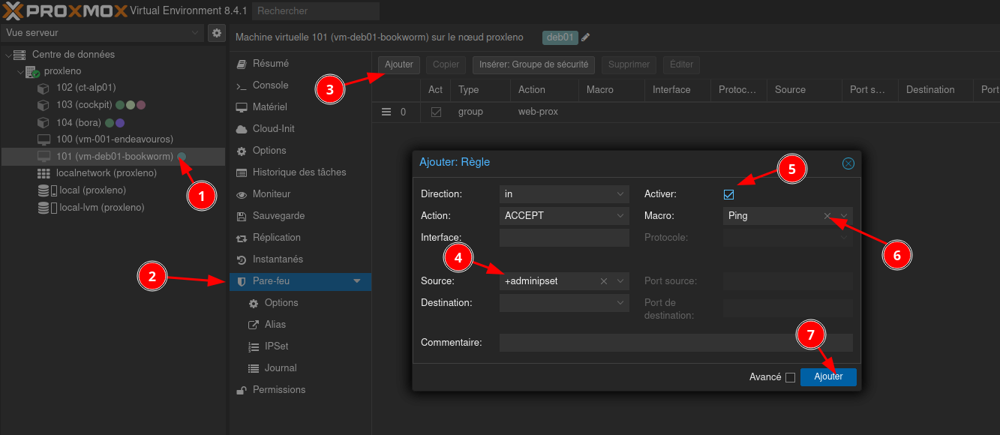{: .normal}  
Saisir les paramètres, macro Ping, ne pas oublier de cocher Activer.  
Comme source, **adminpset** 

Au final  
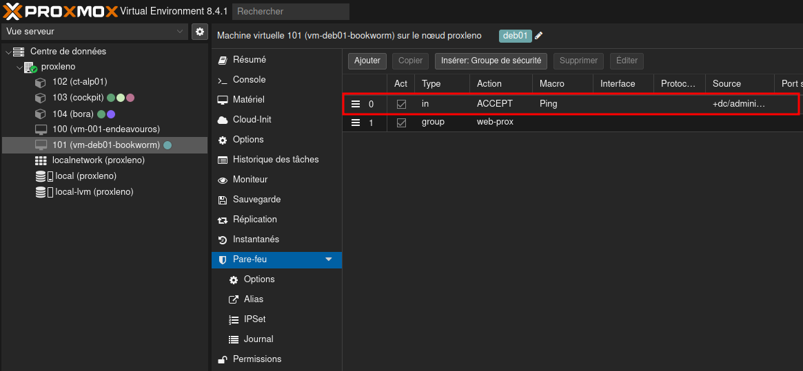{: .normal}  


## Gérer la machine Lenovo Proxmox

### cwwk - Domaine pve.home.arpa

*Proxmox pve.home.arpa*

Générer les certicicats du domaine local `pve.home.arpa`

```shell
# Machine cwwk
cd $HOME
./gencert.sh pve.home.arpa
# Copie et déplacement
sudo cp pve.home.arpa.crt /etc/ssl/private/
sudo cp pve.home.arpa.key /etc/ssl/private/
mv pve.home.arpa.crt $HOME/sharenfs/rnmkcy/cwwk/home/yick/CA/
mv pve.home.arpa.key $HOME/sharenfs/rnmkcy/cwwk/home/yick/CA/
```

Fichier de configuration proxy nginx `/etc/nginx/conf.d/pve.home.arpa.conf`

```
upstream pvex {
    server 192.168.0.215:8006;
}

server {
    # ipv4 listening port/protocol
    listen       443 ssl http2;
    # ipv6 listening port/protocol
    listen           [::]:443 ssl http2;
    server_name  pve.home.arpa;

    ssl_certificate      /etc/ssl/private/pve.home.arpa.crt;
    ssl_certificate_key  /etc/ssl/private/pve.home.arpa.key;

   location / {
    proxy_pass https://pvex;
    proxy_set_header Host $host;
    proxy_set_header X-Real-IP $remote_addr;
    proxy_set_header X-Forwarded-For $proxy_add_x_forwarded_for;
    proxy_set_header X-Forwarded-Proto $scheme;
    proxy_http_version 1.1;
    proxy_set_header Upgrade $http_upgrade;
    proxy_set_header Connection "Upgrade";
    proxy_buffering off;
   }

}
```

Vérification et rechargement nginx 

```shell
sudo nginx -t
sudo systemctl reload nginx
```

## Gestion distante démarrage et arrêt

*On veut démarrer ou éteindre, depuis le poste linux PC1, la machine distante Lenovo Proxmox (pve.rnmkcy.eu) via ssh et “wake on lan”*

[Démarrer ou éteindre une machine distante sur le réseau via ssh et "wake on lan"](/posts/demarrer_eteindre_une_machine_via_ssh_et_wake_on_lan/)

**Poste linux PC1 (archlinux/EndeavourOS)**  
Installer wake on lan

```shell
sudo apt install wakeonlan # Debian/Ubuntu 
yay -S wakeonlan # archlinux
```

Rechercher adresse Mac de la machine Lenovo Proxmox

```shell
ping -c3 pve.home.arpa && arp -n
```

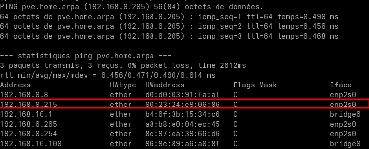

Lenovo Proxmox : `192.168.0.215            ether   00:23:24:c9:06:86`

* [PC1 - Script au démarrage](/posts/demarrer_eteindre_une_machine_via_ssh_et_wake_on_lan/#pc1---script-au-démarrage)
* [PC1 - Script à l’arrêt](/posts/demarrer_eteindre_une_machine_via_ssh_et_wake_on_lan/#pc1---script-à-larrêt)

### Client SPICE

*Le protocole SPICE est utilisé pour accéder graphiquement à la console de vos machines virtuelles sur Proxmox.*

Il est plus agréable d'utilisation que le serveur VNC utilisé par défaut à travers le navigateur puisqu'il permet une meilleure intégration ainsi que le support du copier-coller (ce qui est extrêmement avantageux).  
[[Proxmox] Spice](https://wiki.neopipe.fr/books/proxmox/page/proxmox-spice)

Ensuite il vous faut un logiciel client SPICE sur votre machine pour pouvoir accéder à la console via le protocole.

Pour cela, je vous recommande d'installer le paquet virt-viewer :

    apt install -y virt-viewer

Désormais, une fois sur Proxmox lorsque vous cliquerez sur le bouton Console, un fichier sera téléchargé sur votre machine.

Il vous suffira de l'ouvrir avec virt-viewer et le tour est joué ! 


### Importer un fichier ISO dans Proxmox

Afin de pouvoir installer les systèmes d’exploitation sur nos différentes machines virtuelles, nous devons au préalable télécharger les images système (ISO) et les importer dans Proxmox.

> Les fichiers ISO sont stockés dans le dossier `/var/lib/vz/template/iso/`
{: .prompt-tip }

Pour cela, Proxmox dispose d’un élément assez sympa je trouve, une sorte de banque où seront stockés toutes vos images. Procédez comme ceci :

Sélectionnez votre nœud puis le stockage (**local**, dans notre cas).  

Cliquez sur "ISO Images", puis sur le bouton "Upload" et recherchez l’image à importer sur votre disque local.  
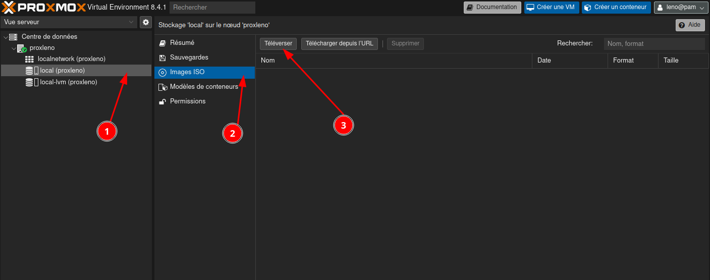{: .normal}  
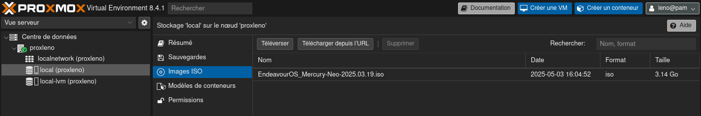{: .normal}  
Répéter l’opération autant de fois que nécessaire selon la quantité d’images ISO à importer, la seule limite c’est votre espace de stockage.  
Les fichiers ISO sont stockés dans le dossier `/var/lib/vz/template/iso/`

### Comment utiliser le disque EFI dans Proxmox

[How to Use EFI Disk in Proxmox?](https://www.vinchin.com/tech-tips/proxmox-efi-disk.html)

Ajouter EFI Disque via la ligne de commande

```shell
qm ensemble 100 --bios ovmf
qm set 100 --efidisk0 local-lvm:1,format=raw
# Remplacer 100 par votre ID VM, et local-lvm par votre nom de stockage
```

### Affecter un USB hôte à l'invité

[Comment activer l’USB Passthrough pour Home Assistant sous Proxmox ?](https://www.domo-blog.fr/comment-activer-usb-passthrough-proxmox-home-assistant-domotique/)

Voie simple: passez l'identifiant du périphérique USB à l'invité

Attribuer une clé Yubikey connectée à l'hôte à VM 103

    lsusb

```
Bus 001 Device 004: ID 1050:0407 Yubico.com Yubikey 4/5 OTP+U2F+CCID
```

Assignez-le à la VM en mode su par

```
qm set 103 -usb0 host=1050:0407
```

Réponse: `update VM 103: -usb0 host=1050:0407`

Eteindre la VM (en cours d'exécution) et relancer

### Sauvegarder et restaurer des machines virtuelles

[Comment sauvegarder et restaurer des machines virtuelles dans Proxmox](https://fr.linux-console.net/?p=29358)


## Machines virtuelles et conteneurs

### Création machine virtuelle

Pour créer une nouvelle machine virtuelle, il faut cliquer sur le bouton "Créer une VM" en haut à droite de l’interface.  
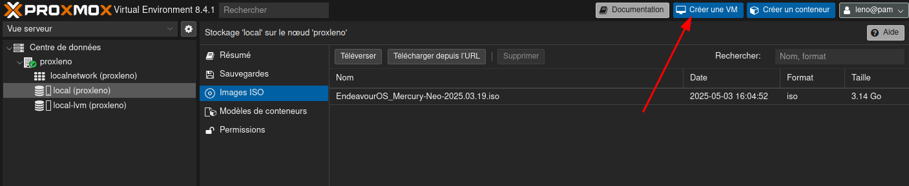{: .normal}  
il faut nommer la machine 

Pour un ordonnancement correct, il sera utile de définir une nomenclature de nommage, je vous propose, ceci :

*    VM-[ID de la VM] – OS-Nom de la machine
*    CT-[ID du conteneur] – OS-Nom de la machine

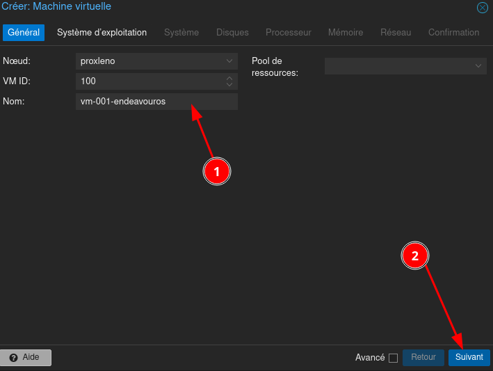{:width="500" .normal}  

Le "Resource Pool" ne sera utilisé que si vous avez plusieurs emplacements de stockage sur le Proxmox (pour de l’ordonnancement / backup, etc.).

Sélectionnez à présent l’ISO que vous souhaitez installer sur la machine et le type de système correspondant. Particularité pour une VM freeBSD, on sélectionnera « Other ».  
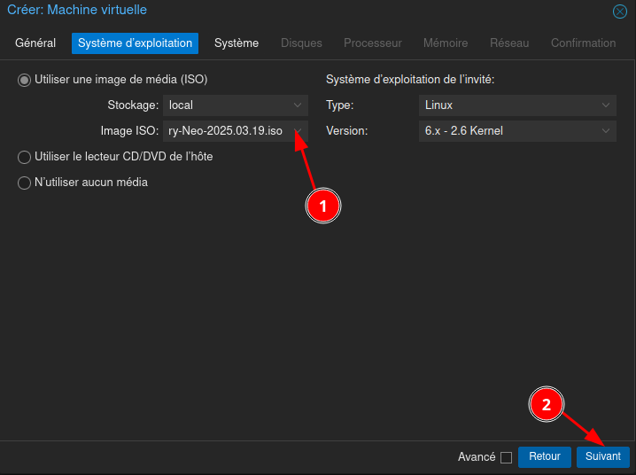{:width="500" .normal}  
Sachez qu'il est aussi possible d’utiliser directement le lecteur de CD/DVD physique, voir une clé USB directement branchée au serveur.   

**Pour les conteneurs**,les templates préconfigurés sont téléchargeables directement via l’interface et il est demandé si vous souhaitez définir un mot de passe dès la création.

Sur l’écran suivant, on peut configurer certains aspects du système, en cochant « Advanced ». Ainsi, il sera possible de modifier le type de Firmware (BIOS ou UEFI), le type de disque (IDE, SCSI, SATA) et l’émulation SSD, le démarrage automatique, le type de CPU, etc.
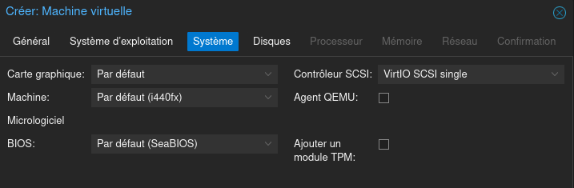{:width="500" .normal}  

L’étape suivante consiste à configurer le stockage de la machine virtuelle, avec le choix du disque dur, son type et sa taille.  
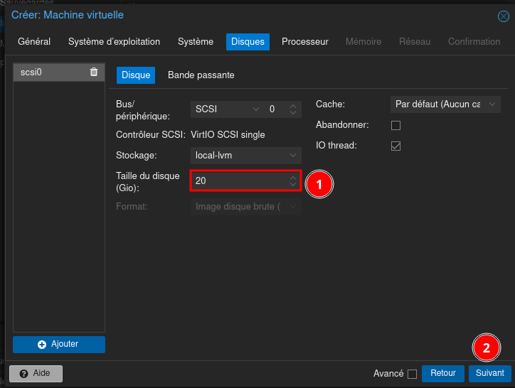{:width="500" .normal}    

À présent, il s’agit de définir les spécifications du CPU, avec éventuellement la possibilité de modifier les vCPU (processeurs virtuels).  
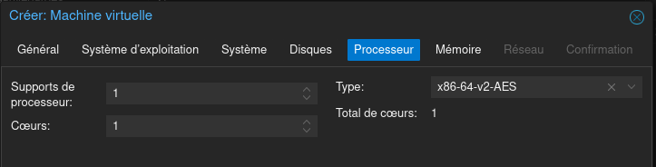{:width="500" .normal}  

Ensuite, nous définissons la quantité de mémoire RAM allouée à cette VM, il est alors possible d’allouer une quantité maximale et minimale (en **mode avancé**), permettant de limiter la monopolisation des ressources en fonction de l’utilisation de la machine.  
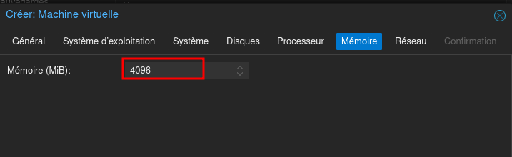{:width="500" .normal}  

La partie Network est assez simple en soi sur une VM, on sélectionne l’interface (Bridge) sur laquelle on souhaite avoir la VM et éventuellement le tag du VLAN (VLAN Tag).  
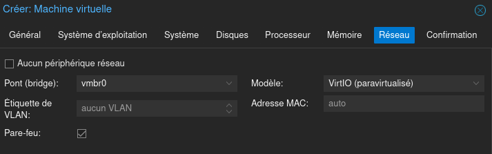{:width="500" .normal}  

Nous sommes à la dernière étape où nous avons le droit à un résumé. Si cela vous convient, cliquez sur **"Terminé"** pour créer la machine virtuelle. Cela n'installe pas le système d'exploitation dans la VM, mais la machine sera prête à l'installation.  
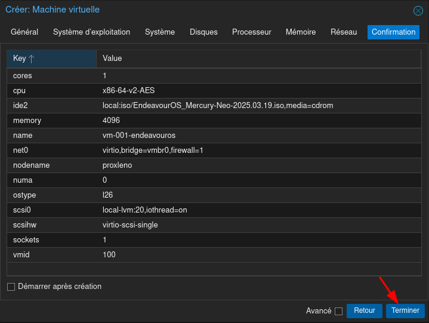{:width="500" .normal}  
Notre VM est alors créé et nous pouvons à présent la retrouver dans notre node (partie de gauche de l'interface).  
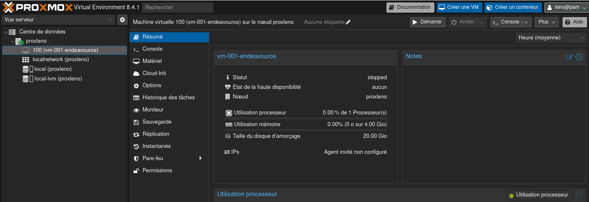  

### Ajout EFI

[How to add an EFI disk in Proxmox?](https://www.vinchin.com/tech-tips/proxmox-efi-disk.html)

[OVMF/UEFI Boot Entries](https://pve.proxmox.com/wiki/OVMF/UEFI_Boot_Entries)

https://www.bgocloud.com/knowledgebase/95/making-your-first-virtual-machine-and-container-in-proxmox-ve.html

### Démarrage VM

Pour pouvoir lancer la VM nouvellement créée, il suffit de faire un clic droit sur l’icône de la machine dans le menu de gauche et de sélectionner "Démarrer"  
L’autre option est de la sélectionner la VM, comme nous venons de le faire, puis de sélectionner **"Démarrer"** en haut à droite de l’écran. D’ailleurs, ce menu comporte un bouton **"Plus"** qui permet de détruire une machine et son stockage associé, c'est-à-dire le disque virtuel. Ce menu permet aussi de créer un Template (c'est-à-dire un modèle de VM), que l'on pourra cloner à souhait (plutôt pratique).  
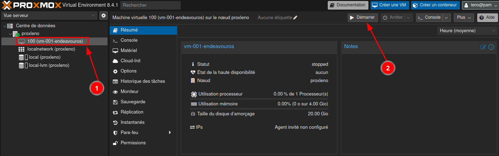{: .normal}  

Une fois la machine démarrée, nous avons accès aux métriques en sélectionnant **"Résumé"** (charge CPU, RAM, espace de stockage, etc.).  
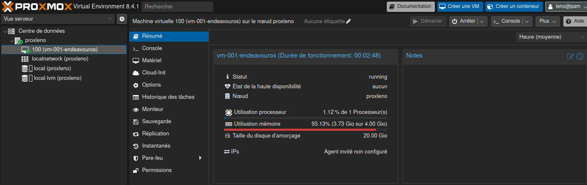{: .normal}  

De la même façon, il est possible de suivre l’état de votre hyperviseur en sélectionnant : **"Centre de données"** puis **"Résumé"**.  
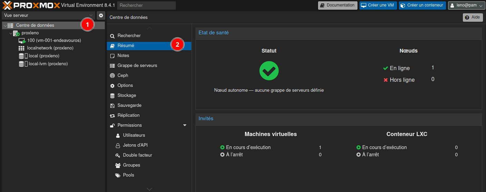{: .normal}  

Pour accéder à la machine virtuelle ou au conteneur, il suffit de double-cliquer sur son icône dans le menu de gauche. Cette manipulation ouvre une fenêtre qui donne un accès à l’interface graphique de la machine virtuelle.  
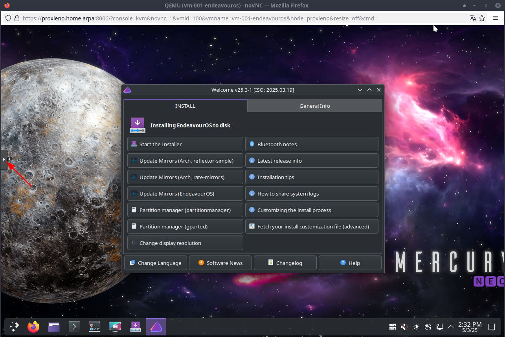   
Sur la capture d'écran ci-dessus, on peut voir une flèche sur le côté gauche, celle-ci permet d’avoir accès à des options supplémentaires de la VM, telles que :

*    Mettre en plein écran
*    Activer une combinaison de touche (CTRL+ALT+SUPPR)
*    Démarrage, arrêt, rafraichir l’interface
*    Etc...

Note : sous Linux, si vous utiliser CTRL+W pour une recherche avec l'éditeur "nano", la fenêtre va se fermer sans pour autant éteindre la VM, il faut alors sélectionner [A], puis [CTRL], puis après votre touche [W] afin de permettre la recherche. Une fois le mot trouvé, désactivez la fonctionnalité.
{: .prompt-info }

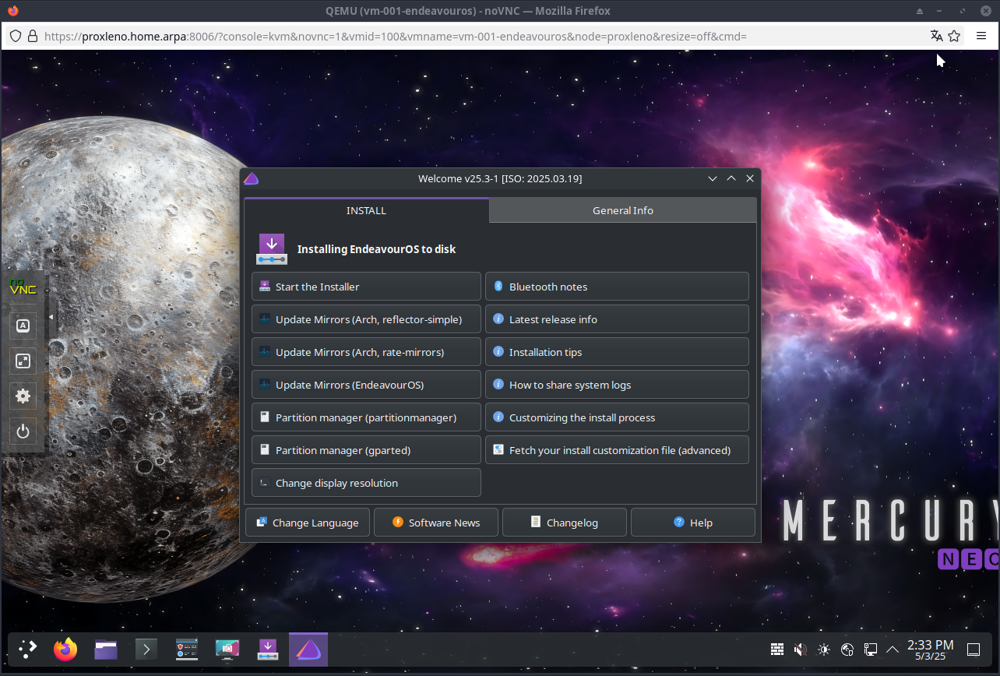   

Il ne reste plus qu'à procéder à l'installation du système d'exploitation, que ce soit du Linux ou du Windows !

### Erreurs

*VM quit/powerdown failed - got timeout*

**Erreur de délai d'attente**  

L'erreur de délai d'attente se produit lorsque la machine virtuelle est verrouillée ou que le processus est toujours en cours d'exécution en arrière-plan.

Si la machine virtuelle est verrouillée, nous déverrouillons la VM et l'arrêtons. 
Sinon, nous nous connectons au nœud hôte.  
Ensuite, nous trouvons le PID du processus de la machine en utilisant la commande.

    ps aux | grep "/usr/bin/kvm -id VMID"
    ps aux | grep "/usr/bin/kvm -id 100" # VMID=100 dans notre exemple

```
root       15847  0.5  0.6 3779756 49520 ?       Sl   09:58   0:10 /usr/bin/kvm -id 100 -name vm-001-debian11-yunotest -no-shutdown -chardev socket,id=qmp.......................
```

Une fois que nous avons trouvé le PID, nous tuons le processus en utilisant la commande.

    kill -9 15847  # PID=15847 dans notre exemple

**Arrêt en mode CLI**  
Nous avons rencontré de nombreuses instances qui arrêtent la machine virtuelle à partir de l'interface web pour effectuer les tâches.

Ainsi, nous arrêtons la machine virtuelle à partir du nœud. Pour arrêter la VM, il faut d'abord trouver le VMID.

Nous utilisons donc la commande suivante pour arrêter la machine virtuelle

    qm stop <VMID>

Ensuite, en rafraîchissant l'interface web, nous pouvons voir que la machine virtuelle est arrêtée.

**VM verrouillée**  
L'une des raisons les plus courantes pour lesquelles il est impossible d'arrêter une machine virtuelle est que celle-ci a été verrouillée. Cela se produit généralement lorsque nous essayons d'arrêter une machine virtuelle alors qu'une sauvegarde est en cours.

La machine virtuelle se verrouille alors pour terminer le processus de sauvegarde. Ainsi, nous pouvons attendre que le processus de sauvegarde supprime la VM. Sinon, nous pouvons déverrouiller la machine virtuelle et l'arrêter.

Pour déverrouiller la VM, nous nous connectons au nœud hôte.

Puis nous trouvons le VMID de la machine virtuelle en utilisant la commande

    cat /etc/pve/.vmlist

Une fois que nous avons obtenu le VMID, nous déverrouillons la VM à l'aide de la commande

    qm unlock <VMID>

Après avoir déverrouillé la machine virtuelle, nous pouvons supprimer la machine virtuelle à partir de l'interface web ou en utilisant le CLI.

## Création Conteneur

### Images des conteneurs

Les images de conteneurs, parfois également appelées -templates ou -Appliances, sont des archives tar qui contiennent tout pour exécuter un conteneur.

Proxmox VE lui-même fournit une variété de modèles de base pour [les distributions Linux les plus courantes](https://pve.proxmox.com/wiki/Linux_Container#pct_supported_distributions). Ils peuvent être téléchargés en utilisant l'utilitaire de ligne de commande GUI ou pveam (short for Proxmox VE Appliance Manager). En outre, les modèles de conteneur [TurnKey Linux](https://www.turnkeylinux.org/) sont également disponibles à télécharger.

La liste des modèles disponibles est mise à jour quotidiennement par l'intermédiaire de `pve-daily-update`.  
Vous pouvez également déclencher une mise à jour manuellement en exécutant en mode su :

```shell
pveam update
```

Pour voir la liste des images disponibles tourner:

```shell
pveam available
```

Vous pouvez restreindre cette grande liste en spécifiant la section qui vous intéresse, par exemple les images système de base  

```shell
pveam available --section system
```

Liste des images système disponibles

```
system          almalinux-9-default_20240911_amd64.tar.xz
system          alpine-3.19-default_20240207_amd64.tar.xz
system          alpine-3.20-default_20240908_amd64.tar.xz
system          alpine-3.21-default_20241217_amd64.tar.xz
system          archlinux-base_20240911-1_amd64.tar.zst
system          centos-9-stream-default_20240828_amd64.tar.xz
system          debian-11-standard_11.7-1_amd64.tar.zst
system          debian-12-standard_12.7-1_amd64.tar.zst
system          devuan-5.0-standard_5.0_amd64.tar.gz
system          fedora-41-default_20241118_amd64.tar.xz
system          fedora-42-default_20250428_amd64.tar.xz
system          gentoo-current-openrc_20250508_amd64.tar.xz
system          openeuler-24.03-default_20250507_amd64.tar.xz
system          openeuler-25.03-default_20250507_amd64.tar.xz
system          opensuse-15.6-default_20240910_amd64.tar.xz
system          rockylinux-9-default_20240912_amd64.tar.xz
system          ubuntu-20.04-standard_20.04-1_amd64.tar.gz
system          ubuntu-22.04-standard_22.04-1_amd64.tar.zst
system          ubuntu-24.04-standard_24.04-2_amd64.tar.zst
system          ubuntu-24.10-standard_24.10-1_amd64.tar.zst
system          ubuntu-25.04-standard_25.04-1.1_amd64.tar.zst
```

Au niveau graphique  
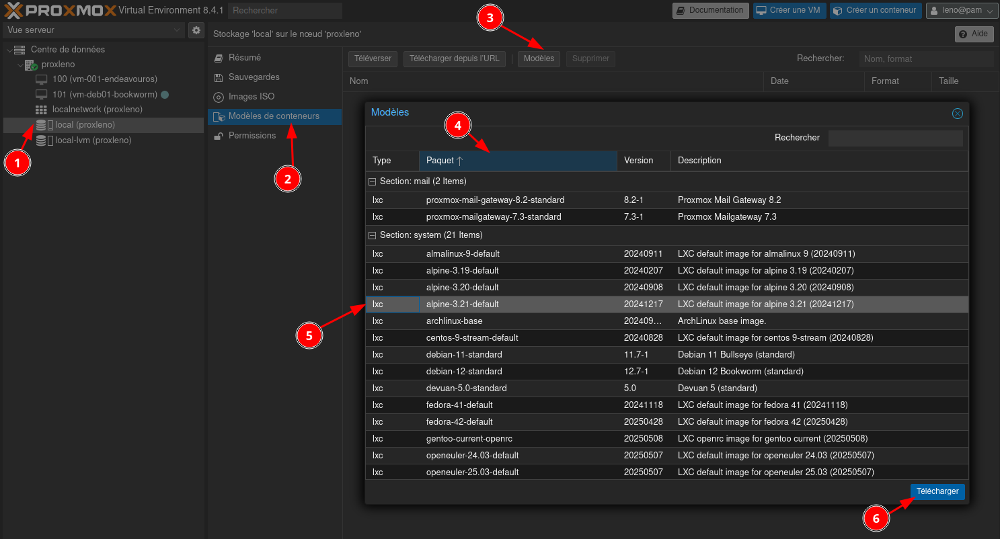{: .normal}  

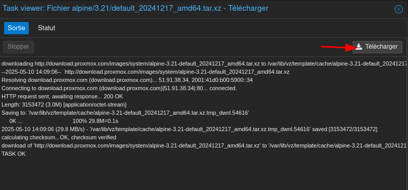{:width="400" .normal}  

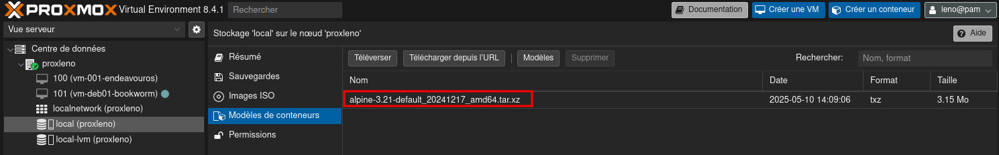{: .normal}  

### Alpine Linux

{:width="250"}  

*Alpine Linux est une distribution Linux légère et sécurisée, conçue pour être utilisée dans des environnements exigeants en termes de performance et de sécurité. Elle est basée sur le noyau Linux et utilise le gestionnaire de paquets “apk” pour gérer les applications et les bibliothèques.*

Alpine Linux est particulièrement adaptée aux environnements de virtualisation, de conteneurisation et de cloud, grâce à sa taille réduite et à sa consommation faible en ressources. Elle est également utilisée dans de nombreux autres contextes, tels que les serveurs Web, les routeurs et les appareils embarqués.


*    Taille réduite : Alpine Linux est une distribution très légère, avec une image ISO de seulement 5 Mo, ce qui la rend idéale pour les environnements où l’espace disque est limité.
*    Consommation faible en ressources : Alpine Linux utilise peu de mémoire et de CPU, ce qui en fait une excellente option pour les environnements de virtualisation et de conteneurisation où les ressources sont partagées.
*    Temps de démarrage rapide : grâce à sa taille réduite et à sa consommation faible en ressources, Alpine Linux démarre rapidement et est prêt à être utilisé en quelques secondes.
*    Faible empreinte en termes de sécurité : Alpine Linux est conçue pour être sécurisée dès le départ, avec une base de code réduite et des paquets verrouillés par défaut. Cela réduit le risque de vulnérabilités et de menaces de sécurité.


Créer un jeu de clès SSH sur le poste PC1

```shell
ssh-keygen -t ed25519 -o -a 100 -f ~/.ssh/ct-alp01
```

La clé publique est disponible sous le dossier `~/.ssh/ct-alp01.pub` 

Les réglages généraux d'un conteneur incluent

* le nœud : le serveur physique sur lequel le conteneur va fonctionner
* ID CT: un numéro unique dans cette installation Proxmox VE utilisée pour identifier votre conteneur
* Nom d'hôte : le nom d'hôte du conteneur
* Resource Pool: un groupe logique de conteneurs et de VMs
* Mot de passe : le mot de passe "root" du conteneur
* SSH Public Key: une clé publique pour se connecter au compte racine sur SSH

Conteneur non privilégié : cette option permet de choisir au moment de la création si vous voulez créer un conteneur privilégié ou non privilégié.

Se connecter à l’interface de gestion de Proxmox VE  
Créer un conteneur  
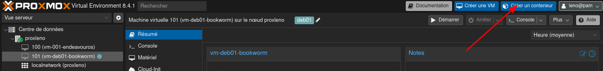{: .normal}  

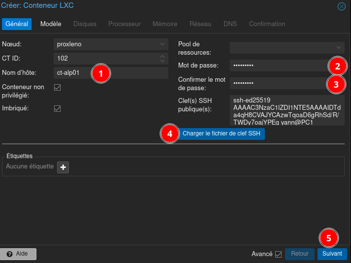{:width="400" .normal}  
renseigner **Nom d'hôte**, **Mot de passe** root (root49600), **Charger le fichier de clef SSH** (ct-alp01.pub)

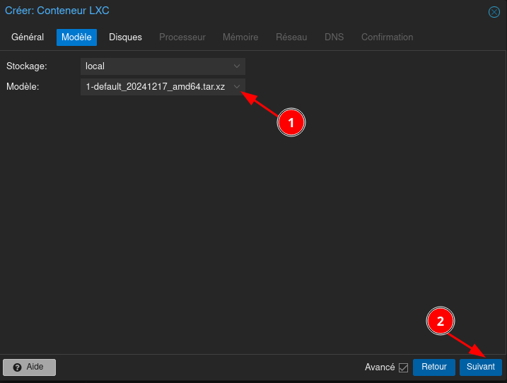{:width="400" .normal}  

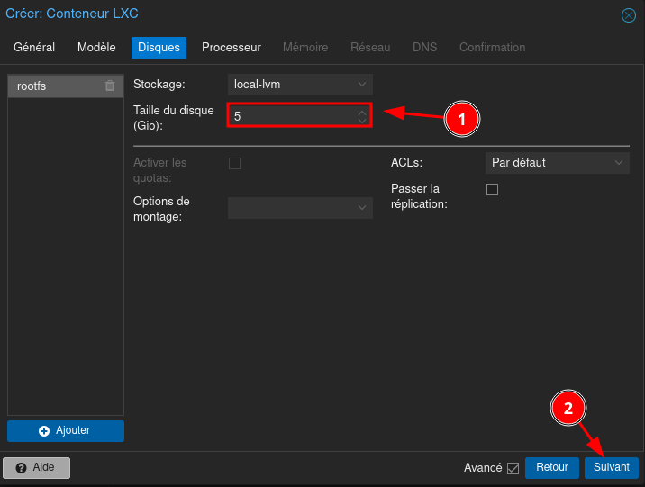{:width="400" .normal}  

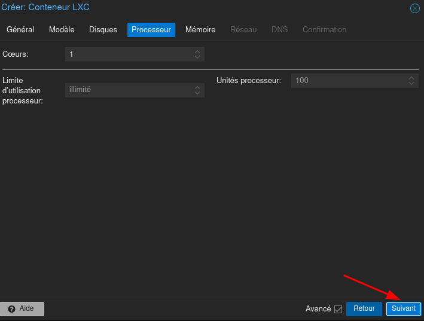{:width="400" .normal}  

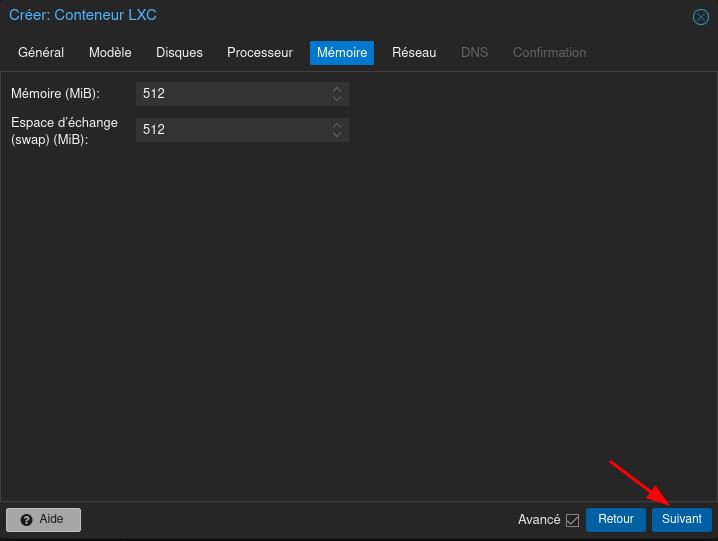{:width="400" .normal}  

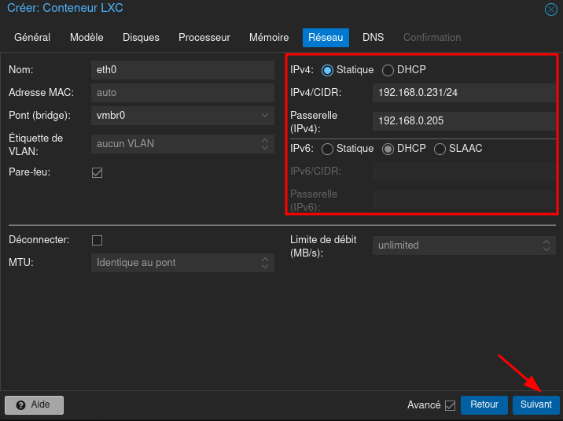{:width="400" .normal}  

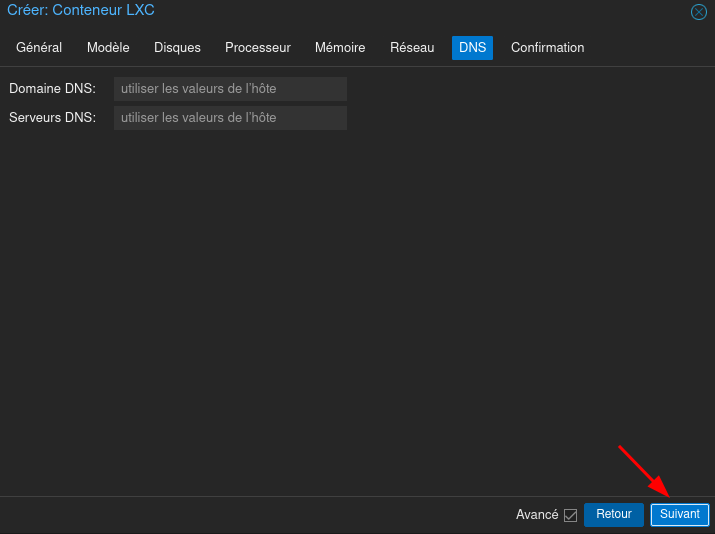{:width="400" .normal}  

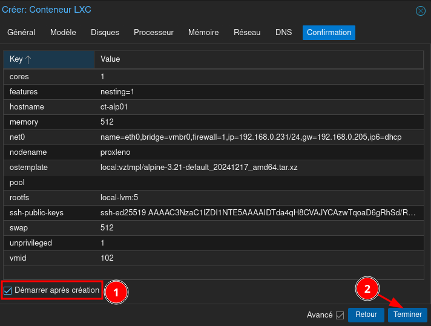{:width="400" .normal}  

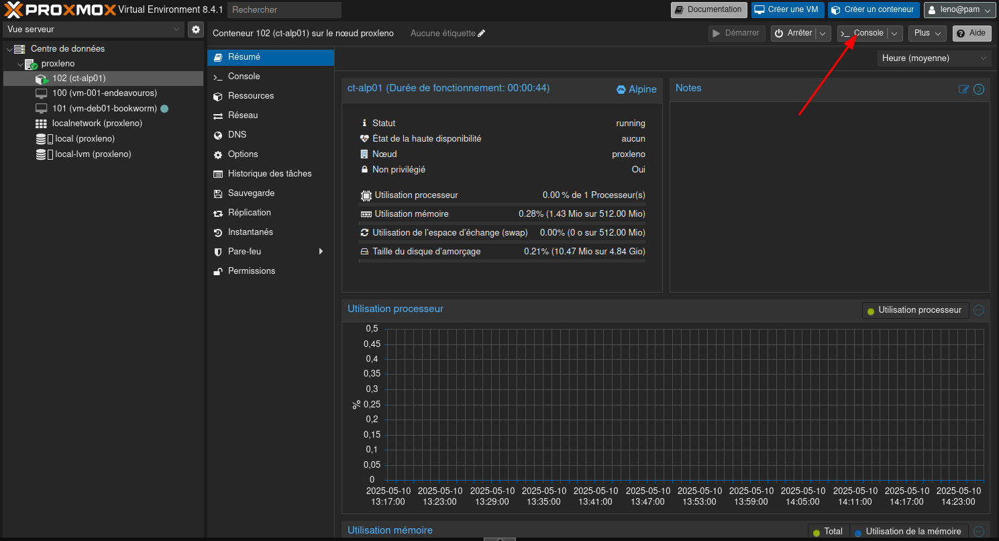{: .normal} 

Vérification en mode console  
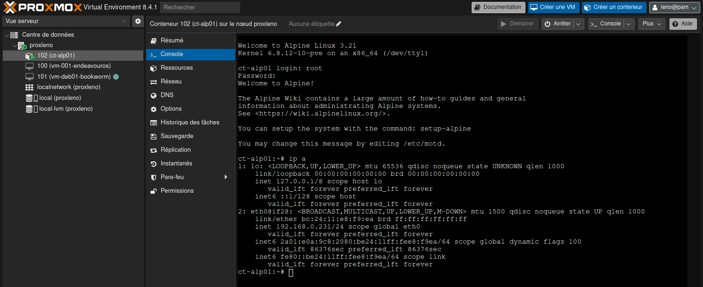{: .normal} 

En mode console

Mise à jour

```shell
apk -U upgrade
```

Créer un utilisateur

```shell
setup-user
```

Installer openssh

```shell
apk add openssh
```

Activer le service et lancer

```shell
rc-update add sshd
service sshd start
```

Connexion SSH

```shell
ssh -i ~/.ssh/ct-alp01 root@192.168.0.231
```

### Cockpit

*Cockpit est une interface graphique Web pour la gestion des serveurs Linux. Il permet aux utilisateurs d'effectuer des tâches telles que configurer les réseaux, gérer le stockage et surveiller les performances du système directement via un navigateur Web. Il s'intègre aux outils système existants, le rendant adapté à la fois aux débutants et aux administrateurs expérimentés.*

<https://community-scripts.github.io/ProxmoxVE/scripts?id=cockpit>  
Pour créer un nouveau Proxmox VE Cockpit LXC, lancez la commande ci-dessous dans Proxmox VE Shell.

```shell
bash -c "$(curl -fsSL https://raw.githubusercontent.com/community-scripts/ProxmoxVE/main/ct/cockpit.sh)"
```

Fin installation

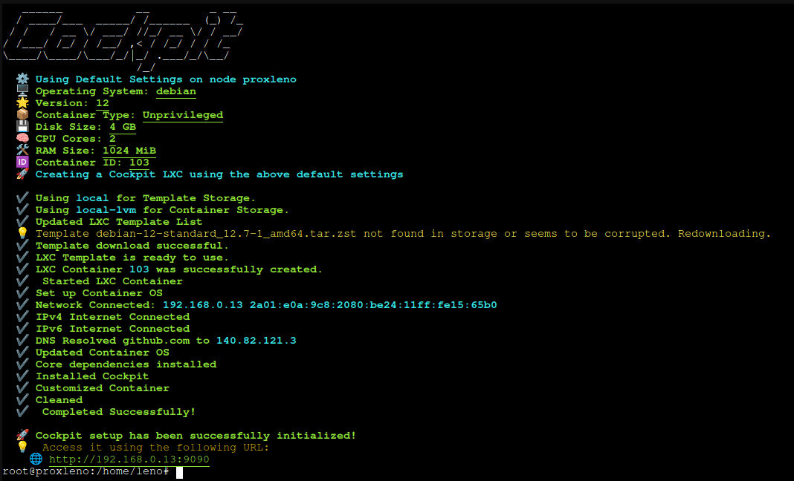  

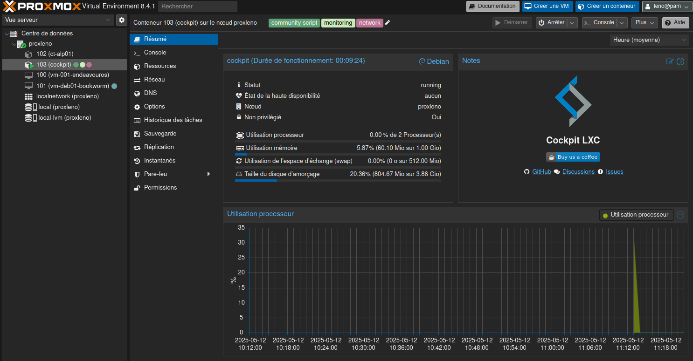  


Location fichier de configuration : `/etc/cockpit/cockpit.conf`

