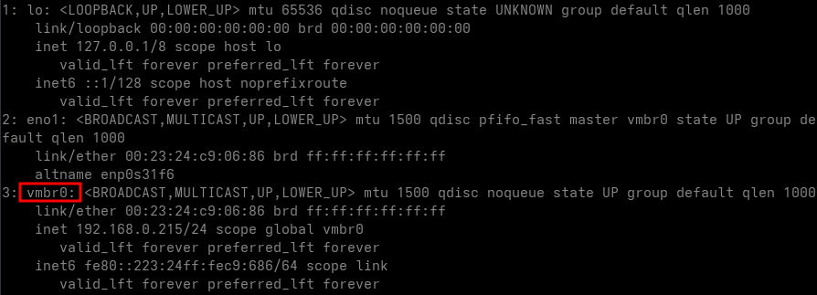
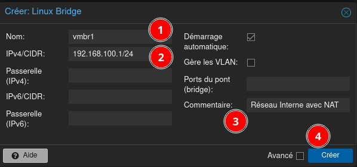
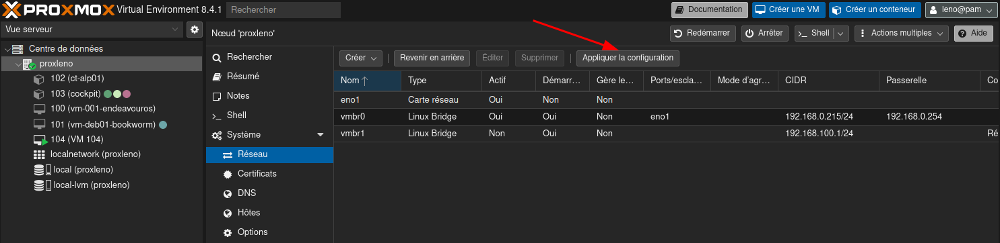
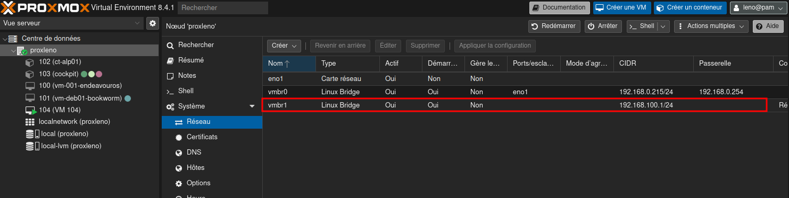
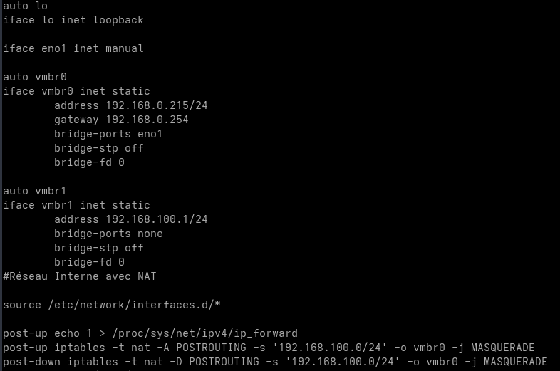
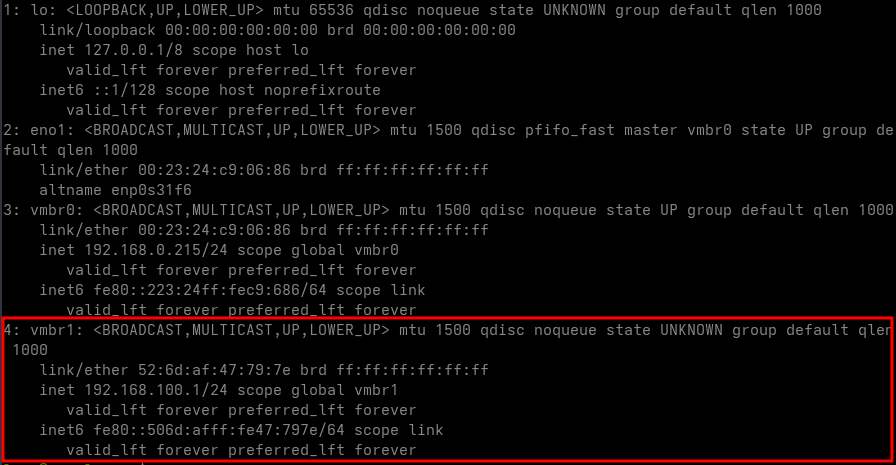

+++
title = 'Proxmox - Création Réseau Interne NAT'
date = 2025-04-12 12:10:00
categories = ['debian']
+++
*Créer un réseau interne avec NAT (Network Address Translation) dans Proxmox. Ce type de configuration est utile lorsque vous souhaitez isoler vos machines virtuelles du réseau externe tout en leur donnant accès à Internet. Cela peut être particulièrement avantageux dans des environnements de laboratoire ou lors de l’utilisation de conteneurs LXC.*

## Proxmox - Réseau NAT

* [Création d’un Réseau Interne avec NAT dans Proxmox](https://oleks.ca/2024/10/25/creation-dun-reseau-interne-avec-nat-dans-proxmox/)
* [How to setup NAT on Proxmox 8.0](https://blog.amitanvir.info/2023/how-to-setup-nat-on-proxmox-8-0/)

### Configuration réseau actuelle

Avant de commencer, vérifiez la configuration réseau actuelle de votre Proxmox en utilisant la commande suivante :

```shell
ip a
```



Le réseau vmbr0 existe, on va ajouter un nouveau pont vmbr1 pour notre réseau interne avec NAT.

### Création du nouveau pont réseau

*    Accédez à l’interface Web de Proxmox.
*    Allez dans **Centre de données**, puis sélectionnez le nœud  **proxleno**
*    Allez dans **Système**, puis dans **Réseau**.
*    Cliquez sur **Créer** et choisir **Linux Bridge**.

Dans la fenêtre pop-up, remplissez les informations suivantes  

*    Name : vmbr1
*    IPv4/CIDR : 192.168.100.1/24 (ou une autre adresse IP selon vos besoins)
*    Comment : “Réseau Interne avec NAT”

{:width="400" .normal}  
Cliquez sur **Créer** pour créer le pont réseau.

Pour appliquer les modifications, cliquez sur Apply Configuration.  
{: .normal}  
{: .normal}  

### Configuration du NAT

Pour configurer le NAT, vous devez modifier la configuration réseau directement sur le serveur Proxmox. Cela se fait à l’aide de iptables, un outil puissant pour gérer les règles de pare-feu et de translation d’adresses réseau (NAT) sous Linux.

*    Connectez-vous à votre serveur Proxmox via SSH.
*    Ouvrez le fichier `/etc/network/interfaces` pour le modifier.
*    Ajoutez les lignes suivantes à la fin du fichier 

```
post-up echo 1 > /proc/sys/net/ipv4/ip_forward
post-up iptables -t nat -A POSTROUTING -s '192.168.100.0/24' -o vmbr0 -j MASQUERADE
post-down iptables -t nat -D POSTROUTING -s '192.168.100.0/24' -o vmbr0 -j MASQUERADE
```

{: .normal}

Le réseau 192.168.100.0/24 est utilisé pour vmbr1, et vmbr0 est le pont relié à l’extérieur avec accès à Internet.

* `echo 1 > /proc/sys/net/ipv4/ip_forward` active le transfert des paquets IP.
* `iptables -t nat -A POSTROUTING -s ‘192.168.100.0/24’ -o vmbr0 -j MASQUERADE` configure le NAT pour le réseau 192.168.100.0/24, en utilisant vmbr0 pour la connexion à l’extérieur.
* `iptables -t nat -D POSTROUTING -s ‘192.168.100.0/24’ -o vmbr0 -j MASQUERADE` supprime cette règle NAT lors de l’arrêt ou du redémarrage.

### Application des changements et redémarrage

Une fois les modifications effectuées, redémarrez le serveur Proxmox pour appliquer la nouvelle configuration 

```shell
systemctl reboot
```

Après reboot, vérifier, `ip   a`  
{: .normal}

### Test configuration avec VM 104 debian

https://oleks.ca/2024/10/25/creation-dun-reseau-interne-avec-nat-dans-proxmox/

Après le redémarrage, j’assigne vmbr1 à la VM 104 Debian 12.  
Dans Marériel --> Réseau , sélectionner vmbr1 comme bridge et attribuez une adresse IP dans la plage 172.16.2.0/24, en définissant la passerelle sur 172.16.2.1 (l’adresse IP du pont). Dans mon cas, j’utilise 172.16.2.10/24.

Pour vérifier que les machines virtuelles ont bien accès à Internet via le NAT, nous pouvons tester la connectivité. Démarrez votre VM, connectez-vous via la console, puis essayez de pinger mon blog ou google en utilisant la commande suivante :

ping oleks.ca

Et voilà, vous avez maintenant configuré un réseau interne avec NAT dans Proxmox !