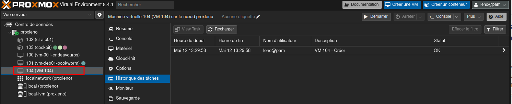
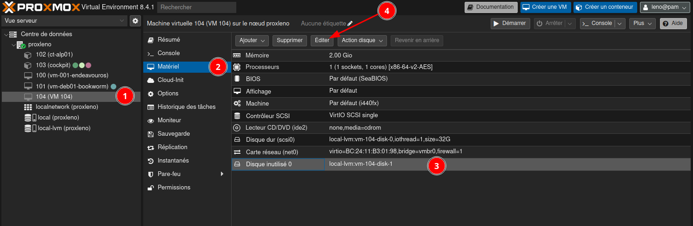
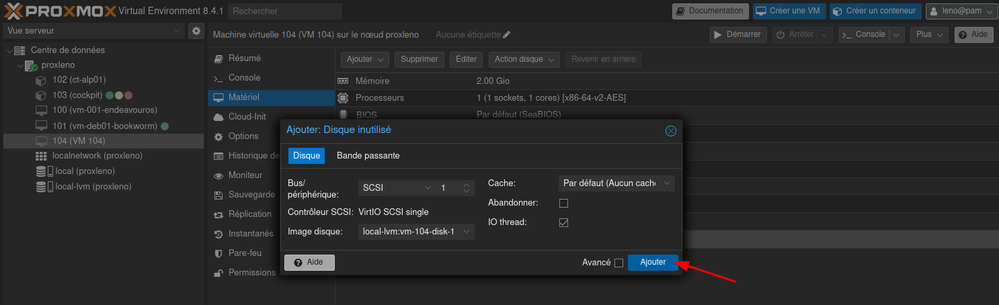
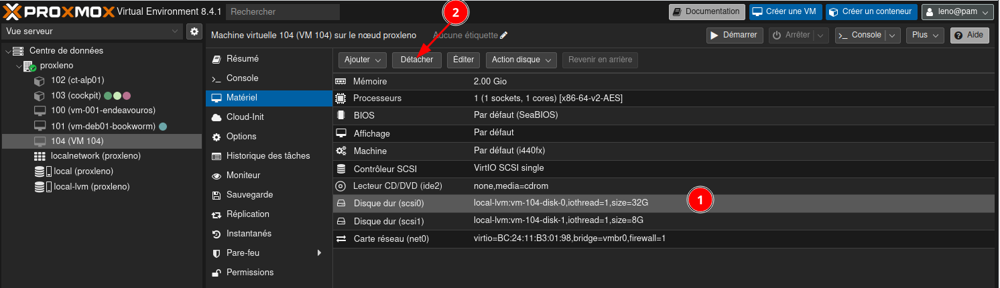
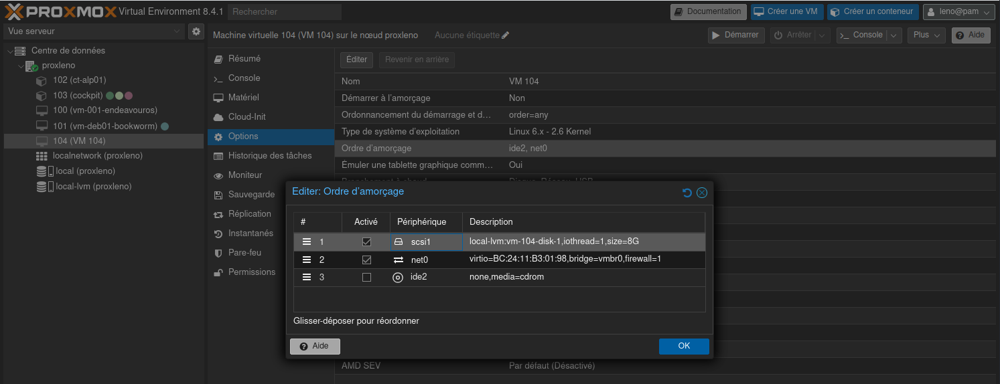

+++
title = 'Transférer une machine virtuelle de kvm vers proxmox'
date = 2025-04-12 12:10:00
categories = ['debian']
+++
*Ce tutoriel vous expliquera comment transférer une machine virtuelle de **kvm** vers **proxmox** sans perdre de données ou de configurations. Vous aurez à la fin un clone d'une machine virtuelle KVM dans votre proxmox.*

## Comment migrer un VM de KVM vers Proxmox

* [How to migrate a VM from KVM to Proxmox](https://crackoverflow.com/docs/system_administration/virtualization/how-to-migrate-a-vm-from-kvm-to-proxmox/)


### Prérequis

* Accès à la machine où fonctionne le KVM.
* Accès à l'interface web Proxmox.
* Connaissance de base de l'utilisation de la ligne de commande.

### Virsh sur KVM

*__virsh__ est un utilitaire en ligne de commande pour gérer et interagir avec les machines virtuelles (VM) et les hyperviseurs. Il est couramment utilisé dans les environnements utilisant l'hyperviseur KVM (Kernel-based Virtual Machine). Avec virsh, vous pouvez effectuer diverses opérations telles que le démarrage, l'arrêt et l'inspection des VM, ainsi que la gestion des configurations de stockage et de réseau.*

* Premièrement, nous allons localiser les fichiers VM sur KVM et les transférer à Proxmox avec la commande scp (vous pouvez utiliser n'importe quelle autre méthode que vous voulez).   
* Ensuite, nous allons créer un nouveau VM par défaut sur Proxmox et importer les fichiers VM KVM transférés dans le Proxmox VM créé.   
* Enfin, nous allons ajuster l'ordre de démarrage du Proxmox VM pour démarrer à partir des fichiers VM de KVM.

### Étape 1: Arrêt de la machine KVM

Connectez-vous à la machine où le KVM fonctionne (physiquement ou par ssh).  
Liste de toutes les machines virtuelles  

```shell
sudo virsh list --all
```

Éteignez la machine que vous voulez transférer 

```shell
# Syntaxe
sudo virsh shutdown <machine_name>

#Exemple  VM vm-debian12
sudo virsh shutdown vm-debian12 # Domain 'vm-debian12' is being shutdown
```

### Étape 2: Localiser et copier le fichier disque VM

Trouvez le chemin vers les fichiers connexes dont nous avons besoin sur KVM pour votre VM (par exemple les fichiers .qcow et .iso). Pour connaître le chemin exact de ces fichiers, vous pouvez exécuter cette commande 

```shell
# Syntaxe
sudo virsh domblklist <machine_name>

# Exemple  VM vm-debian12
sudo virsh domblklist vm-debian12
```

Copiez le chemin de ces fichiers et gardez-les quelque part.

```
 Target   Source
---------------------------------------------------
 vda      /srv/kvm/libvirt/images/debian-12.qcow2
 sda      -
```

Créer une liaison SSH entre KVM et Proxmox

```shell
# cwwk KVM
ssh-keygen -t ed25519 -o -a 100 -f ~/.ssh/proxmox
# copier la clé publique
cat ~/.ssh/proxmox.pub
# Proxmox - Ajout clé publique au fichier 
echo "ssh-ed25519 AAAAC3NzaC1lZDI1NTE5AAAAIIBgGcO3l8obZcXUKock7z1NZSmF1NO71MRNRctKbfqE yick@cwwk" >> $HOME/.ssh/authorized_keys
```

Connectez-vous à votre machine PROXMOX et ouvrez un terminal  

```shell
# cwwk KVM
ssh leno@192.168.0.215 -p 55215 -i $HOME/.ssh/proxmox
```

Copiez tous les fichiers des machines KVM vers la machine proxmox (tous les fichiers `.qcow2`, `.iso`, etc). Utilisez le chemin de la dernière commande. 

```shell
# cwwk KVM to proxmox
scp -P 55215 -i $HOME/.ssh/proxmox /srv/kvm/libvirt/images/debian-12.qcow2 leno@192.168.0.215:/home/leno/
```

### Étape 3: Importer le disque VM dans Proxmox

Connectez-vous à l'interface web Proxmox  

En mode shell,déplacer le(s) fichier(s) vers `/var/lib/vz/images`)

```shell
sudo mv debian-12.qcow2 /var/lib/vz/images/
```

Créer une nouvelle VM dans l'interface web (en laissant les autres paramètres par défaut)  




Importer le disque dans Proxmox avec le terminal et l'ID de la machine de celui que vous avez créé

```shell
# en mode su
# syntaxe
qm importdisk <machine_id_number> /var/lib/vz/images/file.qcow local
# Remarque : Remplacer local par le stockage que vous souhaitez.

# 
qm importdisk 104 /var/lib/vz/images/debian-12.qcow2 local-lvm
# Patienter...
# unused0: successfully imported disk 'local-lvm:vm-104-disk-1'
```

Rescanner le disque importé

```shell
qm rescan
```

### Étape 4: Configurer la VM dans Proxmox

Allez à votre nouvelle VM créée à partir de l'interface web proxmox.  
Aller à la section Matériel de la VM nouvellement créée dans l'interface web Proxmox  
Recherchez le disque inutilisé et sélectionnez-le    
{: .normal}  
Editer pour l'ajouter  
{: .normal}  

Détachez l'ancien disque si nécessaire (facultatif)  
{: .normal}  

Allez dans la section Options et ajustez l'ordre de démarrage   
{: .normal}  

>En suivant ces étapes, vous devriez être en mesure de transférer votre VM de KVM à Proxmox. Assurez-vous de vérifier les paramètres et configurations après le transfert pour s'assurer que tout fonctionne correctement.
{: .prompt-tip }
