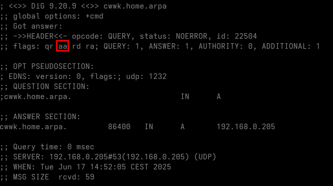
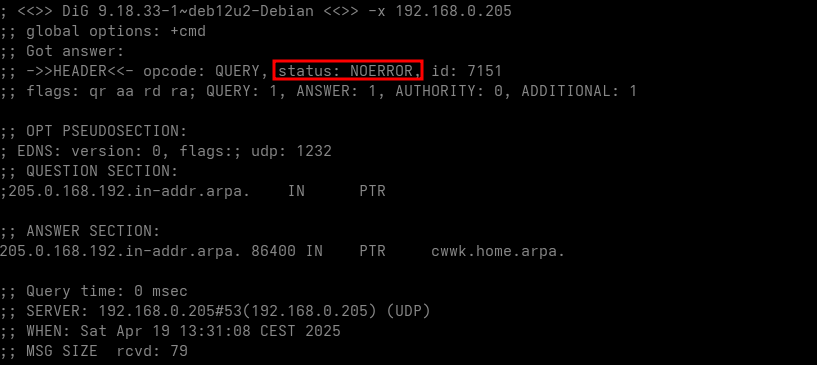
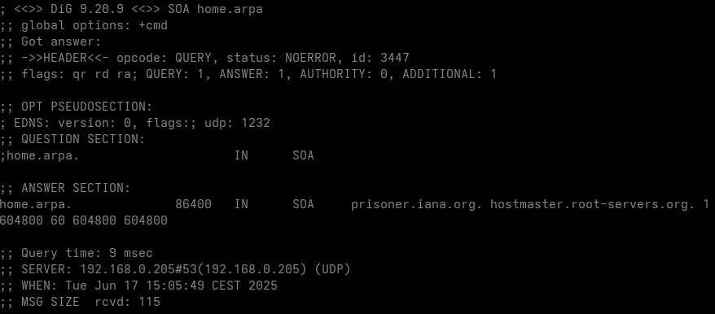

+++
title = 'Domaine home.arpa'
date = 2025-06-04 00:00:00 +0100
categories = ['dns']
+++
## home.arpa

### Liens

* [Comment configurer un résolveur DNS local avec Unbound sur Debian](https://fr.linux-console.net/?p=30723)
* [Modifier le fichier /etc/nsswitch.conf dans Linux](https://www.malekal.com/modifier-fichier-etc-nsswitch-conf-linux/)
* [Find your systems easily on a LAN with mDNS](https://fedoramagazine.org/find-systems-easily-lan-mdns/)
* [Une zone locale home.arpa signée avec DNSSEC](https://www.shaftinc.fr/home-arpa-dnssec.html)
* [How to Setup Local DNS Using /etc/hosts File in Linux](https://www.tecmint.com/setup-local-dns-using-etc-hosts-file-in-linux/)
* [Comprendre et Configurer le Fichier /etc/resolv.conf sous Linux](https://www.aslog.fr/configurer-fichier-resolv-conf-linux/)


### Informations

`.local` est utilisé par mDNS (multicast DNS), un protocole conçu par Apple. Utiliser `exemple.local` ne fonctionne que sur les systèmes (et pour les destinations) qui ont un démon mDNS en cours d'exécution (par exemple MacOSX, distributions Linux actuelles comme Ubuntu/Fedora).


*    ".home.arpa" est un nom de domaine à usage spécial qui est désigné pour une utilisation non unique dans les réseaux domestiques résidentiels (c'est-à-dire non autorisé sur l'Internet public). Il a toujours besoin d'un serveur DNS privé pour la résolution des noms d'hôtes.
*    ".local" est un nom de domaine à usage spécial qui peut fonctionner sans serveur DNS local (c'est-à-dire privé).

Le home.arpa spTLD n'est pas un nom de domaine unique à l'échelle mondiale, et vous ne pouvez pas le résoudre sur Internet. Il est destiné uniquement à être utilisé à l'intérieur d'un petit réseau, comme votre réseau domestique. Les routeurs et les serveurs du système de noms de domaine (DNS) savent, [en théorie], ne pas transmettre les demandes ARPA qu'ils ne comprennent pas sur Internet public.

### Gérer un domaine local avec Unbound

*[Gérer un domaine local avec Unbound](https://www.shaftinc.fr/unbound-domaine-local.html), créer un domaine local, pour le réseau privé, ce qui est bien plus pratique que de retenir des IPs ou maintenir un fichier hosts sur les machines où l'on y a accès*

On liste les appareils du réseau et on note leurs adresses IPv4 et IPv6 (si cette dernière est fixe) pour passer le tout à Unbound.

**Création configuration `local-unbound.conf`**  
On crée donc un fichier de configuration dans /etc/unbound/unbound.conf.d/ (sous Debian & dérivés. Pour les systèmes type Arch, on peut mettre cela dans le fichier de configuration principal ou bien dans un fichier à part que l'on inclut dans la conf principale via include) et on y ajoute :

Configuration des accès réseaux locaux dans le fichier `/etc/unbound/unbound.conf.d/local-unbound.conf`

```
server:
    # Adresse privée 
    access-control: 192.168.0.0/16 allow
    access-control: 192.168.10.0/16 allow
    access-control: 192.168.70.0/16 allow
    #
    local-zone: "home.arpa." transparent
    #local-zone: "home.arpa." static
    # IPv4
    local-data: "cwwk.home.arpa.  86400 IN A 192.168.0.205"
    local-data: "pve.home.arpa.  86400 IN A 192.168.0.205"
    local-data: "cockpit.home.arpa.  86400 IN A 192.168.0.205"
    local-data: "alp01.home.arpa. 86400 IN A 192.168.10.210"
    local-data: "centreon.home.arpa.  86400 IN A 192.168.0.29"
    # IPv6
    local-data: "cwwk.home.arpa.  86400 IN AAAA 2a01:e0a:9c8:2080:aab8:e0ff:fe04:ec45"
    local-data: "pve.home.arpa.  86400 IN AAAA 2a01:e0a:9c8:2080:aab8:e0ff:fe04:ec45"
    # On ajoute les enregistrements PTR
    # PTR IPv4
    local-data-ptr: "192.168.0.205  86400 cwwk.home.arpa."
    local-data-ptr: "192.168.0.205  86400 pve.home.arpa."
    local-data-ptr: "192.168.0.205  86400 cockpit.home.arpa."
    local-data-ptr: "192.168.10.210 86400 alp01.home.arpa."
    local-data-ptr: "192.168.10.29 86400 centreon.home.arpa."
    # PTR IPv6
    local-data-ptr: "2a01:e0a:9c8:2080:aab8:e0ff:fe04:ec45  86400 cwwk.home.arpa."
    local-data-ptr: "2a01:e0a:9c8:2080:aab8:e0ff:fe04:ec45  86400 pve.home.arpa."
    local-data-ptr: "2a01:e0a:9c8:2080:aab8:e0ff:fe04:ec45  86400 cockpit.home.arpa."
```

**Explications**

*    Le type `transparent` de `local-zone` a le fonctionnement suivant : si le domaine est listé dans les `local-data`, Unbound répond avec ces données ou `NODATA` si l'enregistrement demandé ne s'y trouve pas. Le mécanisme de résolution normal est utilisé si le domaine ne possède aucune donnée locale. Il est utilisé si on héberge une [sonde RIPE Atlas](https://atlas.ripe.net/), le résolveur peut-être utilisé pour des tests et notamment des requêtes demanant le `SOA` de `home.arpa`. (qui est un enregisrement qui existe dans les véritables `NS` du domaine). Donc, pour essayer d'<u>éviter de révéler que ce domaine est utilisé localement</u>, `transparent` me semble une bonne solution.
*    Sans cette contrainte, le type `static` est parfaitement adapté (le résolveur intercepte toutes requêtes pour tout l'arbre `home.arpa.`, sert les données qu'il possède sinon répond `NODATA`  ou `NXDOMAIN`).
*    On peut ajouter tout type d'enregistrements — non liés à `DNSSEC`. On peut donc mettre un enregistrement `TXT` pour chaque machine qui fournirait une petite description de celle-ci. Exemple, si un domaine `test.home.arpa` est vide car il ne contient que des sous-domaines comme par exemple `dm1.test.home.arpa`,`dm1.test.home.arpa` , les requêtes pour ce parent suivraient le mécanisme de résolution récursif.  
**Attention** à la syntaxe pour ajouter un enregistrement TXT : utilisation de guillemets simples pour l'enregisrement complet et double pour le texte à passer.  

```
local-data: "dm1.test.home.arpa.  86400 IN A 192.168.0.3"
local-data: "dm2.test.home.arpa.  86400 IN A 192.168.0.4"
[...]
local-data: 'test.home.arpa.  86400 IN TXT "Une adresse par interface"'
```

**Vérifications**  
Vérifier la configuration

    sudo unbound-checkconf /etc/unbound/unbound.conf.d/local-unbound.conf

`unbound-checkconf: no errors in /etc/unbound/unbound.conf.d/local-unbound.conf`

Redémarrer Unbound

    systemctl restart unbound

on peut faire quelques tests

```shell
dig cwwk.home.arpa
```



```shell
dig -x 192.168.0.205
```



On a dans les 2 exemples précédents, l'indication **aa**(Authoritative Answer) dans les réponses. Le résolveur fait donc autorité et nous a bien servi les enregistrements configurés.

```shell
dig SOA home.arpa
```



Cette fois-ci, pas de bit **AA** dans la réponse, Unbound est donc allé chercher la réponse via le mécanisme récursif habituel.

Autre domaine

```
[yann@PC1 ~]$ dig pve.home.arpa

; <<>> DiG 9.20.8 <<>> pve.home.arpa
;; global options: +cmd
;; Got answer:
;; ->>HEADER<<- opcode: QUERY, status: NOERROR, id: 49510
;; flags: qr aa rd ra; QUERY: 1, ANSWER: 1, AUTHORITY: 0, ADDITIONAL: 1

;; OPT PSEUDOSECTION:
; EDNS: version: 0, flags:; udp: 1232
;; QUESTION SECTION:
;pve.home.arpa.			IN	A

;; ANSWER SECTION:
pve.home.arpa.		86400	IN	A	192.168.0.205

;; Query time: 1 msec
;; SERVER: 192.168.0.205#53(192.168.0.205) (UDP)
;; WHEN: Sun May 11 13:22:45 CEST 2025
;; MSG SIZE  rcvd: 58

[yann@PC1 ~]$ dig -x 192.168.0.205

; <<>> DiG 9.20.8 <<>> -x 192.168.0.205
;; global options: +cmd
;; Got answer:
;; ->>HEADER<<- opcode: QUERY, status: NOERROR, id: 41645
;; flags: qr aa rd ra; QUERY: 1, ANSWER: 2, AUTHORITY: 0, ADDITIONAL: 1

;; OPT PSEUDOSECTION:
; EDNS: version: 0, flags:; udp: 1232
;; QUESTION SECTION:
;205.0.168.192.in-addr.arpa.	IN	PTR

;; ANSWER SECTION:
205.0.168.192.in-addr.arpa. 86400 IN	PTR	cwwk.home.arpa.
205.0.168.192.in-addr.arpa. 86400 IN	PTR	pve.home.arpa.

;; Query time: 1 msec
;; SERVER: 192.168.0.205#53(192.168.0.205) (UDP)
;; WHEN: Sun May 11 13:23:07 CEST 2025
;; MSG SIZE  rcvd: 97

```

## Autorité de Certification interne et Certificats Clients

### Création d'une Autorité de Certification interne

[Openssl - Création d'une Autorité de Certification interne et de Certificats Clients](/posts/Openssl_Autorite_de_Certification_interne+Certificats_Clients/)

Autorité de certification **homearpaCA**

```
/home/yick/
├── gencert.sh
├── CA
│   ├── cle.txt
│   ├── homearpaCA.crt
│   ├── homearpaCA.key
│   ├── homearpaCA.pem
│   └── homearpaCA.srl
```

### Déployer le CA sur les systèmes d'exploitation

On peut d’ores et déjà installer le CA autosigné chez les clients  


- Red Hat, CentOS, Alma Linux, Rocky : Ajouter une autorité de certification au magasin système : <https://www.linuxtricks.fr/wiki/red-hat-centos-alma-linux-rocky-ajouter-une-autorite-de-certification-au-magasin-systeme>
- Ubuntu : Ajouter une autorité de certification au magasin système : <https://www.linuxtricks.fr/wiki/ubuntu-ajouter-une-autorite-de-certification-au-magasin-systeme>
- Firefox : Ajouter une autorité de certification au magasin local : <https://www.linuxtricks.fr/wiki/firefox-ajouter-une-autorite-de-certification-au-magasin-local>

Pour des clients **ArchLinux** ça se fait alors avec la commande trust  

```shell
# en mode su
trust anchor --store homearpaCA.crt
```

On peut vérifier qu'il est bien dans la liste à partir de son nom: `trust list | rg -C 2 "HOMEARPA"`

```
pkcs11:id=%9E%E4%56%A9%A1%3D%7D%54%3D%76%65%14%DD%E1%40%6D%D1%36%85%F7;type=cert
    type: certificate
    label:  HOMEARPA CA
    trust: anchor
    category: authority
```

On en profite pour bien vérifier que le certificat est un certificat d'autorité (catégorie authority) et bien sûr que ce soit bien un certificat (type certificate). 

Il est alors installé dans le dossier `/etc/ca-certificates/trust-source/`.  

```
/etc/ca-certificates/trust-source/
├── anchors
│   └── Caddy_Local_Authority_-_2025_ECC_Root_9294197533201652855150179829525046717.crt
├── blocklist
├── _HOMEARPA_CA.p11-kit
└── README
```

Pour supprimer le certificat des certificats de confiance, on utilise le fichier généré dans ce dossier.

```shell
# en mode su
trust anchor --remove /etc/ca-certificates/trust-source/_HOMEARPA_CA.p11-kit
```

**Générer les certificats clients sur la machine cwwk**

Le script `gencert.sh` 

```bash
#! /bin/bash
# Chemin des fichiers du CA 
# Clé
echo $(cat CA/cle.txt)
# Si dans CA on a les homearpaCA.key homearpaCA.crt homearpaCA.ext : CA="CA/homearpaCA"
CA="CA/homearpaCA"
# Domaine du CA
DOMAINE="home.arpa"
################
# DEBUT SCRIPT #
################
DOM1="${DOMAINE%%.*}"
DOM2="${DOMAINE#*.}"
if [[ "$1" =~ ^[a-zA-Z0-9-]+\.$DOM1\.$DOM2 ]]
then
    FQDN="$1"
else
    echo "Erreur : FQDN $1 incorrect pour le domaine $DOMAINE"
    exit 1
fi
echo "Certificat pour : $FQDN"
echo "Fichier de directives de configuration"
cat > $FQDN.ext << EOF
authorityKeyIdentifier=keyid,issuer
basicConstraints=CA:FALSE
keyUsage = digitalSignature, nonRepudiation, keyEncipherment, dataEncipherment
subjectAltName = @alt_names
[alt_names]
DNS.1 = $FQDN
EOF
echo "Generation KEY"
openssl genpkey -algorithm RSA -out $FQDN.key -pkeyopt rsa_keygen_bits:4096
echo "Génération CSR"
openssl req -new -key $FQDN.key -out $FQDN.csr -subj "/C=FR/ST=PAYS-DE-LOIRE/L=ANGERS/O=homearpa/OU=homearpa/CN=$FQDN"
echo "Signature CSR avec CA"
openssl x509 -req -in $FQDN.csr -CA $CA.crt -CAkey $CA.key -CAcreateserial -out $FQDN.crt -days 3650 -sha256 -extfile $FQDN.ext
echo "Vérification"
openssl verify -CAfile $CA.crt $FQDN.crt
```

exemple test.home.arpa 

```shell
/home/yick/
./gencert test.home.arpa
# Une passphrase est demandée (dans cle.txt)
```

A l'issue de cette commande des fichiers sont générés

```
├── test.home.arpa.crt
├── test.home.arpa.csr
├── test.home.arpa.ext
├── test.home.arpa.key
```

### Alternative mkcert (Obsolète)

Le paquet ca-certificats qui est commun dans chaque distribution Linux est absent de l'installation par défaut de Alpine, vous pouvez installer le paquet ca-certificats avec la commande suivante

```shell
sudo apk -U add ca-certificates
```

Les fichiers sont disponibles dans le dossier `~/sharenfs/rnmkcy/.mkcert/`

Nous recopions server.crt dans /usr/local/share/ca-certificats/ 

```shell
sudo mkdir -p /usr/local/share/ca-certificats/
sudo cp ~/sharenfs/rnmkcy/.mkcert/rootCA.pem /usr/local/share/ca-certificats/mkcert.crt
```

Enfin, nous pouvons ajouter le certificat à la collection ca-certificats en utilisant la commande update-ca-certificats:

```shell
sudo update-ca-certificates
```

Cette commande ajoute server.crt au /etc/ssl/certs/ca-certificats.crt.

Nous pouvons vérifier les mises à jour au bas du fichier.

```shell
sudo cp ~/sharenfs/rnmkcy/.mkcert/cwwk.home.arpa+1-key.pem /etc/ssl/private/alp01.home.arpa-key.pem 
sudo cp ~/sharenfs/rnmkcy/.mkcert/cwwk.home.arpa+1.pem  /etc/ssl/private/alp01.home.arpa.pem    
```

## Résolveur DNS (resolv.conf)

*Le fichier `/etc/resolv.conf` est utilisé par le résolveur DNS de la bibliothèque C pour déterminer comment convertir les noms de domaine en adresses IP. En d’autres termes, il indique quelles adresses de serveurs DNS doivent être interrogées lorsqu’une application tente de résoudre un nom de domaine (par exemple, transformer www.example.com en une adresse IP).*

>**Unbound** écoute sur l'interface 192.168.0.205, le DNS par défaut est donc la même adresse ip soit 192.168.0.205 (/etc/resolv.conf)
{: .prompt-tip }

### Structure et Syntaxe du Fichier

* `nameserver` : Chaque directive `nameserver` suivie d’une adresse IP indique un serveur DNS à interroger. Le résolveur tente les requêtes dans l’ordre où les serveurs sont listés. Par défaut, jusqu’à trois serveurs sont utilisés.

```
        nameserver 1.1.1.1
        nameserver 9.9.9.9    
```

* `search` et `domain` : 
    * La directive `search` permet de définir une liste de domaines à ajouter automatiquement aux requêtes incomplètes. 
    * La directive `domain` est une forme simplifiée qui définit un seul domaine par défaut. 
    * Ces deux directives sont mutuellement exclusives.

```
        search example.com local
        domain example.com    
```

* `options` La directive options permet de spécifier des paramètres supplémentaires :
    * `timeout:n` : délai d’attente initial en secondes
    * `attempts:n` : nombre de tentatives avant abandon
    * `ndots:n` : nombre minimum de points requis dans un nom

```
        options timeout:2 attempts:3 ndots:1  
```

### Outils et Méthodes de Gestion


*    **resolvconf** : programme intermédiaire entre différentes sources DNS (DHCP, VPN…), qui évite les conflits entre applications.
*    **systemd-resolved** : gère automatiquement /etc/resolv.conf via un lien symbolique et fournit un résolveur local.
*    **NetworkManager** : souvent utilisé avec les outils ci-dessus pour gérer dynamiquement la résolution DNS selon les connexions actives.

### Configuration Manuelle

Il est parfois préférable de configurer manuellement `/etc/resolv.conf`, surtout sur des serveurs. Utilisez un éditeur comme vim ou nano, puis verrouillez le fichier pour éviter qu’il soit écrasé :

```shell
chattr +i /etc/resolv.conf
```

Déverrouillez avec :

```shell
chattr -i /etc/resolv.conf
```

### Problèmes liés au VPN

Problème de résolution sur les domaines locaux  `home.arpa` sur PC1 EndeavourOS si un VPN est actif

Il faut activer le DNS personnalisé dans le paramétrage NordVPN

```shell
nordvpn set dns 192.168.0.205
```

