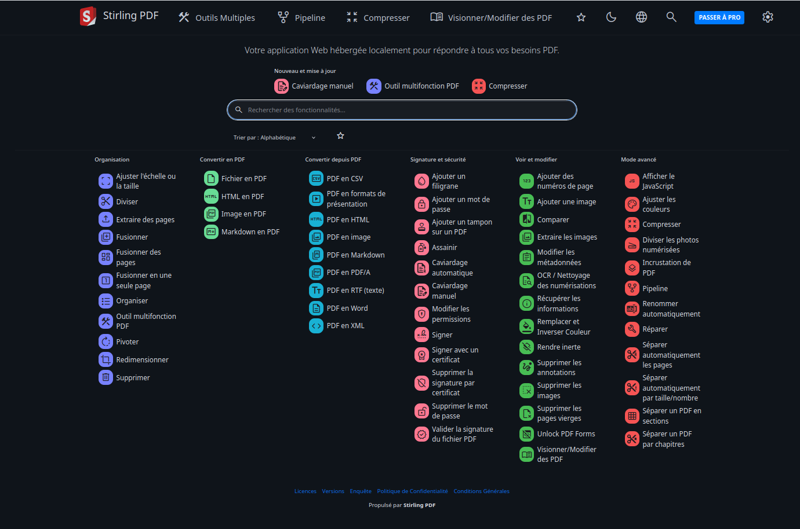

+++
title = 'Stirling une palette complète d’outils pour manipuler vos fichiers PDF'
date = 2025-06-13 12:15:00
categories = ['application']
+++
*Il propose une palette complète d’outils pour manipuler vos fichiers PDF dans tous les sens. Vous pouvez effectuer des tâches simples comme signer un PDF ou fusionner deux documents ou faire des choses un peu plus complexes comme extraire des images d’un document ou compresser un fichier avant de l’envoyer par mail. Tout est là, à portée de clic.[(Stirling PDF : un outil open source pour modifier vos fichiers PDF)](https://www.justgeek.fr/stirling-pdf-modifier-pdf-open-source-139202/)*

## Stirling PDF

 **Stirling**, voici un aperçu des fonctionnalités les plus utiles :

* Fusionner ou diviser un PDF : Combinez plusieurs fichiers ou découpez un PDF en plusieurs parties.
* ddd
* 
* Extraire, réorganiser ou supprimer des pages : Très pratique pour nettoyer ou restructurer un document.
*    Convertir vers ou depuis le PDF : Compatible avec les formats Word, Excel, PowerPoint, images, HTML, Markdown et plus encore.
*    Ajouter un filigrane, une signature ou un mot de passe : Pour sécuriser ou personnaliser vos documents.
*    Compresser un PDF: Réduisez la taille du fichier sans perte visible de qualité.
*    OCR (reconnaissance de texte) : Pour rendre un PDF scanné sélectionnable et modifiable.
*    Modifier les métadonnées : Titre, auteur, date de création… tout peut être ajusté.
*    Effacer les données sensibles : Suppression des métadonnées, redaction automatique, nettoyage de scripts embarqués.
*    Créer des pipelines personnalisés : Enchaînez plusieurs actions automatiquement, comme « compresser → ajouter un mot de passe → supprimer les métadonnées ».

### Docker Images Stirling-PDF

* [Docker Images for Stirling-PDF](https://docs.stirlingpdf.com/Installation/Docker%20Install/)
* [Installation et configuration de Stirling PDF](https://blog.raspot.in/fr/blog/installation-et-configuration-de-stirling-pdf)

Pour la reconnaissance OCR, il nous faut installer un paquet

```shell
sudo apk add tesseract-ocr
```

Exécuter le conteneur avec `docker compose`

```shell
mkdir -p ~/stirling
cd ~/stirling
```

Le fichier `docker-compose.yml`

```yaml
version: '3.3'
services:
  stirling-pdf:
    image: docker.stirlingpdf.com/stirlingtools/stirling-pdf:latest
    ports:
      - '8282:8080'
    volumes:
      - ./StirlingPDF/trainingData:/usr/share/tessdata # Required for extra OCR languages
      - ./StirlingPDF/extraConfigs:/configs
      - ./StirlingPDF/customFiles:/customFiles/
      - ./StirlingPDF/logs:/logs/
      - ./StirlingPDF/pipeline:/pipeline/
    environment:
      SYSTEM_DEFAULTLOCALE: fr-FR
      LANGS: fr-FR
      UI_APPNAME: Boite à outils PDF
      UI_HOMEDESCRIPTION: Votre guichet unique hébergé localement pour travailler sur vos PDF.
      UI_APPNAVBARNAME: Boite à outils PDF
    restart: unless-stopped
```

Démarrer le conteneur

```shell
sudo docker compose up -d
```

[How to add Configurations](https://docs.stirlingpdf.com/Advanced%20Configuration/How%20to%20add%20configurations/)

### cwwk - Proxy nginx pdf.rnmkcy.eu 

`/etc/nginx/conf.d/pdf.rnmkcy.eu.conf` 

```nginx
server {
    listen 80;
    listen [::]:80;
    server_name  pdf.rnmkcy.eu;

    # redirect all plain HTTP requests to HTTPS
    return 301 https://pdf.rnmkcy.eu$request_uri;
}

server {
    # ipv4 listening port/protocol
    listen       443 ssl http2;
    # ipv6 listening port/protocol
    listen           [::]:443 ssl http2;
    server_name  pdf.rnmkcy.eu;

    include /etc/nginx/conf.d/security.conf.inc;

    location / {
	proxy_pass http://192.168.10.213:8282;
    }
}
```

Recharger nginx

    sudo systemctl reload nginx

Lien <https://pdf.rnmkcy.eu>   

{: .normal}

