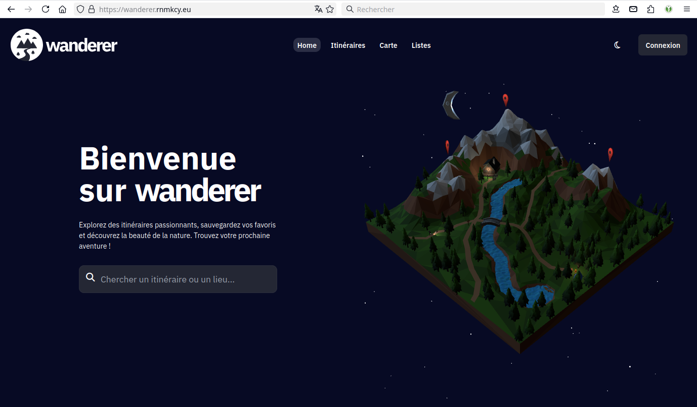

+++
title = 'Wanderer est une base de données de traces GPS (vm-alpine03)'
date = 2025-06-15 00:15:00
categories = ['application']
+++
## Wanderer

*wanderer est une base de données auto-organisé. Vous pouvez télécharger vos traces GPS enregistrées ou en créer de nouvelles et ajouter diverses métadonnées pour créer un catalogue facilement consultable.*

{:width="100" .normal}

{: .normal}


* Gérer vos sentiers
* Planifier de nouvelles routes
* Intégration et visualisation de cartes étendues
* Partagez des sentiers avec d'autres personnes et explorez les leurs
* Fonctions avancées de filtrage et de recherche
* Créer des listes personnalisées pour organiser vos sentiers 


### Installation 

Sur la VM **vm-alpine03**

```shell
mkdir -p ~/wanderer
cd ~/wanderer
```

La façon la plus rapide et recommandée  pour installer Wanderer est **docker composer**

``` shell
# télécharger le fichier docker compose 
wget https://raw.githubusercontent.com/Flomp/wanderer/main/docker-compose.yml

# construire et lancer via docker compose
sudo docker compose up -d
```

Le premier démarrage peut prendre jusqu'à 90 secondes après quoi vous pouvez accéder via le lien localhost:3000

*    ℹ️ Si vous n'hébergez pas wanderer at <http://localhost:3000> Assurez-vous de changer la variable ORIGIN. Sinon, vous rencontrerez des erreurs CORS.
*    ⚠️ Si vous utilisez wanderer dans un environnement de production, assurez-vous de changer la variable `MEILI_MASTER_KEY`

Vous pouvez également exécuter wanderer sur bare-metal. Consultez la [documentation wanderer](https://wanderer.to/getting-started/installation/) pour avoir le guide détaillé.

Remplacer `http://localhost:3000` par `https://wanderer.rnmkcy.eu` dans  la variable **ORIGIN** du fichier `docker-compose.yml`

```yaml
version: '3'

x-common-env: &cenv
  MEILI_URL: http://search:7700
  MEILI_MASTER_KEY: vODkljPcfFANYNepCHyDyGjzAMPcdHnrb6X5KyXQPWo

services:
  search:
    container_name: wanderer-search
    image: getmeili/meilisearch:v1.11.3
    environment:
      <<: *cenv
      MEILI_NO_ANALYTICS: true
    ports:
      - 7700:7700
    networks:
      - wanderer
    volumes:
      - ./data/data.ms:/meili_data/data.ms
    restart: unless-stopped
    healthcheck:
      test: curl --fail http://localhost:7700/health || exit 1
      interval: 15s
      retries: 10
      start_period: 20s
      timeout: 10s
  db:
    container_name: wanderer-db
    image: flomp/wanderer-db
    depends_on:
      search:
        condition: service_healthy
    environment:
      <<: *cenv
      POCKETBASE_ENCRYPTION_KEY:
    ports:
      - "8090:8090"
    networks:
      - wanderer
    restart: unless-stopped
    volumes:
      - ./data/pb_data:/pb_data
  web:
    container_name: wanderer-web
    image: flomp/wanderer-web
    depends_on:
      search:
        condition: service_healthy
      db:
        condition: service_started
    environment:
      <<: *cenv
      ORIGIN: https://wanderer.rnmkcy.eu
      BODY_SIZE_LIMIT: Infinity
      PUBLIC_POCKETBASE_URL: http://db:8090
      PUBLIC_DISABLE_SIGNUP: false
      UPLOAD_FOLDER: /app/uploads
      UPLOAD_USER:
      UPLOAD_PASSWORD:
      PUBLIC_VALHALLA_URL: https://valhalla1.openstreetmap.de
      PUBLIC_NOMINATIM_URL: https://nominatim.openstreetmap.org
    volumes:
      - ./data/uploads:/app/uploads
    ports:
      - "3000:3000"
    networks:
      - wanderer
    restart: unless-stopped
  # valhalla:
  #   image: ghcr.io/gis-ops/docker-valhalla/valhalla:latest
  #   ports:
  #     - "8002:8002"
  #   volumes:
  #     - ./data/valhalla:/custom_files
  #   environment:
  #     - tile_urls=https://download.geofabrik.de/europe/germany/bayern/oberbayern-latest.osm.pbf
  #     - use_tiles_ignore_pbf=True
  #     - force_rebuild=False
  #     - force_rebuild_elevation=False
  #     - build_elevation=True
  #     - build_admins=True
  #     - build_time_zones=True

networks:
  wanderer:
    driver: bridge
```

### cwwk - Proxy nginx wanderer.rnmkcy.eu 

`/etc/nginx/conf.d/wanderer.rnmkcy.eu.conf` 

```nginx
server {
    listen 80;
    listen [::]:80;
    server_name  wanderer.rnmkcy.eu;

    # redirect all plain HTTP requests to HTTPS
    return 301 https://wanderer.rnmkcy.eu$request_uri;
}

server {
    # ipv4 listening port/protocol
    listen       443 ssl http2;
    # ipv6 listening port/protocol
    listen           [::]:443 ssl http2;
    server_name  wanderer.rnmkcy.eu;

    include /etc/nginx/conf.d/security.conf.inc;

    location / {
	proxy_pass http://192.168.10.213:3000;
    }
}
```

Recharger nginx

    sudo systemctl reload nginx

Lien <https://wanderer.rnmkcy.eu>   

{: .normal}

