+++
title = 'Monitoring Docker et Proxmox (cAdvisor + Prometheus + Grafana + InfluxDB)'
date = 2025-08-16
categories = ['application']
+++
*Monitoring docker et proxmox avec cAdvisor, Prometheus, Grafana, InfluxDB*

## Docker Metrics

*L'option metrics-addr est une configuration importante du daemon Docker qui permet d'exposer les métriques de performance et d'utilisation des ressources via un endpoint HTTP. Cette fonctionnalité, combinée avec le port par défaut 9323, vous donne accès à une mine d'informations sur votre environnement Docker.*

{:width="150" .normal}

### Pourquoi le port 9323 ?

*    C'est un port non-privilégié (supérieur à 1024)
*    Il est officiellement alloué à Docker par l'IANA pour cette fonctionnalité
*    Il est peu susceptible d'entrer en conflit avec d'autres services courants
*    Il suit la convention de Prometheus pour les ports d'exportation de métriques (9xxx)

### Ce que vous obtenez avec metrics-addr

Activer l'option metrics-addr dans le daemon.json vous donne accès à de nombreuses métriques Docker formatées nativement pour Prometheus :

*    Métriques système : Utilisation CPU, mémoire, disque et réseau par conteneur
*    Métriques du daemon : État du daemon, nombre d'objets gérés (conteneurs, images, volumes)
*    Métriques d'utilisation : Temps de démarrage des conteneurs, opérations réseau
*    Métriques de performance : Latences des opérations de build et de déploiement

Toutes ces métriques sont disponibles au format Prometheus, ce qui les rend facilement intégrables dans un système de monitoring existant.

ℹ️ Point technique : Le format Prometheus utilise des "labels" qui permettent de filtrer et d'agréger les métriques de manière flexible.

### Cas d'utilisation pour metrics-addr

L'activation de metrics-addr est particulièrement utile dans les scénarios suivants :

*    Supervision d'infrastructure : Intégration avec Prometheus pour surveiller l'ensemble de votre environnement Docker
*    Alerting automatisé : Déclencher des alertes basées sur des seuils de métriques spécifiques
*    Dashboarding : Création de tableaux de bord Grafana pour visualiser les performances
*    Analyse de tendance : Collecter des données sur de longues périodes pour identifier les tendances
*    Détection d'anomalies : Repérer les comportements anormaux dans vos conteneurs

### Configuration de metrics-addr

Configuration via daemon.json

La méthode recommandée pour activer les métriques Docker est de modifier le fichier de configuration du daemon :

Éditez ou créez le fichier de configuration Docker :

    sudo nano /etc/docker/daemon.json

Ajoutez la configuration pour activer l'API de métriques :

```json
{
 "metrics-addr" : "127.0.0.1:9323"
}
```

> Note : L'adresse 127.0.0.1 limite l'accès à la machine locale. Pour exposer les métriques au réseau, utilisez 0.0.0.0:9323 (avec précaution).

Redémarrez Docker pour appliquer les changements :

```
# debian
sudo systemctl restart docker
# alpine linux
service docker restart
```

Vérifiez que les métriques sont disponibles :

    curl http://localhost:9323/metrics

Vous devriez voir une sortie avec de nombreuses métriques au format **Prometheus**.

## Monitoring Docker (cAdvisor+ Prometheus + Grafana)

[Monitoring Docker: Grafana + Prometheus + cAdvisor](https://belginux.com/monitoring-docker-grafana-prometheus-cadvisor/)

Installer grafana promotheus et influxdb

```shell
mkdir -p $HOME/monitoring
cat << EOF > $HOME/monitoring/docker-compose.yml
services:
  grafana:
    image: grafana/grafana
    container_name: grafana
    ports:
      - 3000:3000
    restart: unless-stopped
    volumes:
      - grafana-data:/var/lib/grafana
      - grafana-conf:/etc/grafana

  cadvisor:
    image: gcr.io/cadvisor/cadvisor:v0.49.1
    container_name: cadvisor
    ports:
      - 8098:8080
    volumes:
      - /:/rootfs:ro
      - /var/run:/var/run:ro
      - /sys:/sys:ro
      - /var/lib/docker/:/var/lib/docker:ro
      - /dev/disk/:/dev/disk:ro
    devices:
      - /dev/kmsg
    privileged: true
    restart: unless-stopped

  prometheus:
    image: docker.io/prom/prometheus:latest
    container_name: prometheus
    ports:
      - 9090:9090
    command: "--config.file=/etc/prometheus/prometheus.yaml"
    volumes:
      - ./prometheus.yaml:/etc/prometheus/prometheus.yaml:ro
      - prometheus-data:/prometheus
    restart: unless-stopped

  influxdb:
    image: influxdb:2
    container_name: influxdb
    volumes:
      - influxdb-config:/etc/influxdb2
      - influxdb-data:/var/lib/influxdb2
    ports:
       - 8086:8086

volumes:
  grafana-data:
  grafana-conf:
  prometheus-data:
  influxdb-config:
  influxdb-data:
EOF

cat << EOF > $HOME/monitoring/prometheus.yaml
global:
  scrape_interval:     15s # By default, scrape targets every 15 seconds.

scrape_configs:
  - job_name: 'prometheus'
    scrape_interval: 5s
    static_configs:
      - targets: ['192.168.10.215:9090']

  - job_name: 'cadvisor'
    static_configs:
      - targets: ['cadvisor:8080']
EOF
```

>Remplacer l'adresse IP 192.168.10.215 par celle de votr VM
{: .prompt-tip }


Installation via docker-compose

```shell
cd $HOME/monitoring
sudo docker-compose up -d
```

Les liens

**Cadvisor:** <http://192.168.10.215:8098>  
**Prometheus:** <http://192.168.10.215:9090>  
**Grafana:** <http://192.168.10.215:3000>  
**InfluxDB:** <http://192.168.10.215:8086>

### Machine cwwk domaines home.arpa

Création des domaines locaux **cadvisor.home.arpa** et **grafana.home.arpa**  

Modification fichier Unbound `/etc/unbound/unbound.conf.d/local-unbound.conf`  
Ajouter

```
    local-data: "cadvisor.home.arpa.  86400 IN A 192.168.0.205"
    local-data: "grafana.home.arpa.  86400 IN A 192.168.0.205"

    local-data-ptr: "192.168.0.205 86400 cadvisor.home.arpa."
    local-data-ptr: "192.168.0.205 86400 grafana.home.arpa."
```

Relancer le service

```shell
sudo systemctl restart unbound
```

**Grafana**  
[Run Grafana behind a reverse proxy](https://grafana.com/tutorials/run-grafana-behind-a-proxy/)  
Fichier de configuration nginx `/etc/nginx/conf.d/grafana.home.arpa.conf`

```nginx
# This is required to proxy Grafana Live WebSocket connections.
map $http_upgrade $connection_upgrade {
  default upgrade;
  '' close;
}

upstream grafana {
  server 192.168.10.215:3000;
}

server {
    listen 443 ssl http2;
    listen [::]:443 ssl http2;
    server_name grafana.home.arpa;

    ssl_certificate      /etc/ssl/private/grafana.home.arpa.crt;
    ssl_certificate_key  /etc/ssl/private/grafana.home.arpa.key;

    ##################################################
    ssl_session_timeout 1d;
    ssl_session_cache shared:MozSSL:10m;  # about 40000 sessions
    ssl_session_tickets off;

    # modern configuration
    ssl_protocols TLSv1.3;
    ssl_ecdh_curve X25519:prime256v1:secp384r1;
    ssl_prefer_server_ciphers off;

    # Ajouts 2025
    more_set_headers "Strict-Transport-Security : max-age=63072000; includeSubDomains; preload";
    more_set_headers "Referrer-Policy: no-referrer";
    more_set_headers "X-Content-Type-Options: nosniff";
    more_set_headers "X-Download-Options: noopen";
    more_set_headers "X-Frame-Options: SAMEORIGIN";
    more_set_headers "X-Permitted-Cross-Domain-Policies: none";
    more_set_headers "X-Robots-Tag: noindex, nofollow";
    more_set_headers "X-XSS-Protection: 1; mode=block";
    # Fin ajouts 2025

    # replace with the IP address of your resolver
    resolver 192.168.0.205 valid=300s;
    resolver_timeout 5s;
    ##################################################

  location / {
    proxy_set_header Host $host;
    proxy_pass http://grafana;
  }

  # Proxy Grafana Live WebSocket connections.
  location /api/live/ {
    proxy_http_version 1.1;
    proxy_set_header Upgrade $http_upgrade;
    proxy_set_header Connection $connection_upgrade;
    proxy_set_header Host $host;
    proxy_pass http://grafana;
  }
}
```

**Cadvisor**  
Fichier de configuration nginx `/etc/nginx/conf.d/cadvisor.home.arpa.conf`

```nginx
server {
    listen 443 ssl http2;
    listen [::]:443 ssl http2;
    server_name cadvisor.home.arpa;

    ssl_certificate      /etc/ssl/private/cadvisor.home.arpa.crt;
    ssl_certificate_key  /etc/ssl/private/cadvisor.home.arpa.key;

    ##################################################
    ssl_session_timeout 1d;
    ssl_session_cache shared:MozSSL:10m;  # about 40000 sessions
    ssl_session_tickets off;

    # modern configuration
    ssl_protocols TLSv1.3;
    ssl_ecdh_curve X25519:prime256v1:secp384r1;
    ssl_prefer_server_ciphers off;

    # Ajouts 2025
    more_set_headers "Strict-Transport-Security : max-age=63072000; includeSubDomains; preload";
    more_set_headers "Referrer-Policy: no-referrer";
    more_set_headers "X-Content-Type-Options: nosniff";
    more_set_headers "X-Download-Options: noopen";
    more_set_headers "X-Frame-Options: SAMEORIGIN";
    more_set_headers "X-Permitted-Cross-Domain-Policies: none";
    more_set_headers "X-Robots-Tag: noindex, nofollow";
    more_set_headers "X-XSS-Protection: 1; mode=block";
    # Fin ajouts 2025

    # replace with the IP address of your resolver
    resolver 192.168.0.205 valid=300s;
    resolver_timeout 5s;
    ##################################################

    location / {
	proxy_pass http://192.168.10.215:8098;
    }

}
```

### Prometheus

Prometheus http://192.168.10.215:9090   
Rendez-vous donc sur Prometheus, partie Status, ensuite cliquez sur Targets:   
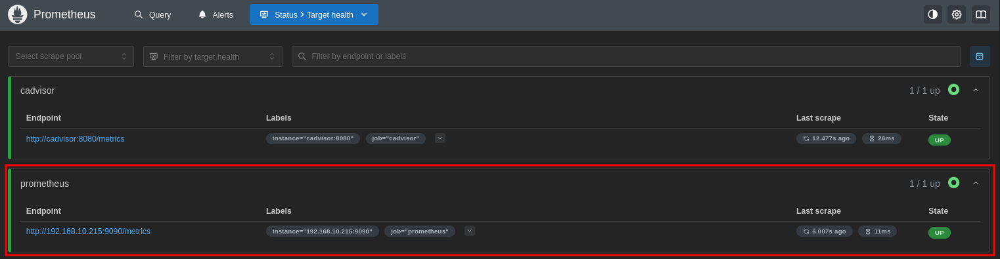{: .normal}

### Grafana

{:width="150" .normal}

Grafana http://192.168.10.215:3000  admin/admin
On va commencer par lancer Grafana afin de changer le mot de passe par défaut.  

Il va falloir ajouter une source de données, celle de Prometheus. Dans Grafana, partie Home, cliquez sur Data Sources:  
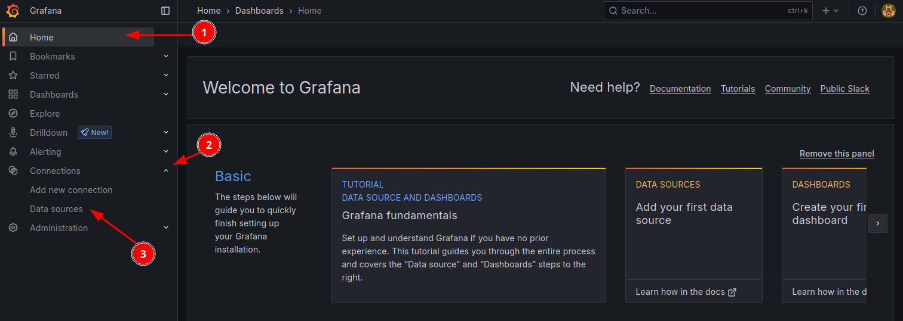{: .normal} 

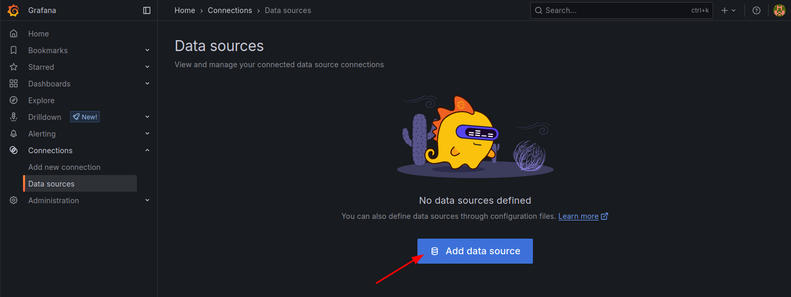{: .normal} 

Cliquez sur Prometheus:  
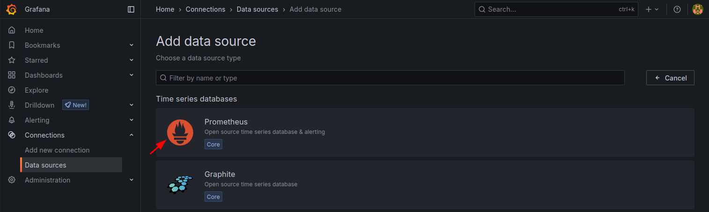{: .normal} 

Dans la partie Connection, il suffit d'entrer l'ip:port de Prometheus, http://192.168.10.215:9090  
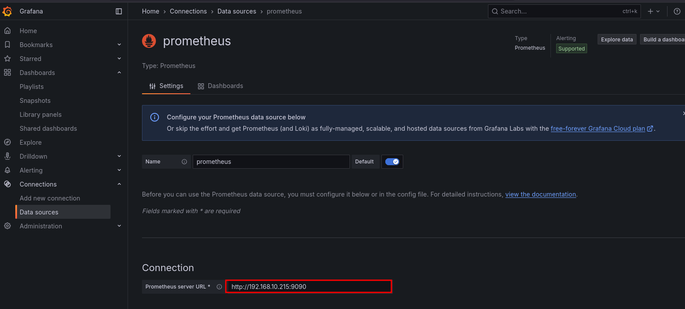{: .normal} 

Maintenant on va sauver/tester en cliquant sur Save & test:  
{: .normal} 

Ce qui doit retourner:  
{: .normal} 

Retournez sur Home, et cliquez sur Dashboards:  
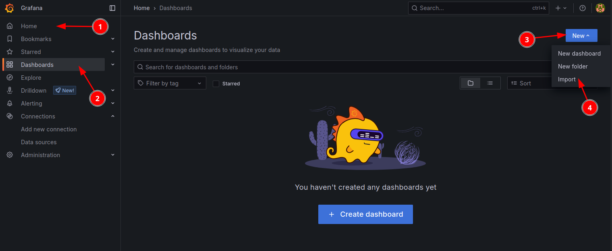{: .normal} 

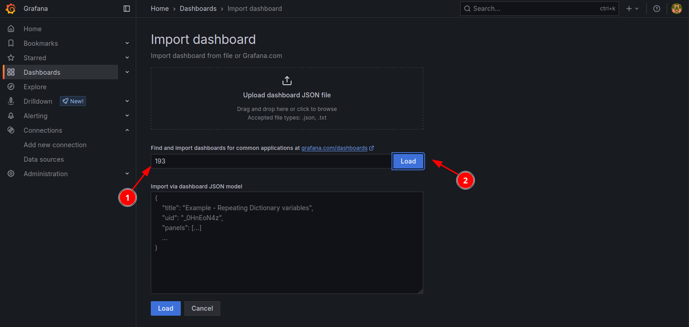{: .normal} 

Dans Options, Name, vous pouvez choisir le nom que vous voulez. N'oubliez pas dans le fond de sélectionnez prometheus:  
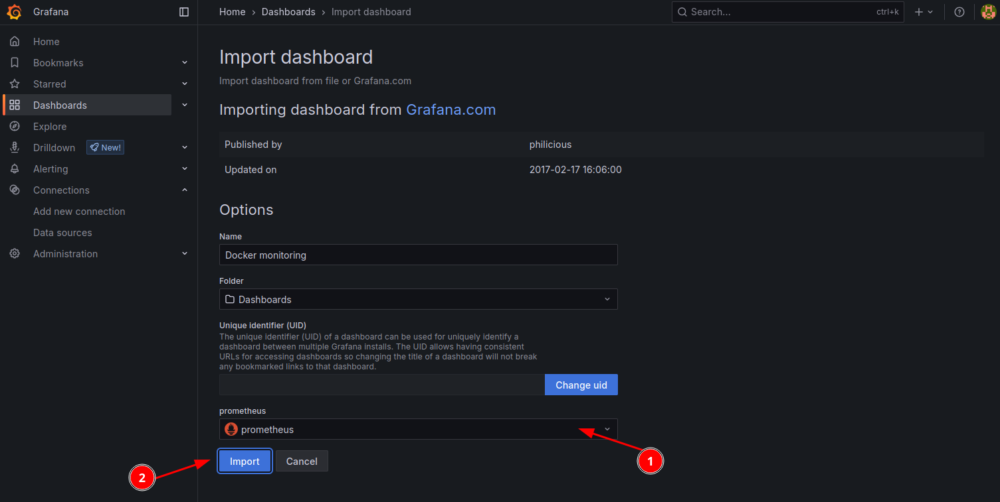{: .normal} 

Terminé  
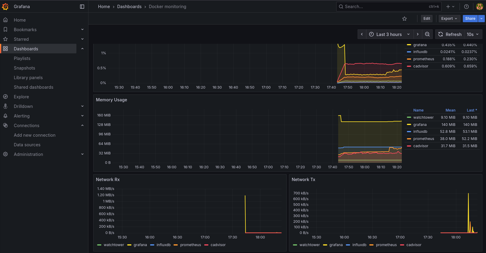{: .normal} 

### cAdvisor

*__cAdvisor (Container Advisor)__ fournit aux utilisateurs de conteneurs une compréhension de l'utilisation des ressources et des caractéristiques de performance de leurs conteneurs de fonctionnement. Il s'agit d'un démon en marche qui recueille, regroupe, traite et exporte des informations sur les conteneurs en marche. Plus précisément, pour chaque conteneur, il conserve les paramètres d'isolement des ressources, l'utilisation historique des ressources, les histogrammes de l'utilisation historique complète des ressources et les statistiques du réseau. Ces données sont exportées par conteneur et par machine.*

<http://192.168.10.215:8098>    
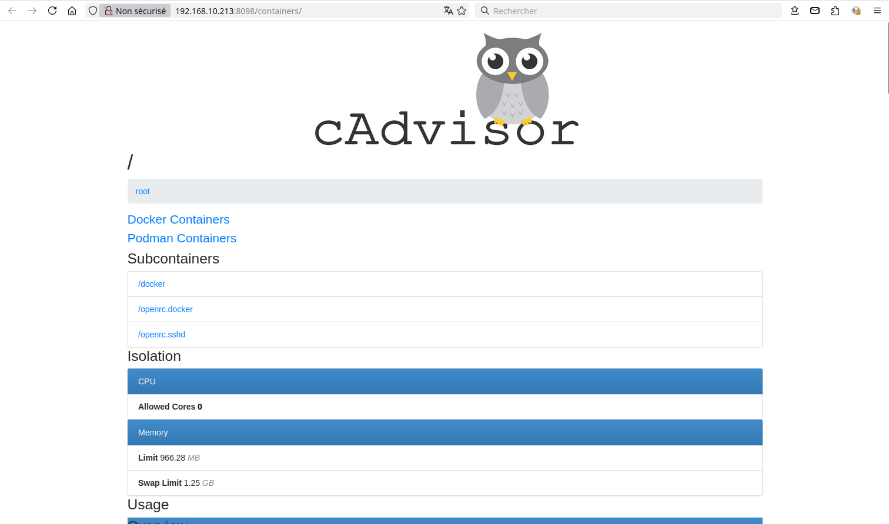{: .normal}


## Monitoring Proxmox (InfluxDB + Grafana)

[Monitoring Proxmox: Grafana + InfluxDB](https://belginux.com/proxmox-grafana-influxdb/)

### InfluxDB

{:width="150" .normal}

Ajout influxdb au docker-compose

```yaml
  influxdb:
    image: influxdb:2
    container_name: influxdb
    volumes:
      - influxdb-config:/etc/influxdb2
      - influxdb-data:/var/lib/influxdb2
    ports:
       - 8086:8086

volumes:
  influxdb-config:
  influxdb-data:
```

Déployer

```shell
sudo docker-compose up -d
```

**InfluxDB** <http://192.168.10.215:8086/>

Lorsque vous lancez influxDB pour la première fois, cliquez sur GET STARTED:  
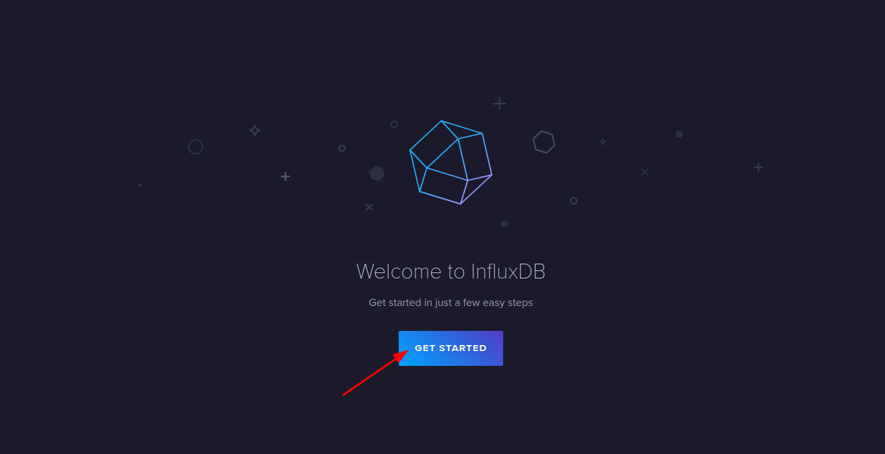{: .normal} 

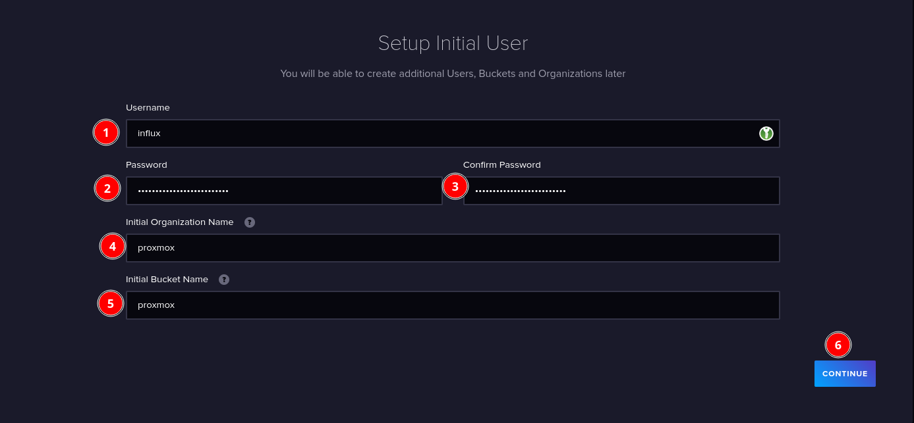{: .normal} 

Quand vous avez cliqué sur Continue, vous aurez en retour une clé, très importante, notez-là quelque part, nous en aurons besoin un peu plus tard, une fois la clé notée cliquez sur QUICK START:

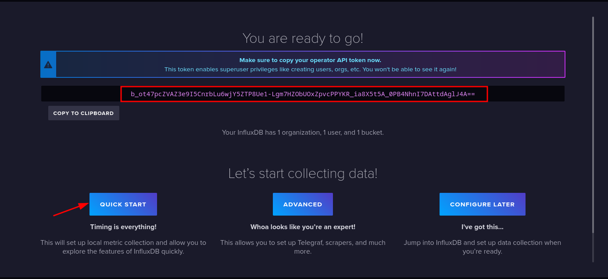{: .normal} 

On arrive sur le tableau de bord

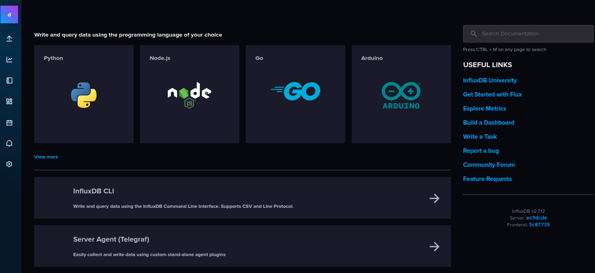{: .normal} 

### Opérations sur Proxmox

https://belginux.com/proxmox-grafana-influxdb/
Ouvrir proxmox sur Centre de données  
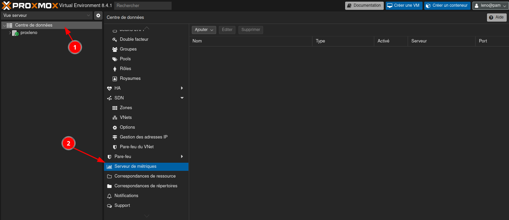{: .normal} 

Cliquez sur **Ajouter**, sélectionnez **InfluxDB**. Une fenêtre va s'ouvrir:  
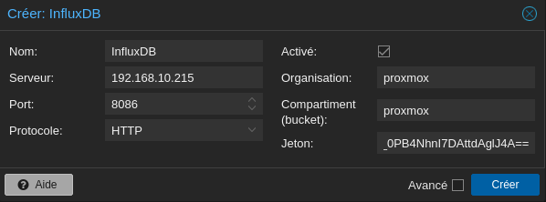{:width="500" .normal} 


*    Nom: => Nommez cette entrée **InfluxDB**.
*    Serveur: => Indiquez l'ip du serveur ou se trouve InfluxDB. **192.168.10.215**
*    Port: => 8086, sauf si vous l'avez changé.
*    Protocole: => HTTP.
*    Enabled: => Cochez-le si ce n'est déjà fait.
*    Organisation: => Indiquez le nom de l'organisation que vous avez choisi plus haut. **proxmox**
*    Bucket: => Indiquez le nom du Bucket que vous avez choisi plus haut. **proxmox**
*    Jeton: => Ah, enfin, collez le token reçu précédemment. Gardez-le toujours bien précieusement pour la suite.

Cliquer sur **Créer**   
*Fin des Opérations sur Proxmox*  

### Vérifier InfluxDB

*On a connecté InfluxDB à Proxmox, il faut vérifier que Proxmox envoie bien les données à InfluxDB.* 

Allez sur **Data Explorer**, ensuite cliquez sur **Proxmox**:

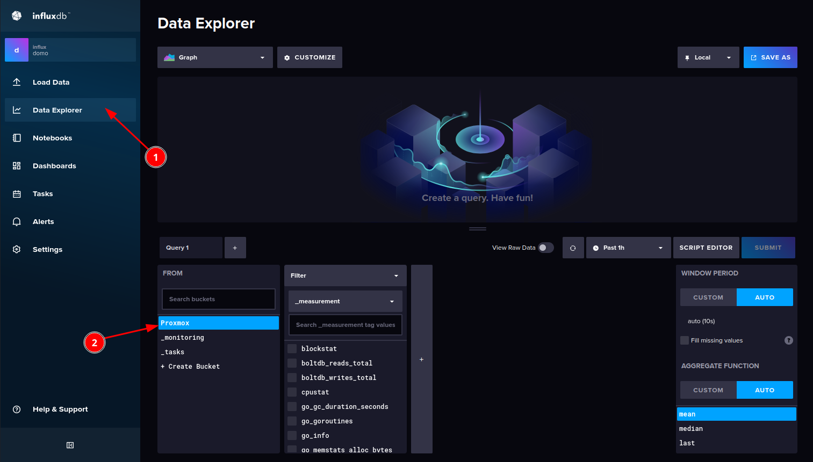{: .normal} 

Vous devriez voir en dessous de **_mesurement** tout un tas de paramètres.  
*Terminé pour InfluxDB*

### Configurer Grafana

Ajouter une nouvelle source de données InfluxDB à Grafana

Dans Grafana  
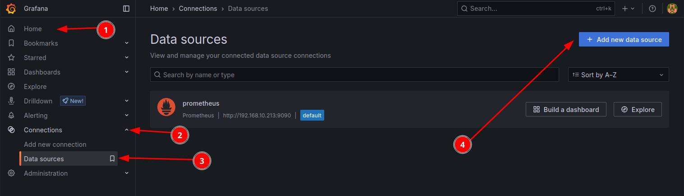{: .normal} 

Cliquez sur **InfluxDB**   
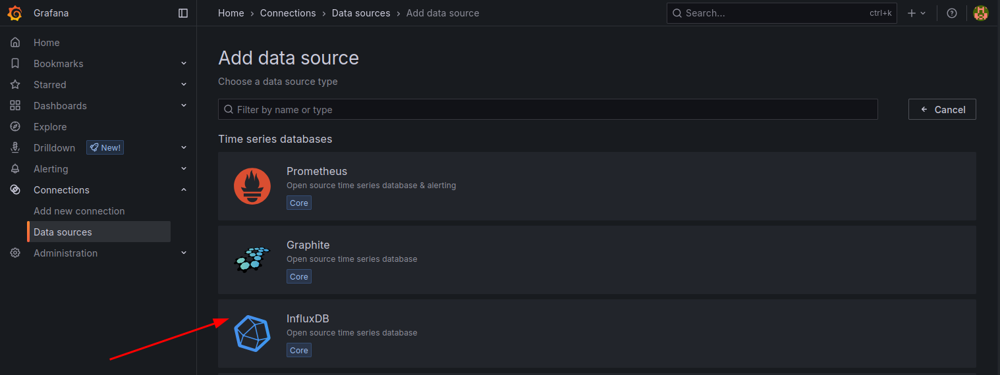{: .normal} 

Dans **Query language**, sélectionnez **Flux**  
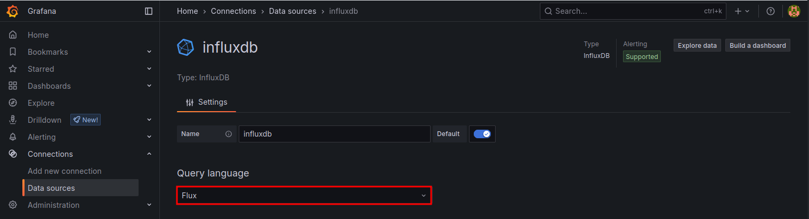{: .normal} 

Configurez ces quelques points dans la partie HTTP et Auth  
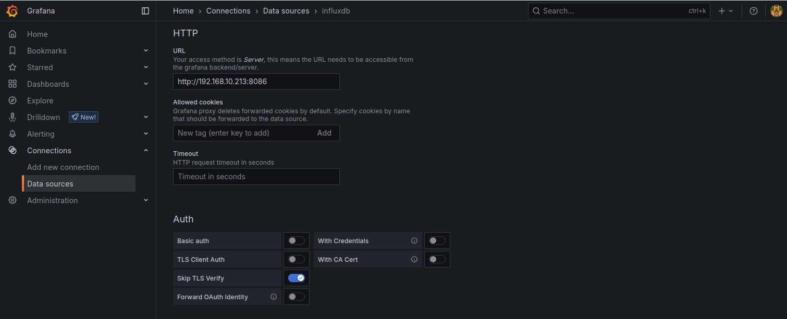{: .normal} 


*    URL => Indiquez http://192.168.10.215:8086 pour accès InfluxDB.
*    Basic auth => Si elle est cochée, décochez-là.
*    Skip TLS Verify => Cochez cette case.

Configurez ces quelques points dans la partie InfluxDB Details  
{: .normal} 

*    Organization => Indiquez le nom de votre organisation.
*    Token => Indiquez le token que vous avez mis de côté.

Cliquez sur **Save & test**. Cela devrait retourner un message vert  
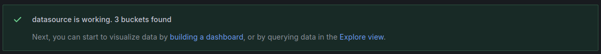{: .normal} 

Retournez sur **Home**, et cliquez sur **Dashboards**, **New** et **Import**  
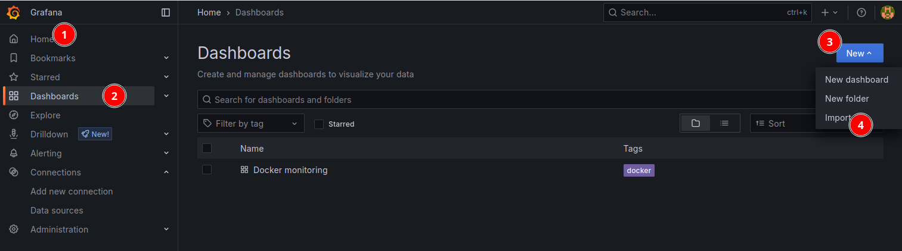{: .normal} 

Indiquez **15356** et cliquez sur **Load**:  
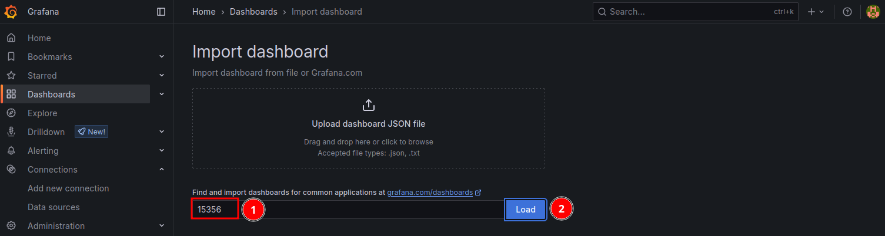{: .normal} 

Dans **Options**, **Name**, vous pouvez choisir le nom que vous voulez. N'oubliez pas dans le fond de sélectionnez l'InfluxDB data source;  
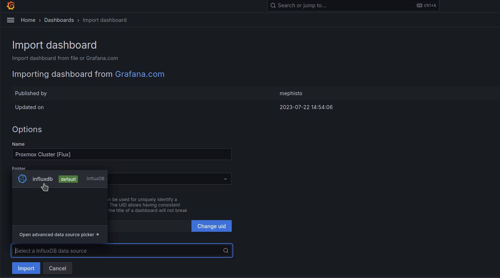{: .normal}   

Quand c'est terminé, cliquez sur Import:  
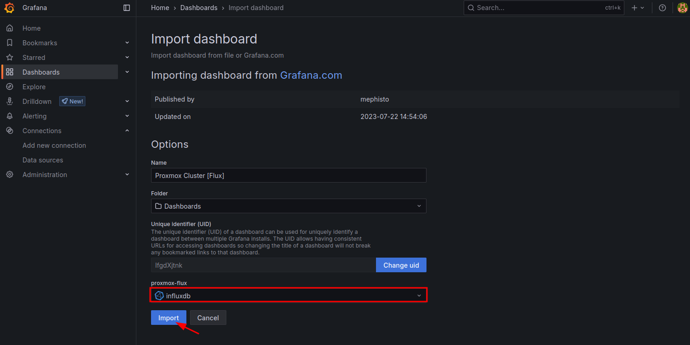{: .normal}   

Résultat  
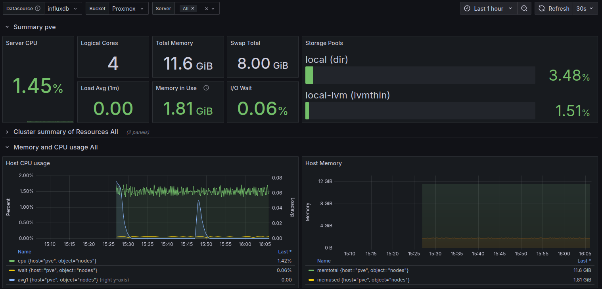{: .normal}   
