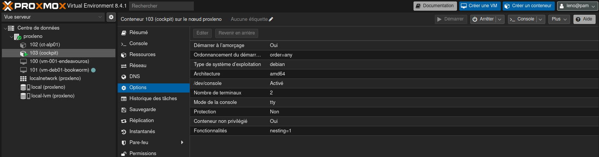
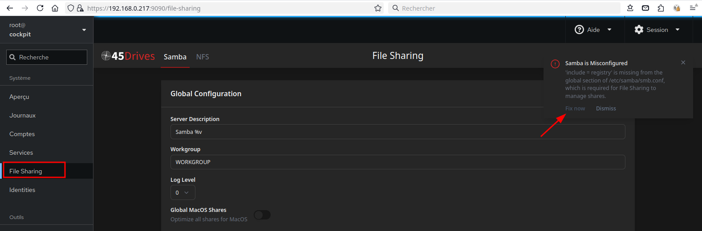
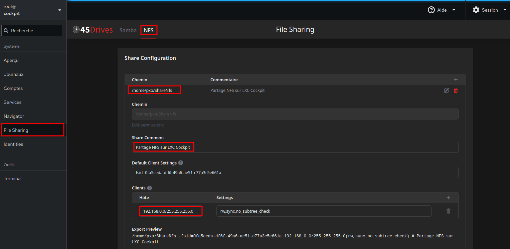

+++
title = 'Proxmox - Conteneur LXC Cockpit'
date = 2025-06-18
categories = ['debian']
+++
## Conteneur "cockpit"

### Conteneur modèle debian 12

Proxmox - Créer un conteneur avec le modèle debian 12

Hôte: cockpit  
Mot de passe: cockpit49

Réseau statique   
IPV4 : 192.168.0.217/24  
Passerelle: 192.168.0.205  
IPV6: fd97::/64  
Si on ne définit pas une adresse statique ipv6, pas d'accès en console

Démarrage à l'amorçage: Oui  

### Installation cockpit

Installer cockpit sur debian 12

```
apt update
apt install cockpit --no-install-recommends
```

Désactiver l'interdiction "root" dans `/etc/cockpit/disallowed-users` en supprimant la ligne

Connexion <https://192.168.0.217:9090/>, root/cockpit49

## Modules supplémentaires

Prérequis

```shell
apt install rsync zip unzip curl sudo nfs-kernel-server samba-common-bin make moreutils jq git
```

On désactive temporairement NFS

```shell
systemctl stop nfs-server
systemctl disable nfs-server
```

Créer un utilisateur

```shell
useradd -m pxo -s /bin/bash
passwd pxo # pxo49
echo "pxo     ALL=(ALL) NOPASSWD: ALL" >> /etc/sudoers
```

Installer yarn

```shell
curl -sS https://dl.yarnpkg.com/debian/pubkey.gpg | sudo apt-key add -
echo "deb https://dl.yarnpkg.com/debian/ stable main" | sudo tee /etc/apt/sources.list.d/yarn.list
sudo apt update
# correction erreur
cd /etc/apt
sudo cp trusted.gpg trusted.gpg.d
#
sudo apt update
sudo apt install yarn -y
```

### cockpit-file-sharing

Installer **cockpit-file-sharing** (<https://github.com/45Drives/cockpit-file-sharing>)

```shell
git clone https://github.com/45Drives/cockpit-file-sharing.git
cd cockpit-file-sharing
make
sudo make install
```

### cockpit-identities

Installer **cockpit-identities** (<https://github.com/45drives/cockpit-identities>)

```shell
curl -LO https://github.com/45Drives/cockpit-identities/releases/download/v0.1.12/cockpit-identities_0.1.12_generic.zip
unzip cockpit-identities_0.1.12_generic.zip
cd cockpit-identities_0.1.12_generic
# no need to run `make` first, the plugin is pre-built
sudo make install
```

### cockpit-navigator

Installer **cockpit-navigator** <https://github.com/45Drives/cockpit-navigator>

```shell
git clone https://github.com/45Drives/cockpit-navigator.git
cd cockpit-navigator
sudo make install
```

Redémarrer le conteneur LXC cockpit

## Web cockpit.home.arpa

Se connecter <https://192.168.0.217:9090/>

   
 au conteneur "cockpit"

### Serveur cwwk

Créer un domaine local unbound cockpit.home.arpa , certificats et proxy nginx

**Domaine local** cockpit.home.arpa , `/etc/unbound/unbound.conf.d/local-unbound.conf`

```
server:
    # Adresse privée 
    access-control: 192.168.0.0/16 allow
    access-control: 192.168.10.0/16 allow
    access-control: 192.168.70.0/16 allow
    #
    local-zone: "home.arpa." transparent
    #local-zone: "home.arpa." static
    # IPv4
    local-data: "cwwk.home.arpa.  86400 IN A 192.168.0.205"
    local-data: "pve.home.arpa.  86400 IN A 192.168.0.205"
    local-data: "cockpit.home.arpa.  86400 IN A 192.168.0.205"
    local-data: "alp01.home.arpa. 86400 IN A 192.168.10.210"
    # IPv6
    local-data: "cwwk.home.arpa.  86400 IN AAAA 2a01:e0a:9c8:2080:aab8:e0ff:fe04:ec45"
    local-data: "pve.home.arpa.  86400 IN AAAA 2a01:e0a:9c8:2080:aab8:e0ff:fe04:ec45"
    # On ajoute les enregistrements PTR
    # PTR IPv4
    local-data-ptr: "192.168.0.205  86400 cwwk.home.arpa."
    local-data-ptr: "192.168.0.205  86400 pve.home.arpa."
    local-data-ptr: "192.168.0.205  86400 cockpit.home.arpa."
    local-data-ptr: "192.168.10.210 86400 alp01.home.arpa."
    # PTR IPv6
    local-data-ptr: "2a01:e0a:9c8:2080:aab8:e0ff:fe04:ec45  86400 cwwk.home.arpa."
    local-data-ptr: "2a01:e0a:9c8:2080:aab8:e0ff:fe04:ec45  86400 pve.home.arpa."
```

Redémarrer unbound

    sudo systemctl restart unbound

**Certificats**, `./gencert.sh cockpit.home.arpa`

```shell
# copier
sudo cp cockpit.home.arpa.crt /etc/ssl/private/
# déplacer
mv cockpit.home.arpa.* sharenfs/rnmkcy/cwwk/home/yick/CA/
```

**Proxy Nginx** `/etc/nginx/conf.d/cockpit.home.arpa.conf`

```
server {
    # ipv4 listening port/protocol
    listen       443 ssl http2;
    # ipv6 listening port/protocol
    listen           [::]:443 ssl http2;
    server_name  cockpit.home.arpa;

    ssl_certificate      /etc/ssl/private/cockpit.home.arpa.crt;
    ssl_certificate_key  /etc/ssl/private/cockpit.home.arpa.key;

   location / {
    proxy_pass https://192.168.0.217:9090;
    proxy_set_header Host $host;
    proxy_set_header X-Real-IP $remote_addr;
    proxy_set_header X-Forwarded-For $proxy_add_x_forwarded_for;
    proxy_set_header X-Forwarded-Proto $scheme;
    proxy_http_version 1.1;
    proxy_set_header Upgrade $http_upgrade;
    proxy_set_header Connection "Upgrade";
   }

}
```

Recharger nginx

    sudo systemctl reload nginx

### PC1 

En cas d'utilisation d'un VPN, il faut ajouter le domaine local au fichier `/etc/hosts`

```
192.168.0.205 cwwk.home.arpa pve.home.arpa cockpit.home.arpa
```

Icône de lancement su EndeavourOS: `.local/share/applications/cockpi.home.arpa.desktop`

```
[Desktop Entry]
Version=1.0
Type=Application
Exec=/usr/lib/firefox/firefox "https://cockpit.home.arpa"
Terminal=false
X-MultipleArgs=false
Icon=firefox-trunk
Categories=GNOME;GTK;Network;WebBrowser;
MimeType=application/json;application/pdf;application/rdf+xml;application/rss+xml;application/x-xpinstall;application/xhtml+xml;application/xml;audio/flac;audio/ogg;audio/webm;image/avif;image/gif;image/jpeg;image/png;image/svg+xml;image/webp;text/html;text/xml;video/ogg;video/webm;x-scheme-handler/chrome;x-scheme-handler/http;x-scheme-handler/https;x-scheme-handler/mailto;
StartupNotify=true
Actions=new-window;new-private-window;open-profile-manager;
Name=cockpit (home.arpa)
Comment=
Path=
```

### File Sharing - NFS

  
Correction erreur  

  
Créer un partage NFS 

Clic sur "Export" pour avoir les instrutions pour le client NFS

```
/home/pxo/ShareNfs -fsid=0fa5ceda-df6f-49a6-ae51-c77a3c5e661a 192.168.0.0/255.255.255.0(rw,sync,no_subtree_check) # Partage NFS sur LXC Cockpit
```

### Console conteneur cockpit

Connexion console: pxo/pxo49

Créer un jeu de clé SSH pour la machine cwwk

```shell
mkdir -p $HOME/.ssh
ssh-keygen -t ed25519 -o -a 100 -f ~/.ssh/cwwk-ed25519
```

Machine cwwk - Ajouter la clé publique

```shell
echo "ssh-ed25519 AAAAC3NzaC1lZDI1NTE5AAAAIFB4Nnixds1UaWotH1HKKJ3D+OE+5j8Wroq41V9q16l4 pxo@cockpit" >> $HOME/.ssh/authorized_keys
```


Console conteneur cockpit

```
ssh yick@192.168.0.205 -p 55205 -i /home/pxo/.ssh/cwwk-ed25519
```

*Procéder comme précédemment pour les autres serveurs*

### Connexion SSH depuis PC1

Se connecter au LXC cockpit via SSH

* adresse IP: 192.168.0.217
* Port: 55217

PC1 - Générer un jeu de clés ed25519 cockpit-lxc

```shell
ssh-keygen -t ed25519 -o -a 100 -f ~/.ssh/cockpit-lxc
```

Proxmox LXC cockpit - Ajouter au fichier .ssh/authorized_keys, la clé publique générer par PC1

```shell
echo "ssh-ed25519 AAAAC3NzaC1lZDI1NTE5AAAAIDxAEvkTt+NtegsHHf9TAq61HArcWlP2MCJvIRGKCCXX yann@PC1" >> $HOME/.ssh/authorized_keys
```

Paramétrer le fichier `/etc/ssh/sshd_config.d/cockpit-lxc.conf`

```
PermitRootLogin no
PubkeyAuthentication yes
AuthorizedKeysFile      %h/.ssh/authorized_keys
PasswordAuthentication no
ChallengeResponseAuthentication yes
PermitEmptyPasswords no
```

Redémarrer le serveur SSH

```shell
sudo systemctl restart sshd
```

Connexion

```
ssh -i .ssh/cockpit-lxc pxo@192.168.0.217
```


### Web-Cockpit Ajout clés SSH

Sur le web cockpit: Session --> Clés SSH --> Ajouter une clé

