+++
title = 'Proxmox - Conteneur LXC Home Assistant'
date = 2025-06-18
categories = ['application']
+++
*Home Assistant est un projet de l'Open Home Foundation qui vous permet de créer une maison plus privée, plus puissante et plus durable. Apprenez comment installer, embarquer, modifier, intégrer, automatiser et rejoindre la communauté des utilisateurs de Home Assistant.*  

## Home Assistant (HA)

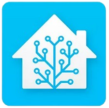{:width="80"}  
[Installer Home Assistant OS avec Proxmox (VM)](https://www.hacf.fr/ha_installation_haos_vm/)

* [Home Assistant : Installation en un clic sur Proxmox](https://www.cachem.fr/home-assistant-installation-proxmox/)
* [DIY – Piloter un volet solaire Velux avec Home Assistant](https://www.cachem.fr/volet-velux-home-assistant/)
* [DIY : Boîte aux lettres connecté avec Lora2HA et Home Assistant](https://www.cachem.fr/diy-boite-lettres-lora2ha-ha/)
* [Home Assistant : Piloter sa maison avec un écran](https://www.cachem.fr/home-assistant-ecran/)
* [Home Assistant : DIY piloter ses portes de garage ou de portail avec un ESP32-POE](https://www.cachem.fr/home-assistant-diy-portes-garage-portail-esp32-poe/)
* [Home Assistant : Piloter ses volets électrique](https://www.cachem.fr/home-assistant-piloter-ses-volets-electrique/)
* [Home Assistant : Piloter son chauffage](https://www.cachem.fr/home-assistant-chauffage/)
* [Home Assistant / Proxmox : Sauvegarde automatique et snapshot](https://www.cachem.fr/home-assistant-sauvegarde-snapshot/)
* [Home Assistant : Protocole Zigbee avec la clé SkyConnect](https://www.cachem.fr/home-assistant-zigbee-skyconnect/)
* [Intégrer son compteur électrique ( téléinfo ) dans Home Assistant](https://haade.fr/fr/blog/integrer-son-compteur-electrique-teleinfo-dans-home-assistant)

### Connexion shell promox

<https://192.168.0.235:8006>  
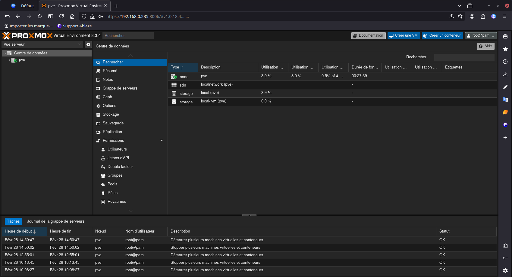  
Connexion shell: pve --> Shell  
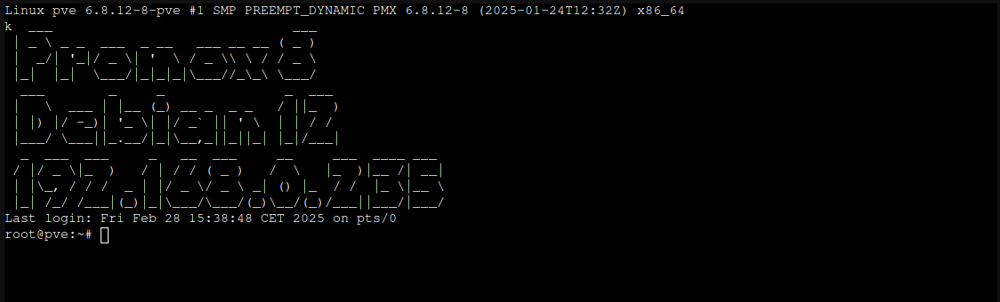 

### Home Assistant promox

Aller sur le site <https://community-scripts.github.io/ProxmoxVE/scripts?id=homeassistant>.  
Sélectionner ,à gauche, "Home Assistant VM"
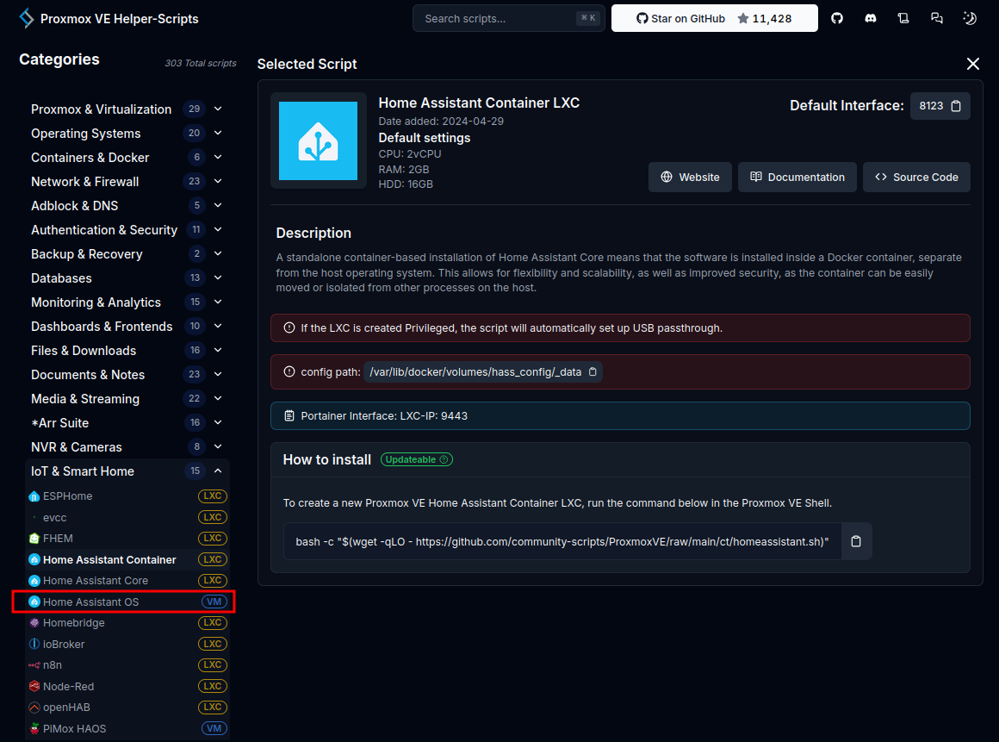   
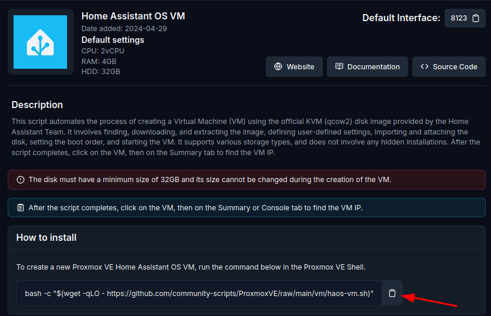   
copier/coller du script bash à exécuter dans le shell et répondre aux différentes questions et patienter...  
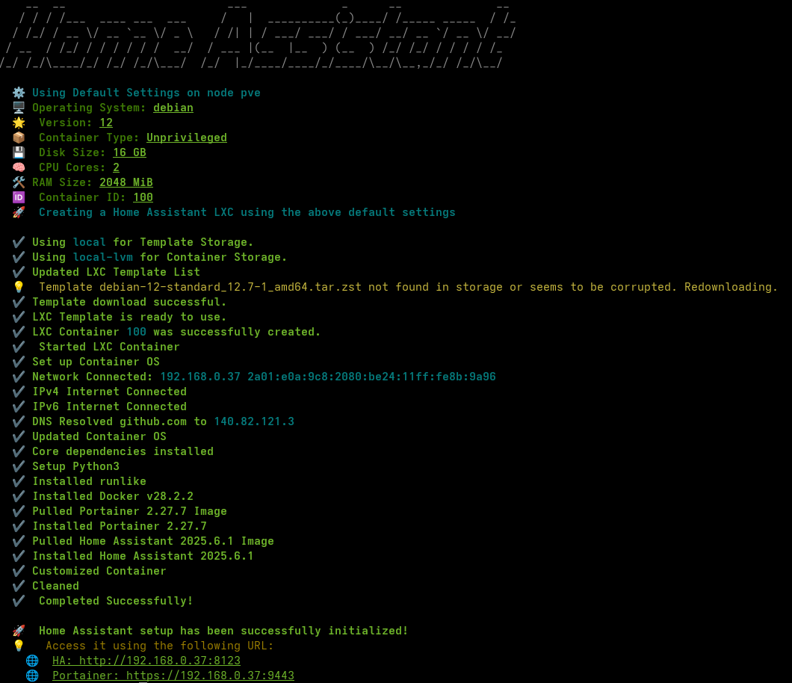{: .normal}

Résumé, une fois l’installation terminée  
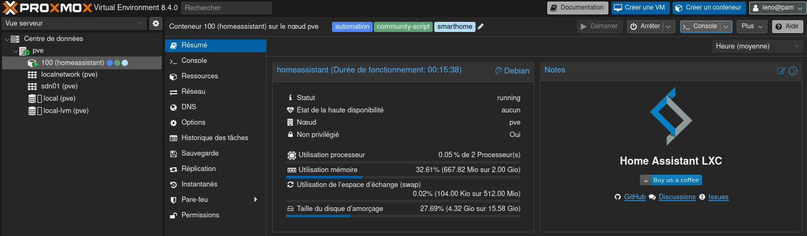{: .normal}  

Vous devez voir une machine virtuelle qui doit être créée. Cliquer sur cette machine virtuelle, vous pouvez soit consulter la page de résumé, soit accéder au Shell de la machine virtuelle (VM).   
Dans les deux cas, récupérer l’adresse IP de la VM qui est celle de votre Home Assistant.  
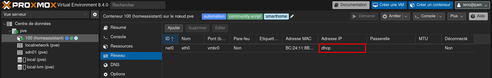  
Adresse IP: 192.168.0.37 (DHCP)  

Configurer en adresse IP statique 192.168.0.236   
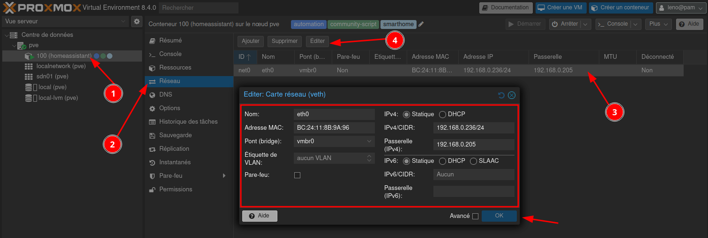{: .normal}  
Puis "Redémarrer"

Il vous suffit de saisir cette adresse 192.168.0.236, suivie du port 8123 pour accéder au premier lancement de Home Assistant

### Configuration HA

[Premier lancement et configuration de Home Assistant](https://www.hacf.fr/ha_installation_premier_lancement/)

Se connecter à  Home Assistant <http://192.168.0.236:8123>  
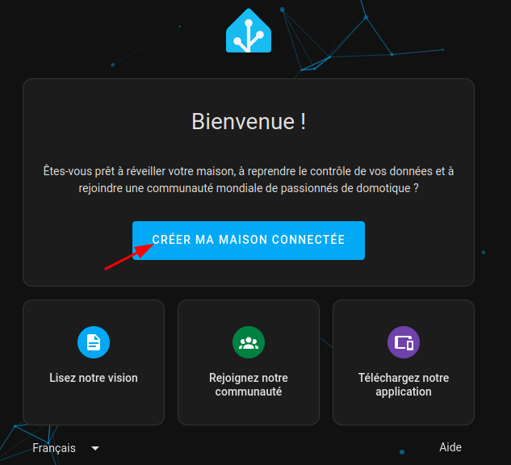{:width="400"}

Sur la première page.  
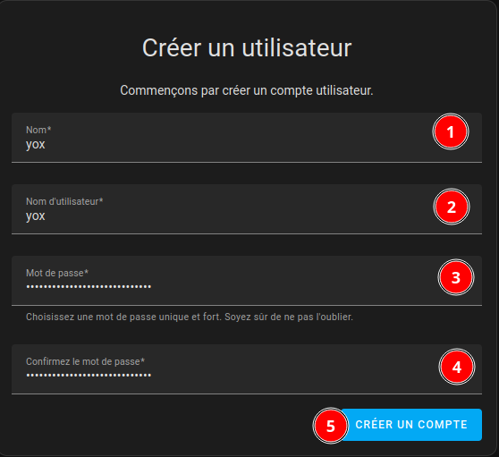{:width="400"}  
**yox**:  utilisateur avec tous les droits

La seconde page concerne votre domicile.  
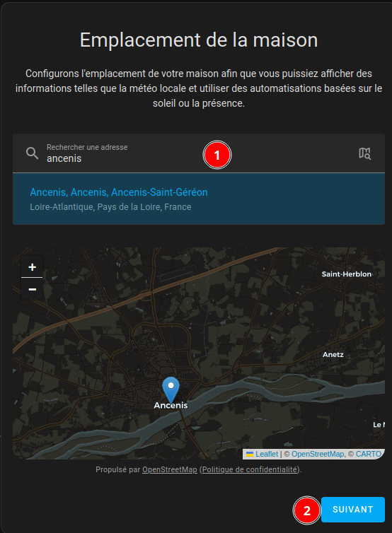{:width="400"}  

Aide (aucune autorisation)  
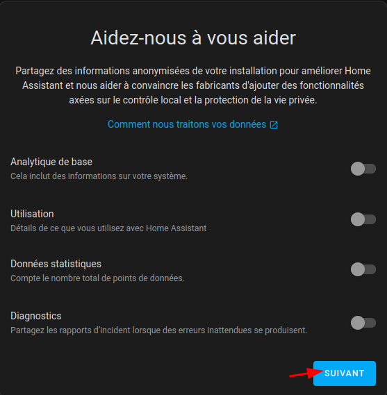{:width="400"}  

Appareils compatibles  
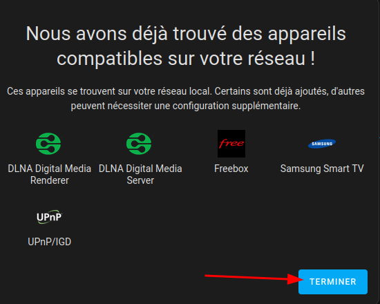{:width="400"}  
 
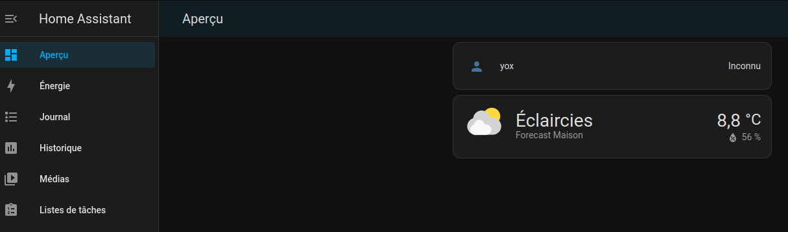

## Périphériques

### Connecter un périphérique USB

Pour connecter un périphérique USB sur le Serveur Proxmox :  
Dans la barre verticale de gauche, choisissez la VM sur laquelle vous voulez affecter votre clé USB 

*    Aller dans matériel,
*    Ajouter,
*    Périphérique USB,
*    Utiliser les identifiants USB du fabricant et du périphérique,
*    Choisir le périphérique à inclure.

Cette opération est à faire autant de fois qu’il y a de clé à inclure

### Clé USB z-wave.me UZB

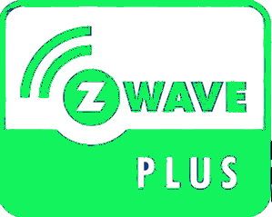{:width="50"}  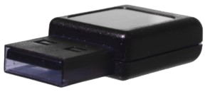{:width="100"}  
<https://z-wave.me>  

#### Configurer la clé USB Z-Wave sur Home Assistant

[Configurer la clé USB Z-Wave sur Home Assistant](https://apical.xyz/fiches/home_assistant/configurer_la_cle_usb_z-wave_sur_home_assistant)

La clé z-wave est identifiée:  
`Bus 001 Device 010: ID 0658:0200 Sigma Designs, Inc. Aeotec Z-Stick Gen5 (ZW090) - UZB`

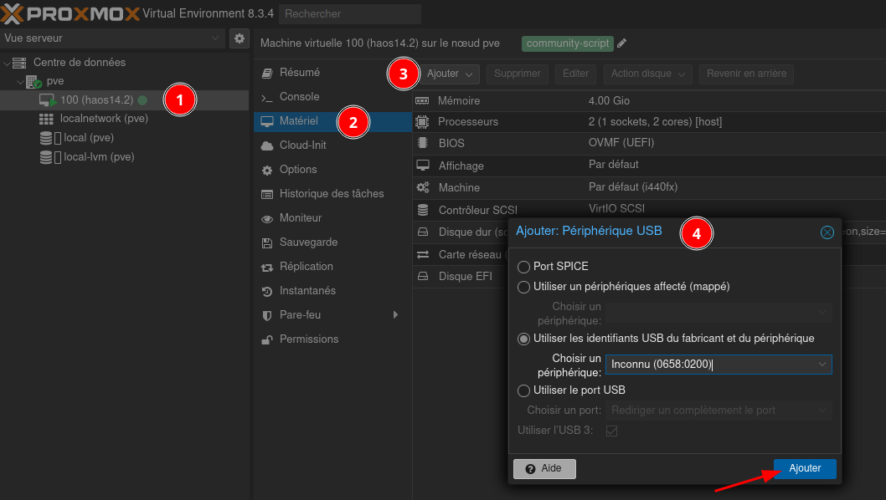  

Avant d'ajouter des périphériques Z-Wave à votre boîte domotique Home Assistant, vous devez configurer la clé USB Z-Wave.

Aller dans le menu Paramètres --> Appareils et services   onglet Intégrations  
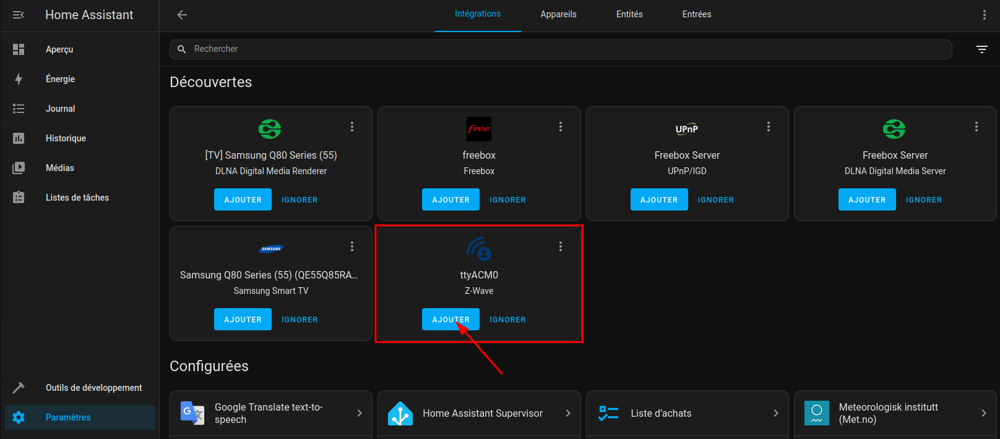   
Si la clé USB Z-Wave est correctement reconnue par le système, l'écran vous présentera l'intégration Z-Wave

Une fois que vous avez la tuile Z-Wave à l'écran, cliquez sur **AJOUTER**  
Après installation, zwave est configuré  
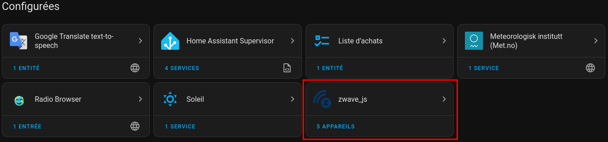   

### Sensative strips+

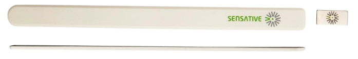{:width="400"}   
<https://sensative.com/sensors/strips-zwave/zwave-resource-center/guard/>

Votre Strips est livré en mode ajout automatique.    
Strips est un capteur magnétique qui peut être ajouté à n’importe quel système certifié Z-Wave et fonctionner avec tout appareil Z-Wave.  

*Z-Wave est un standard international pour les communications sans fil*   

[Ajouter un appareil connecté Z-Wave à Home Assistant](https://apical.xyz/fiches/home_assistant/ajouter_un_appareil_connecte_z-wave_a_home_assistant)

Pour inclure l'appareil dans Home Assistant, rendez-vous dans le panneau de contrôle Z-Wave : **Paramètres --> Appareils et services** et cliquez sur la tuile **Z-Wave**  
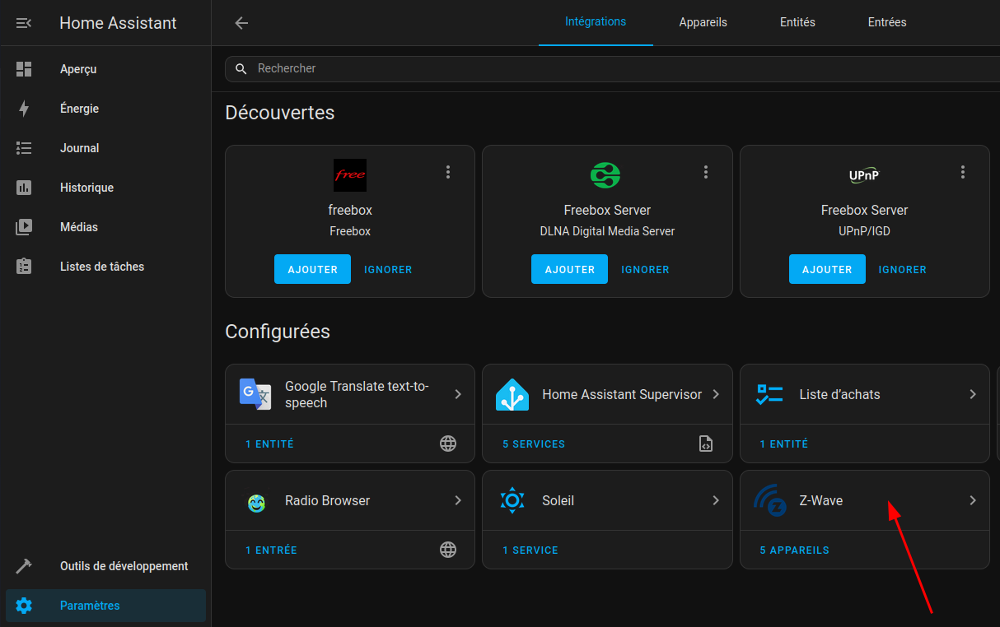   
Dans l'écran suivant, cliquez sur **Configurer**  
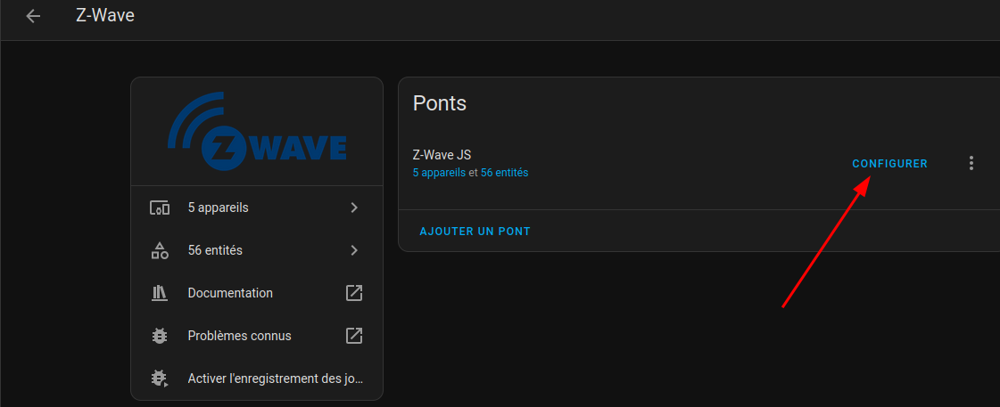    
Cliquer sur **Ajouter un appareil** au bas de l'écran  
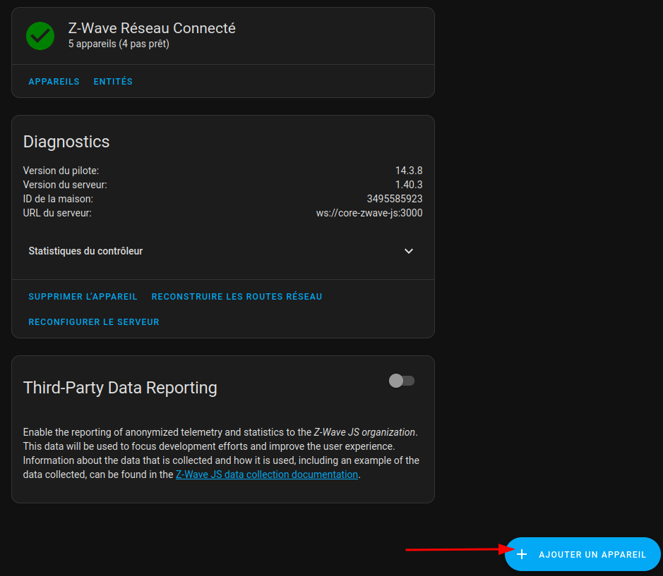   

J-Wave JS commencera la recherche d'appareils. Par défaut, il tentera de faire l'ajout en mode sécurisé et basculera automatiquement en mode non sécurisé si l'appareil ne le supporte pas. Si vous désirez modifier ce comportement, cliquez sur Comment voulez-vous ajouter votre appareil.   
   

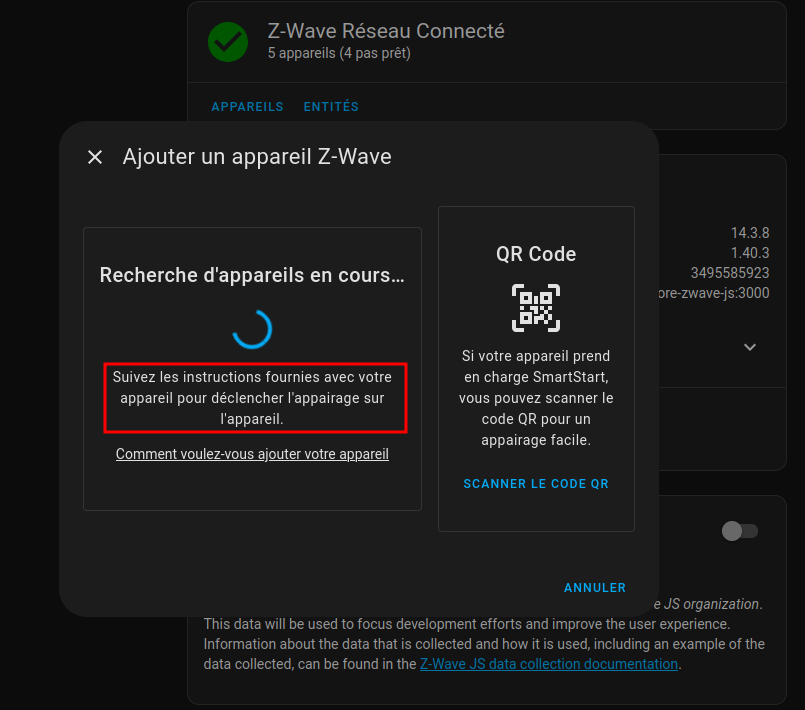   
