+++
title = 'Proxmox - Conteneur LXC Eleventy-Chirpy'
date = 2025-06-25
categories = ['debian']
+++
*Proxmox : Installation de Debian en container LXC*

## Proxmox LXC

### Installation environnement DEBIAN

Cliquer sur le bouton "Créer un conteneur"  
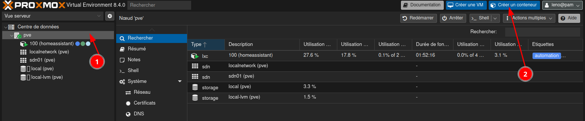

Le CT ID est le numéro de votre VM ou Container, et le hostname, le nom que vous allez lui donner:  **eleventy**.   
Saisir également le mot de passe root: **eleventy49600**  
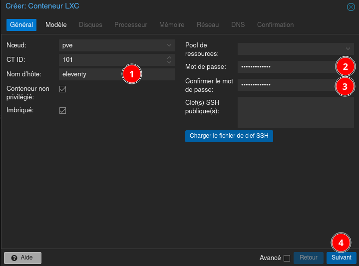{:width="500" .normal}

Choisissez la template dont vous avez besoin. Dans notre cas, debian-12-standard  
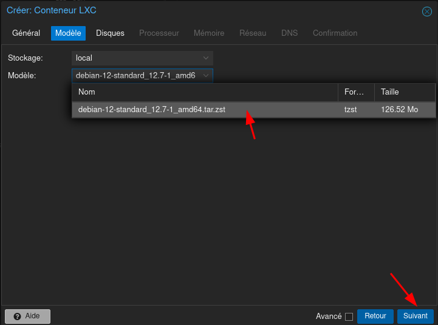{:width="500" .normal}

Définissez la taille du disque dur et son emplacement  
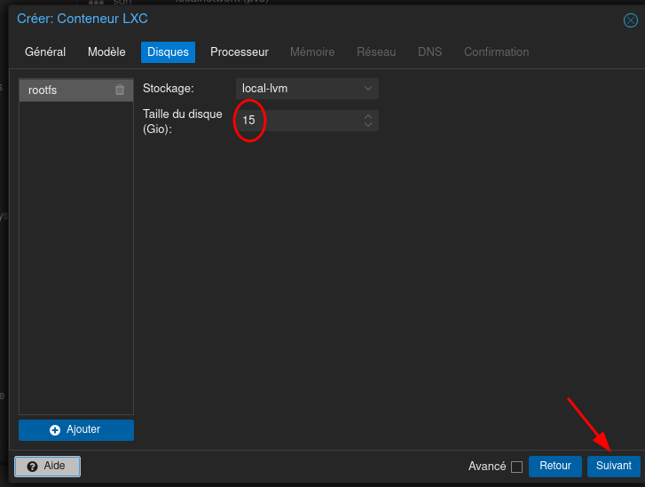{:width="500" .normal}

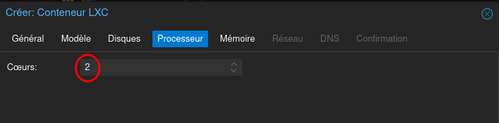{:width="500" .normal}

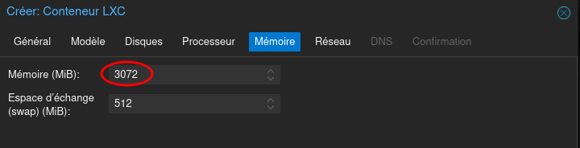{:width="500" .normal}

Le réseau  
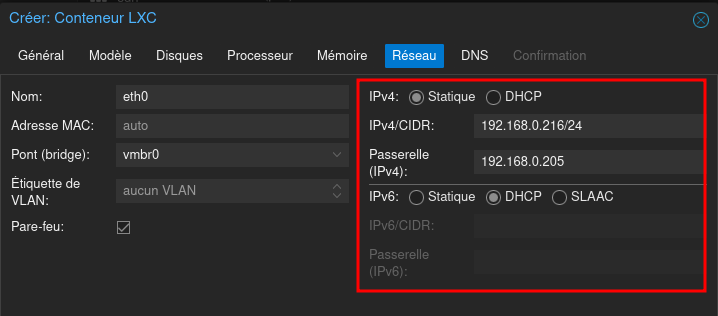{:width="500" .normal}

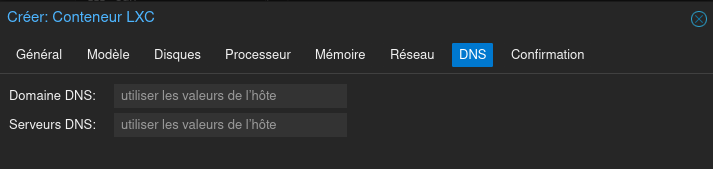{:width="500" .normal}

Récapitulatif  
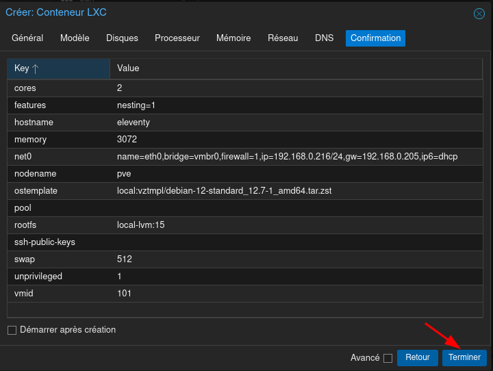{:width="500" .normal}

Résultat  
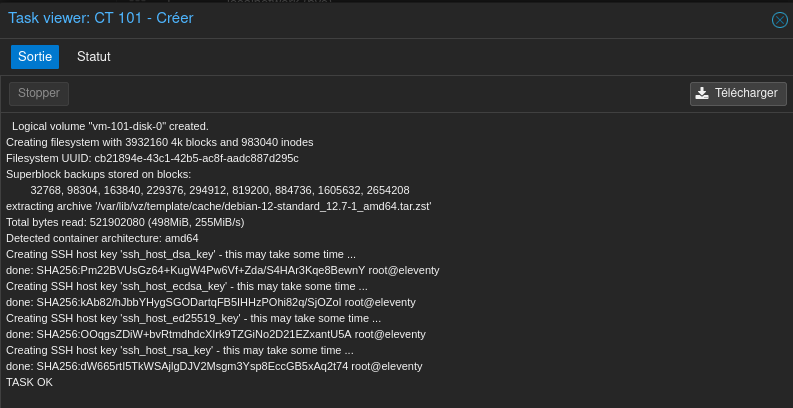{:width="500" .normal}

Démarrer le conteneur LXC  
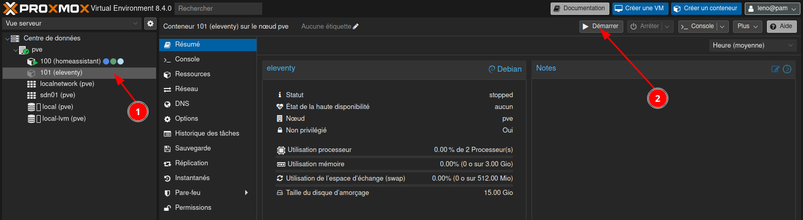

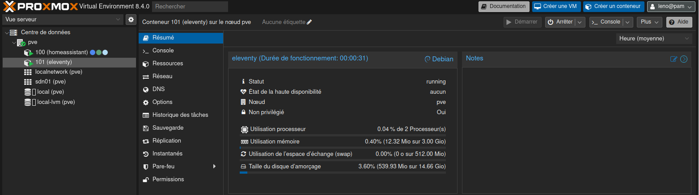

### Conteneur Debian

Se connecter en root via console novnc  
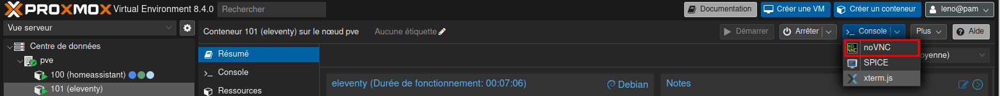

Mise à jour

```shell
apt update && apt upgrade -y
```

Des outils

```shell
apt install curl sudo jq figlet git
```

Motd

```shell
rm /etc/motd && nano /etc/motd
```

```
 _    __  ______   ____       _     _               _ ____  
| |   \ \/ / ___| |  _ \  ___| |__ (_) __ _ _ __   / |___ \ 
| |    \  / |     | | | |/ _ \ '_ \| |/ _` | '_ \  | | __) |
| |___ /  \ |___  | |_| |  __/ |_) | | (_| | | | | | |/ __/ 
|_____/_/\_\____| |____/ \___|_.__/|_|\__,_|_| |_| |_|_____|
 _  ___ ____    _  __    ___   ___   ____  _  __            
/ |/ _ \___ \  / |/ /_  ( _ ) / _ \ |___ \/ |/ /_           
| | (_) |__) | | | '_ \ / _ \| | | |  __) | | '_ \          
| |\__, / __/ _| | (_) | (_) | |_| | / __/| | (_) |         
|_|  /_/_____(_)_|\___/ \___(_)___(_)_____|_|\___/          
      _                      _                              
  ___| | _____   _____ _ __ | |_ _   _                      
 / _ \ |/ _ \ \ / / _ \ '_ \| __| | | |                     
|  __/ |  __/\ V /  __/ | | | |_| |_| |                     
 \___|_|\___| \_/ \___|_| |_|\__|\__, |                     
                                 |___/                      
```

Créer un utilisateur nommé **eleven**

```shell
adduser eleven  # mot de passe : eleven49600
```

Donner tous les droits

```shell
echo "eleven     ALL=(ALL) NOPASSWD: ALL" >> /etc/sudoers.d/eleven
```

**OpenSSH**  

1. Créer un jeu de clé sur PC1 et modifier les droits: 
    2. `ssh-keygen -t ed25519 -o -a 100 -f ~/.ssh/eleventy`
    3. `chmod 600 ~/.ssh/eleventy*`
2. Envoyer la clé publique: `ssh-copy-id -i ~/.ssh/eleventy.pub eleven@192.168.0.216`
3. Modifier le fichier `/etc/ssh/sshd_config` 
    4. `Port 55216`  
    5. `PasswordAuthentication no`
4. Redémarrer le serveur ssh: `systemctl restart sshd`  

Se connecter via SSH depuis PC1

```shell
ssh -p 55216 -i ~/.ssh/eleventy eleven@192.168.0.216
```

## eleventy-chirpy-blog-template

### Volta - Gestionnaire outils JavaScript 

Le dépôt utilise Volta

```shell
# install Volta
curl https://get.volta.sh | bash
```

Sortie puis reconnexion  
Installer node

```shell
# install Node
volta install node
```

### Installer eleventy-chirpy

Cloner le dépôt  

```shell
git clone https://gitea.rnmkcy.eu/yann/eleventy-chirpy-blog-template.git
```

Aller dans le répertoire

```
cd ~/eleventy-chirpy-blog-template
```

Installez les dépendances. Remarque, si vous préférez `npm` à `yarn` assurez-vous d'abord de supprimer le fichier `yarn.lock`, puis exécutez `npm install`.

```shell
yarn install
```

Résultat de la commande 

```
yarn install v1.22.10
[1/4] Resolving packages...
[2/4] Fetching packages...
info fsevents@2.3.2: The platform "linux" is incompatible with this module.
info "fsevents@2.3.2" is an optional dependency and failed compatibility check. Excluding it from installation.
[3/4] Linking dependencies...
[4/4] Building fresh packages...
warning Your current version of Yarn is out of date. The latest version is "1.22.22", while you're on "1.22.10".
info To upgrade, run the following command:
$ curl --compressed -o- -L https://yarnpkg.com/install.sh | bash
Done in 24.94s.
```

Démarrer le processus de développement local

```shell
yarn dev
```

Résultat de la commande

```
[dev:eleventy] Writing _site/posts/2021/random-post/index.html from ./content/posts/2021/random-post.md.
[dev:eleventy] Benchmark (Configuration): "addHash" Nunjucks Filter took 456ms (8.2%, called 112×, 4.1ms each)
[dev:eleventy] Copied 22 files / Wrote 11 files in 5.55 seconds (504.5ms each, v0.12.1)
[dev:eleventy] You saved while Eleventy was running, let’s run again. (1 remain)
[dev:eleventy] Writing _site/robots.txt from ./content/utils/robots.njk.
[dev:eleventy] Writing _site/blog.rss from ./content/utils/rss.njk.
[dev:eleventy] Writing _site/sitemap.xml from ./content/utils/sitemap.njk.
[dev:eleventy] [Browsersync] Reloading files that match: *.css
[dev:eleventy] Writing _site/archive/index.html from ./content/archive.njk.
[dev:eleventy] Writing _site/index.html from ./content/index.njk.
[dev:eleventy] Writing _site/404.html from ./content/utils/404.njk.
[dev:eleventy] Writing _site/who/index.html from ./content/who/index.md.
[dev:eleventy] Writing _site/why/index.html from ./content/why/index.md.
[dev:eleventy] Writing _site/posts/2021/main-post/index.html from ./content/posts/2021/main-post.md.
[dev:eleventy] Writing _site/posts/2021/random-post/index.html from ./content/posts/2021/random-post.md.
[dev:eleventy] Writing _site/posts/2021/another-random-post/index.html from ./content/posts/2021/another-random-post.md.
[dev:eleventy] Copied 22 files / Wrote 11 files in 0.68 seconds (61.8ms each, v0.12.1)
[dev:eleventy] Watching...
[dev:eleventy] [Browsersync] Reloading files that match: *.css
```

Ouvrir la page <http://localhost:8080>  

En utilisant la redirection sur PC1

```
ssh -L 9500:127.0.0.1:8080 -p 55216 -i ~/.ssh/eleventy eleven@192.168.0.216
```

PC1: <http://localhost:9500>
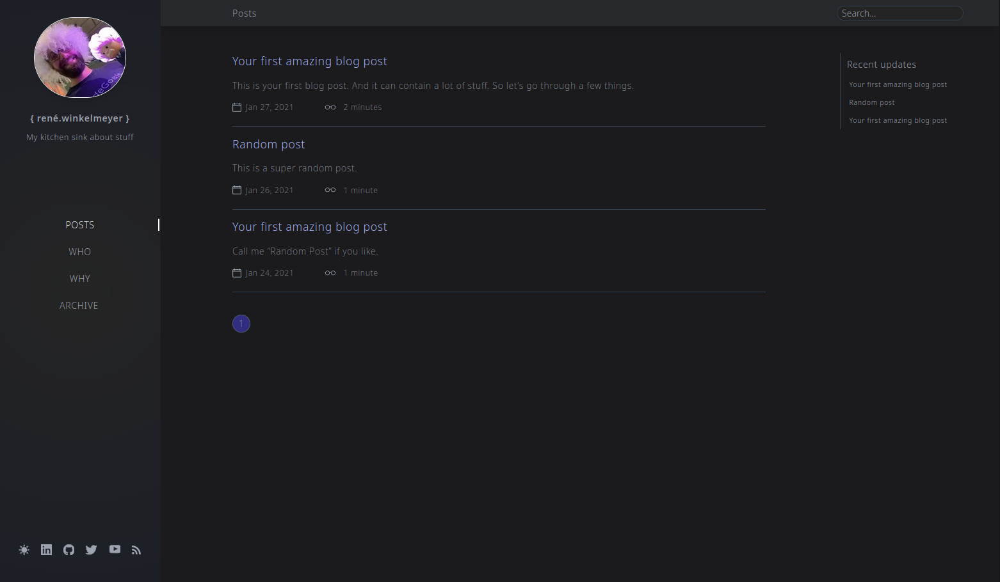


## Configuration

Toute la configuration du blog est gérée via [`siteconfig.js`](./content/_data/siteconfig.js). Tout est documenté en ligne.


