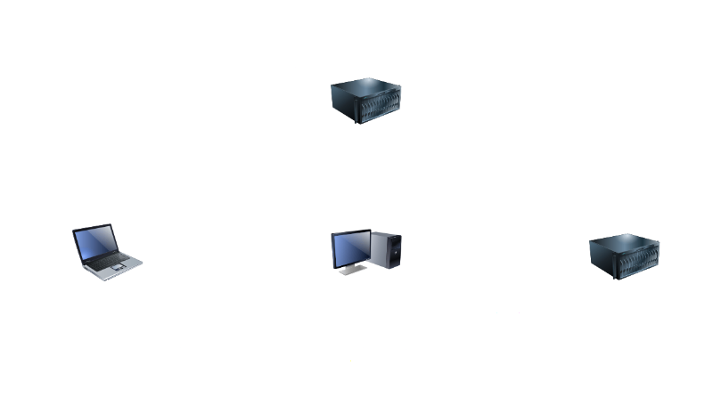

+++
title = 'Nebula est un outil pour interconnecter de manière transparente des ordinateurs'
date = 2025-07-22
categories = ['network']
+++
*[Nebula](https://github.com/slackhq/nebula) est un outil de réseau superposé évolutif axé sur les performances, la simplicité et la sécurité. Il vous permet de connecter de manière transparente des ordinateurs partout dans le monde. Nebula est portable et fonctionne sous Linux, OSX, Windows, iOS et Android.*

## Nebula

{: .normal}

* Guide de démarrage rapide de Nebula ([Nebula Quick Start guide](https://nebula.defined.net/docs/guides/quick-start/))
* [Set up a minimal nebula overlay network](https://www.megajason.com/2024/06/04/set-up-a-minimal-nebula-overlay-network/)
* [Setting Up a Nebula Overlay Network with Syncthing ](https://dongdongbh.tech/blog/nebula/)

Exécution du phare **"lighthouse"** sur un **VPS Webdock Debian 12**  
Clients, un ordinateur de bureau Arch, un portable laptop, serveur debian et un autre sur un téléphone Android 

{: .normal}

### Installation binaire

Installation sur archlinux 

    sudo pacman -S nebula

Liste des binaires <https://github.com/slackhq/nebula/releases/latest> pour les autres distributions  

>Binaire `nebula-linux-amd64.tar.gz` pour Debian 
{: .prompt-tip }

### Machines, clés et certificats

**Nebula** utilise PKI pour l'authentification sous la forme d'autorités de certification (CA).  
Les clients reçoivent la clé publique de l'autorité de certification, et leur propre paire de clés publique/privée signée par l'autorité de certification. Comme chaque client connaît l'autorité de certification, celle-ci peut facilement vérifier si le client est autorisé, et l'ajout de nouveaux clients ne nécessite pas de modifier les fichiers de configuration.

La première étape consiste à créer les fichiers `ca.key` et `ca.crt`, qui constituent les clés privées et publiques de votre **AC**. Veillez à ce que le fichier `ca.key` reste privé.  
Je recommande de stocker le fichier hors ligne, et de le traiter comme vous le feriez pour une clé privée SSH sur vos serveurs.

```script
# créer dossier
mkdir -p ~/media/devel/nebula
cd ~/media/devel/nebula
# Créer les fichiers ca.key et ca.crt
nebula-cert ca -name "Réseau Nebula Yan"
```

Avant de le verrouiller, nous avons besoin qu'il crée quelques **certificats clients**, 1 pour chaque client. Lors de la génération d'un certificat client, vous devez avoir décidé quel sous-réseau vous utiliserez pour le réseau VPN.   On va utiliser `10.19.55.0/24` 

>Phare lighthouse webdock  
nebula-cert sign -name "webdock" -ip "10.19.55.1/24"
{: .prompt-tip }

Cela créera un `lighthouse.crt` et un `lighthouse.key`, signés en utilisant votre **AC Nebula**.  
Ces fichiers devront ensuite être transférés en toute sécurité à votre client.  
Répétez ce processus pour chaque client que vous devez approvisionner, à l'exception des appareils mobiles - nous y reviendrons plus tard.

>PC1 endeavouros  
`nebula-cert sign -name "pc1" -ip "10.19.55.2/24"`  
Portable DELL Latitude e6230  
`nebula-cert sign -name "e6230" -ip "10.19.55.3/24" -groups "laptop,ssh"`  
Serveur debian cwwk rnmkcy.eu  
`nebula-cert sign -name "cwwk" -ip "10.19.55.4/24" -groups "servers"`  
Serveur debian contabo xoyize  
`nebula-cert sign -name "xoyize" -ip "10.19.55.5/24" -groups "servers"`  
  
Avec la configuration, le certificat et la clé, la dernière étape consiste à copier les fichiers appropriés à chaque hôte et à démarrer votre réseau Nebula.
{: .prompt-tip }


### Configuration Nebula

La configuration de Nebula, comme tout ce qui se passe dans le cloud, se fait à l'aide d'un fichier **YAML**. La meilleure façon de commencer est d'utiliser l'[exemple de configuration](https://github.com/slackhq/nebula/blob/master/examples/config.yml). 

**Fichiers de configuration**  
Télécharger une copie de la configuration d'exemple de nebula. Faites deux copies séparées du fichier de configuration exemple, une pour votre phare nommé config-lighthouse.yaml, et une pour chaque hôte non-léger, appelé config.yaml.

```shell
curl -o config.yml https://raw.githubusercontent.com/slackhq/nebula/master/examples/config.yml
cp config.yml config-lighthouse.yaml
cp config.yml config.yaml
```

La configuration d'exemple montre d'excellents exemples sur ce que sont les clés et comment vous pouvez les utiliser. Si vous avez l'intention de déployer Nebula, je vous recommande de la lire en entier. Mais ce sont les choses que vous devez changer pour obtenir un tunnel fonctionnel

### Configuration phare (lighthouse)

**Configuration du phare (config-lighthouse.yaml)**   
Serveur webdock debian 12 ip publique: 92.113.144.37

Sur l'hôte phare, vous devrez vous assurer que `am_lighthouse: true`. En général, un phare n'aura pas d'entrées dans sa carte `static_host_map`, car tous les hôtes se présenteront à un phare. Si vous utilisez plusieurs phares, ils n'ont généralement pas besoin de se connaître.

```yaml
static_host_map:
  '10.19.55.1': ['92.113.144.37:4242']

lighthouse:
  am_lighthouse: true
```

**Configuration des hôtes (config.yaml)**  
Sur les hôtes individuels, assurez-vous que le phare est correctement défini dans la section `static_host_map` et qu'il est ajouté à la section des hôtes du phare.

```yaml
static_host_map:
  '10.19.55.1': ['92.113.144.37:4242']

lighthouse:
  am_lighthouse: false
  interval: 60
  hosts:
    - '10.19.55.1'
```

**Paramètres du pare-feu**  
Le fichier de configuration par exemple permet tout le trafic sortant, mais permet uniquement des connexions spécifiques à chaque hôte Nebula. Vous devriez modifier ces paramètres pour permettre le trafic vers/depuis les hôtes de votre réseau.

```yaml
firewall:
  outbound:
    # Allow all outbound traffic from this node
    - port: any
      proto: any
      host: any

  inbound:
    # Allow icmp between any nebula hosts
    - port: any
      proto: icmp
      host: any
```


Le fichier complet pour les hosts laptop desktop et server

```yaml
pki:
ca'
  ca: /etc/nebula/ca.crt
  cert: /etc/nebula/host.crt
  key: /etc/nebula/host.key
static_host_map:
  '10.19.55.1': ['92.113.144.37:4242']
lighthouse:
  am_lighthouse: false
  interval: 60
  hosts:
    - "10.19.55.1"
listen:
  host: "::"
  port: 4242
punchy:
  punch: true
relay:
  am_relay: false
  use_relays: true
tun:
  disabled: false
  dev: nebula1
  drop_local_broadcast: false
  drop_multicast: false
  tx_queue: 500
  mtu: 1300

  # Route based MTU overrides, you have known vpn ip paths that can support larger MTUs you can increase/decrease them here
  routes:
 unsafe_routes:
logging:
  level: info
  format: text
firewall:
  outbound_action: drop
  inbound_action: drop
  conntrack:
    tcp_timeout: 12m
    udp_timeout: 3m
    default_timeout: 10m
  outbound:
    # Allow all outbound traffic from this node
    - port: any
      proto: any
      host: any
  inbound:
    # Allow icmp between any nebula hosts
    - port: any
      proto: icmp
      host: any
```
### Machines

#### webdock (lighthouse)

Copiez le binaire de nebula, ainsi que le config-lighthouse.yaml, ca.crt, phare1.crt et phare1.key vers votre phare. Ne copier pas ca.key 

Connexion SSH à votre phare.

     ssh yock@92.113.144.37 -p 55037 -i /home/yann/.ssh/vps-yock

Créez un répertoire nommé /etc/nebula sur votre hôte phare (en mode su).

```shell
mkdir /etc/nebula
```

Déplacez la configuration, les certificats et la clé dans le répertoire approprié.

Note : La configuration par exemple suppose que votre certificat d'hôte et clé sont nommés host.crt et host.key, de sorte que vous devrez renommer certains fichiers lorsque vous les déplacerez dans le répertoire approprié.

```shell
mv config-lighthouse.yaml /etc/nebula/config.yaml
mv ca.crt /etc/nebula/ca.crt
mv yock.crt /etc/nebula/host.crt
mv yock.key /etc/nebula/host.key
```

Le fichier complet `/etc/nebula/config.yaml` pour le phare lighthouse

```yaml
pki:
  ca: /etc/nebula/ca.crt
  cert: /etc/nebula/host.crt
  key: /etc/nebula/host.key
static_host_map:
  '10.19.55.1': ['92.113.144.37:4242']
lighthouse:
  am_lighthouse: true
  interval: 60
  hosts:
    - "10.19.55.1"
listen:
  host: "::"
  port: 4242
punchy:
  punch: true
relay:
  am_relay: false
  use_relays: true
tun:
  disabled: false
  dev: nebula1
  drop_local_broadcast: false
  drop_multicast: false
  tx_queue: 500
  mtu: 1300
  routes:
  unsafe_routes:
logging:
  level: info
  format: text
firewall:
  outbound_action: drop
  inbound_action: drop
  conntrack:
    tcp_timeout: 12m
    udp_timeout: 3m
    default_timeout: 10m
  outbound:
    # Allow all outbound traffic from this node
    - port: any
      proto: any
      host: any
  inbound:
    # Allow icmp between any nebula hosts
    - port: any
      proto: icmp
      host: any
```

Télécharger les binaires 

```shell
cd ~
wget https://github.com/slackhq/nebula/releases/download/v1.9.6/nebula-linux-amd64.tar.gz
tar xzvf nebula-linux-amd64.tar.gz
```

>ATTENTION! Il faut ouvrir le port UDP 4242 sur le serveur "lighthouse"  
`sudo ufw allow 4242/udp`  
`sudo ufw reload`
{: .prompt-warning }

Démarrer nebula

```shell
chmod +x nebula
mv nebula /usr/local/bin/
nebula -config /etc/nebula/config.yaml
```

Le service systemd `/etc/systemd/system/nebula.service`

```
[Unit]
Description=Nebula service
[Service]
Type=simple
ExecStart=/usr/local/bin/nebula -config /etc/nebula/config.yaml
Restart=on-failure
[Install]
WantedBy=multi-user.target
```

#### Serveur cwwk

Pour cet exemple, nous configurons l'hôte créé ci-dessus, nommé serveur. Veuillez remplacer les noms de fichiers appropriés.

Copiez le binaire de nébuleuse, ainsi que le config.yaml, ca.crt, server.crt et server.key vers l'hôte nommé serveur. Ne faites pas le dossier ca.key.

Connexion SSH à votre serveur.

     ssh yick@192.168.0.205 -p 55205 -i /home/yann/.ssh/yick-ed25519

Créez un répertoire nommé /etc/nebula sur votre hôte phare (en mode su).

```shell
mkdir /etc/nebula
```

Déplacez la configuration, les certificats et la clé dans le répertoire approprié.

Note : La configuration par exemple suppose que votre certificat d'hôte et clé sont nommés host.crt et host.key, de sorte que vous devrez renommer certains fichiers lorsque vous les déplacerez dans le répertoire approprié.

```shell
mv config-server-nfs.yaml /etc/nebula/config.yaml
mv ca.crt /etc/nebula/ca.crt
mv cwwk.crt /etc/nebula/host.crt
mv cwwk.key /etc/nebula/host.key
```

Le fichier complet `/etc/nebula/config.yaml` pour le serveur cwwk 

```yaml
pki:
  ca: /etc/nebula/ca.crt
  cert: /etc/nebula/host.crt
  key: /etc/nebula/host.key
static_host_map:
  '10.19.55.1': ['92.113.144.37:4242']
lighthouse:
  am_lighthouse: false
  interval: 60
  hosts:
    - "10.19.55.1"
listen:
  host: "::"
  port: 4242
punchy:
  punch: true
relay:
  am_relay: false
  use_relays: true
tun:
  disabled: false
  dev: nebula1
  drop_local_broadcast: false
  drop_multicast: false
  tx_queue: 500
  mtu: 1300
  routes:
  unsafe_routes:
logging:
  level: info
  format: text
firewall:
  outbound_action: drop
  inbound_action: drop
  conntrack:
    tcp_timeout: 12m
    udp_timeout: 3m
    default_timeout: 10m
  outbound:
    # Allow all outbound traffic from this node
    - port: any
      proto: any
      host: any
  inbound:
    # Allow proto any between any nebula hosts
    - port: any
      proto: any
      host: any
```

>Info: `inbound: proto: any` pour autoriser tous les accès
{: .prompt-info }

Télécharger les binaires 

```shell
wget https://github.com/slackhq/nebula/releases/download/v1.9.6/nebula-linux-amd64.tar.gz
tar xzvf nebula-linux-amd64.tar.gz
```

Démarrer nebula

```shell
chmod +x nebula
mv nebula /usr/local/bin/
nebula -config /etc/nebula/config.yaml
```

Le service systemd `/etc/systemd/system/nebula.service`

```
[Unit]
Description=Nebula service
[Service]
Type=simple
ExecStart=/usr/local/bin/nebula -config /etc/nebula/config.yaml
Restart=on-failure
[Install]
WantedBy=multi-user.target
```

Recharger systemd

    systemctl daemon-reload

Activer et lancer le service

    systemctl enable nebula.service --now

#### Portable laptop DELL e6230

Pour cet exemple, nous configurons l'hôte créé ci-dessus, nommé serveur. Veuillez remplacer les noms de fichiers appropriés.

Copiez le binaire de nébuleuse, ainsi que le config.yaml, ca.crt, server.crt et server.key vers l'hôte nommé serveur. Ne faites pas le dossier ca.key.

Connexion SSH à votre serveur.

     ssh yick@192.168.0.205 -p 55205 -i /home/yann/.ssh/yick-ed25519

Créez un répertoire nommé /etc/nebula sur votre hôte phare (en mode su).

```shell
mkdir /etc/nebula
```

Déplacez la configuration, les certificats et la clé dans le répertoire approprié.

Note : La configuration par exemple suppose que votre certificat d'hôte et clé sont nommés host.crt et host.key, de sorte que vous devrez renommer certains fichiers lorsque vous les déplacerez dans le répertoire approprié.

```shell
mv config.yaml /etc/nebula/config.yaml
mv ca.crt /etc/nebula/ca.crt
mv e6230.crt /etc/nebula/host.crt
mv e6230.key /etc/nebula/host.key
```

Le fichier complet `/etc/nebula/config.yaml` pour laptop DELL e6230

```yaml
pki:
  ca: /etc/nebula/ca.crt
  cert: /etc/nebula/host.crt
  key: /etc/nebula/host.key
static_host_map:
  '10.19.55.1': ['92.113.144.37:4242']
lighthouse:
  am_lighthouse: false
  interval: 60
  hosts:
    - "10.19.55.1"
listen:
  host: "::"
  port: 4242
punchy:
  punch: true
relay:
  am_relay: false
  use_relays: true
tun:
  disabled: false
  dev: nebula1
  drop_local_broadcast: false
  drop_multicast: false
  tx_queue: 500
  mtu: 1300
  routes:
  unsafe_routes:
logging:
  level: info
  format: text
firewall:
  outbound_action: drop
  inbound_action: drop
  conntrack:
    tcp_timeout: 12m
    udp_timeout: 3m
    default_timeout: 10m
  outbound:
    # Allow all outbound traffic from this node
    - port: any
      proto: any
      host: any
  inbound:
    # Allow icmp between any nebula hosts
    - port: any
      proto: icmp
      host: any
```

Installer nebula sous archlinux

    sudo pacman -S nebula

Démarrer nebula

```shell
nebula -config /etc/nebula/config.yaml
```

Le service systemd `/etc/systemd/system/nebula.service`

```
[Unit]
Description=Nebula service
[Service]
Type=simple
ExecStart=/usr/bin/nebula -config /etc/nebula/config.yaml
Restart=on-failure
[Install]
WantedBy=multi-user.target
```

Recharger systemd

    systemctl daemon-reload

Activer et lancer le service

    systemctl enable nebula.service --now

#### Contabo serveur xoyize

Pour cet exemple, nous configurons l'hôte créé ci-dessus, nommé serveur. Veuillez remplacer les noms de fichiers appropriés.

Copiez le binaire de nébuleuse, ainsi que le config.yaml, ca.crt, server.crt et server.key vers l'hôte nommé serveur. Ne faites pas le dossier ca.key.

Connexion SSH à votre serveur.

     ssh xouser@158.220.91.148 -p 55148 -i /home/yann/.ssh/xoyize-ed25519

Créez un répertoire nommé /etc/nebula sur votre hôte phare (en mode su).

```shell
mkdir /etc/nebula
```

Déplacez la configuration, les certificats et la clé dans le répertoire approprié.

Note : La configuration par exemple suppose que votre certificat d'hôte et clé sont nommés host.crt et host.key, de sorte que vous devrez renommer certains fichiers lorsque vous les déplacerez dans le répertoire approprié.

```shell
mv config-server-nfs.yaml /etc/nebula/config.yaml
mv ca.crt /etc/nebula/ca.crt
mv xoyize.crt /etc/nebula/host.crt
mv xoyize.key /etc/nebula/host.key
```

Le fichier complet `/etc/nebula/config.yaml` pour le serveur xoyize 

```yaml
pki:
  ca: /etc/nebula/ca.crt
  cert: /etc/nebula/host.crt
  key: /etc/nebula/host.key
static_host_map:
  '10.19.55.1': ['92.113.144.37:4242']
lighthouse:
  am_lighthouse: false
  interval: 60
  hosts:
    - "10.19.55.1"
listen:
  host: "::"
  port: 4242
punchy:
  punch: true
relay:
  am_relay: false
  use_relays: true
tun:
  disabled: false
  dev: nebula1
  drop_local_broadcast: false
  drop_multicast: false
  tx_queue: 500
  mtu: 1300
  routes:
  unsafe_routes:
logging:
  level: info
  format: text
firewall:
  outbound_action: drop
  inbound_action: drop
  conntrack:
    tcp_timeout: 12m
    udp_timeout: 3m
    default_timeout: 10m
  outbound:
    # Allow all outbound traffic from this node
    - port: any
      proto: any
      host: any
  inbound:
    # Allow proto any between any nebula hosts
    - port: any
      proto: any
      host: any
```

>Info: `inbound: proto: any` pour autoriser tous les accès
{: .prompt-info }

Télécharger les binaires 

```shell
wget https://github.com/slackhq/nebula/releases/download/v1.9.6/nebula-linux-amd64.tar.gz
tar xzvf nebula-linux-amd64.tar.gz
```

Démarrer nebula

```shell
chmod +x nebula
mv nebula /usr/local/bin/
nebula -config /etc/nebula/config.yaml
```

Le service systemd `/etc/systemd/system/nebula.service`

```
[Unit]
Description=Nebula service
[Service]
Type=simple
ExecStart=/usr/local/bin/nebula -config /etc/nebula/config.yaml
Restart=on-failure
[Install]
WantedBy=multi-user.target
```

Recharger systemd

    systemctl daemon-reload

Activer et lancer le service

    systemctl enable nebula.service --now

#### Archlinux EndeavourOS PC1

Installer nebula sous archlinux

    sudo pacman -S nebula

Pour cet exemple, nous configurons l'hôte créé ci-dessus, nommé serveur. Veuillez remplacer les noms de fichiers appropriés.

Copiez le binaire de nébuleuse, ainsi que le config.yaml, ca.crt, server.crt et server.key vers l'hôte nommé serveur. Ne faites pas le dossier ca.key.

Créez un répertoire nommé /etc/nebula sur votre hôte phare

```shell
sudo mkdir /etc/nebula
```

Copier la configuration, les certificats et la clé dans le répertoire approprié.

>Note : La configuration par exemple suppose que votre certificat d'hôte et clé sont nommés host.crt et host.key, de sorte que vous devrez renommer certains fichiers lorsque vous les déplacerez dans le répertoire approprié.
{: .prompt-tip }

```shell
sudo cp $HOME/media/devel/nebula/nebula_config.yaml /etc/nebula/config.yaml
sudo cp $HOME/media/devel/nebula/ca.crt /etc/nebula/ca.crt
sudo cp $HOME/media/devel/nebula/pc1.crt /etc/nebula/host.crt
sudo cp $HOME/media/devel/nebula/pc1.key /etc/nebula/host.key
```

Démarrer nebula

```shell
nebula -config /etc/nebula/config.yaml
```

Le service systemd `/etc/systemd/system/nebula.service`

```
[Unit]
Description=Nebula service
[Service]
Type=simple
ExecStart=/usr/bin/nebula -config /etc/nebula/config.yaml
Restart=on-failure
[Install]
WantedBy=multi-user.target
```

Recharger systemd

    systemctl daemon-reload

Activer et lancer le service

    systemctl enable nebula.service --now

### Vérifier fonctionnement

Vous devriez maintenant être en mesure de pinger d'autres hôtes exécutantnebula (en supposant que ICMP est autorisé). Pour pinger  ligthhouse (phare):

    ping -c3 10.19.55.1

### Ajout d'hôtes à votre réseau

Il est facile d'ajouter des hôtes à un réseau Nebula établi. Vous créez tout simplement un nouveau certificat d'hôte et une nouvelle clé, puis suivez les étapes sous Lancer Nebula. Vous n'aurez pas besoin de modifier votre phare ou tout autre hôte lors de l'ajout d'hôtes à votre réseau, et les hôtes existants pourront en trouver de nouveaux via le ligthhouse (phare), automatiquement.

### Configuration mobile

Comme mentionné précédemment, il existe une application mobile pour se connecter à un réseau Nebula. Elle est encore en version bêta, mais elle est disponible dans les magasins d'applications concernés. Malheureusement, sa configuration est un peu plus difficile.

L'application mobile ne permet pas de recevoir une clé privée arbitraire à utiliser. Au lieu de cela, vous devez générer une paire de clés sur l'appareil et copier le composant public de celle-ci pour qu'il soit signé par l'autorité de certification.

    nebula-cert sign -name "mobile" -ip "10.19.55.100/24" -in-pub ./public.key

La configuration ne se fait pas à l'aide d'un fichier YAML, mais à l'aide des contrôles de l'application mobile. Toutes les étapes devraient être les mêmes que ci-dessus, elles sont juste légèrement différentes. Il est possible de voir à quoi ressemblerait le fichier YAML sous `"Advanced > View rendered config"`, ce qui peut être utile pour voir ce que les contrôles modifient.

>Si vous utilisez déjà un VPN, il se peut que cela ne fonctionne pas très bien. Si vous rencontrez des problèmes, essayez de le désactiver.
