+++
title = 'Wallabag Docker Hub + Wallabagger Firefox'
date = 2025-07-23
categories = ['application']
+++
*wallabag est un ensemble d’applications libres de lecture différée*

{:width="200" .normal}

Avantages

* Serveur optionnel,  auto-hébergement
* Open source
* Extensions Firefox et Chrome disponibles
* Support d'articles hors ligne
* Importer du contenu depuis d'autres applications  
Il est possible d'importer du contenu depuis d'autres applications, par exemple Pocket
* Compatible avec les lecteurs RSS  
Miniflux, Vienna, FreshRSS, Tiny Tiny RSS, Leed FeedReader, Fiery Feeds.
* Intégration epub/kobo  
L'intégration dans le lecteur Kobo par un simple hack permet la création d'epub pour les articles sauvegardés.
* Applications pour mobiles Android, iOS ou Windows.
* Récupérez vos articles rapidement: wallabag fournit des filtres et un moteur de recherche pour récupérer vos articles enregistrés.
Vous pouvez également utiliser la fonctionnalité de tags pour les catégoriser (ex : sport, travail, web, etc.)
* Thème, langue, vitesse de lecture, RSS : vous pouvez régler de nombreux paramètres.
* Toutes vos données vous appartiennent. Vous pouvez télécharger tous vos articles dans de nombreux formats : PDF, ePUB, .mobi, JSON, CSV, txt ou HTML.

## Wallabag

* <https://hub.docker.com/r/wallabag/wallabag/>
* Implanter sur une VM Alpine [(cwwk KVM vm-alpine03 - Outils et applications)](/posts/Machine_virtuelle_vm-alpine03/)
* [Installer wallabag avec Docker](https://belginux.com/installer-wallabag-avec-docker/)

### Fichier docker-compose

Créer le dossier wallabag et s'y rendre

```shell
mkdir ~/wallabag
cd ~/wallabag
```

Création fichier `docker-compose.yml`

    nano docker-compose.yml

Configuration

```yaml
services:
  wallabag:
    image: wallabag/wallabag
    environment:
      - MYSQL_ROOT_PASSWORD=wallaroot
      - SYMFONY__ENV__DATABASE_DRIVER=pdo_mysql
      - SYMFONY__ENV__DATABASE_HOST=db
      - SYMFONY__ENV__DATABASE_PORT=3306
      - SYMFONY__ENV__DATABASE_NAME=wallabag
      - SYMFONY__ENV__DATABASE_USER=wallabag
      - SYMFONY__ENV__DATABASE_PASSWORD=wallapass
      - SYMFONY__ENV__DATABASE_CHARSET=utf8mb4
      - SYMFONY__ENV__DATABASE_TABLE_PREFIX="wallabag_"
      - SYMFONY__ENV__MAILER_DSN=smtp://127.0.0.1
      - SYMFONY__ENV__FROM_EMAIL=wallabag@example.com
      - SYMFONY__ENV__DOMAIN_NAME=https:wallabag.rnmkcy.eu
      - SYMFONY__ENV__SERVER_NAME="wallabag rnmkcy.eu"
    ports:
      - 8082:80
    volumes:
      - wallabag-images:/var/www/wallabag/web/assets/images
    healthcheck:
      test: ["CMD", "wget" ,"--no-verbose", "--tries=1", "--spider", "http://localhost"]
      interval: 1m
      timeout: 3s
    depends_on:
      - db
      - redis
  db:
    image: mariadb
    environment:
      - MYSQL_ROOT_PASSWORD=wallaroot
    volumes:
      - wallabag-data:/var/lib/mysql
    healthcheck:
      test: ['CMD', '/usr/local/bin/healthcheck.sh', '--innodb_initialized']

      interval: 20s
      timeout: 3s
  redis:
    image: redis:alpine
    healthcheck:
      test: ["CMD", "redis-cli", "ping"]
      interval: 20s
      timeout: 3s

volumes:
  wallabag-images:
  wallabag-data:
```

Veillez à changer ABSOLUMENT:

*    SYMFONY__ENV__DOMAIN_NAME=http://192.168.10.213:8082 => Remplacez http://192.168.10.213:8082 par l'ip locale de votre serveur ou le nom de domaine.
*    SYMFONY__ENV__SERVER_NAME="Your wallabag instance" => Vous pouvez nommer votre instance comme bon vous semble. Laissez bien les " ".

### Installation application

Saisir la commande

    docker-compose up -d

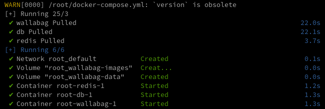


### cwwk - Proxy nginx

Sur le serveur cwwk domaine rnmkcy.eu

Créer un proxy avec le domaine **wallabag.rnmkcy.eu**

Fichier `/etc/nginx/conf.d/wallabag.rnmkcy.eu.conf`

```nginx
server {
    # ipv4 listening port/protocol
    listen       443 ssl http2;
    # ipv6 listening port/protocol
    listen           [::]:443 ssl http2;
    server_name  wallabag.rnmkcy.eu;

    include /etc/nginx/conf.d/security.conf.inc;

    location / {
	proxy_pass http://192.168.10.213:8082;
		proxy_set_header X-Forwarded-Host $server_name;
        proxy_set_header X-Forwarded-For $remote_addr;
    }
}
```

Recharger nginx

    sudo systemctl reload nginx

## wallabag.rnmkcy.eu

### Connexion

<https://wallabag.rnmkcy.eu>  
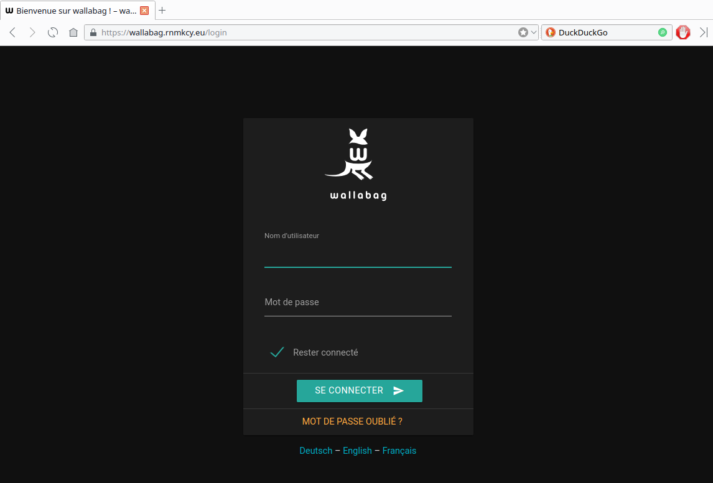{: .normal}  
Identifiants du compte administrateur:

*    Nom d'utilisateur => wallabag
*    Mot de passe => wallabag

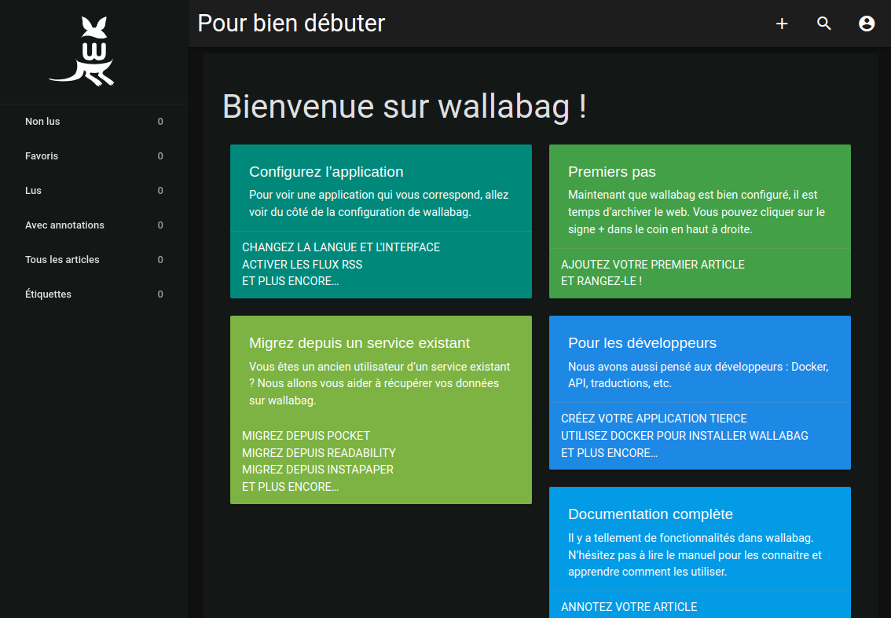{: .normal"}  

### Configuration

Cliquez en haut tout à droite sur l'icône  
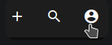

**Changer le mot de passe par défaut**  
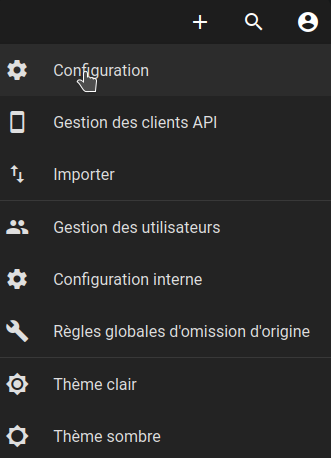{:width="300"}

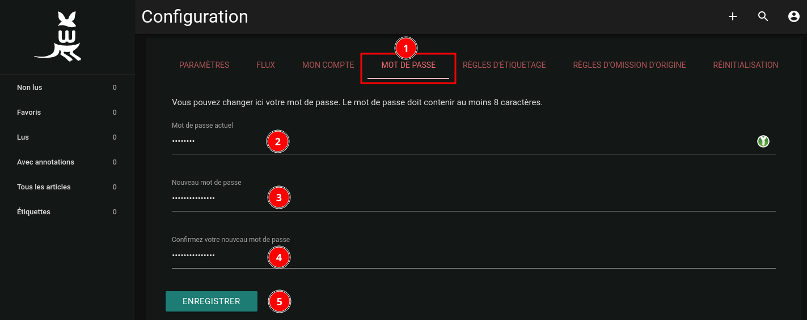{: .normal}

**Langue par défaut**  
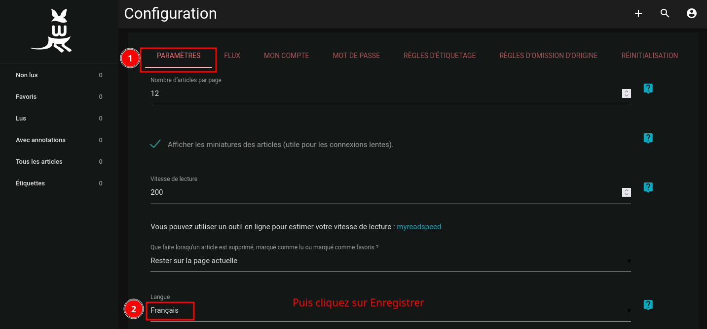{: .normal}

**Adresse de messagerie**  
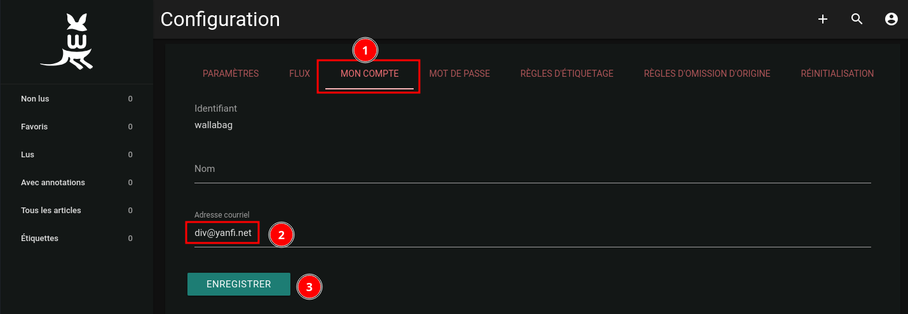{: .normal}

## Wallabagger Firefox

[Wallabagger](https://addons.mozilla.org/fr/firefox/addon/wallabagger/?utm_source=addons.mozilla.org&utm_medium=referral&utm_content=search)

*Cette extension pour Wallabag v2 permet d'éditer le titre de la page, les tags, changer l'état en tant que favori, archivé ou supprimé. Ajoutez une page depuis l'icône ou via le menu du clic droit sur un lien ou une partie vide de la page.*

Wallabagger permet de sauvegarder, éditer, ajouter des tags sur des pages depuis Firefox.
Pour sa configuration, je vous invite à aller lire la page suivante : https://wallabag.org/news/wallabagger-howto .

### Configuration 

Vous pouvez récupérer le Client ID et le Client secret au niveau de la partie **Gestion des clients API** de wallabag.  
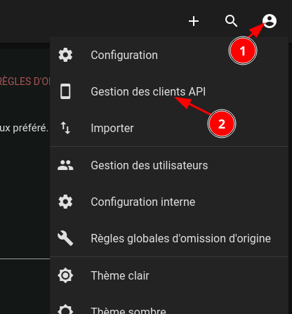{:width="300"}

Si vous n'avez encore créé aucun client :

1.    cliquez sur Créer un nouveau client  
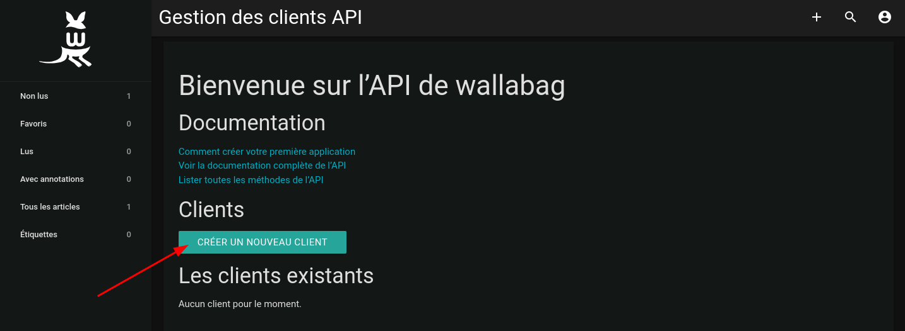{: .normal}
2.    entrez **Wallabagger** en tant que Nom du client  
{: .normal}
3.    cliquez sur Créer un nouveau client  

Sur la page qui vient de s'afficher, le Client ID correspond à l'ID client et le Client secret correspond à la Clé secrète.  
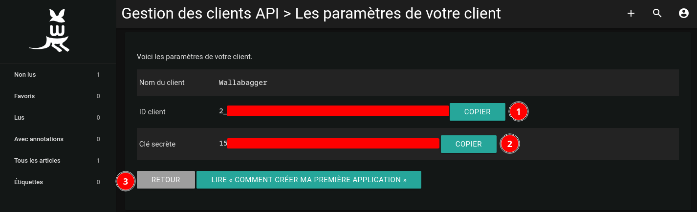{: .normal}

### Options

**Allow Space in tags**  
Autorise l'utilisation des espaces lors de la saisie des tags depuis la popin d'ajout d'article. Il vous faudra alors utiliser la touche entrée pour valider un tag.

**Indicate if page already saved**  
Regarde pour chaque changement d'onglet si la page est déjà présente dans wallabag. Si la page existe, l'**icône en forme de W** sera verte, sinon elle restera noire. Cette option est à utiliser avec prudence car elle sollicite beaucoup l'instance wallabag qui vous accueille et affiche chaque adresse que vous visitez dans le journal d'accès de cette même instance.

**Enable this only if developers told you to**  
Si vous rencontrez des soucis à utiliser notre extension et que vous nous en faites part, il est fort probable que nous vous demandions d'activer cette option qui nous permettra de déboguer l'extension en affichant des informations techniques inutiles lors de d'une utilisation quotidienne.

### Aide 

*    https://gitter.im/wallabag/wallabag
*    https://kiwiirc.com/client/irc.freenode.net/#wallabag
*    https://github.com/wallabag/wallabagger

### Installer extension Wallabagger

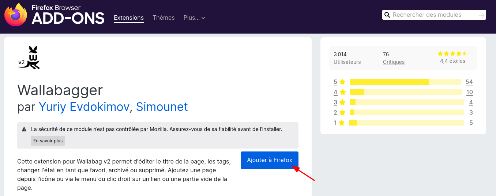{: .normal}

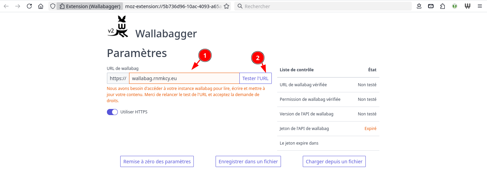{: .normal}

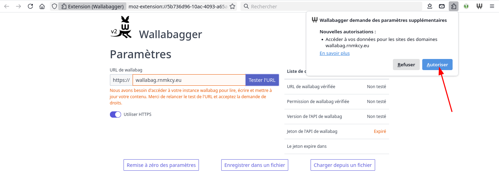{: .normal}

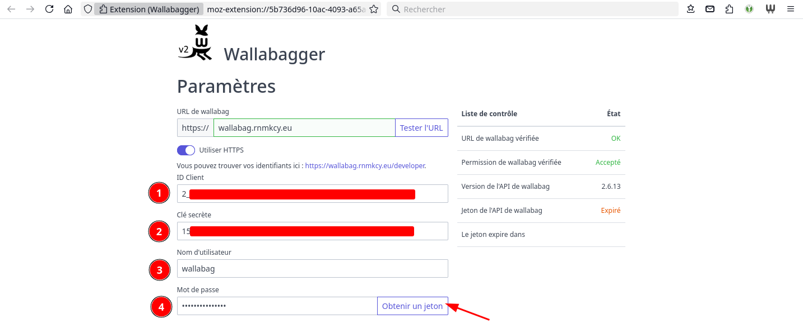{: .normal}

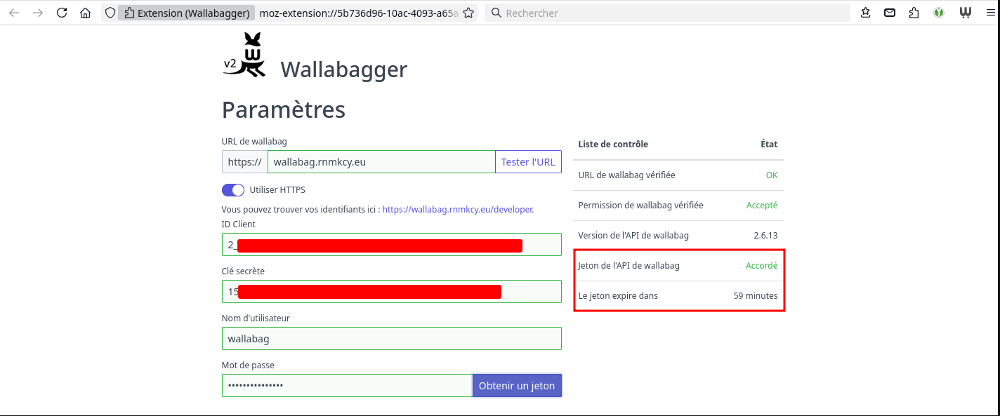{: .normal}

### Utilisation

Vous pouvez ajouter la page courante à wallabag en cliquant sur l'**icône en forme de W**. Une fois la fenêtre de sauvegarde ouverte, vous pouvez également ajouter des tags qui se retrouveront positionnés sur l'article en question.  
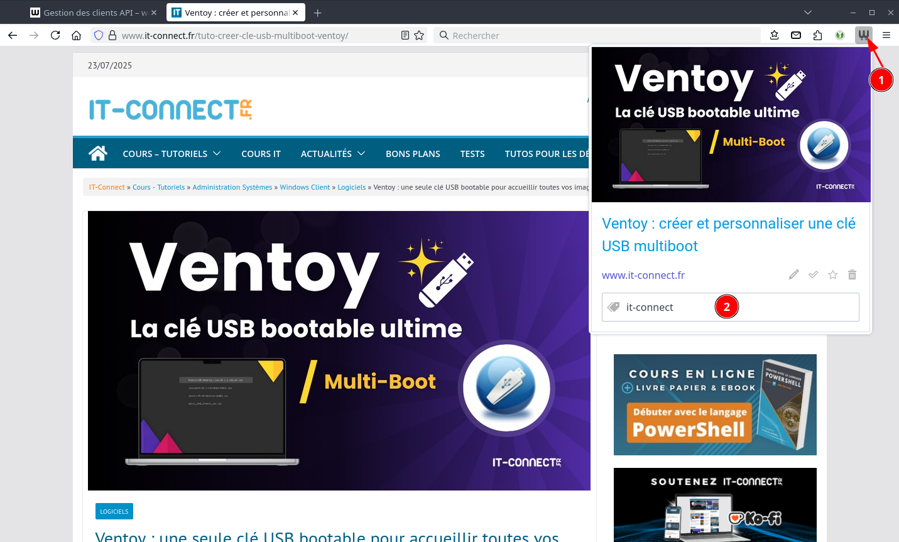{: .normal}

Vous pouvez également ajouter une page disponible à travers un lien en faisant un clic droit sur le lien en question puis en cliquant sur Wallabag it!.  
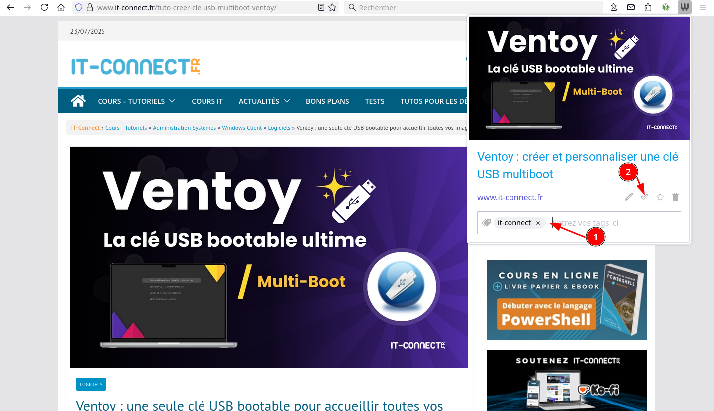{: .normal}


