+++
title = 'PC1 - Endeavour XFCE chiffré'
date = 2025-08-11
categories = ['archlinux', 'chiffrement']
+++
*EndeavourOS est une distribution GNU/Linux basée sur Arch Linux. LVM sur LUKS permet une flexibilité de partitionnement en utilisant LVM à l'intérieur d'une partition chiffrée LUKS.*  

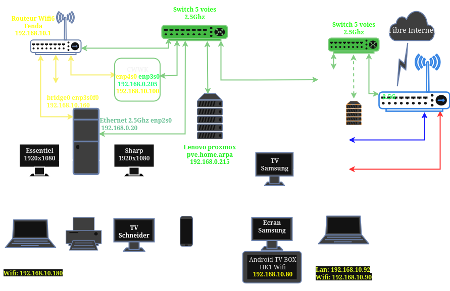

## PC1

* [Description matériel mini tour PC1](/posts/Description_materiel_minitour_PC1/)  

### EndeavourOS USB Live

*Création d'une clé USB EndeavourOS bootable*

Dans un terminal linux  
Télécharger le dernier fichier iSO : <https://endeavouros.com/latest-release/>  
**EndeavourOS_Mercury-Neo-2025.03.19.iso**

Vérifier checksum

```bash
sha512sum -c EndeavourOS_Mercury-Neo-2025.03.19.iso.sha512sum
```

Résultat de la commande ci dessus après quelques minutes  
*EndeavourOS_Mercury-Neo-2025.03.19.iso: Réussi*

Créer la clé bootable  
Pour savoir sur quel périphérique, connecter la clé sur un port USB d'un ordinateur et lancer la commande `sudo dmesg` ou `lsblk`  
Dans le cas présent , le périphérique USV est **/dev/sdc**

```bash
sudo dd if=EndeavourOS_Mercury-Neo-2025.03.19.iso of=/dev/sdc bs=4M
```

Brancher le réseau filaire sur le DELL  

Démarrage avec la clé USB insérée dans le Mini tour PC1 et appui sur F8 pour un accès au menu    
Choisir UEFI specific storage 

Vous arrivez sur la page de sélection  
{:width="400"}  
Valider le choix par défaut  

Changer le clavier en FR  
{:width="600"}  
{:width="400"}  
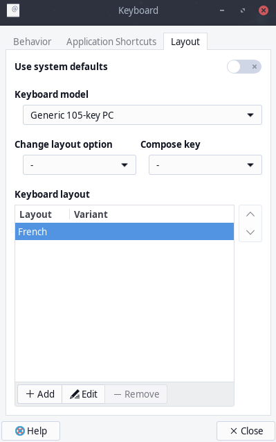{:width="200"}  
Supprimer **English(US)** pour ne garder que **French** et **Close**   

Ouvrir un **Terminal Emulator** dans le live endeavour  
{:width="600"}  


>Pour un accès sur la machine via SSH depuis un poste distant  
Lancer le service : `sudo systemctl start sshd`  
Créer un mot de passe à liveuser : `sudo passwd liveuser`  
Relever l'adresse ip de la machine : `ip a`  
Arrêter le parefeu: `sudo systemctl stop firewalld`
{: .prompt-tip }

Partionner un disque

en mode su

    sudo -s

Le disque : `lsblk`

```
nvme0n1               259:0    0 931,5G  0 disk 
```

On partitionne un disque en 3 avec `gdisk`

* Partition 1 : 512M EFI (code ef00) système de fichier FAT32
* Partition 2 : 920G LVM (code 8e00) système de fichier EXT4
* Partition restante pour Installation temporaire 

Zapper le disque,

(**Attention** Ceci effacera de manière irréversible toutes les données de votre disque, veuillez sauvegarder toutes les données importantes) :

```shell
sgdisk --zap-all /dev/nvme0n1
```

Partitionnement du disque NVME 1To GPT + LVM

```shell
sgdisk --clear --new=1:0:+512MiB --typecode=1:ef00 --new=2:0:+800G --typecode=2:8300 /dev/nvme0n1
```

Format la partition EFI

```shell
mkfs.fat -F32 /dev/nvme0n1p1
# installer efi 
mkdir /mnt/efi
mount /dev/nvme0n1p1 /mnt/efi
bootctl --path=/mnt/efi install
```

Redémarrer l'ordinateur sur le bios F2  
Ordre de démarrage "Fikrot nvmen0" en premier  
Valider et redémarrer sur la clé Eos Live

**Installer EndeavourOS**

Démarrer installateur  
Installation "en ligne"  
Choix XFCE4  
Pas de firewall  
HP Printer  
systemd-boot  
Chiffrer le disque  
Utilisateur yann  
Ordi pc1  
Mot passe utilisateur identique admin  

A la fin de l'installation  
Valider "Redémarrer maintenant"  et "Terminé"

### Premier démarrage

Au message "Please enter passphrase for disk endeavouros...", saisir la phrase mot de passe pour déchiffrer le disque  
Sur la page de connexion utilisateur yano, saisir le mot de passe  

### Mise à jour Système

Au choix

A-Ligne de commande dans un terminal

    yay -Syu

B-Mode graphique  
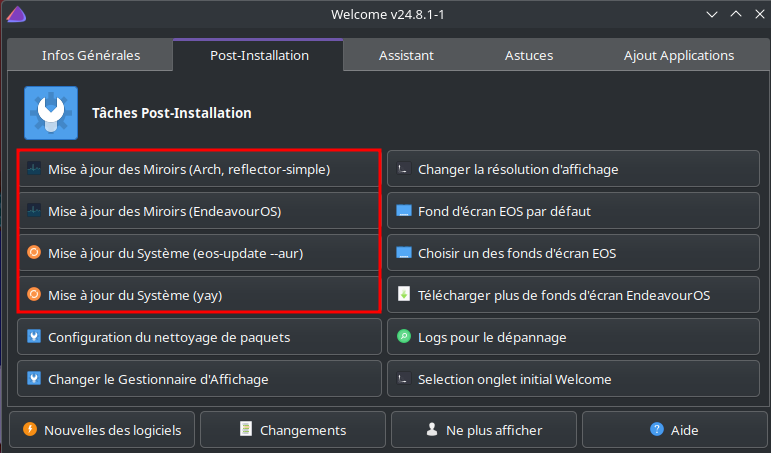

**Etablir une liaison temporaire SSH**

Pour un accès sur la machine via SSH depuis un poste distant  
Lancer et activer le service : `sudo systemctl enable sshd --now`  
Relever l'adresse ip de la machine : `ip a`  192.168.0.20 dans notre cas

Se connecter depuis un poste distant `ssh yann@192.168.0.20`

### Utilisateur droits sudo

Modifier sudoers pour accès sudo sans mot de passe à l'utilisateur **yano**

```shell
su               # mot de passe root identique utilisateur
echo "yann     ALL=(ALL) NOPASSWD: ALL" >> /etc/sudoers.d/20-yann
```

Réinstallation suite crash:  
La sauvegarde complète non chiffréz est sur /dev/sda2  
Création dossier: `sudo mkdir /mnt/sav`  
Montage: `sudo mount /dev/sda2 /mnt/sav`

Restauration dossier .ssh

     cp -r /mnt/sav/home/yann/.ssh /home/yann/


### Parefeu ufw

Installation et activation

```shell
yay -S ufw
sudo ufw enable
```

Ouvrir un terminal

### Clé matérielle FIDO2

*Le déverrouillage se fait par saisie d'une phrase mot de passe, on peut ajouter des clés FIDO2 pour un déchiffrement sans mot de passe ([Using FIDO2 keys to unlock LUKS on EndeavourOS](https://forum.endeavouros.com/t/using-fido2-keys-to-unlock-luks-on-endeavouros/51111))*

Installer librairie libfido2 pour la prise en charge des clés Yubico et SoloKeys

```bash
sudo pacman -S libfido2
```

**Enroler clé USB FIDO2 YubiKey 5 NFC**  
{:height="100"}  

Vérifier que la YubiKey est insérée dans un port USB

Lister et enroler la yubikey

```bash
sudo systemd-cryptenroll --fido2-device=list
```

```text
PATH         MANUFACTURER PRODUCT              
/dev/hidraw4 Yubico       YubiKey OTP+FIDO+CCID
```

Vérifier que le disque chiffré est /dev/nvme0n1p2 : `lsblk`

```
NAME                                          MAJ:MIN RM   SIZE RO TYPE  MOUNTPOINTS
nvme0n1                                   259:0    0   1,9T  0 disk  
├─nvme0n1p1                               259:1    0   512M  0 part  /efi
└─nvme0n1p2                               259:2    0   800G  0 part  
  └─luks-3b7c9f34-3d34-481e-9cb8-424164d1a125
```

Vérifier que le chiffrement est luks2 : `sudo cryptsetup luksDump /dev/nvme0n1p2`

```
LUKS header information
Version:       	2
[...]
```

**Enroler la clé pour le déverrouillage du disque chiffré /dev/sda2**

```
sudo systemd-cryptenroll --fido2-device=auto /dev/nvme0n1p2
```

```
🔐 Please enter current passphrase for disk /dev/nvme0n1p2: •••••••••••••••••••••   
Requested to lock with PIN, but FIDO2 device /dev/hidraw6 does not support it, disabling.
Initializing FIDO2 credential on security token.
👆 (Hint: This might require confirmation of user presence on security token.)
Generating secret key on FIDO2 security token.
👆 In order to allow secret key generation, please confirm presence on security token.
New FIDO2 token enrolled as key slot 1.
```

Le **Y** de la clé se met à clignoter , il suffit de poser son doigt sur l'emplacement du **Y** pour le déverrouillage
{: .prompt-info }

Si vous avez plusieurs clés répéter l'opération **Enroler la clé pour le déverrouillage du disque chiffré /dev/nvme0n1p22**

**Prise en charge FIDO2 (crypttab)**  

Le fichier `/etc/crypttab` contient la liste des périphériques à déverrouiller automatiquement.  
Chaque ligne du fichier crypttab est de la forme :  
`<target name> <source device> <key file> <options>`

* `<target name>` : Nom à donner au mappage (/dev/mapper/name), dans le cas présent "secret"
* `<source device>` : l'identifiant du container luks, sous la forme UUID=
* `<key file>` : chemin absolu vers le ficher de phrase de passe. Si le déverrouillage doit s'effectuer par saisie d'un mot de passe, indiquer "none"
* `<options>` : liste d'options séparées par des virgules, par exemple luks, discard pour un chiffrage luks et autoriser l'utilisation de la commane fstrim ou discard au niveau du container. L'option keyscript= donne la possibilité d'exécuter un script ou une commande avec le chemin vers le fichier de passe de phrase (paramètre password précédent) fourni comme argument.

`/etc/crypttab` avant modification

```
# <name>               <device>                         <password> <options>
luks-08d4dd05-387f-43e1-9f1f-5d33ea1e5b3b UUID=08d4dd05-387f-43e1-9f1f-5d33ea1e5b3b     none luks
```

Configurer `/etc/crypttab` pour la prise en charge FIDO2

```bash
sudo nano /etc/crypttab
```

Modifiez votre /etc/crypttab pour ajouter `fido2-device=auto` à chaque appareil crypté que vous avez enrôlé.

La quatrième colonne **luks** est remplacée par **luks,fido2-device=auto**

```
# <name>               <device>                         <password> <options>
luks-08d4dd05-387f-43e1-9f1f-5d33ea1e5b3b UUID=08d4dd05-387f-43e1-9f1f-5d33ea1e5b3b     none luks,fido2-device=auto
```

Sauvegarder et quitter.

Réinitialiser le noyau

```
sudo reinstall-kernels
```

### Passphrase de recouvrement (OPTION)

Les jetons et puces de sécurité FIDO2, PKCS#11 et TPM2 s'associent bien avec les clés de recouvrement : puisque vous n'avez plus besoin de taper votre mot de passe tous les jours, il est logique de vous en débarrasser et d'enregistrer à la place une clé de recouvrement à forte entropie que vous imprimez ou scannez hors écran et conservez dans un endroit physique sûr.  
Voici comment procéder :

```
sudo systemd-cryptenroll --recovery-key /dev/nvme0n1p2
```

```
🔐 Please enter current passphrase for disk /dev/nvme0n1p2: ***********             
A secret recovery key has been generated for this volume:

    🔐 gvbtrbbe-evkfdjrk-rkegejif-ldiuhgkh-nerngeti-hvhndvte-hhbvbibf-ccnfvifi-rugeregh

Please save this secret recovery key at a secure location. It may be used to
regain access to the volume if the other configured access credentials have
been lost or forgotten. The recovery key may be entered in place of a password
whenever authentication is requested.
New recovery key enrolled as key slot 3.
```

Cette opération génère une clé, l'enregistre dans le volume LUKS2, l'affiche à l'écran et génère un code QR que vous pouvez scanner en dehors de l'écran si vous le souhaitez.  
La clé possède la plus grande entropie et peut être saisie partout où vous pouvez saisir une phrase d'authentification.  
C'est pourquoi il n'est pas nécessaire de modifier le fichier /etc/crypttab pour que la clé de récupération fonctionne.

### Outil systemd-cryptenroll

**[systemd-cryptenroll](https://wiki.archlinux.org/title/Systemd-cryptenroll)**  
systemd-cryptenroll est un outil permettant d'enregistrer des jetons de sécurité matériels et des périphériques dans un volume crypté LUKS2, qui peuvent ensuite être utilisés pour déverrouiller le volume pendant le démarrage.  
systemd-cryptenroll permet d'enregistrer des cartes à puce, des jetons FIDO2 et des puces de sécurité Trusted Platform Module dans des périphériques LUKS, ainsi que des phrases de passe ordinaires. Ces périphériques sont ensuite déverrouillés par `systemd-cryptsetup@.service` à l'aide des jetons enregistrés. 

systemd-cryptenroll peut lister les keyslots d'un périphérique LUKS, de manière similaire à `cryptsetup luksDump`, mais dans un format plus convivial. 

    sudo systemd-cryptenroll /dev/nvme0n1p2

Résultat pour disque déchiffrable avec une phrase et 3 clés FIDO2

```
SLOT TYPE    
   0 password
   1 fido2
   2 fido2
   3 fido2
   4 recovery
```

### Historique ligne de commande  

Ajoutez la recherche d’historique de la ligne de commande au terminal  
Se connecter en utilisateur  
Tapez un début de commande précédent, puis utilisez shift + up (flèche haut) pour rechercher l’historique filtré avec le début de la commande.

```shell
# Global, tout utilisateur
echo '"\e[1;2A": history-search-backward' | sudo tee -a /etc/inputrc
echo '"\e[1;2B": history-search-forward' | sudo tee -a /etc/inputrc
```

### .bashrc et .bash_aliases

Le fichier `.bashrc` pour les alias

```
#
# ~/.bashrc
#

# If not running interactively, don't do anything
[[ $- != *i* ]] && return

alias ls='ls --color=auto'
alias grep='grep --color=auto'
PS1='[\u@\h \W]\$ '

if [ -f ~/.bash_aliases ]; then
    . ~/.bash_aliases
fi
```

### Créer les dossiers "utilisateur"

#### A-Nouvelle installation

Créer les dossiers `.keepassx` , `Notes` , `scripts` `statique/images` et `statique/_posts`

```bash
mkdir -p ~/{.ssh,.keepassx,scripts,Private}

sudo mkdir -p /srv/media/statique/{images,_posts}
sudo chown $USER:$USER -R /srv/media 
mkdir -p /srv/media/Documents/Dossiers-Locaux-Thunderbird
mkdir -p /srv/media/Notes
mkdir -p ~/Private/.borg
# Lien media
ln -s /srv/media $HOME/media
# Lien pour affichage des images avec éditeur Retext
sudo ln -s /srv/media/statique/images /images
```

#### B-Sur une sauvegarde

Sauvegarde montée sur /mnt/sav

```bash
mkdir -p ~/{.ssh,.keepassx,scripts,Private}

sudo mkdir -p /srv/media
sudo chown $USER:$USER -R /srv/media 
# Restauration dossier 'media'
sudo rsync -avA /mnt/sav/srv/media/ /srv/media/
# Lien media
ln -s /srv/media $HOME/media

# Restauration Private
sudo rsync -avA /mnt/sav/home/yann/Private /home/yann/

# Effacer lien 
# Private .borg -> /mnt/sharenfs/pc1/.borg
rm ~/Private/.borg
mkdir -p ~/Private/.borg

# Lien pour affichage des images et files avec éditeur Retext
sudo ln -s /srv/media/statique/images /images
sudo ln -s /srv/media/statique/files /files

# Restauration firefox
sudo rsync -avA /mnt/sav/home/yann/.mozilla /home/yann/

# Effacer les traces de sync nextcloud
rm /srv/media/Notes/.*
rm /srv/media/Documents/Dossiers-Locaux-Thunderbird/.*
rm /srv/media/statique/.*
```

### Paramètres XFCE

Double écran,  
Désactiver **Economiseur d'écran** et **Verrouiller l'écran** dans **Préférences de l'économiseur écran**  
On déplace le **tableau de bord** du bas vers le haut de l'écran  

### Plymouth

*[Plymouth - Processus de démarrage graphique](/posts/Plymouth_Processus_de_demarrage_graphique/)*

Installation

    yay -S plymouth plymouth-theme-endeavouros

Modifier image du thème endeavouros  
`sudo cp sharenfs/e6230/Fonds/wallpaper.png /usr/share/plymouth/themes/endeavouros/`
Ajout splash au fichier `/etc/kernel/cmdline`  
`nvme_load=YES nowatchdog splash rw rd.luks.uuid=c3f9cc28-3bb6...`  
Prise en compte

    sudo reinstall-kernels

## Réseau + Partages

* [Réseau NetworkManager - nmcli](/posts/NetworkManager-nmcli/)
* Carte réseau pcie 2 ports ethernet 1Ghz
* Carte réseau tp-link pcie 2.5Ghz TX201*  
{:height="200"}

*Le périphérique réseau interne à la carte mère est désactivé dans le bios*

### Configuration de base

Les ports ethernet disponibles : `ip link`

```
1: lo: <LOOPBACK,UP,LOWER_UP> mtu 65536 qdisc noqueue state UNKNOWN mode DEFAULT group default qlen 1000
    link/loopback 00:00:00:00:00:00 brd 00:00:00:00:00:00
2: enp2s0: <BROADCAST,MULTICAST,UP,LOWER_UP> mtu 1500 qdisc fq_codel state UP mode DEFAULT group default qlen 1000
    link/ether f0:09:0d:fa:af:ff brd ff:ff:ff:ff:ff:ff
3: enp3s0f0: <BROADCAST,MULTICAST,UP,LOWER_UP> mtu 1500 qdisc mq state UP mode DEFAULT group default qlen 1000
    link/ether 6c:b3:11:32:04:c8 brd ff:ff:ff:ff:ff:ff
4: enp3s0f1: <NO-CARRIER,BROADCAST,MULTICAST,UP> mtu 1500 qdisc mq state DOWN mode DEFAULT group default qlen 1000
    link/ether 6c:b3:11:32:04:c9 brd ff:ff:ff:ff:ff:ff
```

Le statut : `nmcli device status`

```
DEVICE    TYPE      STATE                  CONNECTION          
enp2s0    ethernet  connecté               Connexion filaire 1 
enp3s0f0  ethernet  connecté               Connexion filaire 2 
lo        loopback  connecté (en externe)  lo                  
enp3s0f1  ethernet  indisponible           --                  
```

enp2s0 liaison ethernet 2.5Ghz vers routeur   relié à la box par une liaison ethernet 2.5Ghz  
enp3s0f0 liaison ethernet 1Ghz vers routeur wifi Tenda

### Configurer un pont réseau

* [Réseau - Doc RedHat](https://docs.redhat.com/fr/documentation/red_hat_enterprise_linux/9//configuring_and_managing_networking/configuring-a-network-bridge_configuring-and-managing-networking#configuring-a-network-bridge-by-using-nmcli_configuring-a-network-bridge)

Passer en mode su

1-Créer une interface de pont 

    nmcli connection add type bridge con-name bridge0 ifname bridge0

Cette commande crée un pont nommé bridge0   
*Connexion « bridge0 » (36139d7a-89de-47b0-88c6-22abeb316b5b) ajoutée avec succès.*

2-Affichez les interfaces réseau et notez les noms des interfaces que vous souhaitez ajouter au pont

    nmcli device status

```
DEVICE    TYPE      STATE                                         CONNECTION          
enp2s0    ethernet  connecté                                      Connexion filaire 1 
enp3s0f0  ethernet  connecté                                      Connexion filaire 2 
bridge0   bridge    connexion (obtention de la configuration IP)  bridge0             
lo        loopback  connecté (en externe)                         lo                  
enp3s0f1  ethernet  indisponible                                  --            
```

Dans notre cas :

*    enp3s0f1 n'est pas configuré. Pour utiliser ces dispositifs comme ports, ajoutez des profils de connexion à l'étape suivante.
*    enp2s0 et enp3s0f0 ont des profils de connexion existants. Pour utiliser ces dispositifs comme ports, modifiez leurs profils à l'étape suivante. 

3-Attribuer les interfaces au pont.  

3.1-Si l'interface que vous souhaitez affecter au pont n'est pas configuré, créez un nouveau profil de connexion pour elle  

```bash
nmcli connection add type ethernet slave-type bridge con-name bridge0-port1 ifname enp3s0f0 master bridge0
# si autre interface on renouvelle la commande
#nmcli connection add type ethernet slave-type bridge con-name bridge0-port2 ifname enp3s0f2 master bridge0
```

Cette commande crée un profil pour enp3s0f0 et l'ajoute à la connexion bridge0  
Résultat commande :  
*Connexion « bridge0-port1 » (435b879b-0337-4402-bc8b-32322400345d) ajoutée avec succès.*


3.2-Si vous souhaitez affecter un profil de connexion existant à la passerelle  

Réglez le paramètre master de ces connexions sur bridge0:

```bash
nmcli connection modify 'Connexion filaire 2' master bridge0 # enp3s0f0
#nmcli connection modify 'Connexion filaire 1' master bridge0 # enp2s0
```

Ces commandes affectent les profils de connexion existants nommés enp3s0f0 <s>et enp2s0 à la connexion bridge0</s>.

    Réactiver les connexions :

```bash
nmcli connection up 'Connexion filaire 2' # enp3s0f1
#nmcli connection up 'Connexion filaire 1' # enp2s0
```

4-Configurez les paramètres

Pour utiliser le DHCP, aucune action n'est nécessaire

5-Activer la connexion

    nmcli connection up bridge0

6-Vérifications

Utilisez l'utilitaire ip pour afficher l'état des liens des périphériques Ethernet qui sont des ports d'un pont spécifique

     ip link show master bridge0

```
3: enp3s0f0: <BROADCAST,MULTICAST,UP,LOWER_UP> mtu 1500 qdisc mq master bridge0 state UP mode DEFAULT group default qlen 1000
    link/ether 6c:b3:11:32:04:c8 brd ff:ff:ff:ff:ff:ff
    altname enx6cb3113204c8
```

Utilisez l'utilitaire bridge pour afficher l'état des périphériques Ethernet qui sont des ports de n'importe quel périphérique de pont

    bridge link show

```
3: enp3s0f0: <BROADCAST,MULTICAST,UP,LOWER_UP> mtu 1500 master bridge0 state forwarding priority 32 cost 100 
```

### NFS sharenfs

`nfs-utils` installé par défaut

```shell
sudo mkdir -p /mnt/sharenfs  
sudo chown $USER:$USER -R /mnt/sharenfs  
ln -s /mnt/sharenfs $HOME/sharenfs
```

Ajout au fichier /etc/fstab

```
# Serveur debian 12 cwwk 192.168.0.205
192.168.0.205:/sharenfs	/mnt/sharenfs nfs4 nofail,x-systemd.automount,x-systemd.requires=network-online.target,x-systemd.device-timeout=10s,rsize=8192,wsize=8192 0 0
```

Recharger et monter

```shell
sudo systemctl daemon-reload
sudo mount -a
```

### Partage disque freebox

[Partage disque externe USB sur Freebox](/posts/Partage_disque_externe_USB_sur_Freebox/)


**FreeBox**  
HDD Mobile 2To connecté en USB sur la freebox  
Nom de partage : FreeUSB2To + EXT4 + vérification après formatage  
Partage windows activé : yannfreebox + mot de passe

**PC1**  
Partage linux samba : `sudo pacman -S cifs-utils` Installé par défaut   
Point de montage : `sudo mkdir -p /mnt/FreeUSB2To`   
Lien : `sudo ln -s /mnt/FreeUSB2To $HOME/FreeUSB2To`

Credential : `/root/.smbcredentials` avec 2 lignes  
username=XXXXXX  
password=XXXXXX  

Si récupération sauvegarde sur /mnt/sav

```shell
sudo -s
cp /mnt/sav/root/.smbcredentials /root/
cp /mnt/sav/etc/systemd/system/mnt-FreeUSB2To.mount /etc/systemd/system/
cp /mnt/sav/etc/systemd/system/mnt-FreeUSB2To.automount /etc/systemd/system/
```

Droits

```shell
sudo chown -R root:root /root/.smbcredentials
sudo chmod -R 600 /root/.smbcredentials
```

Les fichiers systèmes

```
# /etc/systemd/system/mnt-FreeUSB2To.mount 
[Unit]
  Description=cifs mount script
  Requires=network-online.target
  After=network-online.service

[Mount]
  What=//192.168.0.254/FreeUSB2To
  Where=/mnt/FreeUSB2To
  Options=credentials=/root/.smbcredentials,rw,uid=1000,gid=1000,vers=3.0
  Type=cifs

[Install]
  WantedBy=multi-user.target

# /etc/systemd/system/mnt-FreeUSB2To.automount 
[Unit]
  Description=cifs mount script
  Requires=network-online.target
  After=network-online.service

[Automount]
  Where=/mnt/FreeUSB2To
  TimeoutIdleSec=10

[Install]
  WantedBy=multi-user.target
```

Activation

```shell
sudo systemctl daemon-reload
sudo systemctl enable mnt-FreeUSB2To.automount --now
```

### Virtuel

Créer le dossier

```shell
# virtuel
sudo mkdir /virtuel
sudo chown $USER:$USER /virtuel
```

Modifier /etc/fstab

```
# /dev/mapper/ssd--512-virtuel
UUID=84bc1aa9-23ac-4530-b861-bc33171b7b42 	/virtuel    ext4    	defaults 0 2
```

Recharger et monter

```shell
sudo systemctl daemon-reload
sudo mount -a
```

## Applications

### Client Nextcloud

{:width="80"}

Installation client nextcloud

    yay -S gnome-keyring  

Télécharger la dernière appimage <https://download.nextcloud.com/desktop/releases/Linux/?C=M;O=A>

```shell
sudo mv ~/Téléchargements/Nextcloud-3.16.6-x86_64.AppImage /usr/local/bin/Nextcloud.AppImage
sudo chmod +x /usr/local/bin/Nextcloud.AppImage
```

Créer un desktop nextcloud

```shell
mkdir -p /home/yann/.local/share/applications/
nano /home/yann/.local/share/applications/nextcloud-client.desktop
```

Contenu `nextcloud-client.desktop`  

```
[Desktop Entry]
Name=Nextcloud Client
GenericName=File Synchronizer
Exec="/usr/local/bin/Nextcloud.AppImage" --background
Terminal=false
Icon=Nextcloud
Categories=Network
Type=Application
StartupNotify=false
X-GNOME-Autostart-enabled=true
X-GNOME-Autostart-Delay=10
```

Démarrer le client nextcloud , après avoir renseigné l'url <https://cloud.rnmkcy.eu> ,login et mot de passe pour la connexion

Trousseau de clé avec mot de passe idem connexion utilisateur
{:width="400"}  


Paramétrage

* Menu → Lancer **Client de synchronisation nextcloud**
* Adresse du serveur : <https://cloud.xoyaz.xyz>  
  Se connecter avec un **mot de passe application nextcloud "Synchro DELL e6230"**
* Nom d’utilisateur : yann
* Mot de passe : xxxxx  
  {:width="300"}  
  Puis saisir l'adresse : https://cloud.rnmkcy.eu  
  Le nagigateur s'ouvre sur l'adresse saisie   
  {:width="500"}  
  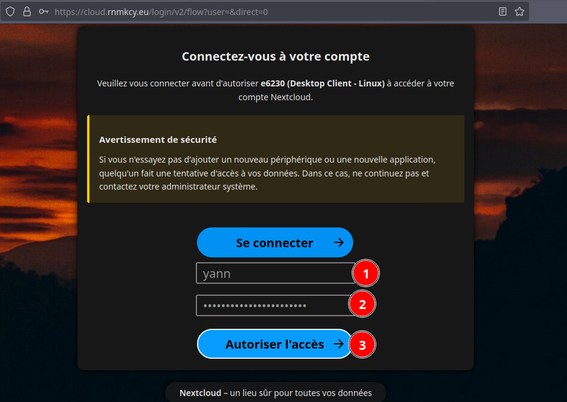{:width="500"}  
  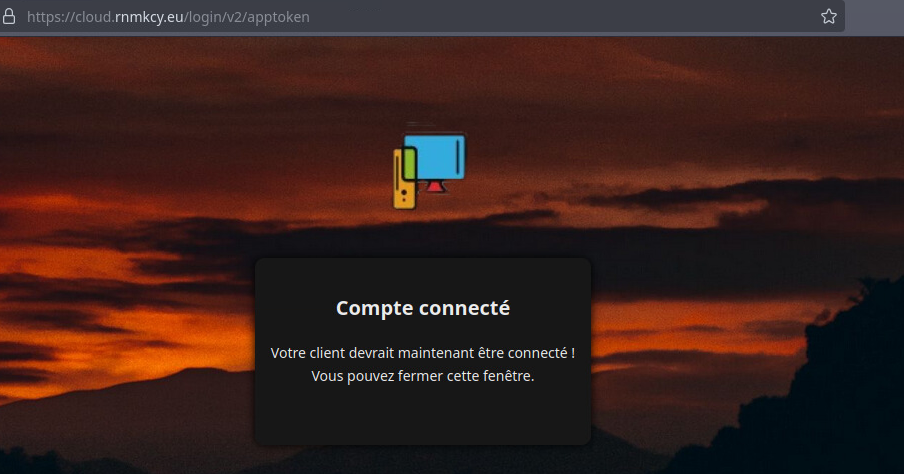{:width="500"}    
* Sauter les dossiers à synchroniser, Ignorer la configuration des dossiers
  {:width="400"}  
* Trousseau de clés = mot de passe connexion utilisateur  
  {:width="400"}
* Paramètres nextcloud  
  {:width="400"}

Saisir les différents dossiers à synhroniser  
{:width="400"}

Au prochain démarrage, une fenêtre pour le trousseau

unlock keyring, mp utilisateur  
Automatically unlock  

Modifier ou créer une commande dans **Session et démarrage**

### Keepassxc (Mot de passe)

*On utilise une clé matérielle pour déverrouiller la base de mot de passe*

`La clé matériel utilisée pour la connexion doit être insérée`{: .prompt-tip }

Installer le gestionnaire de mot de passe **keepassxc**

```bash
yay -S keepassxc
```

Ajouter aux favoris "KeepassXC" et lancer l'application → **Ouvrir une base de données existante**  
Base de données --> Ouvrir une base de données (afficher les fichiers cachés) : **~/.keepassx/yannick_xc.kdbx** --> Ouvrir  
{:width="400"}

Intégration navigateur  
{:width="400"}

### Minicom

Installation

    yay -S minicom

Paramétrage de l'application terminale **minicom**

```
 sudo minicom -s
```

> Seul les paramètres à modifier sont cités

Configuration du port série  
  
A -                             Port série : **/dev/ttyUSB0**  
F -              Contrôle de flux matériel : **Non**  
  
Echap  
Enregistrer config. sous dfl  
  
Sortir de Minicom

### Flameshot (copie écran)

>**ATTENTION**: La vesion 13 de **flameshot** pose problème sur une configuration XFCE NON WAYLAND  
Il faut installer la version 12 du cache:  
`yay -U /var/cache/pacman/pkg/flameshot-12.1.0-6-x86_64.pkg.tar.zst`  
Bloquer la mise à jou flameshot fichier `/etc/pacman.conf`  
IgnorePkg   = flameshot
{: .prompt-danger }

**Copie écran (flameshot)**  
[**Flameshot**](https://github.com/lupoDharkael/flameshot) c’est un peu THE TOOL pour faire des captures d’écrans

```shell
yay -S flameshot
```

Lancer l'application Flameshot et l'icône est visible dans la barre des tâches  
{:width="300"}

Paramétrage de flameshot, clic droit sur icône , Configuration  
{:width="300"}  
Paramétrage de flameshot  
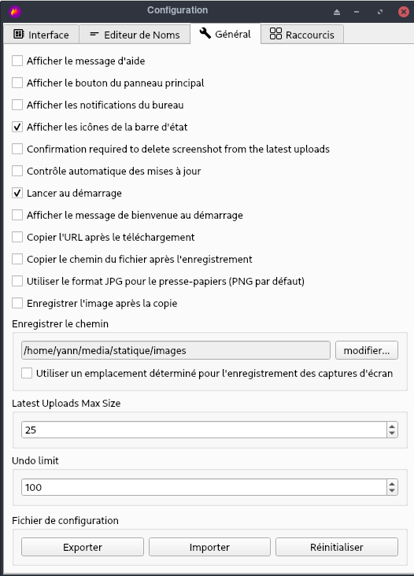{:width="400"}  
Le chemin: /home/yano/media/statique/images

### scrpy émulation android

Utilise adb et le port USB

```
yay -S scrcpy
```

*Les icônes pour lancer l'application sont générés à l'installation*

{:width="300"}  

### Paquets supplémentaires

Lancer la commande

```bash
# qrencode zbar android-tools , installés par défaut
yay -S gedit jq gimp libreoffice-fresh-fr figlet p7zip tmux calibre retext bluefish terminator filezilla borg yt-dlp xclip nmap tigervnc xournalpp tree openbsd-netcat 
```

Spécifique 

```bash
# Outils réseau
yay -S net-tools
# Wake-on-LAN (WoL) est un standard des réseaux Ethernet 
# qui permet à un ordinateur éteint d'être démarré à distance. 
yay -S wakeonlan
# imagemagick installé par défaut
yay -S freetube-bin 
# Signal
yay -S signal-desktop 
# Multimédia audio
yay -S strawberry
# Navigation privée
yay -S tor-browser-bin
```

### Navigateur Librewolf

[Navigateur LibreWolf](/posts/Navigateur_LibreWolf/)

Si sauvegarde

```shell
yay -S librewolf-bin
sudo rsync -avA /mnt/sav/home/yann/.librewolf /home/yann/
```

Autoriser l'accès dans l'application keepassxc

### Gestionnaire de fichiers

*Double Commander est un gestionnaire de fichiers multiplateforme au source ouvert avec deux panneaux côte à côte.*

```shell
yay -S doublecmd-qt6
sudo rsync -avA /mnt/sav/home/yann/.config/ReText\ project /home/yann/.config/
```

### Thunderbird

Lancer thunderbird à l'ouverture de session xfce  
Paramètres &rarr; Session et démarrage &rarr; Démarrage automatique d'application  
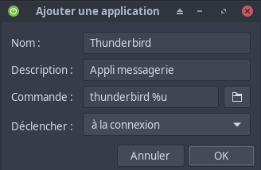{:width="300"}

Installer

    yay -S thunderbird-i18n-fr

Copier la sauvegarde

    sudo rsync -avA /mnt/sav/home/yann/.thunderbird /home/yann/

Ajouter thunderbird aux favoris et lancer

### bashrc alias

Ajouter les alias au fichier `$HOME/.bash_aliases`   
<details>
<summary><b>Etendre Réduire</b></summary>
  
alias aide='xdg-open https://static.rnmkcy.eu/aide-jekyll-text-theme.html#autres-styles'
alias android='$HOME/virtuel/KVM/bliss.sh'
alias audio='yt-dlp --extract-audio --audio-format m4a --audio-quality 0 --output "~/Musique/%(title)s.%(ext)s"'
alias audiomp3='yt-dlp --extract-audio --audio-format mp3 --audio-quality 0 --output "~/Musique/%(title)s.%(ext)s"'
alias borglist='$HOME/scripts/borglist.sh'
alias calibreraz='adb -s CNBT80D20191101145 shell -x rm /sdcard/Document/metadata.calibre'
alias certok='$HOME/scripts/ssl-cert-check'
alias chirpy='$HOME/scripts/chirpy.sh'
alias cockpit='sh $HOME/scripts/cockpit.sh'
alias compress='$HOME/scripts/compress'
alias dnsleak='$HOME/scripts/dnsleaktest.py'
alias etat='$HOME/scripts/etat_des_lieux.sh'
alias findh='cat $HOME/scripts/findhelp.txt'
alias homer="ssh -o ProxyCommand='ssh -W %h:%p -p 55205 -i /home/yann/.ssh/yick-ed25519 yick@192.168.0.205' userone@192.168.100.40 -p 22 -i /home/yann/.ssh/vm-debian01 '\''/home/userone/homer/remoh.py'"
alias iceyanwg="sh /mnt/sharenfs/pc1/scripts/wgiceyan.sh"
alias ipleak='curl https://ipv4.ipleak.net/json/'
alias l='ls -lav --ignore=.?*'
alias ll='ls -lav --ignore=..'
alias ls='ls --color=auto'
alias mediasync='$HOME/scripts/sav-yann-media.sh'
alias mediajour='/usr/bin/journalctl --no-pager -t sauvegardes --since today'
alias nmapl='echo "sudo nmap -T4 -sP 192.168.0.0/24" && sudo nmap -T4 -sP 192.168.0.0/24'
alias odt2html='$HOME/scripts/_odt2html.sh'
#alias odtprivate='$HOME/scripts/_odt2html+index_private'
alias orphelin='sudo pacman -Rsn $(pacman -Qdtq)'
alias otp='$HOME/scripts/generer-code-2fa-vers-presse-papier-toutes-les-30s.sh'
alias ovh='$HOME/scripts/ovh_api/ApiOvh/bin/python $HOME/scripts/ovh_api/domain.py xoyize.xyz cinay.eu xoyaz.xyz ouestline.xyz rnmkcy.eu yanfi.net icevps.xyz xoyize.net iceyan.xyz'
alias rename='$HOME/scripts/remplacer-les-espaces-accents-dans-une-expression.sh'
alias service='systemctl --type=service'
alias sshm='$HOME/scripts/ssh-manager.sh'
alias ssl='$HOME/scripts/ssl-cert-check -f $HOME/scripts/ssldomains'
alias static='cd $HOME/media/chirpy; $HOME/.local/share/gem/ruby/3.4.0/bin/bundle exec jekyll build; systemctl --user restart chirpy.service; cd ~'
alias status='$HOME/scripts/status.sh'
alias synchro='journalctl --user -u media_yannstatic_site.service --no-pager --since today'
alias toc='$HOME/scripts/toc/toc.sh'
alias tocplus='$HOME/scripts/toc/tocplus.sh'
alias tracesgpx="/srv/media/osm-new/osm_python/OsmScripts/bin/python /srv/media/osm-new/osm_python/OsmScripts/tracesgpxnew.py /srv/media/osm-new/file /run/media/yann/GARMIN/Garmin/GPX; sh /srv/media/osm-new/osm-new-synchro.sh"
alias traduc='/usr/local/bin/trans'
alias ttrss="bash $HOME/scripts/articles_remarquables_ttrss"
alias vncasus='sh $HOME/scripts/vncasus.sh'
alias vncdell='sh $HOME/scripts/vncdell.sh'
alias vncmarina='sh $HOME/scripts/vncmarina.sh'
alias wgiceyan='sh $HOME/scripts/wgiceyan.sh'
alias x96='adb connect 192.168.0.22:5555'
#alias youtube='yt-dlp -f "bestvideo[ext=mp4]+bestaudio[ext=m4a]/best[ext=mp4]/best" --output "~/Vidéos/%(title)s.%(ext)s" --ignore-errors'
alias youtube='yt-dlp -f bv*+ba --output "~/Vidéos/%(title)s.%(ext)s"'

</details>

Recharger le fichier pour appliquer les modifications 

    source ~/.bash_aliases

Pour afficher les alias dans un terminal

    alias

### Systemd user

Si sauvegarde

```shell
sudo rsync -avA /mnt/sav/home/yann/.config/systemd /home/yann/.config/
```

### Synchro serveur calibre

**Dossier "BiblioCalibre"**

Le but est de synchroniser le dossier **/srv/media/BiblioCalibre** avec le(s) serveur(s) web distant(s)  
Avec les unités de chemin, vous pouvez surveiller les fichiers et les répertoires pour certains événements. Si un événement spécifique se produit, une unité de service est exécutée, et elle porte généralement le même nom que l'unité de chemin
{: .prompt-info }


Nous allons surveiller dans le dossier */srv/media/BiblioCalibre/* toute modification du fichier **metadata.db** qui entrainera l'exécution d'un script

Dans le répertoire systemd utilisateur nous créons une unité de cheminement **media_BiblioCalibre_site.path**

    nano ~/.config/systemd/user/media_BiblioCalibre_site.path

```ini
[Unit]
Description=Surveiller metadata.db pour les changements

[Path]
PathChanged=/srv/media/BiblioCalibre/metadata.db
Unit=media_BiblioCalibre_site.service

[Install]
WantedBy=default.target
```

Dans la section `[Path]`, `PathChanged=` indique le chemin absolu du fichier à surveiller, tandis que `Unit=` indique l'unité de service à exécuter si le fichier change. Cette unité (**media_BiblioCalibre_site.path**) doit être lancée lorsque le système est en mode multi-utilisateur.

Ensuite, nous créons l'unité de service correspondante, **media_BiblioCalibre_site.service**, dans le répertoire `~/.config/systemd/user/`    
Si le fichier **metadata.db** change (c'est-à-dire qu'il est à la fois écrit et fermé), l'unité de service suivante sera appelée pour exécuter le script spécifié :

    nano ~/.config/systemd/user/media_BiblioCalibre_site.service

```ini
[Unit] 
Description="Exécute le script si metadata.db a été modifié."

[Service]
ExecStart=/mnt/sharenfs/scripts/media_BiblioCalibre_site.sh

[Install]
WantedBy=default.target
```

Le script `media_BiblioCalibre_site.sh` lance une synchronisation locale distante via rsync ssh 
<details>
<summary><b>Etendre Réduire media_BiblioCalibre_site.sh</b></summary>  

#!/bin/bash

#++++++++++++++++++++++++++++++++++++++++++++++++++++++++++++++++++++++++++++++++++++++++++++++++++++++++++++++++++++++++++
# Modification mode rsync suivant serveur distant
#
# Chaque modification du fichier metadata.db dans le dossier local /srv/media/BiblioCalibre 
# déclenche une synchronisation du dossier local  avec le dossier distant '/sharenfs/multimedia/eBook/BiblioCalibre' 
# des serveurs VPS Yunohost
# le dossier local est également sauvegardé dans le dossier 'backup/datayan/static' de la boîte de stockage
#++++++++++++++++++++++++++++++++++++++++++++++++++++++++++++++++++++++++++++++++++++++++++++++++++++++++++++++++++++++++++

# Fonction pour tester si le serveur est présent
# Host=$1 et Port=$2
# Réponse $?=0 -> OK  $?=1 -> NOK
host_ok () {
 nc -4 -d -z -w 1 $1 $2 &> /dev/null
}

synchro () {
# Synchronisation locale distante du dossier _site
host_ok $SERVER $PORT 
if [[ $? == 0 ]]
then


echo 'rsync -avz --progress --stats --human-readable --delete -e "ssh -p '$PORT' -i '$PRIVKEY'" '$REPLOC' '$USERDIS':'$REPDIS'/eBook/'
rsync -avz --progress --stats --human-readable --delete --rsync-path="$RSYNCMOD" -e "ssh -p $PORT -i $PRIVKEY" $REPLOC $USERDIS:$REPDIS/eBook/ > /dev/null

	 # Analyse résultat de la commande rsync
	 if [ ! $? -eq 0 ]; then 
		 #echo "Synchro $REPLOC avec $SERVER -> OK" | systemd-cat -t BiblioCalibre -p info 
		 #echo "Synchro $REPLOC avec $SERVER -> OK"
	 #else 
		 echo "Synchro $REPLOC avec $SERVER -> ERREUR" | systemd-cat -t BiblioCalibre -p emerg 
		 #echo "Synchro $REPLOC avec $SERVER -> ERREUR"
	 fi
else
    echo "Site $SERVER port $PORT Inaccessible !" | systemd-cat -t BiblioCalibre -p emerg
    #echo "Site $SERVER port $PORT Inaccessible !"
fi

}

#*******************************************************************
#
# DEPART SCRIPT
#
#*******************************************************************

# Tester la présence du fichier des serveurs distants
if [ ! -f /home/yann/scripts/serveurs.csv ]; then
    echo "Fichier serveurs.csv inexistant!" | systemd-cat -t BiblioCalibre -p emerg
    exit 1
fi

# Mesure temps exécution
begin=$(date +"%s")
echo "***DEPART*** Exécution script $0"
echo "***DEPART*** Exécution script $0" | systemd-cat -t BiblioCalibre -p info
#echo "Exécution script $0"

# Dossier local
REPLOC="/srv/media/BiblioCalibre" 

# Synchro serveurs
while IFS="," read -r SERVER REPDIS USERDIS PORT PRIVKEY RSYNCMOD LOCAL
do
  #echo " $SERVER $REPDIS $USERDIS $PORT $PRIVKEY $RSYNCMOD $LOCAL"
 
   if [[ "$SERVER" = "rnmkcy.eu" ]]; then
  	synchro
        echo "ssh $USERDIS -p $PORT -i $PRIVKEY 'sudo systemctl restart calibreweb'"
  	ssh $USERDIS -p $PORT -i $PRIVKEY 'sudo systemctl restart calibreweb'  
   fi
done < <(tail -n +2 /home/yann/scripts/serveurs.csv)

# Calcul et affichage temps exécution
termin=$(date +"%s")
difftimelps=$(($termin-$begin))
echo "***FIN*** $0 exécuté en $(($difftimelps / 60)) mn $(($difftimelps % 60)) s" | systemd-cat -t BiblioCalibre -p info
echo "***FIN*** $0 exécuté en $(($difftimelps / 60)) mn $(($difftimelps % 60)) s"

exit 0

</details>

Activer et lancer

    systemctl --user enable media_BiblioCalibre_site.path --now

Voir le fichier journal

    journalctl --user -f -u media_BiblioCalibre_site.service

```
juin 06 09:39:32 yann-pc1 systemd[1537]: Started "Exécute le script si metadata.db a été modifié.".
juin 06 09:39:32 yann-pc1 media_BiblioCalibre_site.sh[11100]: ***DEPART*** Exécution script /home/yann/scripts/media_BiblioCalibre_site.sh
juin 06 09:39:32 yann-pc1 media_BiblioCalibre_site.sh[11100]: rsync -avz --progress --stats --human-readable --delete -e "ssh -p 55215 -i /home/yann/.ssh/lenovo-ed25519" /srv/media/BiblioCalibre leno@192.168.0.215:/sharenfs/multimedia/Divers/
juin 06 09:39:33 yann-pc1 media_BiblioCalibre_site.sh[11100]: ***FIN*** /home/yann/scripts/media_BiblioCalibre_site.sh exécuté en 0 mn 1 s
juin 06 09:44:40 yann-pc1 systemd[1537]: Started "Exécute le script si metadata.db a été modifié.".
juin 06 09:44:40 yann-pc1 media_BiblioCalibre_site.sh[11278]: ***DEPART*** Exécution script /home/yann/scripts/media_BiblioCalibre_site.sh
juin 06 09:44:40 yann-pc1 media_BiblioCalibre_site.sh[11278]: rsync -avz --progress --stats --human-readable --delete -e "ssh -p 55215 -i /home/yann/.ssh/lenovo-ed25519" /srv/media/BiblioCalibre leno@192.168.0.215:/sharenfs/multimedia/Divers/
juin 06 09:44:41 yann-pc1 media_BiblioCalibre_site.sh[11278]: ssh leno@192.168.0.215 -p 55215 -i /home/yann/.ssh/lenovo-ed25519 'sudo systemctl restart calibreweb'
juin 06 09:44:42 yann-pc1 media_BiblioCalibre_site.sh[11278]: ***FIN*** /home/yann/scripts/media_BiblioCalibre_site.sh exécuté en 0 mn 2 s
```

### NordVPN

Installation Droits

```shell
yay -S nordvpn-bin
#sudo groupadd nordvpn
sudo usermod -aG nordvpn $USER
sudo systemctl enable --now nordvpnd
# Nouveau terminal
nordvpn connect
# ouvrir le lien, sec onnecter au compte nordvpn
```

Vérifier: `id yann`

```
uid=1000(yann) gid=1000(yann) groupes=1000(yann),3(sys),998(wheel),981(rfkill),960(nordvpn)
```

Redémarrer

Ouvrir terminal

```
nordvpn connect
```

* [NordVPN fournisseur de services de réseau privé virtuel (VPN)](/posts/NordVPN/)
* [NordVPN systray](https://gitea.rnmkcy.eu/yann/nordvpntray)

Le nordvpn gui

    yay -S nordvpn-gui


**Désactiver NordVPN**

```bash
sudo systemctl stop nordvpnd.service
sudo systemctl disable nordvpnd.service
```

Décocher **nordvpntray (NordVPN Graphique)** dans **Paramètres -> Session et démarrage Démarrage automatique de session**  

### Imprimante

Prérequis , paquets **cups cups-filters cups-pdf system-config-printer hplip installés** (Pilotes HP pour DeskJet, OfficeJet, Photosmart, Business Inkjet et quelques modèles de LaserJet aussi bien qu'un certain nombre d'imprimantes Brother)...   


Installer graphiquement l'imprimante  
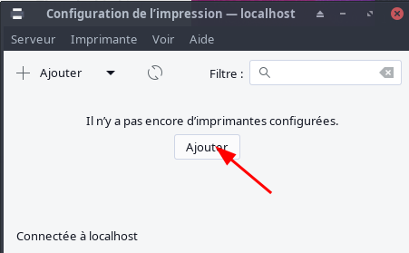{:width="300"}  
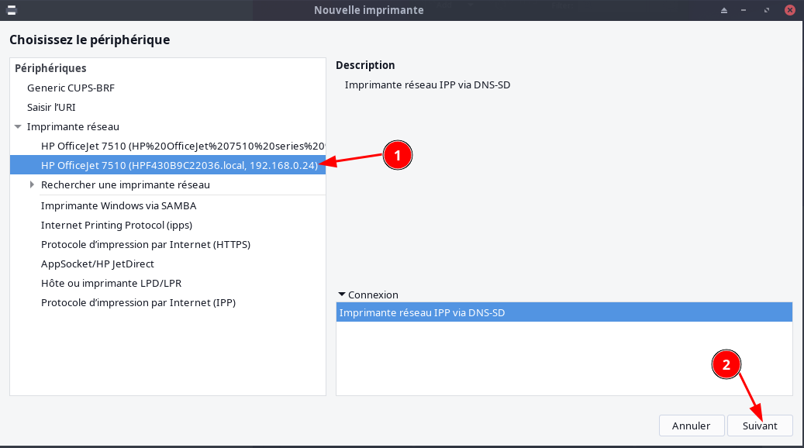  
  

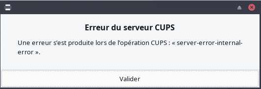{:width="300"}  
Pour contourner le problème , éditer le fichier `/etc/nsswitch.conf`  
Ajouter `mdns_minimal [NOTFOUND=return]` avant `resolve`   
`hosts: mymachines mdns_minimal [NOTFOUND=return] resolve [!UNAVAIL=return] files myhostname dns`
{: .prompt-warning }

Après correctif  
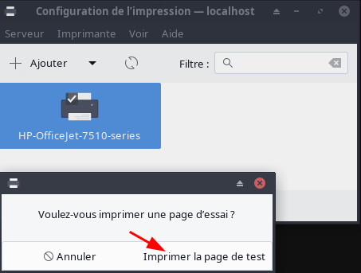{:width="300"}  

Avec cups : http://localhost:631/  
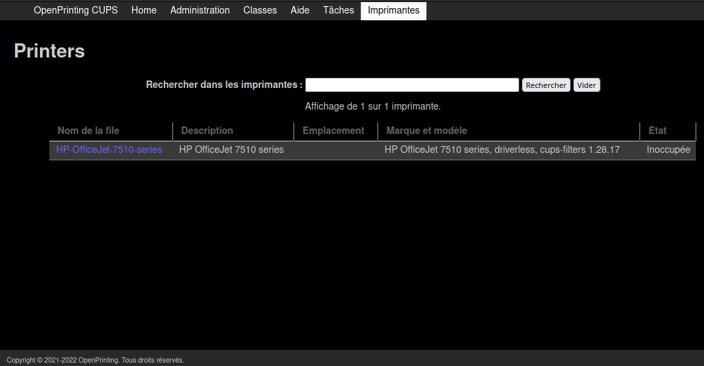

### Générateur site statique

*Ensemble d'applications basé sur ruby et jekyll qui permet la génération de site statique à partir de fichiers markdown*
    
[Ruby jekyll yannstatic - générateur site statique](/posts/Archlinux_Ruby_Jekyll_site_statique/#option-b---ruby-choix-par-defaut)
    
Installation gem

```
WARNING:  You don't have /home/yann/.local/share/gem/ruby/3.4.0/bin in your PATH,
	  gem executables (bundle, bundler) will not run.
Successfully installed bundler-2.7.1
```

Ajout PATH au fichier `~/.bashrc`

```
echo 'export PATH="$HOME/.local/share/gem/ruby/3.4.0/bin:$PATH"'  >> ~/.bashrc 

echo '# Install Ruby Gems to ~/gems' >> ~/.bashrc
echo 'export GEM_HOME="$HOME/gems"' >> ~/.bashrc
echo 'export PATH="$HOME/gems/bin:$PATH"' >> ~/.bashrc
source ~/.bashrc

# droits
sudo chown $USER:$USER -R /usr/lib/ruby/
```

Les versions installées

```
[yann@pc1 ~]$ ruby -v && gem -v && bundle -v && jekyll -v
ruby 3.4.4 (2025-05-14 revision a38531fd3f) +PRISM [x86_64-linux]
3.6.7
Bundler version 2.7.1
jekyll 4.4.1
```

[Chirpy](/posts/Archlinux_Ruby_Jekyll_site_statique/#jekyll---chirpy)

```shell
cd ~/media/chirpy
bundle
```

Erreur

```
An error occurred while installing Ascii85 (2.0.1), and Bundler cannot continue.

In Gemfile:
  html-proofer was resolved to 5.0.10, which depends on
    pdf-reader was resolved to 2.14.1, which depends on
      Ascii85
```

Installer 

    gem install html-proofer -v 5.0.10

Gemfile 

```
# frozen_string_literal: true

source "https://rubygems.org"

gemspec

gem "html-proofer", "~> 5.0.10", group: :test

platforms :mingw, :x64_mingw, :mswin, :jruby do
  gem "tzinfo", ">= 1", "< 3"
  gem "tzinfo-data"
end

gem "wdm", "~> 0.2.0", :platforms => [:mingw, :x64_mingw, :mswin]
gem 'jemoji'
```

Les liens

```
[yann@pc1 chirpy]$ ls -la |grep ^l
lrwxrwxrwx    1 yann yann     31 21 mars  10:33 files -> /home/yann/media/statique/files
lrwxrwxrwx    1 yann yann     32 21 mars  10:33 images -> /home/yann/media/statique/images
lrwxrwxrwx    1 yann yann     32 24 mars  08:13 _posts -> /home/yann/media/statique/_posts
[yann@pc1 chirpy]$ ls -la / |grep ^l
lrwxrwxrwx   1 root root    25 27 juil. 23:40 files -> /srv/media/statique/files
lrwxrwxrwx   1 root root    26 27 juil. 22:01 images -> /srv/media/statique/images
```

### Bluetooh

**Activer Bluetooth**  
Bluetooth n'est pas actif par défaut, en raison de plusieurs risques de sécurité et pour éviter une consommation d'énergie inutile.

Les packages nécessaires sont installés, mais ils sont désactivés.

Pour pouvoir utiliser Bluetooth, vous devez démarrer le service ou l'activer si vous avez besoin que Bluetooth soit exécuté à chaque démarrage :

```bash
sudo systemctl enable bluetooth --now # à activer par défaut, s'exécutera après chaque démarrage.
```

**Souris Bluetooth Pebble Mouse 2 M350s**  
Basculez entre 3 de vos dispositifs d'une simple pression sur le bouton Easy-Switch.  
Position 1 pour le portable DELL latitude e6230  
{:height="400"}  
*Pour effacer une configuration existante de la souris bluetooth , garder enfoncer le bouton Easy-Switch jusqu'au clignotement rapide de la led*

Pour ajouter la souris bluetooth au portable DELL, clic droit sur l'icône bluetooth de la barre des tâches, Périphériques puis Rechercher et lorsque l'appareil est détecté , il faut l'appairer  
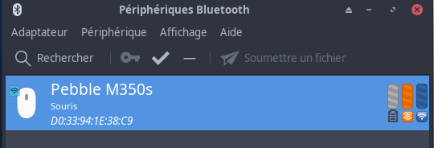{:width="300"}  

**Ecouteurs bluetooth**  
  
Soundcore Liberty Air 2  

* [Test des Anker Soundcore Liberty Air 2](https://www.cnetfrance.fr/produits/test-anker-soundcore-liberty-air-2-39895873.htm)
* [Liberty Air 2 Support Videos](https://support.soundcore.com/s/product/a085g000000NlyiAAC/liberty-air-2)

Utiliser le gestionnaire bluetooth et la recherche  
{:width="400"}  

Lorsque le périphérique est détecté, il faut l'appairer, clic-droit --> Appairer  
Après appairage  
{:width="400"}  

`Pour que le périphèrique fonctionne correctement, il est IMPERATIF de redémarrer la machine`{: .prompt-info }

Après redémarrage, il faut séléctionner le profil audio  
{:width="500"}  

## Outils développement

### Virtuel Virt-Manager

1. [Virt-Manager Complete Edition - Installation simplifiée](/posts/EndeavourOS-Virt-Manager_Complete_Edition/#installation-simplifiée)
2. [Accés aux machines virtuelles KVM distantes via virt-manager](/posts/Installer_KVM_Kernel_Virtual_Machine_sur_un_serveur/#accés-aux-machines-virtuelles-kvm-distantes-via-virt-manager)
3. [Pont réseau virtuel “host-bridge”](/posts/EndeavourOS-Virt-Manager_Complete_Edition/#pont-réseau-virtuel-host-bridge)  
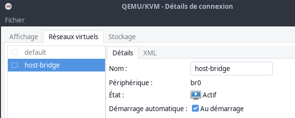{:width="400"}
4. Gestionnaire de machine virtuelles, activer "xml editing"  
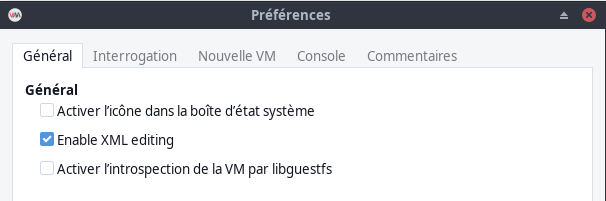{:width="400"}
5. Restaurer les configurations de VM  
`sudo cp ~/virtuel/etc-libvirt-qemu/*.xml /etc/libvirt/qemu/`

Script pour une installation complète

```shell
# Créez des groupes kvm et libvirt
sudo groupadd -f kvm  
sudo groupadd -f libvirt
# Ajouter l'utilisateur actuel
sudo usermod -a -G libvirt $USER
sudo usermod -aG kvm $USER

# Installation complète Virt-Manager
sudo pacman -Syu --needed virt-manager qemu-desktop libvirt edk2-ovmf dnsmasq vde2 bridge-utils iptables-nft dmidecode swtpm libguestfs guestfs-tools
# activer le service libvirtd
sudo systemctl enable --now libvirtd.service

# Modifier le fichier /etc/libvirt/libvirtd.conf
sudo sed -i -e 's/#unix_sock_group = "libvirt"/unix_sock_group = "libvirt"/g' /etc/libvirt/libvirtd.conf
sudo sed -i -e 's/#unix_sock_rw_perms = "0777"/unix_sock_rw_perms = "0770"/g' /etc/libvirt/libvirtd.conf
sudo sed -i -e 's/#unix_sock_ro_perms = "0777"/unix_sock_ro_perms = "0777"/g' /etc/libvirt/libvirtd.conf
sudo systemctl restart libvirtd.service

# Créer utilisateur système swtpm
sudo useradd -r swtpm
sudo mkdir -p /var/lib/swtpm-localca
sudo chown swtpm:swtpm /var/lib/swtpm-localca

# Ajout lignes suivantes au fichier /etc/libvirt/qemu.conf
sudo sed -i -e 's/#swtpm_user = "tss"/swtpm_user = "swtpm"/g' /etc/libvirt/qemu.conf
sudo sed -i -e 's/#swtpm_group = "tss"/swtpm_group = "swtpm"/g' /etc/libvirt/qemu.conf
# Utilisateur ID (1000)
sudo sed -i -e 's/#user = "libvirt-qemu"/user = "1000"/g' /etc/libvirt/qemu.conf
sudo sed -i -e 's/#group = "libvirt-qemu"/group = "1000"/g' /etc/libvirt/qemu.conf
```

>Un redémarrage complet de la machine est nécessaire
{: .prompt-tip }

**Déclarer le pont (bridge) à KVM**
Créer un fichier de définition de réseau au format XML : `nano router-tenda.xml`

```xml
<network>
  <name>router-tenda</name>
  <forward mode="bridge"/>
  <bridge name="bridge0" />
</network>
```

Appliquer la configuration :

```bash
sudo virsh net-define router-tenda.xml # -> Réseau host-tenda défini depuis router-tenda.xml
sudo virsh net-start router-tenda # -> Réseau router-tenda démarré
sudo virsh net-autostart router-tenda # -> Réseau router-tenda marqué en démarrage automatique
```

Vérification

    sudo virsh net-list --all

```
 Nom            État      Démarrage automatique   Persistant
--------------------------------------------------------------
 default        inactif   non                     oui
 router-tenda   actif     oui                     oui
```

La structure libvirt

```
# Les configurations xml
[root@pc1 yann]# tree -L 3 /etc/libvirt/qemu
/etc/libvirt/qemu
/etc/libvirt/qemu
├── autostart
├── networks
│   ├── autostart
│   │   └── router-tenda.xml -> /etc/libvirt/qemu/networks/router-tenda.xml
│   ├── default.xml
│   └── router-tenda.xml
├── vm-arch-clone.xml
├── vm-arch.xml
└── win11.xml

# les images sous KVM
[yann@pc1 ~]$ tree -L 2 /virtuel/
/virtuel/
├── eos
│   └── eos-chiffre_luks_backup.bin
├── KVM
│   ├── eos-lvm-luks-1.qcow2
│   ├── vm-arch-clone.qcow2
│   ├── vm-arch.qcow2
│   ├── Whonix-Gateway.qcow2
│   ├── Whonix-Workstation.qcow2
│   └── wineleven.qcow2
├── KVM_SAV
│   ├── etc-libvirt-qemu
│   └── images_qcow2
└── nspawn
    ├── alpine
    ├── alpine-container.sh
    ├── bookworm
    ├── nspbullseye
    └── spawnalpine.sh
```

Paramétrage **Edition --> Préférences --> Général**  
"Activer l'édition XML"    

Pour activer la gestion des machines virtuelles distantes  
[KVM: virt-manager to connect to a remote console using qemu+ssh](https://fabianlee.org/2019/02/16/kvm-virt-manager-to-connect-to-a-remote-console-using-qemussh/)  
Saisir la commande suivante

    virt-manager -c 'qemu+ssh://yick@192.168.0.205:55205/system?keyfile=/home/yann/.ssh/yick-ed25519'

Ensuite ouvrir le "Gestionnaire de machines virtuelles"  
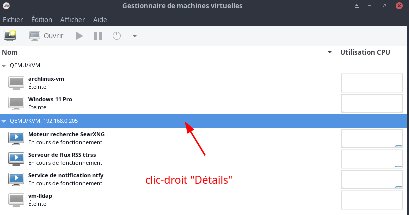  
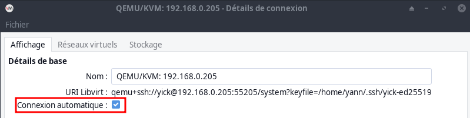  

### Wing personal python IDE

**Wing personal python IDE** &rarr; [Téléchargement](https://wingware.com/downloads/wing-personal) 

```
# Décompression de la version téléchargée
tar xjvf wing-personal-11.0.2.0-linux-x64.tar.bz2
# Passage en root
sudo -s
# Lancement procédure installation
cd wing-personal-11.0.2.0-linux-x64
./wing-install.py
```

Déroulement de la commande 

```
Where do you want to install the support files for Wing Personal (default
     = /usr/local/lib/wing-personal9)? 
/usr/local/lib/wing-personal10 does not exist, create it (y/N)? y
Where do you want to install links to the Wing Personal startup scripts
     (default = /usr/local/bin)? 
[...]
Writing file-list.txt
Icon/menu install returned err=0
Done installing.  Make sure that /usr/local/bin is in your path and type
     "wing-personal10" to start Wing Personal.
```

Effacer les fichiers

```
# Suppression dossier et fichier
cd ..
rm -rf wing-personal*
# sortie root
exit
```

Installer python pip pipx

    yay -S python-pip python-pipx

### Go

Archlinux Go

    yay -S go
    go version

*go version go1.23.3 linux/amd64*

### NodeJS et nvm

Archlinux Node.js npm

    yay -S nodejs npm
    node --version && npm --version

v23.1.0  
10.9.0  

**OPTION**  
NVM, également appelé « Node Version Manager », est un outil utilisé pour installer et gérer plusieurs versions de Node.js sur le système.  
Installer la dernière version de NVM à l'aide de la commande suivante  

    curl -o- https://raw.githubusercontent.com/nvm-sh/nvm/v0.39.2/install.sh | bash
    source ~/.bashrc

Vérifier

    nvm --version

*0.39.2*

**Installer Node.js avec NVM**  
Pour lister toutes les versions disponibles Node.js 

    nvm list-remote

Vous obtiendrez une liste de toutes les versions

```
        v22.9.0
       v22.10.0
       v22.11.0   (Latest LTS: Jod)
        v23.0.0
        v23.1.0
        v23.2.0
        v23.3.0
```

Pour installer la dernière version de Node.js  
`nvm install node`

Pour installer la dernière version stable de Node.js  
`nvm install --lts`

Pour installer une version spécifique de Node.js  
`nvm install 23.2.0`

Pour lister toutes les versions installées de Node.js  
`nvm ls`

Pour modifier la version Node.js par défaut à 19.0.0  
`nvm utilisation 23.2.0`

## Sauvegardes

**Sauvegardes locales**

[Sauvegardes locales avec systemd utilisateur service et timer](/posts/Sauvegardes_locales_avec_systemd_utilisateur_service_et_timer/)

La sauvegarde démarre 3 minutes après la mise sous tension de PC1

Les logs : `journalctl --user -u savyann.service`  
Liste des timers : `systemctl --user list-timers --all`

**BorgBackup**

BorgBackup est installé et fonctionnel en local 

Fichiers contenant les paramètres pour une exécution de borg

Dépôt distant : ~/sharenfs/pc1/.borg/pc1.repository  
Passphrase: ~/sharenfs/pc1/.borg/pc1.passphrase  
Exclusions: ~/sharenfs/pc1/.borg/pc1.exclusions  

Pour une utilisation avec un stockage distant , il faut créer un jeu de clé  

1. [Créer utilisateur borg](/posts/BorgBackup_entre_serveurs/#créer-utilisateur-borg-1)
2. [Clés ssh borg](/posts/BorgBackup_entre_serveurs/#clés-ssh-borg-1)
3. [Ajout clé publique borg à la boîte de stockage](/posts/BorgBackup_entre_serveurs/#ajout-clé-publique-au-serveur-borg)

## Maintenance

### DNS - home.arpa

[Domaine home.arpa](/posts/home.arpa/)

Configuration manuelle du fichier /etc/resolv.conf

*Un serveur DNS Unbound est en service sur le serveur cwwk debian 12 à l'adresse 192.168.0.205*

Par défaut, NetworkManager met à jour dynamiquement le fichier /etc/resolv.conf avec les paramètres DNS à partir des profils de connexion NetworkManager actifs. Cependant, vous pouvez désactiver ce comportement et configurer manuellement les paramètres DNS dans /etc/resolv.conf.

Avant modification: `/etc/resolv.conf`

```
# Generated by NetworkManager
nameserver 192.168.0.254
nameserver 9.9.9.9
nameserver fd0f:ee:b0::1
# NOTE: the libc resolver may not support more than 3 nameservers.
# The nameservers listed below may not be recognized.
nameserver 1.1.1.1
```


Procédure

En tant qu'utilisateur racine, créez le fichier `/etc/NetworkManager/conf.d/90-dns-none.conf` avec le contenu suivant en utilisant un éditeur de texte 

```
[main]
dns=none
```

Redémarrer le service 

    sudo systemctl restart NetworkManager

Supprimer le commentaire généré par NetworkManager de `/etc/resolv.conf` pour éviter toute confusion

```
nameserver 192.168.0.205
nameserver 1.1.1.1
nameserver 9.9.9.9
```

Rechargez le service NetworkManager :

    sudo systemctl reload NetworkManager

Affiche le fichier /etc/resolv.conf 

    cat /etc/resolv.conf

*Si vous avez désactivé le traitement DNS avec succès, NetworkManager n'a pas remplacé les paramètres configurés manuellement.*

Vérifier si le serveur DNS est pris en compte: `dig xoyize.xyz`  
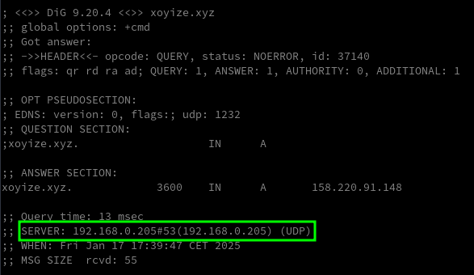

Le réseau local cwwk.home.arpa: `dig cwwk.home.arpa`  
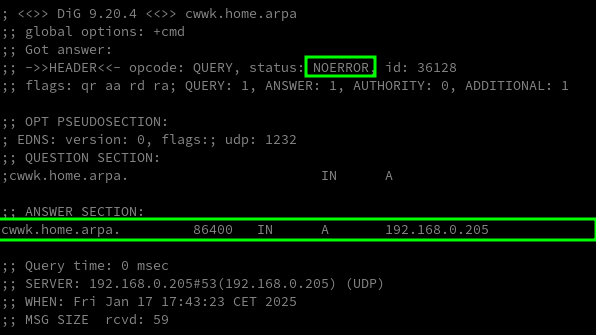

### Démarrer Eteindre une machine sur le réseau

[Démarrer ou éteindre une machine distante sur le réseau via ssh et "wake on lan"](/posts/demarrer_eteindre_une_machine_via_ssh_et_wake_on_lan/)

Copier la clé SSH d'accès à la machine Lenovo Proxmox vers /usr/local/bin et se connecter pour valider la clé

```shell
sudo -s
cp .ssh/lenovo-ed25519 /usr/local/bin/
/usr/bin/ssh root@192.168.0.215 -p 55215 -i /usr/local/bin/lenovo-ed25519
```

Les fichiers

```
# /etc/systemd/system/stop_prox.service

[Unit]
Description=Exécuter commande seulement si arrêt
DefaultDependencies=no
Conflicts=reboot.target
Before=poweroff.target halt.target shutdown.target
Requires=poweroff.target

[Service]
Type=oneshot
ExecStart=/usr/bin/ssh root@192.168.0.215 -p 55215 -i /usr/local/bin/lenovo-ed25519 'systemctl poweroff'
RemainAfterExit=yes

[Install]
WantedBy=shutdown.target

# /etc/systemd/system/run-script-with-delay.timer
[Unit]
Description=Exécuter script 2 min après démarrage (timer)

[Timer]
OnBootSec=2min

[Install]
WantedBy=default.target

# /etc/systemd/system/run-script-with-delay.service
[Unit]
Description=Exécuter script 2 min après démarrage

[Service]
Type=oneshot
ExecStart=/usr/bin/wakeonlan -i 192.168.0.255 00:23:24:c9:06:86
TimeoutStartSec=0

```

### Disque SSD 480Go /mnt/ssd

Ajout disque SSD sata 480Go

Identifer le disque: `lsblk`

```
NAME                                          MAJ:MIN RM   SIZE RO TYPE  MOUNTPOINTS
sda                                             8:0    0 447,1G  0 disk  
```

Effacement et formatage disque

```shell
# Ceci effacera de manière irréversible toutes les données disque
sgdisk --zap-all /dev/sda
# Partition entière Linux (code 8300) système de fichier EXT4
sgdisk --clear --new=1:0:0 --typecode=1:8300 /dev/sda
# Système de fichier EXT4
mkfs.ext4 /dev/sda1
```

Créer un point de montage

```shell
sudo mkdir -p /mnt/ssd  
```

UUID: sudo blkid |grep '/dev/sda1'

```
/dev/sda1: UUID="e33c1e26-5c19-4647-980b-98db4d92591b" BLOCK_SIZE="4096" TYPE="ext4" PARTLABEL="Linux filesystem" PARTUUID="c153121f-615f-4fd5-aad7-e83501798e1f"
```

Ajouter au fichier `/etc/fstab`

```
# /dev/sda1
UUID=e33c1e26-5c19-4647-980b-98db4d92591b /mnt/ssd auto defaults,nofail,x-systemd.automount 0 2
```

Recharger la configuration et le montage

```shell
sudo systemctl daemon-reload 
sudo mount -a
```


---

## En cours

### Dbeaver 

*DBeaver est basé sur le framework Eclipse, il est open source et il supporte plusieurs types de serveurs de bases de données comme : MySQL, SQLite, DB2, PostgreSQL, Oracle...*

Version java installée : `java --version`

```
openjdk 23 2024-09-17
OpenJDK Runtime Environment (build 23)
OpenJDK 64-Bit Server VM (build 23, mixed mode, sharing)
```

Installation

    yay -S dbeaver

```
Sync Explicit (1): dbeaver-24.2.1-1
résolution des dépendances…
:: Il y a 6 fournisseurs disponibles pour java-runtime>=17 :
:: Dépôt extra
   1) jdk-openjdk  2) jdk17-openjdk  3) jdk21-openjdk  4) jre-openjdk  5) jre17-openjdk  6) jre21-openjdk

Entrer un nombre (par défaut, 1 est sélectionné): 1
```

### MariaDB 

[MariaDB archlinux](/posts/MariaDB-sur-Debian-Stretch/#archlinux)

Résumé des commandes en mode su

```shell
pacman  -S mariadb
mysql_install_db --user=mysql --basedir=/usr --datadir=/var/lib/mysql
systemctl enable mariadb --now
systemctl status --no-pager --full mariadb 
```

Sécuriser

    sudo mysql_secure_installation

`Valider tous les choix par défaut SAUF le changement de mot de passe (n)`{: .prompt-info }

Dbeaver accès refusé  
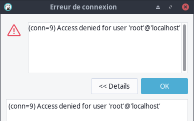{:width="300"}

Correction en mode su

Ouvrir MariaDB

```bash
sudo -s
mysql -u root
```

Exécuter le sql : `SELECT host, user, password FROM mysql.user;`  
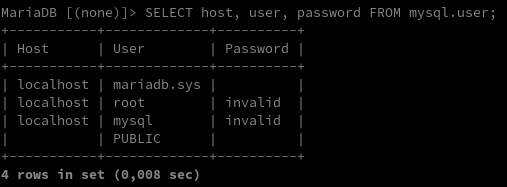  
Si le mot de passe de votre compte root est invalide (ou autre chose que la cellule vide)  
Définir le mot de passe : `ALTER USER 'root'@'localhost' IDENTIFIED BY 'Mot_passe_root_MariaDB';`  
Vérifier : `SELECT host, user, password FROM mysql.user;`  
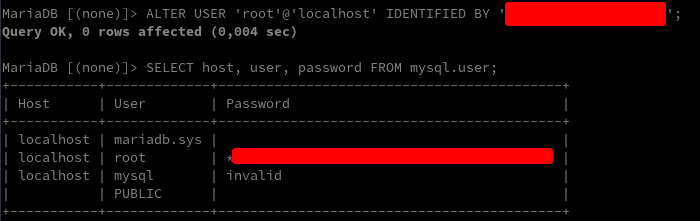  
Sortie : `exit;`

### Mise à jour , si erreur de paquet ou signature PGP

En cas d'erreur de paquet ou signature PGP 

    sudo pacman -S endeavouros-keyring archlinux-keyring

Mise à jour impossible avec des erreurs de téléchargement

    sudo rm -r /var/cache/pacman/pkg/*

### Etat des lieux

Ajouter un alias dans le fichier `~/.bash_aliases`

    alias etat='$HOME/scripts/etat_des_lieux.sh'

Recharger et exécuter

    source ~/.bash_aliases
    etat

### Outil cockpit

[Administrer sa machine avec Cockpit (Fedora, Red Hat et dérivées)](https://www.linuxtricks.fr/wiki/administrer-sa-machine-avec-cockpit-fedora-red-hat-et-derivees)

Installation

    yay -S cockpit cockpit-storaged cockpit-machines

Gestion par interface web <https://cockpit.rnmkcy.eu>  
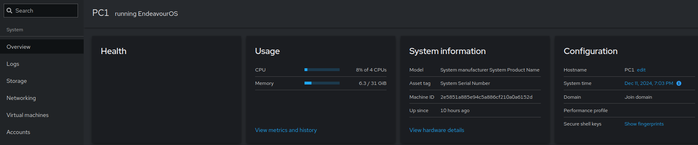

`Liaison SSH avec clés entre le interface web cockpit et la machine PC1`{: .prompt-info }

### Connexion réseau 192.168.70.0/24

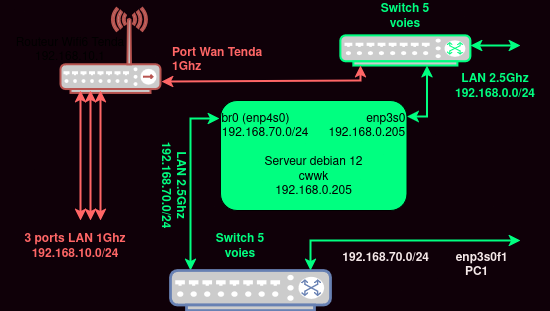  

Modifier le réseau via NetworkManager le port ethernet **enp3s0f0**   
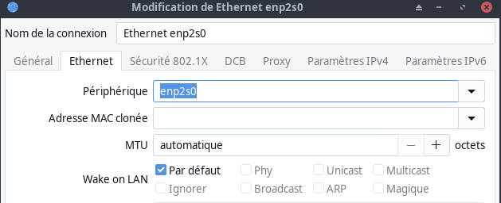{:width="300"}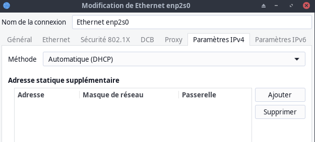{:width="300"}

Les routes: `ip a`

```
default via 192.168.0.254 dev enp2s0 proto dhcp src 192.168.0.20 metric 101 
default via 192.168.70.1 dev enp3s0f0 proto dhcp src 192.168.70.13 metric 102 
default via 192.168.10.1 dev bridge0 proto dhcp src 192.168.10.70 metric 425 
192.168.0.0/24 dev enp2s0 proto kernel scope link src 192.168.0.20 metric 101 
192.168.10.0/24 dev bridge0 proto kernel scope link src 192.168.10.70 metric 425 
192.168.70.0/24 dev enp3s0f0 proto kernel scope link src 192.168.70.13 metric 102 
```

### Liens issus de la VM ttrss

Dans la machine virtuelle ttrss, création d'un fichier markdown de liens remarquables [(Liens - ttrss.md)](/posts/KVM-Alpine-Linux/#liens---ttrssmd)

Importation du fichier ttrss.md dans le générateur statique   
Script `$HOME/scripts/articles_remarquables_ttrss`

<details>
<summary><b>Etendre Réduire</b></summary>
  
#!/bin/bash
set -euo pipefail
trap 'echo "Une erreur est survenue."; exit 1' ERR

echo "Connexion SSH VM Alpine ttrss"
echo "Importation fichier ttrss.md dans /tmp/"
scp -o ProxyCommand="ssh -W %h:%p -p 55205 -i /home/yann/.ssh/yick-ed25519 yick@192.168.0.205" -i /home/yann/.ssh/ttrss_alpine-vm  -P 55217 aluser@192.168.100.60:/home/aluser/ttrss.md /tmp/
LIENS_TTRSS="/tmp/liens_ttrss.md"
echo "Création fichier $LIENS_TTRSS"
cat << EOF > $LIENS_TTRSS
---
layout: article
titles: Liens ttrss au format HTML
---

/ lang="fr">
  <body>
<head>
  <meta charset="utf-8">
  <title>Doc Html</title>
</head>
    <div class="search-bar">
      <div class="search-box js-search-box">
        <input type="text" id="saisie-recherche" onkeyup="rechercheFonction()" placeholder="Rechercher..." title="Saisir" autofocus>
      </div>
    </div>
<ul id="articlesTTRSS">
EOF
echo "Ajout des liens /tmp/ttrss.md"
cat /tmp/ttrss.md >> $LIENS_TTRSS
echo "Ajout Javascript"
cat << EOF >> $LIENS_TTRSS
</ul>

  <button onclick="topFunction()" id="myBtn" title="Haut de page">&uarr;</button>
	<script>
	//Get the button
	var mybutton = document.getElementById("myBtn");
	
	// When the user scrolls down 20px from the top of the document, show the button
	window.onscroll = function() {scrollFunction()};

	function scrollFunction() {
	  if (document.body.scrollTop > 20 || document.documentElement.scrollTop > 20) {
	    mybutton.style.display = "block";
	  } else {
	    mybutton.style.display = "none";
	  }
	}
	
	// When the user clicks on the button, scroll to the top of the document
	function topFunction() {
	  document.body.scrollTop = 0;
	  document.documentElement.scrollTop = 0;
	}


	function rechercheFonction() {
	    var input, filter, ul, li, a, i, txtValue;
	    input = document.getElementById("saisie-recherche");
	    filter = input.value.toUpperCase();
	    ul = document.getElementById("articlesTTRSS");
	    li = ul.getElementsByTagName("li");
	    for (i = 0; i < li.length; i++) {
	        a = li[i].getElementsByTagName("a")[0];
	        txtValue = a.textContent || a.innerText;
	        if (txtValue.toUpperCase().indexOf(filter) > -1) {
	            li[i].style.display = "";
	        } else {
	            li[i].style.display = "none";
	        }
	    }
	}
	// Cacher le champ de recherche
	var mysearchbox = document.getElementById("searchbox");
	mysearchbox.style.visibility = "hidden";
	</script>
  </body>
</>
EOF
echo "Copier le fichier liens_ttrss.md dans le dossier yannstatic"
echo "cp $LIENS_TTRSS /srv/media/yannstatic/liens_ttrss.md"
cp $LIENS_TTRSS /srv/media/yannstatic/liens_ttrss.md


</details>


Créer un alias **ttrss** dans le fichier `$HOME/.bash_aliases`

```bash
alias ttrss='bash /home/yann/scripts/articles_remarquables_ttrss'
```

Activer

    source $HOME/.bash_aliases

