+++
title = 'Android studio + Développement Android auto'
date = 2025-08-01
categories = []
+++
## Android studio


### Prérequis

Les paquets **base-devel** et **arch-install-scripts** installés

### Installer android studio sur Archlinux

Aller dans le dossier devel: `cd ~/media/devel`

Cloner le dépôt

```shell
git clone https://aur.archlinux.org/android-studio.git
```

Changer dans le répertoire

```shell
cd android-studio
```

Créer le paquet

```shell
makepkg
```

Obtenir le nom du paquet en listant le répertoire

```shell
ls *.zst
```

*android-studio-2025.1.2.11-1-x86_64.pkg.tar.zst*

Installer avec pacman

```shell
sudo pacman -U android-studio-2025.1.2.11-1-x86_64.pkg.tar.zst
```

Ouvrir le lanceur 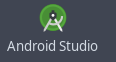{:width="80" .normal} pour finaliser l'installation

A la fin de l'-'opération  
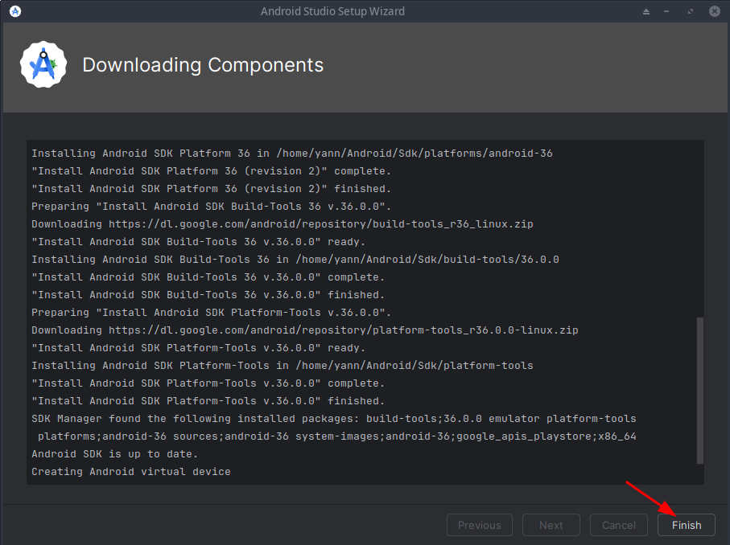{: .normal}  

## Android auto


Création projet "Android auto"

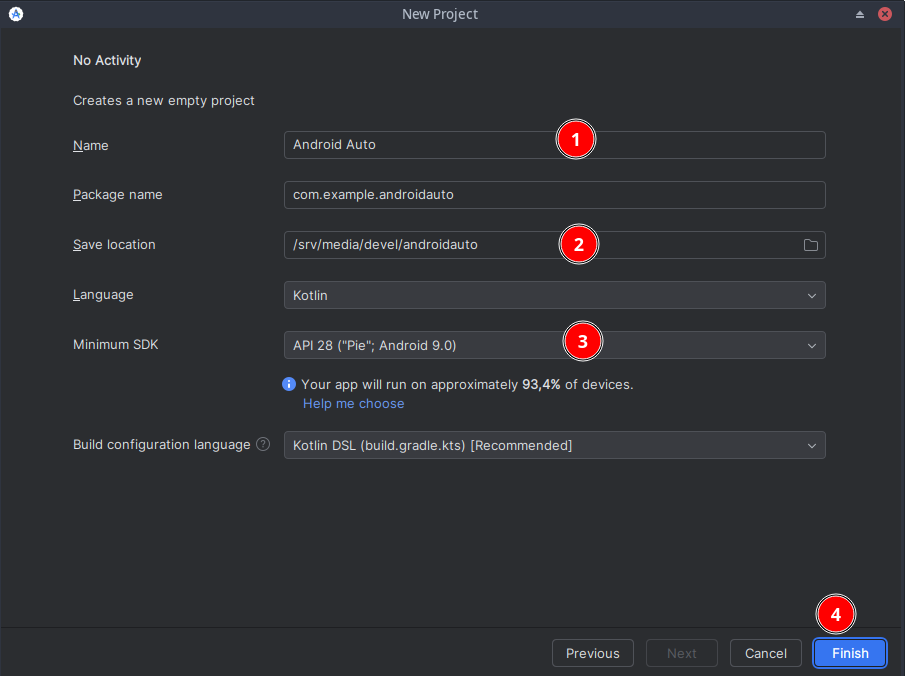{: .normal}  
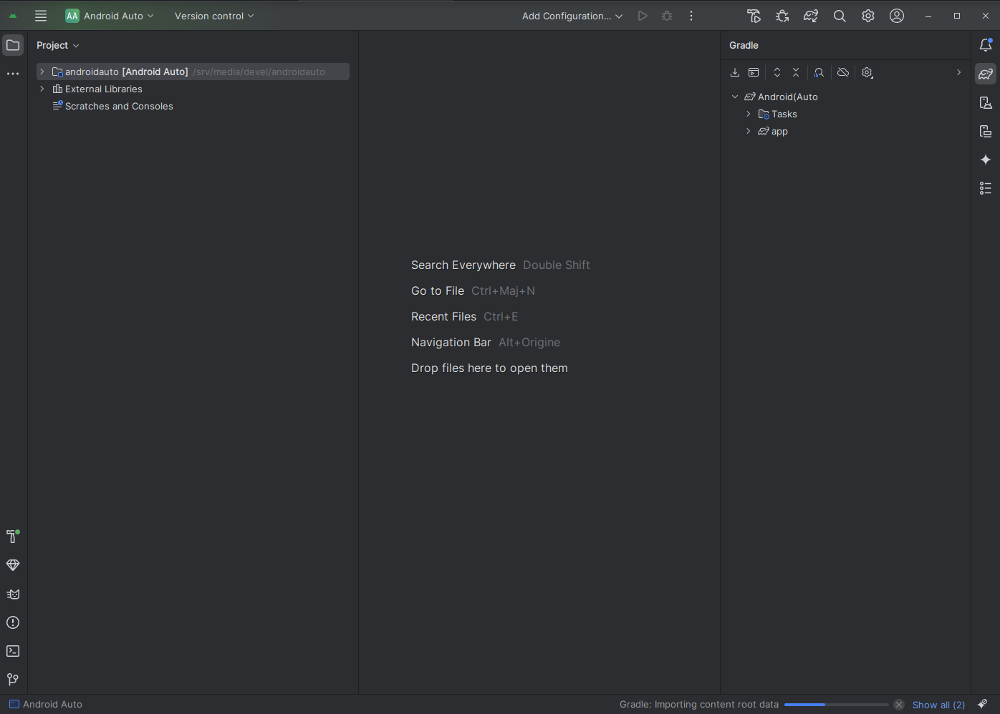{: .normal}  

[Effectuer des tests avec l'unité principale pour ordinateur](https://developer.android.com/training/cars/testing/dhu?hl=fr)

## Installer la DHU

Procédez comme suit pour installer la DHU sur votre ordinateur de développement :

1.    Activer le mode développeur sur un appareil mobile équipé d'Android 9 (niveau d'API 28) ou supérieure, comme décrit dans la section [Configurer les applications pour les développeurs sur l'appareil options](https://developer.android.com/studio/debug/dev-options?hl=fr).
*    Compilez et installez votre application sur l'appareil.
*    Installez [Android Auto](https://play.google.com/store/apps/details?id=com.google.android.projection.gearhead&hl=fr) sur l'appareil. Si Android Auto est déjà installé, assurez-vous d'utiliser la dernière version.
*    Dans Android Studio, ouvrez SDK Manager et accédez à l'onglet SDK Tools, puis téléchargez le package Android Auto Desktop Head Unit Emulator.

{: .normal}  
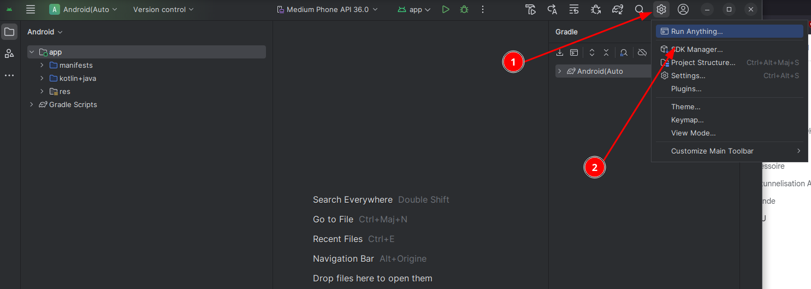{: .normal}  
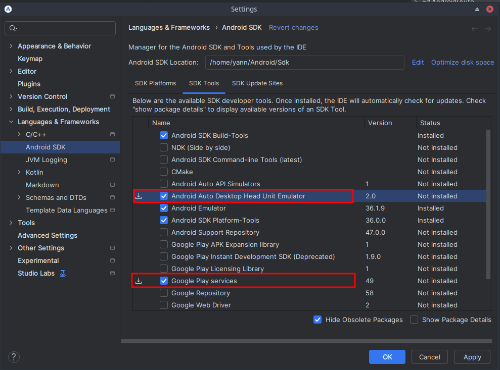{: .normal}  

>La DHU est installée dans le répertoire SDK_LOCATION/extras/google/auto/.  
`~/Android/Sdk/extras/google/auto/`
{: .prompt-tip }

Sur les systèmes Linux ou macOS, exécutez la commande suivante dans ce répertoire pour vous assurer que le binaire de la DHU est exécutable :

```shell
chmod +x ./desktop-head-unit
```

Remarque : La DHU inclut une bibliothèque libusb, qui est téléchargée dans le même répertoire. Cette bibliothèque doit rester au même emplacement que le fichier exécutable de la DHU pour fonctionner correctement.

### Étapes supplémentaires pour Linux

Si vous exécutez la version 2.x de la DHU sur un système Linux, vous devez installer des bibliothèques supplémentaires. Le binaire de la DHU dépend de GLIBC version 2.32 ou ultérieure. Pour vérifier la version GLIBC de votre système, exécutez la commande suivante :

```shell
ldd --version
```

*ldd (GNU libc) 2.42*

Si elle est antérieure à la version 2.32, remplacez GLIBC par la version 2.32 ou une version ultérieure, ce qui peut nécessiter une mise à niveau du système d'exploitation vers une version compatible avec la version 2.32 (ou ultérieure) de GLIBC.

Vous devez également installer les bibliothèques libc++1 et libc++abi1. La procédure d'installation varie en fonction de votre distribution Linux. Par exemple, sur les distributions Linux dérivées de Debian, vous pouvez installer les bibliothèques à l'aide de la commande suivante :

```shell
yay -S libc++ libc++abi
```

## Exécuter la DHU

Après avoir installé la DHU, vous pouvez tester vos applications Android Auto en <u>connectant votre appareil mobile et votre station de travail via un câble USB</u>. Pour exécuter la DHU, connectez votre appareil mobile à un ordinateur de développement à l'aide du mode accessoire (recommandé pour la version 2.x de la DHU) ou de la tunnelisation ADB.

Ouvrir **Android studio** sur le projet **Android auto**   
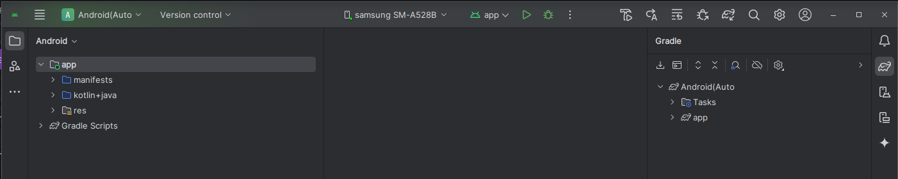{: .normal}  


### Activer le mode développeur d'Android Auto

En plus des options pour les développeurs Android (utilisables à la fois sur Android Auto et sur Android Automotive OS), Android Auto dispose de son propre mode développeur. Ce dernier peut être utilisé pour améliorer l'expérience de développement. Pour l'activer, procédez comme suit :

1.    Ouvrez les paramètres d'Android Auto.
      *  Android 10 ou version ultérieure : sur l'appareil, appuyez sur **Paramètres > Applis et notifications > Afficher toutes les applications > Android Auto > Paramètres avancés > Paramètres supplémentaires dans l'application**.
      *  Android 9 ou version antérieure : dans l'application Android Auto, appuyez sur le menu, puis sur Settings (Paramètres).

*    Faites défiler la page jusqu'à la section **About (À propos)** en bas de l'écran, puis appuyez sur **Version** pour afficher toutes les informations concernant la version et les autorisations.

*    Appuyez 10 fois sur la section **Infos sur les versions et autorisations**.  
La boîte de dialogue **Activer les paramètres de développement** s'affiche.

*    Appuyez sur **OK**.

>Le mode développeur est maintenant activé, et vous pouvez accéder aux options pour les développeurs dans le menu à développer. Vous ne devez activer le mode développeur qu'une seule fois. Pour quitter le mode développeur, utilisez l'option correspondante dans le menu déroulant de la barre d'application.


### Se connecter en mode accessoire

Android Auto permet de se connecter à la version 2.x de la DHU avec le protocole Android Open Accessory (AOA) à l'aide de la commande suivante :

```shell
./desktop-head-unit --usb
```

Par défaut, la DHU analyse la liste des appareils USB disponibles et tente de se connecter au premier appareil compatible. Pour cibler un appareil spécifique, incluez son ID dans la commande --usb, comme suit :

```shell
./desktop-head-unit --usb=[DEVICE_ID]
```

Remarque :Sous Windows, cette fonctionnalité peut nécessiter l'installation du pilote WinUSB. avec votre appareil mobile et peut interférer avec la connexion ADB. Si le La DHU ne détecte pas l'appareil mobile et ne s'y connecte pas. Essayez de l'exécuter adb kill-server avant de démarrer la DHU ou d'utiliser l'autre dans la section suivante.

### Se connecter à l'aide de la tunnelisation ADB

Cette méthode nécessite la configuration d'une connexion au serveur de l'unité principale Android Auto via Android Debug Bridge (adb). Pour configurer la tunnelisation et exécuter la DHU, procédez comme suit :

1.    Activez le mode développeur d'Android Auto si ce n'est pas déjà fait.

2.    Si le serveur de l'unité principale n'est pas déjà en cours d'exécution, ouvrez le menu à développer, puis sélectionnez Start head unit server (Démarrer le serveur de l'unité principale), comme illustré dans la figure 1.  
Sur l'appareil, un service de premier plan apparaît dans la zone de notification et indique que le serveur est en cours d'exécution, comme illustré dans la figure 2.  
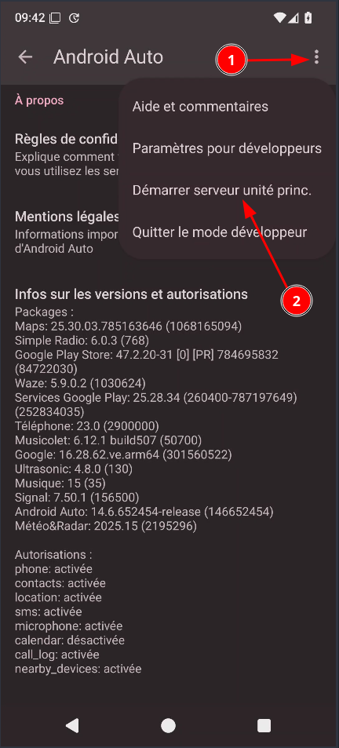{:width="250" .normal}  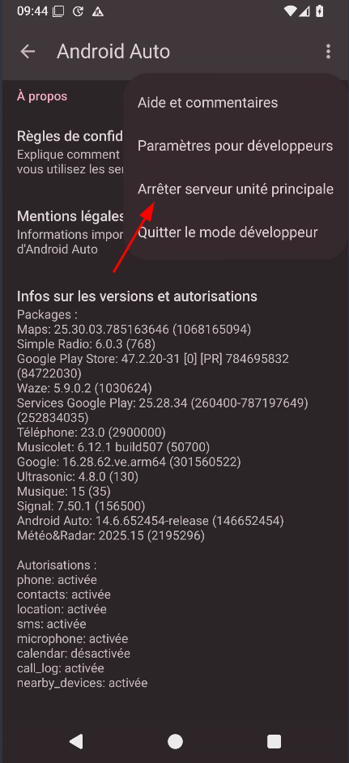{:width="250" .normal}  
En graphique  
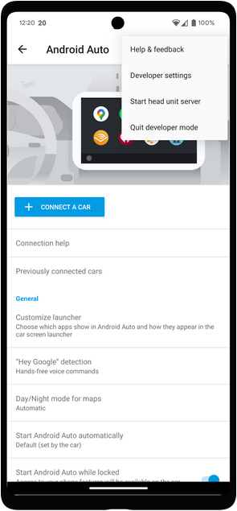{:width="250" .normal}  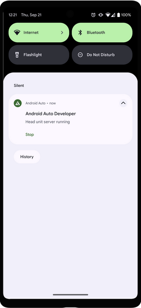{:width="250" .normal}  

*  Dans l'application Android Auto, appuyez sur Previously connected cars (Véhiculess connectées auparavant) en haut de la page Settings (Paramètres)  
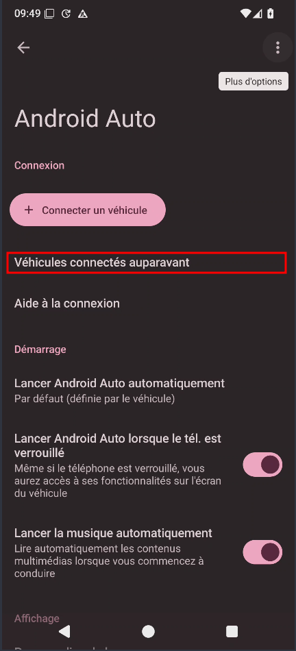{:width="250" .normal}  
puis assurez-vous que l'option Add new cars to Android Auto (Ajouter des voitures à Android Auto) est activée.  
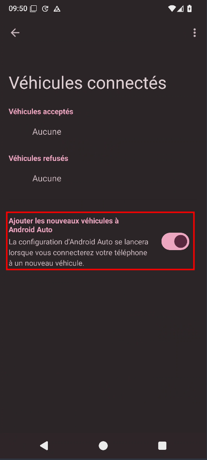{:width="250" .normal}  

* Connectez l'appareil mobile à l'ordinateur de développement via un câble USB.

* Assurez-vous que l'écran de l'appareil mobile est déverrouillé pour que la DHU puisse être lancée.

* Sur la machine de développement, exécutez la commande adb suivante pour transférer les connexions de socket à partir du port 5277 de la machine de développement vers le même numéro de port sur l'appareil Android. Cette configuration permet à la DHU de se connecter au serveur de l'unité principale exécuté sur l'appareil mobile via un socket TCP.

    ```shell
    adb forward tcp:5277 tcp:5277
    ```

* Pour démarrer la DHU, exécutez la commande desktop-head-unit.exe (sous Windows) ou ./desktop-head-unit (sous macOS ou Linux) à partir du répertoire SDK_LOCATION/extras/google/auto/ :

```shell
# 1 Lancer Android studio sur projet Android auto
# 2 Mobile, ouvrir le menu à développer android auto, puis sélectionnez Start head unit server (Démarrer le serveur de l'unité principale)
# cd SDK_LOCATION
cd ~/Android/Sdk/extras/google/auto/
# Mobile connecté USB avec ordinateur
adb forward tcp:5277 tcp:5277
# Exécuter (macOS ou Linux)
./desktop-head-unit
```

Si vous connectez l'appareil mobile à la DHU pour la première fois, consultez l'écran de l'appareil mobile pour accepter les conditions d'utilisation et ajuster les paramètres d'autorisation si nécessaire.
  
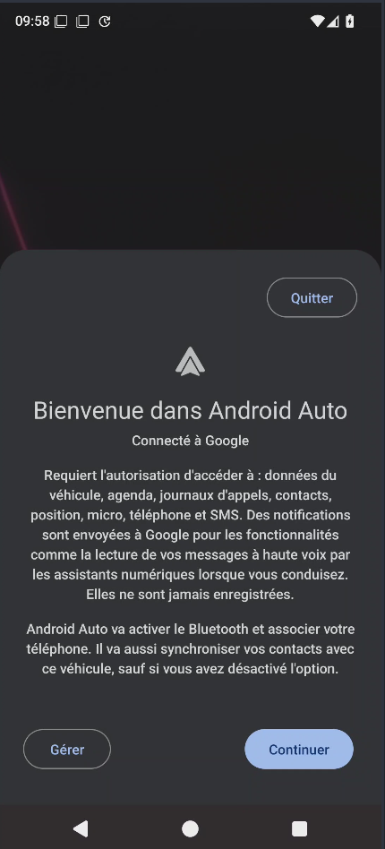{:width="250" .normal}  

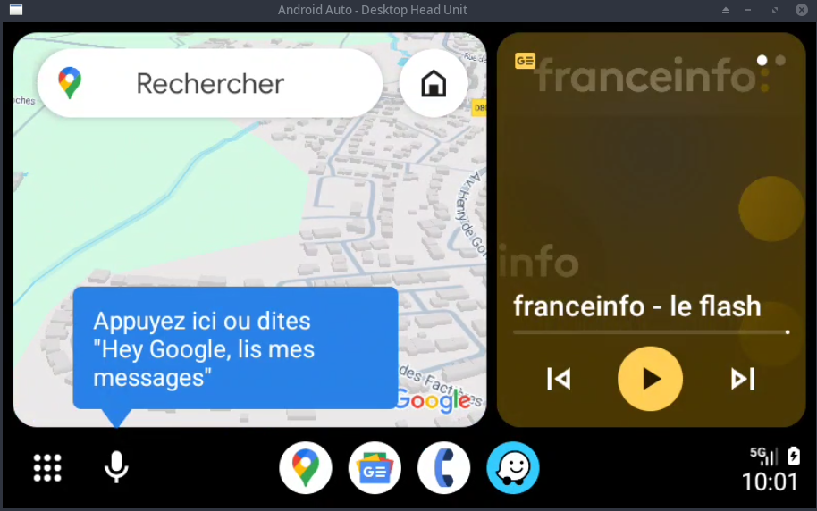{: .normal}  
DHU en cours d'exécution sur un ordinateur de développement


Une fois la DHU démarrée, vous pouvez exécuter et tester votre application à l'aide des commandes de la console DHU ([Guide de l'utilisateur de la DHU](https://developer.android.com/training/cars/testing/dhu?hl=fr#dhu-commands)).


## Annexe

Répertoires

* Installation Android studio: `/opt/android-studio`  
* Projet Android auto: `$HOME/media/devel/androidauto`  
* Mise à jour Android studio: `$HOME/media/devel/android-studio`  
* Exécution DHU (émulation android auto): `$HOME/Android/Sdk/extras/google/auto`

### Mise à jour Android studio

Mises à jour en exécutant les commandes suivantes

```shell
cd ~/media/devel/android-studio
git pull
makepkg
# relever le nom du paquet
ls *.zst
# Installer avec pacman
sudo pacman -U android-studio-xxxx.x.x.xx-x-x86_64.pkg.tar.zst
```

### Emulation android auto

Mobile, ouvrir le menu à développer android auto **Paramètres > Applications > Voir toutes les applis > Android Auto > Paramètres supplémentaires dans l'application**  
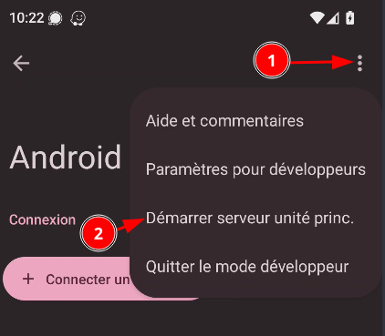{:width="250" .normal}  
puis sélectionnez **Démarrer le serveur de l'unité principale** (Start head unit server) 


Script de connexion: `$HOME/scripts/androidauto.sh`

```shell
#!/bin/bash

# androidauto.sh

echo "Emulation android auto"
echo "Le mobile doit être relié l'ordinateur avec un câble USB"
echo "Paramétrage Mobile 'Android Auto' --> 'Démarrer le serveur de l'unité principale'"


echo "Ordinateur, ouvrir 'Android studio' sur le projet 'Android auto'"
echo ""
# Attente appui touche
echo "Appuyez sur une touche clavier pour continuer"
while [ true ] ; do
 read -n 1
 if [ $? = 0 ] ; then
  # Répertoire scripts Android SDK
  cd $HOME/Android/Sdk/extras/google/auto/  
  # Redirection des ports
  adb forward tcp:5277 tcp:5277
  # Lancement émulation
  ./desktop-head-unit
 fi
done
```

Le rendre exécutable

    chmod +x $HOME/scripts/androidauto.sh

Alias 

```
alias androidauto='sh $HOME/scripts/androidauto.sh'
```

