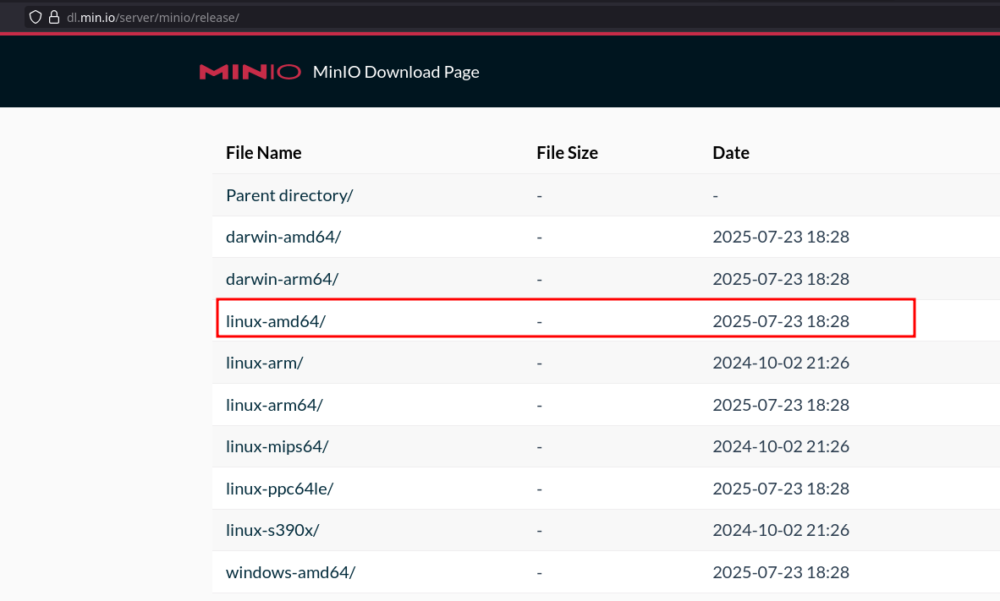
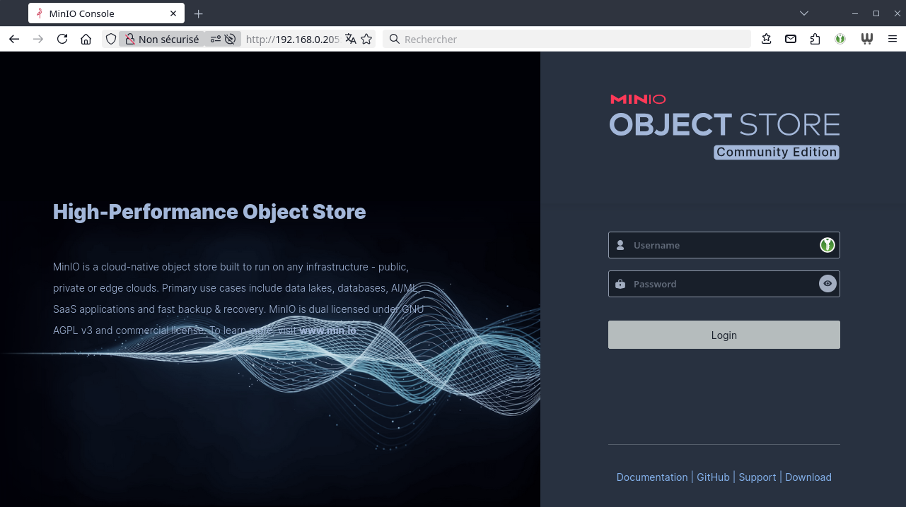
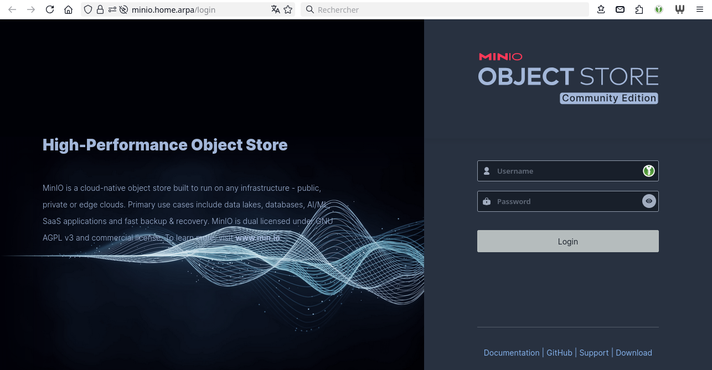

+++
title = 'Minio + Plakar'
date = 2025-08-06
categories = ['sauvegarde', 'html']
+++
*Solution de sauvegarde utilisant Plakar sur un serveur de stockage S3 MinIO*

* [Minio , un serveur de stockage S3 opensource](/posts/Minio_serveur_stockage_S3_opensource/)
* [Plakar - Solution de backup sous Linux](/posts/Plakar_sauvegarde_restauration/)
* [Plakar - Pack d'intégration MinIO](/posts/Plakar-Pack_intégration_MinIO/)
    * <https://www.plakar.io/docs/main/integrations/minio/>

## MinIO

*minio est une solution de stockage d’objets open source, compatible avec Amazon S3, qui permet de stocker des données non structurées telles que des photos, des vidéos, des fichiers de sauvegarde et bien plus encore. minio est conçu pour être simple à utiliser et à déployer, tout en offrant des performances élevées et une grande fiabilité. Voici comment vous pouvez installer minio sur un système Linux.*

* [minio , un serveur de stockage S3 opensource !](https://ninjalinux.com/2024/07/16/minio-un-serveur-de-stockage-s3-opensource/)
* [Hébergez votre propre S3 avec minio](https://cto-externe.fr/actualites-infrastructure/creer-stockage-s3-minio/)
* [Créer son premier stockage S3 avec minio en mode Single-Node Single-Drive](https://www.aukfood.fr/creer-son-premier-stockage-s3-avec-minio-en-mode-single-node-single-drive/)

{:width="500"}

### Binaire minio server  

[Deploy minio on Ubuntu Linux](https://docs.min.io/community/minio-object-store/operations/deployments/baremetal-deploy-minio-on-ubuntu-linux.html)  
Le site de téléchargement <https://dl.min.io/server/minio/release/>  



Installation

```shell
# Télécharger le binaire
wget https://dl.min.io/server/minio/release/linux-amd64/minio
# Rendre le binaire exécutable
chmod +x minio
# Déplacer le binaire
sudo mv minio /usr/local/bin/
```

Version: `minio --version`

```
minio version RELEASE.2025-07-23T15-54-02Z (commit-id=7ced9663e6a791fef9dc6be798ff24cda9c730ac)
Runtime: go1.24.5 linux/amd64
License: GNU AGPLv3 - https://www.gnu.org/licenses/agpl-3.0.html
Copyright: 2015-2025 minio, Inc.
```

### Utilisateur minio-user

En mode su

Créer un utilisateur et un groupe pour minio

```shell
groupadd -r minio-user
useradd -M -r -g minio-user minio-user
```

### Répertoire de stockage

Connecter le disque externe SSD 1To sur un port USB3 de la machine cwwk

**EFFACEMENT COMPLET disque SSD (OPTION)**

Relever le mappage des disques : `lsblk` 

```
NAME                   MAJ:MIN RM   SIZE RO TYPE MOUNTPOINTS
sda                      8:0    0 953,9G  0 disk 
├─sda1                   8:1    0     1G  0 part 
└─sda2                   8:2    0   700G  0 part 
```

Le disque SSD de 1To est sur `/dev/sda`

```shell
# Zapper le disque,
# Attention** Ceci effacera de manière irréversible toutes les données de votre disque
sgdisk --zap-all /dev/sda
# Partition entière Linux (code 8300) système de fichier EXT4
sgdisk --clear --new=1:0:0 --typecode=1:8300 /dev/sda
# Format fichier EXT4
mkfs.ext4 /dev/sda1
```

**Créer des répertoires pour stocker les données**

Relever UUID: `sudo blkid |grep '/dev/sda1'`

```
/dev/sda1: UUID="df75dcf5-0ba9-46e2-ae92-da7809b8434c" BLOCK_SIZE="4096" TYPE="ext4" PARTUUID="bbf5f51a-0cf2-4748-be70-338644520f33"
```

Créer un point de montage

```shell
sudo mkdir -p /mnt/plakar  
```

Montage `/etc/fstab`

```
# USB3 SSD 1To
UUID=df75dcf5-0ba9-46e2-ae92-da7809b8434c /mnt/plakar auto defaults,nofail,x-systemd.automount 0 2
```

Recharge configuration et montage

```shell
sudo systemctl daemon-reload 
sudo mount -a
# Supprimer lost+found
sudo rm -r /mnt/plakar/lost+found/
```

### Configuration minio

>Serveur **cwwk**, le stockage sur `/mnt/plakar` est utilisé
{: .prompt-tip }

Configurer les permissions

```shell
sudo chown -R minio-user:minio-user /mnt/plakar
```

Créer un fichier de configuration `/etc/minio`

```shell
sudo mkdir -p /etc/minio
sudo chown minio-user:minio-user /etc/minio
```

Créer le fichier de configuration par défaut: `sudo nano /etc/default/minio`

```
# Set the volume MinIO uses at startup
#
# The following specifies the drive or folder path

MINIO_VOLUMES="/mnt/plakar"

# Set all MinIO server command-line options
#
# The following explicitly sets the MinIO Console listen address to
# port 9001 on all network interfaces.
# The default behavior is dynamic port selection.

MINIO_OPTS="--console-address :9001"
# Set the root username.
# This user has unrestricted permissions to perform S3 and
# administrative API operations on any resource in the deployment.
#
# Defer to your organizations requirements for superadmin user name.

MINIO_ROOT_USER=minioadmin

# Set the root password
#
# Use a long, random, unique string that meets your organizations
# requirements for passwords.

MINIO_ROOT_PASSWORD=minio-secret-key-CHANGE-ME
```

>Modifiez minio_ROOT_USER et minio_ROOT_PASSWORD avec vos propres identifiants.
{: .prompt-info }


### Service minio

Créer un service: `sudo nano /etc/systemd/system/minio.service`

```
[Unit]
Description=MinIO
Documentation=https://min.io/docs/minio/linux/index.html
Wants=network-online.target
After=network-online.target
AssertFileIsExecutable=/usr/local/bin/minio

[Service]
WorkingDirectory=/usr/local

User=minio-user
Group=minio-user
ProtectProc=invisible

EnvironmentFile=-/etc/default/minio
ExecStartPre=/bin/bash -c "if [ -z \"${MINIO_VOLUMES}\" ]; then echo \"Variable MINIO_VOLUMES not set in /etc/default/minio\"; exit 1; fi"
ExecStart=/usr/local/bin/minio server $MINIO_OPTS $MINIO_VOLUMES

# MinIO RELEASE.2023-05-04T21-44-30Z adds support for Type=notify (https://www.freedesktop.org/software/systemd/man/systemd.service.html#Type=)
# This may improve systemctl setups where other services use `After=minio.server`
# Uncomment the line to enable the functionality
# Type=notify

# Let systemd restart this service always
Restart=always

# Specifies the maximum file descriptor number that can be opened by this process
LimitNOFILE=65536

# Specifies the maximum number of threads this process can create
TasksMax=infinity

# Disable timeout logic and wait until process is stopped
TimeoutStopSec=infinity
SendSIGKILL=no

[Install]
WantedBy=multi-user.target
```

Créer un fichier de service systemd pour minio: `sudo nano /etc/systemd/system/minio.service`   

Ajoutez-y les lignes suivantes :

```
[Unit]
Description=minio
Documentation=https://min.io/docs/minio/linux/index.html
Wants=network-online.target
After=network-online.target
AssertFileIsExecutable=/usr/local/bin/minio

[Service]
WorkingDirectory=/usr/local

User=minio-user
Group=minio-user
ProtectProc=invisible

EnvironmentFile=-/etc/default/minio
ExecStartPre=/bin/bash -c "if [ -z \"${minio_VOLUMES}\" ]; then echo \"Variable minio_VOLUMES not set in /etc/default/minio\"; exit 1; fi"
ExecStart=/usr/local/bin/minio server $minio_OPTS $minio_VOLUMES

# minio RELEASE.2023-05-04T21-44-30Z adds support for Type=notify (https://www.freedesktop.org/software/systemd/man/systemd.service.html#Type=)
# This may improve systemctl setups where other services use `After=minio.server`
# Uncomment the line to enable the functionality
# Type=notify

# Let systemd restart this service always
Restart=always

# Specifies the maximum file descriptor number that can be opened by this process
LimitNOFILE=65536

# Specifies the maximum number of threads this process can create
TasksMax=infinity

# Disable timeout logic and wait until process is stopped
TimeoutStopSec=infinity
SendSIGKILL=no

[Install]
WantedBy=multi-user.target
```

Recharger et exécuter

```shell
sudo systemctl daemon-reload
sudo systemctl enable minio --now
```

Vérification status: `systemctl status minio`

```
● minio.service - MinIO
     Loaded: loaded (/etc/systemd/system/minio.service; enabled; preset: enabled)
     Active: active (running) since Tue 2025-08-05 17:34:02 CEST; 15s ago
       Docs: https://min.io/docs/minio/linux/index.html
    Process: 63075 ExecStartPre=/bin/bash -c if [ -z "${MINIO_VOLUMES}" ]; then echo "Variable MINIO_VOLUMES not set in /etc/default/minio"; exit 1; fi (code=exited, status=0/SUCCESS)
   Main PID: 63076 (minio)
      Tasks: 10
     Memory: 215.4M
        CPU: 479ms
     CGroup: /system.slice/minio.service
             └─63076 /usr/local/bin/minio server --console-address :9001 /mnt/plakar

août 05 17:34:02 cwwk systemd[1]: Started minio.service - MinIO.
août 05 17:34:02 cwwk minio[63076]: INFO: Formatting 1st pool, 1 set(s), 1 drives per set.
août 05 17:34:02 cwwk minio[63076]: INFO: WARNING: Host local has more than 0 drives of set. A host failure will result in data becoming unavailable.
août 05 17:34:02 cwwk minio[63076]: MinIO Object Storage Server
août 05 17:34:02 cwwk minio[63076]: Copyright: 2015-2025 MinIO, Inc.
août 05 17:34:02 cwwk minio[63076]: License: GNU AGPLv3 - https://www.gnu.org/licenses/agpl-3.0.html
août 05 17:34:02 cwwk minio[63076]: Version: RELEASE.2025-07-23T15-54-02Z (go1.24.5 linux/amd64)
août 05 17:34:02 cwwk minio[63076]: API: http://192.168.0.205:9000  http://192.168.10.100:9000  http://10.19.55.4:9000  http://192.168.100.1:9000  http://127.0.0.1:9000
août 05 17:34:02 cwwk minio[63076]: WebUI: http://192.168.0.205:9001 http://192.168.10.100:9001 http://10.19.55.4:9001 http://192.168.100.1:9001 http://127.0.0.1:9001
août 05 17:34:02 cwwk minio[63076]: Docs: https://docs.min.io
```

### Accès à minio

Pour accéder à minio, ouvrez votre navigateur et accédez à l’adresse `http://<votre_ip>:9000`   Utilisez les identifiants configurés (**minio_ROOT_USER** et **minio_ROOT_PASSWORD**) pour vous connecter.

>Pour une utilisation en production, il est recommandé de sécuriser l’accès à minio avec HTTPS.
{: .prompt-info }

Direct: <http://192.168.0.205:9001>  



**Accès https**  
Créer un accès <https://minio.home.arpa>, voir le lien [Domaine home.arpa](/posts/home.arpa/)

ajout enregistrements au fichier `/etc/unbound/unbound.conf.d/local-unbound.conf`

```
    local-data: "minio.home.arpa.  86400 IN A 192.168.0.205"
    local-data-ptr: "192.168.10.205 86400 minio.home.arpa."
```

Générer les certificats pour le domaine minio.home.arpa

Proxy nginx: `/etc/nginx/conf.d/minio.home.arpa.conf`

```nginx
server {
    listen 443 ssl http2;
    listen [::]:443 ssl http2;
    server_name  minio.home.arpa;

    ssl_certificate      /etc/ssl/private/minio.home.arpa.crt;
    ssl_certificate_key  /etc/ssl/private/minio.home.arpa.key;

   # Allow special characters in headers
   ignore_invalid_headers off;
   # Allow any size file to be uploaded.
   # Set to a value such as 1000m; to restrict file size to a specific value
   client_max_body_size 0;
   # Disable buffering
   proxy_buffering off;
   proxy_request_buffering off;

   location / {
      proxy_set_header Host $http_host;
      proxy_set_header X-Real-IP $remote_addr;
      proxy_set_header X-Forwarded-For $proxy_add_x_forwarded_for;
      proxy_set_header X-Forwarded-Proto $scheme;

      proxy_connect_timeout 300;
      # Default is HTTP/1, keepalive is only enabled in HTTP/1.1
      proxy_http_version 1.1;
      proxy_set_header Connection "";
      chunked_transfer_encoding off;

      proxy_pass http://192.168.0.205:9001; 
   }
}
```

Accès en mode sécurisé: <https://minio.home.arpa>  


### MinIo client en ligne de commande

*Le client AIStor (mc) remplace le client Open Source MinIO. AIStor mc possède des fonctionnalités exclusives destinées à soutenir les déploiements AIStor Server sous licence.*

Cela peut servir en local pour administrer le s3 minio, on va installer le [client minio Admin Client](https://min.io/docs/minio/linux/reference/minio-mc-admin.html)  :

En mode utilisateur

```shell
curl https://dl.min.io/client/mc/release/linux-amd64/mc --create-dirs -o $HOME/minio-binaries/mc
sudo mv minio-binaries/mc /usr/local/bin
sudo chmod +x /usr/local/bin/mc 
```

**Ajouter MinIO comme hôte S3**

```shell
mc alias set minioyan http://localhost:9000 minioadmin  miniopass
```
>Remplacer miniopass par le véritable mot de passe

**Création d'un bucket**

```shell
mc mb minioyan/cwwk
```

*Bucket created successfully `minioyan/cwwk`.*

Lister les buckets :

```shell
mc ls minioyan
```

Résultat

```
[2025-08-05 18:46:15 CEST]     0B cwwk/
```

Envoyer un fichier sur MinIO

    mc cp fichier.txt minioyan/cwwk/

Télécharger un fichier depuis MinIO

    mc cp minioyan/cwwk/fichier.txt .

### Désactiver MinIO

Arrêt et désativation

```shell
# Arrêt service
sudo systemctl stop minio
sudo systemctl disable minio
# Démontage sauvegarde
sudo umount /mnt/plakar
```

Commenter le montage /etc/fstab 

```
# USB3 SSD 1To
#UUID=df75dcf5-0ba9-46e2-ae92-da7809b8434c /mnt/plakar auto defaults,nofail,x-systemd.automount 0 2
```

Rafraîchir le système

```shell
sudo systemctl daemon-reload
sudo mount -a
```

## Plakar 

{:width="200" .normal}  
<https://www.plakar.io/>

*La force de Plakar réside dans son moteur de stockage Kloset, qui crée des instantanés immuables, chiffrés de bout en bout et dédupliqués. Contrairement aux solutions traditionnelles comme Restic ou Borg, Plakar se distingue par sa simplicité d’installation (via une commande unique en Go) et ses performances exceptionnelles, notamment sur S3, où un backup de 14 minutes a été réduit à 13 secondes grâce à l’upload parallèle de données. La déduplication intelligente permet de réduire drastiquement l’espace de stockage, par exemple en passant de 327 Go à seulement 28 Go pour 10 sauvegardes de 33 Go. De plus, la plateforme prend en charge divers environnements, des disques locaux aux solutions cloud comme S3, en passant par SFTP et Kubernetes.*

>Le fonctionnement de Plakar avec un serveur S3 MinIO pose problème !!!  
6 août 2025: Le projet est suspendu
{: .prompt-danger }

### Installer plakar

```shell
go install github.com/PlakarKorp/plakar@latest
```

Patienter quelques minutes...

Ajouter au `.bashrc`

```
# Go bin des installations
export PATH="$HOME/go/bin:$PATH"
```

Rafraîchir

    source .bashrc

Version: `plakar version`

```
plakar/v1.0.2

importers: fs, ftp, s3, sftp
exporters: fs, ftp, s3, sftp
klosets: fs, http, https, ptar, s3, sftp, sqlite
```

## Intégration MinIO

### Configurer les autorisations IAM dans MinIO

MinIO prend en charge un contrôle d'accès précis grâce à des politiques de type IAM. Vous pouvez attribuer des autorisations aux utilisateurs ou aux comptes de service de l'une des manières suivantes :

Option 1 : **Utilisation de l'interface de ligne de commande mc (client MinIO)**  
C'est la méthode la plus courante et la plus scriptable. Vous pouvez :

    • Créer des utilisateurs avec `mc admin user add` 
    • Définir les politiques au format JSON 
    • Attachez des politiques aux utilisateurs avec `mc admin policy attach` 

Contenu de policy.json — N'oubliez pas de supprimer les commentaires, sinon le JSON sera invalide

```json
{
   "Version": "2012-10-17",
   "Statement": [
     {
       "Effect": "Allow",
       // "Action": ["s3:GetObject", "s3:ListBucket"],
       // To allow restoring into the bucket, you need to add the PutObject action
       // "Action": ["s3:GetObject", "s3:ListBucket", "s3:PutObject"],
       // To allow using the bucket as a Kloset store, you also need to give permissions to create the bucket
      "Action": ["s3:GetObject", "s3:ListBucket", "s3:PutObject", "s3:CreateBucket"],
      "Resource": ["arn:aws:s3:::plakar-kloset", "arn:aws:s3:::plakar-kloset/*"]
    }
  ]
}
```

Le fichier `~/policy.json`

```json
{
   "Version": "2012-10-17",
   "Statement": [
     {
      "Effect": "Allow",
      "Action": ["s3:GetObject", "s3:ListBucket", "s3:PutObject", "s3:CreateBucket"],
      "Resource": ["arn:aws:s3:::plakar-kloset", "arn:aws:s3:::plakar-kloset/*"]
    }
  ]
}
```


Créez l'utilisateur `plakar_user` avec le mot de passe `mysecretpassword` et attribuez-lui la politique `plakar-policy`

```shell
#mc alias set local http://localhost:9000 minioadmin minioadmin
# minioyan
mc admin user add minioyan plakar_user mysecretpassword
mc admin policy create minioyan plakar-policy policy.json
mc admin policy attach minioyan --user plakar_user plakar-policy
```

Résultat

```
Added user `plakar_user` successfully.
Created policy `plakar-policy` successfully.
Attached Policies: [plakar-policy]
To User: plakar_user
```

### Connecteur de stockage

Le connecteur de stockage vous permet d'héberger un magasin Kloset dans un bucket MinIO. Ceci est utile si vous souhaitez utiliser MinIO comme backend durable et compatible S3 pour stocker des snapshots Plakar.
 Le bucket : minioyan

Configuration
Utilisez les commandes `plakar config repository create <name>` et `plakar config repository set <name> <option> <value>` pour configurer un bucket MinIO en tant que magasin Kloset.

Configurer Plakar pour utiliser MinIO pour héberger une boutique Kloset

```
plakar config repository create minio_store
plakar config repository set minio_store location s3://localhost:9000/plakar-kloset
plakar config repository set minio_store access_key minioadmin
plakar config repository set minio_store secret_access_key minioadmin
#Only if your MinIO instance does not use TLS
plakar config repository set minio_store use_tls false
```

Options de configuration

Option	| Valeur
:------|:--------
location |	Emplacement du bucket au format `s3://<hostname[:port]>/<bucket-name>`
access_key |	Clé d'accès pour l'instance MinIO
secret_access_key|	Clé secrète pour l'instance MinIO
use_tls|	S'il faut utiliser TLS pour la connexion (par défaut : true)
storage_class|	La classe de stockage à utiliser pour les objets dans le bucket (par défaut : STANDARD)

Une fois configuré, utilisez la syntaxe `plakar at @minio_store` pour faire référence à ce magasin dans les commandes.

