+++
title = 'VPS webdock - Serveur debian bookworm yockbis'
date = 2025-08-11
categories = ['vps']
+++
*[Webdock](https://webdock.io/en), des serveurs VPS évolutifs et des services cloud conçus pour répondre à vos besoins à tout moment.* 


### Préalable

Ce post fait suite au post [VPS webdock (VPS webdock yockbis (xoyaz.xyz)](/posts/webdock-yockbis/) 

On va réinstaller le VPS et donc réutiliser les clés SSH `vps-yockbis` et `vps-yockbis.pub`

Se connecter sur son compte à l'adresse <https://webdock.io>

### yockbis

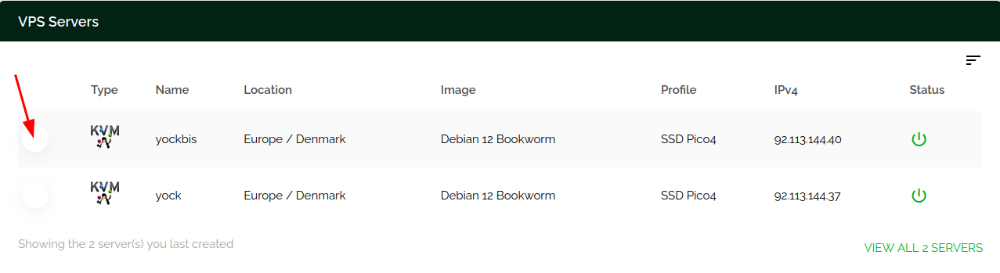{: .normal}

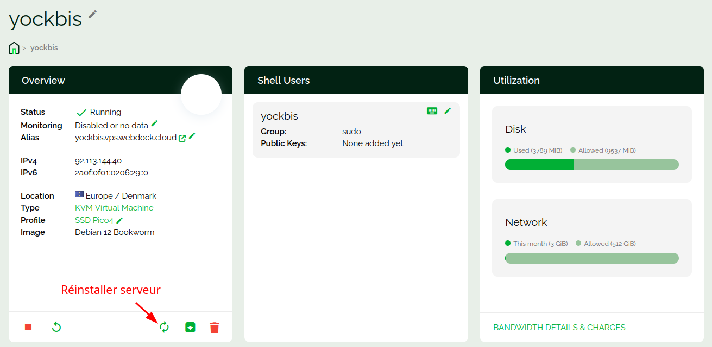{: .normal}

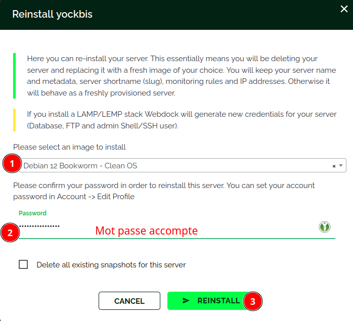{: width="500" .normal}

Après quelques minutes...  
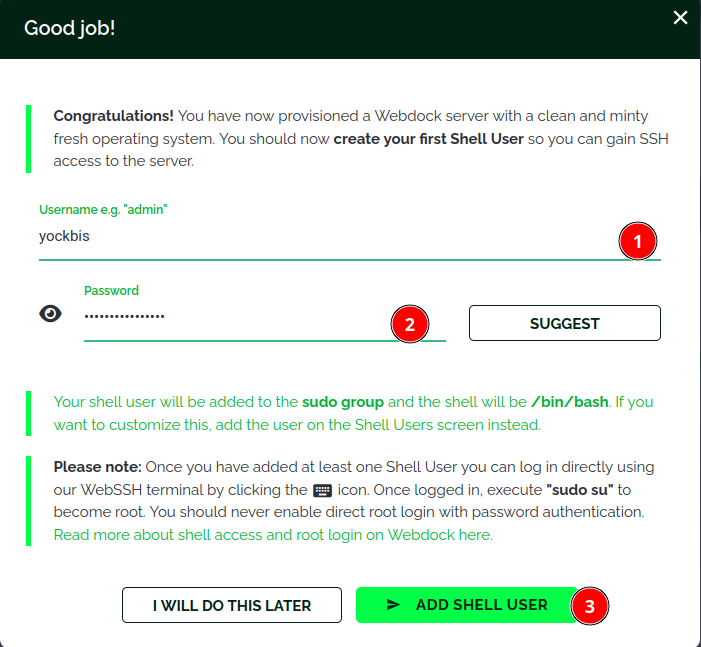{: width="500" .normal}

Le VPS yockbis  
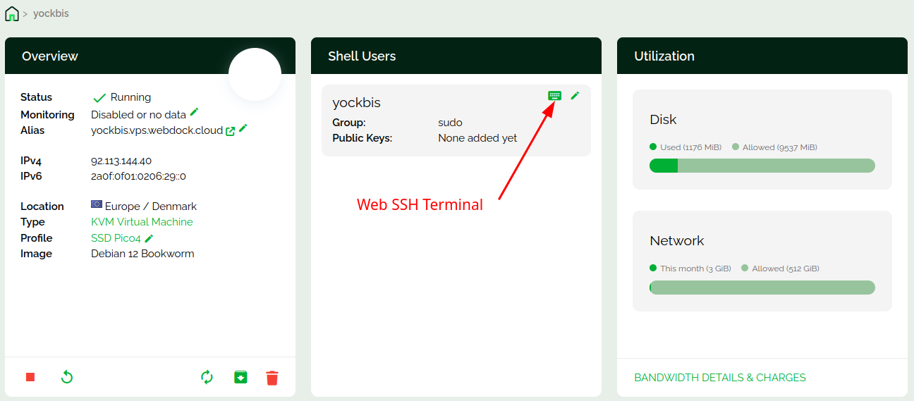{: .normal}

Ouverture en mode Web Terminal (<https://webdock.io/en/dash/webssh/yockbis/yockbis>) est dépendante du paramétrage navigateur, il peut ne pas fonctionner si la sécutité navigateur est élevée   
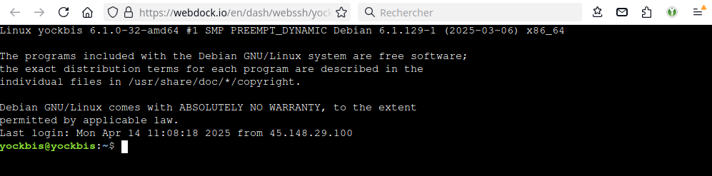{: width="500" .normal}

### Connexion SSH avec clé

Se connecter sur un terminal web (<https://webdock.io/en/dash/webssh/yockbis/yockbis>)  

Ajouter la clé publique `~/.ssh/vps-yockbis.pub`  

    echo "ssh-ed25519 AAAAC3NzaC1lZDI1NTE5AAAAIObDm+2vx7qUDuMnJaKH9NcULmT1OgmSAOKXL+G9jKkr yann@PC1
" >> .ssh/authorized_keys

Modifier le port sshd  55040

    sudo nano /etc/ssh/sshd_config

Les paramètres pour une connexion SSH avec clé est sans mot de passe

```
Port 55040
# Pour désactiver les mots de passe en texte clair transmis par tunnel, il faut changer pour no ici !
PasswordAuthentication no 
# Positionné à "no" par défaut dans la création des VPS Webdock
```

Redémarrer le serveur sshd

    sudo systemctl restart sshd

### Poste linux appelant

Tester la connexion ssh depuis le poste linux

    ssh -p 55040 -i ~/.ssh/vps-yockbis yockbis@92.113.144.40 

Sur le poste linux, ajout site "yockbis" à  FileZilla 

* Site: yockbis  
* SFTP protocol
    * Hôte: 92.113.144.40
    * Port: 55040
* Authentification: Fichier clef
    * Utilisateur: yockbis
    * Fichier clef: /home/yann/.ssh/vps-yockbis


### Gestion utilisateur

Créer les droits pour l'utilisateur courant

```bash
echo "$USER ALL=(ALL) NOPASSWD:ALL" |sudo tee /etc/sudoers.d/90-utilisateur
```

Supprimer utilisateur debian et ses droits sudo 

```bash
sudo userdel debian
sudo rm -r /home/debian/
sudo rm /etc/sudoers.d/90-cloud-init-users
```

### Mise à jour

Mise à jour Debian

```bash
sudo apt update
sudo apt upgrade
```

### Motd

Afficher lors de la connexion SSH , `/etc/motd`

```
 __      __     _        _           _    __   __ ___  ___ 
 \ \    / /___ | |__  __| | ___  __ | |__ \ \ / /| _ \/ __|
  \ \/\/ // -_)| '_ \/ _` |/ _ \/ _|| / /  \ V / |  _/\__ \
   \_/\_/ \___||_.__/\__,_|\___/\__||_\_\   \_/  |_|  |___/
                 _    _     _                              
  _  _  ___  __ | |__| |__ (_) ___                         
 | || |/ _ \/ _|| / /| '_ \| |(_-<                         
  \_, |\___/\__||_\_\|_.__/|_|/__/                         
  |__/                                                     
  ___  ___     _  _  ____    _  _ _   _ _    _ _    __     
 / _ \|_  )   / |/ ||__ /   / || | | | | |  | | |  /  \    
 \_, / / /  _ | || | |_ \ _ | ||_  _||_  _|_|_  _|| () |   
  /_/ /___|(_)|_||_||___/(_)|_|  |_|   |_|(_) |_|  \__/    
```

### Hostname

Vérification : `hostnamectl`

```
 Static hostname: yockbis
       Icon name: computer-vm
         Chassis: vm 🖴
      Machine ID: 16a859cdc6954c2883e54d222b71a4a5
         Boot ID: 869e5d195bef412c86923b2fc3191450
  Virtualization: kvm
Operating System: Debian GNU/Linux 12 (bookworm)  
          Kernel: Linux 6.1.0-37-amd64
    Architecture: x86-64
 Hardware Vendor: QEMU
  Hardware Model: Standard PC _Q35 + ICH9, 2009_
Firmware Version: unknown
```

### Parefeu

Installation Debian / Ubuntu
	

```shell
sudo apt install ufw
```

Les règles

```shell
sudo ufw allow 55040/tcp  # port SSH
sudo ufw allow http       # port 80
sudo ufw allow https      # port 443
```

Activer le parefeu


```shell
sudo ufw enable
```

## Infos

### Services actifs

lister les services actifs: `systemctl list-units --type=service --state=running`

```
  UNIT                       LOAD   ACTIVE SUB     DESCRIPTION                                   
  cron.service               loaded active running Regular background program processing daemon
  dbus.service               loaded active running D-Bus System Message Bus
  exim4.service              loaded active running LSB: exim Mail Transport Agent
  getty@tty1.service         loaded active running Getty on tty1
  incus-agent.service        loaded active running Incus - agent
  serial-getty@ttyS0.service loaded active running Serial Getty on ttyS0
  ssh.service                loaded active running OpenBSD Secure Shell server
  systemd-journald.service   loaded active running Journal Service
  systemd-logind.service     loaded active running User Login Management
  systemd-networkd.service   loaded active running Network Configuration
  systemd-resolved.service   loaded active running Network Name Resolution
  systemd-udevd.service      loaded active running Rule-based Manager for Device Events and Files
  user@1001.service          loaded active running User Manager for UID 1001

LOAD   = Reflects whether the unit definition was properly loaded.
ACTIVE = The high-level unit activation state, i.e. generalization of SUB.
SUB    = The low-level unit activation state, values depend on unit type.
13 loaded units listed.
```

### Réseau systemd-network

Le fichier de configuration: `/etc/systemd/network/10-cloud-init-eth0.network`

```
[Address]
Address=2a0f:0f01:0206:29::0/124

[Address]
Address=92.113.144.40/32

[Match]
Name=eth0

[Network]
DHCP=no
DNS=8.8.8.8 1.1.1.1 2001:4860:4860::8888 2606:4700:4700::1111


[Route]
Gateway=169.254.255.1
GatewayOnLink=True

[Route]
Gateway=fe80::1
```

## Webdock - Domaine xoyaz.xyz

### OVH - Zone DNS

On a besoin des adresses IPV4 et IPV6 du serveur webdock yockbis

Fournisseur OVH, zone dns xoyaz.xyz

```
$TTL 3600
@	IN SOA dns106.ovh.net. tech.ovh.net. (2025081101 86400 3600 3600000 300)
        IN NS     ns106.ovh.net.
        IN NS     dns106.ovh.net.
        IN A      92.113.144.40
        IN AAAA   2a0f:f01:206:29::
```

### Webdock - Reverse DNS

{: .normal}  

Aller dans la rubrique **Manage Server Identity**   
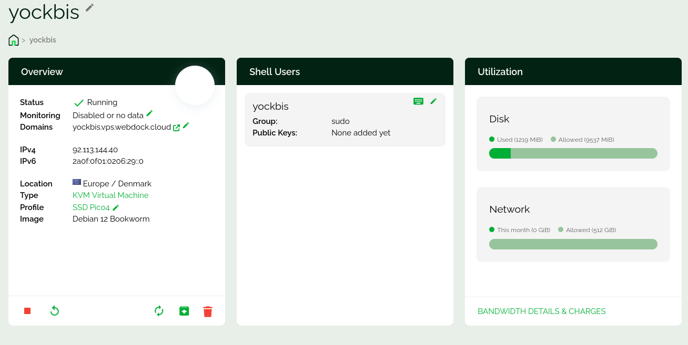{: .normal}  
{: .normal}  

Dans **"Main domain"**  on saisit **xoyaz.xyz** (fournisseur domaine doit être opérationnel)  
Puis cliquer sur **CHECKS DOMAINS**    
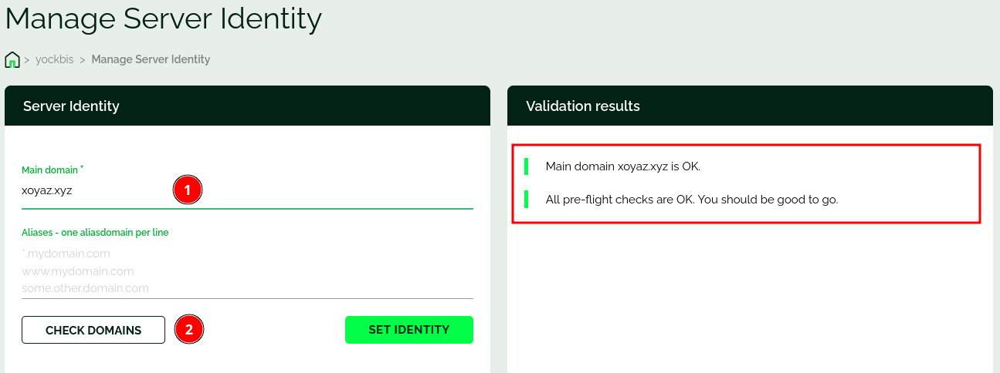{: .normal}  
puis sur **SET IDENTITY** et après quelques instants..  
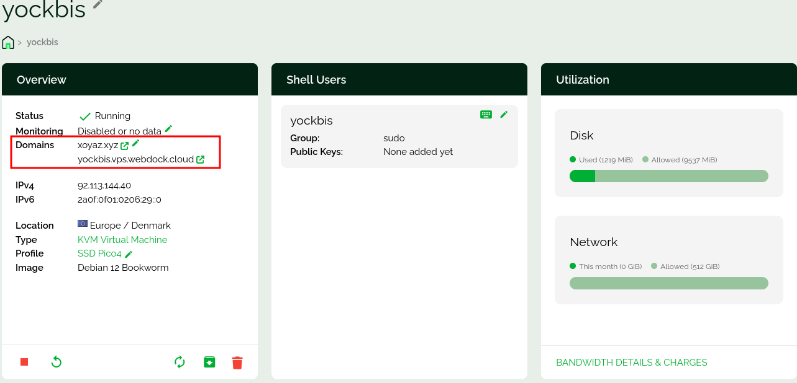{: .normal}  

Vérification depuis un autre poste sur internet  
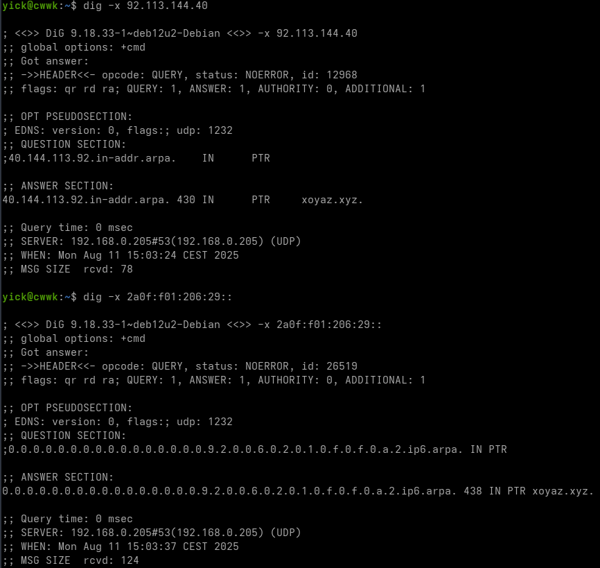{: .normal}  

### Serveur caddy

[Caddy serveur + PHP sur Debian 12 bookworm](/posts/Caddy_serveur_debian_bookworm/)

Caddy et PHP8.3 installés

Le fichier `/etc/caddy/Caddyfile`

```
xoyaz.xyz {
	# Set this path to your site's directory.
	root * /usr/share/caddy
    encode gzip zstd
    php_fastcgi unix//run/php/php8.3-fpm.sock
	# Enable the static file server.
	file_server
}
```

Fichier PHP

```shell
echo "<?php phpinfo(); ?>" | sudo tee /usr/share/caddy/info.php
```

Redémarrer le serveur caddy

```shell
sudo systemctl restart caddy
```

Vérifier sur le lien <https://xoyaz.xyz/info.php>


## Snapshots

>Les snapshots sont créés automatiquemnt chaque jour (Daily) et une fois par semaine (Weekly)
{: .prompt-info }

### Création manuelle

Se connecter sur son compte à l'adresse <https://webdock.io>  
Cliquer sur le VPS yockbis et dans **Server Management** sur **Snapshots**  
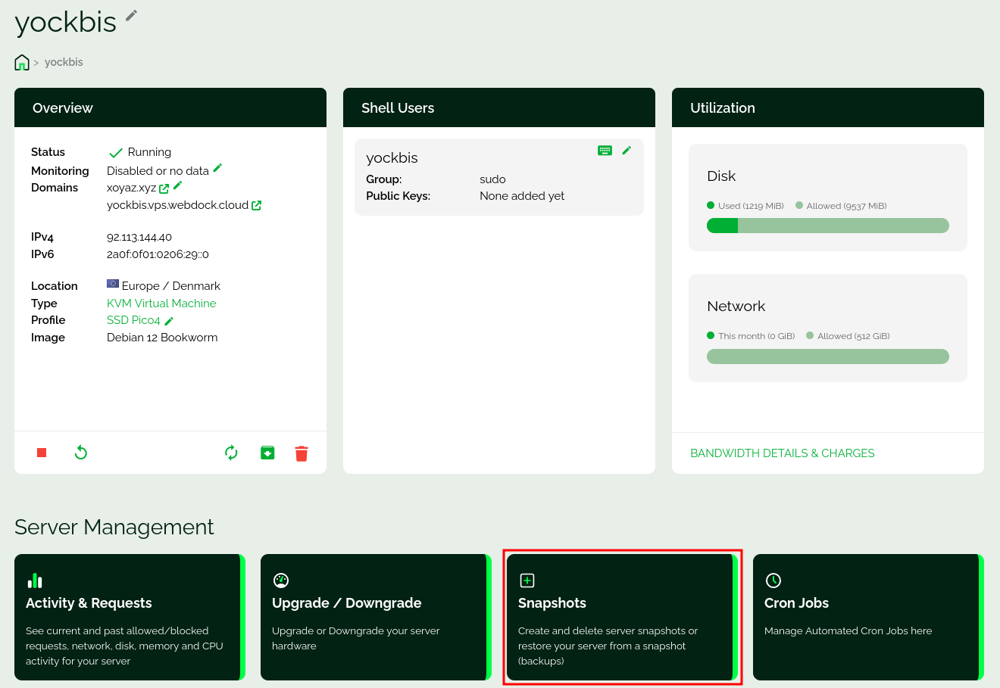{: .normal}  

Donner un nom au snapshot: **yockbis20250811** puis cliquer sur le bouton `> CREATE SNAPSHOT`  
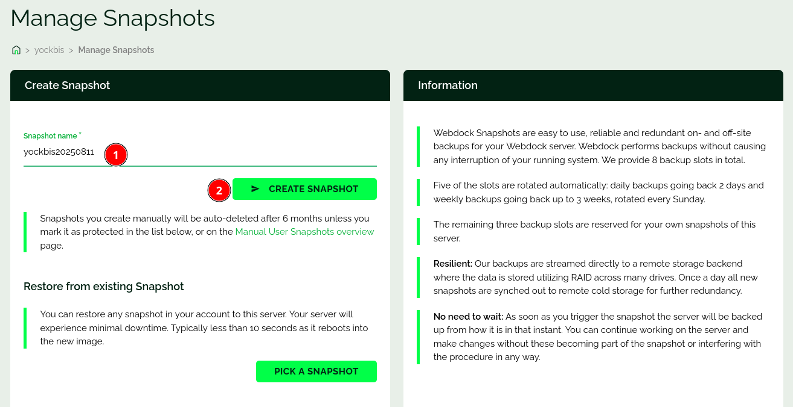{: .normal}  
Message...  
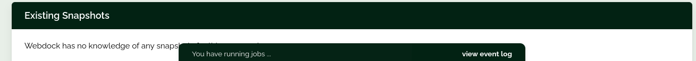{: .normal}   
Après quelques minutes, temps de création du snapshot   
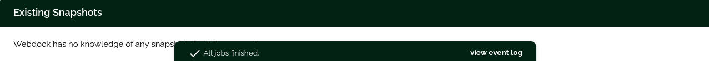{: .normal}  
Si vous êtes resté sur la page web, il faut la rafraîchir   
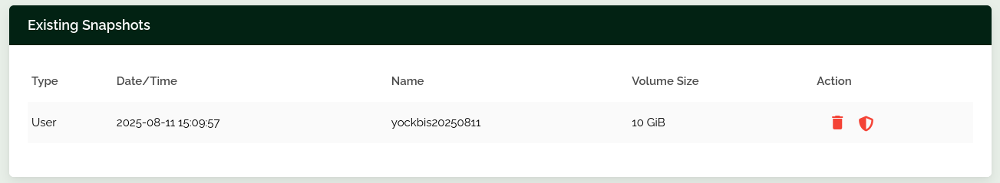{: .normal}  

>__Les snapshots que vous créez manuellement seront effacés automatiquement après 6 mois__ à moins que vous ne le marquiez comme protégé dans la liste ci-dessous, ou sur la page [Manual User Snapshots overview](https://webdock.io/en/dash/servers/snapshots).
{: .prompt-tip }

Un snapshot protégé  
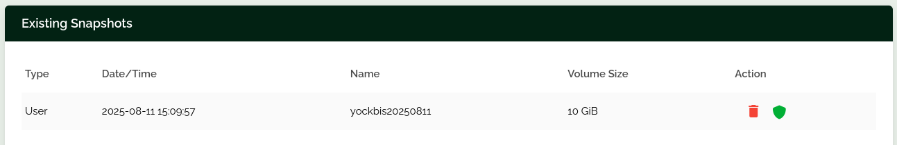{: .normal}  

