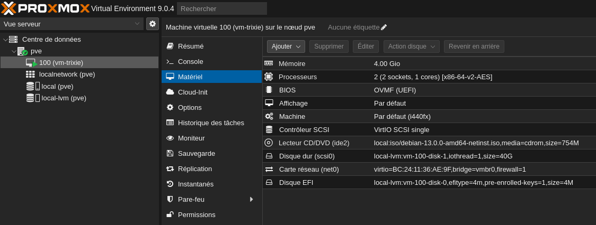
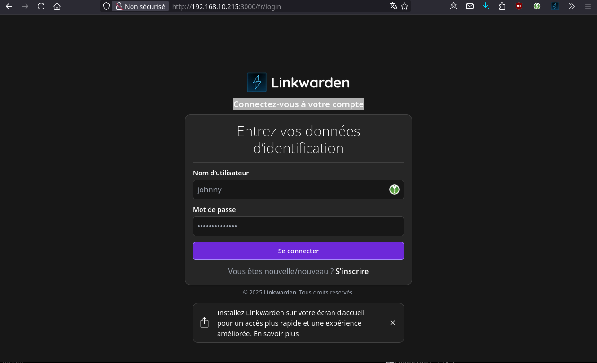
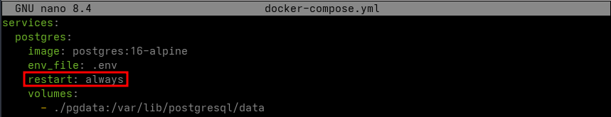

+++
title = 'Proxmox - VM debian 13 trixie + Linkwarden'
date = 2025-08-12
categories = ['debian']
+++
*Proxmox machine virtuelle Debian 13. Linkwarden est un gestionnaire de liens open-source robuste et polyvalent, conçu pour aider les utilisateurs à organiser, sauvegarder et retrouver facilement leurs liens favoris.*

## vm-trixie

Utilisateur: rix/rix49  


La configuration  VM  
{: .normal}  
Activer "Démarrer à l'amorçage" dans les "Options"  

**SSH clés**  
Port: 55216  
ssh fichier: vm-trixie  

**IP statique**  
Réseau: `/etc/network/interfaces`

```
# This file describes the network interfaces available on your system
# and how to activate them. For more information, see interfaces(5).

source /etc/network/interfaces.d/*

# The loopback network interface
auto lo
iface lo inet loopback

# The primary network interface
allow-hotplug ens18
#iface ens18 inet dhcp
iface ens18 inet static
   address 192.168.0.216/24 
   gateway 192.168.0.205
   dns-nameservers 192.168.0.205
# This is an autoconfigured IPv6 interface
iface ens18 inet6 auto
```

**sudo**  
Passer en mode root: `su -`  
Récapitulatif des commandes

```shell
apt install sudo
echo "rix     ALL=(ALL) NOPASSWD: ALL" >> /etc/sudoers.d/10-rix
```

## Outils

### nodejs, npm et yarn

**node et npm**

```shell
sudo apt install nodejs npm -y
```

Versions: `nodejs --version && npm --version`  
*v20.19.2*  
*9.2.0*  

**yarn**  

```shell
sudo npm install --global yarn 
```

Version: `yarn --version`  
*1.22.22*

### docker et docker-compose

**docker**  

```shell
# Avant d'installer Docker, assurez-vous que votre système Debian est à jou
sudo apt update && sudo apt upgrade -y
# installer les paquets nécessaires pour permettre à apt d'utiliser un dépôt sur HTTPS
sudo apt install apt-transport-https ca-certificates curl gnupg2 -y
# Comment installer le dernier docker dans Debian 13 trixie
sudo apt install  docker-cli docker.io
```

Version: `docker --version`  
*Docker version 26.1.5+dfsg1, build a72d7cd*

**docker-compose**  
Relever la dernière version docker-compose lien <https://github.com/docker/compose/releases>  
**2.39.2** août 2025  
Passer en mode root: `sudo -s`

```shell
curl -L "https://github.com/docker/compose/releases/download/v2.39.2/docker-compose-$(uname -s)-$(uname -m)" -o /usr/local/bin/docker-compose
chmod +x /usr/local/bin/docker-compose
```

Version: `docker-compose --version`  
*Docker Compose version v2.39.2*

## Linkwarden

*Linkwarden est un gestionnaire de liens open-source robuste et polyvalent, conçu pour aider les utilisateurs à organiser, sauvegarder et retrouver facilement leurs liens favoris.  
Linkwarden a des exigences matérielles minimales - il a été testé sur un VPS avec 4Go de mémoire.*

Lien <https://docs.linkwarden.app>

### Exigences

* Docker
* Curl
* Nano

### Installation

1 - Télécharger les fichiers requis

```shell
mkdir linkwarden && cd linkwarden
curl -O https://raw.githubusercontent.com/linkwarden/linkwarden/refs/heads/main/docker-compose.yml
curl -L https://raw.githubusercontent.com/linkwarden/linkwarden/refs/heads/main/.env.sample -o ".env"
```

2 - Configurer les variables d'environnement

    nano .env

Les variables d'environnement requises sont :

```
NEXTAUTH_URL=http://localhost:3000/api/v1/auth
NEXTAUTH_SECRET=VERY_SENSITIVE_SECRET
MEILI_MASTER_KEY=VERY_SENSITIVE_MEILI_MASTER_KEY
POSTGRES_PASSWORD=CUSTOM_POSTGRES_PASSWORD
```

La seule chose que vous devez changer ici est **NEXTAAUTH_SECRET**, **POSTGRES_PASSWORD**, et **MEILI_MASTER_KEY**, ils devraient tous être des phrases secrètes différentes. La phrase doit être enveloppée en guillemets simples ou doubles si des caractères spéciaux sont utilisés.

La NEXTAUTH_URL ne doit être changée que si vous l'hébergez ailleurs.

3 - Exécution

Dans le dossier principal (où vous avez créé le fichier .env), lancez simplement ce qui suit :

```shell
sudo docker-compose up
```

Après quelques minutes (selon votre connexion Internet), vous pouvez accéder à Linkwarden via <http://localhost:3000> (ou le nom d'hôte sur lequel vous avez déployé Linkwarden).

Depuis un autre poste sur le réseau ayant un accès SSH acec clés

```shell
ssh -L 9500:127.0.0.1:3000 rix@192.168.0.216 -p 55216 -i /home/yann/.ssh/vm-trixie
```

{: .normal}

Après avoir créer un compte  
{: .normal}

[A Step-by-Step Guide How to Start docker-compose Container at Boot](https://jason19970210.medium.com/a-step-by-step-how-to-start-docker-compose-container-at-boot-effe9964e57f)  
{: .normal}

### cwwk - linkwarden

* [Extension firefox](https://docs.linkwarden.app/getting-started/browser-extension)